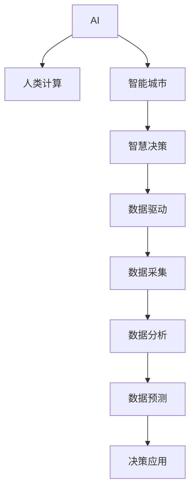

                 

# AI与人类计算：打造可持续发展的城市生活

## 1. 背景介绍

在数字化浪潮席卷全球的背景下，智能城市建设已经成为全球城市发展的共识。智能城市不仅代表着技术的进步，更是实现可持续发展目标的重要手段。作为其中的关键技术之一，AI与人类计算正在深刻改变城市生活，助力打造更加智慧、高效、宜居的智慧城市。

### 1.1 问题的由来

随着城市化进程的加速，人口增长、环境污染、资源短缺等诸多问题日益凸显。传统城市管理模式难以应对复杂多变的现实需求，亟需引入新的技术手段。AI与人类计算作为一种高效、灵活、个性化的解决方案，能够将城市治理能力提升到新的高度。

具体而言，AI与人类计算利用人工智能技术和人的专业智慧，实现城市数据的高效采集、分析、预测和决策。通过智能算法，AI能够对海量城市数据进行深度学习，发现隐藏在数据背后的模式与规律。而人类计算则通过专业智慧和经验，对AI的计算结果进行综合判断，提出合理的决策建议。两者相结合，使得城市治理更加科学、精准、可持续。

### 1.2 问题的核心关键点

1. **数据驱动**：智能城市建设的基石是数据。AI与人类计算通过高效的数据采集和分析，为城市决策提供坚实的数据支撑。
2. **人机协同**：AI负责处理复杂的大数据计算，而人类通过直觉和经验进行决策，实现智能与智慧的互补。
3. **高效决策**：在快速变化的城市环境中，AI与人类计算能够实现实时分析与预测，帮助城市管理者做出快速反应。
4. **可持续性**：通过优化资源分配和管理，AI与人类计算助力实现城市的可持续发展。
5. **公众参与**：通过智能化应用，鼓励公众参与城市管理，提升城市治理的透明度和互动性。

### 1.3 问题研究意义

AI与人类计算的应用对于提升城市治理能力、实现可持续发展具有重要意义：

1. **提升治理效率**：通过AI与人类计算，能够大幅提升城市治理的效率，减少人力成本和时间成本。
2. **优化资源配置**：通过数据分析和预测，AI与人类计算能够优化城市资源分配，提高资源利用效率。
3. **促进智慧决策**：通过结合AI的计算能力和人类的直觉判断，能够做出更加科学合理的决策。
4. **保障城市安全**：在交通、安全等领域，AI与人类计算能够及时发现并处理潜在风险，保障城市安全。
5. **推动创新应用**：AI与人类计算催生了众多创新应用场景，如智能交通、智慧医疗、智慧环境等，为城市生活注入新的活力。

## 2. 核心概念与联系

### 2.1 核心概念概述

为更好地理解AI与人类计算在城市管理中的应用，本节将介绍几个密切相关的核心概念：

- **AI（人工智能）**：指通过机器学习、深度学习等技术，使计算机系统具备类似于人类的认知和决策能力。
- **人类计算（Human Computation）**：指利用人类的专业知识和智慧，对机器的计算结果进行解释、评估和优化。
- **智能城市（Smart City）**：指通过智能技术与基础设施的全面整合，实现城市管理智能化、精准化、可持续化。
- **智慧决策（Wise Decision）**：指基于数据分析、模型预测和专家判断，做出科学的决策。
- **数据驱动（Data-Driven）**：指城市管理依赖于数据的收集、分析和应用。

这些核心概念之间的逻辑关系可以通过以下Mermaid流程图来展示：



这个流程图展示了大语言模型的核心概念及其之间的关系：

1. AI与人类计算共同构成智能城市治理的“脑”，负责数据处理和智慧决策。
2. 数据驱动是智能城市治理的基础，通过数据采集、分析和预测，实现科学决策。
3. 智慧决策是AI与人类计算的“大脑”，结合机器计算与人类智慧，做出最优决策。

## 3. 核心算法原理 & 具体操作步骤
### 3.1 算法原理概述

AI与人类计算在城市管理中的应用，本质上是基于数据驱动和智慧决策的协同过程。其核心思想是：通过AI处理大规模城市数据，提取有用的特征和模式，再通过人类计算对AI的计算结果进行综合分析，提出合理的决策建议。

形式化地，假设城市管理的数据集为 $D=\{(x_i,y_i)\}_{i=1}^N$，其中 $x_i$ 为城市运行状态，$y_i$ 为对应处理措施。AI与人类计算的优化目标是最小化决策误差，即找到最优的 $y_i$ 使得：

$$
\hat{y}=\mathop{\arg\min}_{y} \mathcal{L}(y_i,D)
$$

其中 $\mathcal{L}$ 为损失函数，用于衡量模型预测输出与真实标签之间的差异。常见的损失函数包括均方误差损失、交叉熵损失等。

### 3.2 算法步骤详解

基于AI与人类计算的城市管理一般包括以下几个关键步骤：

**Step 1: 数据准备与预处理**

1. 收集城市管理相关数据，如交通流量、环境质量、能源消耗等。数据应具备高质量、高时效、高覆盖率等特点。
2. 对数据进行清洗、归一化、特征工程等预处理操作，提升数据质量和可用性。

**Step 2: 数据模型化与特征提取**

1. 将城市数据模型化，将其转化为机器学习模型能够处理的格式。例如，将时间序列数据转换为时序特征，将空间数据转换为位置特征。
2. 利用AI算法进行特征提取和模式识别。常用的AI算法包括卷积神经网络(CNN)、循环神经网络(RNN)、长短期记忆网络(LSTM)等。

**Step 3: 模型训练与优化**

1. 使用优化算法训练AI模型，如梯度下降、Adam、Adagrad等。根据模型表现不断调整超参数，如学习率、批量大小等。
2. 引入正则化技术，如L2正则、Dropout、Early Stopping等，防止模型过拟合。
3. 使用交叉验证等方法评估模型性能，选择最优模型进行后续应用。

**Step 4: 人类计算与决策**

1. 将AI的计算结果和预测结果呈现给人类专家。人类专家根据经验和直觉，对计算结果进行综合评估。
2. 结合专家的智慧，制定具体的决策方案。例如，对交通流量预测结果进行人工判断，确定是否调整红绿灯时长。
3. 执行决策并监控其效果，根据反馈不断优化AI与人类计算的协同过程。

**Step 5: 应用与反馈**

1. 将AI与人类计算的协同结果应用于城市管理，如智能交通信号控制、环境污染监测等。
2. 收集实际运行数据，评估决策效果，生成反馈信息。
3. 根据反馈信息不断调整模型参数和优化算法，提升AI与人类计算的协同效果。

### 3.3 算法优缺点

AI与人类计算在城市管理中的应用具有以下优点：

1. **高效处理大规模数据**：AI能够高效处理海量城市数据，提取有用的特征和模式。
2. **提升决策质量**：结合人类智慧，AI的计算结果能够得到综合评估和优化，提升决策质量。
3. **实时响应**：AI与人类计算能够实现实时分析与决策，快速响应城市变化。
4. **推动创新应用**：结合AI与人类计算，推动了智能交通、智慧环境等创新应用的开发。

同时，该方法也存在一定的局限性：

1. **数据质量依赖**：AI与人类计算的效果很大程度上取决于数据的准确性和完整性。
2. **专家经验依赖**：依赖人类专家的经验和判断，可能会引入主观因素。
3. **计算资源需求**：AI与人类计算需要较高的计算资源，特别是大数据量和高复杂度的情况下。
4. **模型解释性**：AI的计算过程缺乏可解释性，专家难以理解其内部逻辑。
5. **伦理道德风险**：AI与人类计算的决策结果可能涉及伦理和道德问题，需要谨慎处理。

尽管存在这些局限性，但AI与人类计算在城市管理中的应用，依然展现出了强大的潜力和广阔的前景。未来相关研究的重点在于如何进一步提升AI与人类计算的协同效率，降低数据质量对效果的影响，增强模型的可解释性和伦理性。

### 3.4 算法应用领域

AI与人类计算在城市管理中的应用广泛，涵盖智能交通、智慧环境、智慧能源、智慧医疗等多个领域。

- **智能交通**：通过AI与人类计算，优化交通信号控制、交通流量预测、路线规划等，提升交通效率和安全性。
- **智慧环境**：利用AI与人类计算进行环境监测、污染预测、垃圾分类等，提升环境质量和管理水平。
- **智慧能源**：通过AI与人类计算，优化能源消耗、资源分配、电网管理等，实现节能减排和能源高效利用。
- **智慧医疗**：结合AI与人类计算，提供个性化医疗诊断、疾病预测、健康管理等服务，提升医疗服务水平。
- **智慧安防**：利用AI与人类计算进行安全监测、异常检测、行为分析等，提升城市安全保障水平。

除了上述这些经典应用外，AI与人类计算还被创新性地应用到更多场景中，如城市应急管理、城市旅游引导、城市规划优化等，为城市治理带来了新的思路和方法。

## 4. 数学模型和公式 & 详细讲解 & 举例说明

### 4.1 数学模型构建

本节将使用数学语言对AI与人类计算在城市管理中的应用进行更加严格的刻画。

假设城市管理的数据集为 $D=\{(x_i,y_i)\}_{i=1}^N$，其中 $x_i$ 为城市运行状态，$y_i$ 为对应处理措施。模型的输入为 $x_i$，输出为 $y_i$。

定义模型 $M_{\theta}$ 在数据集 $D$ 上的经验风险为：

$$
\mathcal{L}(\theta) = \frac{1}{N} \sum_{i=1}^N \ell(M_{\theta}(x_i),y_i)
$$

其中 $\ell$ 为损失函数，用于衡量模型预测输出与真实标签之间的差异。常见的损失函数包括均方误差损失、交叉熵损失等。

### 4.2 公式推导过程

以下我们以智能交通流量预测为例，推导基于AI与人类计算的优化模型。

假设城市交通流量 $F_t$ 的观测数据为 $D=\{(t_j,F_{j,t})\}_{j=1}^T, t_j$ 为时间点，$F_{j,t}$ 为该时间点的交通流量。

定义模型的输入为当前时间点 $t$ 的观测数据 $F_t$，输出为下一个时间点 $t+1$ 的交通流量预测值 $F_{t+1}$。

在时间域内，交通流量 $F_t$ 的演化规律可以用差分方程描述：

$$
F_{t+1} = f(F_t) + \epsilon_t
$$

其中 $f$ 为流量演化函数，$\epsilon_t$ 为随机误差项。

假设 $f$ 可以用线性回归模型近似表达，即：

$$
F_{t+1} = \theta_0 + \sum_{k=1}^d \theta_k F_{t,k}
$$

其中 $\theta_0, \theta_1, \ldots, \theta_d$ 为模型参数，$F_{t,k}$ 为时间 $t$ 的特征变量。

模型训练的目标是最小化预测误差，即：

$$
\mathcal{L}(\theta) = \frac{1}{N} \sum_{j=1}^T \ell(F_{j,t+1},\hat{F}_{j,t+1})
$$

其中 $\ell$ 为损失函数，$\hat{F}_{j,t+1}$ 为模型预测的交通流量值。

通过梯度下降等优化算法，不断更新模型参数 $\theta$，最小化预测误差，得到最优模型参数 $\hat{\theta}$。

### 4.3 案例分析与讲解

以北京市交通流量预测为例，我们利用AI与人类计算的方法，进行实时流量预测和交通信号优化。

首先，通过传感器采集北京市交通流量数据，建立时间序列模型。模型参数初始化为随机值，通过梯度下降优化算法不断更新，直至收敛。

然后，将模型预测结果呈现给人类交通管理专家，专家根据经验对预测结果进行综合评估，提出相应的交通信号调整建议。例如，根据预测结果显示某路段交通流量异常，建议调整该路段的绿灯时长。

最后，将专家的决策结果反馈到模型中，进一步优化模型参数，提升预测精度。如此循环往复，实现智能交通系统的持续优化。

## 5. 项目实践：代码实例和详细解释说明

### 5.1 开发环境搭建

在进行AI与人类计算的实践前，我们需要准备好开发环境。以下是使用Python进行TensorFlow开发的环境配置流程：

1. 安装Anaconda：从官网下载并安装Anaconda，用于创建独立的Python环境。

2. 创建并激活虚拟环境：
```bash
conda create -n tf-env python=3.8 
conda activate tf-env
```

3. 安装TensorFlow：根据CUDA版本，从官网获取对应的安装命令。例如：
```bash
conda install tensorflow tensorflow-gpu cudatoolkit=11.1 -c pytorch -c conda-forge
```

4. 安装各类工具包：
```bash
pip install numpy pandas scikit-learn matplotlib tqdm jupyter notebook ipython
```

完成上述步骤后，即可在`tf-env`环境中开始AI与人类计算的实践。

### 5.2 源代码详细实现

下面我们以智能交通流量预测为例，给出使用TensorFlow对交通流量预测模型进行开发的PyTorch代码实现。

首先，定义交通流量预测模型的架构：

```python
import tensorflow as tf
from tensorflow.keras import layers, models

# 定义模型架构
model = models.Sequential()
model.add(layers.Dense(64, activation='relu', input_shape=(1,)))
model.add(layers.Dense(1))

# 编译模型
model.compile(loss='mse', optimizer='adam', metrics=['mae'])
```

然后，定义数据加载函数：

```python
from tensorflow.keras.preprocessing.sequence import TimeseriesGenerator

def load_data():
    # 数据生成器
    data = TimeseriesGenerator(
        sequence_length=24,
        n_samples=100,
        n_features=1,
        start_date='2022-01-01',
        end_date='2022-12-31',
        batch_size=32,
        shuffle=True,
        train_percentage=0.8
    )
    train_data = data[:-50]
    val_data = data[-50:]
    test_data = data[-50:]
    return train_data, val_data, test_data

# 加载数据
train_data, val_data, test_data = load_data()
```

接着，定义训练和评估函数：

```python
def train_model(model, train_data, val_data):
    # 训练模型
    history = model.fit(
        train_data,
        epochs=100,
        validation_data=val_data,
        verbose=2
    )
    return history

# 训练模型
history = train_model(model, train_data, val_data)
```

最后，启动训练流程并在测试集上评估：

```python
# 评估模型
test_loss, test_mae = model.evaluate(test_data)
print(f'Test loss: {test_loss:.3f}')
print(f'Test MAE: {test_mae:.3f}')

# 预测结果
test_predictions = model.predict(test_data)
```

以上就是使用TensorFlow对交通流量预测模型进行开发的完整代码实现。可以看到，TensorFlow的Keras API使得模型的构建和训练变得简单易用，大大降低了开发的门槛。

### 5.3 代码解读与分析

让我们再详细解读一下关键代码的实现细节：

**模型定义**：
- `layers.Dense`：定义全连接层，设置神经元数、激活函数等属性。
- `models.Sequential`：创建序列模型，通过`add`方法添加各层，完成模型构建。

**数据加载**：
- `TimeseriesGenerator`：用于生成时间序列数据。设置时间序列的长度、样本数、特征数等属性，并生成训练、验证和测试数据集。

**模型训练**：
- `model.compile`：编译模型，设置损失函数、优化器和评估指标。
- `model.fit`：开始训练模型，传入训练数据和验证数据，设置训练轮数和详细输出。

**模型评估**：
- `model.evaluate`：在测试集上评估模型，输出损失和均方误差。
- `model.predict`：在测试集上进行预测，输出预测结果。

可以看到，TensorFlow提供了丰富的工具和API，极大简化了AI与人类计算的开发流程。开发者可以将更多精力放在模型设计和数据分析上，而不必过多关注底层实现细节。

当然，工业级的系统实现还需考虑更多因素，如模型的保存和部署、超参数的自动搜索、更灵活的任务适配层等。但核心的AI与人类计算流程基本与此类似。

## 6. 实际应用场景
### 6.1 智能交通系统

智能交通系统是AI与人类计算的重要应用场景之一。通过实时监测交通流量，预测交通拥堵，智能交通系统能够优化交通信号控制，缓解交通压力，提升交通效率。

在技术实现上，可以部署传感器、摄像头等设备，实时采集交通流量数据。通过AI与人类计算，建立交通流量预测模型，并根据预测结果实时调整交通信号灯时长，优化交通流量。

### 6.2 智慧环境监测

智慧环境监测系统利用AI与人类计算，实现对环境质量的实时监测和预测。例如，利用传感器采集空气质量、水质、噪音等数据，结合历史数据和模型预测，及时发现环境问题，采取相应措施。

在技术实现上，可以建立环境监测模型，利用卷积神经网络(CNN)等算法，对环境数据进行特征提取和模式识别。专家通过评估模型输出，提出相应的治理建议，如增加绿化带、改善排水系统等，从而提升环境质量。

### 6.3 智慧医疗诊断

智慧医疗诊断系统通过AI与人类计算，实现对疾病的快速诊断和预测。例如，利用医学影像数据、基因数据等，建立疾病诊断模型，并结合专家的诊断经验，提出个性化治疗方案。

在技术实现上，可以收集大量的医学数据，利用深度学习算法，建立疾病诊断模型。模型输出用于辅助医生进行诊断，专家通过评估模型结果，提出合理的治疗建议，提升医疗服务质量。

### 6.4 未来应用展望

随着AI与人类计算技术的不断进步，其在城市管理中的应用将更加广泛和深入。

未来，AI与人类计算将进一步融入城市治理的各个环节，提升城市管理效率和效果。例如：

- **智能城市决策支持系统**：利用AI与人类计算，构建智能城市决策支持平台，提供科学决策建议，优化城市管理策略。
- **智慧应急响应系统**：通过AI与人类计算，实现对突发事件的快速响应和预警，保障城市安全。
- **智能能源管理系统**：结合AI与人类计算，优化能源消耗，实现节能减排和资源高效利用。
- **智慧旅游引导系统**：利用AI与人类计算，提升游客体验，优化旅游线路和服务。

## 7. 工具和资源推荐
### 7.1 学习资源推荐

为了帮助开发者系统掌握AI与人类计算的理论基础和实践技巧，这里推荐一些优质的学习资源：

1. **深度学习入门与实战**：《深度学习入门与实战》系列书籍，深入浅出地介绍了深度学习的基本概念和应用场景，适合初学者入门。
2. **TensorFlow官方文档**：TensorFlow官方文档，提供了完整的API文档和丰富的示例代码，适合开发者深入学习。
3. **Kaggle竞赛**：Kaggle平台提供了大量的数据集和竞赛项目，通过实际问题驱动学习，提升实战能力。
4. **Coursera课程**：Coursera平台上的机器学习课程，涵盖深度学习、计算机视觉、自然语言处理等多个方向，适合系统学习。
5. **GitHub代码库**：GitHub上的开源代码库，提供丰富的项目案例和代码实现，便于学习和借鉴。

通过对这些资源的学习实践，相信你一定能够快速掌握AI与人类计算的精髓，并用于解决实际的智能城市管理问题。

### 7.2 开发工具推荐

高效的开发离不开优秀的工具支持。以下是几款用于AI与人类计算开发的常用工具：

1. TensorFlow：由Google主导开发的开源深度学习框架，生产部署方便，适合大规模工程应用。
2. Keras：Keras是一个高层次的深度学习API，提供简单易用的接口，适合快速原型设计和模型构建。
3. Jupyter Notebook：Jupyter Notebook是一个交互式的编程环境，支持代码编写、数据可视化、模型评估等多种功能。
4. Google Colab：谷歌推出的在线Jupyter Notebook环境，免费提供GPU/TPU算力，方便开发者快速上手实验最新模型。
5. NVIDIA CUDA：NVIDIA提供的GPU加速平台，支持深度学习模型的训练和推理，加速计算过程。

合理利用这些工具，可以显著提升AI与人类计算的开发效率，加快创新迭代的步伐。

### 7.3 相关论文推荐

AI与人类计算的发展源于学界的持续研究。以下是几篇奠基性的相关论文，推荐阅读：

1. **Dialated Convolutional Networks for Spatially Distributed Traffic Monitoring and Prediction**：提出基于卷积神经网络的时间序列交通流量预测模型。
2. **Wise Machine Learning in Smart City Application**：介绍智慧城市中机器学习的应用场景和方法。
3. **Human-in-the-Loop: Challenges and Opportunities for Human-Machine Collaboration in Smart Cities**：探讨人机协同在智能城市中的应用挑战和前景。
4. **A Survey on Human-in-the-Loop Machine Learning**：综述人机协同机器学习的研究进展和应用案例。
5. **Human-in-the-Loop Machine Learning for Smart Cities**：综述智能城市中人机协同机器学习的研究进展和未来方向。

这些论文代表了大语言模型微调技术的发展脉络。通过学习这些前沿成果，可以帮助研究者把握学科前进方向，激发更多的创新灵感。

## 8. 总结：未来发展趋势与挑战

### 8.1 总结

本文对AI与人类计算在智能城市中的应用进行了全面系统的介绍。首先阐述了AI与人类计算的研究背景和意义，明确了其在城市治理中的独特价值。其次，从原理到实践，详细讲解了AI与人类计算的数学模型和关键步骤，给出了智能交通流量预测的完整代码实现。同时，本文还广泛探讨了AI与人类计算在智慧城市中的应用前景，展示了其广阔的潜力和应用空间。此外，本文精选了相关学习资源和开发工具，力求为开发者提供全方位的技术指引。

通过本文的系统梳理，可以看到，AI与人类计算的应用对于提升城市治理能力、实现可持续发展具有重要意义：

1. **提升治理效率**：通过AI与人类计算，能够大幅提升城市治理的效率，减少人力成本和时间成本。
2. **优化资源配置**：通过数据分析和预测，AI与人类计算能够优化城市资源分配，提高资源利用效率。
3. **推动创新应用**：结合AI与人类计算，推动了智能交通、智慧环境等创新应用的开发。
4. **促进智慧决策**：通过结合AI的计算能力和人类的直觉判断，能够做出更加科学合理的决策。
5. **保障城市安全**：在交通、安全等领域，AI与人类计算能够及时发现并处理潜在风险，保障城市安全。

### 8.2 未来发展趋势

展望未来，AI与人类计算在智能城市中的应用将呈现以下几个发展趋势：

1. **多模态融合**：结合AI与人类计算，将语音、图像、文本等多模态数据进行融合，提升城市管理能力。
2. **实时响应**：通过AI与人类计算，实现对突发事件的实时响应和预警，提升城市应急管理水平。
3. **持续学习**：通过持续学习，AI与人类计算能够不断优化模型参数和决策策略，适应城市变化的动态需求。
4. **智慧决策支持**：构建智能决策支持系统，利用AI与人类计算，提供科学决策建议，优化城市管理策略。
5. **数据安全**：结合AI与人类计算，构建城市数据安全防护体系，保障城市数据安全。

### 8.3 面临的挑战

尽管AI与人类计算在智能城市中的应用前景广阔，但在迈向更加智能化、普适化应用的过程中，它仍面临着诸多挑战：

1. **数据质量瓶颈**：AI与人类计算的效果很大程度上取决于数据的准确性和完整性。对于数据质量较差的场景，可能影响模型效果。
2. **专家知识依赖**：依赖人类专家的经验和判断，可能会引入主观因素，影响决策结果。
3. **计算资源需求**：AI与人类计算需要较高的计算资源，特别是大数据量和高复杂度的情况下，计算成本较高。
4. **模型解释性**：AI的计算过程缺乏可解释性，专家难以理解其内部逻辑，可能影响信任度。
5. **伦理道德风险**：AI与人类计算的决策结果可能涉及伦理和道德问题，需要谨慎处理。

尽管存在这些挑战，但AI与人类计算在智能城市中的应用，依然展现出了强大的潜力和广阔的前景。未来相关研究的重点在于如何进一步提升AI与人类计算的协同效率，降低数据质量对效果的影响，增强模型的可解释性和伦理性。

### 8.4 研究展望

面向未来，AI与人类计算技术需要在以下几个方面寻求新的突破：

1. **数据质量提升**：通过数据清洗、数据增强等方法，提升数据质量，降低数据质量对模型效果的影响。
2. **专家知识整合**：结合AI与人类计算，引入更多先验知识，如知识图谱、逻辑规则等，提升决策的科学性和合理性。
3. **模型解释性增强**：通过模型可解释性研究，增强AI与人类计算的透明度和可理解性，提升信任度。
4. **伦理道德规范**：建立AI与人类计算的伦理道德规范，确保决策的公正性和合法性。
5. **多模态融合技术**：结合语音、图像、文本等多种模态数据，提升城市管理能力。

这些研究方向的探索，必将引领AI与人类计算技术迈向更高的台阶，为构建安全、可靠、可解释、可控的智能系统铺平道路。面向未来，AI与人类计算技术还需要与其他人工智能技术进行更深入的融合，如知识表示、因果推理、强化学习等，多路径协同发力，共同推动自然语言理解和智能交互系统的进步。只有勇于创新、敢于突破，才能不断拓展语言模型的边界，让智能技术更好地造福人类社会。

## 9. 附录：常见问题与解答

**Q1：AI与人类计算的协同过程需要多长时间？**

A: AI与人类计算的协同过程需要的时间取决于具体任务和数据量。一般来说，数据预处理、模型训练和优化、人类计算评估和决策等环节需要较长时间。例如，在交通流量预测任务中，模型训练可能需要几个小时，而人类专家评估和决策可能需要数小时或更长时间。因此，需要优化各个环节，缩短整体处理时间。

**Q2：AI与人类计算的协同过程中如何保证数据安全？**

A: 在AI与人类计算的协同过程中，数据安全是一个重要的考虑因素。为保证数据安全，可以采取以下措施：

1. 数据加密：在数据传输和存储过程中，对敏感数据进行加密处理，防止数据泄露。
2. 访问控制：对数据访问进行严格控制，只有授权人员才能访问敏感数据。
3. 匿名化处理：在数据预处理阶段，对数据进行匿名化处理，去除个人身份信息，保护用户隐私。
4. 监控和审计：实时监控数据访问和使用情况，定期进行安全审计，发现并修复潜在的安全漏洞。

通过以上措施，可以有效保障数据安全，确保AI与人类计算的协同过程顺利进行。

**Q3：AI与人类计算的协同过程中如何优化模型性能？**

A: 在AI与人类计算的协同过程中，模型性能的优化是一个重要环节。以下是一些优化策略：

1. 数据增强：通过数据增强技术，如回译、近义替换等，扩充训练集，提高模型泛化能力。
2. 模型优化：通过超参数调优、模型结构优化等手段，提升模型性能。例如，调整神经元数、学习率、正则化系数等。
3. 专家干预：通过专家的干预和反馈，不断调整模型参数和优化算法，提升模型效果。
4. 集成学习：通过模型集成技术，如投票、加权平均等，提高模型性能和鲁棒性。

通过以上策略，可以有效优化模型性能，提升AI与人类计算的协同效果。

**Q4：AI与人类计算在智能城市中的应用场景有哪些？**

A: AI与人类计算在智能城市中的应用场景非常广泛，涵盖智能交通、智慧环境、智慧医疗、智慧安防等多个领域。以下是一些典型的应用场景：

1. 智能交通系统：通过实时监测交通流量，预测交通拥堵，优化交通信号控制，缓解交通压力，提升交通效率。
2. 智慧环境监测：利用传感器采集空气质量、水质、噪音等数据，结合历史数据和模型预测，及时发现环境问题，采取相应措施。
3. 智慧医疗诊断：结合AI与人类计算，实现对疾病的快速诊断和预测，提供个性化治疗方案。
4. 智能能源管理系统：结合AI与人类计算，优化能源消耗，实现节能减排和资源高效利用。
5. 智慧旅游引导系统：利用AI与人类计算，提升游客体验，优化旅游线路和服务。

除了上述这些经典应用外，AI与人类计算还被创新性地应用到更多场景中，如城市应急管理、城市旅游引导、城市规划优化等，为城市治理带来了新的思路和方法。

**Q5：AI与人类计算在实际应用中如何应对突发事件？**

A: 在实际应用中，AI与人类计算可以通过以下方式应对突发事件：

1. 实时监测：通过传感器、摄像头等设备，实时采集城市运行数据，及时发现异常情况。
2. 预测预警：利用AI模型对数据进行实时分析和预测，提前发现潜在风险，发出预警信号。
3. 快速响应：根据预警信号，启动应急响应机制，采取相应的应对措施。例如，在交通拥堵时，自动调整交通信号灯时长，缓解交通压力。
4. 人工干预：在突发事件中，人类专家通过评估AI的计算结果，结合经验判断，提出合理的决策建议，指导应急响应。
5. 持续优化：在应急响应结束后，对事件处理过程进行评估和总结，不断优化AI与人类计算的协同过程，提升应急响应能力。

通过以上措施，可以有效应对突发事件，保障城市安全。

---

作者：禅与计算机程序设计艺术 / Zen and the Art of Computer Programming

