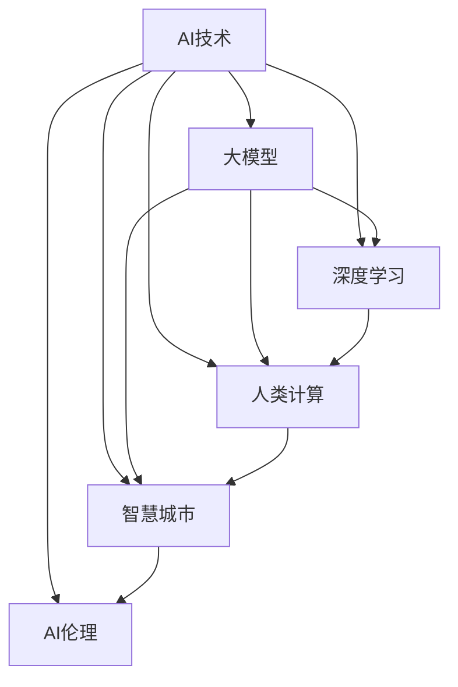

                 

# AI与人类计算：打造可持续发展的城市管理

## 1. 背景介绍

随着科技进步和社会发展，城市管理变得越来越复杂，传统的依靠人力管理模式已经难以应对。这其中，人工智能(AI)技术的引入，为城市管理带来了新的可能。本文旨在探索AI技术在城市管理中的应用，阐述AI与人类计算的结合，探讨如何打造可持续发展的智慧城市。

### 1.1 问题由来

城市管理的复杂性体现在多个方面：人口流动性大、事件类型多样、资源配置复杂、数据量庞大等。这些问题使得传统的城市管理方式难以满足现代城市发展的需求。AI技术的引入，尤其是基于深度学习的大模型，为解决这些问题提供了新的手段。

然而，AI在城市管理中的应用仍存在一些挑战：
- 模型泛化能力有限。AI模型通常在特定场景下表现良好，但对于突发事件和异常情况，效果可能大打折扣。
- 数据隐私与安全问题。城市管理的涉及大量敏感数据，如何保护这些数据的安全和隐私，是应用AI技术时必须要考虑的。
- 社会伦理问题。AI在城市管理中的应用可能带来就业结构变化、数据隐私侵害等问题，需要慎重考虑。

### 1.2 问题核心关键点

AI与人类计算的结合，旨在利用AI的优势，如强大的数据分析能力、快速的推理决策能力，来协助人类进行城市管理，弥补人类计算的不足。主要体现在以下几个方面：

- **数据处理能力**：AI能够处理海量数据，识别模式，提供数据支持的决策依据。
- **实时响应能力**：AI可以快速分析城市动态数据，实时响应突发事件，提升管理效率。
- **智能决策支持**：AI辅助人类进行复杂决策，提供多维度数据分析结果。
- **持续学习与改进**：AI能够不断学习新数据，改进算法，提升模型性能。

通过AI与人类计算的结合，可以提升城市管理的智能化水平，实现更高效、更公平、更可持续的城市管理。

## 2. 核心概念与联系

### 2.1 核心概念概述

本节将介绍几个与AI与人类计算相关的核心概念及其关系：

- **AI技术**：人工智能技术，包括机器学习、深度学习、自然语言处理、计算机视觉等，为城市管理提供数据驱动的决策支持。
- **大模型**：如BERT、GPT、ViT等，通过预训练学习广泛的知识，用于增强AI模型的通用性和泛化能力。
- **深度学习**：基于神经网络，通过层次化特征提取，实现复杂模式识别和数据分析。
- **人类计算**：依赖人类经验、判断和智慧，进行决策和问题解决。
- **智慧城市**：基于新一代信息技术，实现城市信息化、智能化、精细化管理。
- **AI伦理**：涉及算法透明度、数据隐私、就业影响等方面，确保AI应用的安全与公正。

这些概念之间的关系可以通过以下Mermaid流程图来展示：



这个流程图展示了AI技术、大模型、深度学习、人类计算、智慧城市和AI伦理之间的关系：

1. AI技术是城市管理智能化和数字化的基础。
2. 大模型提供了更强的数据处理和模式识别能力，增强了AI技术的通用性和泛化能力。
3. 深度学习是实现复杂模式识别和数据分析的关键技术。
4. 人类计算通过经验判断和智慧决策，与AI技术结合，实现更高效的决策支持。
5. 智慧城市应用了AI技术，实现信息化的城市管理。
6. AI伦理保障了AI应用的公平性、透明性和安全性。

这些概念共同构成了AI与人类计算在城市管理中的应用框架，为其提供了理论和实践依据。

## 3. 核心算法原理 & 具体操作步骤

### 3.1 算法原理概述

AI与人类计算在城市管理中的应用，主要基于以下算法原理：

- **数据收集与预处理**：通过传感器、监控摄像头、GPS等设备，收集城市运行的相关数据，并进行清洗、归一化等预处理操作，为AI模型提供输入。
- **特征提取与建模**：利用深度学习技术，从原始数据中提取高层次特征，建立模型。
- **预测与决策**：通过模型预测城市运行状态，辅助人类进行决策。
- **实时监控与调整**：实时监控城市运行状态，根据反馈调整模型参数和决策策略。
- **多模态融合**：结合不同模态的数据，如视频、音频、文本等，提升模型的综合分析能力。

### 3.2 算法步骤详解

基于AI与人类计算的城市管理应用，通常包括以下关键步骤：

**Step 1: 数据收集与预处理**
- 部署传感器、摄像头、GPS等设备，收集城市运行的相关数据，如交通流量、环境质量、公共设施使用情况等。
- 对收集的数据进行清洗、去噪、归一化等预处理操作，生成可供模型训练的输入。

**Step 2: 特征提取与建模**
- 使用深度学习模型，如CNN、RNN、Transformer等，从原始数据中提取高层次特征。
- 建立AI模型，如预测交通流量的LSTM模型，预测环境质量的GRU模型等。
- 使用大模型，如BERT、GPT，作为特征提取器，提升模型的泛化能力和数据处理能力。

**Step 3: 预测与决策**
- 利用AI模型对城市运行状态进行预测，如交通拥堵情况、环境污染指数等。
- 结合人类经验判断，辅助人类进行决策，如调整交通信号灯、优化能源分配等。
- 实时监控城市运行状态，根据反馈调整模型参数和决策策略。

**Step 4: 实时监控与调整**
- 部署监控系统，实时收集城市运行数据，提供实时监控功能。
- 使用AI模型对实时数据进行分析，提供预警和决策建议。
- 根据实际效果，调整模型参数和决策策略，确保系统的准确性和稳定性。

**Step 5: 多模态融合**
- 结合不同模态的数据，如视频、音频、文本等，提升模型的综合分析能力。
- 使用深度学习技术，如多模态融合网络，将不同模态的数据进行融合，提升模型的鲁棒性和泛化能力。

### 3.3 算法优缺点

基于AI与人类计算的城市管理应用，具有以下优点：

- **高效性**：AI能够快速处理海量数据，提供实时响应，提升管理效率。
- **准确性**：AI模型通过深度学习提取高层次特征，提升预测准确性。
- **鲁棒性**：多模态融合技术提升了模型的鲁棒性，应对突发事件和异常情况更加稳定。
- **可解释性**：结合人类计算，提供决策的逻辑解释，增强系统的透明度和可解释性。

同时，该方法也存在一些局限性：

- **依赖数据质量**：数据的质量和完整性直接影响模型的预测准确性。
- **计算资源需求高**：深度学习模型需要大量的计算资源，可能面临计算瓶颈。
- **模型泛化能力有限**：模型通常依赖于特定场景的训练数据，泛化能力有限。
- **伦理问题**：AI应用可能带来隐私和伦理问题，需要谨慎处理。

尽管存在这些局限性，但就目前而言，AI与人类计算的结合仍是城市管理智能化和可持续发展的有力工具。未来相关研究的重点在于如何进一步降低对数据的依赖，提高模型的泛化能力和计算效率，同时兼顾伦理和安全问题。

### 3.4 算法应用领域

AI与人类计算在城市管理中的应用，已经在多个领域取得了显著成果：

- **交通管理**：AI模型可以预测交通流量，优化交通信号灯控制，减少交通拥堵。
- **环境监测**：使用AI模型预测环境质量，实时监控污染源，提升环境治理效果。
- **公共安全**：AI模型可以对视频进行实时分析，识别异常行为，提升公共安全水平。
- **能源管理**：AI模型可以优化能源分配，提升能源利用效率，降低能耗。
- **应急响应**：AI模型可以实时分析突发事件，提供决策支持，提升应急响应效率。

除了上述这些应用场景外，AI与人类计算在城市管理的其他领域也有广泛应用，如城市规划、灾害预防、智能家居等，为城市管理的智能化和可持续化提供了新的技术路径。

## 4. 数学模型和公式 & 详细讲解 & 举例说明

### 4.1 数学模型构建

本节将使用数学语言对AI与人类计算在城市管理中的应用进行更加严格的刻画。

假设城市运行状态可以用向量 $X=[x_1, x_2, ..., x_n]$ 表示，其中 $x_i$ 为第 $i$ 个指标的数值。模型的预测结果为 $Y=[y_1, y_2, ..., y_m]$，其中 $y_i$ 为第 $i$ 个预测结果。

定义模型 $M_{\theta}$ 在输入 $X$ 上的预测结果为 $Y=M_{\theta}(X)$，其中 $\theta$ 为模型参数。

AI与人类计算的城市管理应用中，模型训练的目标函数可以表示为：

$$
\mathcal{L}(\theta) = \frac{1}{N}\sum_{i=1}^N \|M_{\theta}(X_i)-Y_i\|^2
$$

其中 $\| \cdot \|$ 为向量范数，$N$ 为样本数量。

通过梯度下降等优化算法，最小化损失函数 $\mathcal{L}(\theta)$，更新模型参数 $\theta$，使模型的预测结果尽可能接近实际值。

### 4.2 公式推导过程

以交通流量预测为例，推导LSTM模型的训练过程：

假设交通流量 $x_t$ 可以通过如下LSTM模型进行预测：

$$
h_t = LSTM(x_{t-1}, h_{t-1})
$$

$$
y_t = \sigma(W_{out}h_t + b_{out})
$$

其中 $h_t$ 为第 $t$ 个时间步的LSTM隐藏状态，$y_t$ 为第 $t$ 个时间步的预测结果，$W_{out}$ 和 $b_{out}$ 为线性层权重和偏置，$\sigma$ 为激活函数。

设 $X_t=[x_{t-1}, x_{t-2}, ..., x_1]$ 为历史流量数据，$Y_t=[y_{t-1}, y_{t-2}, ..., y_1]$ 为历史流量标签，则LSTM模型的训练目标函数为：

$$
\mathcal{L}(\theta) = \frac{1}{N}\sum_{t=1}^N \|M_{\theta}(X_t)-Y_t\|^2
$$

其中 $N$ 为样本数量。

使用梯度下降算法最小化损失函数，更新模型参数 $\theta$，得到最优模型 $M_{\theta^*}$。

### 4.3 案例分析与讲解

以智能交通信号控制为例，展示AI与人类计算在城市管理中的应用：

- **数据收集**：部署传感器收集交通流量数据，使用摄像头记录车辆行为，部署GPS记录车辆位置。
- **特征提取**：使用LSTM模型从历史交通流量数据中提取高层次特征，建立交通流量预测模型。
- **预测与决策**：结合实时交通流量数据，使用预测模型预测下一个时间步的交通流量，辅助人类进行交通信号控制。
- **实时监控与调整**：部署监控系统，实时收集交通流量数据，根据预测结果调整信号灯控制策略，提升交通效率。

## 5. 项目实践：代码实例和详细解释说明

### 5.1 开发环境搭建

在进行城市管理AI应用开发前，需要准备好开发环境。以下是使用Python进行TensorFlow开发的环境配置流程：

1. 安装Anaconda：从官网下载并安装Anaconda，用于创建独立的Python环境。

2. 创建并激活虚拟环境：
```bash
conda create -n city-management python=3.8 
conda activate city-management
```

3. 安装TensorFlow：根据CUDA版本，从官网获取对应的安装命令。例如：
```bash
conda install tensorflow-gpu -c tf -c conda-forge
```

4. 安装各类工具包：
```bash
pip install numpy pandas scikit-learn matplotlib tqdm jupyter notebook ipython
```

完成上述步骤后，即可在`city-management`环境中开始城市管理AI应用的开发。

### 5.2 源代码详细实现

下面我们以交通流量预测为例，给出使用TensorFlow对LSTM模型进行城市管理预测的Python代码实现。

首先，定义数据处理函数：

```python
import tensorflow as tf
from tensorflow.keras.layers import LSTM, Dense
from tensorflow.keras.models import Sequential

def load_data(file_path):
    data = pd.read_csv(file_path)
    X = data['X'].values.reshape(-1, 1)
    Y = data['Y'].values.reshape(-1, 1)
    return X, Y

def split_data(X, Y, test_size=0.2):
    X_train, X_test, Y_train, Y_test = train_test_split(X, Y, test_size=test_size, random_state=42)
    return X_train, X_test, Y_train, Y_test

def preprocess_data(X_train, X_test, Y_train, Y_test):
    X_train = X_train.reshape(-1, 1)
    X_test = X_test.reshape(-1, 1)
    Y_train = Y_train.reshape(-1, 1)
    Y_test = Y_test.reshape(-1, 1)
    return X_train, X_test, Y_train, Y_test

# 数据集划分
X_train, X_test, Y_train, Y_test = load_data('traffic_data.csv')
X_train, X_val, Y_train, Y_val = split_data(X_train, Y_train, test_size=0.2)
X_train, X_test, Y_train, Y_test = preprocess_data(X_train, X_test, Y_train, Y_test)
```

然后，定义模型和优化器：

```python
def build_model(input_shape):
    model = Sequential([
        LSTM(50, return_sequences=True, input_shape=input_shape),
        LSTM(50),
        Dense(1)
    ])
    model.compile(loss='mse', optimizer='adam', metrics=['mae'])
    return model

model = build_model(input_shape=(None, 1))
```

接着，定义训练和评估函数：

```python
def train_model(model, X_train, X_val, Y_train, Y_val, epochs=100, batch_size=32):
    model.fit(X_train, Y_train, epochs=epochs, batch_size=batch_size, validation_data=(X_val, Y_val))
    
def evaluate_model(model, X_test, Y_test):
    mse = model.evaluate(X_test, Y_test, verbose=0)
    mae = np.sqrt(mse)
    print('MAE:', mae)
```

最后，启动训练流程并在测试集上评估：

```python
X_train, X_test, Y_train, Y_test = X_train, X_test, Y_train, Y_test

# 模型训练
train_model(model, X_train, X_val, Y_train, Y_val, epochs=100, batch_size=32)

# 模型评估
evaluate_model(model, X_test, Y_test)
```

以上就是使用TensorFlow对LSTM模型进行交通流量预测的完整代码实现。可以看到，TensorFlow提供了丰富的深度学习工具，可以方便地进行模型构建、训练和评估。

### 5.3 代码解读与分析

让我们再详细解读一下关键代码的实现细节：

**load_data函数**：
- 从CSV文件中加载数据，将X和Y作为预测结果和标签。
- 对数据进行划分和预处理，使其符合模型输入要求。

**build_model函数**：
- 定义LSTM模型的结构，包括输入层、LSTM层和输出层。
- 编译模型，定义损失函数、优化器和评价指标。

**train_model函数**：
- 使用fit方法对模型进行训练，指定训练数据、验证数据、批次大小、训练轮数等参数。
- 在每个epoch结束时，在验证集上评估模型性能。

**evaluate_model函数**：
- 使用evaluate方法对模型进行评估，返回MAE值，表示预测结果与真实值之间的平均绝对误差。

**训练流程**：
- 定义总训练轮数和批次大小，开始循环迭代
- 每个epoch内，在训练集上训练，并在验证集上评估
- 所有epoch结束后，在测试集上评估模型性能

可以看到，TensorFlow使得深度学习模型的开发和训练变得简单高效。开发者可以将更多精力放在数据处理、模型改进等高层逻辑上，而不必过多关注底层的实现细节。

当然，工业级的系统实现还需考虑更多因素，如模型的保存和部署、超参数的自动搜索、更灵活的任务适配层等。但核心的预测过程基本与此类似。

## 6. 实际应用场景

### 6.1 智能交通系统

智能交通系统是AI与人类计算在城市管理中的典型应用场景。通过部署传感器、摄像头、GPS等设备，收集交通流量、车辆行为、车辆位置等数据，使用AI模型对交通流量进行预测和优化，提升交通管理效率。

在技术实现上，可以采用LSTM、GRU等模型对交通流量进行预测，根据预测结果调整交通信号灯控制策略。实时监控交通状态，根据反馈调整模型参数和控制策略，确保系统的高效稳定运行。

### 6.2 环境监测系统

环境监测系统利用AI技术对空气质量、水质、噪音等环境指标进行实时监测和预测。通过部署传感器，收集环境数据，使用AI模型进行数据分析，实时预警环境异常。

在技术实现上，可以采用RNN、CNN等模型对环境数据进行建模，预测环境质量变化趋势。根据预警信号，及时采取措施，提升环境治理效果。

### 6.3 公共安全系统

公共安全系统利用AI技术对视频进行实时分析，识别异常行为，提升公共安全水平。通过部署摄像头，收集视频数据，使用AI模型对视频进行实时分析，识别异常行为，如暴力事件、火灾等。

在技术实现上，可以采用卷积神经网络(CNN)对视频数据进行特征提取，使用YOLO、Faster R-CNN等目标检测模型进行行为识别。根据识别结果，及时采取措施，保障公共安全。

### 6.4 未来应用展望

随着AI与人类计算的不断深入，城市管理将迎来更多的创新应用：

- **城市规划**：利用AI技术进行城市交通流模拟，优化城市规划方案，提升城市交通效率和舒适度。
- **灾害预防**：结合AI技术和物联网设备，实时监测自然灾害预警信号，提高灾害预防能力。
- **智能家居**：利用AI技术进行智能家居控制，提升家居舒适度和能效。
- **智慧医疗**：结合AI技术和医疗设备，进行疾病预测和个性化治疗，提升医疗服务质量。
- **能源管理**：利用AI技术进行能源需求预测，优化能源分配，降低能耗。

## 7. 工具和资源推荐

### 7.1 学习资源推荐

为了帮助开发者系统掌握AI与人类计算在城市管理中的应用，这里推荐一些优质的学习资源：

1. TensorFlow官方文档：提供了丰富的深度学习工具和样例代码，是学习深度学习的最佳资源。

2. TensorFlow实战深度学习：系统介绍了TensorFlow的使用方法和案例，适合实战练习。

3. AI City Manager：开源的城市管理模拟平台，提供了丰富的城市管理案例和数据集，适合动手实践。

4. Kaggle城市数据集：包含大量城市管理相关的数据集和比赛，适合数据处理和模型训练。

5. AI City Manager教程：提供了详细的城市管理AI应用教程，适合初学者学习。

通过对这些资源的学习实践，相信你一定能够快速掌握AI与人类计算在城市管理中的应用，并用于解决实际的AI问题。

### 7.2 开发工具推荐

高效的开发离不开优秀的工具支持。以下是几款用于AI与人类计算在城市管理中应用开发的常用工具：

1. TensorFlow：基于Python的开源深度学习框架，灵活动态的计算图，适合快速迭代研究。

2. PyTorch：基于Python的开源深度学习框架，灵活易用，适合研究和开发。

3. Keras：高级深度学习API，提供了简单易用的API接口，适合快速原型开发。

4. Google Colab：谷歌推出的在线Jupyter Notebook环境，免费提供GPU/TPU算力，适合实验和研究。

5. TensorBoard：TensorFlow配套的可视化工具，实时监测模型训练状态，适合调试和优化。

合理利用这些工具，可以显著提升AI与人类计算在城市管理中的应用开发效率，加快创新迭代的步伐。

### 7.3 相关论文推荐

AI与人类计算在城市管理中的应用，源于学界的持续研究。以下是几篇奠基性的相关论文，推荐阅读：

1. Deep Learning for City Management: A Survey: 综述了深度学习在城市管理中的应用，提供了丰富的案例和分析。

2. Real-time Traffic Prediction with Deep Learning: 展示了使用LSTM模型进行交通流量预测的案例，介绍了模型构建和训练过程。

3. A Survey on Smart City: 综述了智慧城市的研究进展和应用场景，提供了丰富的参考资料。

4. AI for Smart Cities: 综述了AI技术在智慧城市中的应用，提供了丰富的案例和分析。

5. Smart City with IoT and Big Data: 介绍了物联网和大数据在智慧城市中的应用，提供了丰富的技术解决方案。

这些论文代表了大规模城市管理AI应用的发展脉络。通过学习这些前沿成果，可以帮助研究者把握学科前进方向，激发更多的创新灵感。

## 8. 总结：未来发展趋势与挑战

### 8.1 总结

本文对AI与人类计算在城市管理中的应用进行了全面系统的介绍。首先阐述了AI技术在城市管理中的重要性和应用前景，明确了AI与人类计算结合的必要性。其次，从原理到实践，详细讲解了基于深度学习的城市管理预测和决策过程，给出了代码实例和详细解释。同时，本文还探讨了AI与人类计算在多个领域的应用场景，展示了AI技术在城市管理中的强大潜力。最后，本文精选了AI与人类计算的相关学习资源，力求为读者提供全方位的技术指引。

通过本文的系统梳理，可以看到，AI与人类计算的结合，为城市管理智能化和可持续化提供了新的技术路径。基于深度学习的城市管理AI应用，已经在交通、环境、公共安全等多个领域取得了显著成果，未来将在智慧城市建设中发挥更加重要的作用。

### 8.2 未来发展趋势

展望未来，AI与人类计算在城市管理中的应用将呈现以下几个发展趋势：

1. **深度学习模型的普及**：深度学习模型将逐步成为城市管理预测和决策的主流工具，提升模型的准确性和泛化能力。

2. **多模态融合技术的应用**：结合视频、音频、文本等多种数据模态，提升模型的综合分析能力，应对更复杂的城市管理场景。

3. **实时计算能力的提升**：随着硬件性能的提升，实时计算能力将进一步增强，实现更高效的实时响应。

4. **智能化决策支持**：AI与人类计算结合，提供更全面的决策支持，提升城市管理的智能化水平。

5. **隐私和伦理问题的解决**：AI技术将逐步解决数据隐私和伦理问题，保障城市管理的公平和透明。

6. **可持续性发展**：AI与人类计算结合，提升城市管理的效率和可持续性，减少对资源和环境的依赖。

以上趋势凸显了AI与人类计算在城市管理中的应用前景，AI技术将为城市管理的智能化和可持续化提供更强大的技术支撑。

### 8.3 面临的挑战

尽管AI与人类计算在城市管理中的应用已经取得了一些成果，但在迈向更加智能化和可持续化的过程中，仍面临以下挑战：

1. **数据质量和完整性**：数据的质量和完整性直接影响模型的预测准确性，如何获取高质量、多样化的数据是关键挑战。

2. **计算资源需求高**：深度学习模型需要大量的计算资源，可能面临计算瓶颈。如何降低计算成本，提升计算效率，是重要研究课题。

3. **模型泛化能力有限**：模型通常依赖于特定场景的训练数据，泛化能力有限。如何在不同场景下提升模型的泛化能力，需要更多的研究。

4. **伦理和安全问题**：AI应用可能带来隐私和伦理问题，如何保障数据隐私和安全，需要慎重处理。

5. **系统集成和部署**：AI与人类计算结合的系统集成和部署，需要考虑系统的稳定性和可扩展性，确保系统的可靠运行。

6. **持续学习和改进**：城市管理应用需要不断学习和改进，适应数据分布的变化。如何实现模型的持续学习和改进，需要更多的研究。

尽管存在这些挑战，但通过持续的研究和实践，相信AI与人类计算在城市管理中的应用将不断取得突破，为智慧城市建设提供更加强大的技术支持。

### 8.4 研究展望

未来，AI与人类计算在城市管理中的应用需要关注以下几个研究方向：

1. **多模态数据的融合**：结合不同模态的数据，提升模型的综合分析能力，应对更复杂的城市管理场景。

2. **实时计算能力的提升**：提升计算硬件性能，实现更高效的实时响应。

3. **智能化决策支持**：提供更全面的决策支持，提升城市管理的智能化水平。

4. **隐私和伦理问题的解决**：保障数据隐私和安全，提升系统的公平和透明。

5. **可持续性发展**：提升城市管理的效率和可持续性，减少对资源和环境的依赖。

6. **持续学习和改进**：实现模型的持续学习和改进，适应数据分布的变化。

这些研究方向将引领AI与人类计算在城市管理中的应用走向更加成熟和稳定，为智慧城市建设提供更强大的技术支撑。

## 9. 附录：常见问题与解答

**Q1：AI与人类计算结合的意义和优势是什么？**

A: AI与人类计算结合的意义和优势主要体现在以下几个方面：
1. **数据处理能力**：AI能够处理海量数据，提升城市管理的效率和决策的科学性。
2. **实时响应能力**：AI可以实时分析城市运行数据，快速响应突发事件，提升管理效率。
3. **智能化决策支持**：AI提供多维度数据分析结果，辅助人类进行复杂决策，提升决策的准确性和智能性。
4. **持续学习与改进**：AI能够不断学习新数据，改进算法，提升模型性能，保持系统的先进性。

通过AI与人类计算结合，可以提升城市管理的智能化水平，实现更高效、更公平、更可持续的城市管理。

**Q2：在城市管理中应用AI技术的难点是什么？**

A: 在城市管理中应用AI技术的难点主要包括以下几个方面：
1. **数据质量**：数据的质量和完整性直接影响模型的预测准确性。如何获取高质量、多样化的数据是关键挑战。
2. **计算资源需求**：深度学习模型需要大量的计算资源，可能面临计算瓶颈。如何降低计算成本，提升计算效率，是重要研究课题。
3. **模型泛化能力**：模型通常依赖于特定场景的训练数据，泛化能力有限。如何在不同场景下提升模型的泛化能力，需要更多的研究。
4. **伦理和安全问题**：AI应用可能带来隐私和伦理问题，如何保障数据隐私和安全，需要慎重处理。
5. **系统集成和部署**：AI与人类计算结合的系统集成和部署，需要考虑系统的稳定性和可扩展性，确保系统的可靠运行。
6. **持续学习和改进**：城市管理应用需要不断学习和改进，适应数据分布的变化。如何实现模型的持续学习和改进，需要更多的研究。

尽管存在这些挑战，但通过持续的研究和实践，相信AI与人类计算在城市管理中的应用将不断取得突破，为智慧城市建设提供更加强大的技术支持。

**Q3：AI与人类计算结合的城市管理应用案例有哪些？**

A: AI与人类计算结合的城市管理应用案例主要包括以下几个方面：
1. **智能交通系统**：通过部署传感器、摄像头、GPS等设备，收集交通流量、车辆行为、车辆位置等数据，使用AI模型对交通流量进行预测和优化，提升交通管理效率。
2. **环境监测系统**：利用AI技术对空气质量、水质、噪音等环境指标进行实时监测和预测，实时预警环境异常，提高环境治理效果。
3. **公共安全系统**：利用AI技术对视频进行实时分析，识别异常行为，提升公共安全水平，保障公共安全。
4. **能源管理系统**：利用AI技术进行能源需求预测，优化能源分配，降低能耗，提升能源利用效率。
5. **智能家居系统**：利用AI技术进行智能家居控制，提升家居舒适度和能效，实现智慧家居。

这些案例展示了AI与人类计算结合在城市管理中的强大潜力，为智慧城市建设提供了丰富的技术解决方案。

**Q4：如何保证AI与人类计算结合的城市管理应用的公平性和透明性？**

A: 保证AI与人类计算结合的城市管理应用的公平性和透明性，需要从以下几个方面进行考虑：
1. **数据隐私保护**：保障数据的隐私和匿名性，防止数据泄露和滥用。
2. **算法透明性**：提供算法的透明性，让使用者能够理解算法的决策过程和依据。
3. **模型可解释性**：提高模型的可解释性，使用户能够理解模型预测的逻辑和依据。
4. **伦理审查**：建立伦理审查机制，确保AI应用符合伦理规范和社会价值观。
5. **社会参与**：鼓励社会各界参与AI应用的监督和反馈，确保应用的公平性和透明性。

通过上述措施，可以确保AI与人类计算结合的城市管理应用的公平性和透明性，提升应用的公信力和社会认可度。

**Q5：AI与人类计算结合的城市管理应用前景如何？**

A: AI与人类计算结合的城市管理应用前景非常广阔，未来将在智慧城市建设中发挥更加重要的作用。主要体现在以下几个方面：
1. **智能交通**：智能交通系统通过AI技术优化交通流量控制，提升交通效率和安全性。
2. **环境监测**：环境监测系统利用AI技术提升环境治理效果，保障城市环境质量。
3. **公共安全**：公共安全系统通过AI技术提升应急响应能力，保障城市安全。
4. **能源管理**：能源管理系统通过AI技术优化能源分配，降低能耗，提升能源利用效率。
5. **智能家居**：智能家居系统通过AI技术提升家居舒适度和能效，实现智慧家居。

总之，AI与人类计算结合的城市管理应用前景广阔，未来将在智慧城市建设中发挥更加重要的作用，为城市管理的智能化和可持续化提供更强大的技术支撑。

---

作者：禅与计算机程序设计艺术 / Zen and the Art of Computer Programming

