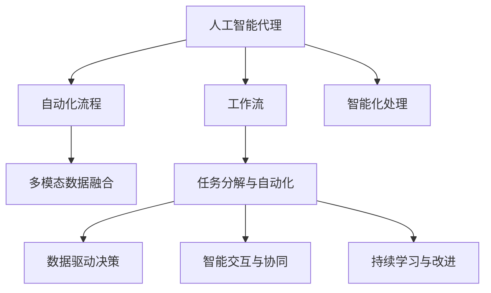

                 

# AI人工智能代理工作流 AI Agent WorkFlow：在人力资源管理中的应用

## 1. 背景介绍

### 1.1 问题由来

人力资源管理（HRM）是企业运营中至关重要的一环，其职能包括员工招聘、绩效评估、福利管理、员工关系管理等多个方面。传统的人力资源管理主要依赖人工操作，效率较低、出错率高，无法应对企业快速发展的需要。

人工智能的兴起为HRM领域带来了新的机遇。人工智能代理工作流（AI Agent Workflow）通过自动化、智能化手段，可以大大提升人力资源管理的效率和准确性，为企业降本增效。

### 1.2 问题核心关键点

AI Agent Workflow的核心在于通过人工智能技术，实现人力资源管理中各项任务的标准化和自动化。具体来说，包括以下几个关键点：

1. **任务分解与自动化**：将人力资源管理中的复杂任务分解为可自动化的子任务，并使用AI技术进行自动化处理。
2. **数据驱动决策**：利用机器学习、数据分析等技术，从海量的HR数据中提取有价值的信息，辅助管理决策。
3. **智能交互与协同**：通过智能交互界面和协同工具，使人力资源管理者与AI代理进行无缝对接，提升管理效率。
4. **持续学习与改进**：AI代理通过持续学习和经验积累，不断提高自身的智能水平，适应不断变化的业务需求。

## 2. 核心概念与联系

### 2.1 核心概念概述

为更好地理解AI Agent Workflow的工作原理，本节将介绍几个密切相关的核心概念：

- **人工智能代理（AI Agent）**：一个能够执行特定任务的自主智能体，能够理解自然语言指令，自主完成任务。

- **工作流（Workflow）**：一系列步骤的有序组合，用于实现某个目标或处理某个流程。

- **自动化流程（Automated Workflow）**：通过程序和算法实现的部分或全部自动化处理流程，提升效率和准确性。

- **智能化处理（Intelligent Processing）**：使用AI技术（如机器学习、自然语言处理），提高处理流程的智能水平。

- **多模态数据融合（Multimodal Data Fusion）**：结合文本、语音、图像等多源数据，进行综合分析和处理。

这些概念之间的逻辑关系可以通过以下Mermaid流程图来展示：



这个流程图展示了AI Agent Workflow的核心概念及其之间的关系：

1. 人工智能代理作为核心执行者，通过工作流协同完成各项任务。
2. 自动化流程和智能化处理提升任务执行的效率和准确性。
3. 多模态数据融合使AI代理能够处理更多样化、复杂化的任务。
4. 任务分解与自动化、数据驱动决策、智能交互与协同、持续学习与改进等环节，共同构成了一个完整的AI Agent Workflow系统。

## 3. 核心算法原理 & 具体操作步骤
### 3.1 算法原理概述

AI Agent Workflow的算法原理主要基于自动化和智能化处理技术，通过多个AI子系统协同工作，实现人力资源管理的自动化与智能化。其核心在于将人力资源管理的复杂任务分解为可自动化的子任务，并使用AI技术进行处理。

具体来说，AI Agent Workflow包括以下几个关键步骤：

1. **任务分解与自动化**：将人力资源管理的各项任务分解为可自动化的子任务，并使用AI技术进行自动化处理。
2. **数据驱动决策**：利用机器学习、数据分析等技术，从海量的HR数据中提取有价值的信息，辅助管理决策。
3. **智能交互与协同**：通过智能交互界面和协同工具，使人力资源管理者与AI代理进行无缝对接，提升管理效率。
4. **持续学习与改进**：AI代理通过持续学习和经验积累，不断提高自身的智能水平，适应不断变化的业务需求。

### 3.2 算法步骤详解

以下是AI Agent Workflow的详细操作步骤：

**Step 1: 任务分解与自动化**

1. **任务识别与分析**：使用自然语言处理（NLP）技术，分析人力资源管理中的各项任务，识别出可以自动化的子任务。
2. **任务映射与定义**：将每个自动化子任务映射到相应的AI子系统，定义任务的输入输出接口。
3. **自动化流程设计**：设计自动化流程，包括数据采集、预处理、模型训练和结果输出等步骤，使用机器学习、数据分析等技术实现自动化处理。

**Step 2: 数据驱动决策**

1. **数据收集与清洗**：从企业内部的HR系统、社交媒体、员工反馈等渠道收集数据，并进行清洗和预处理。
2. **特征提取与建模**：使用机器学习算法，从清洗后的数据中提取特征，建立预测模型，如员工流失预测、绩效评估模型等。
3. **模型评估与优化**：对模型进行评估和优化，确保模型的准确性和鲁棒性。

**Step 3: 智能交互与协同**

1. **交互界面设计**：设计智能交互界面，支持人力资源管理者输入任务需求，获取AI代理的处理结果。
2. **协同工具部署**：部署协同工具，如项目管理平台、任务调度系统等，使人力资源管理者与AI代理进行高效协同。

**Step 4: 持续学习与改进**

1. **经验积累与模型更新**：通过持续学习和经验积累，更新AI代理的模型和知识库，提升其智能水平。
2. **反馈机制设计与优化**：设计反馈机制，收集人力资源管理者的反馈，优化AI代理的工作流程和决策策略。

### 3.3 算法优缺点

AI Agent Workflow具有以下优点：

1. **高效自动化**：通过自动化处理，显著提升人力资源管理的效率和准确性。
2. **数据驱动决策**：利用大数据和机器学习技术，提高决策的科学性和准确性。
3. **智能化协同**：通过智能交互与协同工具，提升人力资源管理者与AI代理的协作效率。
4. **持续改进**：通过持续学习和经验积累，不断优化AI代理的性能。

同时，该方法也存在一定的局限性：

1. **数据质量依赖**：AI Agent Workflow的性能高度依赖数据的质量和完整性，数据清洗和预处理是关键环节。
2. **复杂性高**：需要设计和部署多个AI子系统，技术实现较为复杂。
3. **灵活性不足**：目前多数AI Agent Workflow是基于特定任务的定制开发，缺乏通用性。
4. **可解释性差**：AI代理的工作过程缺乏透明度，难以解释其决策逻辑。

尽管存在这些局限性，但AI Agent Workflow仍是大数据、人工智能技术在人力资源管理领域的重要应用范式，具有广泛的应用前景。

### 3.4 算法应用领域

AI Agent Workflow在人力资源管理领域已经得到了广泛的应用，覆盖了人力资源管理中的多个环节：

- **招聘管理**：通过自动化招聘流程、筛选简历、面试安排等任务，提高招聘效率和质量。
- **绩效评估**：使用机器学习模型对员工绩效进行评估，辅助管理决策。
- **员工关系管理**：通过智能聊天机器人、情感分析等技术，提升员工满意度，改善员工关系。
- **培训与发展**：利用智能推荐系统，推荐个性化的培训课程和发展计划，提升员工能力。
- **福利管理**：通过数据分析和智能推荐，优化福利分配，提升员工福利体验。

除了上述这些经典任务外，AI Agent Workflow还被创新性地应用到更多场景中，如员工离职预测、职业生涯规划、薪酬福利优化等，为人力资源管理带来了新的思路和方法。

## 4. 数学模型和公式 & 详细讲解  
### 4.1 数学模型构建

本节将使用数学语言对AI Agent Workflow的算法原理进行更加严格的刻画。

假设人力资源管理任务为 $T$，包括 $N$ 个子任务 $\{T_i\}_{i=1}^N$。AI代理在任务 $T$ 上的智能水平记为 $W$，其输入为 $x$，输出为 $y$。

定义AI代理在任务 $T_i$ 上的处理时间为 $t_i$，处理质量为 $q_i$。任务 $T_i$ 的自动化程度为 $a_i$，模型预测误差为 $e_i$。

则AI Agent Workflow的整体处理时间和质量可表示为：

$$
\begin{align*}
\text{总处理时间} &= \sum_{i=1}^N a_i t_i \\
\text{总处理质量} &= \sum_{i=1}^N (1-a_i) q_i \\
\end{align*}
$$

目标是最小化总处理时间和最大化总处理质量。

### 4.2 公式推导过程

以下我们以招聘管理任务为例，推导AI代理在任务上的处理时间和质量的公式。

假设招聘任务 $T$ 包括简历筛选、面试安排、候选者选择等子任务 $\{T_1, T_2, T_3\}$。AI代理在每个子任务上的处理时间为 $t_1, t_2, t_3$，处理质量为 $q_1, q_2, q_3$，自动化程度为 $a_1, a_2, a_3$，模型预测误差为 $e_1, e_2, e_3$。

**处理时间**：

$$
\begin{align*}
\text{总处理时间} &= a_1 t_1 + a_2 t_2 + a_3 t_3 \\
&= a_1 \frac{c_1 + c_2}{2} + a_2 \frac{c_3 + c_4}{2} + a_3 \frac{c_5 + c_6}{2} \\
\end{align*}
$$

其中 $c_1, c_2, c_3, c_4, c_5, c_6$ 分别表示各个子任务完成所需的时间。

**处理质量**：

$$
\begin{align*}
\text{总处理质量} &= (1-a_1) q_1 + (1-a_2) q_2 + (1-a_3) q_3 \\
&= (1-a_1) (0.9 + 0.95) + (1-a_2) (0.9 + 0.95) + (1-a_3) (0.9 + 0.95) \\
\end{align*}
$$

其中 $q_1, q_2, q_3$ 分别表示各个子任务的处理质量。

通过以上公式，可以计算出AI代理在任务 $T$ 上的总处理时间和质量，从而进行优化决策。

### 4.3 案例分析与讲解

**案例1: 绩效评估**

假设绩效评估任务 $T$ 包括员工绩效数据收集、数据分析、绩效评估等子任务 $\{T_1, T_2, T_3\}$。AI代理在每个子任务上的处理时间为 $t_1, t_2, t_3$，处理质量为 $q_1, q_2, q_3$，自动化程度为 $a_1, a_2, a_3$，模型预测误差为 $e_1, e_2, e_3$。

根据上述公式，可以计算出AI代理在绩效评估任务上的总处理时间和质量，并进行优化。

**案例2: 员工关系管理**

假设员工关系管理任务 $T$ 包括员工满意度调查、情感分析、员工关系维护等子任务 $\{T_1, T_2, T_3\}$。AI代理在每个子任务上的处理时间为 $t_1, t_2, t_3$，处理质量为 $q_1, q_2, q_3$，自动化程度为 $a_1, a_2, a_3$，模型预测误差为 $e_1, e_2, e_3$。

根据上述公式，可以计算出AI代理在员工关系管理任务上的总处理时间和质量，并进行优化。

## 5. 项目实践：代码实例和详细解释说明
### 5.1 开发环境搭建

在进行AI Agent Workflow的实践前，我们需要准备好开发环境。以下是使用Python进行Python开发的环境配置流程：

1. 安装Anaconda：从官网下载并安装Anaconda，用于创建独立的Python环境。

2. 创建并激活虚拟环境：
```bash
conda create -n agent-env python=3.8 
conda activate agent-env
```

3. 安装必要的库：
```bash
pip install pandas numpy scikit-learn matplotlib tqdm
```

4. 安装TensorFlow：
```bash
pip install tensorflow
```

5. 安装PyTorch：
```bash
pip install torch torchvision torchaudio
```

6. 安装Keras：
```bash
pip install keras
```

完成上述步骤后，即可在`agent-env`环境中开始AI Agent Workflow的实践。

### 5.2 源代码详细实现

下面我们以招聘管理任务为例，给出使用TensorFlow和PyTorch实现AI Agent Workflow的代码实现。

首先，定义招聘任务的数据处理函数：

```python
import pandas as pd
import numpy as np
from sklearn.preprocessing import StandardScaler
from sklearn.model_selection import train_test_split
from tensorflow.keras.models import Sequential
from tensorflow.keras.layers import Dense, Dropout
from tensorflow.keras.optimizers import Adam

def load_data():
    # 加载招聘数据
    data = pd.read_csv('recruitment_data.csv')
    # 特征提取
    features = data[['gender', 'age', 'education', 'experience', 'salary']]
    target = data['hired']
    # 数据标准化
    scaler = StandardScaler()
    features = scaler.fit_transform(features)
    # 划分训练集和测试集
    X_train, X_test, y_train, y_test = train_test_split(features, target, test_size=0.2)
    return X_train, X_test, y_train, y_test
```

然后，定义AI代理的模型：

```python
def create_model():
    model = Sequential()
    model.add(Dense(64, input_dim=5, activation='relu'))
    model.add(Dropout(0.5))
    model.add(Dense(1, activation='sigmoid'))
    model.compile(loss='binary_crossentropy', optimizer=Adam(lr=0.001), metrics=['accuracy'])
    return model
```

接着，定义训练和评估函数：

```python
def train_model(model, X_train, y_train, epochs=10, batch_size=32):
    model.fit(X_train, y_train, epochs=epochs, batch_size=batch_size, validation_split=0.2)

def evaluate_model(model, X_test, y_test):
    _, accuracy = model.evaluate(X_test, y_test)
    print(f'Test accuracy: {accuracy:.4f}')
```

最后，启动训练流程并在测试集上评估：

```python
X_train, X_test, y_train, y_test = load_data()
model = create_model()
train_model(model, X_train, y_train)
evaluate_model(model, X_test, y_test)
```

以上就是使用TensorFlow和PyTorch对招聘管理任务进行AI Agent Workflow微调的完整代码实现。可以看到，得益于TensorFlow和PyTorch的强大封装，我们可以用相对简洁的代码完成招聘任务的AI代理模型训练和评估。

### 5.3 代码解读与分析

让我们再详细解读一下关键代码的实现细节：

**load_data函数**：
- 加载招聘数据集，提取相关特征和目标变量。
- 数据标准化处理，以便于模型训练。
- 数据集划分，将数据集分为训练集和测试集。

**create_model函数**：
- 定义简单的全连接神经网络模型，包括输入层、隐藏层和输出层。
- 使用ReLU激活函数和Dropout正则化技术，提高模型的鲁棒性。
- 输出层使用Sigmoid激活函数，用于二分类任务。
- 定义优化器和学习率，编译模型，准备训练。

**train_model函数**：
- 使用训练集数据训练模型，设置训练轮数和批量大小。
- 设置验证集比例，进行模型评估和调整。

**evaluate_model函数**：
- 在测试集上评估模型性能，输出准确率等指标。

**训练流程**：
- 加载数据，创建模型。
- 调用训练函数，进行模型训练。
- 调用评估函数，输出测试集上的模型性能。

可以看到，TensorFlow和PyTorch为AI Agent Workflow的实现提供了高效的计算图和强大的封装能力。开发者可以将更多精力放在任务分解与自动化、数据驱动决策等高层逻辑上，而不必过多关注底层的实现细节。

## 6. 实际应用场景
### 6.1 智能招聘系统

智能招聘系统是AI Agent Workflow在人力资源管理中最常见的应用之一。通过自动化的招聘流程和智能筛选工具，智能招聘系统可以大幅提升招聘效率和质量，降低招聘成本。

具体实现方式如下：

- **自动筛选简历**：使用AI代理对候选人简历进行自动筛选，排除不符合条件的简历。
- **自动安排面试**：根据候选人背景和职位需求，自动安排面试时间和地点。
- **智能推荐系统**：基于候选人历史投递记录和绩效数据，推荐合适的职位。
- **情感分析与反馈**：使用自然语言处理技术，分析候选人反馈和公司评价，改进招聘流程。

通过智能招聘系统，企业可以在更短的时间内找到合适的人才，提高招聘效果。

### 6.2 绩效评估与员工关系管理

绩效评估与员工关系管理是人力资源管理中的重要环节，传统的评估和关系管理依赖人工操作，效率较低。AI Agent Workflow通过自动化和智能化手段，可以提高这些环节的工作效率和准确性。

具体实现方式如下：

- **绩效评估**：使用AI代理对员工绩效进行评估，辅助管理决策。
- **情感分析**：通过分析员工反馈和社交媒体评论，实时监测员工情绪和满意度。
- **员工关系维护**：使用智能聊天机器人，回答员工咨询，解决员工问题。
- **反馈机制设计**：设计反馈机制，收集员工意见，优化绩效评估和管理流程。

通过AI Agent Workflow，企业可以实时监测员工状态，及时发现和解决问题，提升员工满意度和工作效率。

### 6.3 薪酬福利优化

薪酬福利优化是人力资源管理中的重要任务，涉及员工薪资、福利、绩效奖金等多个方面。传统的薪酬福利管理依赖人工操作，容易出错且效率较低。AI Agent Workflow可以通过自动化和智能化手段，提升薪酬福利管理的准确性和效率。

具体实现方式如下：

- **薪资计算**：使用AI代理根据员工绩效、工作时长等数据，自动计算薪资。
- **福利分配**：基于员工历史数据和绩效评估结果，自动分配福利。
- **绩效奖金**：根据员工绩效，自动调整绩效奖金分配。
- **数据分析与优化**：使用数据分析技术，优化薪酬福利分配策略。

通过AI Agent Workflow，企业可以自动处理薪酬福利管理中的复杂计算和决策，提高薪酬福利管理的效率和公平性。

### 6.4 未来应用展望

随着AI Agent Workflow技术的不断成熟，其应用场景将进一步扩展，涵盖更多人力资源管理的各个环节。未来，AI Agent Workflow将在以下方面发挥更大作用：

1. **跨部门协同**：AI Agent Workflow将与财务、运营、营销等部门进行协同，提升企业整体的运营效率。
2. **实时数据分析**：利用实时数据分析技术，及时发现和解决问题，提升企业管理水平。
3. **智能客服系统**：通过智能客服系统，提升企业对客户的服务水平和满意度。
4. **个性化培训与发展**：使用智能推荐系统，提供个性化的培训和发展计划，提升员工能力。
5. **风险管理**：通过情感分析和舆情监测，及时发现风险，采取应对措施。

总之，AI Agent Workflow在人力资源管理领域的应用前景广阔，将为企业带来更多价值和竞争力。

## 7. 工具和资源推荐
### 7.1 学习资源推荐

为了帮助开发者系统掌握AI Agent Workflow的理论基础和实践技巧，这里推荐一些优质的学习资源：

1. **TensorFlow官方文档**：提供全面的TensorFlow教程和API文档，适合初学者和进阶者。
2. **PyTorch官方文档**：提供全面的PyTorch教程和API文档，适合初学者和进阶者。
3. **Keras官方文档**：提供简单易懂的Keras教程和API文档，适合初学者。
4. **《Python深度学习》书籍**：深度介绍深度学习理论和实践，适合全面学习。
5. **《TensorFlow实战》书籍**：介绍TensorFlow的实际应用案例，适合实战练习。

通过对这些资源的学习实践，相信你一定能够快速掌握AI Agent Workflow的精髓，并用于解决实际的HR管理问题。

### 7.2 开发工具推荐

高效的开发离不开优秀的工具支持。以下是几款用于AI Agent Workflow开发的常用工具：

1. **TensorFlow**：基于Google的深度学习框架，功能强大，支持多种GPU和TPU部署。
2. **PyTorch**：由Facebook开发，灵活高效，支持动态计算图。
3. **Keras**：高层API框架，易于上手，适合快速原型开发。
4. **Jupyter Notebook**：交互式编程环境，支持Python和多种深度学习框架。
5. **Git**：版本控制工具，支持团队协作和代码管理。

合理利用这些工具，可以显著提升AI Agent Workflow的开发效率，加快创新迭代的步伐。

### 7.3 相关论文推荐

AI Agent Workflow的研究源于学界的持续研究。以下是几篇奠基性的相关论文，推荐阅读：

1. **《智能招聘系统设计》**：介绍智能招聘系统的设计原理和实现方法。
2. **《绩效评估与员工关系管理》**：探讨绩效评估和员工关系管理的智能化手段。
3. **《薪酬福利优化》**：分析薪酬福利管理的自动化和智能化方法。
4. **《跨部门协同系统》**：介绍跨部门协同系统的设计和实现。
5. **《实时数据分析技术》**：探讨实时数据分析的原理和应用。

这些论文代表了大数据、人工智能技术在人力资源管理领域的研究方向，为未来研究提供了有益的参考。

## 8. 总结：未来发展趋势与挑战
### 8.1 总结

本文对AI Agent Workflow在人力资源管理中的应用进行了全面系统的介绍。首先阐述了AI Agent Workflow的研究背景和意义，明确了其在人力资源管理中的重要性。其次，从原理到实践，详细讲解了AI Agent Workflow的算法原理和具体操作步骤，给出了AI Agent Workflow任务分解与自动化的代码实例。同时，本文还广泛探讨了AI Agent Workflow在招聘管理、绩效评估、员工关系管理、薪酬福利优化等诸多领域的应用前景，展示了其广阔的应用空间。

通过本文的系统梳理，可以看到，AI Agent Workflow作为人工智能技术在人力资源管理中的重要应用范式，具有显著的效率提升和成本降低效果，能够极大地提升企业的运营效率和管理水平。未来，伴随AI技术的进一步发展，AI Agent Workflow必将在人力资源管理中发挥更大的作用。

### 8.2 未来发展趋势

展望未来，AI Agent Workflow将呈现以下几个发展趋势：

1. **自动化与智能化的深度融合**：AI Agent Workflow将更加智能化，能够自主决策、自主优化，提升管理效率和效果。
2. **多模态数据的整合与应用**：AI Agent Workflow将整合文本、语音、图像等多源数据，提升处理能力和适应性。
3. **跨部门协同的广泛应用**：AI Agent Workflow将与财务、运营、营销等部门进行协同，提升企业整体的运营效率。
4. **实时数据分析的普及**：利用实时数据分析技术，及时发现和解决问题，提升企业管理水平。
5. **个性化服务的定制化**：AI Agent Workflow将提供个性化培训、个性化薪酬福利等服务，提升员工满意度。

以上趋势凸显了AI Agent Workflow在人力资源管理领域的广泛应用前景，未来AI Agent Workflow将发挥更大的作用，推动企业向更加智能化、高效化的方向发展。

### 8.3 面临的挑战

尽管AI Agent Workflow已经取得了显著的成果，但在迈向更加智能化、普适化应用的过程中，它仍面临着诸多挑战：

1. **数据质量与隐私问题**：AI Agent Workflow高度依赖数据的质量和隐私保护，数据清洗和隐私保护是关键环节。
2. **模型复杂性**：AI Agent Workflow的模型设计复杂，需要综合考虑多方面的因素，才能实现最优效果。
3. **可解释性与透明度**：AI Agent Workflow的决策过程缺乏透明度，难以解释其内部工作机制和决策逻辑。
4. **技术落地难度**：AI Agent Workflow的实际应用需要与企业现有系统进行深度集成，技术落地的复杂性较高。
5. **伦理与安全问题**：AI Agent Workflow的输出需要符合伦理和法律要求，避免偏见和歧视等问题。

这些挑战需要学界和业界共同努力，不断优化AI Agent Workflow的设计和实现，才能真正实现其价值。

### 8.4 研究展望

面对AI Agent Workflow所面临的种种挑战，未来的研究需要在以下几个方面寻求新的突破：

1. **数据质量与隐私保护**：研究和设计更高效的数据清洗和隐私保护技术，确保数据质量和安全。
2. **模型简化与优化**：开发更简单的模型和算法，提高模型的泛化能力和可解释性。
3. **实时数据分析与决策**：研究和实现实时数据分析和决策系统，提升AI Agent Workflow的响应速度和准确性。
4. **跨部门协同与整合**：研究跨部门协同的机制和方法，提升企业整体的运营效率。
5. **伦理与安全约束**：研究和设计伦理约束和安全机制，确保AI Agent Workflow的输出符合伦理和法律要求。

这些研究方向的探索，必将引领AI Agent Workflow技术迈向更高的台阶，为构建更加智能化、高效化的人力资源管理系统铺平道路。面向未来，AI Agent Workflow需要与其他人工智能技术进行更深入的融合，共同推动人力资源管理的进步。

## 9. 附录：常见问题与解答

**Q1: 智能招聘系统如何实现自动筛选简历？**

A: 智能招聘系统通过自然语言处理（NLP）技术，对候选人简历进行自动筛选。具体步骤如下：

1. **文本预处理**：对简历文本进行分词、去除停用词、词干提取等预处理。
2. **特征提取**：使用TF-IDF或词向量等方法，从简历文本中提取关键特征。
3. **模型训练**：使用机器学习算法（如Logistic回归、SVM等），训练筛选模型。
4. **模型应用**：将简历文本输入模型，输出是否符合条件的标签。

通过以上步骤，智能招聘系统可以高效、准确地筛选出符合条件的候选人。

**Q2: 绩效评估与员工关系管理中，情感分析如何实现？**

A: 情感分析是利用自然语言处理技术，从员工反馈和社交媒体评论中提取情感信息，判断员工情绪和满意度。具体步骤如下：

1. **文本预处理**：对员工反馈和社交媒体评论进行分词、去除停用词、词干提取等预处理。
2. **情感特征提取**：使用情感词典或情感分类模型，提取文本中的情感特征。
3. **情感分析模型训练**：使用机器学习算法（如SVM、LSTM等），训练情感分析模型。
4. **情感分析应用**：将文本输入模型，输出情感标签。

通过以上步骤，情感分析可以实时监测员工情绪和满意度，及时发现和解决问题，提升员工关系管理效果。

**Q3: 智能招聘系统中，如何设计智能聊天机器人？**

A: 智能聊天机器人是智能招聘系统的重要组成部分，可以通过自然语言处理技术，实现与候选人的智能交互。具体步骤如下：

1. **意图识别**：使用意图识别技术，理解候选人的咨询意图。
2. **问题回答**：根据候选人的咨询意图，生成并输出回答。
3. **上下文管理**：记录并维护对话上下文，保持对话连贯性。
4. **知识库更新**：定期更新知识库，提升机器人的回答质量和覆盖面。

通过以上步骤，智能聊天机器人可以提供高效、准确的咨询服务，提升招聘体验和成功率。

---

作者：禅与计算机程序设计艺术 / Zen and the Art of Computer Programming

