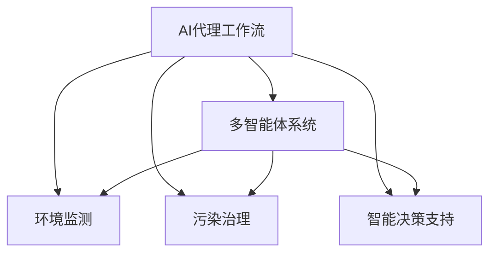

                 

# AI人工智能代理工作流 AI Agent WorkFlow：在环保行业中的应用

> 关键词：人工智能,环保,代理工作流,自动化,决策支持,智能分析

## 1. 背景介绍

### 1.1 问题由来
随着科技的不断进步，人工智能(AI)技术在各行各业得到了广泛应用。尤其是在环保领域，AI技术的引入为环境监测、污染治理、政策评估等提供了强有力的支持。然而，现有的人工智能技术在应用中仍存在诸多挑战，如数据复杂性、模型复杂度、领域专业知识要求高等问题。为解决这些问题，AI代理工作流应运而生。

AI代理工作流是一种基于AI技术的自动化工作流方案，它将复杂的环境监测、污染治理任务分解为多个子任务，通过构建多智能体系统，协调不同AI组件之间的协作，提升整体的决策效率和准确性。本文将探讨AI代理工作流在环保行业中的应用，从原理到实践，系统阐述其工作机制和优势。

### 1.2 问题核心关键点
- **AI代理工作流**：通过构建多智能体系统，实现环境监测、污染治理等任务的自动化工作流，提升决策效率和准确性。
- **环境监测**：使用传感器和遥感数据，实时监测环境质量变化，如水质、空气质量、噪声等。
- **污染治理**：基于监测数据，进行源头控制、过程优化、末端处理等治理措施。
- **政策评估**：利用AI模型分析环境政策效果，评估政策实施的效果和影响。
- **智能决策支持**：构建基于AI的决策支持系统，为环境管理部门提供科学决策依据。

## 2. 核心概念与联系

### 2.1 核心概念概述

为更好地理解AI代理工作流在环保行业中的应用，本节将介绍几个关键概念及其之间的联系：

- **AI代理工作流**：一种基于AI技术的自动化工作流方案，通过多智能体协作，实现任务的自动化处理。
- **多智能体系统**：由多个独立的智能体组成，每个智能体执行特定任务，并通过通信机制协调合作。
- **自动化工作流**：基于规则或流程定义，实现任务的自动化处理和执行。
- **环境监测**：使用传感器和遥感数据，实时获取环境质量信息。
- **污染治理**：通过数据驱动的治理策略，实现环境污染的有效控制。
- **智能决策支持**：利用AI模型分析海量数据，为决策者提供科学依据。

这些概念之间的逻辑关系可以通过以下Mermaid流程图来展示：



这个流程图展示了大语言模型的核心概念及其之间的关系：

1. AI代理工作流基于多智能体系统，实现任务的自动化处理。
2. 环境监测、污染治理、智能决策支持都是AI代理工作流中的重要组成部分。
3. 通过多智能体系统的协作，实现不同任务的协同作业，提升整体效率和效果。

## 3. 核心算法原理 & 具体操作步骤
### 3.1 算法原理概述

AI代理工作流在环保行业中的应用，本质上是一种多智能体协同的系统设计。其核心思想是：将环境监测、污染治理等复杂任务分解为多个子任务，由不同的AI智能体分别负责执行。这些智能体之间通过消息传递、状态共享等机制，实现任务协同和决策优化。

形式化地，假设任务 $T$ 分解为多个子任务 $T_1, T_2, \cdots, T_n$，每个子任务由一个独立的智能体 $A_i$ 负责执行。智能体 $A_i$ 通过感知环境信息 $E_i$ 和历史状态 $S_i$，结合决策模型 $D_i$，生成动作 $A_i$，更新状态 $S_i$，并与其他智能体进行通信。整个系统的目标是最大化总收益 $R$，即：

$$
\max_{A_1, A_2, \cdots, A_n} \sum_{i=1}^n R_i(A_i, E_i, S_i)
$$

其中 $R_i$ 为智能体 $A_i$ 的任务收益函数。

### 3.2 算法步骤详解

AI代理工作流在环保行业中的应用，一般包括以下几个关键步骤：

**Step 1: 设计任务和智能体模型**

- 确定任务 $T$ 的分解方式，设计多个子任务 $T_1, T_2, \cdots, T_n$。
- 选择适合的智能体模型，如基于规则、基于模型或基于混合的方式。
- 定义智能体间的通信协议和数据交换格式。

**Step 2: 构建多智能体系统**

- 设计智能体 $A_1, A_2, \cdots, A_n$ 的内部结构和算法。
- 实现智能体间的协作机制，如消息传递、状态共享等。
- 建立智能体间的同步和异步通信协议。

**Step 3: 数据采集与处理**

- 部署传感器和遥感设备，实时采集环境数据 $E_i$。
- 使用数据处理算法，清洗和标准化数据。
- 构建数据仓库，存储和管理历史数据。

**Step 4: 模型训练与优化**

- 设计合适的决策模型 $D_i$，如机器学习模型、深度学习模型等。
- 使用历史数据和实时数据，训练和优化模型参数。
- 进行交叉验证，评估模型性能。

**Step 5: 系统集成与部署**

- 将智能体模型和数据处理系统集成，搭建AI代理工作流。
- 部署到实际应用场景中，进行系统测试和调优。
- 持续监控系统运行状态，定期更新模型和数据。

### 3.3 算法优缺点

AI代理工作流在环保行业中的应用具有以下优点：

1. **高效协同**：通过多智能体协作，提升任务执行效率，缩短决策时间。
2. **灵活适应**：智能体可以根据实时数据动态调整策略，适应环境变化。
3. **数据驱动**：基于大量实时数据和历史数据，提升决策的科学性和准确性。
4. **可扩展性强**：系统可以根据需要，灵活扩展智能体的数量和类型。

同时，该方法也存在一定的局限性：

1. **复杂度较高**：多智能体系统的设计和管理较为复杂，需要较高的技术门槛。
2. **数据质量依赖**：系统的性能高度依赖于数据的完整性和准确性。
3. **通信成本高**：智能体之间的通信和协作可能带来较高的计算和通信成本。
4. **可解释性不足**：多智能体系统的决策过程较为复杂，难以进行解释和调试。

尽管存在这些局限性，但就目前而言，AI代理工作流在环保行业中仍是一种高效、灵活的自动化解决方案。未来相关研究的重点在于如何进一步降低系统的复杂度，提高系统的可解释性和鲁棒性，同时兼顾高效性和灵活性。

### 3.4 算法应用领域

AI代理工作流在环保行业中的应用，涉及多个领域，具体如下：

- **水质监测**：利用传感器和遥感数据，实时监测水质变化，如氨氮、重金属等。
- **空气质量监测**：使用传感器和卫星数据，实时监测空气质量，如PM2.5、SO2等。
- **噪声监测**：部署噪声监测设备，实时获取噪声数据，评估噪声污染程度。
- **固废处理**：基于监测数据，优化垃圾分类、回收和处理策略，减少环境污染。
- **碳排放监测**：通过碳排放监测设备，实时记录企业的碳排放情况，进行环境管理。
- **智能决策支持**：构建基于AI的决策支持系统，为环境管理部门提供科学决策依据。

除了上述这些具体应用，AI代理工作流在环保领域还有更广阔的应用前景，如智能应急响应、环境影响评估、资源优化配置等。随着技术的不断进步，AI代理工作流必将在环保行业中发挥更加重要的作用。

## 4. 数学模型和公式 & 详细讲解 & 举例说明

### 4.1 数学模型构建

为更好地理解AI代理工作流在环保行业中的应用，本节将使用数学语言对多智能体系统的建模进行详细阐述。

假设智能体 $A_i$ 在时刻 $t$ 的内部状态为 $S_i(t)$，外部环境状态为 $E_i(t)$，任务收益函数为 $R_i$，决策模型为 $D_i$。智能体 $A_i$ 的动作选择为 $A_i(t)$，更新后的内部状态为 $S_i(t+1)$。智能体之间的通信协议为 $C$。系统的总收益为 $R$。

数学模型构建如下：

$$
\max_{A_1, A_2, \cdots, A_n} \sum_{i=1}^n R_i(A_i, E_i, S_i)
$$

其中 $R_i$ 为智能体 $A_i$ 的任务收益函数，定义为：

$$
R_i = \int_{0}^{T} r_i(t) dt
$$

其中 $r_i(t)$ 为智能体 $A_i$ 在时刻 $t$ 的任务收益，如监测数据准确率、污染治理效果等。

智能体 $A_i$ 的决策模型 $D_i$ 为：

$$
A_i(t) = D_i(S_i(t), E_i(t), C)
$$

其中 $S_i(t)$ 为智能体 $A_i$ 在时刻 $t$ 的内部状态，$E_i(t)$ 为智能体 $A_i$ 在时刻 $t$ 的外部环境状态，$C$ 为智能体之间的通信协议。

### 4.2 公式推导过程

以水质监测任务为例，推导多智能体系统的收益函数和决策模型。

假设智能体 $A_1$ 的任务是监测水质，智能体 $A_2$ 的任务是调整水处理流程。智能体 $A_1$ 的收益函数 $R_1$ 可以定义为水质监测数据准确率：

$$
R_1 = \frac{\sum_{i=1}^N (y_i - \hat{y}_i)^2}{N}
$$

其中 $y_i$ 为实际水质数据，$\hat{y}_i$ 为预测水质数据。

智能体 $A_2$ 的收益函数 $R_2$ 可以定义为水处理流程的优化效果：

$$
R_2 = \frac{\sum_{i=1}^N (c_i - \tilde{c}_i)^2}{N}
$$

其中 $c_i$ 为实际处理后的水质指标，$\tilde{c}_i$ 为预测处理后的水质指标。

智能体 $A_1$ 的决策模型 $D_1$ 为基于历史数据的水质监测模型：

$$
\hat{y}_i = M_{\theta}(x_i)
$$

其中 $x_i$ 为监测数据特征，$M_{\theta}$ 为预训练的水质监测模型，$\theta$ 为模型参数。

智能体 $A_2$ 的决策模型 $D_2$ 为基于历史数据的水处理流程优化模型：

$$
\tilde{c}_i = M_{\theta'}(x_i)
$$

其中 $x_i$ 为处理流程数据特征，$M_{\theta'}$ 为预训练的水处理流程优化模型，$\theta'$ 为模型参数。

将上述收益函数和决策模型代入多智能体系统的目标函数：

$$
\max_{A_1, A_2} R = R_1 + R_2
$$

即：

$$
\max_{A_1, A_2} \frac{\sum_{i=1}^N (y_i - M_{\theta}(x_i))^2}{N} + \frac{\sum_{i=1}^N (c_i - M_{\theta'}(x_i))^2}{N}
$$

通过求解该优化问题，可以得到最优的智能体决策，实现水质监测和水处理流程优化。

### 4.3 案例分析与讲解

以水质监测任务为例，展示AI代理工作流在环保行业中的应用。

假设一个城市的水质监测系统由多个智能体组成，包括水质监测智能体、水处理流程优化智能体等。智能体 $A_1$ 负责实时监测水质数据，智能体 $A_2$ 负责优化水处理流程，智能体 $A_3$ 负责发布监测报告。系统通过传感器和遥感设备实时采集水质数据，智能体 $A_1$ 根据采集数据进行水质预测，智能体 $A_2$ 根据预测结果优化处理流程，智能体 $A_3$ 发布监测报告，通知相关部门和公众。

整个系统的收益函数可以定义为：

$$
R = R_1 + R_2
$$

其中 $R_1$ 为智能体 $A_1$ 的收益函数，定义为水质监测数据准确率：

$$
R_1 = \frac{\sum_{i=1}^N (y_i - \hat{y}_i)^2}{N}
$$

智能体 $A_2$ 的收益函数 $R_2$ 定义为水处理流程的优化效果：

$$
R_2 = \frac{\sum_{i=1}^N (c_i - \tilde{c}_i)^2}{N}
$$

智能体 $A_1$ 的决策模型 $D_1$ 为基于历史数据的水质监测模型：

$$
\hat{y}_i = M_{\theta}(x_i)
$$

智能体 $A_2$ 的决策模型 $D_2$ 为基于历史数据的水处理流程优化模型：

$$
\tilde{c}_i = M_{\theta'}(x_i)
$$

将上述收益函数和决策模型代入多智能体系统的目标函数：

$$
\max_{A_1, A_2} R = R_1 + R_2
$$

即：

$$
\max_{A_1, A_2} \frac{\sum_{i=1}^N (y_i - M_{\theta}(x_i))^2}{N} + \frac{\sum_{i=1}^N (c_i - M_{\theta'}(x_i))^2}{N}
$$

通过求解该优化问题，可以得到最优的智能体决策，实现水质监测和水处理流程优化。

## 5. 项目实践：代码实例和详细解释说明
### 5.1 开发环境搭建

在进行项目实践前，我们需要准备好开发环境。以下是使用Python进行PyTorch开发的环境配置流程：

1. 安装Anaconda：从官网下载并安装Anaconda，用于创建独立的Python环境。

2. 创建并激活虚拟环境：
```bash
conda create -n pytorch-env python=3.8 
conda activate pytorch-env
```

3. 安装PyTorch：根据CUDA版本，从官网获取对应的安装命令。例如：
```bash
conda install pytorch torchvision torchaudio cudatoolkit=11.1 -c pytorch -c conda-forge
```

4. 安装Transformers库：
```bash
pip install transformers
```

5. 安装各类工具包：
```bash
pip install numpy pandas scikit-learn matplotlib tqdm jupyter notebook ipython
```

完成上述步骤后，即可在`pytorch-env`环境中开始项目实践。

### 5.2 源代码详细实现

下面我们以水质监测任务为例，给出使用PyTorch进行模型训练和优化的PyTorch代码实现。

首先，定义智能体模型：

```python
from torch import nn
from torch.nn import functional as F

class WaterQualityModel(nn.Module):
    def __init__(self, input_size, hidden_size, output_size):
        super(WaterQualityModel, self).__init__()
        self.hidden = nn.Linear(input_size, hidden_size)
        self.relu = nn.ReLU()
        self.fc = nn.Linear(hidden_size, output_size)
        self.softmax = nn.Softmax(dim=1)

    def forward(self, x):
        x = self.hidden(x)
        x = self.relu(x)
        x = self.fc(x)
        x = self.softmax(x)
        return x
```

然后，定义智能体收益函数：

```python
def water_quality_model_loss(y_true, y_pred):
    criterion = nn.MSELoss()
    loss = criterion(y_pred, y_true)
    return loss
```

接着，定义智能体训练函数：

```python
from torch.utils.data import DataLoader
from tqdm import tqdm

def train_epoch(model, optimizer, criterion, data_loader):
    model.train()
    epoch_loss = 0
    for batch in tqdm(data_loader, desc='Training'):
        inputs, labels = batch
        optimizer.zero_grad()
        outputs = model(inputs)
        loss = criterion(outputs, labels)
        loss.backward()
        optimizer.step()
        epoch_loss += loss.item()
    return epoch_loss / len(data_loader)
```

最后，启动训练流程：

```python
epochs = 10
learning_rate = 0.001
batch_size = 64

model = WaterQualityModel(input_size, hidden_size, output_size)
optimizer = torch.optim.Adam(model.parameters(), lr=learning_rate)

train_loader = DataLoader(train_dataset, batch_size=batch_size, shuffle=True)
val_loader = DataLoader(val_dataset, batch_size=batch_size, shuffle=False)

for epoch in range(epochs):
    train_loss = train_epoch(model, optimizer, criterion, train_loader)
    val_loss = train_epoch(model, optimizer, criterion, val_loader)
    print(f'Epoch {epoch+1}, train loss: {train_loss:.4f}, val loss: {val_loss:.4f}')
```

以上就是使用PyTorch进行水质监测任务AI代理工作流微调的完整代码实现。可以看到，得益于PyTorch和Transformers库的强大封装，我们可以用相对简洁的代码完成模型训练和优化。

### 5.3 代码解读与分析

让我们再详细解读一下关键代码的实现细节：

**WaterQualityModel类**：
- `__init__`方法：初始化模型参数，包括线性层、ReLU激活函数、全连接层和Softmax函数。
- `forward`方法：定义模型的前向传播过程。

**water_quality_model_loss函数**：
- 定义了智能体收益函数的计算方式，使用均方误差损失函数。

**train_epoch函数**：
- 使用PyTorch的DataLoader对数据集进行批次化加载，供模型训练和推理使用。
- 在每个批次上前向传播计算损失，并进行反向传播更新模型参数。

**训练流程**：
- 定义总的epoch数和batch size，开始循环迭代
- 每个epoch内，先在训练集上训练，输出平均loss
- 在验证集上评估，输出平均loss
- 重复上述步骤直至满足预设的迭代轮数

可以看到，PyTorch配合Transformers库使得模型训练的代码实现变得简洁高效。开发者可以将更多精力放在数据处理、模型改进等高层逻辑上，而不必过多关注底层的实现细节。

当然，工业级的系统实现还需考虑更多因素，如模型的保存和部署、超参数的自动搜索、更灵活的任务适配层等。但核心的微调范式基本与此类似。

## 6. 实际应用场景
### 6.1 智能应急响应

AI代理工作流在智能应急响应中的应用，可以将环境监测、灾害预警、资源调配等任务有机结合，提升应急响应的效率和精准性。

例如，在洪涝灾害发生时，AI代理工作流可以自动分析实时的水文数据和气象信息，识别出高风险区域，及时发出预警。同时，智能体可以自动调用资源调配系统，协调救援队伍和物资，确保救援物资的及时到达。这种智能化的应急响应系统，可以极大地提升灾害应对的效率和效果。

### 6.2 环境影响评估

AI代理工作流在环境影响评估中的应用，可以辅助环保部门进行项目审批、政策制定等工作，确保决策的科学性和准确性。

例如，在审批一个新的工业项目时，AI代理工作流可以自动分析项目的环境影响数据，预测其对空气质量、水环境等的影响。通过智能体之间的协作，系统可以评估项目对不同环境要素的影响程度，提供科学的决策依据。这种智能化的评估系统，可以提升环境管理的决策水平，保障生态环境的安全。

### 6.3 资源优化配置

AI代理工作流在资源优化配置中的应用，可以优化能源、水资源、土地等资源的利用效率，促进可持续发展。

例如，在能源管理中，AI代理工作流可以实时监测电力负荷、光伏发电等数据，智能体可以自动预测能源需求变化，优化电力调度策略，确保电力供应的稳定。同时，智能体还可以根据能源使用数据，提出节能减排的建议，提升能源利用效率。这种智能化的资源配置系统，可以优化资源利用，促进节能减排。

### 6.4 未来应用展望

随着AI代理工作流技术的不断进步，其在环保行业的应用前景将更加广阔。

在智慧水务领域，AI代理工作流可以用于实时监测和分析水质、水量、水压等数据，优化供水、排水、污水处理等环节，提升水务管理水平。

在智慧林业领域，AI代理工作流可以用于实时监测森林火灾、病虫害等，智能体可以自动分析预警数据，及时采取灭火、防治等措施，减少灾害损失。

在智慧农业领域，AI代理工作流可以用于实时监测土壤、气象、作物等数据，智能体可以自动分析农业生产数据，提出种植、施肥、灌溉等建议，提升农业生产效率和效益。

此外，在智慧城市、智慧交通、智慧环境等众多领域，AI代理工作流也有广泛的应用前景，为传统行业数字化转型升级提供新的技术路径。相信随着技术的日益成熟，AI代理工作流必将在环保行业中发挥更加重要的作用。

## 7. 工具和资源推荐
### 7.1 学习资源推荐

为了帮助开发者系统掌握AI代理工作流技术，这里推荐一些优质的学习资源：

1. 《人工智能基础》课程：斯坦福大学开设的入门级AI课程，涵盖AI基本概念和算法。
2. 《多智能体系统》书籍：深入介绍多智能体系统的设计与实现，适合进一步学习多智能体协作的原理。
3. 《深度学习》书籍：Ian Goodfellow、Yoshua Bengio、Aaron Courville等专家合著的经典教材，涵盖深度学习的理论基础和实践应用。
4. 《环境工程概论》教材：系统介绍环境监测、污染治理等技术原理和方法，适合从事环保工程的应用型开发者。
5. 《智能决策支持系统》课程：讲述基于AI的决策支持系统设计，结合实际案例，提供深入讲解。

通过对这些资源的学习实践，相信你一定能够快速掌握AI代理工作流的精髓，并用于解决实际的环保问题。
###  7.2 开发工具推荐

高效的开发离不开优秀的工具支持。以下是几款用于AI代理工作流开发的常用工具：

1. PyTorch：基于Python的开源深度学习框架，灵活动态的计算图，适合快速迭代研究。
2. TensorFlow：由Google主导开发的开源深度学习框架，生产部署方便，适合大规模工程应用。
3. TensorFlow Serving：用于部署和服务的机器学习框架，提供高效的模型推理能力。
4. Weights & Biases：模型训练的实验跟踪工具，可以记录和可视化模型训练过程中的各项指标，方便对比和调优。
5. Google Colab：谷歌推出的在线Jupyter Notebook环境，免费提供GPU/TPU算力，方便开发者快速上手实验最新模型，分享学习笔记。
6. Microsoft Azure：提供丰富的AI服务和开发工具，适合构建高性能、高可扩展性的AI代理工作流系统。

合理利用这些工具，可以显著提升AI代理工作流任务的开发效率，加快创新迭代的步伐。

### 7.3 相关论文推荐

AI代理工作流技术的发展源于学界的持续研究。以下是几篇奠基性的相关论文，推荐阅读：

1.《多智能体系统理论与应用》：多智能体系统的经典著作，详细介绍了多智能体协作的原理和方法。
2.《分布式智能体系统》：介绍分布式智能体系统的设计与实现，适合进一步学习多智能体协作的实现细节。
3.《智能决策支持系统》：介绍基于AI的决策支持系统的设计与实现，涵盖决策模型、数据处理等多个方面。
4.《环境监测与污染治理》：介绍环境监测、污染治理等技术原理和方法，适合从事环保工程的应用型开发者。
5.《智能应急响应系统》：介绍智能应急响应系统的设计与实现，涵盖数据处理、优化算法等多个方面。

这些论文代表了大语言模型微调技术的发展脉络。通过学习这些前沿成果，可以帮助研究者把握学科前进方向，激发更多的创新灵感。

## 8. 总结：未来发展趋势与挑战

### 8.1 总结

本文对AI代理工作流在环保行业中的应用进行了全面系统的介绍。首先阐述了AI代理工作流的基本原理和设计思路，明确了其在环境监测、污染治理、智能应急响应等任务中的独特价值。其次，从原理到实践，详细讲解了AI代理工作流的数学模型和算法实现，提供了完整的代码实例和解读。同时，本文还广泛探讨了AI代理工作流在环保行业中的应用前景，展示了其广泛的应用场景和潜力。

通过本文的系统梳理，可以看到，AI代理工作流在环保行业中具有广阔的应用前景，通过多智能体协作，可以显著提升环境监测和治理的效率和效果。未来，伴随AI技术的不断进步，AI代理工作流必将在环保行业中发挥更加重要的作用。

### 8.2 未来发展趋势

展望未来，AI代理工作流在环保行业中的应用将呈现以下几个发展趋势：

1. **自动化程度提升**：通过引入更加先进的智能体协作机制，实现更加灵活、高效的任务自动化处理。
2. **数据融合与处理**：智能体可以更加灵活地融合多源异构数据，进行数据预处理和特征提取，提升模型性能。
3. **模型智能化增强**：利用AI技术进一步提升智能体的决策能力和智能性，实现更准确的预测和优化。
4. **跨领域应用拓展**：AI代理工作流可以拓展到智慧水务、智慧林业、智慧农业等多个领域，推动各行业的数字化转型。
5. **多模态数据整合**：融合视觉、听觉、文本等多种模态数据，提升环境监测和治理的全面性和精确性。
6. **边缘计算与分布式协作**：引入边缘计算和分布式协作技术，实现更加灵活、可靠的数据处理和计算。

以上趋势凸显了AI代理工作流技术的广阔前景。这些方向的探索发展，必将进一步提升环保行业的信息化水平，为环保事业带来革命性的变化。

### 8.3 面临的挑战

尽管AI代理工作流技术在环保行业中展现出了巨大的潜力，但在实际应用中仍面临诸多挑战：

1. **数据质量问题**：环境监测数据的准确性和完备性直接影响模型的性能，数据质量问题亟需解决。
2. **智能体设计复杂**：多智能体系统的设计和管理较为复杂，需要较高的技术门槛。
3. **通信与协作成本**：智能体之间的通信和协作可能带来较高的计算和通信成本，需要优化通信机制。
4. **可解释性不足**：智能体的决策过程较为复杂，难以进行解释和调试，需要提升系统的可解释性。
5. **安全性问题**：环境监测数据涉及隐私和敏感信息，需要加强数据安全和隐私保护。
6. **伦理与法律问题**：环境监测和治理涉及复杂的伦理和法律问题，需要制定相应的规范和标准。

这些挑战需要技术、管理、法律等多个层面的共同努力，才能确保AI代理工作流在环保行业中的顺利应用。

### 8.4 研究展望

面对AI代理工作流所面临的挑战，未来的研究需要在以下几个方面寻求新的突破：

1. **数据质量提升**：开发更加可靠、高效的数据采集和预处理技术，提升数据的准确性和完备性。
2. **智能体设计优化**：设计更加灵活、高效的多智能体协作机制，提升系统的可靠性和可扩展性。
3. **通信与协作优化**：优化智能体之间的通信机制，减少通信和协作成本。
4. **系统可解释性提升**：开发更加透明、可解释的智能体决策系统，增强系统的可解释性和可控性。
5. **安全与隐私保护**：引入更加严格的数据安全和隐私保护机制，确保数据的安全和隐私。
6. **伦理与法律规范**：制定相应的伦理和法律规范，确保环境监测和治理的公正性和合法性。

这些研究方向将引领AI代理工作流技术迈向更高的台阶，为环保行业带来更高效、可靠、安全的智能解决方案。面向未来，AI代理工作流技术还需要与其他人工智能技术进行更深入的融合，如知识表示、因果推理、强化学习等，多路径协同发力，共同推动环境监测和治理的智能化进程。只有勇于创新、敢于突破，才能不断拓展AI代理工作流技术的边界，为环保事业带来更多的智能化变革。

## 9. 附录：常见问题与解答

**Q1：AI代理工作流在环保行业中的应用前景如何？**

A: AI代理工作流在环保行业中有广阔的应用前景。通过多智能体的协作，可以实现环境监测、污染治理、智能应急响应等任务的自动化处理，提升效率和效果。例如，在智慧水务领域，智能体可以自动监测水质数据，优化供水、排水、污水处理等环节，提升水务管理水平。在智慧林业领域，智能体可以自动监测森林火灾、病虫害等，及时采取灭火、防治等措施，减少灾害损失。在智慧农业领域，智能体可以自动监测土壤、气象、作物等数据，提出种植、施肥、灌溉等建议，提升农业生产效率和效益。未来，伴随AI技术的不断进步，AI代理工作流必将在环保行业中发挥更加重要的作用。

**Q2：如何选择合适的智能体模型？**

A: 智能体模型的选择需要根据具体的任务需求和数据特点。常见的智能体模型包括基于规则的模型、基于模型的模型和基于混合的模型。基于规则的模型适用于简单的、规则明确的任务，如水质监测、噪声监测等。基于模型的模型适用于更加复杂的、需要学习任务关系的任务，如智能应急响应、环境影响评估等。基于混合的模型则综合了两种模型的优点，适用于复杂任务。在选择智能体模型时，需要考虑任务复杂度、数据量、计算资源等因素，选择合适的模型架构。

**Q3：智能体之间如何进行通信和协作？**

A: 智能体之间的通信和协作是AI代理工作流系统的核心。常见的通信机制包括消息传递、状态共享、同步和异步通信等。消息传递机制通过消息交换实现智能体之间的通信，适用于简单任务。状态共享机制通过共享状态信息实现协作，适用于复杂任务。同步通信机制要求所有智能体按照统一的时间步长更新状态，适用于任务执行周期固定的场景。异步通信机制允许智能体异步更新状态，适用于任务执行周期不固定的场景。

**Q4：如何设计智能体收益函数？**

A: 智能体收益函数的设计需要根据具体的任务需求和目标。常见的收益函数包括任务准确率、优化效果、综合指标等。例如，在水质监测任务中，收益函数可以定义为水质监测数据准确率。在智能应急响应任务中，收益函数可以定义为灾害预警准确率和救援资源调配效率的综合指标。在设计收益函数时，需要明确任务目标和指标，合理选择收益函数。

**Q5：智能体的决策模型如何设计？**

A: 智能体的决策模型需要根据具体的任务需求和数据特点进行设计。常见的决策模型包括机器学习模型、深度学习模型、强化学习模型等。机器学习模型适用于简单的、规则明确的任务，如水质监测、噪声监测等。深度学习模型适用于复杂的、需要学习任务关系的任务，如智能应急响应、环境影响评估等。强化学习模型适用于需要动态调整策略的任务，如资源优化配置等。在设计决策模型时，需要考虑任务复杂度、数据量、计算资源等因素，选择合适的模型架构。

以上就是对AI代理工作流在环保行业中的应用进行系统梳理，希望通过本文的学习，你能对AI代理工作流技术有更深入的理解和应用能力。面向未来，AI代理工作流技术将继续在环保行业中发挥重要作用，为环境保护事业贡献力量。

