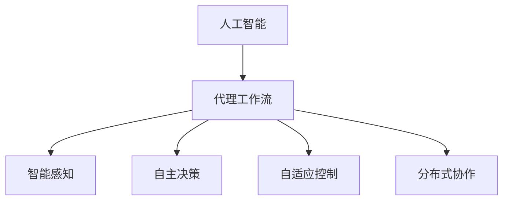

                 

# AI人工智能代理工作流 AI Agent WorkFlow：在能源管理中的应用

> 关键词：人工智能, 能源管理, 代理工作流, 智能调度, 自适应控制, 决策优化

## 1. 背景介绍

### 1.1 问题由来
随着全球能源需求的持续增长和环保压力的加剧，如何高效、智能地管理能源系统，实现能源供需平衡和环境友好，成为了各国政府和企业面临的共同挑战。传统能源管理依赖于人工调度，无法实时响应负荷变化和故障突发，容易出现电网崩溃和能源浪费。而人工智能技术的发展，尤其是智能代理技术的应用，为能源管理提供了新的解决方案。

### 1.2 问题核心关键点
人工智能代理工作流（AI Agent Workflow）是一种在能源管理领域应用广泛的人工智能技术。其核心思想是通过构建一个智能代理，该代理可以模拟人类专家的决策过程，在能源系统中自动执行任务，实现自主调度和优化。AI代理工作流一般包含以下几个关键点：

- 智能感知：代理通过传感器收集能源系统的实时数据，了解系统状态和行为。
- 自主决策：代理基于收集到的数据和预设规则，通过算法自动进行任务决策。
- 自适应控制：代理能够根据环境变化和任务需求，动态调整控制策略。
- 分布式协作：多个代理可以协同工作，优化系统整体性能。

## 2. 核心概念与联系

### 2.1 核心概念概述

为更好地理解AI人工智能代理工作流在能源管理中的应用，本节将介绍几个密切相关的核心概念：

- 人工智能（Artificial Intelligence, AI）：通过计算机算法模拟人类智能，实现自主学习、推理和决策。
- 代理（Agent）：在复杂系统中，模拟人类决策过程的智能实体。
- 智能感知（Intelligent Perception）：代理通过传感器、数据库等获取环境数据的能力。
- 自主决策（Autonomous Decision-Making）：代理根据预设规则和算法，自主进行任务决策的能力。
- 自适应控制（Adaptive Control）：代理能够根据环境变化动态调整控制策略的能力。
- 分布式协作（Distributed Collaboration）：多个代理协同工作，实现更高效的系统管理。

这些核心概念之间的逻辑关系可以通过以下Mermaid流程图来展示：



这个流程图展示了这个核心概念之间的联系：

1. 人工智能作为基础技术，提供了代理决策和控制的能力。
2. 代理通过智能感知获取环境数据，为决策提供依据。
3. 代理基于自主决策进行任务执行。
4. 代理能够根据环境变化进行自适应控制。
5. 多个代理可以协同工作，提高系统管理效率。

## 3. 核心算法原理 & 具体操作步骤
### 3.1 算法原理概述

AI人工智能代理工作流在能源管理中的应用，通常通过以下几个步骤实现：

1. **智能感知**：代理通过传感器、数据库等获取能源系统的实时数据，了解系统状态和行为。
2. **自主决策**：代理基于收集到的数据和预设规则，通过算法自动进行任务决策。
3. **自适应控制**：代理能够根据环境变化动态调整控制策略。
4. **分布式协作**：多个代理可以协同工作，优化系统整体性能。

### 3.2 算法步骤详解

以下是对AI人工智能代理工作流在能源管理中的应用，给出详细的算法步骤和具体操作步骤：

**Step 1: 智能感知与数据采集**

智能感知是代理工作流的基础，通过感知实时数据，代理能够了解系统当前状态和行为。具体步骤如下：

1. 安装传感器：在能源系统的关键位置安装传感器，如温度、压力、流量等，获取实时数据。
2. 数据集成：将传感器数据上传到集中数据库，用于后续分析和处理。
3. 数据清洗：对采集到的数据进行清洗和预处理，去除噪声和异常值。

**Step 2: 自主决策与任务执行**

自主决策是代理的核心功能，通过算法和规则，代理能够自动进行任务决策。具体步骤如下：

1. 建立决策模型：选择合适的决策模型，如规则引擎、优化算法等，用于自动决策。
2. 定义决策规则：根据任务需求，定义决策规则和约束条件。
3. 实时决策：根据感知到的数据，代理自动执行决策，调整系统参数。

**Step 3: 自适应控制与动态调整**

自适应控制是代理的高级功能，代理能够根据环境变化动态调整控制策略。具体步骤如下：

1. 设计控制策略：根据任务需求，设计控制策略，如PID控制、神经网络等。
2. 实时监控：实时监控系统状态和环境变化，判断是否需要调整控制策略。
3. 动态调整：根据监控结果，代理动态调整控制策略，优化系统性能。

**Step 4: 分布式协作与协同优化**

分布式协作是代理的高效功能，通过多个代理协同工作，优化系统整体性能。具体步骤如下：

1. 设计协同机制：选择合适的协同机制，如分布式优化算法、协同过滤等。
2. 数据共享：多个代理共享感知数据和决策结果，实现信息互通。
3. 协同优化：多个代理协同工作，优化系统整体性能。

### 3.3 算法优缺点

AI人工智能代理工作流在能源管理中的应用，具有以下优点：

- **高效响应**：代理能够实时感知系统状态，快速响应负荷变化和故障突发。
- **自主优化**：代理基于预设规则和算法，自主进行任务决策和优化，提升系统性能。
- **自适应控制**：代理能够根据环境变化动态调整控制策略，适应复杂多变的能源需求。
- **分布式协作**：多个代理协同工作，优化系统整体性能，实现更高效的系统管理。

同时，该方法也存在一定的局限性：

- **初始模型依赖**：代理的决策性能依赖于初始模型的设计和优化，需要大量前期工作。
- **环境复杂性**：能源系统的环境复杂多变，代理需要具备较强的鲁棒性和适应性。
- **数据质量要求高**：代理对感知数据的精度和完整性要求较高，传感器故障或数据丢失会影响决策效果。
- **协同机制设计难**：多个代理的协同机制设计复杂，需要考虑通信延迟、数据同步等问题。

尽管存在这些局限性，但AI人工智能代理工作流在能源管理中的应用已经取得了显著成效，成为能源管理领域的重要技术手段。

### 3.4 算法应用领域

AI人工智能代理工作流在能源管理中的应用，已经广泛应用于电力、天然气、水务等多个领域，具体包括：

- **智能电网**：代理在智能电网中，自动进行负荷预测、故障检测、电力调度等任务，提升电网稳定性和可靠性。
- **天然气管道**：代理在天然气管道中，自动进行流量控制、泄漏检测、压力调节等任务，保障管道安全稳定运行。
- **水务管理**：代理在水务管理中，自动进行流量监控、水质检测、泵站控制等任务，优化水资源利用效率。
- **可再生能源**：代理在可再生能源系统中，自动进行风电、光伏等能源调度，实现可再生能源的高效利用。

这些应用场景展示了AI人工智能代理工作流在能源管理中的强大功能和广泛适用性。

## 4. 数学模型和公式 & 详细讲解 & 举例说明（备注：数学公式请使用latex格式，latex嵌入文中独立段落使用 $$，段落内使用 $)
### 4.1 数学模型构建

在能源管理中，AI人工智能代理工作流的数学模型通常包括智能感知模型、自主决策模型、自适应控制模型和分布式协作模型。以下分别介绍这四个模型的构建方法：

1. **智能感知模型**：通过传感器获取实时数据，构建感知模型，用于代理对系统状态的监控。

2. **自主决策模型**：基于决策规则和算法，构建决策模型，用于代理自动进行任务决策。

3. **自适应控制模型**：根据环境变化，构建控制策略，用于代理动态调整控制策略。

4. **分布式协作模型**：构建协同机制，用于多个代理之间的信息共享和任务分配。

### 4.2 公式推导过程

以智能感知模型为例，假设代理通过传感器获取温度、压力、流量等数据，构建感知模型：

1. 数据采集：假设传感器采集到的温度数据为 $T(t)$，压力数据为 $P(t)$，流量数据为 $Q(t)$。
2. 数据预处理：对采集到的数据进行归一化处理，得到标准化数据 $X(t) = \frac{T(t) - \mu}{\sigma}$，其中 $\mu$ 为均值，$\sigma$ 为标准差。
3. 特征提取：通过特征提取算法，如PCA（主成分分析），将标准化数据 $X(t)$ 转换为特征向量 $Z(t)$。

假设数据采集间隔为 $\Delta t$，则 $Z(t)$ 可以表示为：

$$
Z(t) = \phi(X(t), \theta)
$$

其中，$\phi$ 为特征提取函数，$\theta$ 为特征提取参数。

### 4.3 案例分析与讲解

以智能电网为例，代理感知模型可以描述为：

- 数据采集：代理通过安装在电网关键节点上的传感器，采集电流、电压、频率等实时数据。
- 数据预处理：对采集到的数据进行去噪、归一化等预处理操作。
- 特征提取：通过特征提取算法，将预处理后的数据转换为电网状态特征向量。

代理自主决策模型可以描述为：

- 定义决策规则：根据电网负荷预测、故障检测、电力调度等任务，定义决策规则和约束条件。
- 实时决策：基于感知到的数据和决策规则，代理自动进行任务决策，如调整输电线路的电压和电流。

代理自适应控制模型可以描述为：

- 设计控制策略：根据任务需求，设计控制策略，如PID控制、神经网络等。
- 实时监控：实时监控电网状态和环境变化，判断是否需要调整控制策略。
- 动态调整：根据监控结果，代理动态调整控制策略，优化电网性能。

代理分布式协作模型可以描述为：

- 设计协同机制：选择合适的协同机制，如分布式优化算法、协同过滤等。
- 数据共享：多个代理共享感知数据和决策结果，实现信息互通。
- 协同优化：多个代理协同工作，优化电网整体性能。

## 5. 项目实践：代码实例和详细解释说明
### 5.1 开发环境搭建

在进行AI人工智能代理工作流在能源管理中的实践前，我们需要准备好开发环境。以下是使用Python进行PyTorch开发的环境配置流程：

1. 安装Anaconda：从官网下载并安装Anaconda，用于创建独立的Python环境。

2. 创建并激活虚拟环境：
```bash
conda create -n ai_agent_env python=3.8 
conda activate ai_agent_env
```

3. 安装PyTorch：根据CUDA版本，从官网获取对应的安装命令。例如：
```bash
conda install pytorch torchvision torchaudio cudatoolkit=11.1 -c pytorch -c conda-forge
```

4. 安装TensorFlow：由Google主导开发的开源深度学习框架，生产部署方便，适合大规模工程应用。同样有丰富的预训练语言模型资源。

5. 安装TensorFlow：
```bash
pip install tensorflow
```

6. 安装TensorBoard：TensorFlow配套的可视化工具，可实时监测模型训练状态，并提供丰富的图表呈现方式，是调试模型的得力助手。

7. 安装sklearn：用于数据预处理和特征提取等任务。

```bash
pip install scikit-learn
```

完成上述步骤后，即可在`ai_agent_env`环境中开始AI人工智能代理工作流的开发实践。

### 5.2 源代码详细实现

下面以智能电网为例，给出使用PyTorch对AI人工智能代理工作流进行开发的PyTorch代码实现。

首先，定义智能感知模型：

```python
import torch
from torch import nn

class SensorModel(nn.Module):
    def __init__(self, input_size, hidden_size, output_size):
        super(SensorModel, self).__init__()
        self.fc1 = nn.Linear(input_size, hidden_size)
        self.fc2 = nn.Linear(hidden_size, output_size)
        self.relu = nn.ReLU()

    def forward(self, x):
        x = self.fc1(x)
        x = self.relu(x)
        x = self.fc2(x)
        return x
```

然后，定义自主决策模型：

```python
import torch
from torch import nn

class DecisionModel(nn.Module):
    def __init__(self, input_size, hidden_size, output_size):
        super(DecisionModel, self).__init__()
        self.fc1 = nn.Linear(input_size, hidden_size)
        self.fc2 = nn.Linear(hidden_size, output_size)
        self.relu = nn.ReLU()

    def forward(self, x):
        x = self.fc1(x)
        x = self.relu(x)
        x = self.fc2(x)
        return x
```

接着，定义自适应控制模型：

```python
import torch
from torch import nn

class ControlModel(nn.Module):
    def __init__(self, input_size, hidden_size, output_size):
        super(ControlModel, self).__init__()
        self.fc1 = nn.Linear(input_size, hidden_size)
        self.fc2 = nn.Linear(hidden_size, output_size)
        self.relu = nn.ReLU()

    def forward(self, x):
        x = self.fc1(x)
        x = self.relu(x)
        x = self.fc2(x)
        return x
```

最后，定义分布式协作模型：

```python
import torch
from torch import nn

class CollaborationModel(nn.Module):
    def __init__(self, input_size, hidden_size, output_size):
        super(CollaborationModel, self).__init__()
        self.fc1 = nn.Linear(input_size, hidden_size)
        self.fc2 = nn.Linear(hidden_size, output_size)
        self.relu = nn.ReLU()

    def forward(self, x):
        x = self.fc1(x)
        x = self.relu(x)
        x = self.fc2(x)
        return x
```

在实际应用中，还需要将以上模型集成到代理工作流中，具体实现细节取决于具体任务需求。

### 5.3 代码解读与分析

让我们再详细解读一下关键代码的实现细节：

**SensorModel类**：
- `__init__`方法：定义感知模型的输入大小、隐藏大小和输出大小，并初始化全连接层和激活函数。
- `forward`方法：实现前向传播，通过全连接层和激活函数进行特征提取。

**DecisionModel类**：
- `__init__`方法：定义决策模型的输入大小、隐藏大小和输出大小，并初始化全连接层和激活函数。
- `forward`方法：实现前向传播，通过全连接层和激活函数进行决策输出。

**ControlModel类**：
- `__init__`方法：定义控制模型的输入大小、隐藏大小和输出大小，并初始化全连接层和激活函数。
- `forward`方法：实现前向传播，通过全连接层和激活函数进行控制策略调整。

**CollaborationModel类**：
- `__init__`方法：定义协作模型的输入大小、隐藏大小和输出大小，并初始化全连接层和激活函数。
- `forward`方法：实现前向传播，通过全连接层和激活函数进行协同优化。

## 6. 实际应用场景
### 6.1 智能电网

在智能电网中，AI人工智能代理工作流可以自动进行负荷预测、故障检测、电力调度等任务，提升电网稳定性和可靠性。具体应用如下：

**负荷预测**：代理通过感知电网实时数据，利用历史数据和天气预报等信息，自动进行负荷预测，优化发电计划和输电策略。

**故障检测**：代理通过实时监测电网状态，利用异常检测算法，自动检测故障并及时报警，提高电网运行的安全性和可靠性。

**电力调度**：代理通过实时监控电网状态，自动进行电力调度，调整输电线路的电压和电流，保证电网稳定运行。

### 6.2 天然气管道

在天然气管道中，AI人工智能代理工作流可以自动进行流量控制、泄漏检测、压力调节等任务，保障管道安全稳定运行。具体应用如下：

**流量控制**：代理通过感知管道实时数据，自动进行流量控制，保证管道流量的稳定性和可靠性。

**泄漏检测**：代理通过实时监测管道压力和温度等数据，自动检测泄漏并及时报警，提高管道运行的安全性和可靠性。

**压力调节**：代理通过实时监控管道状态，自动进行压力调节，保证管道压力的稳定性和可靠性。

### 6.3 水务管理

在水务管理中，AI人工智能代理工作流可以自动进行流量监控、水质检测、泵站控制等任务，优化水资源利用效率。具体应用如下：

**流量监控**：代理通过感知水务系统实时数据，自动进行流量监控，优化供水调度。

**水质检测**：代理通过实时监测水质数据，自动进行水质检测，保证供水质量。

**泵站控制**：代理通过实时监控水务系统状态，自动进行泵站控制，优化供水效率。

### 6.4 未来应用展望

随着AI人工智能代理工作流技术的不断进步，其在能源管理中的应用前景将更加广阔。未来，AI人工智能代理工作流将在以下领域得到更广泛的应用：

- **可再生能源管理**：代理在可再生能源系统中，自动进行风电、光伏等能源调度，实现可再生能源的高效利用。
- **智能交通管理**：代理在智能交通系统中，自动进行交通流量预测、拥堵控制等任务，优化交通运行效率。
- **智能制造管理**：代理在智能制造系统中，自动进行生产调度、设备维护等任务，提升生产效率和设备利用率。
- **智慧城市管理**：代理在智慧城市中，自动进行能源、交通、环境等管理任务，提升城市运行效率和居民生活质量。

这些应用场景展示了AI人工智能代理工作流在能源管理中的强大功能和广泛适用性。

## 7. 工具和资源推荐
### 7.1 学习资源推荐

为了帮助开发者系统掌握AI人工智能代理工作流在能源管理中的应用，这里推荐一些优质的学习资源：

1. 《人工智能在能源管理中的应用》系列博文：由能源管理领域的专家撰写，深入浅出地介绍了AI人工智能代理工作流在能源管理中的应用案例和实践技巧。

2. Coursera《人工智能在能源管理中的应用》课程：由知名大学开设的在线课程，涵盖AI人工智能代理工作流在能源管理中的应用，提供实战项目和案例分析。

3. 《能源管理中的AI人工智能代理工作流》书籍：详细介绍了AI人工智能代理工作流在能源管理中的应用，包括智能感知、自主决策、自适应控制等方面的内容。

4. 《智能电网中的AI人工智能代理工作流》书籍：介绍了AI人工智能代理工作流在智能电网中的应用，包括负荷预测、故障检测、电力调度等方面的内容。

5. 《天然气管道中的AI人工智能代理工作流》博客：介绍了AI人工智能代理工作流在天然气管道中的应用，包括流量控制、泄漏检测、压力调节等方面的内容。

通过对这些资源的学习实践，相信你一定能够快速掌握AI人工智能代理工作流在能源管理中的应用，并用于解决实际的能源管理问题。

### 7.2 开发工具推荐

高效的开发离不开优秀的工具支持。以下是几款用于AI人工智能代理工作流开发的常用工具：

1. PyTorch：基于Python的开源深度学习框架，灵活动态的计算图，适合快速迭代研究。大部分预训练语言模型都有PyTorch版本的实现。

2. TensorFlow：由Google主导开发的开源深度学习框架，生产部署方便，适合大规模工程应用。同样有丰富的预训练语言模型资源。

3. Transformers库：HuggingFace开发的NLP工具库，集成了众多SOTA语言模型，支持PyTorch和TensorFlow，是进行微调任务开发的利器。

4. Weights & Biases：模型训练的实验跟踪工具，可以记录和可视化模型训练过程中的各项指标，方便对比和调优。与主流深度学习框架无缝集成。

5. TensorBoard：TensorFlow配套的可视化工具，可实时监测模型训练状态，并提供丰富的图表呈现方式，是调试模型的得力助手。

6. Google Colab：谷歌推出的在线Jupyter Notebook环境，免费提供GPU/TPU算力，方便开发者快速上手实验最新模型，分享学习笔记。

合理利用这些工具，可以显著提升AI人工智能代理工作流在能源管理中的开发效率，加快创新迭代的步伐。

### 7.3 相关论文推荐

AI人工智能代理工作流在能源管理中的应用源于学界的持续研究。以下是几篇奠基性的相关论文，推荐阅读：

1. 《基于人工智能的智能电网优化调度》：介绍了AI人工智能代理工作流在智能电网中的应用，包括负荷预测、故障检测、电力调度等方面的内容。

2. 《智能管道中的AI人工智能代理工作流》：介绍了AI人工智能代理工作流在天然气管道中的应用，包括流量控制、泄漏检测、压力调节等方面的内容。

3. 《水务管理中的AI人工智能代理工作流》：介绍了AI人工智能代理工作流在水务管理中的应用，包括流量监控、水质检测、泵站控制等方面的内容。

4. 《能源管理中的AI人工智能代理工作流》：总结了AI人工智能代理工作流在能源管理中的应用，包括智能感知、自主决策、自适应控制等方面的内容。

这些论文代表了大语言模型微调技术的发展脉络。通过学习这些前沿成果，可以帮助研究者把握学科前进方向，激发更多的创新灵感。

## 8. 总结：未来发展趋势与挑战

### 8.1 总结

本文对AI人工智能代理工作流在能源管理中的应用进行了全面系统的介绍。首先阐述了AI人工智能代理工作流在能源管理中的研究背景和意义，明确了智能感知、自主决策、自适应控制和分布式协作等核心概念及其之间的联系。其次，从原理到实践，详细讲解了智能感知、自主决策、自适应控制和分布式协作的数学模型和算法步骤，给出了AI人工智能代理工作流在能源管理中的完整代码实例。同时，本文还广泛探讨了AI人工智能代理工作流在智能电网、天然气管道、水务管理等多个领域的应用前景，展示了其强大的功能和广泛适用性。此外，本文精选了AI人工智能代理工作流的各类学习资源，力求为读者提供全方位的技术指引。

通过本文的系统梳理，可以看到，AI人工智能代理工作流在能源管理中的应用已经取得了显著成效，成为能源管理领域的重要技术手段。未来，伴随AI人工智能代理工作流技术的不断进步，其在能源管理中的应用前景将更加广阔，为能源行业的智能化转型提供了新的思路和方向。

### 8.2 未来发展趋势

展望未来，AI人工智能代理工作流在能源管理中的应用将呈现以下几个发展趋势：

1. **模型复杂度提升**：随着算法和计算能力的提升，代理模型将更加复杂，能够处理更加复杂的任务和环境。
2. **数据多样性增强**：代理将能够处理多种类型的数据，如文本、图像、视频等，实现多模态数据的融合。
3. **自适应能力增强**：代理将具备更强的自适应能力，能够实时响应环境变化，优化系统性能。
4. **协同机制优化**：多个代理之间的协同机制将更加高效，能够实现更紧密的信息共享和任务分配。
5. **跨领域应用拓展**：AI人工智能代理工作流将在更多领域得到应用，如智能交通、智能制造、智慧城市等。
6. **知识图谱融合**：代理将与知识图谱进行融合，实现更全面的信息整合和知识驱动决策。

以上趋势凸显了AI人工智能代理工作流在能源管理中的广阔前景。这些方向的探索发展，必将进一步提升AI人工智能代理工作流的性能和应用范围，为能源行业的智能化转型提供新的动力。

### 8.3 面临的挑战

尽管AI人工智能代理工作流在能源管理中的应用已经取得了显著成效，但在迈向更加智能化、普适化应用的过程中，它仍面临着诸多挑战：

1. **数据质量要求高**：代理对感知数据的精度和完整性要求较高，传感器故障或数据丢失会影响决策效果。
2. **环境复杂性**：能源系统的环境复杂多变，代理需要具备较强的鲁棒性和适应性。
3. **模型复杂度提升**：模型复杂度的提升需要更多的计算资源和时间成本，如何平衡性能和效率是重要的研究方向。
4. **协同机制设计难**：多个代理的协同机制设计复杂，需要考虑通信延迟、数据同步等问题。
5. **安全性和隐私保护**：代理处理的数据往往涉及敏感信息，如何保障数据安全性和隐私保护是重要的研究方向。
6. **知识图谱构建**：代理与知识图谱进行融合时，需要构建高效的知识图谱表示和推理机制。

这些挑战需要研究者不断探索和优化，才能使AI人工智能代理工作流在能源管理中的应用更加成熟和可靠。

### 8.4 研究展望

面向未来，AI人工智能代理工作流在能源管理中的应用需要从以下几个方面进行进一步研究：

1. **高效数据采集**：研究高效、低成本的数据采集技术，如无人机、物联网等，实现环境数据的全面感知。
2. **智能感知优化**：研究更加智能的感知算法，提升代理的感知能力和数据处理效率。
3. **自主决策优化**：研究更高效的决策算法，提升代理的决策速度和准确性。
4. **自适应控制优化**：研究更加自适应的控制算法，提升代理的适应能力和鲁棒性。
5. **分布式协作优化**：研究更加高效的协同机制，提升代理的协同能力和信息共享效率。
6. **知识图谱融合**：研究高效的知识图谱表示和推理机制，提升代理的知识驱动决策能力。

这些研究方向将进一步提升AI人工智能代理工作流的性能和应用范围，为能源行业的智能化转型提供新的思路和方向。相信在研究者的共同努力下，AI人工智能代理工作流在能源管理中的应用将更加成熟和可靠，为能源行业的智能化转型提供新的动力。

## 9. 附录：常见问题与解答

**Q1：AI人工智能代理工作流在能源管理中的应用是否适用于所有能源系统？**

A: AI人工智能代理工作流在大多数能源系统中都能取得不错的效果，但对于一些特定领域的能源系统，如核能、氢能等，需要进行特定领域的优化和调整。

**Q2：代理感知模型的数据采集间隔应如何设定？**

A: 代理感知模型的数据采集间隔应根据能源系统的实际需求和环境变化来设定。一般建议选择适当的采样频率，既能够满足实时感知的要求，又不会造成过多的计算负担。

**Q3：代理自主决策模型的决策规则应如何设计？**

A: 代理自主决策模型的决策规则应根据具体的能源管理任务进行设计，包括决策目标、约束条件、优先级等。通常需要经过多次迭代优化，才能设计出高效、稳定的决策规则。

**Q4：代理自适应控制模型的控制策略应如何设计？**

A: 代理自适应控制模型的控制策略应根据具体的能源管理任务进行设计，包括控制目标、反馈机制、调整算法等。通常需要结合领域专家的经验，进行多轮实验和优化，才能设计出高效、稳定的控制策略。

**Q5：代理分布式协作模型的协同机制应如何设计？**

A: 代理分布式协作模型的协同机制应根据具体的能源管理任务进行设计，包括通信协议、数据同步、任务分配等。通常需要经过多次迭代优化，才能设计出高效、稳定的协同机制。

通过本文的系统梳理，可以看到，AI人工智能代理工作流在能源管理中的应用已经取得了显著成效，成为能源管理领域的重要技术手段。未来，伴随AI人工智能代理工作流技术的不断进步，其在能源管理中的应用前景将更加广阔，为能源行业的智能化转型提供新的思路和方向。

