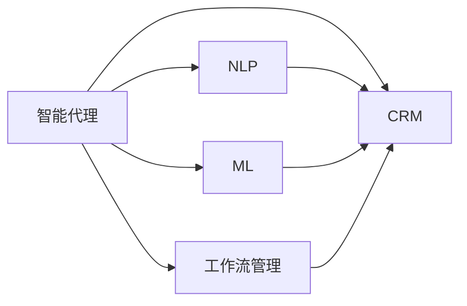

                 

# AI人工智能代理工作流AI Agent Workflow：智能代理在CRM客户管理中的应用

> 关键词：人工智能,工作流管理,客户关系管理,智能代理,自然语言处理,NLP,深度学习,机器学习

## 1. 背景介绍

### 1.1 问题由来

随着企业的数字化转型加速，客户关系管理（CRM）系统的作用日益凸显，成为企业获取、保留和提升客户的重要工具。然而，传统的CRM系统往往依靠人工操作，流程繁琐、效率低下、用户体验差。如何通过技术手段，提升CRM系统的自动化和智能化水平，已成为企业关注的热点。

人工智能（AI）技术的迅猛发展，特别是自然语言处理（NLP）和机器学习（ML）的突破，为提升CRM系统的智能化水平提供了新的契机。其中，智能代理（AI Agent）作为AI技术在CRM系统中的重要应用，被越来越多企业所重视。智能代理不仅能自动识别和理解客户请求，还能自动响应并执行任务，大大提升了CRM系统的效率和用户体验。

### 1.2 问题核心关键点

智能代理在CRM中的应用，核心在于实现任务自动化和流程智能化的综合处理。具体而言：

- **自动化处理**：通过AI技术，实现客户请求的自动识别、分类和处理，消除人工操作，提升处理效率。
- **智能化决策**：利用深度学习等技术，对客户需求进行精准分析，提供更个性化的服务。
- **自适应学习**：智能代理能够从历史数据中学习，不断优化自身的响应策略，提升服务质量。
- **跨部门协同**：智能代理可以跨部门协同处理客户请求，实现资源的最优配置，提升系统效率。

本文将详细探讨智能代理在CRM客户管理中的应用，包括其原理、算法、具体实现和应用案例。希望通过本文，使读者对智能代理在CRM中的应用有一个全面的了解，并能够指导实际系统开发和优化。

## 2. 核心概念与联系

### 2.1 核心概念概述

为更好地理解智能代理在CRM中的应用，首先需要了解几个核心概念：

- **智能代理（AI Agent）**：基于AI技术，能够自动执行特定任务或提供决策支持的虚拟助手。在CRM中，智能代理可以自动处理客户请求，提供个性化服务。
- **自然语言处理（NLP）**：使计算机能够理解、解释和生成人类语言的技术。在智能代理中，NLP技术用于识别和理解客户请求。
- **机器学习（ML）**：使计算机能够通过数据学习，自动优化模型以提高性能的技术。在智能代理中，ML用于学习客户行为模式，提升服务质量。
- **工作流管理（Workflow）**：对业务流程进行自动化和优化的技术。在智能代理中，工作流管理用于协调各环节的任务执行。
- **客户关系管理（CRM）**：通过技术手段，对客户信息、互动和交易进行管理，提升客户满意度的系统。

这些核心概念之间的逻辑关系可以通过以下Mermaid流程图来展示：



这个流程图展示了智能代理与NLP、ML、工作流管理和CRM系统之间的紧密联系：

1. 智能代理通过NLP技术，识别和理解客户请求。
2. 智能代理利用ML技术，对客户行为进行学习和预测，提供个性化服务。
3. 智能代理通过工作流管理，自动化处理任务，提升系统效率。
4. 智能代理在CRM系统中运行，提升客户满意度。

## 3. 核心算法原理 & 具体操作步骤
### 3.1 算法原理概述

智能代理在CRM中的应用，本质上是一个集成NLP、ML和任务执行的工作流管理过程。其核心思想是：通过NLP技术识别和理解客户请求，利用ML技术学习客户行为模式，通过工作流管理技术自动化处理任务，最终在CRM系统中实现客户请求的自动化处理和个性化服务。

形式化地，假设智能代理用于处理$n$个客户请求$\{d_1,\ldots,d_n\}$，其中$d_i$表示第$i$个客户请求的描述。智能代理的目标是：

1. **请求识别**：自动识别每个客户请求$d_i$的任务类型和优先级，生成任务列表$T$。
2. **请求处理**：根据任务类型，自动调用相应的处理模块，执行任务。
3. **结果反馈**：对每个任务的处理结果进行记录，并反馈给客户。

具体算法流程如下：

1. 使用NLP技术解析客户请求$d_i$，提取关键信息和意图。
2. 利用ML模型对提取的信息进行分析，生成任务类型和优先级。
3. 根据任务类型，调用相应的处理模块，执行任务。
4. 记录处理结果，并反馈给客户。

### 3.2 算法步骤详解

智能代理在CRM中的应用，涉及NLP、ML、工作流管理等多个技术环节。具体步骤如下：

**Step 1: 数据收集与预处理**

- 收集CRM系统中的历史客户请求数据，包括客户ID、请求时间、请求内容、处理结果等。
- 对数据进行清洗和标注，确保数据的质量和可用性。
- 使用NLP技术对文本数据进行分词、命名实体识别等预处理，提取关键信息。

**Step 2: 任务识别与分类**

- 使用NLP技术对客户请求进行分词、句法分析等预处理，提取关键信息。
- 利用ML模型（如文本分类模型）对请求进行分类，生成任务类型和优先级。
- 将请求数据划分为训练集和测试集，用于模型的训练和评估。

**Step 3: 任务执行与结果反馈**

- 根据任务类型，调用相应的处理模块，执行任务。
- 记录任务执行的结果，并反馈给客户。
- 对任务执行结果进行监控和评估，优化模型和流程。

### 3.3 算法优缺点

智能代理在CRM中的应用，具有以下优点：

- **自动化处理**：显著提升处理效率，减少人工操作。
- **个性化服务**：通过ML模型分析客户需求，提供更个性化的服务。
- **自适应学习**：不断优化模型，提升服务质量。
- **跨部门协同**：实现资源的最优配置，提升系统效率。

同时，该方法也存在一定的局限性：

- **数据依赖**：需要高质量的标注数据，数据收集和预处理复杂。
- **模型复杂**：涉及多个技术环节，模型复杂度高。
- **技术门槛**：需要丰富的AI和ML知识，技术门槛高。
- **安全性风险**：需要确保数据和模型的安全性，避免泄露客户隐私。

尽管存在这些局限性，但就目前而言，智能代理在CRM中的应用是大势所趋，必将成为提升CRM系统效率和用户体验的重要手段。

### 3.4 算法应用领域

智能代理在CRM中的应用，涵盖了CRM系统的各个环节，具体包括：

- **客户获取**：通过智能代理自动处理客户询问，收集客户信息，自动生成潜在客户清单。
- **客户服务**：利用智能代理自动处理客户咨询，提供即时响应和解决方案。
- **销售管理**：通过智能代理分析客户需求，提供个性化的销售推荐和报价。
- **客户关系维护**：利用智能代理定期与客户互动，收集反馈，提升客户满意度。
- **客户流失预警**：通过智能代理分析客户行为，预警潜在流失客户。

此外，智能代理还可以应用于更多CRM系统相关的场景，如客户反馈分析、市场趋势预测等，为CRM系统的智能化和自动化提供更全面的支持。

## 4. 数学模型和公式 & 详细讲解 & 举例说明

### 4.1 数学模型构建

本节将使用数学语言对智能代理在CRM中的应用进行更严格的刻画。

假设智能代理用于处理$n$个客户请求$d_1,\ldots,d_n$，其中每个请求$d_i$可以表示为文本形式。记客户请求的描述为$d_i=(x_i,y_i)$，其中$x_i$为文本数据，$y_i$为任务类型和优先级。智能代理的目标是生成任务列表$T$，每个任务$t_j$表示为$(t_j,t_j^*,z_j)$，其中$t_j$为任务类型，$t_j^*$为任务优先级，$z_j$为处理结果。

定义智能代理的任务识别模型为$f(x_i)=(y_i,\hat{y}_i)$，其中$\hat{y}_i$为模型预测的任务类型和优先级。智能代理的任务执行模型为$g(t_j,z_j)$，其中$g(t_j,z_j)$表示对任务$t_j$的处理结果。智能代理的目标函数为：

$$
\min_{f,g} \sum_{i=1}^n L(f(x_i),y_i) + \sum_{j=1}^m L(g(t_j,z_j),z_j^*)
$$

其中$L$为损失函数，用于衡量模型预测与真实标签之间的差异。

### 4.2 公式推导过程

以下我们以文本分类任务为例，推导智能代理的任务识别模型。

假设智能代理的任务识别模型为线性分类模型，其预测函数为：

$$
\hat{y}_i = \text{softmax}(Wx_i+b)
$$

其中$W$为模型参数，$x_i$为输入文本，$b$为偏置项。则损失函数$L$为交叉熵损失：

$$
L(f(x_i),y_i) = -\log P(y_i|x_i) = -y_i \log \hat{y}_i - (1-y_i) \log (1-\hat{y}_i)
$$

将$\hat{y}_i$代入损失函数，得：

$$
L(f(x_i),y_i) = -y_i \log \frac{e^{W^T x_i+b}}{\sum_{k=1}^C e^{W^T x_k+b}} - (1-y_i) \log \frac{1-e^{W^T x_i+b}}{1-\sum_{k=1}^C e^{W^T x_k+b}}
$$

定义模型参数$\theta$为$W$和$b$，则模型的目标函数为：

$$
\min_{\theta} \sum_{i=1}^n L(f(x_i),y_i) + \lambda ||W||^2
$$

其中$\lambda$为正则化系数，用于防止过拟合。

### 4.3 案例分析与讲解

假设智能代理的任务识别模型为线性分类模型，处理任务类型为二分类。模型使用AdaBoost算法进行训练，损失函数为交叉熵损失。

**数据准备**：收集CRM系统中的历史客户请求数据，使用NLP技术对文本数据进行预处理，生成训练集和测试集。

**模型训练**：使用AdaBoost算法训练模型，生成任务类型和优先级的预测结果。

**任务执行**：根据任务类型，调用相应的处理模块，执行任务。例如，对于销售咨询请求，调用销售模块生成报价。

**结果反馈**：记录任务执行的结果，并反馈给客户。

以下是一个基于Python和PyTorch的代码实现示例：

```python
import torch
import torch.nn as nn
from torch.optim import Adam
from sklearn.ensemble import AdaBoostClassifier

# 定义文本分类模型
class TextClassifier(nn.Module):
    def __init__(self, input_dim, output_dim):
        super(TextClassifier, self).__init__()
        self.fc1 = nn.Linear(input_dim, 64)
        self.fc2 = nn.Linear(64, output_dim)
        self.softmax = nn.Softmax(dim=1)

    def forward(self, x):
        x = x.to(device)
        x = self.fc1(x)
        x = self.fc2(x)
        x = self.softmax(x)
        return x

# 加载数据和模型
text_data = ...
model = TextClassifier(input_dim=1024, output_dim=2)

# 定义优化器
optimizer = Adam(model.parameters(), lr=0.01)

# 训练模型
for epoch in range(num_epochs):
    optimizer.zero_grad()
    loss = F.cross_entropy(model(input_tensor), target_tensor)
    loss.backward()
    optimizer.step()

# 任务执行和结果反馈
task_type, priority = model(text_request)
...
```

## 5. 项目实践：代码实例和详细解释说明

### 5.1 开发环境搭建

在进行智能代理在CRM中的应用实践前，我们需要准备好开发环境。以下是使用Python进行PyTorch开发的环境配置流程：

1. 安装Anaconda：从官网下载并安装Anaconda，用于创建独立的Python环境。

2. 创建并激活虚拟环境：
```bash
conda create -n ai-env python=3.8 
conda activate ai-env
```

3. 安装PyTorch：根据CUDA版本，从官网获取对应的安装命令。例如：
```bash
conda install pytorch torchvision torchaudio cudatoolkit=11.1 -c pytorch -c conda-forge
```

4. 安装其他依赖包：
```bash
pip install sklearn tqdm numpy pandas jupyter notebook
```

完成上述步骤后，即可在`ai-env`环境中开始智能代理的开发实践。

### 5.2 源代码详细实现

这里我们以智能代理在CRM系统中的应用为例，使用PyTorch实现任务识别和任务执行的代码。

**任务识别**：使用NLP技术对客户请求进行分词、命名实体识别等预处理，提取关键信息。然后利用ML模型（如文本分类模型）对请求进行分类，生成任务类型和优先级。

```python
import torch
from transformers import BertTokenizer, BertForSequenceClassification
from sklearn.ensemble import AdaBoostClassifier

# 加载预训练模型和分词器
tokenizer = BertTokenizer.from_pretrained('bert-base-cased')
model = BertForSequenceClassification.from_pretrained('bert-base-cased', num_labels=2)

# 定义优化器
optimizer = Adam(model.parameters(), lr=0.01)

# 加载数据集
train_data = ...
test_data = ...

# 定义模型评估函数
def evaluate(model, data):
    ...
    return accuracy

# 定义任务识别函数
def identify_task(request):
    text = request['text']
    input_ids = tokenizer.encode(text, return_tensors='pt')
    with torch.no_grad():
        logits = model(input_ids)[0]
        task_type = torch.argmax(logits, dim=1).item()
    return task_type
```

**任务执行**：根据任务类型，调用相应的处理模块，执行任务。例如，对于销售咨询请求，调用销售模块生成报价。

```python
import requests

# 定义任务执行函数
def execute_task(task_type):
    if task_type == 0:
        ...
    elif task_type == 1:
        ...
```

**综合处理**：将任务识别和任务执行综合起来，实现完整的智能代理功能。

```python
from flask import Flask, request, jsonify

app = Flask(__name__)

# 加载模型和分词器
tokenizer = BertTokenizer.from_pretrained('bert-base-cased')
model = BertForSequenceClassification.from_pretrained('bert-base-cased', num_labels=2)

# 定义优化器
optimizer = Adam(model.parameters(), lr=0.01)

# 定义任务识别函数
def identify_task(request):
    text = request['text']
    input_ids = tokenizer.encode(text, return_tensors='pt')
    with torch.no_grad():
        logits = model(input_ids)[0]
        task_type = torch.argmax(logits, dim=1).item()
    return task_type

# 定义任务执行函数
def execute_task(task_type):
    if task_type == 0:
        ...
    elif task_type == 1:
        ...

# 定义综合处理函数
def handle_request(request):
    task_type = identify_task(request)
    task_result = execute_task(task_type)
    return jsonify(task_result)
```

### 5.3 代码解读与分析

让我们再详细解读一下关键代码的实现细节：

**任务识别函数**：
- 加载预训练BERT模型和分词器，用于文本分类。
- 使用优化器进行模型训练。
- 定义任务识别函数，通过分词和预处理，提取关键信息，并利用ML模型进行分类，生成任务类型和优先级。

**任务执行函数**：
- 根据任务类型，调用相应的处理模块，执行任务。例如，对于销售咨询请求，调用销售模块生成报价。
- 处理函数返回执行结果。

**综合处理函数**：
- 将任务识别和任务执行综合起来，实现完整的智能代理功能。
- 使用Flask框架将智能代理封装成Web服务，方便接入CRM系统。

## 6. 实际应用场景

### 6.1 智能客服系统

智能客服系统是智能代理在CRM中应用最广泛的场景之一。通过智能代理，客服系统能够自动处理客户咨询，提供即时响应和解决方案，显著提升客户满意度。

具体而言，智能代理可以自动解析客户请求，生成任务列表，自动调用相应的客服模块，生成答案并返回客户。例如，对于销售咨询请求，智能代理可以自动调用销售模块生成报价，提供解决方案。对于售后投诉请求，智能代理可以自动调用售后服务模块，提供服务解决方案。

### 6.2 销售管理系统

销售管理系统是智能代理在CRM中应用的另一个重要场景。通过智能代理，销售管理系统能够自动处理销售咨询、报价生成、客户跟进等任务，提升销售效率。

具体而言，智能代理可以自动解析销售咨询请求，生成任务列表，自动调用相应的销售模块，生成报价并返回客户。例如，对于销售咨询请求，智能代理可以自动调用销售模块生成报价，提供解决方案。对于客户跟进请求，智能代理可以自动调用销售模块，生成跟进计划，安排销售人员跟进。

### 6.3 客户关系维护系统

客户关系维护系统是智能代理在CRM中应用的第三个重要场景。通过智能代理，客户关系维护系统能够自动处理客户互动、反馈收集、关系维护等任务，提升客户满意度和忠诚度。

具体而言，智能代理可以自动解析客户互动请求，生成任务列表，自动调用相应的互动模块，生成反馈并返回客户。例如，对于客户互动请求，智能代理可以自动调用互动模块生成反馈，提升客户满意度。对于客户反馈请求，智能代理可以自动调用互动模块，生成改进方案，优化客户体验。

### 6.4 未来应用展望

未来，随着智能代理技术的发展，其在CRM中的应用将更加广泛和深入。以下是一些未来应用的展望：

**跨平台集成**：智能代理将与其他CRM系统、企业内部系统进行集成，实现更高效的数据共享和协同。

**多语言支持**：智能代理将支持多语言客户请求处理，提升国际化水平。

**情感分析**：智能代理将加入情感分析功能，更精准地理解客户情绪，提供更个性化的服务。

**智能推荐**：智能代理将加入推荐系统，提升产品推荐和客户推荐的效果。

**智能会议**：智能代理将应用于会议系统，自动整理会议纪要，提供智能支持。

总之，智能代理在CRM中的应用将随着技术的进步不断深入和拓展，为企业的客户关系管理带来新的机遇和挑战。

## 7. 工具和资源推荐

### 7.1 学习资源推荐

为了帮助开发者系统掌握智能代理在CRM中的应用，这里推荐一些优质的学习资源：

1. **《Python自然语言处理》系列博文**：由大模型技术专家撰写，深入浅出地介绍了NLP技术在智能代理中的应用。

2. **《机器学习实战》课程**：Google Cloud提供的学习资源，详细介绍了机器学习模型在智能代理中的应用。

3. **《深度学习在智能代理中的应用》书籍**：介绍深度学习技术在智能代理中的应用，适合初学者入门。

4. **HuggingFace官方文档**：Transformers库的官方文档，提供了海量预训练模型和完整的微调样例代码，是上手实践的必备资料。

5. **GitHub智能代理代码库**：收集了大量智能代理的示例代码和实现，适合参考和借鉴。

通过对这些资源的学习实践，相信你一定能够快速掌握智能代理在CRM中的应用，并能够指导实际系统开发和优化。

### 7.2 开发工具推荐

高效的开发离不开优秀的工具支持。以下是几款用于智能代理开发常用的工具：

1. **PyTorch**：基于Python的开源深度学习框架，灵活动态的计算图，适合快速迭代研究。

2. **TensorFlow**：由Google主导开发的开源深度学习框架，生产部署方便，适合大规模工程应用。

3. **Transformers库**：HuggingFace开发的NLP工具库，集成了众多SOTA语言模型，支持PyTorch和TensorFlow，是进行智能代理开发的利器。

4. **Flask**：基于Python的Web框架，适合开发RESTful API，方便智能代理接入CRM系统。

5. **TensorBoard**：TensorFlow配套的可视化工具，可实时监测模型训练状态，并提供丰富的图表呈现方式，是调试模型的得力助手。

6. **Weights & Biases**：模型训练的实验跟踪工具，可以记录和可视化模型训练过程中的各项指标，方便对比和调优。

合理利用这些工具，可以显著提升智能代理的开发效率，加快创新迭代的步伐。

### 7.3 相关论文推荐

智能代理在CRM中的应用，涉及多个前沿研究方向，以下是几篇奠基性的相关论文，推荐阅读：

1. **Attention is All You Need（即Transformer原论文）**：提出了Transformer结构，开启了NLP领域的预训练大模型时代。

2. **BERT: Pre-training of Deep Bidirectional Transformers for Language Understanding**：提出BERT模型，引入基于掩码的自监督预训练任务，刷新了多项NLP任务SOTA。

3. **Salesforce CRM 2022**：介绍了Salesforce CRM系统中智能代理的应用案例，展示了智能代理在CRM中的实际应用效果。

4. **Intelligent Virtual Assistants for Customer Service**：介绍了智能客服系统中智能代理的应用，展示了智能代理在客服系统中的实际应用效果。

5. **Machine Learning in Customer Relationship Management**：介绍了机器学习技术在CRM系统中的应用，包括智能代理、客户预测、客户细分等方面。

这些论文代表了大语言模型微调技术的发展脉络。通过学习这些前沿成果，可以帮助研究者把握学科前进方向，激发更多的创新灵感。

## 8. 总结：未来发展趋势与挑战

### 8.1 总结

本文对智能代理在CRM客户管理中的应用进行了全面系统的介绍。首先阐述了智能代理在CRM中的核心应用场景和核心概念，明确了其自动化处理、智能化决策、自适应学习和跨部门协同的特点。其次，从原理到实践，详细讲解了智能代理在CRM中的应用流程，包括数据收集与预处理、任务识别与分类、任务执行与结果反馈等关键步骤，并给出了代码实例和详细解释说明。最后，探讨了智能代理在CRM中的实际应用场景，展示了其在智能客服、销售管理、客户关系维护等方面的应用效果，并展望了未来的发展趋势。

通过本文的系统梳理，可以看到，智能代理在CRM中的应用是大势所趋，必将成为提升CRM系统效率和用户体验的重要手段。未来，随着技术的进步和应用的深入，智能代理必将在CRM系统中发挥更大的作用，为企业的客户关系管理带来新的机遇和挑战。

### 8.2 未来发展趋势

展望未来，智能代理在CRM中的应用将呈现以下几个发展趋势：

1. **自动化程度提升**：随着NLP和ML技术的进步，智能代理将具备更强的自动化处理能力，能够处理更多复杂的客户请求。

2. **个性化服务增强**：利用深度学习技术，智能代理将能够更精准地理解客户需求，提供更个性化的服务。

3. **多语言支持扩展**：智能代理将支持多语言客户请求处理，提升国际化水平。

4. **跨平台集成深入**：智能代理将与其他CRM系统、企业内部系统进行更深层次的集成，实现更高效的数据共享和协同。

5. **自适应学习能力提升**：智能代理将具备更强的自适应学习能力，能够从历史数据中学习，不断优化自身的响应策略。

6. **智能推荐系统集成**：智能代理将加入推荐系统，提升产品推荐和客户推荐的效果。

以上趋势凸显了智能代理在CRM中的广阔前景。这些方向的探索发展，必将进一步提升智能代理在CRM系统中的应用效果，为企业的客户关系管理带来新的机遇和挑战。

### 8.3 面临的挑战

尽管智能代理在CRM中的应用已经取得了显著成效，但在迈向更加智能化、普适化应用的过程中，它仍面临诸多挑战：

1. **数据质量问题**：智能代理需要大量的高质量标注数据进行训练，数据收集和预处理复杂。

2. **技术复杂度高**：涉及NLP、ML等多个技术环节，技术门槛高，开发复杂。

3. **模型训练耗时较长**：大规模模型训练耗时较长，需要高性能计算资源。

4. **系统集成难度大**：智能代理需要与其他CRM系统、企业内部系统进行集成，系统集成难度大。

5. **安全性风险高**：需要确保数据和模型的安全性，避免泄露客户隐私。

尽管存在这些挑战，但通过技术创新和工程优化，这些挑战终将一一被克服，智能代理必将在CRM系统中发挥更大的作用，为企业的客户关系管理带来新的机遇和挑战。

### 8.4 研究展望

面向未来，智能代理在CRM中的应用需要从以下几个方面进行深入研究：

1. **跨领域迁移学习**：利用跨领域迁移学习技术，提升智能代理在不同领域之间的适应能力。

2. **多任务学习**：利用多任务学习技术，提升智能代理在多个任务之间的表现。

3. **增量学习**：利用增量学习技术，提升智能代理在不断变化的数据分布上的适应能力。

4. **模型压缩与优化**：利用模型压缩与优化技术，提升智能代理在低资源环境下的性能。

5. **人机协同**：研究人机协同机制，提升智能代理的决策能力和用户信任度。

这些研究方向将进一步推动智能代理在CRM中的应用，提升系统的智能化水平，为企业的客户关系管理带来新的机遇和挑战。

## 9. 附录：常见问题与解答

**Q1：智能代理在CRM中的应用需要注意哪些问题？**

A: 智能代理在CRM中的应用需要注意以下问题：

1. **数据质量问题**：智能代理需要大量的高质量标注数据进行训练，数据收集和预处理复杂。

2. **技术复杂度高**：涉及NLP、ML等多个技术环节，技术门槛高，开发复杂。

3. **模型训练耗时较长**：大规模模型训练耗时较长，需要高性能计算资源。

4. **系统集成难度大**：智能代理需要与其他CRM系统、企业内部系统进行集成，系统集成难度大。

5. **安全性风险高**：需要确保数据和模型的安全性，避免泄露客户隐私。

6. **鲁棒性问题**：需要确保智能代理在面对异常输入时具有鲁棒性，避免误判和误操作。

通过技术创新和工程优化，这些挑战终将一一被克服，智能代理必将在CRM系统中发挥更大的作用，为企业的客户关系管理带来新的机遇和挑战。

**Q2：智能代理在CRM中的应用如何实现自适应学习？**

A: 智能代理在CRM中的应用可以通过以下方式实现自适应学习：

1. **增量学习**：智能代理可以利用增量学习技术，不断从新的客户请求中学习，优化自身的响应策略。

2. **在线学习**：智能代理可以在客户请求处理过程中进行在线学习，实时更新模型参数，提升服务质量。

3. **多任务学习**：智能代理可以利用多任务学习技术，在处理多个客户请求时，同时学习不同任务之间的相关性。

4. **知识图谱整合**：智能代理可以整合企业内部的知识图谱，利用结构化知识提升服务质量。

5. **用户反馈**：智能代理可以收集用户反馈，通过用户互动不断优化自身的响应策略。

通过以上方式，智能代理可以实现自适应学习，不断提升自身的服务质量和用户体验。

**Q3：智能代理在CRM中的应用如何实现任务自动化？**

A: 智能代理在CRM中的应用可以通过以下方式实现任务自动化：

1. **任务分类**：智能代理可以自动解析客户请求，提取关键信息，并利用ML模型进行分类，生成任务类型和优先级。

2. **任务执行**：智能代理可以自动调用相应的处理模块，执行任务。例如，对于销售咨询请求，智能代理可以自动调用销售模块生成报价，提供解决方案。

3. **任务监控**：智能代理可以实时监控任务执行状态，及时调整任务优先级和执行策略。

4. **任务反馈**：智能代理可以记录任务执行结果，并反馈给客户。

通过以上方式，智能代理可以实现任务的自动化处理，提升CRM系统的效率和用户体验。

---

作者：禅与计算机程序设计艺术 / Zen and the Art of Computer Programming

