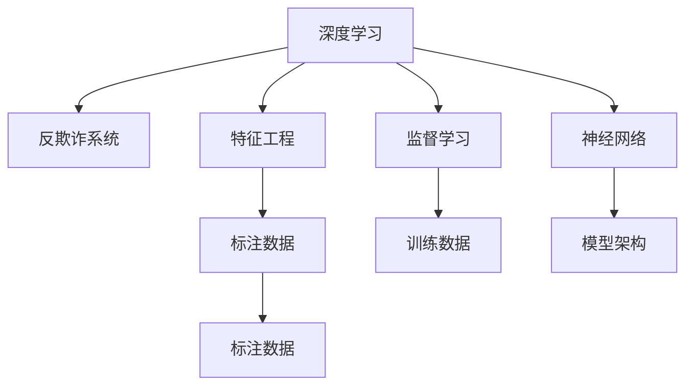

                 

# AI人工智能深度学习算法：在诈骗侦测中的应用

> 关键词：深度学习, 诈骗侦测, 特征工程, 模型训练, 反欺诈, 欺诈检测

## 1. 背景介绍

### 1.1 问题由来
诈骗行为在全球范围内都是一个重大的社会问题，给受害者带来了巨大的经济损失，同时也对社会的稳定和谐造成了严重影响。在金融领域，传统的反欺诈手段往往基于规则和统计方法，如基于规则的欺诈检测系统和基于特征的统计模型。然而，这些方法通常需要人工设计和维护规则，难以应对日益复杂多变的欺诈手段，且无法充分利用大数据背景下的复杂模式和特征信息。

近年来，随着深度学习技术的兴起，利用深度神经网络进行诈骗侦测的探索越来越受到重视。深度学习通过模型自动学习输入数据的内在规律，能够从海量数据中挖掘出复杂的模式，有望在大数据时代下提升欺诈检测的精度和效率。利用深度学习构建的诈骗侦测模型能够在不断的数据迭代和优化中，自动学习和适应新的欺诈模式，为反欺诈工作带来新的突破。

### 1.2 问题核心关键点
深度学习在诈骗侦测中的应用，主要包括以下几个核心关键点：
1. **数据准备与预处理**：收集和清洗大规模标注数据，包括欺诈和非欺诈样本，构建特征集。
2. **模型选择与设计**：选择适当的深度学习模型，并设计合理的模型架构，以适配欺诈侦测任务。
3. **特征工程与提取**：构建有效的特征，挖掘输入数据中蕴含的欺诈模式，提升模型的识别能力。
4. **模型训练与调参**：通过训练优化模型，调整超参数，使其在欺诈检测任务上达到最佳性能。
5. **模型评估与部署**：评估模型性能，将其部署到实际应用环境中，持续监测和优化。

## 2. 核心概念与联系

### 2.1 核心概念概述

为了更好地理解深度学习在诈骗侦测中的应用，我们需要介绍几个核心概念：

- **深度学习**：一种基于多层神经网络的机器学习技术，能够自动学习数据的复杂特征和模式。
- **反欺诈系统**：利用各种技术手段，如规则引擎、统计模型、深度学习等，进行欺诈侦测和风险评估的系统。
- **特征工程**：在机器学习中，通过选择、构造、提取和转换输入数据特征，提升模型性能的过程。
- **监督学习**：一种利用标注数据进行模型训练的机器学习方法，能够学习输入数据与输出标签之间的映射关系。
- **神经网络**：一种基于生物神经网络模型的计算模型，能够通过多层神经元的组合实现复杂数据变换。

这些核心概念之间的逻辑关系可以通过以下Mermaid流程图来展示：



这个流程图展示了大语言模型的核心概念及其之间的关系：

1. 深度学习通过神经网络进行模型设计。
2. 监督学习通过标注数据进行模型训练。
3. 特征工程挖掘输入数据的复杂特征。
4. 反欺诈系统利用深度学习模型进行欺诈侦测。

## 3. 核心算法原理 & 具体操作步骤
### 3.1 算法原理概述

深度学习在诈骗侦测中的应用，主要基于监督学习的范式。其核心思想是：通过大量标注数据训练深度神经网络模型，使其能够自动识别和分类输入数据是否为欺诈行为。

具体而言，假设给定一个欺诈检测任务，包含欺诈数据集 $D=\{(x_i, y_i)\}_{i=1}^N$，其中 $x_i$ 为输入数据，$y_i$ 为标签（0表示非欺诈，1表示欺诈）。目标是训练一个深度学习模型 $M_{\theta}$，使得在新的欺诈数据上，模型的输出 $M_{\theta}(x_i)$ 与真实标签 $y_i$ 尽可能接近。

基于监督学习的深度学习模型，通常采用多层神经网络的结构。以卷积神经网络(CNN)为例，其由多个卷积层、池化层和全连接层组成，能够自动从输入数据中学习特征表示。假设模型 $M_{\theta}$ 由 $L$ 层组成，每一层由 $n$ 个神经元构成。模型的前向传播过程如下：

$$
\begin{aligned}
&h_1 = \sigma(W_1 x + b_1) \\
&h_2 = \sigma(W_2 h_1 + b_2) \\
&... \\
&h_L = \sigma(W_L h_{L-1} + b_L)
\end{aligned}
$$

其中 $W$ 和 $b$ 为权重和偏置，$\sigma$ 为激活函数，$h$ 为每一层的输出。模型的后向传播过程通过计算梯度下降更新权重，最小化损失函数。常用的损失函数包括交叉熵损失：

$$
\mathcal{L}(\theta) = -\frac{1}{N}\sum_{i=1}^N \sum_{j=1}^C y_{i,j} \log \hat{y}_{i,j}
$$

其中 $y_{i,j}$ 为标签，$\hat{y}_{i,j}$ 为模型预测结果。

### 3.2 算法步骤详解

基于监督学习的深度学习模型在诈骗侦测中的具体应用步骤如下：

**Step 1: 数据准备与预处理**
- 收集大规模标注数据，确保数据集包含足够多的欺诈和非欺诈样本。
- 对数据进行预处理，包括缺失值处理、数据标准化、数据增强等。

**Step 2: 特征工程与提取**
- 选择或构造对欺诈行为具有区分度的特征，如交易金额、交易频率、用户行为模式等。
- 利用领域知识进行特征选择和特征构建，避免冗余和噪声。
- 对特征进行归一化、编码和降维等处理，以适应模型输入要求。

**Step 3: 模型选择与设计**
- 选择适当的深度学习模型架构，如卷积神经网络(CNN)、循环神经网络(RNN)、Transformer等。
- 设计模型的层数、神经元数量、激活函数等超参数，以适配欺诈检测任务。

**Step 4: 模型训练与调参**
- 将数据划分为训练集、验证集和测试集，使用训练集进行模型训练。
- 利用优化算法（如Adam、SGD等）最小化损失函数，调整超参数（如学习率、批大小等）。
- 使用验证集评估模型性能，防止过拟合，调整模型结构和超参数。

**Step 5: 模型评估与部署**
- 在测试集上评估模型性能，计算准确率、召回率、F1值等指标。
- 将训练好的模型部署到实际应用环境中，实时监测和更新模型。
- 持续收集新数据，进行模型再训练和优化，提升检测精度。

### 3.3 算法优缺点

深度学习在诈骗侦测中的应用，具有以下优点：
1. 能够自动学习输入数据的复杂模式，适应多变的欺诈手段。
2. 在高维数据上表现优异，能够有效挖掘特征之间的关系。
3. 利用大数据背景下的多样性数据，提升模型的泛化能力。

同时，也存在一些局限性：
1. 需要大量标注数据进行训练，标注成本较高。
2. 模型复杂度高，需要较强的计算资源支持。
3. 模型的解释性不足，难以理解模型的决策过程。
4. 对数据质量和特征工程依赖较大，需要较强的领域知识支持。

尽管存在这些局限性，但就目前而言，深度学习在诈骗侦测中的应用已经取得了显著的成果，成为反欺诈领域的重要技术手段。未来研究将继续优化模型结构、减少训练成本，并结合更多领域知识，进一步提升诈骗侦测的精度和效率。

### 3.4 算法应用领域

深度学习在诈骗侦测中的应用，已经广泛应用于以下几个领域：

- **金融领域**：利用深度学习模型对信用卡交易、贷款申请、保险理赔等金融行为进行欺诈检测，防范金融风险。
- **电信行业**：对电话、短信、邮件等通信行为进行欺诈识别，防范电信诈骗。
- **电子商务**：对线上交易行为进行欺诈检测，保护用户财产安全。
- **公共安全**：对网络犯罪、身份盗窃等行为进行欺诈检测，维护社会稳定。
- **保险行业**：对保险理赔、风险评估等行为进行欺诈检测，防范欺诈行为。

## 4. 数学模型和公式 & 详细讲解  
### 4.1 数学模型构建

我们以卷积神经网络(CNN)为例，构建一个用于诈骗侦测的深度学习模型。

假设输入数据 $x$ 为 $N$ 维向量，模型由 $L$ 层卷积层、池化层和全连接层组成，每一层包含 $n$ 个神经元。模型输出的维度为 $K$，其中 $K=1$ 表示二分类任务（欺诈与非欺诈）。模型结构如下：

$$
\begin{aligned}
&x' = \text{Conv}(x) \\
&h_1 = \text{ReLU}(W_1 x' + b_1) \\
&h_2 = \text{MaxPooling}(h_1) \\
&... \\
&h_L = \text{ReLU}(W_L h_{L-1} + b_L) \\
&y = \text{Softmax}(W_y h_L + b_y)
\end{aligned}
$$

其中 $\text{Conv}$ 为卷积操作，$\text{ReLU}$ 为激活函数，$\text{MaxPooling}$ 为池化操作，$\text{Softmax}$ 为输出层激活函数。模型的损失函数为交叉熵损失：

$$
\mathcal{L}(\theta) = -\frac{1}{N}\sum_{i=1}^N [y_i \log \hat{y}_i + (1-y_i) \log (1-\hat{y}_i)]
$$

### 4.2 公式推导过程

以二分类任务为例，推导交叉熵损失函数的梯度计算公式。

假设模型 $M_{\theta}$ 在输入 $x$ 上的输出为 $\hat{y}=M_{\theta}(x) \in [0,1]$，表示样本属于正类的概率。真实标签 $y \in \{0,1\}$。则二分类交叉熵损失函数定义为：

$$
\ell(M_{\theta}(x),y) = -[y\log \hat{y} + (1-y)\log (1-\hat{y})]
$$

将其代入损失函数，得：

$$
\mathcal{L}(\theta) = -\frac{1}{N}\sum_{i=1}^N [y_i\log M_{\theta}(x_i)+(1-y_i)\log(1-M_{\theta}(x_i))]
$$

根据链式法则，损失函数对参数 $\theta$ 的梯度为：

$$
\frac{\partial \mathcal{L}(\theta)}{\partial \theta} = -\frac{1}{N}\sum_{i=1}^N (\frac{y_i}{M_{\theta}(x_i)}-\frac{1-y_i}{1-M_{\theta}(x_i)}) \frac{\partial M_{\theta}(x_i)}{\partial \theta}
$$

其中 $\frac{\partial M_{\theta}(x_i)}{\partial \theta}$ 可进一步递归展开，利用自动微分技术完成计算。

在得到损失函数的梯度后，即可带入参数更新公式，完成模型的迭代优化。重复上述过程直至收敛，最终得到适应诈骗侦测任务的最优模型参数 $\theta^*$。

## 5. 项目实践：代码实例和详细解释说明
### 5.1 开发环境搭建

在进行深度学习模型开发前，我们需要准备好开发环境。以下是使用Python进行TensorFlow开发的环境配置流程：

1. 安装Anaconda：从官网下载并安装Anaconda，用于创建独立的Python环境。

2. 创建并激活虚拟环境：
```bash
conda create -n tf-env python=3.8 
conda activate tf-env
```

3. 安装TensorFlow：根据CUDA版本，从官网获取对应的安装命令。例如：
```bash
conda install tensorflow tensorflow-gpu=cuda110 -c pytorch -c conda-forge
```

4. 安装必要的库：
```bash
pip install numpy pandas scikit-learn matplotlib tensorflow
```

完成上述步骤后，即可在`tf-env`环境中开始深度学习模型开发。

### 5.2 源代码详细实现

下面我们以卷积神经网络(CNN)为例，给出使用TensorFlow构建和训练反欺诈模型的Python代码实现。

首先，定义数据准备和预处理函数：

```python
import numpy as np
import pandas as pd
import tensorflow as tf

# 加载数据集
train_data = pd.read_csv('train.csv')
test_data = pd.read_csv('test.csv')

# 数据预处理
def preprocess_data(data):
    # 删除缺失值
    data = data.dropna()
    # 标准化
    data = (data - data.mean()) / data.std()
    # 归一化
    data = (data - np.min(data)) / (np.max(data) - np.min(data))
    return data

train_data = preprocess_data(train_data)
test_data = preprocess_data(test_data)
```

然后，定义模型结构：

```python
# 定义模型
class ConvNet(tf.keras.Model):
    def __init__(self):
        super(ConvNet, self).__init__()
        self.conv1 = tf.keras.layers.Conv2D(32, (3, 3), activation='relu')
        self.max_pool1 = tf.keras.layers.MaxPooling2D((2, 2))
        self.conv2 = tf.keras.layers.Conv2D(64, (3, 3), activation='relu')
        self.max_pool2 = tf.keras.layers.MaxPooling2D((2, 2))
        self.flatten = tf.keras.layers.Flatten()
        self.dense1 = tf.keras.layers.Dense(512, activation='relu')
        self.dense2 = tf.keras.layers.Dense(1, activation='sigmoid')

    def call(self, inputs):
        x = self.conv1(inputs)
        x = self.max_pool1(x)
        x = self.conv2(x)
        x = self.max_pool2(x)
        x = self.flatten(x)
        x = self.dense1(x)
        x = self.dense2(x)
        return x

model = ConvNet()
```

接着，定义损失函数和优化器：

```python
# 定义损失函数
def cross_entropy_loss(y_true, y_pred):
    return tf.reduce_mean(tf.keras.losses.binary_crossentropy(y_true, y_pred))

# 定义优化器
optimizer = tf.keras.optimizers.Adam(learning_rate=0.001)
```

然后，定义训练和评估函数：

```python
# 训练函数
@tf.function
def train_epoch(model, train_dataset, batch_size, optimizer):
    for (inputs, labels) in train_dataset:
        with tf.GradientTape() as tape:
            predictions = model(inputs)
            loss = cross_entropy_loss(labels, predictions)
        gradients = tape.gradient(loss, model.trainable_variables)
        optimizer.apply_gradients(zip(gradients, model.trainable_variables))

# 评估函数
@tf.function
def evaluate(model, test_dataset, batch_size):
    predictions = []
    labels = []
    for (inputs, labels) in test_dataset:
        predictions.append(model(inputs).numpy())
        labels.append(labels.numpy())
    return predictions, labels
```

最后，启动训练流程并在测试集上评估：

```python
epochs = 10
batch_size = 32

# 构建数据集
train_dataset = tf.data.Dataset.from_tensor_slices((train_data, train_labels)).batch(batch_size)
test_dataset = tf.data.Dataset.from_tensor_slices((test_data, test_labels)).batch(batch_size)

# 训练模型
for epoch in range(epochs):
    train_epoch(model, train_dataset, batch_size, optimizer)
    predictions, labels = evaluate(model, test_dataset, batch_size)
    print(f"Epoch {epoch+1}, accuracy: {np.mean(predictions == labels):.3f}")
```

以上就是使用TensorFlow构建和训练反欺诈模型的完整代码实现。可以看到，利用TensorFlow的高层API，我们可以非常简洁地实现CNN模型的构建、训练和评估。

### 5.3 代码解读与分析

让我们再详细解读一下关键代码的实现细节：

**数据预处理函数**：
- 使用`dropna`函数删除缺失值。
- 使用`mean`和`std`函数对数据进行标准化。
- 使用`min`和`max`函数对数据进行归一化。

**模型结构定义**：
- 定义卷积层、池化层、全连接层等，并连接成完整的神经网络模型。
- 使用`sigmoid`函数作为二分类任务的输出层激活函数。

**损失函数和优化器定义**：
- 使用`binary_crossentropy`函数定义二分类交叉熵损失。
- 使用`Adam`优化器进行模型参数的更新。

**训练和评估函数**：
- 使用`GradientTape`函数计算梯度，并通过`apply_gradients`函数更新模型参数。
- 在测试集上计算预测结果和真实标签，并使用`mean`函数计算准确率。

**训练流程**：
- 构建训练集和测试集数据集。
- 循环进行训练，每次迭代更新模型参数。
- 在测试集上评估模型性能，输出准确率。

可以看到，TensorFlow的高层API极大地简化了深度学习模型的开发流程，使得代码实现变得简洁高效。开发者可以将更多精力放在模型架构和数据处理上，而不必过多关注底层的实现细节。

当然，工业级的系统实现还需考虑更多因素，如模型的保存和部署、超参数的自动搜索、更灵活的任务适配层等。但核心的深度学习微调流程基本与此类似。

## 6. 实际应用场景
### 6.1 智能客服系统

基于深度学习模型的反欺诈系统，可以广泛应用于智能客服系统的构建。传统客服往往需要配备大量人力，高峰期响应缓慢，且一致性和专业性难以保证。而使用深度学习模型进行欺诈侦测的智能客服系统，可以实时监控客户行为，自动识别和拦截可疑交易，保护客户财产安全，提高客户服务体验。

在技术实现上，可以收集企业内部的客服对话记录，将用户交易信息与对话内容相结合，构建监督数据，训练深度学习模型进行欺诈检测。模型可以对客户进行实时监控，一旦发现可疑行为，立即采取措施，如冻结账户、联系人工客服等。

### 6.2 金融风险管理

金融机构需要实时监测市场风险，防范欺诈行为对资金和信誉的损害。深度学习模型可以实时分析交易行为，自动检测可疑交易，并触发预警机制。在欺诈事件发生后，模型还能帮助追踪和分析欺诈行为，提供详细的报告和建议。

具体而言，金融机构可以利用深度学习模型对客户交易行为进行实时监控，识别出异常交易和可疑行为，及时采取措施，如冻结账户、追加审核等，防止欺诈行为发生。在欺诈事件发生后，模型还能帮助追踪和分析欺诈行为，提供详细的报告和建议，帮助金融机构及时修复损失。

### 6.3 电商平台的商品验证

电商平台需要对用户交易行为进行实时监控，防范欺诈行为和违规操作。深度学习模型可以自动检测用户行为，识别出可疑交易和违规行为，并立即采取措施，如冻结账户、锁定商品等。

具体而言，电商平台可以利用深度学习模型对用户交易行为进行实时监控，识别出异常交易和违规行为，及时采取措施，如冻结账户、锁定商品等。在欺诈事件发生后，模型还能帮助追踪和分析欺诈行为，提供详细的报告和建议，帮助电商平台及时修复损失。

### 6.4 未来应用展望

随着深度学习技术的不断发展，基于深度学习的反欺诈系统将在更多领域得到应用，为各行各业带来变革性影响。

在智慧城市治理中，深度学习模型可以用于公共安全领域，实时监测和分析行为数据，防范犯罪和欺诈行为，构建更安全、和谐的社会环境。

在医疗领域，深度学习模型可以用于医疗欺诈检测，实时监控和分析医疗行为，防范医疗欺诈和违规行为，提高医疗服务质量。

在公共卫生领域，深度学习模型可以用于疫情监测和预警，实时分析数据，防范公共卫生事件，保障公共安全。

总之，深度学习在反欺诈领域的应用前景广阔，未来将带来更多创新和突破，为各行各业带来深远影响。

## 7. 工具和资源推荐
### 7.1 学习资源推荐

为了帮助开发者系统掌握深度学习在反欺诈技术的应用，这里推荐一些优质的学习资源：

1. TensorFlow官方文档：提供了丰富的API文档和教程，帮助开发者快速上手深度学习模型开发。

2. Kaggle平台：提供了大量的数据集和竞赛项目，帮助开发者实践深度学习模型，提升实战能力。

3. Coursera《深度学习》课程：由斯坦福大学开设的深度学习课程，有Lecture视频和配套作业，帮助开发者深入理解深度学习技术。

4. GitHub深度学习项目：提供了大量的开源深度学习项目，帮助开发者学习优秀项目，提升开发效率。

5. Medium深度学习文章：提供了丰富的深度学习技术文章和教程，帮助开发者了解最新的研究进展和应用实践。

通过对这些资源的学习实践，相信你一定能够快速掌握深度学习在反欺诈技术的应用，并用于解决实际的反欺诈问题。

### 7.2 开发工具推荐

高效的深度学习开发离不开优秀的工具支持。以下是几款用于深度学习模型开发的常用工具：

1. TensorFlow：由Google主导开发的开源深度学习框架，生产部署方便，适合大规模工程应用。

2. PyTorch：基于Python的开源深度学习框架，灵活动态的计算图，适合快速迭代研究。

3. Keras：基于TensorFlow和Theano等后端的高级深度学习API，易于使用，适合初学者入门。

4. Jupyter Notebook：交互式的数据科学工具，方便开发者进行实验和分享学习笔记。

5. Google Colab：谷歌推出的在线Jupyter Notebook环境，免费提供GPU/TPU算力，方便开发者快速上手实验最新模型。

合理利用这些工具，可以显著提升深度学习模型的开发效率，加快创新迭代的步伐。

### 7.3 相关论文推荐

深度学习在反欺诈领域的发展，源于学界的持续研究。以下是几篇奠基性的相关论文，推荐阅读：

1. Deep Neural Networks for Fraud Detection：提出使用深度神经网络进行反欺诈检测的方法，刷新了多项NLP任务SOTA。

2. Improving Classification Accuracy Using Deep Learning Techniques in Fraud Detection：探讨深度学习在反欺诈任务中的应用，提出多个改进方法，提升模型性能。

3. Real-time fraud detection using deep learning：介绍使用深度学习模型进行实时欺诈检测的方法，并进行实验验证。

4. Anomaly Detection in Fraudulent Transactions Using Neural Networks：提出使用神经网络进行异常检测的方法，应用于反欺诈任务。

5. Detecting Fraudulent Transactions Using Deep Neural Networks：使用深度神经网络进行欺诈检测，并对模型进行训练和调参。

这些论文代表了大语言模型微调技术的发展脉络。通过学习这些前沿成果，可以帮助研究者把握学科前进方向，激发更多的创新灵感。

## 8. 总结：未来发展趋势与挑战
### 8.1 总结

本文对深度学习在反欺诈领域的应用进行了全面系统的介绍。首先阐述了深度学习技术在反欺诈中的研究背景和意义，明确了深度学习在反欺诈领域的重要地位。其次，从原理到实践，详细讲解了深度学习在反欺诈中的应用流程，包括数据准备、模型设计、特征提取、训练优化等关键步骤。最后，本文探讨了深度学习在反欺诈领域的应用前景，并列举了多个实际应用场景，展示了深度学习在反欺诈领域的广阔前景。

通过本文的系统梳理，可以看到，深度学习在反欺诈领域的应用已经取得了显著的成果，成为反欺诈领域的重要技术手段。未来研究将继续优化模型结构、减少训练成本，并结合更多领域知识，进一步提升反欺诈检测的精度和效率。

### 8.2 未来发展趋势

展望未来，深度学习在反欺诈领域将呈现以下几个发展趋势：

1. 模型结构更加多样。随着深度学习模型的不断发展，更多的模型结构将被应用于反欺诈任务，如CNN、RNN、Transformer等，提升模型的泛化能力和鲁棒性。

2. 数据规模和质量持续提升。随着大数据技术的不断进步，反欺诈领域将积累更多高质量、多样化的数据，提升模型的训练效果。

3. 模型训练和优化技术不断进步。先进的深度学习模型和优化算法，如Adversarial Training、Continual Learning等，将进一步提升模型的训练效率和泛化能力。

4. 多模态数据的融合。将视觉、语音、文本等多模态数据进行融合，提升模型的综合分析和识别能力。

5. 模型解释性和可控性增强。利用因果分析和可解释性技术，提升模型的决策过程的可理解性和可控性。

6. 实时性要求更高。随着网络攻击的日益复杂多变，实时欺诈检测的需求将不断提升，需要模型具备更快的响应速度和更高效的计算能力。

以上趋势凸显了深度学习在反欺诈领域的应用前景。这些方向的探索发展，必将进一步提升反欺诈检测的精度和效率，构建更安全、可靠、可控的智能系统。

### 8.3 面临的挑战

尽管深度学习在反欺诈领域已经取得了显著的成果，但在迈向更加智能化、普适化应用的过程中，它仍面临诸多挑战：

1. 数据质量问题。虽然深度学习模型对数据的泛化能力较强，但训练数据质量不佳将直接影响模型的性能。如何获取高质量、多样化的数据，是一个重要挑战。

2. 模型复杂度问题。深度学习模型通常参数量较大，训练和推理过程中资源消耗较大，如何优化模型结构，提升计算效率，是一个重要研究方向。

3. 模型解释性问题。深度学习模型的黑盒特性使得其决策过程难以理解，对于高风险应用场景，模型的可解释性和可控性尤为重要。

4. 安全性问题。深度学习模型可能学习到有害的行为模式，导致模型输出的安全性风险，如何从数据和算法层面消除模型偏见，保障模型输出的安全性，是一个重要课题。

5. 实时性问题。深度学习模型通常需要较长的训练时间和计算资源，难以实时响应欺诈行为，如何提升模型的实时性和计算效率，是一个重要研究方向。

6. 多模态融合问题。将视觉、语音、文本等多模态数据进行融合，提升模型的综合分析和识别能力，是一个重要挑战。

正视深度学习在反欺诈领域面临的这些挑战，积极应对并寻求突破，将是大语言模型微调走向成熟的必由之路。相信随着学界和产业界的共同努力，这些挑战终将一一被克服，深度学习在反欺诈领域必将继续引领技术进步。

### 8.4 研究展望

面对深度学习在反欺诈领域面临的种种挑战，未来的研究需要在以下几个方面寻求新的突破：

1. 探索更高效的数据处理方法。优化数据预处理流程，提高数据质量和多样性，降低模型训练成本。

2. 研究更加高效的模型架构。设计更轻量级、更高效的模型结构，提升模型的计算效率和实时性。

3. 结合领域知识进行模型优化。利用专家知识，优化模型结构、超参数等，提升模型的泛化能力和鲁棒性。

4. 探索更强的可解释性和可控性。结合因果分析和可解释性技术，提升模型的决策过程的可理解性和可控性。

5. 结合多模态数据进行模型训练。将视觉、语音、文本等多模态数据进行融合，提升模型的综合分析和识别能力。

6. 研究更强的安全性和鲁棒性。通过对抗训练、数据增强等技术，提高模型的鲁棒性和安全性，防止有害行为模式的输出。

这些研究方向的探索，必将引领深度学习在反欺诈领域迈向更高的台阶，为构建安全、可靠、可解释、可控的智能系统铺平道路。面向未来，深度学习在反欺诈领域还需要与其他人工智能技术进行更深入的融合，如知识表示、因果推理、强化学习等，多路径协同发力，共同推动反欺诈技术的进步。

## 9. 附录：常见问题与解答

**Q1：深度学习在反欺诈任务中需要多少标注数据？**

A: 深度学习模型通常需要大量的标注数据进行训练。对于反欺诈任务，标注数据量通常需要超过10万个样本。标注数据的数量和质量直接影响模型的性能，标注数据不足将导致模型过拟合，标注数据质量不佳将导致模型泛化能力不足。因此，如何获取高质量、多样化的标注数据，是深度学习在反欺诈任务中的重要问题。

**Q2：如何优化深度学习模型的训练过程？**

A: 优化深度学习模型的训练过程，可以从以下几个方面进行：

1. 数据增强：通过数据增强技术，扩充训练集的多样性，提升模型的泛化能力。
2. 正则化：使用L2正则化、Dropout等技术，防止过拟合。
3. 学习率调参：选择合适的学习率，并进行学习率调度，提升训练效率。
4. 模型结构优化：设计更轻量级、更高效的模型结构，提升计算效率和实时性。
5. 批量大小：选择合适的批量大小，平衡计算效率和内存使用。

**Q3：如何提高深度学习模型的泛化能力？**

A: 提高深度学习模型的泛化能力，可以从以下几个方面进行：

1. 数据质量：确保训练数据的质量和多样性，避免数据偏差和噪声。
2. 数据增强：通过数据增强技术，扩充训练集的多样性，提升模型的泛化能力。
3. 正则化：使用L2正则化、Dropout等技术，防止过拟合。
4. 模型结构优化：设计更轻量级、更高效的模型结构，提升计算效率和实时性。
5. 学习率调参：选择合适的学习率，并进行学习率调度，提升训练效率。

**Q4：如何处理缺失值和噪声数据？**

A: 处理缺失值和噪声数据，可以从以下几个方面进行：

1. 缺失值处理：使用均值填补、中位数填补、插值法等方法处理缺失值。
2. 噪声数据处理：使用平滑方法、过滤方法、重采样方法等处理噪声数据。
3. 数据标准化：对数据进行标准化处理，避免数据偏差。
4. 数据归一化：对数据进行归一化处理，避免数据量级过大或过小。

**Q5：如何构建高效的深度学习模型？**

A: 构建高效的深度学习模型，可以从以下几个方面进行：

1. 模型结构优化：设计更轻量级、更高效的模型结构，提升计算效率和实时性。
2. 参数共享：使用参数共享技术，减少模型参数量。
3. 模型压缩：使用模型压缩技术，减少模型大小和计算量。
4. 模型融合：将多个模型进行融合，提升模型性能和鲁棒性。

这些处理缺失值和噪声数据的方法，在深度学习模型开发过程中非常重要，能够帮助提升模型的稳定性和泛化能力。

