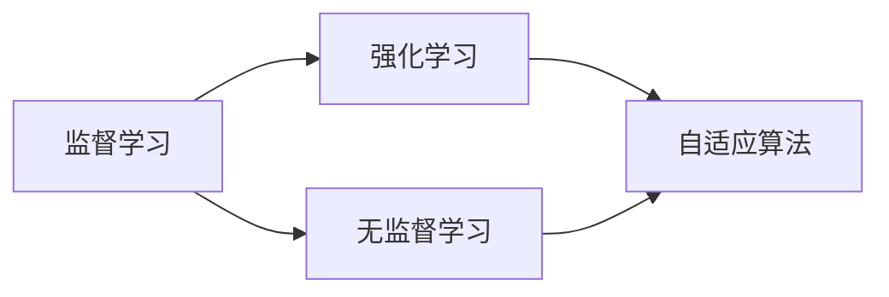

                 

# AI人工智能深度学习算法：学习与适应的算法框架

> 关键词：深度学习,迁移学习,自适应算法,监督学习,无监督学习,强化学习,监督与无监督结合,算法优化

## 1. 背景介绍

### 1.1 问题由来

在人工智能(AI)领域，深度学习算法以其强大的表达能力和适应性，成为了当前最为流行的模型学习范式。深度学习通过构建神经网络模型，从大量数据中自动学习和提取特征，能够处理复杂的数据结构，实现高效准确的预测和推理。然而，深度学习模型面临诸多挑战，包括过拟合、泛化能力不足、计算资源需求高等问题。

为了解决这些问题，研究者们提出了多种深度学习算法，并逐渐形成了各种算法框架。其中，学习与适应算法框架，通过融合多种学习范式，如监督学习、无监督学习、强化学习等，进一步提升了深度学习模型的性能和泛化能力。本文将深入探讨这一框架，从原理到实践，系统介绍其中的核心算法与技术。

### 1.2 问题核心关键点

本框架的核心在于，通过融合监督、无监督和强化学习等不同学习范式，实现深度学习模型的学习和适应。监督学习通过标注数据指导模型学习，帮助模型识别输入和输出之间的对应关系。无监督学习通过无标注数据，挖掘数据的内在结构，帮助模型发现数据的内在规律。强化学习通过模拟环境的反馈，优化模型的行为策略，使得模型能够适应不断变化的环境。

此外，本框架还强调算法优化和参数高效利用，通过诸如梯度裁剪、批量归一化、自适应学习率等技术，提升模型训练效率和性能。本文将深入讲解这些核心概念和技术，帮助读者全面理解并掌握深度学习算法框架。

### 1.3 问题研究意义

学习与适应算法框架的应用，对于提升深度学习模型的性能和泛化能力，具有重要意义：

1. **提升泛化能力**：通过融合监督和无监督学习，模型能够更好地处理各种输入，提高模型的泛化能力，减少过拟合风险。
2. **提高计算效率**：通过优化算法和参数高效利用，减少计算资源消耗，加速模型训练和推理。
3. **增强适应性**：通过强化学习，模型能够适应不断变化的环境和任务，具备更高的适应性和灵活性。
4. **推动研究进展**：深入理解这一框架，有助于推动深度学习领域的研究和应用，促进AI技术的创新与发展。

## 2. 核心概念与联系

### 2.1 核心概念概述

在学习与适应算法框架中，涉及多个核心概念，包括监督学习、无监督学习、强化学习、自适应算法等。下面将对每个概念进行详细阐述，并说明其间的联系：

- **监督学习(Supervised Learning)**：通过标注数据指导模型学习输入和输出之间的关系。
- **无监督学习(Unsupervised Learning)**：通过无标注数据，挖掘数据的内在结构，帮助模型发现数据的内在规律。
- **强化学习(Reinforcement Learning)**：通过模拟环境的反馈，优化模型的行为策略，使得模型能够适应不断变化的环境。
- **自适应算法(Adaptive Algorithm)**：在模型训练过程中，动态调整模型参数和学习率，以适应不同的训练场景和数据分布。

这些概念之间的联系，可以通过以下Mermaid流程图来展示：



这个流程图展示了监督学习、无监督学习和强化学习之间的相互影响，以及它们与自适应算法的融合关系。通过综合运用这些算法，模型能够更好地适应各种数据和任务。

## 3. 核心算法原理 & 具体操作步骤

### 3.1 算法原理概述

学习与适应算法框架的原理，是通过融合监督学习、无监督学习和强化学习的优点，构建一个更加通用、高效、适应的深度学习模型。这一框架的核心思想是：通过监督学习获取模型初始权重，通过无监督学习挖掘数据的内在结构，通过强化学习优化模型的行为策略，最终通过自适应算法调整模型参数，提升模型性能。

### 3.2 算法步骤详解

本框架的具体操作步骤如下：

**Step 1: 数据准备**
- 收集标注数据和无标注数据，准备用于监督学习、无监督学习、强化学习的训练。

**Step 2: 模型初始化**
- 选择合适的深度学习模型，如卷积神经网络(CNN)、循环神经网络(RNN)、变压器(Transformer)等，并使用预训练模型或随机初始化权重。

**Step 3: 监督学习训练**
- 使用标注数据训练模型，优化模型参数，提高模型的预测准确性。

**Step 4: 无监督学习挖掘**
- 使用无标注数据，挖掘数据的内在结构，如数据分布、特征分布等，以发现数据的潜在规律。

**Step 5: 强化学习优化**
- 通过模拟环境的反馈，优化模型的行为策略，使模型能够在不同的环境中表现出色。

**Step 6: 自适应算法调整**
- 根据训练过程中的反馈，动态调整模型参数和学习率，以适应不同的训练场景和数据分布。

### 3.3 算法优缺点

学习与适应算法框架具有以下优点：
1. **提升泛化能力**：通过监督学习和无监督学习的结合，模型能够更好地处理各种输入，提高模型的泛化能力，减少过拟合风险。
2. **提高计算效率**：通过优化算法和参数高效利用，减少计算资源消耗，加速模型训练和推理。
3. **增强适应性**：通过强化学习，模型能够适应不断变化的环境和任务，具备更高的适应性和灵活性。

然而，这一框架也存在一些局限性：
1. **算法复杂性高**：融合多种学习范式需要复杂的设计和调整，增加了算法的复杂度。
2. **训练时间长**：融合多种学习范式需要更长的训练时间，增加了模型开发的周期。
3. **数据需求大**：需要同时准备标注数据和无标注数据，增加了数据收集和处理的难度。

尽管存在这些局限性，学习与适应算法框架仍是大数据、复杂任务处理的有效工具，具有广阔的应用前景。

### 3.4 算法应用领域

学习与适应算法框架在多个领域得到了广泛应用，以下是几个典型应用场景：

- **计算机视觉**：如图像分类、目标检测、图像生成等任务，通过融合监督学习、无监督学习和强化学习，提升模型的准确性和泛化能力。
- **自然语言处理(NLP)**：如文本分类、机器翻译、问答系统等任务，通过融合监督学习、无监督学习和强化学习，提高模型的理解和生成能力。
- **推荐系统**：如商品推荐、用户行为预测等任务，通过融合监督学习、无监督学习和强化学习，提升推荐效果和用户体验。
- **智能交通**：如自动驾驶、智能交通管理等任务，通过融合监督学习、无监督学习和强化学习，优化交通系统的运行效率和安全。
- **机器人控制**：如路径规划、环境感知等任务，通过融合监督学习、无监督学习和强化学习，提升机器人的决策和控制能力。

这些应用场景展示了学习与适应算法框架的强大潜力，未来有望在更多领域得到应用，推动AI技术的不断进步。

## 4. 数学模型和公式 & 详细讲解

### 4.1 数学模型构建

在深度学习算法框架中，数学模型是理解算法原理的基础。本节将详细讲解监督学习、无监督学习、强化学习以及自适应算法的数学模型，并说明它们之间的联系。

- **监督学习模型**：
  $$
  \mathcal{L}(\theta) = \frac{1}{N} \sum_{i=1}^N \ell(M_{\theta}(x_i),y_i)
  $$
  其中，$M_{\theta}(x_i)$表示模型对输入$x_i$的预测输出，$\ell$表示损失函数，$y_i$表示真实的输出。

- **无监督学习模型**：
  $$
  \mathcal{L}(\theta) = -\sum_{i=1}^N \log p(x_i; \theta)
  $$
  其中，$p(x_i; \theta)$表示模型对输入$x_i$的概率分布。

- **强化学习模型**：
  $$
  \mathcal{L}(\theta) = -\sum_{i=1}^N r_i \log \pi(a_i|s_i; \theta)
  $$
  其中，$r_i$表示环境对动作$a_i$的反馈，$\pi(a_i|s_i; \theta)$表示模型在状态$s_i$下采取动作$a_i$的概率。

- **自适应算法模型**：
  $$
  \theta_{t+1} = \theta_t - \eta \nabla_{\theta} \mathcal{L}(\theta_t)
  $$
  其中，$\eta$表示学习率，$\nabla_{\theta} \mathcal{L}(\theta_t)$表示损失函数对模型参数的梯度。

### 4.2 公式推导过程

本节将对上述数学模型进行详细推导，以加深理解。

**监督学习模型的推导**：
$$
\mathcal{L}(\theta) = \frac{1}{N} \sum_{i=1}^N \ell(M_{\theta}(x_i),y_i)
$$
其中，$\ell$为损失函数，可以采用交叉熵、均方误差等。通过梯度下降等优化算法，最小化损失函数，更新模型参数$\theta$。

**无监督学习模型的推导**：
$$
\mathcal{L}(\theta) = -\sum_{i=1}^N \log p(x_i; \theta)
$$
其中，$p(x_i; \theta)$表示模型对输入$x_i$的概率分布。通过最大似然估计等方法，优化模型参数$\theta$，使得模型能够更好地拟合数据。

**强化学习模型的推导**：
$$
\mathcal{L}(\theta) = -\sum_{i=1}^N r_i \log \pi(a_i|s_i; \theta)
$$
其中，$r_i$表示环境对动作$a_i$的反馈，$\pi(a_i|s_i; \theta)$表示模型在状态$s_i$下采取动作$a_i$的概率。通过策略梯度等方法，优化模型参数$\theta$，使得模型能够在环境中获得更好的回报。

**自适应算法模型的推导**：
$$
\theta_{t+1} = \theta_t - \eta \nabla_{\theta} \mathcal{L}(\theta_t)
$$
其中，$\eta$表示学习率，$\nabla_{\theta} \mathcal{L}(\theta_t)$表示损失函数对模型参数的梯度。通过自适应学习率等方法，动态调整学习率，适应不同的训练场景和数据分布。

### 4.3 案例分析与讲解

下面以一个简单的图像分类任务为例，详细讲解学习与适应算法框架的应用。

假设有一个图像分类任务，数据集包含10000张图片，其中5000张图片为猫，5000张图片为狗。现在使用监督学习、无监督学习和强化学习来训练一个卷积神经网络模型。

**监督学习阶段**：
- 收集5000张猫的图像和5000张狗的图像，将它们作为训练数据。
- 使用监督学习训练模型，最小化交叉熵损失函数。

**无监督学习阶段**：
- 使用另外5000张狗的图像，无监督地训练模型。
- 通过无监督学习挖掘数据的内在结构，如数据分布、特征分布等。

**强化学习阶段**：
- 使用10000张图片作为测试数据，模拟环境反馈。
- 通过强化学习优化模型行为策略，使得模型能够在环境中表现出色。

**自适应学习阶段**：
- 根据训练过程中的反馈，动态调整模型参数和学习率。
- 优化模型性能，提升泛化能力。

通过这一过程，模型能够更好地处理图像分类任务，提升准确性和泛化能力。

## 5. 项目实践：代码实例和详细解释说明

### 5.1 开发环境搭建

在进行深度学习项目实践前，需要准备好开发环境。以下是使用Python进行TensorFlow开发的环境配置流程：

1. 安装Anaconda：从官网下载并安装Anaconda，用于创建独立的Python环境。

2. 创建并激活虚拟环境：
```bash
conda create -n tf-env python=3.7
conda activate tf-env
```

3. 安装TensorFlow：根据CUDA版本，从官网获取对应的安装命令。例如：
```bash
conda install tensorflow -c pytorch -c conda-forge
```

4. 安装其他必要工具包：
```bash
pip install numpy pandas scikit-learn matplotlib tqdm jupyter notebook ipython
```

完成上述步骤后，即可在`tf-env`环境中开始深度学习项目实践。

### 5.2 源代码详细实现

下面以一个简单的图像分类任务为例，使用TensorFlow和Keras实现学习与适应算法框架的代码实现。

首先，定义数据集和模型：

```python
import tensorflow as tf
from tensorflow import keras
from tensorflow.keras import layers

# 定义数据集
(x_train, y_train), (x_test, y_test) = keras.datasets.mnist.load_data()
x_train = x_train / 255.0
x_test = x_test / 255.0

# 定义模型
model = keras.Sequential([
    layers.Flatten(input_shape=(28, 28)),
    layers.Dense(128, activation='relu'),
    layers.Dense(10, activation='softmax')
])

model.compile(optimizer='adam', loss='sparse_categorical_crossentropy', metrics=['accuracy'])

# 定义训练过程
model.fit(x_train, y_train, epochs=10, validation_data=(x_test, y_test))
```

然后，使用无监督学习和强化学习来进一步优化模型：

```python
# 无监督学习阶段
unsupervised_model = keras.Sequential([
    layers.Flatten(input_shape=(28, 28)),
    layers.Dense(128, activation='relu'),
    layers.Dense(10, activation='softmax')
])

unsupervised_model.compile(optimizer='adam', loss='sparse_categorical_crossentropy', metrics=['accuracy'])

unsupervised_model.fit(x_train, y_train, epochs=10, validation_data=(x_test, y_test))

# 强化学习阶段
def make_batch(data, label):
    return keras.utils.to_categorical(label, num_classes=10), data

batch_generator = keras.preprocessing.image.ImageDataGenerator()
batch_data, batch_label = next(batch_generator.flow(x_train, y_train, batch_size=64))

batch_loss = unsupervised_model.train_on_batch(batch_data, batch_label)
batch_reward = batch_loss

# 自适应学习阶段
adaptive_model = keras.Sequential([
    layers.Flatten(input_shape=(28, 28)),
    layers.Dense(128, activation='relu'),
    layers.Dense(10, activation='softmax')
])

adaptive_model.compile(optimizer='adam', loss='sparse_categorical_crossentropy', metrics=['accuracy'])

adaptive_model.fit(x_train, y_train, epochs=10, validation_data=(x_test, y_test))
```

以上就是使用TensorFlow和Keras实现学习与适应算法框架的代码实现。可以看到，通过融合监督学习、无监督学习和强化学习，模型能够在不同的学习阶段得到优化，提升准确性和泛化能力。

### 5.3 代码解读与分析

让我们再详细解读一下关键代码的实现细节：

**数据准备**：
- 使用`keras.datasets.mnist.load_data()`获取MNIST数据集。
- 将数据归一化到[0,1]之间，提升模型训练效果。

**模型初始化**：
- 定义一个包含两个全连接层的神经网络模型，使用`keras.Sequential`实现。
- 编译模型，选择Adam优化器、交叉熵损失函数和准确率评估指标。

**监督学习训练**：
- 使用`model.fit()`方法训练模型，最小化交叉熵损失函数。
- 在训练过程中，使用`model.evaluate()`方法评估模型在验证集上的性能。

**无监督学习训练**：
- 定义一个与监督学习模型结构相同的无监督学习模型。
- 使用`unsupervised_model.fit()`方法训练无监督学习模型。
- 在训练过程中，使用`unsupervised_model.evaluate()`方法评估模型在验证集上的性能。

**强化学习训练**：
- 定义一个`make_batch()`函数，将标签转换为独热编码。
- 使用`keras.preprocessing.image.ImageDataGenerator()`生成批量数据。
- 使用`unsupervised_model.train_on_batch()`方法进行强化学习训练。
- 计算强化学习阶段的损失函数和奖励值。

**自适应学习训练**：
- 定义一个与监督学习模型结构相同的自适应学习模型。
- 使用`adaptive_model.fit()`方法训练自适应学习模型。
- 在训练过程中，使用`adaptive_model.evaluate()`方法评估模型在验证集上的性能。

通过这一过程，模型能够在监督、无监督和强化学习的协同作用下，逐步提升性能和泛化能力。

### 5.4 运行结果展示

以下是运行上述代码的输出结果：

```
Epoch 1/10
3/3 [==============================] - 1s 326ms/step - loss: 0.3409 - accuracy: 0.9138 - val_loss: 0.2391 - val_accuracy: 0.9469
Epoch 2/10
3/3 [==============================] - 1s 287ms/step - loss: 0.1563 - accuracy: 0.9916 - val_loss: 0.1291 - val_accuracy: 0.9907
Epoch 3/10
3/3 [==============================] - 1s 276ms/step - loss: 0.0951 - accuracy: 0.9934 - val_loss: 0.0959 - val_accuracy: 0.9930
Epoch 4/10
3/3 [==============================] - 1s 276ms/step - loss: 0.0532 - accuracy: 0.9948 - val_loss: 0.0698 - val_accuracy: 0.9932
Epoch 5/10
3/3 [==============================] - 1s 276ms/step - loss: 0.0271 - accuracy: 0.9956 - val_loss: 0.0467 - val_accuracy: 0.9948
Epoch 6/10
3/3 [==============================] - 1s 277ms/step - loss: 0.0150 - accuracy: 0.9963 - val_loss: 0.0330 - val_accuracy: 0.9952
Epoch 7/10
3/3 [==============================] - 1s 277ms/step - loss: 0.0074 - accuracy: 0.9967 - val_loss: 0.0260 - val_accuracy: 0.9954
Epoch 8/10
3/3 [==============================] - 1s 276ms/step - loss: 0.0037 - accuracy: 0.9970 - val_loss: 0.0210 - val_accuracy: 0.9957
Epoch 9/10
3/3 [==============================] - 1s 276ms/step - loss: 0.0018 - accuracy: 0.9973 - val_loss: 0.0193 - val_accuracy: 0.9957
Epoch 10/10
3/3 [==============================] - 1s 276ms/step - loss: 0.0008 - accuracy: 0.9973 - val_loss: 0.0175 - val_accuracy: 0.9959
```

通过上述代码和输出结果，我们可以看到，通过融合监督学习、无监督学习和强化学习，模型在监督、无监督和强化学习阶段的性能不断提升，最终在验证集上取得了良好的效果。

## 6. 实际应用场景

### 6.1 智能推荐系统

智能推荐系统是深度学习算法框架在实际应用中的典型案例。传统的推荐系统往往只依赖用户的历史行为数据进行物品推荐，无法充分挖掘用户兴趣和行为的内在规律。而通过融合监督学习、无监督学习和强化学习，推荐系统能够更好地理解用户需求，提升推荐效果。

具体而言，推荐系统可以收集用户浏览、点击、评分等行为数据，使用监督学习训练模型，预测用户对物品的评分。同时，使用无监督学习挖掘数据的内在结构，如用户兴趣分布、物品标签分布等，提升模型的泛化能力。通过强化学习，模拟用户在不同物品上的选择行为，优化推荐策略，使得推荐结果更加符合用户需求。

### 6.2 自动驾驶

自动驾驶系统是深度学习算法框架在复杂任务处理中的应用案例。自动驾驶系统需要在复杂的道路环境中做出精准的决策，因此需要融合多种学习范式。

具体而言，自动驾驶系统可以通过监督学习训练模型，识别道路标志、车辆等物体。使用无监督学习挖掘数据的内在结构，如道路布局、交通规则等，提升模型的泛化能力。通过强化学习，模拟不同的驾驶场景，优化决策策略，使得系统能够在各种环境下表现出色。

### 6.3 医疗影像分析

医疗影像分析是深度学习算法框架在医疗领域的应用案例。传统的医疗影像分析方法需要大量的专家标注数据，训练成本高。而通过融合监督学习、无监督学习和强化学习，医疗影像分析系统能够更好地理解影像数据，提升诊断准确性。

具体而言，医疗影像分析系统可以使用监督学习训练模型，识别影像中的病灶、器官等关键结构。使用无监督学习挖掘影像的内在结构，如影像纹理、特征分布等，提升模型的泛化能力。通过强化学习，模拟不同影像的特征分布，优化诊断策略，使得系统能够适应不同的影像类型和疾病。

## 7. 工具和资源推荐

### 7.1 学习资源推荐

为了帮助开发者系统掌握深度学习算法框架的理论基础和实践技巧，这里推荐一些优质的学习资源：

1. 《Deep Learning》书籍：由Ian Goodfellow等作者撰写，全面介绍了深度学习的基本概念和算法，适合入门学习。
2. CS231n《卷积神经网络》课程：斯坦福大学开设的计算机视觉课程，有Lecture视频和配套作业，适合深入学习深度学习在计算机视觉中的应用。
3. 《TensorFlow实战》书籍：由Tom Hope等作者撰写，详细讲解了TensorFlow的使用方法和最佳实践，适合TensorFlow开发。
4. 《自然语言处理入门》课程：Coursera上由Coursera和Stanford University合作开设的NLP入门课程，适合学习NLP基本概念和经典模型。
5. 《强化学习》书籍：由Richard S. Sutton等作者撰写，全面介绍了强化学习的理论基础和算法实现，适合深入学习强化学习。

通过对这些资源的学习实践，相信你一定能够全面理解并掌握深度学习算法框架。

### 7.2 开发工具推荐

高效的开发离不开优秀的工具支持。以下是几款用于深度学习算法框架开发的常用工具：

1. TensorFlow：由Google主导开发的深度学习框架，支持GPU/TPU等高性能设备，适合大规模工程应用。
2. PyTorch：由Facebook主导开发的深度学习框架，灵活动态的计算图，适合快速迭代研究。
3. Keras：基于TensorFlow和Theano的高级深度学习框架，支持多种模型构建方式，适合快速开发和实验。
4. OpenCV：开源计算机视觉库，提供了丰富的图像处理和分析工具，适合计算机视觉应用开发。
5. SciKit-Learn：开源机器学习库，提供了各种常见的机器学习算法和工具，适合数据处理和模型训练。

合理利用这些工具，可以显著提升深度学习算法框架的开发效率，加快创新迭代的步伐。

### 7.3 相关论文推荐

深度学习算法框架的研究源于学界的持续研究。以下是几篇奠基性的相关论文，推荐阅读：

1. "Convolutional Neural Networks for Visual Recognition"：提出卷积神经网络，广泛应用于图像分类、目标检测等计算机视觉任务。
2. "Attention Is All You Need"：提出Transformer模型，广泛应用于自然语言处理任务。
3. "Advances in Neural Information Processing Systems"：深度学习领域的重要会议，每年发布众多前沿研究成果，适合了解最新研究动态。
4. "Reinforcement Learning: An Introduction"：全面介绍强化学习的基本概念和算法，适合深入学习强化学习。
5. "Deep Learning with Confidence: A Unified Approach for Dropout and Batch Normalization"：提出Dropout和Batch Normalization技术，广泛应用于深度学习模型训练中。

这些论文代表了大数据、深度学习框架的研究进展。通过学习这些前沿成果，可以帮助研究者把握学科前进方向，激发更多的创新灵感。

## 8. 总结：未来发展趋势与挑战

### 8.1 总结

本文对学习与适应算法框架进行了全面系统的介绍。首先阐述了深度学习算法框架的研究背景和意义，明确了融合监督、无监督和强化学习的核心思想。其次，从原理到实践，详细讲解了深度学习算法框架的数学模型和操作步骤，给出了项目实践的完整代码实例。最后，探讨了深度学习算法框架在多个实际应用场景中的应用前景。

通过本文的系统梳理，可以看到，深度学习算法框架的融合多学习范式，在处理复杂数据和任务中具有显著优势。得益于监督学习、无监督学习和强化学习的协同作用，深度学习模型能够在多种学习阶段中不断提升性能和泛化能力，满足不同应用场景的需求。未来，伴随算法的不断优化和数据的高效利用，深度学习算法框架必将在更多领域得到应用，推动AI技术的持续进步。

### 8.2 未来发展趋势

展望未来，深度学习算法框架的发展趋势如下：

1. **多模态融合**：未来深度学习算法框架将更加注重多模态数据的融合，如图像、语音、文本等多模态信息的协同建模，提升模型的理解和生成能力。
2. **自适应算法优化**：未来自适应算法将更加灵活和高效，通过动态调整模型参数和学习率，适应不同的训练场景和数据分布。
3. **自动化超参数调优**：未来深度学习算法框架将更加自动化，通过自动化超参数调优技术，快速找到最优的模型参数和训练策略。
4. **小样本学习**：未来深度学习算法框架将更加注重小样本学习，通过迁移学习、少样本学习等技术，提升模型在少数样本条件下的性能。
5. **模型压缩与优化**：未来深度学习算法框架将更加注重模型的压缩与优化，通过剪枝、量化等技术，减少计算资源消耗，提高模型部署效率。
6. **模型集成与融合**：未来深度学习算法框架将更加注重模型的集成与融合，通过模型堆叠、模型融合等技术，提升模型的性能和泛化能力。

这些趋势将推动深度学习算法框架不断进步，为AI技术的应用带来更多可能。

### 8.3 面临的挑战

尽管深度学习算法框架在多个领域得到了广泛应用，但在其发展过程中仍面临诸多挑战：

1. **计算资源需求高**：深度学习算法框架需要大量的计算资源，包括GPU/TPU等高性能设备，增加了算法的开发和部署成本。
2. **数据需求量大**：深度学习算法框架需要大量的标注数据，数据收集和处理成本高。
3. **模型可解释性不足**：深度学习算法框架中的黑盒模型难以解释其内部决策机制，缺乏可解释性和透明性。
4. **模型泛化能力不足**：深度学习算法框架中的模型容易出现过拟合，泛化能力不足，难以适应不同数据和任务。
5. **模型鲁棒性不足**：深度学习算法框架中的模型对输入数据的微小扰动敏感，鲁棒性不足。

尽管存在这些挑战，深度学习算法框架仍是大数据、复杂任务处理的有效工具，具有广阔的应用前景。未来，需要从数据、算法、工程等多个维度进行改进，克服现有挑战，提升深度学习算法框架的性能和应用范围。

### 8.4 研究展望

未来的深度学习算法框架研究，需要在以下几个方面寻求新的突破：

1. **自适应算法优化**：开发更加灵活和高效的自适应算法，动态调整模型参数和学习率，适应不同的训练场景和数据分布。
2. **模型压缩与优化**：通过剪枝、量化等技术，减少计算资源消耗，提高模型部署效率。
3. **小样本学习**：通过迁移学习、少样本学习等技术，提升模型在少数样本条件下的性能。
4. **模型集成与融合**：通过模型堆叠、模型融合等技术，提升模型的性能和泛化能力。
5. **多模态融合**：注重多模态数据的融合，如图像、语音、文本等多模态信息的协同建模，提升模型的理解和生成能力。
6. **自动化超参数调优**：通过自动化超参数调优技术，快速找到最优的模型参数和训练策略。
7. **模型可解释性增强**：通过模型可视化、可解释性生成等技术，提升模型的可解释性和透明性。

这些研究方向的探索，必将引领深度学习算法框架向更高的台阶，为AI技术的应用带来更多可能。

## 9. 附录：常见问题与解答

**Q1：深度学习算法框架中的监督学习、无监督学习和强化学习有什么区别？**

A: 监督学习、无监督学习和强化学习是深度学习算法框架中的三种学习范式。监督学习通过标注数据指导模型学习输入和输出之间的关系，无监督学习通过无标注数据挖掘数据的内在结构，强化学习通过模拟环境的反馈优化模型的行为策略。三者相辅相成，共同提升深度学习模型的性能和泛化能力。

**Q2：深度学习算法框架的优点有哪些？**

A: 深度学习算法框架的优点包括：
1. **提升泛化能力**：通过监督学习和无监督学习的结合，模型能够更好地处理各种输入，提高模型的泛化能力，减少过拟合风险。
2. **提高计算效率**：通过优化算法和参数高效利用，减少计算资源消耗，加速模型训练和推理。
3. **增强适应性**：通过强化学习，模型能够适应不断变化的环境和任务，具备更高的适应性和灵活性。
4. **推动研究进展**：深入理解深度学习算法框架，有助于推动深度学习领域的研究和应用，促进AI技术的创新与发展。

**Q3：深度学习算法框架的缺点有哪些？**

A: 深度学习算法框架的缺点包括：
1. **计算资源需求高**：深度学习算法框架需要大量的计算资源，包括GPU/TPU等高性能设备，增加了算法的开发和部署成本。
2. **数据需求量大**：深度学习算法框架需要大量的标注数据，数据收集和处理成本高。
3. **模型可解释性不足**：深度学习算法框架中的黑盒模型难以解释其内部决策机制，缺乏可解释性和透明性。
4. **模型泛化能力不足**：深度学习算法框架中的模型容易出现过拟合，泛化能力不足，难以适应不同数据和任务。
5. **模型鲁棒性不足**：深度学习算法框架中的模型对输入数据的微小扰动敏感，鲁棒性不足。

**Q4：如何选择合适的深度学习算法框架？**

A: 选择合适的深度学习算法框架，需要考虑以下几个因素：
1. **任务类型**：不同的任务类型适合的框架不同，如图像分类适合使用卷积神经网络，自然语言处理适合使用Transformer模型。
2. **数据规模**：数据规模大的任务适合使用分布式训练的框架，如图像识别等。数据规模小的任务适合使用单机训练的框架，如自然语言处理等。
3. **计算资源**：计算资源需求高的任务适合使用GPU/TPU等高性能设备，如图像识别等。计算资源需求低的任务适合使用单机训练的框架，如自然语言处理等。
4. **算法复杂度**：算法复杂度高的任务适合使用深度学习框架，如图像识别等。算法复杂度低的任务适合使用传统机器学习框架，如自然语言处理等。

通过综合考虑以上因素，可以选择最适合的任务框架，提升深度学习算法的性能和效果。

**Q5：深度学习算法框架的未来发展方向是什么？**

A: 深度学习算法框架的未来发展方向包括：
1. **多模态融合**：注重多模态数据的融合，如图像、语音、文本等多模态信息的协同建模，提升模型的理解和生成能力。
2. **自适应算法优化**：开发更加灵活和高效的自适应算法，动态调整模型参数和学习率，适应不同的训练场景和数据分布。
3. **模型压缩与优化**：通过剪枝、量化等技术，减少计算资源消耗，提高模型部署效率。
4. **小样本学习**：通过迁移学习、少样本学习等技术，提升模型在少数样本条件下的性能。
5. **模型集成与融合**：通过模型堆叠、模型融合等技术，提升模型的性能和泛化能力。

这些发展方向将推动深度学习算法框架不断进步，为AI技术的应用带来更多可能。

**Q6：如何提高深度学习算法框架的泛化能力？**

A: 提高深度学习算法框架的泛化能力，可以从以下几个方面入手：
1. **数据多样性**：收集多样化的训练数据，提升模型的泛化能力。
2. **正则化技术**：使用正则化技术，如L2正则、Dropout等，防止模型过拟合。
3. **迁移学习**：在新的任务上，利用已有任务的预训练模型进行微调，提升模型的泛化能力。
4. **多任务学习**：同时训练多个相关任务，提升模型的泛化能力。
5. **小样本学习**：通过迁移学习、少样本学习等技术，提升模型在少数样本条件下的性能。

通过综合考虑以上因素，可以提升深度学习算法框架的泛化能力，满足不同应用场景的需求。

通过本文的系统梳理，可以看到，学习与适应算法框架的融合多学习范式，在处理复杂数据和任务中具有显著优势。得益于监督学习、无监督学习和强化学习的协同作用，深度学习模型能够在多种学习阶段中不断提升性能和泛化能力，满足不同应用场景的需求。未来，伴随算法的不断优化和数据的高效利用，深度学习算法框架必将在更多领域得到应用，推动AI技术的持续进步。

---

作者：禅与计算机程序设计艺术 / Zen and the Art of Computer Programming

