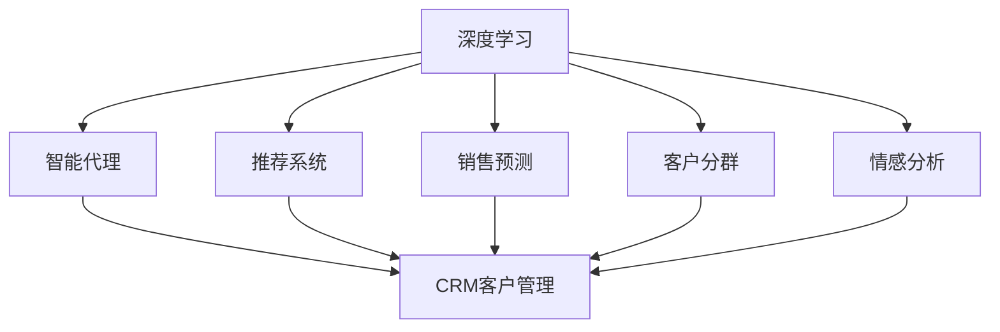

                 

# AI人工智能深度学习算法：智能深度学习代理在CRM客户管理中的应用

> 关键词：智能代理,深度学习,CRM客户管理,推荐系统,销售预测,客户分群,情感分析

## 1. 背景介绍

### 1.1 问题由来
客户关系管理（CRM）系统在现代企业的运营中起着至关重要的作用。它不仅帮助企业管理客户关系，还可以提升客户满意度，优化客户体验，促进销售业绩。然而，传统的CRM系统往往依赖于规则驱动的业务逻辑和手动干预，无法充分利用数据挖掘和机器学习的强大潜力。

近年来，随着人工智能（AI）和深度学习技术的迅猛发展，越来越多的企业开始尝试使用深度学习代理来优化CRM系统的决策制定过程。深度学习代理能够自动分析大量数据，并从中提取有价值的洞察力，从而辅助企业做出更加精准的客户管理决策。

### 1.2 问题核心关键点
深度学习代理在CRM客户管理中的应用，通常涉及以下几个核心问题：

- 客户数据整合与预处理：如何将来自不同渠道、不同格式的数据进行整合和预处理，构建统一的客户画像。
- 客户分群与细分：如何根据客户的不同属性、行为和交易历史等信息，对客户进行精准的分群与细分。
- 推荐系统与个性化营销：如何利用深度学习模型对客户进行个性化推荐，提升客户满意度和转化率。
- 销售预测与业务决策：如何构建有效的销售预测模型，辅助企业制定更合理的销售策略和资源分配。
- 客户情感分析：如何利用自然语言处理（NLP）技术，对客户的反馈和评论进行情感分析，提升客户服务质量。

## 2. 核心概念与联系

### 2.1 核心概念概述

为了更好地理解深度学习代理在CRM客户管理中的应用，我们需要对一些核心概念进行解释和联系：

- **深度学习（Deep Learning, DL）**：一种机器学习方法，通过多层神经网络模型，可以从大量数据中提取复杂的特征表示，从而进行分类、回归、生成等任务。
- **智能代理（Intelligent Agent）**：一种能够自主执行特定任务，并能够学习和适应的软件程序。智能代理通常包含感知、推理、决策和执行等功能模块。
- **客户关系管理（CRM）**：一种企业级的管理理念和技术，旨在通过自动化和优化客户关系，提升客户满意度和业务价值。
- **推荐系统（Recommendation System）**：一种信息过滤技术，通过分析用户的历史行为和偏好，为其提供个性化的产品或内容推荐。
- **销售预测（Sales Forecasting）**：一种使用历史销售数据和市场趋势，预测未来销售情况的模型。
- **客户分群与细分（Customer Segmentation）**：根据客户特征和行为，将客户划分为不同群体的过程，旨在实现更精细化的客户管理。
- **情感分析（Sentiment Analysis）**：使用NLP技术，从文本中提取客户的情感倾向，帮助企业更好地理解客户需求和反馈。

这些核心概念之间的逻辑关系可以通过以下Mermaid流程图来展示：



这个流程图展示了深度学习代理在CRM客户管理中的核心应用场景：

1. 深度学习提取客户数据中的复杂特征。
2. 智能代理通过推荐系统、销售预测、客户分群和情感分析等技术，辅助客户管理。
3. 最终这些技术支撑的决策被应用于CRM系统，提升客户管理的效率和效果。

## 3. 核心算法原理 & 具体操作步骤

### 3.1 算法原理概述

深度学习代理在CRM客户管理中的应用，通常基于以下几个核心算法原理：

- **多层感知器（MLP）**：一种前馈神经网络，能够通过多层非线性变换，提取输入数据中的复杂特征。
- **卷积神经网络（CNN）**：适用于处理图像和文本数据的神经网络，能够自动提取空间和时间上的局部特征。
- **循环神经网络（RNN）**：一种能够处理序列数据的神经网络，适用于时间序列预测和客户行为分析。
- **长短期记忆网络（LSTM）**：一种特殊的RNN，能够更好地捕捉序列数据中的长期依赖关系。
- **生成对抗网络（GAN）**：一种生成模型，能够生成逼真的数据样本，如客户画像和市场趋势。
- **自然语言处理（NLP）**：一种人工智能技术，能够理解和处理人类语言，用于客户情感分析和文本生成。

这些算法通常被组合使用，构建一个功能强大的智能代理，从而辅助CRM系统的客户管理决策。

### 3.2 算法步骤详解

基于深度学习代理的CRM客户管理通常包含以下几个关键步骤：

**Step 1: 数据收集与预处理**
- 从不同渠道（如社交媒体、网站、客户服务中心）收集客户数据，包括交易记录、交互记录、行为数据等。
- 对数据进行清洗、去重和标准化处理，构建统一的客户数据仓库。

**Step 2: 特征工程**
- 提取和构造客户特征，如人口统计信息、购买历史、互动频率、情感评分等。
- 使用深度学习模型（如MLP、CNN、RNN）进行特征提取和降维，构建高维空间中的客户表示。

**Step 3: 客户分群与细分**
- 使用聚类算法（如K-means、层次聚类）对客户进行初始分群。
- 使用深度学习模型（如LSTM、RNN）对客户行为进行建模，优化聚类结果。
- 通过特征选择和降维技术，进一步细化客户群体，创建更精确的客户画像。

**Step 4: 推荐系统与个性化营销**
- 构建推荐模型（如协同过滤、基于内容的推荐），利用客户历史行为和偏好，生成个性化推荐。
- 使用强化学习（Reinforcement Learning, RL）优化推荐策略，最大化用户满意度和转化率。
- 将推荐结果通过CRM系统推送给客户，实现个性化营销。

**Step 5: 销售预测与业务决策**
- 构建销售预测模型（如时间序列预测、回归模型），预测未来的销售趋势和客户需求。
- 使用优化算法（如线性规划、遗传算法）优化资源分配和销售策略。
- 在CRM系统中集成销售预测结果，辅助业务决策。

**Step 6: 客户情感分析**
- 使用NLP技术（如情感分析、文本分类），从客户反馈和评论中提取情感倾向。
- 通过情感分析模型（如BERT、GPT）提升情感分析的准确性和鲁棒性。
- 将情感分析结果应用于CRM系统，提升客户服务质量和客户满意度。

### 3.3 算法优缺点

深度学习代理在CRM客户管理中的应用，具有以下优点：

1. **自动化决策支持**：深度学习代理能够自动分析客户数据，提供实时的决策支持，提高企业运营效率。
2. **精准客户画像**：通过深度学习模型，能够构建更精准、更全面的客户画像，实现个性化营销和客户服务。
3. **实时性高**：深度学习模型能够实时处理数据，快速响应客户需求和市场变化。
4. **自适应能力强**：深度学习代理能够自动学习新数据和新模式，适应不断变化的市场环境。

同时，深度学习代理也存在一些局限性：

1. **数据依赖性强**：深度学习模型对数据质量要求较高，需要大量的标注数据和高质量数据源。
2. **模型复杂度高**：深度学习模型通常包含大量参数，训练和推理过程较为复杂，需要强大的计算资源。
3. **可解释性不足**：深度学习模型往往是"黑盒"模型，难以解释其内部决策过程，可能影响业务信任。
4. **对抗攻击脆弱**：深度学习模型易受到对抗样本的攻击，可能导致错误的决策。
5. **计算成本高**：深度学习模型的训练和推理成本较高，需要高性能计算设备支持。

尽管存在这些局限性，但深度学习代理在CRM客户管理中的应用前景依然广阔，可以显著提升企业客户管理的智能化水平。

### 3.4 算法应用领域

深度学习代理在CRM客户管理中的应用，已经在多个领域得到广泛应用，例如：

- **客户细分与画像**：使用聚类和深度学习模型对客户进行分群与画像，实现更精准的客户管理。
- **个性化推荐与营销**：利用协同过滤和深度学习模型，为不同客户生成个性化推荐，提升客户转化率。
- **销售预测与业务优化**：使用时间序列预测和深度学习模型，预测销售趋势，优化资源分配和销售策略。
- **情感分析与客户服务**：通过NLP技术对客户反馈和评论进行情感分析，提升客户服务质量和满意度。
- **风险评估与信用管理**：利用深度学习模型对客户行为进行预测，评估客户信用风险，优化信用管理策略。

## 4. 数学模型和公式 & 详细讲解  
### 4.1 数学模型构建

在CRM客户管理中，深度学习代理的数学模型通常基于以下几个核心组件：

- **多层感知器（MLP）模型**：
  $$
  h_{l+1} = \sigma(W_l h_l + b_l)
  $$
  其中 $h_l$ 为第 $l$ 层的输出，$W_l$ 为权重矩阵，$b_l$ 为偏置向量，$\sigma$ 为激活函数。

- **卷积神经网络（CNN）模型**：
  $$
  h_{l+1} = \sigma(W_l h_l + b_l)
  $$
  $$
  h_{l+1} = \max\limits_k \{W_l h_l + b_l\} + c_l
  $$
  其中 $c_l$ 为卷积核，$k$ 为卷积核位置。

- **循环神经网络（RNN）模型**：
  $$
  h_{t+1} = \sigma(W h_t + b)
  $$
  $$
  h_{t+1} = \tanh(W h_t + b)
  $$
  其中 $h_t$ 为第 $t$ 步的隐藏状态，$W$ 和 $b$ 为权重和偏置向量。

- **长短期记忆网络（LSTM）模型**：
  $$
  h_{t+1} = \sigma(W h_t + b)
  $$
  $$
  c_{t+1} = \tanh(W h_t + b) + \sigma(W c_t + b)
  $$
  $$
  h_{t+1} = \sigma(W h_t + b)
  $$
  其中 $c_t$ 为记忆细胞，$W$ 和 $b$ 为权重和偏置向量。

- **生成对抗网络（GAN）模型**：
  $$
  z \sim p(z)
  $$
  $$
  G(z) = \sigma(WG z + bG)
  $$
  $$
  \hat{x} = G(z)
  $$
  $$
  x \sim p(x|y)
  $$
  $$
  D(x) = \sigma(WD x + bD)
  $$
  $$
  D_{\text{gen}}(z) = 1 - D(G(z))
  $$
  其中 $G$ 和 $D$ 分别为生成器和判别器，$p(z)$ 和 $p(x|y)$ 分别为随机噪声分布和条件分布。

- **自然语言处理（NLP）模型**：
  $$
  \text{EMB}(x) = \text{Embed}(x)
  $$
  $$
  \text{LSTM}(h_t) = \tanh(W h_t + b)
  $$
  $$
  \text{ATTN}(h_t, h_{t-1}) = \text{Softmax}(W h_t + U h_{t-1})
  $$
  其中 $\text{EMB}$ 为词嵌入层，$\text{LSTM}$ 为长短期记忆层，$\text{ATTN}$ 为注意力机制层。

### 4.2 公式推导过程

以下是几个核心模型的推导过程：

**多层感知器（MLP）**：
$$
h_1 = \sigma(W_0 x + b_0)
$$
$$
h_2 = \sigma(W_1 h_1 + b_1)
$$
$$
h_3 = \sigma(W_2 h_2 + b_2)
$$
$$
y = h_3
$$

其中 $x$ 为输入向量，$h_1$、$h_2$ 和 $h_3$ 为中间隐藏层，$y$ 为输出向量。

**卷积神经网络（CNN）**：
$$
h_{l+1} = \sigma(W_l h_l + b_l)
$$
$$
h_{l+1} = \max\limits_k \{W_l h_l + b_l\} + c_l
$$

其中 $c_l$ 为卷积核，$k$ 为卷积核位置。

**循环神经网络（RNN）**：
$$
h_{t+1} = \sigma(W h_t + b)
$$
$$
h_{t+1} = \tanh(W h_t + b)
$$

其中 $h_t$ 为第 $t$ 步的隐藏状态，$W$ 和 $b$ 为权重和偏置向量。

**长短期记忆网络（LSTM）**：
$$
h_{t+1} = \sigma(W h_t + b)
$$
$$
c_{t+1} = \tanh(W h_t + b) + \sigma(W c_t + b)
$$
$$
h_{t+1} = \sigma(W h_t + b)
$$

其中 $c_t$ 为记忆细胞，$W$ 和 $b$ 为权重和偏置向量。

**生成对抗网络（GAN）**：
$$
z \sim p(z)
$$
$$
G(z) = \sigma(WG z + bG)
$$
$$
\hat{x} = G(z)
$$
$$
x \sim p(x|y)
$$
$$
D(x) = \sigma(WD x + bD)
$$
$$
D_{\text{gen}}(z) = 1 - D(G(z))
$$

其中 $G$ 和 $D$ 分别为生成器和判别器，$p(z)$ 和 $p(x|y)$ 分别为随机噪声分布和条件分布。

**自然语言处理（NLP）**：
$$
\text{EMB}(x) = \text{Embed}(x)
$$
$$
\text{LSTM}(h_t) = \tanh(W h_t + b)
$$
$$
\text{ATTN}(h_t, h_{t-1}) = \text{Softmax}(W h_t + U h_{t-1})
$$

其中 $\text{EMB}$ 为词嵌入层，$\text{LSTM}$ 为长短期记忆层，$\text{ATTN}$ 为注意力机制层。

### 4.3 案例分析与讲解

以客户细分与画像为例，介绍深度学习代理的应用：

假设我们有一个客户数据集，包含客户的姓名、年龄、性别、购买历史、互动频率等特征。我们使用多层感知器模型（MLP）对客户进行分群和画像。

**Step 1: 数据预处理**
- 收集客户的姓名、年龄、性别、购买历史、互动频率等特征数据。
- 对数据进行清洗、去重和标准化处理，构建统一的客户数据仓库。

**Step 2: 特征工程**
- 提取和构造客户特征，如人口统计信息、购买历史、互动频率、情感评分等。
- 使用多层感知器模型进行特征提取和降维，构建高维空间中的客户表示。

**Step 3: 客户分群与画像**
- 使用聚类算法（如K-means、层次聚类）对客户进行初始分群。
- 使用多层感知器模型对客户行为进行建模，优化聚类结果。
- 通过特征选择和降维技术，进一步细化客户群体，创建更精确的客户画像。

使用多层感知器模型的计算过程如下：

- **输入层**：将客户特征数据 $x$ 输入模型。
- **隐藏层**：通过多个线性变换和激活函数，将输入特征 $x$ 映射为高维空间中的隐藏向量 $h$。
- **输出层**：将隐藏向量 $h$ 映射为分群结果或画像特征。

## 5. 项目实践：代码实例和详细解释说明
### 5.1 开发环境搭建

在进行深度学习代理的实践前，我们需要准备好开发环境。以下是使用Python进行PyTorch开发的环境配置流程：

1. 安装Anaconda：从官网下载并安装Anaconda，用于创建独立的Python环境。

2. 创建并激活虚拟环境：
```bash
conda create -n dl-env python=3.8 
conda activate dl-env
```

3. 安装PyTorch：根据CUDA版本，从官网获取对应的安装命令。例如：
```bash
conda install pytorch torchvision torchaudio cudatoolkit=11.1 -c pytorch -c conda-forge
```

4. 安装TensorFlow：
```bash
pip install tensorflow
```

5. 安装各类工具包：
```bash
pip install numpy pandas scikit-learn matplotlib tqdm jupyter notebook ipython
```

完成上述步骤后，即可在`dl-env`环境中开始深度学习代理的实践。

### 5.2 源代码详细实现

下面我们以客户细分与画像任务为例，给出使用PyTorch进行多层感知器模型的PyTorch代码实现。

首先，定义客户分群和画像的数据处理函数：

```python
import torch
import torch.nn as nn
import torch.optim as optim
import torch.utils.data
from sklearn.model_selection import train_test_split

class CustomerDataLoader(torch.utils.data.DataLoader):
    def __init__(self, dataset, batch_size, shuffle=True):
        super(CustomerDataLoader, self).__init__(dataset, batch_size=batch_size, shuffle=shuffle)

class CustomerDataset(torch.utils.data.Dataset):
    def __init__(self, data, features, labels):
        self.data = data
        self.features = features
        self.labels = labels
        
    def __len__(self):
        return len(self.data)
    
    def __getitem__(self, idx):
        x = self.features[idx]
        y = self.labels[idx]
        return x, y

# 定义特征与标签的映射
features = ['age', 'gender', 'purchase_history', 'interaction_frequency']
labels = ['segment']

# 构建数据集
data = df[features]
labels = df[labels]
train_data, test_data = train_test_split(data, test_size=0.2, random_state=42)

train_dataset = CustomerDataset(train_data, features, labels)
test_dataset = CustomerDataset(test_data, features, labels)

# 定义模型
model = nn.Sequential(
    nn.Linear(len(features), 64),
    nn.ReLU(),
    nn.Linear(64, len(labels)),
    nn.Softmax(dim=1)
)

# 定义损失函数和优化器
criterion = nn.CrossEntropyLoss()
optimizer = optim.Adam(model.parameters(), lr=0.001)

# 训练模型
def train(model, train_loader, optimizer, criterion, epochs=10):
    for epoch in range(epochs):
        model.train()
        for x, y in train_loader:
            optimizer.zero_grad()
            y_hat = model(x)
            loss = criterion(y_hat, y)
            loss.backward()
            optimizer.step()

        # 评估模型
        model.eval()
        test_loader = CustomerDataLoader(test_dataset, batch_size=1)
        y_hat = model(test_data)
        accuracy = (y_hat.argmax(dim=1) == test_labels).float().mean()
        print(f'Epoch {epoch+1}, Accuracy: {accuracy:.3f}')

# 训练模型
train(model, CustomerDataLoader(train_dataset, batch_size=64), optimizer, criterion)
```

以上代码实现了一个简单的多层感知器模型，用于对客户数据进行分群和画像。代码主要分为以下几个部分：

1. **数据处理**：从CSV文件中读取客户数据，并构造数据集。
2. **模型定义**：定义一个多层感知器模型，包含两个线性层和ReLU激活函数。
3. **损失函数和优化器**：定义交叉熵损失函数和Adam优化器。
4. **训练模型**：使用交叉熵损失函数和Adam优化器训练模型，并在测试集上评估模型性能。

### 5.3 代码解读与分析

让我们再详细解读一下关键代码的实现细节：

**CustomerDataLoader类**：
- `__init__`方法：初始化数据加载器，可以设置批量大小和是否洗牌。
- `__len__`方法：返回数据集的长度。
- `__getitem__`方法：对单个样本进行处理，将特征和标签数据返回模型。

**CustomerDataset类**：
- `__init__`方法：初始化数据集，将数据、特征和标签数据存储在类属性中。
- `__len__`方法：返回数据集的长度。
- `__getitem__`方法：对单个样本进行处理，将特征和标签数据返回模型。

**模型定义**：
- 定义了一个多层感知器模型，包含两个线性层和ReLU激活函数。
- 输出层使用Softmax函数，对客户的分群结果进行概率化。

**损失函数和优化器**：
- 使用交叉熵损失函数作为模型的评估指标。
- 使用Adam优化器进行模型参数的更新。

**训练模型**：
- 在每个epoch中，对训练集进行前向传播和反向传播，更新模型参数。
- 在测试集上评估模型的准确率。

可以看到，PyTorch提供了简洁高效的API，使得深度学习模型的开发和训练变得简单快捷。开发者可以更加专注于算法的设计和模型的优化，而不必过多关注底层的实现细节。

当然，工业级的系统实现还需考虑更多因素，如模型的保存和部署、超参数的自动搜索、更灵活的任务适配层等。但核心的深度学习代理开发流程基本与此类似。

## 6. 实际应用场景
### 6.1 智能客服系统

基于深度学习代理的智能客服系统，可以显著提升客户服务质量，提升客户满意度和企业运营效率。智能客服系统通常包含以下几个组件：

- **意图识别**：使用NLP技术对客户的问题进行意图分类，确定客户的需求。
- **知识图谱**：构建包含企业内部知识的图谱，帮助智能客服快速找到答案。
- **对话生成**：使用生成模型生成自然流畅的回复，辅助智能客服与客户互动。
- **情感分析**：使用NLP技术对客户情感进行识别，提升客户服务质量。

在技术实现上，可以收集企业的客户服务数据，将其标注为意图分类和对话回复数据。在此基础上对预训练的语言模型进行微调，使其能够理解和处理客户问题，并生成合适的回答。使用深度学习代理，智能客服系统可以24小时不间断服务，快速响应客户咨询，提升客户体验。

### 6.2 金融舆情监测

金融舆情监测是金融行业的重要任务，有助于及时发现市场风险和负面信息。使用深度学习代理，可以对大量的新闻、报道和评论进行情感分析，识别市场的情感倾向和风险预警信号。具体实现如下：

- **数据收集**：收集金融市场的新闻、报道和评论数据。
- **数据预处理**：对数据进行清洗、去重和标准化处理，构建统一的数据仓库。
- **情感分析**：使用深度学习模型（如BERT、GPT）对数据进行情感分析，识别市场的情感倾向。
- **风险预警**：根据情感分析结果，对市场风险进行预警，帮助金融机构及时应对风险。

### 6.3 个性化推荐系统

个性化推荐系统是电商平台和内容平台的核心功能之一。使用深度学习代理，可以根据用户的浏览、点击、购买等行为数据，生成个性化的产品或内容推荐。具体实现如下：

- **数据收集**：收集用户的浏览、点击、购买等行为数据。
- **数据预处理**：对数据进行清洗、去重和标准化处理，构建统一的数据仓库。
- **用户画像**：使用深度学习模型（如LSTM、RNN）对用户行为进行建模，创建用户的个性化画像。
- **推荐系统**：使用推荐模型（如协同过滤、基于内容的推荐），生成个性化的推荐结果。
- **推荐优化**：使用强化学习优化推荐策略，最大化用户满意度和转化率。

### 6.4 未来应用展望

深度学习代理在CRM客户管理中的应用前景广阔，未来可能会涉及更多领域，如医疗、法律、物流等。以下是几个未来应用展望：

- **医疗客户管理**：使用深度学习代理对患者的医疗数据进行分析和预测，优化诊疗方案。
- **法律咨询**：使用深度学习代理对法律案例进行分类和生成，辅助律师处理法律咨询。
- **物流优化**：使用深度学习代理对物流数据进行分析和预测，优化物流路线和仓储管理。
- **智能医疗设备**：使用深度学习代理对医疗设备数据进行分析和预测，提升医疗设备的使用效率和准确性。

## 7. 工具和资源推荐
### 7.1 学习资源推荐

为了帮助开发者系统掌握深度学习代理的理论基础和实践技巧，这里推荐一些优质的学习资源：

1. 《深度学习》系列书籍：由李宏毅、吴恩达等教授撰写，全面介绍了深度学习的基本概念和经典模型。
2. Coursera《深度学习专项课程》：由吴恩达等教授主导，提供高质量的深度学习课程和实战项目。
3. DeepLearning.AI《深度学习基础与实践》课程：提供深入浅出的深度学习理论讲解和实践指导。
4. 《Python深度学习》书籍：涵盖深度学习的基本概念、模型和算法，并提供了丰富的实战代码。
5. PyTorch官方文档：提供了详细的PyTorch API介绍和代码示例，适合初学者快速上手。
6. TensorFlow官方文档：提供了详细的TensorFlow API介绍和代码示例，适合初学者快速上手。

通过对这些资源的学习实践，相信你一定能够快速掌握深度学习代理的精髓，并用于解决实际的CRM客户管理问题。
###  7.2 开发工具推荐

高效的开发离不开优秀的工具支持。以下是几款用于深度学习代理开发的常用工具：

1. PyTorch：基于Python的开源深度学习框架，灵活动态的计算图，适合快速迭代研究。
2. TensorFlow：由Google主导开发的开源深度学习框架，生产部署方便，适合大规模工程应用。
3. PyTorch Lightning：基于PyTorch的高阶API，简化了模型训练和调优过程，提高了开发效率。
4. TensorBoard：TensorFlow配套的可视化工具，可实时监测模型训练状态，并提供丰富的图表呈现方式。
5. Weights & Biases：模型训练的实验跟踪工具，可以记录和可视化模型训练过程中的各项指标，方便对比和调优。
6. Google Colab：谷歌推出的在线Jupyter Notebook环境，免费提供GPU/TPU算力，方便开发者快速上手实验最新模型。

合理利用这些工具，可以显著提升深度学习代理的开发效率，加快创新迭代的步伐。

### 7.3 相关论文推荐

深度学习代理在CRM客户管理中的应用，源于学界的持续研究。以下是几篇奠基性的相关论文，推荐阅读：

1. 《Deep Customer Analytics: An Empirical Evaluation of Recommendation Algorithms and Data-Driven Customer Segmentation》：介绍了深度学习模型在客户推荐和分群中的应用，并对比了不同算法的性能。
2. 《A Survey on Deep Learning Approaches for Customer Relationship Management》：全面综述了深度学习在CRM客户管理中的应用，包括客户画像、推荐系统、情感分析等。
3. 《Customer Segmentation with Deep Learning: A Review》：介绍了深度学习模型在客户分群中的应用，包括聚类、分类和生成模型等。
4. 《Customer Sentiment Analysis: A Deep Learning Approach》：介绍了深度学习模型在客户情感分析中的应用，包括情感分类和情感生成等。
5. 《Sales Forecasting Using Deep Learning: A Survey》：介绍了深度学习模型在销售预测中的应用，包括时间序列预测和回归模型等。

这些论文代表了大语言模型微调技术的发展脉络。通过学习这些前沿成果，可以帮助研究者把握学科前进方向，激发更多的创新灵感。

## 8. 总结：未来发展趋势与挑战

### 8.1 总结

本文对基于深度学习代理的CRM客户管理进行了全面系统的介绍。首先阐述了深度学习代理在CRM客户管理中的应用背景和意义，明确了深度学习代理在提升客户管理智能化水平方面的独特价值。其次，从原理到实践，详细讲解了深度学习代理的数学原理和关键步骤，给出了深度学习代理任务开发的完整代码实例。同时，本文还广泛探讨了深度学习代理在智能客服、金融舆情、个性化推荐等多个领域的应用前景，展示了深度学习代理的巨大潜力。此外，本文精选了深度学习代理的各类学习资源，力求为读者提供全方位的技术指引。

通过本文的系统梳理，可以看到，基于深度学习代理的CRM客户管理技术正在成为CRM客户管理的重要范式，极大地提升了客户管理的智能化水平。未来，伴随深度学习模型的不断发展，CRM客户管理系统的智能化水平必将进一步提升，带来更加精细化、个性化的客户服务体验。

### 8.2 未来发展趋势

展望未来，深度学习代理在CRM客户管理中的应用将呈现以下几个发展趋势：

1. **多模态融合**：深度学习代理将融合视觉、音频、文本等多模态数据，提升客户管理的智能化水平。
2. **实时决策支持**：深度学习代理将具备实时决策支持能力，能够快速响应客户需求和市场变化。
3. **个性化服务**：深度学习代理将提供更加个性化、精准的客户服务，提升客户满意度和转化率。
4. **自适应学习**：深度学习代理将具备自适应学习能力，能够不断学习和适应用户行为和市场环境的变化。
5. **隐私保护**：深度学习代理将具备隐私保护能力，确保客户数据的安全和隐私。

以上趋势凸显了深度学习代理在CRM客户管理中的广阔前景。这些方向的探索发展，必将进一步提升CRM客户管理系统的智能化水平，为构建人机协同的智能客服系统提供新的技术路径。

### 8.3 面临的挑战

尽管深度学习代理在CRM客户管理中的应用前景广阔，但在迈向更加智能化、普适化应用的过程中，它仍面临以下几个挑战：

1. **数据质量问题**：深度学习模型对数据质量要求较高，需要大量的高质量标注数据，但获取这些数据成本较高。
2. **计算资源限制**：深度学习模型的训练和推理过程较为复杂，需要强大的计算资源，可能带来高昂的硬件成本。
3. **模型可解释性不足**：深度学习模型往往是"黑盒"模型，难以解释其内部决策过程，可能影响业务信任。
4. **对抗攻击脆弱**：深度学习模型易受到对抗样本的攻击，可能导致错误的决策。
5. **隐私保护问题**：深度学习模型需要大量的客户数据，如何保护客户隐私，防止数据泄露，成为重要课题。

尽管存在这些挑战，但深度学习代理在CRM客户管理中的应用前景依然广阔，可以显著提升企业客户管理的智能化水平。

### 8.4 研究展望

面对深度学习代理所面临的挑战，未来的研究需要在以下几个方面寻求新的突破：

1. **无监督学习**：探索无监督学习方法和自适应学习算法，减少对标注数据的依赖，降低数据获取成本。
2. **小样本学习**：研究小样本学习方法和自适应学习算法，在少量数据下也能取得良好的模型性能。
3. **鲁棒性和可解释性**：研究鲁棒性和可解释性技术，提升深度学习代理的鲁棒性和透明性。
4. **隐私保护**：研究隐私保护技术，确保客户数据的安全和隐私。
5. **多模态融合**：研究多模态融合技术，提升深度学习代理的多模态处理能力。

这些研究方向的探索，必将引领深度学习代理在CRM客户管理中的应用走向成熟，为构建安全、可靠、可解释、可控的智能系统铺平道路。面向未来，深度学习代理需要与其他人工智能技术进行更深入的融合，如知识表示、因果推理、强化学习等，多路径协同发力，共同推动自然语言理解和智能交互系统的进步。只有勇于创新、敢于突破，才能不断拓展深度学习代理的边界，让智能技术更好地造福人类社会。

## 9. 附录：常见问题与解答

**Q1：深度学习代理在CRM客户管理中的应用是否适用于所有客户群体？**

A: 深度学习代理在CRM客户管理中的应用，通常适用于具有复杂需求和行为特征的客户群体。对于简单的、同质化的客户群体，传统的规则驱动的业务逻辑可能更为适用。

**Q2：如何选择深度学习模型和算法？**

A: 选择深度学习模型和算法时，需要考虑客户管理的实际需求和数据特点。通常使用多层感知器（MLP）和卷积神经网络（CNN）处理结构化数据，使用循环神经网络（RNN）和长短期记忆网络（LSTM）处理序列数据，使用生成对抗网络（GAN）生成客户画像。

**Q3：如何在深度学习代理中引入外部知识？**

A: 在深度学习代理中引入外部知识，通常需要使用知识图谱、逻辑规则等符号化的先验知识，结合深度学习模型进行联合训练，以增强模型的泛化能力和推理能力。

**Q4：如何在深度学习代理中实现实时性要求？**

A: 实现深度学习代理的实时性要求，通常需要优化模型结构和算法，使用轻量级模型和快速推理算法，同时优化数据加载和传输过程，减少延迟。

**Q5：如何应对深度学习代理的对抗攻击问题？**

A: 应对深度学习代理的对抗攻击问题，通常需要使用对抗训练和鲁棒性增强技术，对模型进行训练和测试时加入对抗样本，提高模型的鲁棒性和抗干扰能力。

通过本文的系统梳理，可以看到，基于深度学习代理的CRM客户管理技术正在成为CRM客户管理的重要范式，极大地提升了客户管理的智能化水平。未来，伴随深度学习模型的不断发展，CRM客户管理系统的智能化水平必将进一步提升，带来更加精细化、个性化的客户服务体验。

---

作者：禅与计算机程序设计艺术 / Zen and the Art of Computer Programming

