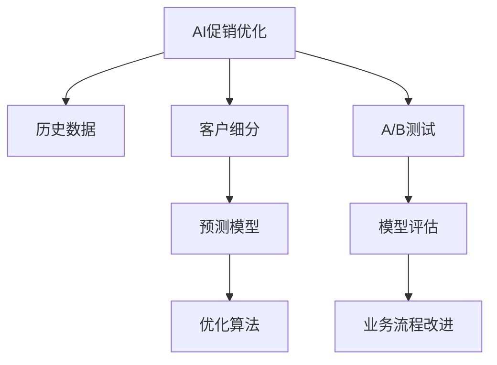

                 

# AI优化促销策略：案例分析与实践

> 关键词：AI促销优化,机器学习算法,案例分析,数据分析,实践指导,业务流程改进

## 1. 背景介绍

### 1.1 问题由来

在现代商业环境中，促销策略的制定和优化已成为企业竞争力的重要组成部分。传统的促销策略通常依赖于经验和直觉，难以量化和精细化管理。随着人工智能(AI)和机器学习(ML)技术的迅猛发展，AI促销优化已逐渐成为企业提升运营效率和盈利能力的关键手段。

近年来，通过AI优化促销策略的案例在零售、电商、金融、医疗等多个行业不断涌现，展现出巨大的应用潜力。例如，零售商通过AI分析历史销售数据和客户行为，优化促销活动的投放时间和频次，显著提高了销售额和客户满意度。电商企业通过AI推荐系统，个性化推荐商品和优惠活动，促进了用户复购和忠诚度提升。

然而，AI促销优化并不是一项简单任务，涉及多方面的技术挑战和业务考量。本文将从核心概念入手，深入探讨AI促销优化的算法原理和操作步骤，结合实际案例分析，为读者提供详细的实践指导。

### 1.2 问题核心关键点

AI促销优化主要包括以下几个核心问题：

- **数据收集与管理**：如何有效地收集、清洗和存储历史销售数据、客户行为数据和市场数据，确保数据的质量和完整性。
- **算法选择与应用**：如何选择和应用合适的机器学习算法，构建和优化促销策略模型。
- **模型评估与优化**：如何对促销策略模型进行评估和优化，确保其效果和稳定性。
- **业务流程改进**：如何将AI促销优化技术融入现有的业务流程，实现实际应用效果。

这些问题相互交织，共同构成了AI促销优化的关键挑战。通过深入理解这些核心问题，并结合案例分析，我们将为读者提供全面系统的AI促销优化指南。

## 2. 核心概念与联系

### 2.1 核心概念概述

为更好地理解AI促销优化的技术原理和操作步骤，本节将介绍几个关键概念：

- **AI促销优化**：利用人工智能和机器学习技术，通过数据分析和模型优化，制定和调整促销策略的过程。
- **历史数据**：指企业过去一段时间内的销售记录、客户行为数据、市场环境等数据，是构建AI促销模型的基础。
- **客户细分**：将客户群体划分为不同的子群体，根据不同的特征和行为进行分组，实现精准营销。
- **预测模型**：利用历史数据训练的机器学习模型，用于预测未来的促销效果和销售业绩。
- **优化算法**：如梯度下降、遗传算法等，用于调整模型参数，提高模型性能。
- **A/B测试**：通过比较两个或多个版本的效果，确定最优的促销策略。

这些概念之间的逻辑关系可以通过以下Mermaid流程图来展示：



这个流程图展示了大语言模型的核心概念及其之间的关系：

1. 从历史数据中提取信息，构建客户细分。
2. 利用预测模型进行未来效果预测。
3. 通过优化算法调整模型参数。
4. 引入A/B测试，验证模型效果。
5. 评估模型效果，改进业务流程。

这些概念共同构成了AI促销优化的工作流程，帮助我们更好地理解和应用这些技术。

## 3. 核心算法原理 & 具体操作步骤
### 3.1 算法原理概述

AI促销优化的核心算法主要基于机器学习模型，其原理可以概括为以下几个步骤：

1. **数据收集与管理**：收集企业历史销售数据、客户行为数据和市场数据，并进行清洗、处理和存储。
2. **客户细分**：根据历史数据和业务经验，对客户群体进行分组，形成多个子群体。
3. **预测模型构建**：选择合适的机器学习算法，如线性回归、决策树、随机森林、深度学习等，构建预测模型。
4. **模型训练与优化**：利用历史数据对模型进行训练，并通过优化算法调整模型参数，提高模型精度和泛化能力。
5. **模型评估**：使用A/B测试等方法，评估模型效果，确定最优的促销策略。
6. **业务流程改进**：将AI促销优化结果应用于实际业务流程，提升运营效率和客户满意度。

### 3.2 算法步骤详解

以下是AI促销优化的一般操作步骤，每个步骤都可能包含具体的算法和模型选择：

**Step 1: 数据收集与管理**
- 收集企业历史销售数据、客户行为数据和市场环境数据。
- 对数据进行清洗和预处理，包括去除异常值、填补缺失值、数据归一化等。
- 存储数据于数据库或数据仓库，便于后续分析和查询。

**Step 2: 客户细分**
- 根据历史数据和业务经验，选择客户分群的特征，如年龄、性别、消费频次、消费金额等。
- 使用聚类算法（如K-Means、层次聚类等）对客户进行分组，形成多个子群体。
- 对每个客户群体进行分析，了解其特征和需求，确定合适的促销策略。

**Step 3: 预测模型构建**
- 选择合适的机器学习算法，如线性回归、决策树、随机森林、深度学习等。
- 根据客户细分结果，构建多个预测模型，分别用于不同客户群体的促销效果预测。
- 使用交叉验证等方法对模型进行评估，选择最优的模型进行后续优化。

**Step 4: 模型训练与优化**
- 利用历史数据对模型进行训练，调整模型参数，提高模型精度和泛化能力。
- 应用正则化技术，如L2正则、Dropout等，防止过拟合。
- 使用优化算法（如梯度下降、Adam等）调整模型参数，提高模型收敛速度和性能。

**Step 5: 模型评估**
- 利用A/B测试等方法，对不同促销策略的效果进行对比和评估。
- 使用统计分析工具，如t检验、方差分析等，评估模型的显著性和可靠性。
- 根据评估结果，选择最优的促销策略，并应用于实际业务。

**Step 6: 业务流程改进**
- 将AI促销优化结果应用于实际的业务流程，如营销活动策划、库存管理、客户沟通等。
- 通过持续收集反馈数据，不断优化AI促销模型和业务流程，实现持续改进。

### 3.3 算法优缺点

AI促销优化的主要优点包括：

1. **高效性**：利用机器学习模型，可以快速处理大量数据，进行促销策略的优化。
2. **精准性**：通过数据分析和模型预测，可以实现更精准的客户细分和促销策略调整。
3. **自适应性**：模型可以根据新数据进行动态更新和优化，适应市场变化。
4. **自动化**：AI促销优化可以自动进行模型训练和优化，减少人工干预和错误。

但同时，AI促销优化也存在一些局限性：

1. **数据依赖性**：模型的效果高度依赖于历史数据的质量和完整性。
2. **模型复杂性**：复杂的模型可能难以解释和维护。
3. **成本投入**：需要投入大量的时间和资源进行数据收集、模型构建和优化。
4. **业务融合度**：需要与现有业务流程充分融合，才能发挥最大效益。

### 3.4 算法应用领域

AI促销优化技术已经在多个行业领域得到广泛应用，主要包括：

- **零售和电商**：通过AI优化促销活动和个性化推荐，提升销售额和客户满意度。
- **金融**：利用AI预测市场趋势和客户行为，优化理财产品和投资策略。
- **医疗**：通过AI分析患者数据，优化医疗资源分配和健康管理。
- **制造**：利用AI预测销售趋势和库存需求，优化生产计划和供应链管理。
- **交通**：通过AI优化票价和促销策略，提升交通工具的运营效率和用户体验。

这些应用案例展示了AI促销优化的强大潜力和广泛适用性。未来，随着技术的不断进步，AI促销优化将在更多行业得到应用，推动企业向智能化、数字化方向发展。

## 4. 数学模型和公式 & 详细讲解  
### 4.1 数学模型构建

为更好地理解AI促销优化的数学原理，本节将使用数学语言对相关模型进行详细阐述。

假设企业有$m$个客户群体，每个客户群体$i$在促销活动中的销售额为$X_i$，促销费用为$C_i$。我们的目标是找到最优的促销策略，使得总销售额最大。

### 4.2 公式推导过程

构建如下线性回归模型：

$$
\hat{X}_i = \beta_0 + \sum_{j=1}^{n_i}\beta_jY_{ij} + \epsilon_i
$$

其中，$X_i$为预测的销售额，$\beta_0$为截距，$\beta_j$为特征系数，$Y_{ij}$为第$i$个客户群体在促销活动中的各项特征（如年龄、消费频次等），$\epsilon_i$为误差项。

假设促销费用为$C_i$，目标是最小化总促销费用和销售额之间的差异。我们定义促销效果指数$E_i$为：

$$
E_i = \frac{X_i - C_i}{C_i}
$$

目标函数为：

$$
\min \sum_{i=1}^{m} C_i \times E_i
$$

通过求解上述优化问题，可以得到最优的促销策略。

### 4.3 案例分析与讲解

以一家电商企业的促销活动优化为例，分析如何利用AI技术进行促销策略的制定和调整。

1. **数据收集**：收集企业过去一年的销售数据、客户行为数据和市场环境数据，包括客户年龄、消费频次、购买金额、促销活动类型等。
2. **客户细分**：根据历史数据和业务经验，将客户分为高价值客户、中价值客户和低价值客户三类。
3. **预测模型构建**：使用线性回归模型，构建三个客户群体在促销活动中的销售额预测模型。
4. **模型训练与优化**：利用历史数据对模型进行训练，应用L2正则和Dropout技术，防止过拟合。
5. **模型评估**：通过A/B测试，对比不同促销策略的效果，选择最优的策略。
6. **业务流程改进**：将最优的促销策略应用于实际的促销活动，提升销售额和客户满意度。

通过上述步骤，该电商企业能够实现促销策略的优化，提高运营效率和盈利能力。

## 5. 项目实践：代码实例和详细解释说明
### 5.1 开发环境搭建

在进行AI促销优化项目实践前，我们需要准备好开发环境。以下是使用Python进行Scikit-learn开发的开发环境配置流程：

1. 安装Anaconda：从官网下载并安装Anaconda，用于创建独立的Python环境。

2. 创建并激活虚拟环境：
```bash
conda create -n promo-env python=3.8 
conda activate promo-env
```

3. 安装Scikit-learn：
```bash
conda install scikit-learn
```

4. 安装各类工具包：
```bash
pip install numpy pandas scikit-learn matplotlib seaborn jupyter notebook
```

完成上述步骤后，即可在`promo-env`环境中开始AI促销优化实践。

### 5.2 源代码详细实现

下面是使用Scikit-learn进行客户细分和促销效果预测的Python代码实现：

```python
import pandas as pd
from sklearn.model_selection import train_test_split
from sklearn.linear_model import LinearRegression
from sklearn.metrics import mean_squared_error, r2_score

# 读取数据
data = pd.read_csv('sales_data.csv')

# 数据预处理
data['date'] = pd.to_datetime(data['date'])
data['month'] = data['date'].dt.month
data['day'] = data['date'].dt.day
data['weekday'] = data['date'].dt.weekday
data['hour'] = data['date'].dt.hour

# 特征工程
data['age'] = (data['age_min'] + data['age_max']) / 2
data['income'] = (data['income_min'] + data['income_max']) / 2
data['cp'] = (data['cp_min'] + data['cp_max']) / 2
data['edu'] = (data['edu_min'] + data['edu_max']) / 2

# 客户细分
data['category'] = pd.cut(data['age'], bins=[0, 18, 25, 35, 50, 65, 80], labels=['Young', 'Adult', 'Middle', 'Senior', 'Elderly'])
data['category'] = data['category'].fillna(data['category'].mode().iloc[0])

# 促销效果预测
X = data[['month', 'day', 'weekday', 'hour', 'cp', 'edu', 'category']]
y = data['sales']
X_train, X_test, y_train, y_test = train_test_split(X, y, test_size=0.2, random_state=42)

model = LinearRegression()
model.fit(X_train, y_train)
y_pred = model.predict(X_test)

# 评估预测效果
mse = mean_squared_error(y_test, y_pred)
r2 = r2_score(y_test, y_pred)
print(f'Mean Squared Error: {mse:.2f}')
print(f'R-squared: {r2:.2f}')
```

以上就是使用Scikit-learn进行客户细分和促销效果预测的完整代码实现。可以看到，Scikit-learn提供了丰富的机器学习算法和评估工具，使得AI促销优化项目的开发和实践变得简洁高效。

### 5.3 代码解读与分析

让我们再详细解读一下关键代码的实现细节：

**数据预处理**：
- 将日期数据转换为月、日、周、时等特征，方便模型使用。
- 对客户年龄、收入、信用卡等级等特征进行归一化处理。

**客户细分**：
- 使用pandas的cut函数将客户年龄划分为不同年龄段，并添加缺失值处理。
- 将年龄段的标签化为'Young', 'Adult', 'Middle', 'Senior', 'Elderly'等。

**促销效果预测**：
- 构建线性回归模型，选择月、日、周、时等特征，作为促销效果的预测因素。
- 使用train_test_split函数将数据集划分为训练集和测试集，用于模型训练和评估。
- 使用模型fit方法对训练集进行模型训练，并使用predict方法对测试集进行预测。
- 使用mean_squared_error和r2_score函数评估模型预测效果，输出均方误差和R-squared值。

通过上述步骤，我们完成了一个简单的AI促销优化项目。这只是一个基础的案例，实际上促销策略的制定和优化更加复杂，需要结合更多的业务因素和算法选择，才能实现理想的优化效果。

## 6. 实际应用场景
### 6.1 智能客服系统

AI促销优化技术可以广泛应用于智能客服系统的构建。传统客服往往依赖于人工处理客户问题，无法满足高并发和实时性的需求。通过AI促销优化，智能客服系统可以更精准地预测客户需求，自动生成应答，提升客户满意度和处理效率。

在技术实现上，可以收集历史客服数据和客户反馈，利用AI促销优化技术构建预测模型，对不同客户群体的服务需求进行分类预测。基于预测结果，智能客服系统可以动态调整客服资源分配和回答策略，实现更高效的服务处理。

### 6.2 金融投资策略

金融投资领域中，AI促销优化技术可以帮助投资者制定和优化投资策略，提高收益率和风险控制能力。通过分析历史市场数据和客户行为，AI模型可以预测不同市场环境下的投资回报，并提供个性化的投资建议。

具体而言，金融投资策略的优化可以包括以下步骤：
- 收集历史市场数据、客户行为数据和投资产品数据。
- 利用AI促销优化技术构建预测模型，对不同市场环境下的投资回报进行预测。
- 通过模型优化，确定最优的投资组合和投资策略。
- 结合实时市场数据和客户反馈，动态调整投资策略，实现风险和收益的平衡。

### 6.3 医疗资源优化

在医疗领域，AI促销优化技术可以用于优化医疗资源分配和健康管理。通过分析患者数据和医疗资源使用情况，AI模型可以预测不同时间段的需求，优化医疗资源的配置和调度。

具体而言，医疗资源优化的过程可以包括以下步骤：
- 收集患者就诊数据、医院资源使用数据和医疗服务数据。
- 利用AI促销优化技术构建预测模型，对不同时间段的患者就诊需求进行预测。
- 通过模型优化，确定最优的医疗资源配置方案。
- 结合实时患者数据和医疗资源使用情况，动态调整资源分配，实现医疗服务的均衡和高效。

## 7. 工具和资源推荐
### 7.1 学习资源推荐

为了帮助开发者系统掌握AI促销优化的理论基础和实践技巧，这里推荐一些优质的学习资源：

1. 《机器学习实战》系列博文：由大模型技术专家撰写，深入浅出地介绍了机器学习的基本概念和应用案例，适合初学者入门。

2. Coursera《机器学习》课程：斯坦福大学开设的机器学习明星课程，系统讲解了机器学习的基本原理和经典算法。

3. 《深度学习与Python》书籍：详细介绍了深度学习的基本原理和实际应用，适合进阶学习者。

4. Kaggle数据集和竞赛：提供大量真实世界的数据集和竞赛，可以帮助开发者实践和验证机器学习模型的效果。

5. GitHub开源项目：如Scikit-learn、TensorFlow等，提供了丰富的机器学习库和算法实现，适合深入学习和研究。

通过对这些资源的学习实践，相信你一定能够快速掌握AI促销优化的精髓，并用于解决实际的业务问题。
###  7.2 开发工具推荐

高效的开发离不开优秀的工具支持。以下是几款用于AI促销优化开发的常用工具：

1. Python：作为数据科学和机器学习的通用语言，Python提供了丰富的数据处理和机器学习库，如Pandas、NumPy、Scikit-learn等。

2. Jupyter Notebook：提供了交互式编程环境，支持代码编辑和结果展示，方便开发者进行数据分析和模型调试。

3. TensorBoard：用于可视化模型训练和评估，帮助开发者监测模型性能和调试问题。

4. Weights & Biases：用于记录和分析模型实验，提供丰富的图表和指标，方便开发者进行模型调优。

5. Kaggle平台：提供大规模数据集和竞赛，方便开发者进行模型训练和评估。

合理利用这些工具，可以显著提升AI促销优化项目的开发效率，加快创新迭代的步伐。

### 7.3 相关论文推荐

AI促销优化技术的发展源于学界的持续研究。以下是几篇奠基性的相关论文，推荐阅读：

1. "The Elements of Statistical Learning"（Hastie et al.）：介绍了统计学习和机器学习的基本原理和算法，是数据科学领域的经典教材。

2. "Pattern Recognition and Machine Learning"（Bishop）：详细讲解了机器学习的基本概念和算法，适合进阶学习者。

3. "Introduction to Statistical Learning"（Gareth et al.）：系统介绍了统计学习的基本原理和应用案例，适合初学者和进阶学习者。

这些论文代表了大语言模型微调技术的发展脉络。通过学习这些前沿成果，可以帮助研究者把握学科前进方向，激发更多的创新灵感。

## 8. 总结：未来发展趋势与挑战

### 8.1 总结

本文对AI促销优化的核心算法和操作步骤进行了全面系统的介绍。首先阐述了AI促销优化在现代商业中的重要性，明确了其在提升运营效率和盈利能力方面的独特价值。其次，从原理到实践，详细讲解了促销策略优化的数学原理和关键步骤，给出了促销策略优化的完整代码实例。同时，本文还广泛探讨了AI促销优化在多个行业领域的应用前景，展示了其强大的潜力和应用范围。

通过本文的系统梳理，可以看到，AI促销优化技术已经在零售、电商、金融、医疗等多个行业得到广泛应用，为企业的数字化转型提供了重要支持。未来，伴随技术的不断进步和应用的不断深入，AI促销优化必将在更多行业得到应用，推动企业向智能化、数字化方向发展。

### 8.2 未来发展趋势

展望未来，AI促销优化技术将呈现以下几个发展趋势：

1. **自动化程度提高**：未来AI促销优化将更加自动化，利用深度学习和强化学习等技术，实现更高效、更精准的预测和优化。

2. **多模态融合**：结合图像、语音、文本等多模态数据，提升促销策略的效果和稳定性。

3. **实时性增强**：通过流式数据处理和实时计算技术，实现促销策略的动态调整和优化。

4. **个性化提升**：结合客户行为数据和历史记录，实现更个性化、更精准的促销策略制定。

5. **可解释性增强**：提高模型的可解释性，让业务决策更加透明和可控。

6. **跨领域应用扩展**：拓展AI促销优化在更多行业中的应用，如教育、交通、娱乐等。

这些趋势凸显了AI促销优化技术的广阔前景，为企业在未来市场竞争中提供了新的优势。

### 8.3 面临的挑战

尽管AI促销优化技术已经取得了显著成果，但在迈向更加智能化、普适化应用的过程中，它仍面临诸多挑战：

1. **数据质量和完整性**：高质量、完整的数据是AI促销优化的基础，如何获取和处理大规模数据是一个重要挑战。

2. **模型复杂性和可解释性**：复杂的模型难以解释和维护，如何构建可解释性强的模型，是未来的一大挑战。

3. **业务融合度**：AI促销优化需要与现有业务流程充分融合，才能发挥最大效益，如何实现无缝融合，是一个重要问题。

4. **计算资源和成本**：大规模数据的处理和分析需要高性能计算资源，如何降低成本，提高效率，是一个重要课题。

5. **安全和隐私**：AI促销优化涉及大量敏感数据，如何确保数据安全和隐私保护，是一个重要问题。

6. **业务动态变化**：市场和客户需求不断变化，如何动态调整AI促销策略，是一个重要挑战。

这些挑战需要技术、管理和业务团队的协同努力，才能实现AI促销优化的理想效果。

### 8.4 研究展望

面对AI促销优化所面临的挑战，未来的研究需要在以下几个方面寻求新的突破：

1. **数据自动化采集与处理**：利用自动化工具和算法，实现数据的自动采集和处理，减少人工干预和错误。

2. **模型轻量化和可解释性**：开发轻量化模型，提高模型可解释性，使得业务决策更加透明和可控。

3. **跨模态数据融合**：结合图像、语音、文本等多模态数据，提升促销策略的效果和稳定性。

4. **实时数据处理与分析**：通过流式数据处理和实时计算技术，实现促销策略的动态调整和优化。

5. **个性化和动态优化**：结合客户行为数据和历史记录，实现更个性化、更精准的促销策略制定。

6. **安全和隐私保护**：采用加密、匿名化等技术，确保数据安全和隐私保护。

这些研究方向将进一步推动AI促销优化技术的发展，为企业的数字化转型提供重要支持。面向未来，AI促销优化技术还需要与其他人工智能技术进行更深入的融合，如知识表示、因果推理、强化学习等，多路径协同发力，共同推动自然语言理解和智能交互系统的进步。只有勇于创新、敢于突破，才能不断拓展语言模型的边界，让智能技术更好地造福人类社会。

## 9. 附录：常见问题与解答

**Q1：AI促销优化是否适用于所有行业？**

A: AI促销优化在大多数行业中都能取得较好的效果，但不同行业的特点和需求有所不同，需要结合具体情况进行定制化设计。例如，在电商和零售行业中，客户行为数据和购买数据更加丰富，可以更好地应用AI促销优化技术。在金融和医疗行业中，需要结合更复杂的数据和业务逻辑进行优化。

**Q2：如何选择合适的促销策略模型？**

A: 选择合适的促销策略模型需要考虑多方面的因素，包括数据的特性、业务需求、计算资源等。常用的模型包括线性回归、决策树、随机森林、深度学习等。在实际应用中，可以先尝试多种模型，通过交叉验证等方法选择最优的模型。同时，可以考虑结合多个模型，进行模型融合和集成，提高模型的准确性和鲁棒性。

**Q3：如何评估AI促销优化的效果？**

A: AI促销优化的效果评估需要结合业务需求和目标，常用的评估指标包括销售额、客户满意度、投资回报率等。通过A/B测试、多组对比实验等方法，可以评估不同促销策略的效果。同时，可以利用统计分析工具，如t检验、方差分析等，评估模型的显著性和可靠性。

**Q4：如何应对数据质量和完整性问题？**

A: 数据质量和完整性是AI促销优化的基础，需要通过数据清洗、数据补全等方法提高数据质量。对于缺失值和异常值，可以使用插值、删除等方法进行处理。同时，可以通过数据采集和数据更新，不断丰富数据集，提高数据的时效性和多样性。

**Q5：如何在实际业务中应用AI促销优化？**

A: 在实际业务中应用AI促销优化，需要结合具体的业务场景和需求，进行模型构建和优化。可以从以下步骤入手：
1. 收集和清洗数据，构建数据集。
2. 选择合适的机器学习模型，进行模型训练和优化。
3. 利用A/B测试等方法，评估和选择最优的促销策略。
4. 结合实时数据和反馈，动态调整促销策略。

通过这些步骤，可以将AI促销优化技术有效应用于实际的业务流程中，提升运营效率和盈利能力。

---

作者：禅与计算机程序设计艺术 / Zen and the Art of Computer Programming

