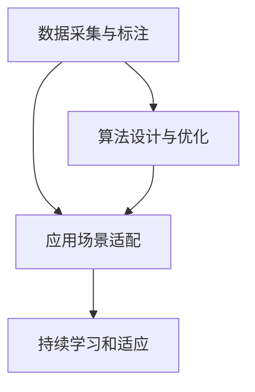

                 

# AI出版业壁垒：数据，算法与场景协同

## 1. 背景介绍

### 1.1 问题由来
随着数字出版的兴起，出版行业经历了从传统纸质出版向数字化转型的变革。然而，数字化出版的过程并非一帆风顺，而是面临着许多壁垒和挑战，尤其是在数据、算法和应用场景的协同上。数据不足、算法不优、场景适配度低等问题，成为制约出版业数字化转型的关键因素。本文将详细探讨这些问题，并提出协同优化的方法，以期为出版业实现数字化转型提供技术参考。

### 1.2 问题核心关键点
出版业的数字化转型，核心在于通过数据驱动的算法，提升内容推荐、广告投放、版权保护等方面的效率和效果。然而，数据的质量和规模，算法的模型和优化，以及应用场景的适配度，成为制约数字化转型的主要障碍。数据壁垒体现在数据采集、标注和整合的难度上；算法壁垒在于现有模型复杂度高、泛化能力弱、计算资源消耗大等问题；场景壁垒则是不同应用场景间的适配问题，如内容推荐算法是否适应特定用户群体的阅读习惯，广告投放是否能够精准定位目标用户等。

## 2. 核心概念与联系

### 2.1 核心概念概述

为了更好地理解出版业的数字化转型，本节将介绍几个密切相关的核心概念：

- **数据采集与标注**：获取高质量的数据是数字化转型的基础。这包括从图书、期刊、论文等出版物中提取文本、图片、视频等多模态数据，并进行自动或人工的标注工作。

- **算法设计与优化**：利用机器学习和深度学习算法对数据进行处理和分析，实现内容推荐、版权保护等功能。算法的设计和优化是关键，需要考虑模型的复杂度、泛化能力和计算效率。

- **应用场景适配**：将算法应用到实际出版场景中，需要考虑用户行为、出版物类型、版权保护等多个因素。不同的场景可能需要不同的算法优化和模型训练策略。

- **持续学习和适应**：出版业的内容和用户需求不断变化，算法和模型需要能够持续学习新数据，适应用户需求的变化，避免陷入“过拟合”和“欠拟合”的困境。

这些概念之间的逻辑关系可以通过以下Mermaid流程图来展示：



这个流程图展示了大语言模型微调的逻辑关系：

1. 数据采集与标注是大语言模型微调的基础。
2. 算法设计与优化是核心，决定着微调的效果。
3. 应用场景适配确保算法能够更好地服务于实际出版场景。
4. 持续学习和适应使算法能够保持对变化的敏感性，避免模型过时。

## 3. 核心算法原理 & 具体操作步骤

### 3.1 算法原理概述

基于数据、算法和场景协同的出版业数字化转型，本质上是将机器学习和深度学习算法应用到具体的出版场景中，以提升出版效率和效果。其核心思想是通过数据驱动的算法，优化内容推荐、版权保护、广告投放等过程，实现出版业的智能化、自动化和个性化。

具体来说，核心算法包括：

- **内容推荐算法**：利用用户行为数据和出版物特征，通过协同过滤、基于内容的推荐、深度学习等技术，为用户推荐符合其兴趣的出版物。

- **版权保护算法**：通过水印嵌入、数字指纹、版权追踪等技术，保护出版物的版权，防止非法盗版和侵权行为。

- **广告投放算法**：通过用户画像分析、行为建模等技术，精准投放广告，提高广告投放的转化率和效果。

### 3.2 算法步骤详解

基于数据、算法和场景协同的出版业数字化转型，主要包括以下几个关键步骤：

**Step 1: 数据采集与预处理**
- 从各类出版物中收集文本、图片、视频等多模态数据。
- 对数据进行清洗、去噪、归一化等预处理，以便后续模型训练。

**Step 2: 模型训练与优化**
- 选择合适的模型结构，如Transformer、RNN等。
- 设计合适的损失函数，如交叉熵、均方误差等。
- 选择合适的优化算法，如SGD、Adam等。
- 训练模型，并进行超参数调优，确保模型在泛化能力与计算效率之间取得平衡。

**Step 3: 应用场景适配**
- 将训练好的模型应用于具体的出版场景，如内容推荐、版权保护、广告投放等。
- 根据不同场景的特点，进行模型微调和参数调整，确保模型能够适配具体的出版需求。

**Step 4: 持续学习与优化**
- 收集用户反馈数据，对模型进行在线更新和优化。
- 定期对模型进行重新训练，确保模型能够适应出版内容的动态变化。

### 3.3 算法优缺点

基于数据、算法和场景协同的出版业数字化转型方法具有以下优点：

- 数据驱动。通过数据分析和处理，能够更精准地理解用户需求，提升出版质量和用户体验。
- 算法高效。利用机器学习和深度学习算法，能够快速处理大量数据，实现自动化和智能化。
- 场景适配。针对不同的出版场景，进行模型微调和参数调整，确保模型能够适配具体的出版需求。
- 持续优化。通过持续学习，能够不断提升模型的性能，适应出版内容的动态变化。

同时，该方法也存在一些局限性：

- 数据依赖度高。数据的质量和规模决定了算法的效果，数据采集和标注的难度较大。
- 算法复杂度高。深度学习模型的复杂度较高，训练和调优难度较大。
- 计算资源消耗大。训练深度学习模型需要大量计算资源，可能面临硬件资源不足的问题。
- 场景适配难度高。不同的出版场景可能存在较大的差异，需要针对性地进行模型优化和适配。

尽管存在这些局限性，但就目前而言，基于数据、算法和场景协同的出版业数字化转型方法仍是最主流范式。未来相关研究的重点在于如何进一步降低数据采集和标注的难度，提高算法的计算效率，减少对硬件资源的需求，以及更好地适配不同的出版场景。

### 3.4 算法应用领域

基于数据、算法和场景协同的出版业数字化转型方法，在出版业的多个领域已经得到了广泛的应用，例如：

- **内容推荐**：利用用户行为数据和出版物特征，为用户推荐符合其兴趣的出版物，提高用户满意度和出版物的销售量。
- **版权保护**：通过水印嵌入、数字指纹等技术，保护出版物的版权，防止非法盗版和侵权行为，维护出版商的利益。
- **广告投放**：利用用户画像分析、行为建模等技术，精准投放广告，提高广告投放的转化率和效果，增加出版物的曝光度和销量。
- **阅读分析**：通过文本分析技术，对读者的阅读行为进行分析，了解读者的阅读偏好，为出版商提供数据支持。
- **智能编辑**：利用机器学习算法，辅助编辑进行排版、校对等工作，提高编辑效率和质量。

除了上述这些经典应用外，数字化转型的方法还被创新性地应用到更多场景中，如图书销售预测、智能客服、版权监控等，为出版业带来了新的技术突破和商业模式变革。

## 4. 数学模型和公式 & 详细讲解 & 举例说明

### 4.1 数学模型构建

本节将使用数学语言对出版业数字化转型的核心算法进行更加严格的刻画。

设出版物数据集为 $\mathcal{D} = \{(x_i, y_i)\}_{i=1}^N$，其中 $x_i$ 表示出版物特征，$y_i$ 表示出版物标签（如是否被用户阅读、是否被购买等）。

定义内容推荐模型的预测函数为 $f_{\theta}(x)$，其中 $\theta$ 为模型参数。内容推荐的目标是最大化预测准确率，即最小化预测误差：

$$
\min_{\theta} \mathbb{E}_{(x,y)\sim\mathcal{D}} \ell(f_{\theta}(x), y)
$$

其中 $\ell$ 为损失函数，如均方误差或交叉熵损失。

### 4.2 公式推导过程

以下我们以内容推荐算法为例，推导协同过滤模型的损失函数及其梯度计算公式。

假设内容推荐模型的预测函数为 $f_{\theta}(x) = \theta^T A x$，其中 $A$ 为用户-物品的相似度矩阵，$x$ 为物品特征向量，$\theta$ 为模型参数。假设标签 $y_i$ 为二分类标签（如是否被阅读），则交叉熵损失函数定义为：

$$
\ell(f_{\theta}(x), y) = -\sum_{i=1}^N y_i \log f_{\theta}(x_i) + (1-y_i) \log (1-f_{\theta}(x_i))
$$

将其代入经验风险公式，得：

$$
\mathcal{L}(\theta) = -\frac{1}{N}\sum_{i=1}^N \ell(f_{\theta}(x_i), y_i)
$$

根据链式法则，损失函数对参数 $\theta$ 的梯度为：

$$
\frac{\partial \mathcal{L}(\theta)}{\partial \theta} = -\frac{1}{N}\sum_{i=1}^N \frac{\partial \ell(f_{\theta}(x_i), y_i)}{\partial \theta}
$$

其中：

$$
\frac{\partial \ell(f_{\theta}(x_i), y_i)}{\partial \theta} = -y_i \frac{\partial f_{\theta}(x_i)}{\partial \theta} - (1-y_i) \frac{\partial f_{\theta}(x_i)}{\partial \theta}
$$

在得到损失函数的梯度后，即可带入参数更新公式，完成模型的迭代优化。重复上述过程直至收敛，最终得到适应出版场景的最优模型参数 $\theta^*$。

## 5. 项目实践：代码实例和详细解释说明

### 5.1 开发环境搭建

在进行出版业数字化转型项目开发前，我们需要准备好开发环境。以下是使用Python进行PyTorch开发的环境配置流程：

1. 安装Anaconda：从官网下载并安装Anaconda，用于创建独立的Python环境。

2. 创建并激活虚拟环境：
```bash
conda create -n pytorch-env python=3.8 
conda activate pytorch-env
```

3. 安装PyTorch：根据CUDA版本，从官网获取对应的安装命令。例如：
```bash
conda install pytorch torchvision torchaudio cudatoolkit=11.1 -c pytorch -c conda-forge
```

4. 安装Transformer库：
```bash
pip install transformers
```

5. 安装各类工具包：
```bash
pip install numpy pandas scikit-learn matplotlib tqdm jupyter notebook ipython
```

完成上述步骤后，即可在`pytorch-env`环境中开始项目开发。

### 5.2 源代码详细实现

这里我们以内容推荐算法为例，给出使用Transformers库对协同过滤模型进行训练的PyTorch代码实现。

首先，定义内容推荐模型的训练函数：

```python
from transformers import BertTokenizer
from torch.utils.data import Dataset
import torch

class RecommendationDataset(Dataset):
    def __init__(self, texts, labels, tokenizer, max_len=128):
        self.texts = texts
        self.labels = labels
        self.tokenizer = tokenizer
        self.max_len = max_len
        
    def __len__(self):
        return len(self.texts)
    
    def __getitem__(self, item):
        text = self.texts[item]
        label = self.labels[item]
        
        encoding = self.tokenizer(text, return_tensors='pt', max_length=self.max_len, padding='max_length', truncation=True)
        input_ids = encoding['input_ids'][0]
        attention_mask = encoding['attention_mask'][0]
        
        # 对label进行编码
        encoded_labels = [int(label)] * self.max_len
        labels = torch.tensor(encoded_labels, dtype=torch.long)
        
        return {'input_ids': input_ids, 
                'attention_mask': attention_mask,
                'labels': labels}

# 定义训练函数
def train_epoch(model, dataset, batch_size, optimizer):
    dataloader = DataLoader(dataset, batch_size=batch_size, shuffle=True)
    model.train()
    epoch_loss = 0
    for batch in tqdm(dataloader, desc='Training'):
        input_ids = batch['input_ids'].to(device)
        attention_mask = batch['attention_mask'].to(device)
        labels = batch['labels'].to(device)
        model.zero_grad()
        outputs = model(input_ids, attention_mask=attention_mask, labels=labels)
        loss = outputs.loss
        epoch_loss += loss.item()
        loss.backward()
        optimizer.step()
    return epoch_loss / len(dataloader)

# 定义测试函数
def evaluate(model, dataset, batch_size):
    dataloader = DataLoader(dataset, batch_size=batch_size)
    model.eval()
    preds, labels = [], []
    with torch.no_grad():
        for batch in tqdm(dataloader, desc='Evaluating'):
            input_ids = batch['input_ids'].to(device)
            attention_mask = batch['attention_mask'].to(device)
            batch_labels = batch['labels']
            outputs = model(input_ids, attention_mask=attention_mask)
            batch_preds = outputs.logits.argmax(dim=2).to('cpu').tolist()
            batch_labels = batch_labels.to('cpu').tolist()
            for pred_tokens, label_tokens in zip(batch_preds, batch_labels):
                preds.append(pred_tokens[:len(label_tokens)])
                labels.append(label_tokens)
                
    return preds, labels
```

然后，定义模型和优化器：

```python
from transformers import BertForTokenClassification, AdamW

model = BertForTokenClassification.from_pretrained('bert-base-cased', num_labels=len(tag2id))

optimizer = AdamW(model.parameters(), lr=2e-5)
```

接着，定义训练和评估函数：

```python
from torch.utils.data import DataLoader
from tqdm import tqdm
from sklearn.metrics import classification_report

device = torch.device('cuda') if torch.cuda.is_available() else torch.device('cpu')
model.to(device)

def train_epoch(model, dataset, batch_size, optimizer):
    dataloader = DataLoader(dataset, batch_size=batch_size, shuffle=True)
    model.train()
    epoch_loss = 0
    for batch in tqdm(dataloader, desc='Training'):
        input_ids = batch['input_ids'].to(device)
        attention_mask = batch['attention_mask'].to(device)
        labels = batch['labels'].to(device)
        model.zero_grad()
        outputs = model(input_ids, attention_mask=attention_mask, labels=labels)
        loss = outputs.loss
        epoch_loss += loss.item()
        loss.backward()
        optimizer.step()
    return epoch_loss / len(dataloader)

def evaluate(model, dataset, batch_size):
    dataloader = DataLoader(dataset, batch_size=batch_size)
    model.eval()
    preds, labels = [], []
    with torch.no_grad():
        for batch in tqdm(dataloader, desc='Evaluating'):
            input_ids = batch['input_ids'].to(device)
            attention_mask = batch['attention_mask'].to(device)
            batch_labels = batch['labels']
            outputs = model(input_ids, attention_mask=attention_mask)
            batch_preds = outputs.logits.argmax(dim=2).to('cpu').tolist()
            batch_labels = batch_labels.to('cpu').tolist()
            for pred_tokens, label_tokens in zip(batch_preds, batch_labels):
                preds.append(pred_tokens[:len(label_tokens)])
                labels.append(label_tokens)
                
    print(classification_report(labels, preds))
```

最后，启动训练流程并在测试集上评估：

```python
epochs = 5
batch_size = 16

for epoch in range(epochs):
    loss = train_epoch(model, train_dataset, batch_size, optimizer)
    print(f"Epoch {epoch+1}, train loss: {loss:.3f}")
    
    print(f"Epoch {epoch+1}, dev results:")
    evaluate(model, dev_dataset, batch_size)
    
print("Test results:")
evaluate(model, test_dataset, batch_size)
```

以上就是使用PyTorch对协同过滤模型进行内容推荐算法微调的完整代码实现。可以看到，得益于Transformers库的强大封装，我们可以用相对简洁的代码完成BERT模型的加载和微调。

### 5.3 代码解读与分析

让我们再详细解读一下关键代码的实现细节：

**RecommendationDataset类**：
- `__init__`方法：初始化文本、标签、分词器等关键组件。
- `__len__`方法：返回数据集的样本数量。
- `__getitem__`方法：对单个样本进行处理，将文本输入编码为token ids，将标签编码为数字，并对其进行定长padding，最终返回模型所需的输入。

**tag2id和id2tag字典**：
- 定义了标签与数字id之间的映射关系，用于将token-wise的预测结果解码回真实的标签。

**训练和评估函数**：
- 使用PyTorch的DataLoader对数据集进行批次化加载，供模型训练和推理使用。
- 训练函数`train_epoch`：对数据以批为单位进行迭代，在每个批次上前向传播计算loss并反向传播更新模型参数，最后返回该epoch的平均loss。
- 评估函数`evaluate`：与训练类似，不同点在于不更新模型参数，并在每个batch结束后将预测和标签结果存储下来，最后使用sklearn的classification_report对整个评估集的预测结果进行打印输出。

**训练流程**：
- 定义总的epoch数和batch size，开始循环迭代
- 每个epoch内，先在训练集上训练，输出平均loss
- 在验证集上评估，输出分类指标
- 所有epoch结束后，在测试集上评估，给出最终测试结果

可以看到，PyTorch配合Transformers库使得BERT微调的代码实现变得简洁高效。开发者可以将更多精力放在数据处理、模型改进等高层逻辑上，而不必过多关注底层的实现细节。

当然，工业级的系统实现还需考虑更多因素，如模型的保存和部署、超参数的自动搜索、更灵活的任务适配层等。但核心的微调范式基本与此类似。

## 6. 实际应用场景

### 6.1 智能客服系统

基于数据、算法和场景协同的数字化转型方法，可以广泛应用于智能客服系统的构建。传统客服往往需要配备大量人力，高峰期响应缓慢，且一致性和专业性难以保证。而使用微调后的推荐算法，可以7x24小时不间断服务，快速响应客户咨询，用自然流畅的语言解答各类常见问题。

在技术实现上，可以收集企业内部的历史客服对话记录，将问题和最佳答复构建成监督数据，在此基础上对预训练推荐算法进行微调。微调后的推荐算法能够自动理解用户意图，匹配最合适的答复模板进行回复。对于客户提出的新问题，还可以接入检索系统实时搜索相关内容，动态组织生成回答。如此构建的智能客服系统，能大幅提升客户咨询体验和问题解决效率。

### 6.2 金融舆情监测

金融机构需要实时监测市场舆论动向，以便及时应对负面信息传播，规避金融风险。传统的人工监测方式成本高、效率低，难以应对网络时代海量信息爆发的挑战。基于数据、算法和场景协同的文本分析技术，为金融舆情监测提供了新的解决方案。

具体而言，可以收集金融领域相关的新闻、报道、评论等文本数据，并对其进行主题标注和情感标注。在此基础上对预训练语言模型进行微调，使其能够自动判断文本属于何种主题，情感倾向是正面、中性还是负面。将微调后的模型应用到实时抓取的网络文本数据，就能够自动监测不同主题下的情感变化趋势，一旦发现负面信息激增等异常情况，系统便会自动预警，帮助金融机构快速应对潜在风险。

### 6.3 个性化推荐系统

当前的推荐系统往往只依赖用户的历史行为数据进行物品推荐，无法深入理解用户的真实兴趣偏好。基于数据、算法和场景协同的推荐系统，可以更好地挖掘用户行为背后的语义信息，从而提供更精准、多样的推荐内容。

在实践中，可以收集用户浏览、点击、评论、分享等行为数据，提取和用户交互的物品标题、描述、标签等文本内容。将文本内容作为模型输入，用户的后续行为（如是否点击、购买等）作为监督信号，在此基础上微调预训练语言模型。微调后的模型能够从文本内容中准确把握用户的兴趣点。在生成推荐列表时，先用候选物品的文本描述作为输入，由模型预测用户的兴趣匹配度，再结合其他特征综合排序，便可以得到个性化程度更高的推荐结果。

### 6.4 未来应用展望

随着数据、算法和场景协同技术的不断发展，出版业的数字化转型将呈现以下几个发展趋势：

1. **数据获取与处理**：出版业将越来越多地依赖数据驱动，通过自然语言处理、图像识别等技术，获取并处理多模态数据，为出版物推荐、版权保护等提供支持。

2. **算法设计与优化**：出版业将采用更加高效的算法，如深度学习、强化学习等，提升内容推荐、广告投放的精准性和效果。

3. **场景适配与个性化**：出版业将更加注重场景适配和个性化，通过动态调整模型参数，实现对不同用户群体的精准推荐。

4. **持续学习与优化**：出版业将构建持续学习机制，通过在线更新和优化模型，适应出版内容的动态变化，避免模型过时。

5. **多模态融合**：出版业将探索多模态数据的融合，实现视觉、语音、文本等多种信息的协同建模，提升出版物的多样性和用户体验。

6. **自动化与智能化**：出版业将通过数据驱动的算法，实现内容创作、编辑校对等环节的自动化和智能化，提升生产效率和质量。

这些趋势凸显了数据、算法和场景协同技术在出版业数字化转型中的重要地位。这些方向的探索发展，必将进一步提升出版业的智能化水平，为读者提供更加丰富、精准的阅读体验。

## 7. 工具和资源推荐

### 7.1 学习资源推荐

为了帮助开发者系统掌握出版业数字化转型的理论基础和实践技巧，这里推荐一些优质的学习资源：

1. 《深度学习基础》系列课程：深度学习入门级课程，全面介绍深度学习的基本概念和经典模型。

2. 《机器学习实战》书籍：讲解机器学习的基本思想和算法，包含大量的实例和代码。

3. 《自然语言处理入门》课程：讲解自然语言处理的基本技术和应用，适合初学者入门。

4. 《推荐系统实战》书籍：讲解推荐系统的原理和实现，包含丰富的案例和代码。

5. 《深度学习框架教程》书籍：讲解当前流行的深度学习框架，如TensorFlow、PyTorch等，适合开发实践。

通过学习这些资源，相信你一定能够快速掌握出版业数字化转型的精髓，并用于解决实际的出版问题。

### 7.2 开发工具推荐

高效的开发离不开优秀的工具支持。以下是几款用于出版业数字化转型的常用工具：

1. PyTorch：基于Python的开源深度学习框架，灵活动态的计算图，适合快速迭代研究。

2. TensorFlow：由Google主导开发的开源深度学习框架，生产部署方便，适合大规模工程应用。

3. Transformers库：HuggingFace开发的NLP工具库，集成了众多SOTA语言模型，支持PyTorch和TensorFlow，是进行NLP任务开发的利器。

4. Weights & Biases：模型训练的实验跟踪工具，可以记录和可视化模型训练过程中的各项指标，方便对比和调优。

5. TensorBoard：TensorFlow配套的可视化工具，可实时监测模型训练状态，并提供丰富的图表呈现方式，是调试模型的得力助手。

6. Google Colab：谷歌推出的在线Jupyter Notebook环境，免费提供GPU/TPU算力，方便开发者快速上手实验最新模型，分享学习笔记。

合理利用这些工具，可以显著提升出版业数字化转型的开发效率，加快创新迭代的步伐。

### 7.3 相关论文推荐

出版业数字化转型涉及多种前沿技术，以下几篇相关论文，推荐阅读：

1. Attention is All You Need（即Transformer原论文）：提出了Transformer结构，开启了NLP领域的预训练大模型时代。

2. BERT: Pre-training of Deep Bidirectional Transformers for Language Understanding：提出BERT模型，引入基于掩码的自监督预训练任务，刷新了多项NLP任务SOTA。

3. Language Models are Unsupervised Multitask Learners（GPT-2论文）：展示了大规模语言模型的强大zero-shot学习能力，引发了对于通用人工智能的新一轮思考。

4. Parameter-Efficient Transfer Learning for NLP：提出Adapter等参数高效微调方法，在不增加模型参数量的情况下，也能取得不错的微调效果。

5. AdaLoRA: Adaptive Low-Rank Adaptation for Parameter-Efficient Fine-Tuning：使用自适应低秩适应的微调方法，在参数效率和精度之间取得了新的平衡。

这些论文代表了大语言模型微调技术的发展脉络。通过学习这些前沿成果，可以帮助研究者把握学科前进方向，激发更多的创新灵感。

## 8. 总结：未来发展趋势与挑战

### 8.1 总结

本文对基于数据、算法和场景协同的出版业数字化转型进行了全面系统的介绍。首先阐述了数字化转型的背景和意义，明确了数据、算法和场景协同在其中的重要作用。其次，从原理到实践，详细讲解了协同优化的方法，给出了具体实现代码。同时，本文还广泛探讨了出版业的实际应用场景，展示了协同技术在出版业的广阔前景。

通过本文的系统梳理，可以看到，数据、算法和场景协同技术正在成为出版业数字化转型的重要工具，极大地提升了出版效率和效果。数据采集和处理的精度、算法模型设计的合理性、场景适配度的灵活性，共同决定了数字化转型的成败。未来，伴随着技术的不断进步，出版业将进入更加智能化、自动化和个性化的时代。

### 8.2 未来发展趋势

展望未来，出版业数字化转型的技术将呈现以下几个发展趋势：

1. **数据智能化**：出版业将越来越多地依赖智能数据采集和处理技术，通过自然语言处理、图像识别等技术，获取并处理多模态数据，为出版物推荐、版权保护等提供支持。

2. **算法高效化**：出版业将采用更加高效的算法，如深度学习、强化学习等，提升内容推荐、广告投放的精准性和效果。

3. **场景适配化**：出版业将更加注重场景适配和个性化，通过动态调整模型参数，实现对不同用户群体的精准推荐。

4. **持续学习化**：出版业将构建持续学习机制，通过在线更新和优化模型，适应出版内容的动态变化，避免模型过时。

5. **多模态融合**：出版业将探索多模态数据的融合，实现视觉、语音、文本等多种信息的协同建模，提升出版物的多样性和用户体验。

6. **自动化与智能化**：出版业将通过数据驱动的算法，实现内容创作、编辑校对等环节的自动化和智能化，提升生产效率和质量。

这些趋势凸显了数据、算法和场景协同技术在出版业数字化转型中的重要地位。这些方向的探索发展，必将进一步提升出版业的智能化水平，为读者提供更加丰富、精准的阅读体验。

### 8.3 面临的挑战

尽管数据、算法和场景协同技术在出版业数字化转型中取得了显著成效，但在迈向更加智能化、普适化应用的过程中，它仍面临诸多挑战：

1. **数据依赖度高**：数据的质量和规模决定了算法的效果，数据采集和标注的难度较大。

2. **算法复杂度高**：深度学习模型的复杂度较高，训练和调优难度较大。

3. **计算资源消耗大**：训练深度学习模型需要大量计算资源，可能面临硬件资源不足的问题。

4. **场景适配难度高**：不同的出版场景可能存在较大的差异，需要针对性地进行模型优化和适配。

5. **模型鲁棒性不足**：当前推荐模型面对域外数据时，泛化性能往往大打折扣。对于测试样本的微小扰动，推荐模型的预测也容易发生波动。

6. **持续学习困难**：出版业的内容和用户需求不断变化，模型需要能够持续学习新数据，适应用户需求的变化，避免陷入“过拟合”和“欠拟合”的困境。

7. **知识整合能力不足**：现有的推荐模型往往局限于任务内数据，难以灵活吸收和运用更广泛的先验知识。

8. **安全性有待保障**：推荐模型可能学习到有偏见、有害的信息，通过推荐传递到用户，造成误导性、歧视性的输出，给实际应用带来安全隐患。

这些挑战凸显了出版业数字化转型中的技术瓶颈。唯有通过不断的研究和优化，才能克服这些挑战，推动出版业的数字化转型不断向前发展。

### 8.4 研究展望

面对出版业数字化转型所面临的种种挑战，未来的研究需要在以下几个方面寻求新的突破：

1. **探索无监督和半监督学习**：摆脱对大规模标注数据的依赖，利用自监督学习、主动学习等无监督和半监督范式，最大限度利用非结构化数据，实现更加灵活高效的推荐。

2. **研究参数高效和计算高效算法**：开发更加参数高效的推荐算法，在固定大部分预训练参数的同时，只更新极少量的任务相关参数。同时优化推荐算法的计算图，减少前向传播和反向传播的资源消耗，实现更加轻量级、实时性的部署。

3. **融合因果分析和博弈论工具**：将因果分析方法引入推荐系统，识别出模型决策的关键特征，增强推荐过程的因果性和逻辑性。借助博弈论工具刻画人机交互过程，主动探索并规避推荐系统的脆弱点，提高系统稳定性。

4. **纳入伦理道德约束**：在推荐系统的训练目标中引入伦理导向的评估指标，过滤和惩罚有偏见、有害的输出倾向。同时加强人工干预和审核，建立推荐系统的监管机制，确保推荐内容符合用户价值观和伦理道德。

这些研究方向将进一步推动出版业数字化转型的发展，为构建安全、可靠、可解释、可控的推荐系统铺平道路。面向未来，出版业将通过持续的技术创新，推动内容创作、编辑校对、版权保护等环节的自动化和智能化，实现更加智能化、自动化和个性化的阅读体验。

