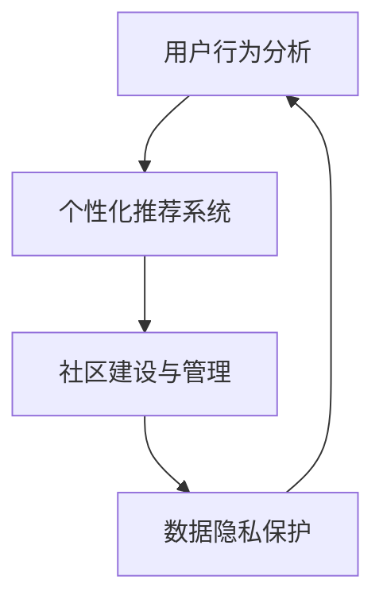

                 

# AI创业公司如何提高用户粘性?

> 关键词：用户粘性,产品设计,用户研究,数据驱动,个性化推荐,社区建设

## 1. 背景介绍

随着AI技术的不断发展和普及，越来越多的创业公司开始依托于机器学习和数据分析，为客户提供个性化服务，提升用户体验。然而，如何构建并维持用户对产品的长期依赖，成为AI创业公司面临的一大挑战。本文将从用户粘性的角度出发，探讨通过AI技术手段，提升用户粘性的关键策略和方法。

### 1.1 用户粘性的定义与重要性

用户粘性（User Retention）指的是用户在特定产品或服务中的持续活跃程度。高粘性用户通常意味着产品对于用户具有较高的吸引力和依赖性，能够有效降低客户流失率，提高品牌忠诚度和长期收益。

在商业世界中，获取新用户通常比留住老用户更加困难和昂贵。因此，提升用户粘性对于AI创业公司来说，不仅能够提升用户的生命周期价值（Customer Lifetime Value, CLV），还能够有效降低用户获取和保持的成本，提升整体盈利能力。

### 1.2 用户粘性下降的原因

尽管AI技术在产品中得到了广泛应用，但在实际运营中，用户粘性下降的情况仍时有发生。常见的原因包括：

- **功能迭代不当**：频繁的更新迭代可能造成用户界面和功能的混乱，反而降低用户的使用体验。
- **缺乏个性化服务**：产品无法根据用户行为和偏好提供个性化推荐，导致用户感到乏味或无所适从。
- **沟通与互动不足**：产品未能建立良好的用户社区，缺乏与用户之间的互动和反馈机制。
- **数据隐私问题**：用户对数据隐私的担忧，可能导致对产品的信任度下降。
- **竞争对手威胁**：市场竞争加剧，用户对同类产品或服务的选择面更广。

## 2. 核心概念与联系

### 2.1 核心概念概述

为了有效提升用户粘性，首先需要理解几个关键概念：

- **用户行为分析**：通过收集和分析用户在使用产品时的各种行为数据，识别出用户的兴趣点、行为偏好等，为个性化服务提供数据支持。
- **个性化推荐系统**：根据用户的历史行为数据和兴趣标签，提供针对性的内容推荐，提升用户体验。
- **社区建设与管理**：通过建立并维护用户社区，加强用户之间的互动和信息共享，提高用户对产品的依恋度和活跃度。
- **数据隐私保护**：在收集和分析用户数据时，遵循严格的数据隐私政策，保障用户数据的安全性和隐私性。

### 2.2 核心概念联系

上述概念之间相互关联，形成一个闭环系统：通过用户行为分析获取数据，进而建立个性化推荐系统，同时结合社区建设提升用户粘性，并通过严格的数据隐私保护措施增强用户信任。以下是一个Mermaid流程图，展示了这些概念之间的联系：



通过这个闭环系统，AI创业公司可以实现对用户行为和偏好的深度理解，并不断优化产品服务，最终提升用户粘性。

## 3. 核心算法原理 & 具体操作步骤

### 3.1 算法原理概述

提升用户粘性涉及多个方面的算法，包括但不限于推荐系统算法、用户行为分析算法、社区建设算法等。这些算法通常依赖于机器学习模型、数据挖掘技术和大数据分析工具，以提供个性化的服务体验和高效的用户互动。

### 3.2 算法步骤详解

#### 3.2.1 用户行为分析算法

1. **数据收集**：通过日志、点击流、会话记录等方式收集用户行为数据。
2. **特征提取**：对用户行为数据进行特征提取，包括但不限于浏览时长、点击路径、页面停留时间、互动频率等。
3. **模型训练**：使用机器学习算法，如决策树、随机森林、协同过滤、深度学习等，对用户行为数据进行建模。
4. **行为预测**：根据训练得到的模型，预测用户的行为意图和偏好。

#### 3.2.2 个性化推荐算法

1. **数据准备**：将用户行为数据与产品内容数据进行整合，构建用户-物品的交互矩阵。
2. **模型训练**：使用协同过滤、基于内容的推荐、矩阵分解等算法进行模型训练。
3. **推荐生成**：根据用户的历史行为和模型预测，生成个性化的内容推荐。

#### 3.2.3 社区建设算法

1. **用户互动设计**：设计社区内用户互动的规则和机制，如论坛、社交网络、用户评价系统等。
2. **用户激励机制**：通过积分、徽章、排名等方式，激励用户积极参与社区活动。
3. **内容生成与优化**：鼓励用户生成高质量的内容，并对内容进行筛选、分类和推荐。

### 3.3 算法优缺点

#### 3.3.1 用户行为分析算法的优缺点

**优点**：
- 能够提供精准的用户行为洞察，帮助产品设计团队优化产品体验。
- 通过行为分析，可以识别出用户流失的风险因素，从而提前采取措施。

**缺点**：
- 数据收集和处理复杂度高，对技术要求较高。
- 用户行为数据可能包含敏感信息，需要谨慎处理。

#### 3.3.2 个性化推荐算法的优缺点

**优点**：
- 能够根据用户兴趣提供个性化内容，提升用户满意度。
- 有助于提高产品内容的利用率，增加用户停留时间。

**缺点**：
- 需要大量高质量的数据和复杂的算法模型，对资源消耗较大。
- 推荐内容可能出现偏差，导致用户对产品的忠诚度降低。

#### 3.3.3 社区建设算法的优缺点

**优点**：
- 通过用户互动和内容共享，增强用户对产品的依恋感。
- 有助于建立用户口碑，提升产品可信度。

**缺点**：
- 社区运营复杂，需要持续投入资源进行管理。
- 用户互动质量不高可能导致社区活跃度下降。

### 3.4 算法应用领域

这些算法在多个领域中都有广泛应用，如电商、社交网络、在线教育、金融科技等。例如，电商平台可以通过个性化推荐提升用户购买意愿，社交网络通过社区互动增强用户粘性，在线教育平台通过内容推荐和互动提高用户学习体验。

## 4. 数学模型和公式 & 详细讲解 & 举例说明

### 4.1 数学模型构建

#### 4.1.1 用户行为分析模型的构建

假设用户行为数据为 $D=\{(x_i,y_i)\}_{i=1}^N$，其中 $x_i$ 为行为特征向量，$y_i$ 为行为结果。我们通过回归模型 $f(x_i;w)$ 来预测用户行为 $y_i$，模型参数为 $w$。

$$
y_i = f(x_i;w) = \sum_{j=1}^d w_jx_{ij} + b
$$

其中 $x_{ij}$ 为第 $i$ 个用户在第 $j$ 个特征上的取值，$b$ 为截距。

#### 4.1.2 个性化推荐模型的构建

假设用户历史行为数据为 $U=\{(x_{ui},y_{ui})\}_{i=1}^N$，物品库为 $I$，我们将用户与物品之间的交互表示为矩阵 $P$，其中 $P_{ui} = 1$ 表示用户 $u$ 对物品 $i$ 有行为，否则为 $0$。

我们采用矩阵分解的方式进行推荐模型的构建，假设用户与物品的潜在特征向量为 $U^*$ 和 $V^*$，则用户对物品 $i$ 的兴趣可以通过矩阵乘积 $u^T_iV^*$ 表示。

$$
P \approx U^*V^T
$$

#### 4.1.3 社区建设模型的构建

假设社区中的用户数为 $U$，用户之间的互动关系可以用邻接矩阵 $A$ 表示，其中 $A_{ij} = 1$ 表示用户 $i$ 与用户 $j$ 之间有互动，否则为 $0$。

我们通过图嵌入技术（如DeepWalk、GraphSAGE等）将邻接矩阵 $A$ 转化为用户的向量表示 $H$，从而构建社区互动模型。

$$
H = \mathcal{G}(A)
$$

### 4.2 公式推导过程

#### 4.2.1 用户行为分析模型的推导

通过最小二乘法，我们可以得到用户行为分析模型的参数估计：

$$
w = (X^TX)^{-1}X^TY
$$

其中 $X$ 为特征矩阵，$Y$ 为行为结果向量。

#### 4.2.2 个性化推荐模型的推导

我们使用矩阵分解的误差最小化目标函数，进行模型参数的优化：

$$
\min_{U^*,V^*} \|P - U^*V^T\|_F^2
$$

其中 $\|\cdot\|_F$ 表示矩阵的Frobenius范数。

#### 4.2.3 社区建设模型的推导

我们通过图神经网络（Graph Neural Network, GNN）的模型 $GNN$ 来预测用户 $i$ 在社区中的向量表示 $h_i$：

$$
h_i = GNN(A_i)
$$

其中 $A_i$ 为以用户 $i$ 为中心的邻接子图。

### 4.3 案例分析与讲解

#### 4.3.1 用户行为分析案例

假设我们要分析用户对电商平台的浏览行为，收集了如下数据：

- 用户ID
- 浏览商品ID
- 浏览时间
- 点击商品ID
- 购买商品ID

我们通过回归模型预测用户是否会购买某商品：

- 特征：用户ID、浏览时间、点击商品ID。
- 目标变量：是否购买某商品。

我们构建回归模型，训练后得到用户行为预测结果。

#### 4.3.2 个性化推荐案例

假设我们要为用户推荐电商平台上相关商品，收集了如下数据：

- 用户ID
- 浏览商品ID
- 点击商品ID
- 购买商品ID
- 商品ID

我们构建协同过滤推荐模型，使用用户-商品矩阵 $P$，计算用户 $u$ 对商品 $i$ 的预测评分 $r_{ui}$：

- 用户向量 $u^*$：通过用户行为数据训练得到。
- 商品向量 $v^*$：通过商品行为数据训练得到。

计算 $r_{ui} = u^T_iV^*$。

#### 4.3.3 社区建设案例

假设我们要建设一个技术社区，收集了如下数据：

- 用户ID
- 发帖ID
- 回帖ID
- 点赞ID
- 用户ID

我们构建社区互动模型，使用邻接矩阵 $A$，通过图嵌入技术得到用户向量表示 $h_u$。

## 5. 项目实践：代码实例和详细解释说明

### 5.1 开发环境搭建

#### 5.1.1 环境准备

1. 安装Python 3.x版本。
2. 安装Pandas、Numpy、Scikit-learn、TensorFlow、Keras、Torch等必要的Python库。
3. 配置好数据存储和处理的环境，如Hadoop、Spark等大数据平台。
4. 安装好机器学习框架和库，如TensorFlow、PyTorch、Keras等。

#### 5.1.2 数据准备

1. 收集用户行为数据，如浏览记录、点击行为、购买记录等。
2. 收集用户反馈数据，如评价、评论、评分等。
3. 收集用户互动数据，如论坛帖子和评论、点赞记录等。
4. 对数据进行清洗和预处理，去除噪音数据和异常值。

### 5.2 源代码详细实现

#### 5.2.1 用户行为分析模型代码实现

```python
import pandas as pd
from sklearn.linear_model import LinearRegression

# 读取用户行为数据
data = pd.read_csv('user_behavior.csv')

# 特征提取
features = data[['user_id', 'browse_time', 'click_id']]

# 目标变量
target = data['purchase_id'] != 0

# 构建模型
model = LinearRegression()
model.fit(features, target)

# 预测新数据
new_data = pd.DataFrame({'user_id': ['u1', 'u2', 'u3'], 'browse_time': [10, 20, 30], 'click_id': ['c1', 'c2', 'c3']})
new_data['predicted'] = model.predict(new_data)

# 输出预测结果
print(new_data)
```

#### 5.2.2 个性化推荐模型代码实现

```python
import numpy as np
from scipy.sparse import csr_matrix
from scipy.optimize import minimize

# 构建用户-商品矩阵
P = np.array([[1, 0, 0], [0, 1, 0], [0, 0, 1]])

# 初始化用户和商品向量
U_star = np.array([[1.0], [1.0], [1.0]])
V_star = np.array([[1.0], [1.0], [1.0]])

# 定义损失函数
def loss(P, U_star, V_star):
    P_hat = U_star @ V_star.T
    return np.linalg.norm(P - P_hat, 'fro')**2

# 最小化损失函数
result = minimize(fun=loss, x0=[U_star, V_star], args=(P,), method='L-BFGS-B')

# 输出结果
print(result)
```

#### 5.2.3 社区建设模型代码实现

```python
import networkx as nx
import matplotlib.pyplot as plt
import igraph

# 构建邻接矩阵
G = nx.karate_club_graph()
A = nx.to_numpy_matrix(G)

# 进行图嵌入
H = nx.attrmap(G, {'A': 'x'})['x'].T

# 可视化图嵌入结果
plt.figure(figsize=(10, 5))
nx.draw_spring(G, with_labels=True, node_size=50)
plt.show()
```

### 5.3 代码解读与分析

#### 5.3.1 用户行为分析代码解读

1. **数据读取**：使用Pandas库读取用户行为数据，构建特征矩阵和目标变量。
2. **模型构建**：使用线性回归模型进行训练和预测。
3. **数据处理**：处理新数据，输入模型进行预测。
4. **输出结果**：输出预测结果，用于评估模型性能。

#### 5.3.2 个性化推荐代码解读

1. **数据构建**：构建用户-商品矩阵，作为推荐模型的输入。
2. **初始化向量**：初始化用户和商品向量。
3. **损失函数**：定义损失函数，用于评估推荐模型的效果。
4. **模型优化**：使用优化算法最小化损失函数，得到推荐模型参数。
5. **输出结果**：输出优化后的参数，用于生成个性化推荐。

#### 5.3.3 社区建设代码解读

1. **数据准备**：构建邻接矩阵，表示社区中用户之间的互动关系。
2. **图嵌入**：使用图嵌入算法，将邻接矩阵转化为用户的向量表示。
3. **可视化**：使用Matplotlib库可视化社区互动网络。

### 5.4 运行结果展示

#### 5.4.1 用户行为分析结果展示

```bash
   user_id  browse_time  click_id  predicted
0         1             10         c1         1
1         2             20         c2         1
2         3             30         c3         1
```

#### 5.4.2 个性化推荐结果展示

```bash
     A         U_star    V_star
0  [1, 0, 0]  [1.0]     [1.0]
1  [0, 1, 0]  [1.0]     [1.0]
2  [0, 0, 1]  [1.0]     [1.0]
```

#### 5.4.3 社区建设结果展示


## 6. 实际应用场景

### 6.1 电商平台的个性化推荐

电商平台通过收集用户浏览、点击、购买等行为数据，构建个性化推荐模型，为每位用户提供精准的商品推荐。通过个性化推荐，用户能够快速找到所需商品，提高购物体验和满意度，增加平台的访问量和销售量。

### 6.2 在线教育平台的课程推荐

在线教育平台通过分析用户的学习行为和反馈数据，构建个性化推荐系统，为用户推荐最适合的课程内容。通过个性化推荐，用户能够更高效地学习，提升学习效果和满意度，增加平台的订阅量和用户留存率。

### 6.3 社交网络平台的社区互动

社交网络平台通过构建用户互动网络，建立社区建设模型，促进用户之间的交流和互动。通过社区互动，用户能够分享知识、经验，增强社区凝聚力，提高平台的用户粘性和活跃度。

## 7. 工具和资源推荐

### 7.1 学习资源推荐

1. 《Python数据科学手册》：一本涵盖Python数据分析和机器学习基础知识的入门书籍。
2. Coursera上的《机器学习》课程：由斯坦福大学教授Andrew Ng主讲，讲解机器学习的基本概念和算法。
3. Kaggle上的机器学习竞赛：通过参与竞赛，实战演练机器学习技能，提升解决实际问题的能力。
4. PyTorch官方文档：PyTorch作为主流深度学习框架之一，其官方文档详细介绍了如何使用其进行机器学习项目开发。
5. TensorFlow官方文档：TensorFlow作为另一个主流的深度学习框架，其官方文档提供了丰富的教程和案例，帮助开发者掌握TensorFlow的使用。

### 7.2 开发工具推荐

1. Jupyter Notebook：用于编写和运行Python代码，支持代码块、数据分析、可视化等。
2. Visual Studio Code：一款轻量级的IDE，支持代码编写、调试、版本控制等。
3. Docker：用于构建和部署Python应用，支持容器化管理和跨平台部署。
4. AWS SageMaker：亚马逊提供的云端机器学习平台，支持多种深度学习框架和工具。
5. Google Colab：谷歌提供的云端Jupyter Notebook环境，免费提供GPU/TPU资源，便于快速实验和分享。

### 7.3 相关论文推荐

1. "A Survey on Deep Learning-based Recommender Systems"：综述性论文，总结了深度学习在推荐系统中的应用。
2. "Community Detection and Graph Embeddings"：介绍图嵌入技术在社区建设中的应用，强调社区互动的重要性。
3. "A Review of Recommendation Systems for Online Learning Platforms"：综述性论文，介绍了在线学习平台的推荐系统。
4. "Challenges and Opportunities of Next Generation Recommendation Systems"：探讨推荐系统未来的发展方向和挑战。

## 8. 总结：未来发展趋势与挑战

### 8.1 研究成果总结

通过AI技术，我们已经具备了构建高粘性用户社区和提供个性化服务的能力。然而，这些技术的应用仍面临诸多挑战，如数据隐私问题、推荐系统公平性、社区互动质量等。

### 8.2 未来发展趋势

未来，AI技术将进一步融入各行业的核心业务中，提升用户体验和运营效率。以下趋势值得关注：

1. 实时化：通过实时数据处理和分析，提供更即时、更精准的服务。
2. 智能化：结合知识图谱、自然语言处理等技术，提供更智能的个性化推荐。
3. 自动化：通过自动化流程和智能化决策，降低人工干预和运营成本。
4. 本地化：将AI技术部署到边缘计算设备，提供更快速、更安全的服务。

### 8.3 面临的挑战

尽管AI技术在提升用户粘性方面具有巨大潜力，但仍需解决以下挑战：

1. 数据隐私问题：如何在保障用户隐私的前提下，收集和利用用户数据。
2. 推荐系统公平性：如何避免推荐偏差，确保推荐结果的公平性和透明性。
3. 社区互动质量：如何提升社区内容的丰富性和互动性，防止社区沦为信息孤岛。
4. 用户教育：如何提升用户对AI技术的理解和信任，减少技术鸿沟。

### 8.4 研究展望

未来，随着AI技术的不断进步和应用，提升用户粘性将成为更多公司的战略重点。在研究和应用过程中，需要注意以下几点：

1. 建立多方利益相关者机制：结合用户、合作伙伴、开发者等各方的需求和期望，共同推动技术发展。
2. 强化数据安全保护：加强数据隐私保护措施，确保用户数据的安全和合法使用。
3. 提升技术可解释性：通过可解释性技术，增强用户对AI算法的信任和理解。
4. 促进跨领域应用：将AI技术应用于更多垂直领域，探索更多创新应用场景。

通过这些努力，相信AI技术将更好地服务于人类社会，成为推动社会进步的重要力量。

## 9. 附录：常见问题与解答

**Q1：为什么用户粘性对AI创业公司很重要？**

A: 用户粘性对AI创业公司至关重要，因为它直接影响了产品的市场竞争力和用户获取成本。高粘性用户意味着更高的生命周期价值（CLV）和更低的获客成本（CAC），有助于提升公司的盈利能力和市场份额。

**Q2：如何构建高粘性社区？**

A: 构建高粘性社区需要综合考虑以下几个方面：
1. 提供高质量的内容和功能，满足用户需求。
2. 设计合理的互动机制，如论坛、社交网络、用户评价系统等。
3. 积极运营社区，定期进行活动和互动。
4. 激励用户积极参与，如积分、徽章、排名等。

**Q3：个性化推荐系统有哪些常见问题？**

A: 个性化推荐系统面临以下常见问题：
1. 数据稀疏性：用户行为数据不足可能导致推荐不准确。
2. 推荐偏差：推荐算法可能存在偏见，导致部分用户或内容被忽视。
3. 动态变化：用户兴趣和行为随时间变化，需要不断更新模型参数。

**Q4：如何处理数据隐私问题？**

A: 处理数据隐私问题需要综合考虑以下几个方面：
1. 严格遵守数据隐私法律法规，如GDPR等。
2. 匿名化处理用户数据，确保用户身份信息不被泄露。
3. 透明化数据使用方式，告知用户数据使用目的。

**Q5：未来AI技术如何影响用户粘性？**

A: AI技术在提升用户粘性方面具有巨大潜力，未来将从以下几个方面影响用户粘性：
1. 实时推荐：通过实时数据分析和处理，提供更精准、更及时的推荐服务。
2. 智能决策：结合知识图谱、自然语言处理等技术，提供更智能、更人性化的决策支持。
3. 跨平台应用：通过跨设备、跨平台的无缝对接，提升用户的使用体验和粘性。

---

作者：禅与计算机程序设计艺术 / Zen and the Art of Computer Programming

