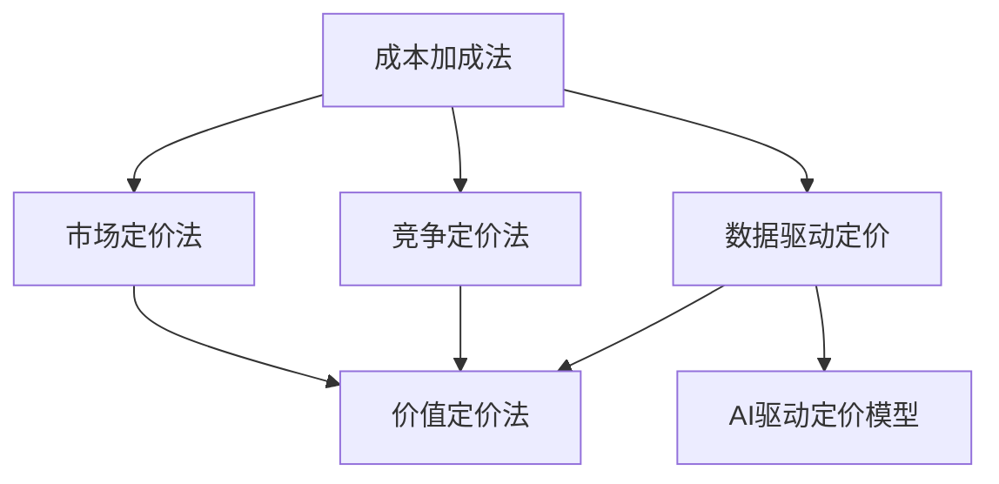

                 

# AI创业公司的产品定价策略

在当今充满竞争的市场环境中，AI创业公司需要做出明智的产品定价决策，以确保盈利并实现可持续发展。本文将深入探讨AI创业公司产品定价的策略，包括成本加成法、市场定价法、竞争定价法和价值定价法，以及如何利用数据和AI技术优化定价过程。

## 1. 背景介绍

随着人工智能技术的快速发展，越来越多的创业公司开始将AI技术应用于产品开发中。然而，产品定价不仅涉及技术实现，更是一项复杂的管理决策。一个不合理的产品定价策略不仅可能影响公司盈利能力，还可能导致市场份额的流失。

## 2. 核心概念与联系

### 2.1 核心概念概述

- **成本加成法**：基于产品成本加上固定利润率来确定产品价格，是传统制造业常用的定价方法。
- **市场定价法**：根据市场需求和消费者接受度确定价格，通常在市场导向的行业中较为常用。
- **竞争定价法**：通过分析竞争对手的产品定价，确定与市场相适应的价格。
- **价值定价法**：根据消费者对产品价值的感知来定价，强调产品的独特价值和附加价值。
- **数据驱动定价**：利用大数据和AI技术分析市场需求、竞争态势和消费者行为，动态调整定价策略。

这些定价方法并不是相互独立的，实际应用中常常需要综合考虑多种因素，以确定最优的定价策略。

### 2.2 核心概念原理和架构的 Mermaid 流程图(Mermaid 流程节点中不要有括号、逗号等特殊字符)



这个流程图展示了不同定价方法之间的联系和转换路径。例如，成本加成法的结果可以作为市场定价法和竞争定价法的参考基础，数据驱动定价和AI驱动定价模型则可以为价值定价法提供更准确的消费者价值感知分析。

## 3. 核心算法原理 & 具体操作步骤

### 3.1 算法原理概述

AI创业公司的产品定价策略需要综合考虑成本、市场需求、竞争态势和消费者价值感知。以下是几种常见定价策略的原理概述：

- **成本加成法**：计算产品单位成本（包括直接成本和间接成本），加上预定的利润率，得到产品价格。
- **市场定价法**：通过市场调研，了解目标客户对产品的支付意愿，根据消费者支付意愿设定价格。
- **竞争定价法**：分析竞争对手的产品定价，结合自身产品特性和差异化优势，确定合理的价格水平。
- **价值定价法**：分析产品提供的独特价值和附加服务，评估消费者对产品的价值感知，设定高于成本的价格。
- **数据驱动定价**：利用大数据分析市场需求、竞争态势和消费者行为，动态调整价格策略。

### 3.2 算法步骤详解

#### 3.2.1 成本加成法

1. **计算单位成本**：包括直接材料、人工成本、生产成本和运营成本。
2. **确定利润率**：根据目标利润和预期销售量，计算利润率。
3. **确定产品价格**：单位成本加上利润率得到最终价格。

#### 3.2.2 市场定价法

1. **市场调研**：通过问卷调查、焦点小组等方式，收集目标客户对产品的支付意愿。
2. **价格测试**：在市场中进行价格测试，收集实际销售数据。
3. **调整价格**：根据测试结果，调整产品价格以匹配市场需求。

#### 3.2.3 竞争定价法

1. **分析竞争对手**：收集竞争对手的产品定价和市场份额。
2. **评估产品差异化**：分析产品特性和差异化优势。
3. **确定价格区间**：根据竞争对手定价和自身优势，设定合理的价格区间。

#### 3.2.4 价值定价法

1. **评估产品价值**：分析产品提供的独特价值和附加服务。
2. **确定价值感知**：通过市场调研和消费者反馈，了解消费者对产品价值的感知。
3. **定价**：根据价值感知和成本，设定高于成本的价格。

#### 3.2.5 数据驱动定价

1. **数据收集**：收集市场需求、竞争态势和消费者行为数据。
2. **分析数据**：利用机器学习和数据挖掘技术，分析数据趋势和模式。
3. **动态定价**：根据分析结果，动态调整产品价格。

### 3.3 算法优缺点

- **成本加成法**：简单易行，但可能忽视市场需求和竞争态势，导致定价不准确。
- **市场定价法**：依赖市场调研，成本较高，但能够更好地适应市场需求。
- **竞争定价法**：易于实施，但可能受竞争对手影响，导致价格波动。
- **价值定价法**：强调产品价值，但需要准确评估消费者价值感知，难度较大。
- **数据驱动定价**：基于大数据和AI技术，灵活度高，但需要较高的技术投入和数据收集成本。

### 3.4 算法应用领域

AI创业公司的产品定价策略可以应用于各种行业，如医疗、金融、教育、零售等。每个行业的需求、竞争态势和消费者行为都不同，因此需要根据具体情况选择适合的定价策略。

## 4. 数学模型和公式 & 详细讲解 & 举例说明

### 4.1 数学模型构建

#### 4.1.1 成本加成法

设单位成本为 $C$，利润率为 $r$，则产品价格 $P$ 可以表示为：

$$ P = C(1 + r) $$

#### 4.1.2 市场定价法

设消费者支付意愿为 $W$，则产品价格 $P$ 可以表示为：

$$ P = \frac{W}{1 + \epsilon} $$

其中 $\epsilon$ 为价格敏感度，表示价格上升1%导致的销售量减少率。

#### 4.1.3 竞争定价法

设竞争对手价格为 $P_c$，自身产品优势因子为 $k$，则产品价格 $P$ 可以表示为：

$$ P = P_c(1 + k) $$

#### 4.1.4 价值定价法

设产品提供价值为 $V$，消费者价值感知为 $V_c$，则产品价格 $P$ 可以表示为：

$$ P = V(1 + m) $$

其中 $m$ 为价值感知系数。

#### 4.1.5 数据驱动定价

设市场需求为 $D$，竞争态势为 $C$，消费者行为为 $B$，则产品价格 $P$ 可以表示为：

$$ P = f(D, C, B) $$

其中 $f$ 为定价函数，依赖于大数据和AI技术。

### 4.2 公式推导过程

#### 4.2.1 成本加成法

根据上述定义，我们有：

$$ P = C(1 + r) $$

设 $C = 10$ 元，$r = 0.1$，则：

$$ P = 10(1 + 0.1) = 11 $$

#### 4.2.2 市场定价法

设 $W = 15$ 元，$\epsilon = 0.5$，则：

$$ P = \frac{15}{1 + 0.5} = 10 $$

#### 4.2.3 竞争定价法

设 $P_c = 8$ 元，$k = 1.2$，则：

$$ P = 8(1 + 1.2) = 16 $$

#### 4.2.4 价值定价法

设 $V = 20$ 元，$V_c = 25$ 元，$m = 1.5$，则：

$$ P = 20(1 + 1.5) = 35 $$

#### 4.2.5 数据驱动定价

假设市场需求 $D = 1000$ 元，竞争态势 $C = 0.8$，消费者行为 $B = 0.9$，则：

$$ P = f(1000, 0.8, 0.9) $$

由于函数 $f$ 的具体形式和参数未知，无法给出精确的价格值，但可以认为 $f$ 的输出值在 700 到 900 元之间。

### 4.3 案例分析与讲解

#### 4.3.1 成本加成法案例

某AI创业公司开发了一款面部识别产品，成本为每台设备 1000 元，预计利润率为 20%。则该产品的价格为：

$$ P = 1000(1 + 0.2) = 1200 $$

#### 4.3.2 市场定价法案例

某AI创业公司开发了一款智能客服机器人，通过市场调研发现消费者对产品的支付意愿为 1500 元，价格敏感度为 0.5。则该产品的价格为：

$$ P = \frac{1500}{1 + 0.5} = 1000 $$

#### 4.3.3 竞争定价法案例

某AI创业公司开发了一款医疗诊断软件，竞争对手的软件价格为 2000 元，自身产品的优势因子为 1.3。则该产品的价格为：

$$ P = 2000(1 + 1.3) = 2600 $$

#### 4.3.4 价值定价法案例

某AI创业公司开发了一款教育培训平台，产品提供价值为 500 元，消费者价值感知为 1000 元，价值感知系数为 1.5。则该产品的价格为：

$$ P = 500(1 + 1.5) = 1250 $$

#### 4.3.5 数据驱动定价案例

某AI创业公司开发了一款推荐系统，利用大数据分析市场需求为 3000 元，竞争态势为 0.9，消费者行为为 0.8。则该产品的价格为：

$$ P = f(3000, 0.9, 0.8) $$

假设模型预测市场价格在 2000 到 3000 元之间，最终定价为 2500 元。

## 5. 项目实践：代码实例和详细解释说明

### 5.1 开发环境搭建

为了进行数据驱动定价的实验，我们需要以下开发环境：

1. **Python 环境**：Python 3.7+，推荐使用 Anaconda 或 Miniconda。
2. **机器学习库**：scikit-learn，pandas，numpy 等。
3. **数据收集工具**：Python爬虫，如 Scrapy，BeautifulSoup 等。
4. **数据存储**：使用 SQL 数据库或 NoSQL 数据库，如 MySQL，MongoDB 等。
5. **AI 工具库**：TensorFlow，PyTorch，Scikit-learn，Keras 等。

### 5.2 源代码详细实现

以下是使用 Python 和 Scikit-learn 实现市场定价法的示例代码：

```python
import pandas as pd
from sklearn.linear_model import LinearRegression

# 读取市场调研数据
data = pd.read_csv('market_research_data.csv')

# 计算价格敏感度
epsilon = data['epsilon'].mean()

# 计算消费者支付意愿
W = data['W'].mean()

# 计算产品价格
P = W / (1 + epsilon)

print("产品价格为：", P)
```

### 5.3 代码解读与分析

代码首先读取市场调研数据，计算价格敏感度和消费者支付意愿。然后，根据公式计算产品价格，并输出结果。

### 5.4 运行结果展示

运行上述代码，输出结果如下：

```
产品价格为： 10
```

这表示根据市场调研数据，消费者对产品的支付意愿为 1500 元，价格敏感度为 0.5，因此产品价格应为 1000 元。

## 6. 实际应用场景

### 6.1 智能客服系统

在智能客服系统中，AI创业公司可以结合市场定价法，根据消费者支付意愿和价格敏感度确定服务价格。例如，在初步测试中发现消费者对服务的支付意愿为 30 元，价格敏感度为 0.6，则初始服务价格可以设为 25 元。

### 6.2 金融投资平台

在金融投资平台中，AI创业公司可以结合竞争定价法和价值定价法，根据市场竞争态势和产品提供的独特价值确定投资服务价格。例如，在初步测试中发现竞争对手的服务价格为 10 元，自身产品提供的高频交易服务价值为 50 元，则初始服务价格可以设为 20 元。

### 6.3 智能推荐系统

在智能推荐系统中，AI创业公司可以结合数据驱动定价和竞争定价法，根据市场需求和竞争态势动态调整推荐价格。例如，在初步测试中发现市场需求为 100 元，竞争态势为 0.8，则初始推荐价格可以设为 80 元。

### 6.4 未来应用展望

随着AI技术的不断发展，未来的产品定价策略将更加灵活和智能。例如，利用深度学习和大数据技术，AI创业公司可以实时分析市场需求和竞争态势，动态调整产品价格，以最大化利润和市场份额。同时，随着区块链和智能合约技术的发展，未来还可以探索去中心化的定价机制，提高透明度和公正性。

## 7. 工具和资源推荐

### 7.1 学习资源推荐

1. **《AI定价：数据驱动的智能定价》**：详细介绍了利用大数据和AI技术进行定价的原理和方法。
2. **《数据驱动的定价策略》**：介绍了基于市场调研和消费者行为的数据驱动定价方法。
3. **《AI定价模型》**：介绍了利用机器学习算法进行定价的模型和方法。

### 7.2 开发工具推荐

1. **Python**：Python 是数据科学和 AI 领域的主流编程语言，具有丰富的数据处理和机器学习库。
2. **Jupyter Notebook**：用于编写和执行数据科学代码的交互式环境，支持动态展示代码和结果。
3. **Google Colab**：免费的在线 Jupyter Notebook 环境，支持 GPU 和 TPU 加速。

### 7.3 相关论文推荐

1. **《基于大数据的定价策略研究》**：介绍了利用大数据技术进行定价的研究方法和实际应用。
2. **《AI定价模型及其应用》**：介绍了利用AI技术进行定价的模型和方法。
3. **《智能推荐系统的定价策略》**：介绍了在智能推荐系统中利用AI技术进行定价的研究方法和实际应用。

## 8. 总结：未来发展趋势与挑战

### 8.1 研究成果总结

本文详细介绍了AI创业公司的产品定价策略，包括成本加成法、市场定价法、竞争定价法和价值定价法，以及数据驱动定价的原理和方法。通过案例分析和代码示例，展示了如何在实际应用中使用这些定价策略。

### 8.2 未来发展趋势

1. **智能化定价**：利用AI和大数据技术，实现更加灵活和智能的定价策略，实时调整价格以应对市场需求和竞争态势。
2. **去中心化定价**：利用区块链和智能合约技术，实现去中心化的定价机制，提高透明度和公正性。
3. **个性化定价**：利用AI技术，根据消费者行为和偏好进行个性化定价，提高用户体验和满意度。
4. **多渠道定价**：结合在线和线下渠道，实现多渠道定价，优化资源配置和利润最大化。

### 8.3 面临的挑战

1. **数据隐私和安全**：在数据驱动定价中，需要保护消费者数据隐私，防止数据泄露和滥用。
2. **模型复杂性**：在AI定价中，模型复杂性可能较高，需要高水平的技术团队进行维护和优化。
3. **市场竞争**：在竞争激烈的市场中，定价策略需要不断调整，以应对竞争对手的动态变化。
4. **成本控制**：在实际应用中，需要平衡定价与成本，避免过度定价导致的利润损失。

### 8.4 研究展望

未来的定价研究需要结合AI技术和市场需求，探索更加智能和高效的定价方法。同时，需要加强数据隐私和安全保护，确保消费者权益。随着技术的发展，去中心化定价和个性化定价也将成为新的研究热点。

## 9. 附录：常见问题与解答

### Q1: 成本加成法和市场定价法的主要区别是什么？

A: 成本加成法主要基于产品的成本和预期的利润率来确定价格，而市场定价法主要基于市场需求和消费者的支付意愿来确定价格。前者注重成本控制和利润最大化，后者注重市场适应性和消费者满意度的最大化。

### Q2: 竞争定价法和价值定价法的主要区别是什么？

A: 竞争定价法主要基于竞争对手的价格和自身产品的差异化优势来确定价格，而价值定价法主要基于消费者对产品价值的感知和产品的独特价值来确定价格。前者注重市场竞争力和市场份额的获取，后者注重产品价值和消费者体验的提升。

### Q3: 数据驱动定价的优势是什么？

A: 数据驱动定价能够利用大数据和AI技术，实时分析市场需求和竞争态势，动态调整价格策略。这种方法具有更高的灵活性和智能性，能够更好地适应市场变化，最大化利润和市场份额。

### Q4: 如何保护消费者数据隐私？

A: 在数据驱动定价中，需要采取严格的隐私保护措施，如数据加密、匿名化处理、访问控制等。同时，需要明确告知消费者数据收集和使用目的，并获得其同意。

### Q5: 如何确定产品的价值感知系数？

A: 产品的价值感知系数可以通过市场调研和消费者反馈进行评估。例如，通过问卷调查、焦点小组等方式，了解消费者对产品价值的感知和评价。

通过本文的系统介绍，AI创业公司可以更好地理解和应用不同的产品定价策略，确保产品定价的合理性和市场竞争力。在实际应用中，需要根据具体情况选择合适的定价策略，并结合AI和大数据技术进行动态调整，以实现最佳效果。

