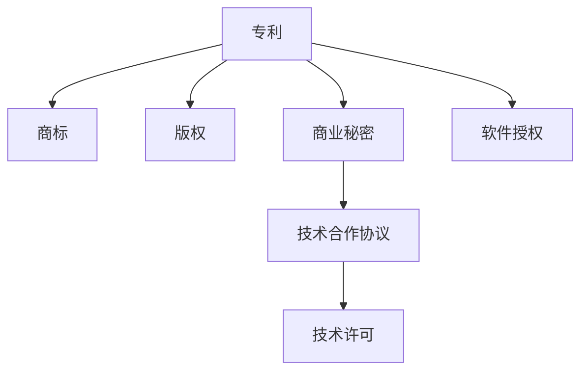

                 

## 1. 背景介绍

### 1.1 问题由来

在当前科技迅猛发展的时代，AI创业公司层出不穷。这些公司往往依托先进的算法和技术，创造出令人瞩目的产品和服务。但随之而来的，是日益严重的知识产权问题。随着市场竞争的加剧，越来越多的AI创业公司开始重视知识产权保护，以保障自己的核心竞争力和市场份额。

AI创业公司常见的知识产权问题包括：

- **专利侵权**：竞争对手可能通过反向工程等方式，非法获取或仿制公司的核心技术。
- **商业秘密泄露**：公司关键的数据、算法和业务模型被竞争对手窃取，给公司带来巨大损失。
- **版权侵犯**：公司使用开源代码时可能未遵守开源协议，或侵犯他人版权。
- **商标侵权**：公司未合理使用他人商标，或通过不正当手段抢注商标。

这些问题不仅会削弱公司的市场竞争力，还可能带来严重的法律风险。因此，AI创业公司必须建立完善的知识产权保护体系，合理运用专利和商业秘密等法律工具，以保障自身利益。

### 1.2 问题核心关键点

AI创业公司进行知识产权保护的核心关键点在于：

- **专利布局**：通过申请专利，将公司的核心技术固化为法律文件，确保公司对关键技术的所有权。
- **商业秘密管理**：通过控制和保护公司核心机密，防止商业秘密被泄露。
- **版权保护**：合理使用开源代码，遵守版权协议，避免侵犯他人版权。
- **商标保护**：合理使用商标，避免商标侵权和抢注。

这些关键点构成了一个完整的知识产权保护框架，有助于AI创业公司防范各类知识产权风险。

## 2. 核心概念与联系

### 2.1 核心概念概述

为更好地理解AI创业公司的知识产权保护，本节将介绍几个密切相关的核心概念：

- **专利（Patent）**：法律上给予发明人对其发明的一种独占权。授予专利的发明通常具有一定的创新性和实用性，能够在一定期限内阻止他人未经授权的商业利用。
- **商标（Trademark）**：用于区分企业产品或服务的标志，如文字、图形、声音等。商标具有区分商品来源和保证商品质量的功能。
- **版权（Copyright）**：保护文学、艺术、音乐等原创作品的知识产权。版权通常授予作者对其作品的所有权，包括复制、发行、公开表演等权利。
- **商业秘密（Trade Secret）**：指不为公众所知、能为公司带来经济利益的机密信息，如商业计划、技术配方、客户名单等。商业秘密的保护需要严格保密措施。
- **技术合作协议（Technology Licensing Agreement）**：指公司与他人就特定技术的使用权进行的合同约定。协议通常包含授权范围、使用费、保密条款等。

这些概念之间的逻辑关系可以通过以下Mermaid流程图来展示：



这个流程图展示了这个核心概念之间的联系和转换：

1. 专利、商标、版权和商业秘密都是知识产权保护的重要形式，各自具有不同的法律依据和保护范围。
2. 专利和商业秘密可以转化为技术合作协议和软件授权，通过许可或授权的方式实现技术共享和商业化。
3. 软件授权是指通过软件许可协议将软件的复制权和发行权转让给他人，以获取经济利益。

## 3. 核心算法原理 & 具体操作步骤
### 3.1 算法原理概述

AI创业公司的知识产权保护，主要是通过申请专利和保护商业秘密来实现的。其核心算法原理包括：

- **专利申请**：根据发明的具体内容，撰写专利申请文件，并通过国家专利局的审查流程，获得专利权。
- **商业秘密保护**：通过严格控制机密信息的传播和使用，防止商业秘密泄露。

### 3.2 算法步骤详解

#### 3.2.1 专利申请

专利申请的基本步骤包括：

1. **需求评估**：评估公司的技术发明，确定是否具有专利性，以及是否值得申请专利。
2. **撰写申请文件**：根据专利法的要求，撰写专利说明书、权利要求书和摘要。
3. **提交申请**：向国家专利局提交专利申请，缴纳相关费用。
4. **审查过程**：国家专利局对申请文件进行形式审查和实质审查。
5. **授权发布**：如果申请通过审查，国家专利局会授予专利权，并发布专利公告。

#### 3.2.2 商业秘密保护

商业秘密保护的步骤包括：

1. **识别机密信息**：识别公司内部的商业秘密，如技术方案、客户资料、市场计划等。
2. **制定保密政策**：制定严格的数据访问和使用政策，限制非授权人员的访问权限。
3. **签署保密协议**：与关键员工、合作伙伴等签署保密协议，要求他们对公司机密信息保密。
4. **控制信息流**：通过技术手段（如访问控制、加密存储等）控制机密信息的传播和使用。
5. **监测和审查**：定期审查员工和合作伙伴的行动，监测信息泄露风险。

### 3.3 算法优缺点

#### 3.3.1 专利申请的优缺点

**优点**：

- **法律保护**：专利是受法律保护的知识产权，具有排他性和独占性。
- **市场优势**：专利可以用于对抗竞争对手的侵权行为，保护公司市场份额。
- **技术固化**：专利将公司的核心技术固定下来，防止技术泄露。

**缺点**：

- **申请复杂**：申请专利需要撰写详细的技术文档，且审查流程较长，申请费用较高。
- **时效性限制**：专利保护期有限，通常为20年。
- **费用高昂**：专利申请和维护费用较高，对小公司来说可能是一个负担。

#### 3.3.2 商业秘密保护的优缺点

**优点**：

- **灵活性**：商业秘密的保护期限不受法律限制，可以长期保密。
- **成本低**：相比专利申请，商业秘密保护不需要高额的申请费用。
- **信息控制**：公司能够严格控制机密信息的传播和使用，防止泄露。

**缺点**：

- **依赖保密措施**：保护商业秘密需要依赖严格的保密措施，一旦泄露，难以追回。
- **法律保护有限**：商业秘密受法律保护的程度不如专利，一旦泄露，可能面临市场竞争压力。
- **风险高**：商业秘密的保护依赖于员工和合作伙伴的诚信，一旦内部人员泄露，可能导致公司损失巨大。

### 3.4 算法应用领域

基于专利和商业秘密保护的算法，在AI创业公司中具有广泛的应用：

- **专利申请**：适用于技术创新型公司，如AI算法、机器学习模型等。
- **商业秘密保护**：适用于依赖商业智慧和市场经验的公司，如数据分析、市场策略等。
- **技术合作协议**：适用于寻求技术合作的公司，如共享AI技术、数据集成等。
- **软件授权**：适用于提供软件产品或服务的公司，如SaaS平台、软件即服务(SaaS)等。

这些算法在AI创业公司的各个领域都有重要应用，帮助公司建立强大的知识产权壁垒。

## 4. 数学模型和公式 & 详细讲解  
### 4.1 数学模型构建

在专利和商业秘密保护的数学模型中，主要涉及以下概念：

- **专利申请模型**：专利申请的数学模型通常包括以下变量：
  - $N$：申请的专利数量
  - $C$：申请成功的专利数量
  - $T$：专利申请的平均时间
  - $F$：专利申请的费用

- **商业秘密保护模型**：商业秘密保护的数学模型通常包括以下变量：
  - $N$：识别的商业秘密数量
  - $C$：商业秘密泄露数量
  - $T$：商业秘密泄露时间
  - $F$：保护商业秘密的费用

### 4.2 公式推导过程

#### 4.2.1 专利申请的数学模型

假设专利申请成功的概率为 $p$，平均申请时间为 $T$，申请费用为 $F$，则专利申请的概率分布函数为：

$$ P(N) = (1-p)^N $$

其中，$N$ 为申请的专利数量，$C$ 为申请成功的专利数量。根据概率论中的期望公式，可以推导出专利申请的期望时间和成本：

$$ \mathbb{E}[T] = \sum_{n=1}^{\infty} n P(N=n) = \frac{p}{1-p} $$
$$ \mathbb{E}[F] = \sum_{n=1}^{\infty} n P(N=n) F = T \frac{p F}{1-p} $$

#### 4.2.2 商业秘密保护的数学模型

假设商业秘密泄露的概率为 $p$，泄露时间为 $T$，保护费用为 $F$，则商业秘密泄露的概率分布函数为：

$$ P(C) = (1-p)^C $$

其中，$N$ 为识别的商业秘密数量，$C$ 为泄露的商业秘密数量。根据概率论中的期望公式，可以推导出商业秘密泄露的期望时间和成本：

$$ \mathbb{E}[T] = \sum_{n=1}^{\infty} n P(C=n) = \frac{p}{1-p} $$
$$ \mathbb{E}[F] = \sum_{n=1}^{\infty} n P(C=n) F = T \frac{p F}{1-p} $$

### 4.3 案例分析与讲解

#### 4.3.1 专利申请案例

某AI创业公司需要申请一项机器学习算法专利，假设申请成功的概率为0.8，平均申请时间为6个月，费用为5000美元。则公司申请专利的期望时间和费用如下：

$$ \mathbb{E}[T] = \frac{0.8}{1-0.8} = 4 \text{个月} $$
$$ \mathbb{E}[F] = 4 \times \frac{0.8 \times 5000}{1-0.8} = 16000 \text{美元} $$

#### 4.3.2 商业秘密保护案例

某AI创业公司需要保护其核心算法和客户数据，假设泄露的概率为0.1，泄露时间为6个月，保护费用为2000美元。则公司保护商业秘密的期望时间和费用如下：

$$ \mathbb{E}[T] = \frac{0.1}{1-0.1} = 0.9 \text{个月} $$
$$ \mathbb{E}[F] = 0.9 \times \frac{0.1 \times 2000}{1-0.1} = 180 \text{美元} $$

通过这些案例，可以看出专利申请和商业秘密保护在成本和时间的差异，需要根据公司的具体情况选择合适的知识产权保护方式。

## 5. 项目实践：代码实例和详细解释说明
### 5.1 开发环境搭建

在进行专利和商业秘密保护的代码实践前，我们需要准备好开发环境。以下是使用Python进行代码实现的开发环境配置流程：

1. **安装Python**：
   - 从官网下载并安装Python，建议使用Python 3.6或更高版本。
   - 确保开发环境中有Python解释器。

2. **安装必要的Python库**：
   - 安装Flask框架：`pip install flask`
   - 安装SQLite数据库：`pip install pysqlite3`
   - 安装PyMySQL库：`pip install pymysql`

3. **安装Web服务器**：
   - 安装Apache服务器：`sudo apt-get install apache2`
   - 配置Apache服务器：`sudo nano /etc/apache2/sites-available/000-default`

4. **配置数据库连接**：
   - 在Apache配置文件中，添加以下内容：
     ```
     ProxyPass /api/ /home/user/server.py
     ```
   - 启动Apache服务器：`sudo service apache2 start`

### 5.2 源代码详细实现

以下是使用Flask框架实现专利和商业秘密保护管理的Python代码：

```python
from flask import Flask, request, jsonify
import sqlite3

app = Flask(__name__)

# 创建数据库连接
conn = sqlite3.connect('patent_secret.db')
cursor = conn.cursor()

# 创建专利表
cursor.execute('''CREATE TABLE patents
                 (id INTEGER PRIMARY KEY AUTOINCREMENT,
                 title TEXT NOT NULL,
                 description TEXT NOT NULL,
                 date TEXT NOT NULL)''')

# 创建商业秘密表
cursor.execute('''CREATE TABLE secrets
                 (id INTEGER PRIMARY KEY AUTOINCREMENT,
                 name TEXT NOT NULL,
                 description TEXT NOT NULL,
                 date TEXT NOT NULL)''')

@app.route('/patent', methods=['POST'])
def add_patent():
    title = request.json['title']
    description = request.json['description']
    date = request.json['date']
    cursor.execute('INSERT INTO patents (title, description, date) VALUES (?, ?, ?)', (title, description, date))
    conn.commit()
    return jsonify({'message': 'Patent added successfully'})

@app.route('/secret', methods=['POST'])
def add_secret():
    name = request.json['name']
    description = request.json['description']
    date = request.json['date']
    cursor.execute('INSERT INTO secrets (name, description, date) VALUES (?, ?, ?)', (name, description, date))
    conn.commit()
    return jsonify({'message': 'Secret added successfully'})

@app.route('/patent', methods=['GET'])
def get_patents():
    cursor.execute('SELECT * FROM patents')
    patents = cursor.fetchall()
    return jsonify(patents)

@app.route('/secret', methods=['GET'])
def get_secrets():
    cursor.execute('SELECT * FROM secrets')
    secrets = cursor.fetchall()
    return jsonify(secrets)

if __name__ == '__main__':
    app.run(debug=True)
```

### 5.3 代码解读与分析

这个代码实现了基本的专利和商业秘密管理功能：

- **添加专利**：通过POST请求向服务器发送专利信息，包括标题、描述和申请日期，服务器将信息插入到`patents`表中。
- **添加商业秘密**：通过POST请求向服务器发送商业秘密信息，包括名称、描述和日期，服务器将信息插入到`secrets`表中。
- **获取专利**：通过GET请求获取所有专利信息，服务器返回`patents`表中的所有记录。
- **获取商业秘密**：通过GET请求获取所有商业秘密信息，服务器返回`secrets`表中的所有记录。

通过这些接口，AI创业公司可以方便地管理和维护其知识产权数据。

### 5.4 运行结果展示

当运行以上代码并访问Web服务器时，可以通过浏览器查看添加和获取的专利和商业秘密信息。例如，通过POST请求添加一条专利信息：

```
POST /patent
Content-Type: application/json

{
    "title": "机器学习算法",
    "description": "一种用于图像分类的机器学习算法",
    "date": "2022-05-01"
}
```

服务器将返回一个JSON格式的响应，表示专利信息已成功添加。通过GET请求获取所有专利信息：

```
GET /patent
```

服务器将返回一个JSON格式的响应，包含所有专利的ID、标题、描述和申请日期。

## 6. 实际应用场景
### 6.1 智能客服系统

智能客服系统需要处理大量的客户咨询，其中涉及大量技术细节和业务逻辑。为保护公司的商业秘密，可以采用商业秘密保护的方式，对系统内部的算法和数据进行严格控制。

在实现智能客服系统的过程中，需要记录客户的咨询记录和客服的响应内容，将这些数据视为商业秘密，并通过数据库加密存储。对于系统内部的算法模型，也可以采用严格的访问控制，确保只有授权人员才能访问和修改。

### 6.2 金融数据分析平台

金融数据分析平台需要处理大量的金融数据和市场信息，这些数据对公司来说具有重要的商业价值。因此，平台需要对数据进行严格的商业秘密保护。

在数据处理和分析过程中，需要对数据进行加密存储，限制数据访问权限，并对敏感操作进行日志记录和审计。通过这些措施，可以有效防止商业秘密泄露，保护公司的市场竞争优势。

### 6.3 自动驾驶技术

自动驾驶技术是AI创业公司的核心竞争力之一。为保护公司的核心技术，可以采用专利保护的方式，将关键技术申请专利。

在技术开发和测试过程中，需要对关键算法和技术参数进行保密，确保只有公司内部人员可以访问和修改。同时，可以通过专利申请，将公司的核心技术固化为法律文件，防止竞争对手的仿制和侵权。

## 7. 工具和资源推荐
### 7.1 学习资源推荐

为了帮助开发者系统掌握知识产权保护的理论基础和实践技巧，这里推荐一些优质的学习资源：

1. **《专利法》和《商标法》**：国家知识产权局官方网站提供了最新的专利法和商标法法规，是学习专利和商标保护的重要基础。
2. **《商业秘密保护》一书**：详细介绍了商业秘密的定义、保护措施和法律责任，是商业秘密管理的权威参考资料。
3. **Coursera上的《知识产权法》课程**：由斯坦福大学法学院教授讲授，涵盖了专利、商标、版权和商业秘密等知识产权保护的重要内容。
4. **Udemy上的《商业秘密保护》课程**：实用性强，适合快速掌握商业秘密保护的基本知识和操作技巧。
5. **Intellectual Property Law Blog**：定期更新知识产权保护的最新动态和案例分析，是专业人士学习的重要资源。

通过对这些资源的学习实践，相信你一定能够快速掌握知识产权保护的理论基础和实践技巧，并用于解决实际的知识产权问题。

### 7.2 开发工具推荐

高效的开发离不开优秀的工具支持。以下是几款用于知识产权保护开发的常用工具：

1. **JIRA**：项目管理工具，可以帮助公司进行专利申请和商业秘密管理的任务分配和进度跟踪。
2. **Trello**：任务管理工具，适合团队协作和知识产权保护的流程管理。
3. **Confluence**：文档管理工具，适合记录专利申请文件、商业秘密管理政策和流程文档。
4. **GitLab**：代码管理工具，适合版本控制和代码审查，确保代码的知识产权安全。
5. **Microsoft Word**：文档编辑工具，适合撰写专利申请文件和商业秘密管理协议。

合理利用这些工具，可以显著提升知识产权保护的开发效率，加快创新迭代的步伐。

### 7.3 相关论文推荐

知识产权保护的研究领域涉及法律、技术和管理等多个方面，以下是几篇奠基性的相关论文，推荐阅读：

1. **"专利保护和商业秘密管理"**：介绍了专利和商业秘密保护的基本概念和法律框架。
2. **"人工智能技术知识产权保护"**：讨论了AI技术的发展对知识产权保护的新挑战和应对策略。
3. **"数据驱动的商业秘密管理"**：探讨了数据隐私和商业秘密保护之间的关系和应对措施。
4. **"开源软件和商业秘密保护"**：分析了开源软件在商业秘密保护中的应用和风险。
5. **"知识产权保护的未来发展趋势"**：预测了知识产权保护技术的未来趋势和潜在风险。

这些论文代表了大语言模型微调技术的发展脉络。通过学习这些前沿成果，可以帮助研究者把握学科前进方向，激发更多的创新灵感。

## 8. 总结：未来发展趋势与挑战
### 8.1 总结

本文对AI创业公司的知识产权保护进行了全面系统的介绍。首先阐述了专利和商业秘密保护的研究背景和意义，明确了知识产权保护在保障公司核心竞争力和市场份额方面的重要性。其次，从原理到实践，详细讲解了专利申请和商业秘密保护的基本步骤，给出了代码实例和详细解释说明。同时，本文还广泛探讨了知识产权保护在智能客服、金融数据分析、自动驾驶等实际应用场景中的重要性，展示了知识产权保护范式的广泛应用前景。

通过本文的系统梳理，可以看到，专利和商业秘密保护是AI创业公司知识产权保护体系的重要组成部分，帮助公司在激烈的市场竞争中建立强大的法律壁垒，确保公司长期稳定发展。

### 8.2 未来发展趋势

展望未来，知识产权保护领域将呈现以下几个发展趋势：

1. **全球知识产权保护**：随着国际贸易和科技合作的发展，全球知识产权保护将更加重要。跨国公司需要建立全球化的专利和商业秘密保护体系，保护其在全球市场的知识产权。
2. **AI驱动的知识产权保护**：AI技术可以用于知识产权保护的数据分析和预测，提高知识产权管理的效率和准确性。例如，通过自然语言处理技术，自动化处理专利和商业秘密文档，降低人工成本。
3. **区块链技术在知识产权保护中的应用**：区块链技术可以用于记录专利和商业秘密的流转和变更，提高知识产权管理的透明度和安全性。
4. **数字版权管理和知识共享**：数字版权管理和知识共享是未来知识产权保护的重要方向。通过智能合约和区块链技术，可以实现自动化的版权许可和知识共享。
5. **人工智能与知识产权保护的融合**：AI技术将与知识产权保护深度融合，形成更智能、更高效的知识产权管理模式。例如，通过AI技术预测专利申请的成功率，优化专利申请策略。

这些趋势凸显了知识产权保护技术的广阔前景，为AI创业公司提供了更多的创新和应用机会。

### 8.3 面临的挑战

尽管专利和商业秘密保护技术已经取得了一定的进展，但在迈向更加智能化、普适化应用的过程中，它仍面临诸多挑战：

1. **法律环境的复杂性**：不同国家和地区对知识产权保护的法律规定有所不同，企业在国际化过程中需要应对复杂的法律环境。
2. **技术手段的局限性**：目前的AI技术在专利和商业秘密保护中还存在一些局限性，如对复杂文档的处理能力有限，无法自动化处理所有类型的知识产权。
3. **成本和效率的平衡**：知识产权保护的投入需要平衡成本和效率，过于繁琐的流程和昂贵的技术手段可能会削弱公司的市场竞争力。
4. **隐私和安全的风险**：在AI驱动的知识产权保护中，数据隐私和安全问题尤为突出，需要建立严格的隐私保护和数据安全机制。
5. **知识产权滥用**：一些公司可能通过不正当手段获取或滥用他人的知识产权，对市场公平竞争构成威胁。

这些挑战需要相关各方共同努力，才能找到有效的解决方案，推动知识产权保护技术的持续进步。

### 8.4 研究展望

面对知识产权保护面临的挑战，未来的研究需要在以下几个方面寻求新的突破：

1. **全球知识产权保护框架**：研究建立全球统一的知识产权保护标准，为跨国公司的知识产权管理提供便利。
2. **AI技术在知识产权保护中的应用**：深入研究AI技术在专利申请、商业秘密保护、数据版权管理等领域的应用，提高知识产权管理的效率和准确性。
3. **区块链与知识产权保护的结合**：探索区块链技术在知识产权保护中的新应用，提高知识产权流转和管理的透明度和安全性。
4. **隐私保护与知识产权保护的平衡**：研究如何在保护知识产权的同时，兼顾数据隐私和安全，实现数据的合理使用和共享。
5. **人工智能与知识产权保护的融合**：深入研究AI技术与知识产权保护的理论基础和实际应用，推动人工智能与知识产权保护技术的融合发展。

这些研究方向的探索，必将引领知识产权保护技术迈向更高的台阶，为AI创业公司提供更智能、更高效、更安全的知识产权保护服务。

## 9. 附录：常见问题与解答

**Q1：如何判断一项技术是否具有专利性？**

A: 根据各国专利法的不同规定，判断一项技术是否具有专利性通常需要考虑以下几个因素：

1. 新颖性：技术方案是否具有新颖性，即是否与现有技术有明显的区别。
2. 创造性：技术方案是否具有创造性，即是否具有非显而易见的技术进步。
3. 实用性：技术方案是否具有实用性，即是否能够被应用于实际生产。

这些因素通常需要通过专利审查和法律评估来确定。

**Q2：商业秘密保护有哪些关键措施？**

A: 商业秘密保护的关键措施包括：

1. 识别商业秘密：明确哪些信息属于商业秘密，包括技术方案、客户数据、业务计划等。
2. 制定保密政策：制定严格的保密政策，限制商业秘密的传播和使用。
3. 签署保密协议：与关键员工、合作伙伴等签署保密协议，要求他们对商业秘密保密。
4. 控制信息流：通过技术手段（如访问控制、加密存储等）控制商业秘密的传播和使用。
5. 监测和审查：定期审查员工和合作伙伴的行动，监测商业秘密泄露风险。

这些措施需要企业在实际应用中严格执行，才能确保商业秘密的安全。

**Q3：专利申请的周期和费用是多少？**

A: 专利申请的周期和费用因国家/地区而异。一般来说，专利申请周期较长，通常需要1-3年才能获得授权。专利申请费用也因国家/地区而异，一般包括申请费、审查费、专利维持费等，费用较高，对小公司来说可能是一个负担。

**Q4：如何应对专利侵权？**

A: 应对专利侵权的方法包括：

1. 起诉侵权行为：向法院起诉侵权行为，要求停止侵权、赔偿损失等。
2. 和解谈判：与侵权方进行谈判，达成和解协议，避免法律诉讼。
3. 申请禁令：向法院申请禁令，阻止侵权行为的发生。

在应对专利侵权时，需要根据具体情况选择合适的法律手段，以维护公司的合法权益。

**Q5：商业秘密泄露后如何应对？**

A: 商业秘密泄露后，可以采取以下应对措施：

1. 立即评估泄露影响：评估泄露对公司业务的影响，采取紧急措施，防止进一步泄露。
2. 法律追责：追究泄露方和侵权方的法律责任，要求其赔偿损失。
3. 内部审查：对内部管理进行审查，找出泄露原因，并采取改进措施。
4. 信息保护：加强商业秘密的保护措施，防止类似事件再次发生。

这些措施需要企业在泄露事件发生后迅速采取，以最大程度地降低损失。

---

作者：禅与计算机程序设计艺术 / Zen and the Art of Computer Programming

