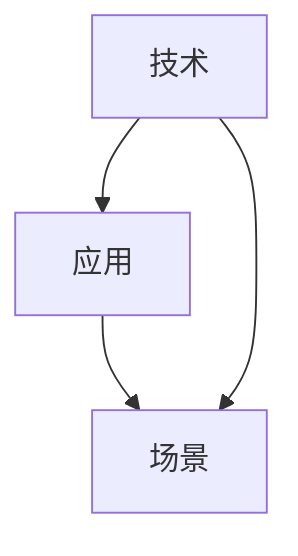

                 

# AI创业挑战：技术，应用与场景平衡

在人工智能（AI）领域，创业公司的崛起无疑是近年来最令人瞩目的现象之一。从机器学习初创企业到AI大模型公司，无数企业在短短几年内取得了令人瞩目的成绩。然而，成功的背后离不开技术、应用与场景三者的深度融合，以及创业者在这三者之间的精准平衡。本文将深入探讨这一话题，剖析AI创业中面临的技术挑战、应用瓶颈以及如何在特定的场景中实现技术的落地应用。

## 1. 背景介绍

随着AI技术的不断进步，AI初创公司如雨后春笋般涌现，各个领域的应用也日益增多。然而，尽管AI技术在理论和算法上取得了突破，但在实际应用中仍面临着诸多挑战。这些问题包括但不限于模型复杂度、计算资源消耗、数据隐私、伦理和法律问题等。此外，AI技术的落地还需要考虑其应用场景的独特性，如用户习惯、商业模式、法规政策等因素。

### 1.1 问题由来

当前AI创业公司面临的主要问题包括：

- **技术挑战**：模型训练和调优成本高，且需要大量数据和计算资源。
- **应用瓶颈**：产品难以满足特定场景下的用户需求，用户体验不佳。
- **场景限制**：AI应用需要适配不同的市场和行业，个性化需求难以满足。

这些问题的存在使得AI创业公司在技术、应用和场景之间需要寻求平衡，从而实现商业成功。

## 2. 核心概念与联系

在讨论AI创业的挑战之前，有必要先理解一些核心概念及其相互联系。

### 2.1 核心概念概述

- **技术**：指实现AI应用的核心算法和模型，包括机器学习、深度学习、自然语言处理等技术。
- **应用**：指AI技术在实际业务场景中的应用，如推荐系统、智能客服、金融风险控制等。
- **场景**：指AI应用的具体环境和背景，包括用户需求、市场环境、法规政策等。

这三大概念之间相互关联，技术是基础，应用是手段，场景是目标。只有在正确的场景下，技术才能发挥出最大的价值，而应用则需要技术的支撑才能实现。

### 2.2 核心概念原理和架构的 Mermaid 流程图



这个简单的流程图展示了技术、应用和场景之间的联系。技术是基础，通过应用转化为具体功能，最终服务于场景。

## 3. 核心算法原理 & 具体操作步骤
### 3.1 算法原理概述

在AI创业中，技术是实现应用和满足场景需求的基础。因此，理解AI核心算法原理是至关重要的。

AI创业中的核心算法通常包括但不限于：

- **机器学习**：包括监督学习、无监督学习和半监督学习，用于训练和优化模型。
- **深度学习**：尤其是卷积神经网络（CNN）和循环神经网络（RNN），用于处理图像和序列数据。
- **自然语言处理（NLP）**：包括语言模型、文本分类、情感分析等，用于处理和理解人类语言。

这些算法原理构成了AI创业的基础，是实现应用的核心。

### 3.2 算法步骤详解

在实际应用中，AI算法的操作步骤通常包括数据预处理、模型训练、模型调优和模型部署。

**数据预处理**：包括数据清洗、特征提取、数据增强等步骤，以确保输入数据的质量和多样性。

**模型训练**：使用准备好的数据集训练模型，优化模型的参数和超参数。

**模型调优**：通过验证集或测试集评估模型性能，调整模型结构和参数，以提升模型效果。

**模型部署**：将训练好的模型部署到实际应用环境中，并进行实时推理和预测。

### 3.3 算法优缺点

AI算法的优缺点如下：

**优点**：

- **高精度**：在特定任务上，AI算法通常能够提供比传统方法更高的精度。
- **可扩展性**：AI算法可以处理大规模数据，适用于各种规模的企业和应用场景。
- **自动化**：AI算法能够自动化处理和分析数据，减少人工干预。

**缺点**：

- **复杂度**：AI算法模型通常较为复杂，需要大量数据和计算资源进行训练。
- **过拟合**：在没有足够数据的情况下，AI模型容易出现过拟合现象。
- **可解释性**：许多AI算法缺乏可解释性，导致用户难以理解模型的决策过程。

### 3.4 算法应用领域

AI算法在多个领域都有广泛应用，例如金融、医疗、零售、物流、智能家居等。

- **金融**：用于风险评估、欺诈检测、算法交易等。
- **医疗**：用于医学影像分析、基因组学、药物发现等。
- **零售**：用于个性化推荐、库存管理、销售预测等。
- **物流**：用于路线规划、智能仓储、配送调度等。
- **智能家居**：用于语音识别、智能控制、家庭安防等。

## 4. 数学模型和公式 & 详细讲解 & 举例说明

在AI创业中，数学模型和公式的理解是实现技术落地的关键。

### 4.1 数学模型构建

AI模型的构建通常包括以下步骤：

1. **选择模型架构**：如CNN、RNN、Transformer等。
2. **设计损失函数**：如均方误差、交叉熵、对数似然等。
3. **选择优化器**：如Adam、SGD等。
4. **选择正则化技术**：如L1正则、Dropout等。

### 4.2 公式推导过程

以线性回归为例，其公式推导过程如下：

**目标函数**：

$$
\min_{\theta} \sum_{i=1}^N (y_i - \hat{y}_i)^2
$$

其中，$\theta$为模型参数，$y_i$为真实值，$\hat{y}_i$为模型预测值。

**梯度下降公式**：

$$
\theta \leftarrow \theta - \alpha \frac{\partial J}{\partial \theta}
$$

其中，$\alpha$为学习率，$\frac{\partial J}{\partial \theta}$为损失函数对参数$\theta$的梯度。

### 4.3 案例分析与讲解

以推荐系统为例，推荐系统的核心目标是预测用户对每个物品的评分。模型通常采用深度学习模型，如FM、GBDT等。其公式推导如下：

**目标函数**：

$$
\min_{\theta} \sum_{i=1}^N (y_i - \hat{y}_i)^2
$$

其中，$y_i$为用户对物品的评分，$\hat{y}_i$为模型的预测评分。

**梯度下降公式**：

$$
\theta \leftarrow \theta - \alpha \frac{\partial J}{\partial \theta}
$$

其中，$\alpha$为学习率，$\frac{\partial J}{\partial \theta}$为损失函数对参数$\theta$的梯度。

## 5. 项目实践：代码实例和详细解释说明

### 5.1 开发环境搭建

在AI创业中，选择合适的开发环境是成功的第一步。以下是Python开发环境搭建的具体步骤：

1. **安装Python**：从官网下载并安装Python 3.8。
2. **安装虚拟环境**：使用conda或virtualenv创建虚拟环境。
3. **安装必要的库**：如TensorFlow、Keras、PyTorch等。

### 5.2 源代码详细实现

以图像分类为例，展示代码实现过程。

```python
import tensorflow as tf
from tensorflow.keras.datasets import mnist
from tensorflow.keras.models import Sequential
from tensorflow.keras.layers import Dense, Flatten

# 加载数据集
(x_train, y_train), (x_test, y_test) = mnist.load_data()

# 数据预处理
x_train = x_train / 255.0
x_test = x_test / 255.0

# 构建模型
model = Sequential()
model.add(Flatten(input_shape=(28, 28)))
model.add(Dense(128, activation='relu'))
model.add(Dense(10, activation='softmax'))

# 编译模型
model.compile(optimizer='adam', loss='sparse_categorical_crossentropy', metrics=['accuracy'])

# 训练模型
model.fit(x_train, y_train, epochs=10, validation_data=(x_test, y_test))

# 评估模型
model.evaluate(x_test, y_test)
```

### 5.3 代码解读与分析

上述代码展示了使用TensorFlow进行图像分类的过程。首先，加载MNIST数据集并进行预处理。然后，构建一个简单的全连接神经网络模型，包含一个Flatten层和一个Dense层。最后，编译模型并进行训练和评估。

## 6. 实际应用场景

### 6.1 智能客服系统

智能客服系统是AI在客服领域的应用之一。其核心目标是自动化处理用户咨询，提高客服效率和用户满意度。

**技术**：

- **自然语言处理**：用于理解用户意图和回复生成。
- **机器学习**：用于意图分类和知识图谱构建。
- **深度学习**：用于对话生成和对话管理。

**应用**：

- **自动化咨询**：用户可以通过语音或文字进行咨询，系统自动回复常见问题。
- **个性化服务**：根据用户历史数据，提供个性化推荐和问题解答。
- **知识库管理**：构建知识图谱，动态更新答案库。

**场景**：

- **电商**：为用户提供24小时不间断的购物咨询。
- **金融**：处理客户投诉和风险评估。
- **电信**：解决用户的网络和套餐问题。

### 6.2 金融风险控制

金融风险控制是AI在金融领域的应用之一。其核心目标是识别和控制潜在的金融风险，保护用户资产安全。

**技术**：

- **机器学习**：用于风险评估和欺诈检测。
- **深度学习**：用于时间序列分析和预测。
- **自然语言处理**：用于情感分析和舆情监测。

**应用**：

- **风险评估**：通过分析用户交易行为和历史数据，预测未来风险。
- **欺诈检测**：实时监控交易行为，识别可疑交易。
- **舆情监测**：监控金融市场动态，分析市场情绪。

**场景**：

- **银行**：用户账户管理和交易监控。
- **保险**：理赔申请和风险评估。
- **投资**：投资组合优化和市场预测。

### 6.3 个性化推荐系统

个性化推荐系统是AI在零售领域的应用之一。其核心目标是提高用户满意度和销售额。

**技术**：

- **深度学习**：用于用户行为分析和物品推荐。
- **协同过滤**：用于用户-物品关联和推荐算法。
- **推荐算法**：如基于内容的推荐、基于模型的推荐等。

**应用**：

- **商品推荐**：根据用户浏览和购买历史，推荐相关商品。
- **个性化展示**：通过动态调整页面展示，提升用户购买意愿。
- **库存管理**：优化库存，减少浪费。

**场景**：

- **电商**：提高用户购物体验和转化率。
- **视频平台**：推荐用户感兴趣的影片和节目。
- **图书**：推荐用户感兴趣的书籍和文章。

## 7. 工具和资源推荐

### 7.1 学习资源推荐

1. **深度学习框架**：如TensorFlow、PyTorch、Keras等。
2. **自然语言处理工具**：如NLTK、spaCy、Gensim等。
3. **数据集**：如Kaggle、UCI机器学习库等。
4. **在线课程**：如Coursera、edX、Udacity等。

### 7.2 开发工具推荐

1. **IDE**：如PyCharm、Jupyter Notebook等。
2. **数据管理工具**：如Databricks、DataRobot等。
3. **云计算平台**：如AWS、Google Cloud、Azure等。
4. **版本控制工具**：如Git、GitHub等。

### 7.3 相关论文推荐

1. **深度学习**：《Deep Learning》，Ian Goodfellow、Yoshua Bengio、Aaron Courville著。
2. **自然语言处理**：《Speech and Language Processing》，Daniel Jurafsky、James H. Martin著。
3. **推荐系统**：《Recommender Systems》，Lichuan Zhou著。

## 8. 总结：未来发展趋势与挑战

### 8.1 研究成果总结

AI创业在技术、应用和场景方面取得了诸多突破，但也面临着诸多挑战。技术的发展离不开算力和数据的支持，应用的实现需要关注用户体验和业务需求，场景的落地需要考虑法规和市场因素。

### 8.2 未来发展趋势

1. **AI技术普及**：随着AI技术的成熟和普及，更多的中小型公司将加入AI创业的行列。
2. **多模态融合**：AI技术将与其他技术（如物联网、5G）结合，形成多模态融合的智能解决方案。
3. **自动化和智能化**：AI系统将更加自动化和智能化，减少人工干预，提高效率。
4. **个性化和定制化**：AI将更加注重个性化和定制化，满足不同用户需求。

### 8.3 面临的挑战

1. **数据隐私和安全**：用户数据的隐私和安全问题亟待解决。
2. **法规和政策**：不同国家和地区对AI应用的法规和政策存在差异，需高度关注。
3. **技术复杂度**：AI技术复杂度较高，对开发人员要求较高。
4. **用户体验**：如何提供良好的用户体验，还需不断探索和优化。

### 8.4 研究展望

未来，AI创业将在技术、应用和场景方面持续探索和突破。

1. **技术**：进一步提升AI算法的精度和效率，降低开发成本。
2. **应用**：深入挖掘AI技术在各行业的应用潜力，提供更多创新的解决方案。
3. **场景**：积极探索AI技术在垂直行业的落地应用，实现商业成功。

## 9. 附录：常见问题与解答

**Q1：AI创业中如何选择合适的技术？**

A: 应根据业务需求和技术成熟度选择技术。例如，对于自然语言处理任务，可以选择预训练模型进行微调，而图像识别任务则可以选择深度学习模型进行训练。

**Q2：AI应用在落地时如何处理数据隐私和安全问题？**

A: 可以采用数据匿名化、加密技术、联邦学习等方法，确保数据隐私和安全。

**Q3：AI应用如何适应不同的法规和政策？**

A: 需要了解不同国家和地区的法规和政策，确保AI应用的合法合规。

**Q4：AI应用的开发过程中需要注意哪些关键点？**

A: 需要注意数据质量、模型选择、算法调优、系统架构等方面，确保AI应用的稳定性和可靠性。

**Q5：如何提升AI应用的性能和效率？**

A: 可以采用模型压缩、分布式训练、混合精度训练等方法，提升AI应用的性能和效率。

---

作者：禅与计算机程序设计艺术 / Zen and the Art of Computer Programming

