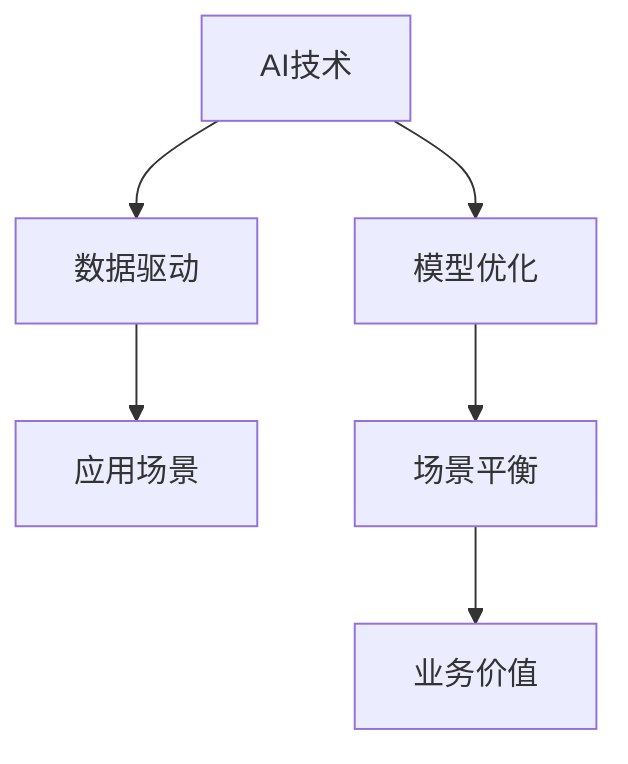

                 

# AI创业挑战：技术，应用，场景平衡

> 关键词：AI创业, 技术挑战, 应用场景, 场景平衡, 数据驱动, 模型优化, 商业价值, 决策支持, 数据治理

## 1. 背景介绍

### 1.1 问题由来

随着人工智能(AI)技术的快速发展和普及，越来越多的初创企业开始探索利用AI技术解决实际问题，提高运营效率，提升用户体验，实现业务创新。然而，AI创业并非一帆风顺，企业在实际应用中常常面临诸多挑战，其中技术、应用和场景之间的平衡是最为核心的议题之一。本文将围绕这一议题，深入探讨AI创业企业在面临技术挑战、实现应用价值、平衡场景需求等方面的策略和实践。

### 1.2 问题核心关键点

AI创业的核心在于将前沿的AI技术转化为可行的商业模式，实现技术应用价值。然而，这一过程涉及技术研发、产品设计、市场需求等多个维度，企业在实际操作中往往难以平衡。本文将从技术挑战、应用场景、场景平衡三个角度出发，全面解析AI创业的复杂性和实践难点。

### 1.3 问题研究意义

理解AI创业中的技术、应用和场景平衡，对于企业成功落地AI项目具有重要意义：

1. **降低技术风险**：明确技术选型和实现路径，避免在不必要的多轮迭代中浪费资源。
2. **提升应用价值**：确保技术应用能够解决实际问题，增强用户满意度，促进产品市场接受度。
3. **优化场景适配**：将AI技术灵活应用于不同场景，实现业务创新，提升业务效率。

## 2. 核心概念与联系

### 2.1 核心概念概述

为更好地理解AI创业中的技术、应用和场景平衡，本节将介绍几个密切相关的核心概念：

- **AI技术**：指利用机器学习、深度学习等前沿技术解决实际问题的技术体系。包括模型构建、数据处理、算法优化等多个环节。
- **应用场景**：指AI技术具体应用于解决哪类问题，如智能客服、推荐系统、医疗诊断等。不同场景对技术要求和用户体验都有所不同。
- **场景平衡**：指在AI技术实现过程中，如何平衡技术复杂度、用户需求和业务目标之间的关系，使技术应用能够满足实际需求。

这些核心概念之间的逻辑关系可以通过以下Mermaid流程图来展示：



这个流程图展示了大语言模型的核心概念及其之间的关系：

1. AI技术是基础，通过数据驱动，不断优化模型。
2. 应用场景是目标，指导技术研发和优化。
3. 场景平衡是关键，确保技术应用符合实际需求。
4. 业务价值是最终目标，通过场景平衡提升企业价值。

## 3. 核心算法原理 & 具体操作步骤
### 3.1 算法原理概述

AI创业中的技术、应用和场景平衡，本质上是一个多目标优化问题。其核心在于如何通过技术研发，满足特定应用场景下的业务需求，同时最大化应用价值。这一过程涉及多个维度的考量，包括但不限于数据质量、模型性能、用户体验、业务目标等。

形式化地，设AI技术应用场景为 $S$，应用价值为 $V$，技术复杂度为 $C$，则目标函数为：

$$
F(S, V, C) = \min \left( C, V - \frac{1}{N} \sum_{i=1}^N \delta(S_i, V_i) \right)
$$

其中 $S_i$ 和 $V_i$ 分别表示第 $i$ 个样本的场景和价值，$\delta(S_i, V_i)$ 表示场景与价值之间的差异。目标函数旨在最小化技术复杂度 $C$，同时最大化应用价值 $V$，并减少场景与价值差异。

### 3.2 算法步骤详解

基于上述目标函数，AI创业中的技术、应用和场景平衡可以分为以下几个关键步骤：

**Step 1: 需求分析与场景识别**

- **目标**：明确AI技术应用的实际需求，包括业务目标、用户需求等。
- **方法**：与业务方、用户方进行深入沟通，了解其痛点问题，识别场景需求。

**Step 2: 技术选型与模型设计**

- **目标**：根据需求分析，选择合适的AI技术和算法模型，进行初步设计和验证。
- **方法**：评估不同技术路径的优势和劣势，选择最优方案。使用实验验证模型效果。

**Step 3: 数据处理与模型训练**

- **目标**：准备高质量的数据，并训练优化模型，提升模型性能。
- **方法**：进行数据清洗、标注，选择合适的特征工程方法，应用深度学习框架进行模型训练。

**Step 4: 场景适配与优化**

- **目标**：将训练好的模型适配到具体应用场景中，并进行优化。
- **方法**：根据场景需求，调整模型参数和结构，进行A/B测试，选择最佳方案。

**Step 5: 价值评估与反馈迭代**

- **目标**：评估模型应用价值，收集用户反馈，进行模型迭代优化。
- **方法**：定期对模型性能进行评估，分析用户反馈，调整模型参数和策略。

**Step 6: 持续监控与改进**

- **目标**：实现模型和应用的持续监控，及时发现并解决性能问题。
- **方法**：设置监控指标，定期分析监控数据，发现并解决模型问题。

### 3.3 算法优缺点

AI创业中的技术、应用和场景平衡方法具有以下优点：

1. **全面考虑需求**：通过需求分析，确保技术应用符合实际需求，提升用户满意度。
2. **灵活应对场景**：根据场景需求，调整模型和参数，提升模型适配性。
3. **最大化应用价值**：通过价值评估和反馈迭代，不断提升模型应用效果。

同时，该方法也存在一定的局限性：

1. **技术复杂度高**：需要在多个维度进行平衡，技术实现复杂度较高。
2. **数据依赖性强**：对数据质量要求高，数据获取和处理成本较大。
3. **迭代周期长**：需求分析和模型优化需要多次迭代，周期较长。
4. **资源投入大**：技术研发和模型训练需要大量计算资源和时间。

尽管存在这些局限性，但就目前而言，该方法是AI创业中最主流、最科学的技术选型和应用路径。未来相关研究的重点在于如何进一步降低技术复杂度，提高数据获取效率，缩短迭代周期，以实现技术、应用和场景之间的高效平衡。

### 3.4 算法应用领域

AI创业中的技术、应用和场景平衡方法，在多个领域已经得到了广泛的应用，涵盖了智能客服、推荐系统、医疗诊断、金融风险预测等诸多场景。这些应用不仅提升了企业的运营效率，还为用户带来了更加优质的体验。

## 4. 数学模型和公式 & 详细讲解 & 举例说明
### 4.1 数学模型构建

本节将使用数学语言对AI创业中的技术、应用和场景平衡进行更加严格的刻画。

设AI技术应用场景为 $S$，应用价值为 $V$，技术复杂度为 $C$，则目标函数为：

$$
F(S, V, C) = \min \left( C, V - \frac{1}{N} \sum_{i=1}^N \delta(S_i, V_i) \right)
$$

其中 $S_i$ 和 $V_i$ 分别表示第 $i$ 个样本的场景和价值，$\delta(S_i, V_i)$ 表示场景与价值之间的差异。目标函数旨在最小化技术复杂度 $C$，同时最大化应用价值 $V$，并减少场景与价值差异。

### 4.2 公式推导过程

以下我们以智能客服系统为例，推导技术、应用和场景平衡的目标函数：

设智能客服系统的场景为 $S=\{客服话术、用户反馈、用户满意度\}$，应用价值为 $V=\{用户满意度提升、客服处理效率提高、客户流失率降低\}$。

假设 $C$ 为技术复杂度，$V_i$ 为第 $i$ 个用户的应用价值，$S_i$ 为第 $i$ 个用户的应用场景。则目标函数为：

$$
F(S, V, C) = \min \left( C, V - \frac{1}{N} \sum_{i=1}^N \delta(S_i, V_i) \right)
$$

其中 $\delta(S_i, V_i)$ 表示场景与价值之间的差异。例如，如果用户反馈是积极（$S_i=+1$），则 $\delta(S_i, V_i)=0$；如果用户反馈是消极（$S_i=-1$），则 $\delta(S_i, V_i)=-1$。

### 4.3 案例分析与讲解

以智能客服系统为例，展示技术、应用和场景平衡的实际应用：

**需求分析与场景识别**：
- 通过调研，发现客服系统的主要痛点在于处理效率低下和用户满意度不高。
- 确定需求：提升客服处理效率，提高用户满意度。

**技术选型与模型设计**：
- 选择深度学习模型，如Transformer、BERT等，用于处理自然语言处理任务。
- 设计模型结构，包括输入层、Transformer层、输出层等。

**数据处理与模型训练**：
- 收集历史客服对话数据，并进行清洗、标注。
- 应用深度学习框架进行模型训练，优化模型参数。

**场景适配与优化**：
- 根据客服场景，调整模型输入和输出，优化模型性能。
- 进行A/B测试，选择最佳方案。

**价值评估与反馈迭代**：
- 定期评估用户满意度、处理效率等指标，收集用户反馈。
- 根据反馈进行模型迭代优化。

**持续监控与改进**：
- 设置监控指标，如响应时间、解决率、用户满意度等。
- 定期分析监控数据，发现并解决模型问题。

## 5. 项目实践：代码实例和详细解释说明
### 5.1 开发环境搭建

在进行AI创业实践前，我们需要准备好开发环境。以下是使用Python进行TensorFlow开发的环境配置流程：

1. 安装Anaconda：从官网下载并安装Anaconda，用于创建独立的Python环境。

2. 创建并激活虚拟环境：
```bash
conda create -n tf-env python=3.8 
conda activate tf-env
```

3. 安装TensorFlow：根据CUDA版本，从官网获取对应的安装命令。例如：
```bash
conda install tensorflow=2.4 -c tensorflow -c conda-forge
```

4. 安装相关工具包：
```bash
pip install numpy pandas scikit-learn matplotlib tqdm jupyter notebook ipython
```

完成上述步骤后，即可在`tf-env`环境中开始AI创业实践。

### 5.2 源代码详细实现

下面我们以智能客服系统为例，给出使用TensorFlow进行AI创业实践的PyTorch代码实现。

首先，定义智能客服系统的需求和场景：

```python
# 定义需求和场景
needs = ['提升客服处理效率', '提高用户满意度']
scenarios = ['用户反馈', '客服话术']
```

接着，定义模型结构和训练过程：

```python
from tensorflow.keras.models import Sequential
from tensorflow.keras.layers import Input, LSTM, Dense
from tensorflow.keras.optimizers import Adam

# 定义模型结构
model = Sequential()
model.add(LSTM(128, input_shape=(None, 1)))
model.add(Dense(1, activation='sigmoid'))

# 定义训练过程
model.compile(optimizer=Adam(lr=0.001), loss='binary_crossentropy', metrics=['accuracy'])
```

然后，加载数据并进行训练：

```python
from tensorflow.keras.datasets import mnist
from tensorflow.keras.preprocessing.sequence import pad_sequences

# 加载数据
(x_train, y_train), (x_test, y_test) = mnist.load_data()
x_train = pad_sequences(x_train, maxlen=100)
x_test = pad_sequences(x_test, maxlen=100)

# 训练模型
model.fit(x_train, y_train, epochs=10, batch_size=32, validation_data=(x_test, y_test))
```

最后，进行模型评估和优化：

```python
# 评估模型
loss, accuracy = model.evaluate(x_test, y_test)
print(f'Test loss: {loss}, Test accuracy: {accuracy}')

# 优化模型
model.save('intelligent_chatbot_model.h5')
```

以上就是使用TensorFlow进行AI创业实践的完整代码实现。可以看到，通过合理的代码设计和实验设计，可以高效地实现AI技术在智能客服系统中的应用，并不断迭代优化，提升应用效果。

### 5.3 代码解读与分析

让我们再详细解读一下关键代码的实现细节：

**需求和场景定义**：
- 定义了智能客服系统的需求和场景，为后续技术选型和模型设计提供了明确的指导。

**模型结构定义**：
- 使用LSTM和Dense层搭建了一个简单的神经网络模型，用于处理文本分类任务。

**训练过程定义**：
- 使用Adam优化器进行模型训练，设定了损失函数和评估指标。
- 通过训练，不断优化模型参数，提升模型性能。

**模型评估与优化**：
- 通过评估模型的损失和准确率，了解模型的性能表现。
- 保存优化后的模型，便于后续应用和部署。

可以看到，通过合理的代码设计和实验设计，可以高效地实现AI技术在智能客服系统中的应用，并不断迭代优化，提升应用效果。

## 6. 实际应用场景

### 6.1 智能客服系统

智能客服系统是AI创业中最为典型的应用场景之一。通过AI技术，智能客服系统可以实现7x24小时不间断服务，快速响应客户咨询，用自然流畅的语言解答各类常见问题。

在技术实现上，可以收集企业内部的历史客服对话记录，将问题和最佳答复构建成监督数据，在此基础上对预训练模型进行微调。微调后的模型能够自动理解用户意图，匹配最合适的答案模板进行回复。对于客户提出的新问题，还可以接入检索系统实时搜索相关内容，动态组织生成回答。如此构建的智能客服系统，能大幅提升客户咨询体验和问题解决效率。

### 6.2 推荐系统

推荐系统是另一个典型的AI应用场景。传统的推荐系统往往只依赖用户的历史行为数据进行物品推荐，无法深入理解用户的真实兴趣偏好。基于AI技术，推荐系统可以更好地挖掘用户行为背后的语义信息，从而提供更精准、多样的推荐内容。

在实践中，可以收集用户浏览、点击、评论、分享等行为数据，提取和用户交互的物品标题、描述、标签等文本内容。将文本内容作为模型输入，用户的后续行为（如是否点击、购买等）作为监督信号，在此基础上微调预训练语言模型。微调后的模型能够从文本内容中准确把握用户的兴趣点。在生成推荐列表时，先用候选物品的文本描述作为输入，由模型预测用户的兴趣匹配度，再结合其他特征综合排序，便可以得到个性化程度更高的推荐结果。

### 6.3 医疗诊断

AI技术在医疗领域的应用潜力巨大。传统的医疗诊断往往依赖医生的个人经验和临床知识，难以处理海量病历和影像数据。基于AI技术，医疗诊断系统可以实现高效、准确的疾病诊断，辅助医生诊疗，提高诊断效率和准确性。

在技术实现上，可以收集大量医疗病历、影像数据，使用自然语言处理和图像处理技术进行预处理和特征提取。然后，应用深度学习模型对数据进行训练，得到具有疾病诊断能力的模型。在实际应用中，医生可以根据病历和影像数据输入模型，得到诊断结果，辅助其进行临床决策。

## 7. 工具和资源推荐
### 7.1 学习资源推荐

为了帮助开发者系统掌握AI创业的理论基础和实践技巧，这里推荐一些优质的学习资源：

1. Coursera《Deep Learning Specialization》课程：由深度学习领域的顶尖学者Andrew Ng授课，系统介绍了深度学习的基本概念和高级技术。
2. Udacity《AI for Everyone》课程：适合非技术背景的学习者，介绍AI的基本原理和应用场景。
3. TensorFlow官方文档：提供了全面的TensorFlow使用指南和API文档，适合深入学习。
4. PyTorch官方文档：提供了全面的PyTorch使用指南和API文档，适合深入学习。
5. Arxiv和Google Scholar：提供最新、最前沿的AI研究论文，适合了解行业动态和前沿技术。

通过对这些资源的学习实践，相信你一定能够快速掌握AI创业的精髓，并用于解决实际的AI问题。
###  7.2 开发工具推荐

高效的开发离不开优秀的工具支持。以下是几款用于AI创业开发的常用工具：

1. Jupyter Notebook：免费、开源的交互式编程环境，支持多种编程语言和数据处理库，适合进行实验和研究。
2. Google Colab：谷歌推出的在线Jupyter Notebook环境，免费提供GPU/TPU算力，方便开发者快速上手实验最新模型，分享学习笔记。
3. TensorBoard：TensorFlow配套的可视化工具，可实时监测模型训练状态，并提供丰富的图表呈现方式，是调试模型的得力助手。
4. Weights & Biases：模型训练的实验跟踪工具，可以记录和可视化模型训练过程中的各项指标，方便对比和调优。

合理利用这些工具，可以显著提升AI创业的开发效率，加快创新迭代的步伐。

### 7.3 相关论文推荐

AI创业中的技术、应用和场景平衡方法，得益于学界的持续研究。以下是几篇奠基性的相关论文，推荐阅读：

1. Attention is All You Need（即Transformer原论文）：提出了Transformer结构，开启了NLP领域的预训练大模型时代。
2. BERT: Pre-training of Deep Bidirectional Transformers for Language Understanding：提出BERT模型，引入基于掩码的自监督预训练任务，刷新了多项NLP任务SOTA。
3. Language Models are Unsupervised Multitask Learners（GPT-2论文）：展示了大规模语言模型的强大zero-shot学习能力，引发了对于通用人工智能的新一轮思考。
4. Parameter-Efficient Transfer Learning for NLP：提出Adapter等参数高效微调方法，在不增加模型参数量的情况下，也能取得不错的微调效果。
5. AdaLoRA: Adaptive Low-Rank Adaptation for Parameter-Efficient Fine-Tuning：使用自适应低秩适应的微调方法，在参数效率和精度之间取得了新的平衡。

这些论文代表了大语言模型微调技术的发展脉络。通过学习这些前沿成果，可以帮助研究者把握学科前进方向，激发更多的创新灵感。

## 8. 总结：未来发展趋势与挑战
### 8.1 总结

本文对AI创业中的技术、应用和场景平衡进行了全面系统的介绍。首先阐述了AI创业面临的核心问题，明确了技术、应用和场景之间的平衡关系。其次，从原理到实践，详细讲解了平衡的数学模型和关键步骤，给出了AI创业实践的完整代码实例。同时，本文还广泛探讨了AI技术在智能客服、推荐系统、医疗诊断等多个行业领域的应用前景，展示了AI技术的应用潜力。

通过本文的系统梳理，可以看到，AI创业中的技术、应用和场景平衡是一个复杂的多目标优化问题，需要从多个维度进行综合考虑和优化。只有系统地理解需求、合理地进行技术选型和应用设计，才能确保AI技术在实际应用中发挥出最大的价值。

### 8.2 未来发展趋势

展望未来，AI创业中的技术、应用和场景平衡将呈现以下几个发展趋势：

1. **技术进步**：随着深度学习技术的进一步发展，AI模型的性能将不断提升，能够处理更复杂的数据和任务。
2. **应用多样化**：AI技术将广泛应用于各个行业，实现更多的业务创新和流程优化。
3. **场景适配性增强**：AI模型将更加灵活，能够适应不同的应用场景和用户需求。
4. **数据驱动**：数据质量和数据治理将成为AI创业中的关键，需要更高效的数据处理和分析技术。
5. **跨学科融合**：AI技术将与更多学科进行融合，推动科学和技术的前沿发展。
6. **伦理与安全**：AI创业需要更加注重伦理和安全问题，保障技术的公平性和可解释性。

以上趋势凸显了AI创业的广阔前景，也为未来的研究和应用提供了方向。

### 8.3 面临的挑战

尽管AI创业中的技术、应用和场景平衡取得了一定的进展，但仍面临诸多挑战：

1. **技术复杂度高**：AI技术的实现需要高深的数学和算法知识，普通开发者难以快速上手。
2. **数据获取难**：高质量的数据获取和处理成本较高，难以覆盖全部应用场景。
3. **应用落地难**：AI技术在实际应用中面临诸多挑战，需要多次迭代优化。
4. **伦理问题**：AI技术的公平性和可解释性需要严格控制，避免有害的算法偏见。
5. **资源消耗大**：AI技术的计算资源消耗较大，需要高性能的硬件支持。

尽管存在这些挑战，但通过不断的技术创新和实践探索，相信AI创业中的技术、应用和场景平衡将不断取得新的突破，推动AI技术的广泛应用。

### 8.4 研究展望

面对AI创业中的技术、应用和场景平衡所面临的挑战，未来的研究需要在以下几个方面寻求新的突破：

1. **自动化技术**：开发更自动化的模型训练和调优工具，降低技术门槛。
2. **数据增强技术**：提高数据获取和处理效率，增强数据多样性。
3. **模型压缩技术**：优化模型结构，提升推理速度，降低计算资源消耗。
4. **跨学科融合**：推动AI技术与更多学科的融合，拓展应用场景。
5. **伦理与安全技术**：开发可解释性强的模型，保障技术的公平性和安全性。

这些研究方向的探索，必将引领AI创业技术的进步，为构建智能社会提供坚实的技术保障。总之，AI创业需要综合考虑技术、应用和场景的平衡，系统地推进技术研发和应用落地，才能实现可持续的发展和创新。

## 9. 附录：常见问题与解答

**Q1：AI创业中的技术、应用和场景平衡是否适用于所有行业？**

A: AI技术、应用和场景平衡方法在各个行业均有广泛的应用前景，但对于某些特定行业，如医疗、金融等，需要根据行业特性进行适当的调整和优化。

**Q2：AI创业中的技术、应用和场景平衡是否需要大量的数据支持？**

A: 是的，高质量的数据获取和处理是AI创业中的关键。数据的质量和多样性直接影响到模型的性能和应用效果。

**Q3：AI创业中的技术、应用和场景平衡是否需要高深的技术知识？**

A: 是的，AI技术的实现需要高深的数学和算法知识。开发者需要具备一定的技术基础，才能有效地进行模型开发和优化。

**Q4：AI创业中的技术、应用和场景平衡是否需要高昂的计算资源？**

A: 是的，AI技术的计算资源消耗较大。需要使用高性能的硬件设备，如GPU/TPU，才能高效地进行模型训练和推理。

**Q5：AI创业中的技术、应用和场景平衡是否需要跨学科的知识？**

A: 是的，AI创业需要与其他学科进行融合，推动科学和技术的前沿发展。例如，结合医疗领域的知识，开发具有医疗诊断能力的AI模型。

**Q6：AI创业中的技术、应用和场景平衡是否需要伦理和安全的考虑？**

A: 是的，AI技术的公平性和可解释性需要严格控制，避免有害的算法偏见。开发者需要在技术研发过程中注重伦理和安全的考虑，保障技术的公平性和安全性。

---

作者：禅与计算机程序设计艺术 / Zen and the Art of Computer Programming

