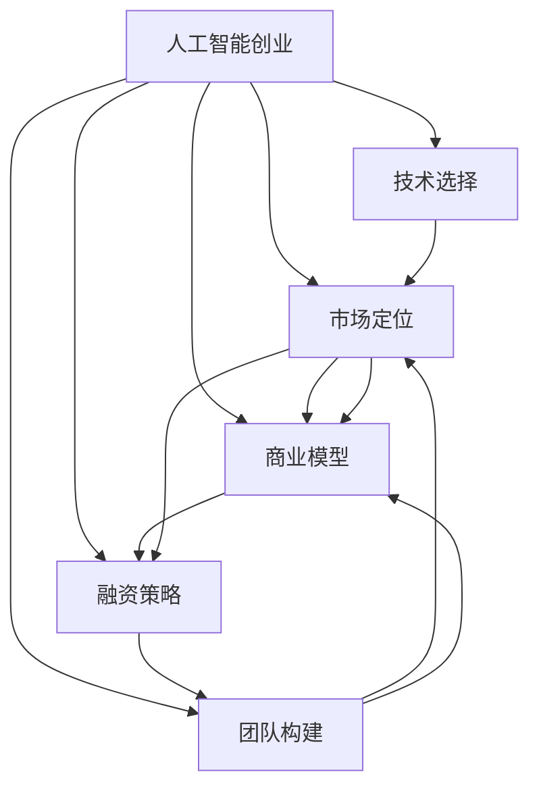

                 

# AI创业码头故事：AI创业者的选择

> 关键词：AI创业、技术选择、市场定位、商业模型、融资策略、团队构建

## 1. 背景介绍

在人工智能(AI)时代，AI创业已成为一个热门的领域。然而，对于创业者来说，选择合适的AI技术、市场定位、商业模型、融资策略和团队构建，是成功的关键。本文将从这些方面探讨AI创业者的选择，帮助他们在创业的早期阶段做出明智的决策。

### 1.1 人工智能创业的现状和趋势

人工智能技术的快速发展推动了AI创业的繁荣。根据多个报告，AI创业公司在全球各地如雨后春笋般涌现，特别是自然语言处理(NLP)、计算机视觉、机器人等领域。AI技术的创新和应用拓展了创业机会，但也带来了挑战。创业者需要在技术、市场和商业模型等多个维度进行深度思考和选择。

### 1.2 人工智能创业的优势和挑战

人工智能创业相较于传统创业，具有以下几个优势：

1. **创新潜力大**：AI技术具有很强的创新性，可以带来颠覆性的商业变革。
2. **需求旺盛**：随着各行各业对AI的需求增加，AI创业公司更容易获得投资。
3. **数据驱动**：AI依赖数据，而数据获取和处理已经成为各行业的标准操作，易于获取和利用。

但同时，AI创业也面临以下挑战：

1. **高门槛**：AI技术的复杂性和专业性要求创业者具备较高的技术背景。
2. **数据隐私**：AI应用涉及大量数据处理，数据隐私和安全问题不容忽视。
3. **快速迭代**：AI领域技术更新快，创业者需要持续学习和技术更新。

## 2. 核心概念与联系

### 2.1 核心概念概述

为更好地理解AI创业者的选择，本节将介绍几个密切相关的核心概念：

- **人工智能创业**：基于AI技术进行产品和服务创新的创业模式。
- **技术选择**：根据市场需求和自身能力，选择合适的AI技术进行产品开发。
- **市场定位**：确定创业产品或服务的目标市场和用户群体。
- **商业模型**：根据产品特性和市场需求，设计可持续的盈利模式。
- **融资策略**：通过多种渠道和方式筹集资金支持公司发展。
- **团队构建**：选拔具备技术和业务能力的核心团队成员，共同推动创业进程。

这些核心概念之间的逻辑关系可以通过以下Mermaid流程图来展示：



这个流程图展示了这个复杂过程的核心概念及其相互关系：

1. 人工智能创业是起点。
2. 技术选择、市场定位、商业模型和融资策略是关键路径上的节点。
3. 团队构建是整个过程的基石。
4. 路径之间存在相互关联，如技术选择影响市场定位和商业模型，市场定位又影响融资策略和团队构建。

## 3. 核心算法原理 & 具体操作步骤

### 3.1 算法原理概述

AI创业者的选择过程遵循决策科学的基本原理，即在给定条件下，最大化目标函数。在AI创业中，目标函数通常涉及技术成熟度、市场需求、投资回报率等因素。

创业者需要根据以下步骤进行选择：

1. **市场调研**：了解市场需求和用户痛点。
2. **技术评估**：评估现有技术的能力和应用前景。
3. **商业验证**：验证商业模式和盈利模式。
4. **融资规划**：制定融资策略，确保公司资金链的稳定。
5. **团队建设**：组建具备技术、管理和市场能力的团队。

### 3.2 算法步骤详解

以下是AI创业者选择过程中的详细步骤：

**Step 1: 市场调研**
- 定义目标用户和市场细分。
- 调研市场需求和竞争态势。
- 分析用户痛点和未被满足的需求。

**Step 2: 技术评估**
- 选择适合的技术栈和AI模型。
- 评估技术成熟度和应用前景。
- 确定技术的可行性和可扩展性。

**Step 3: 商业验证**
- 设计初步的商业模式，如SaaS、B2B、B2C等。
- 验证商业模式，获取早期用户反馈。
- 调整和优化商业模式，确保盈利可持续性。

**Step 4: 融资规划**
- 制定融资策略，包括风险投资、天使投资、政府资助等。
- 准备商业计划书和投资路演材料。
- 通过投资人和机构进行融资，确保公司资金需求。

**Step 5: 团队建设**
- 选拔具有相关技术和业务经验的团队成员。
- 明确团队分工和职责。
- 建立高效的团队协作机制。

### 3.3 算法优缺点

**优点**：

- **数据驱动**：基于市场调研和数据分析，能够更准确地选择和优化技术方向。
- **过程透明**：步骤明确，便于追踪和评估。
- **策略灵活**：根据市场和技术的变化，能够及时调整策略。

**缺点**：

- **周期较长**：从市场调研到融资到团队建设，需要较长时间。
- **风险较大**：市场和技术的变化可能导致前期选择不匹配。
- **资源需求高**：需要较高的资金、技术和管理资源。

### 3.4 算法应用领域

AI创业者的选择算法适用于多个领域，包括但不限于：

- **自然语言处理**：如智能客服、聊天机器人、文本分析等。
- **计算机视觉**：如图像识别、视频分析、增强现实等。
- **机器人技术**：如协作机器人、自动驾驶、服务机器人等。
- **医疗健康**：如健康监测、药物研发、智能诊断等。
- **金融科技**：如智能投顾、风险管理、金融分析等。
- **智能制造**：如智能生产、物流管理、质量检测等。

这些领域的需求多样且复杂，AI创业者的选择算法有助于创业者根据自身优势和市场需求，选择最适合的技术方向和市场定位。

## 4. 数学模型和公式 & 详细讲解 & 举例说明

### 4.1 数学模型构建

AI创业者选择过程的数学模型通常包括决策树、回归分析、多变量统计等方法。决策树模型通过分类和排序，帮助创业者在技术、市场、商业和融资等多个维度进行决策。回归分析用于评估市场需求和商业潜力。多变量统计用于量化技术可行性和团队能力。

### 4.2 公式推导过程

以决策树模型为例，假设我们有三个关键维度：技术能力、市场需求和团队能力，每个维度分为两个子维度：A1、A2、B1、B2、C1、C2。我们设计如下公式：

$$
\text{决策值} = \alpha \times \text{技术能力} + \beta \times \text{市场需求} + \gamma \times \text{团队能力}
$$

其中，$\alpha$、$\beta$、$\gamma$为权重系数，用于衡量各个维度的相对重要性。

### 4.3 案例分析与讲解

假设我们有一家AI创业公司，目标是开发一款智能客服系统。

**Step 1: 市场调研**
- 目标用户为中大型企业。
- 市场需求为高效的客户支持和低成本的客服解决方案。
- 用户痛点为客服响应速度慢、人工成本高。

**Step 2: 技术评估**
- 技术选择为自然语言处理和机器学习。
- 技术成熟度为中上水平。
- 应用前景为智能客服系统和聊天机器人。

**Step 3: 商业验证**
- 初步商业模式为SaaS，按月订阅。
- 商业潜力为中高水平。
- 早期用户反馈为积极，愿意支付一定费用。

**Step 4: 融资规划**
- 融资策略为风险投资和天使投资。
- 投资金额需求为500万美元。
- 通过多次路演和展示，获得500万美元融资。

**Step 5: 团队建设**
- 技术团队包括NLP专家和机器学习工程师。
- 市场团队包括产品经理和销售经理。
- 管理团队包括CEO和CTO。

## 5. 项目实践：代码实例和详细解释说明

### 5.1 开发环境搭建

为了进行项目实践，我们需要一个Python开发环境。以下是具体的搭建流程：

1. **安装Python**：从官网下载并安装Python 3.8及以上版本。
2. **创建虚拟环境**：使用`venv`或`virtualenv`创建虚拟环境，以避免与其他项目冲突。
3. **安装必要的库**：安装`pandas`、`numpy`、`matplotlib`、`scikit-learn`等库，以便进行数据分析和建模。
4. **准备数据集**：收集和处理相关市场调研和用户调研数据，存储在本地。

### 5.2 源代码详细实现

下面是一个简化的AI创业者选择决策树模型的Python代码实现：

```python
from sklearn.tree import DecisionTreeClassifier
import pandas as pd
from sklearn.model_selection import train_test_split

# 准备数据集
data = pd.read_csv('创业决策数据.csv')

# 数据预处理
#...

# 划分训练集和测试集
train_data, test_data = train_test_split(data, test_size=0.2, random_state=42)

# 构建决策树模型
model = DecisionTreeClassifier()

# 训练模型
model.fit(train_data[['技术能力', '市场需求', '团队能力']], train_data['决策值'])

# 预测
test_values = test_data[['技术能力', '市场需求', '团队能力']]
predictions = model.predict(test_values)

# 输出预测结果
for value, pred in zip(test_values.values, predictions):
    print(f"技术能力: {value[0]}, 市场需求: {value[1]}, 团队能力: {value[2]}, 决策值: {pred}")
```

### 5.3 代码解读与分析

**代码解释**：

1. **数据准备**：从CSV文件中读取数据集，并进行必要的预处理。
2. **数据分割**：将数据集划分为训练集和测试集。
3. **模型构建**：使用`DecisionTreeClassifier`构建决策树模型。
4. **模型训练**：使用训练数据训练模型。
5. **模型预测**：使用测试数据进行预测，并输出预测结果。

**分析**：

- 数据预处理：需要根据具体业务逻辑，进行数据清洗、归一化等预处理操作。
- 模型训练：需要调整决策树模型的参数，如最大深度、最小叶子节点等，以优化预测结果。
- 模型预测：需要评估预测结果的准确率和误差，并进行进一步优化。

## 6. 实际应用场景

### 6.1 智能客服系统

基于AI的智能客服系统在各行各业均有应用。创业公司可以通过微调现有技术，开发智能客服机器人，帮助客户解答常见问题，减少人力成本。

**Step 1: 市场调研**：
- 调研企业对智能客服的需求。
- 分析客服系统的痛点和瓶颈。
- 收集用户反馈和建议。

**Step 2: 技术评估**：
- 评估现有NLP技术，如BERT、GPT等。
- 选择适合的技术栈和模型。
- 确定技术可行性和可扩展性。

**Step 3: 商业验证**：
- 设计初步的商业模式，如按使用次数或按月订阅。
- 验证商业模式，获取早期用户反馈。
- 调整和优化商业模式，确保盈利可持续性。

**Step 4: 融资规划**：
- 制定融资策略，包括风险投资和天使投资。
- 准备商业计划书和投资路演材料。
- 通过投资人和机构进行融资，确保公司资金需求。

**Step 5: 团队建设**：
- 选拔具有NLP和机器学习背景的技术团队。
- 选拔具备市场和销售能力的市场团队。
- 选拔具备管理和执行能力的管理团队。

### 6.2 医疗健康领域

AI在医疗健康领域的应用前景广阔，如智能诊断、健康监测、药物研发等。创业者可以通过选择合适的技术，开发智能医疗应用，改善医疗服务质量。

**Step 1: 市场调研**：
- 调研医院和患者对AI医疗应用的需求。
- 分析现有医疗系统的不足和痛点。
- 收集医疗专家和患者的反馈和建议。

**Step 2: 技术评估**：
- 评估现有AI技术，如深度学习、计算机视觉等。
- 选择适合的技术栈和模型。
- 确定技术可行性和可扩展性。

**Step 3: 商业验证**：
- 设计初步的商业模式，如按次付费或按月订阅。
- 验证商业模式，获取早期用户反馈。
- 调整和优化商业模式，确保盈利可持续性。

**Step 4: 融资规划**：
- 制定融资策略，包括政府资助和风投等。
- 准备商业计划书和投资路演材料。
- 通过投资人和机构进行融资，确保公司资金需求。

**Step 5: 团队建设**：
- 选拔具有医学背景和AI技术能力的团队。
- 选拔具备市场和销售能力的市场团队。
- 选拔具备管理和执行能力的管理团队。

### 6.3 智能制造

AI在智能制造中的应用包括智能生产、质量检测、物流管理等。创业者可以通过选择合适的技术，开发智能制造系统，提升生产效率和质量。

**Step 1: 市场调研**：
- 调研制造业企业对智能制造的需求。
- 分析现有生产系统的瓶颈和问题。
- 收集工厂和生产线的反馈和建议。

**Step 2: 技术评估**：
- 评估现有AI技术，如机器视觉、物联网等。
- 选择适合的技术栈和模型。
- 确定技术可行性和可扩展性。

**Step 3: 商业验证**：
- 设计初步的商业模式，如按设备使用或按结果付费。
- 验证商业模式，获取早期用户反馈。
- 调整和优化商业模式，确保盈利可持续性。

**Step 4: 融资规划**：
- 制定融资策略，包括风投和政府资助等。
- 准备商业计划书和投资路演材料。
- 通过投资人和机构进行融资，确保公司资金需求。

**Step 5: 团队建设**：
- 选拔具有自动化和AI技术能力的团队。
- 选拔具备市场和销售能力的市场团队。
- 选拔具备管理和执行能力的管理团队。

### 6.4 未来应用展望

未来，AI创业将会在更多领域发挥作用，如智能家居、自动驾驶、智慧城市等。创业者可以通过选择合适的技术，开发智能应用，推动各行业的智能化转型。

**Step 1: 市场调研**：
- 调研各行业对AI应用的需求。
- 分析现有系统的瓶颈和问题。
- 收集用户和行业的反馈和建议。

**Step 2: 技术评估**：
- 评估现有AI技术，如自然语言处理、计算机视觉等。
- 选择适合的技术栈和模型。
- 确定技术可行性和可扩展性。

**Step 3: 商业验证**：
- 设计初步的商业模式，如按次付费或按结果付费。
- 验证商业模式，获取早期用户反馈。
- 调整和优化商业模式，确保盈利可持续性。

**Step 4: 融资规划**：
- 制定融资策略，包括风投和政府资助等。
- 准备商业计划书和投资路演材料。
- 通过投资人和机构进行融资，确保公司资金需求。

**Step 5: 团队建设**：
- 选拔具有AI技术能力和跨领域知识背景的团队。
- 选拔具备市场和销售能力的市场团队。
- 选拔具备管理和执行能力的管理团队。

## 7. 工具和资源推荐

### 7.1 学习资源推荐

为了帮助创业者深入理解AI创业，以下是几个推荐的学习资源：

1. **《人工智能创业指南》**：一本书全面介绍了AI创业的各个方面，包括市场调研、技术评估、商业模型、融资策略等。
2. **Coursera的《人工智能创业》课程**：来自斯坦福大学的课程，涵盖AI创业的关键环节，适合初学者和进阶者。
3. **Kaggle上的AI创业项目**：Kaggle上有很多优秀的AI创业项目，可以学习他们的成功经验和失败教训。
4. **GitHub上的AI创业项目**：GitHub上有很多开源的AI创业项目，可以借鉴其代码实现和数据处理。

### 7.2 开发工具推荐

以下是几个推荐的AI创业开发工具：

1. **Jupyter Notebook**：一个交互式开发环境，方便进行数据分析和模型验证。
2. **TensorFlow**：一个强大的深度学习框架，支持分布式计算和GPU加速。
3. **PyTorch**：一个灵活的深度学习框架，适合快速原型开发和研究。
4. **Scikit-learn**：一个机器学习库，提供各种算法和工具。
5. **AWS SageMaker**：一个云端AI平台，支持模型训练、部署和监控。

### 7.3 相关论文推荐

以下是几篇关于AI创业的开创性论文，推荐阅读：

1. **《AI创业指南》**：系统介绍了AI创业的关键环节和技术方法。
2. **《AI创业案例分析》**：分析了多个AI创业公司的成功和失败案例。
3. **《AI创业市场调研》**：介绍了市场调研的方法和工具。
4. **《AI创业商业模型》**：探讨了各种AI创业的商业模式和盈利方式。

## 8. 总结：未来发展趋势与挑战

### 8.1 研究成果总结

本文介绍了AI创业者的选择过程，从技术评估、市场定位、商业模型、融资策略和团队构建等方面，全面探讨了AI创业的关键环节。

### 8.2 未来发展趋势

未来，AI创业将有以下几个发展趋势：

1. **技术多元化**：AI创业将涵盖更多领域，如智能家居、自动驾驶、智慧城市等。
2. **市场细分**：AI创业将针对细分市场，提供更精准的解决方案。
3. **商业模式创新**：AI创业将探索更多盈利模式，如按结果付费、按服务质量付费等。
4. **团队多样化**：AI创业将需要更多具备跨领域知识和技能的团队。

### 8.3 面临的挑战

尽管AI创业前景广阔，但也面临以下挑战：

1. **技术复杂性**：AI技术复杂，需要具备较高的技术门槛。
2. **市场竞争激烈**：AI创业领域竞争激烈，需要具备创新能力和差异化优势。
3. **资金需求高**：AI创业需要大量资金支持，融资难度大。
4. **数据隐私和安全**：AI应用涉及大量数据处理，数据隐私和安全问题不容忽视。

### 8.4 研究展望

未来的研究需要在以下几个方面进行深入探索：

1. **技术评估方法**：研究更有效的技术评估方法，提高技术选择的准确性。
2. **市场调研工具**：开发更高效的市场调研工具，帮助创业者快速获取和分析数据。
3. **商业验证方法**：研究更可靠的商业验证方法，减少商业模式失败的风险。
4. **融资策略优化**：研究更优化的融资策略，提高融资效率和成功率。
5. **团队建设策略**：研究更有效的团队建设策略，提升团队协作效率和创新能力。

## 9. 附录：常见问题与解答

**Q1: 什么是AI创业？**

A: AI创业是指基于人工智能技术进行产品和服务创新的创业模式。

**Q2: 如何选择合适的AI技术？**

A: 选择合适的AI技术需要考虑市场需求、自身能力和技术成熟度。可以进行市场调研和竞争分析，评估现有技术的优缺点，选择合适的技术栈和模型。

**Q3: 如何构建AI创业团队？**

A: 构建AI创业团队需要选拔具备技术、管理和市场能力的关键成员，明确团队分工和职责，建立高效的协作机制。

**Q4: 如何优化AI创业的商业模型？**

A: 优化AI创业的商业模型需要根据市场需求和产品特性，设计可持续的盈利模式。可以通过早期用户反馈和市场调研，调整和优化商业模式。

**Q5: 如何应对AI创业的挑战？**

A: 应对AI创业的挑战需要具备技术、市场、管理和融资等多方面的能力。可以通过持续学习和技术更新，构建强大团队，优化商业模式，提高资金获取能力。

---

作者：禅与计算机程序设计艺术 / Zen and the Art of Computer Programming

