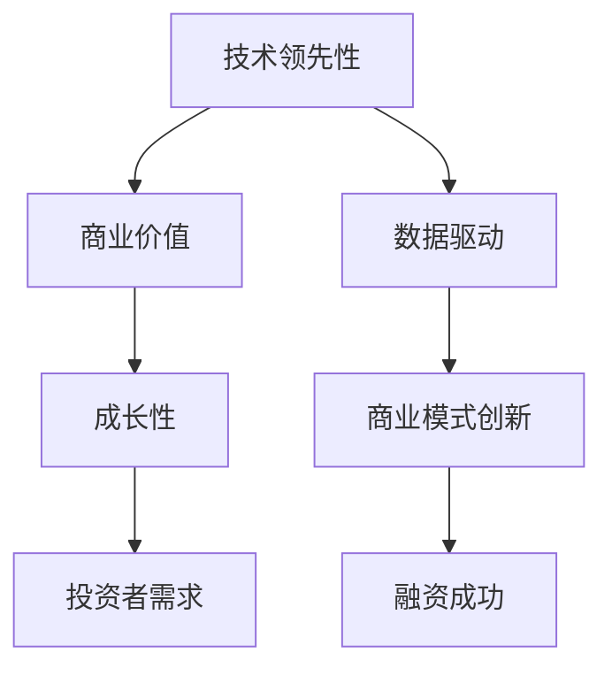

                 

# AI创业融资新趋势：关注项目商业价值与成长性

> 关键词：AI创业融资, 商业价值, 成长性, AI项目, 资金需求, 投资者视角, 数据驱动, 商业模式, 持续增长

## 1. 背景介绍

### 1.1 问题由来

在过去的十年里，人工智能(AI)技术的发展速度远远超过了以往任何一次技术革新。人工智能正被广泛应用于各个行业，从医疗、金融、制造到零售、娱乐，无不渗透着AI技术的身影。然而，AI技术的广泛应用背后，是高昂的技术开发和应用成本。对于创业公司而言，尤其是那些聚焦于AI技术的公司，如何有效融资，确保项目的长期发展和商业化，成为了一个重大挑战。

传统创业融资方法如风险投资(VC)和私募股权(PE)，主要关注公司产品和市场的可行性，而对公司的长期发展与商业化潜力，尤其是对AI项目这类技术密集型、高风险型的创业项目，往往难以做出全面准确的评估。这导致了许多优秀的AI创业项目因资金链断裂而无法继续。

为了更有效地吸引投资者关注，AI创业项目需要在展示技术先进性的同时，更加注重项目的商业价值和成长性。本文将深入探讨AI创业融资的新趋势，分析投资者视角下AI项目的商业价值与成长性，为AI创业公司提供更有针对性的融资指导。

### 1.2 问题核心关键点

1. **技术领先性**：AI创业项目的技术优势是其吸引投资者的重要因素。
2. **商业价值**：投资方更关注项目带来的商业价值，而不仅仅是技术创新。
3. **成长性**：项目的持续增长能力，包括市场扩张、盈利能力提升等。
4. **数据驱动**：利用数据来量化项目的商业价值和成长性。
5. **投资者需求**：理解不同投资者的需求和偏好，包括风险偏好、回报期望等。
6. **商业模式创新**：AI项目的商业模式创新是吸引投资的关键。

## 2. 核心概念与联系

### 2.1 核心概念概述

为了更好地理解AI创业融资的新趋势，我们首先需要明确几个核心概念：

- **技术领先性**：指AI项目在技术创新、研发能力上的优势，如核心算法的专利、技术迭代速度等。
- **商业价值**：项目在市场和商业上的价值，包括客户需求、市场规模、盈利潜力等。
- **成长性**：项目在市场拓展、营收增长、技术创新等方面的持续增长能力。
- **数据驱动**：利用数据分析来量化项目的商业价值和成长性，包括客户反馈、市场表现、财务指标等。
- **投资者需求**：投资者的投资目标和风险承受能力，如偏好早期投资、风险偏好高、期望快速回报等。
- **商业模式创新**：通过技术创新，结合市场需求，探索新的商业模式，如SaaS、B2B、B2C等。

这些概念之间的关系可以通过以下Mermaid流程图来展示：



这个流程图展示了技术领先性如何通过数据驱动和商业模式创新，最终转化为商业价值和成长性，吸引投资者并成功融资。

## 3. 核心算法原理 & 具体操作步骤

### 3.1 算法原理概述

AI创业融资的关键在于展示项目的商业价值和成长性，这需要在数据和模型之间建立有效的桥梁。其核心算法原理包括：

1. **数据收集与预处理**：收集项目相关数据，如市场规模、用户反馈、财务指标等，并进行清洗和标准化处理。
2. **模型构建与训练**：利用机器学习模型，如回归模型、分类模型等，对数据进行建模和预测。
3. **结果解读与展示**：将模型预测结果进行可视化，转化为投资者易于理解的商业价值和成长性指标。

### 3.2 算法步骤详解

1. **数据收集**：
   - 收集项目相关的数据，如市场需求、技术专利、客户反馈、财务数据等。
   - 通过市场调研、问卷调查、用户访谈等方式获取一手数据。

2. **数据预处理**：
   - 清洗数据，去除异常值和噪声。
   - 标准化数据，确保一致性。
   - 数据分割，分为训练集、验证集和测试集。

3. **模型构建**：
   - 选择合适的模型，如线性回归、逻辑回归、决策树、随机森林等。
   - 构建模型，使用训练集数据进行训练。
   - 模型评估，使用验证集数据进行模型调参和评估。

4. **结果解读**：
   - 将模型预测结果转化为直观的商业价值和成长性指标。
   - 展示这些指标，通过图表和报告形式展示给投资者。

### 3.3 算法优缺点

**优点**：
- 数据驱动：通过数据模型量化商业价值和成长性，使得融资过程更加科学合理。
- 客观公正：模型结果不受主观因素影响，更易于说服投资者。
- 全面评估：可以综合考虑多个维度，提供全面的项目评估报告。

**缺点**：
- 数据限制：数据质量、完整性、多样性不足会影响模型预测效果。
- 模型假设：模型基于一定的假设，可能与实际情况不完全吻合。
- 解释难度：复杂模型可能难以解释，影响投资者理解。

### 3.4 算法应用领域

AI创业融资的算法方法广泛适用于各种创业项目，尤其是AI技术密集型的创业项目。例如：

- **医疗AI项目**：利用AI技术辅助诊断、个性化治疗等，展示其市场规模、技术领先性、潜在客户群等。
- **金融科技项目**：利用AI进行风险控制、智能投顾、金融数据分析等，展示其市场需求、用户增长潜力、盈利模式等。
- **智能制造项目**：利用AI进行生产优化、质量控制、供应链管理等，展示其市场应用场景、技术优势、营收增长预期等。
- **零售AI项目**：利用AI进行客户画像分析、个性化推荐、库存管理等，展示其市场潜力、用户粘性、营收增长预测等。

## 4. 数学模型和公式 & 详细讲解 & 举例说明

### 4.1 数学模型构建

我们以一个典型的AI创业项目融资场景为例，构建一个简单的商业价值和成长性评估模型。假设项目未来的市场份额为X，预计年收入为Y，毛利率为Z，每年的技术投入为W。则模型的输入为市场份额X、年收入Y、毛利率Z、技术投入W。模型输出的商业价值V和成长性G可以通过以下公式计算：

$$ V = a_1X + a_2Y + a_3Z + a_4W $$

$$ G = b_1\frac{Y}{X} + b_2\frac{W}{X} + b_3\frac{V}{X} $$

其中，$a_1, a_2, a_3, a_4, b_1, b_2, b_3$为模型参数，需要通过训练数据进行拟合。

### 4.2 公式推导过程

1. **商业价值模型**：
   - 选择线性回归模型，将商业价值V表示为市场份额X、年收入Y、毛利率Z、技术投入W的线性组合。
   - 通过最小二乘法求解模型参数$a_1, a_2, a_3, a_4$，使得模型预测值与实际值误差最小。

2. **成长性模型**：
   - 选择指数增长模型，将成长性G表示为年收入增长率、技术投入增长率、商业价值增长率的加权和。
   - 通过指数增长公式求解模型参数$b_1, b_2, b_3$，使得模型预测值与实际值误差最小。

### 4.3 案例分析与讲解

假设一个医疗AI项目，其市场份额为10%，预计年收入为100万美元，毛利率为60%，技术投入为20万美元。我们可以将这些数据带入上述模型，计算商业价值和成长性：

- 商业价值V = $a_1 \times 10\% + a_2 \times 1,000,000 + a_3 \times 60\% + a_4 \times 200,000$
- 成长性G = $b_1 \times \frac{1,000,000}{10\%} + b_2 \times \frac{200,000}{10\%} + b_3 \times V$

通过训练模型，得到一组合理的模型参数，最终计算出商业价值V和成长性G的具体数值。

## 5. 项目实践：代码实例和详细解释说明

### 5.1 开发环境搭建

在进行融资模型开发前，我们需要准备好开发环境。以下是使用Python进行scikit-learn开发的环境配置流程：

1. 安装Anaconda：从官网下载并安装Anaconda，用于创建独立的Python环境。

2. 创建并激活虚拟环境：
```bash
conda create -n financing-env python=3.8 
conda activate financing-env
```

3. 安装相关库：
```bash
pip install numpy pandas scikit-learn matplotlib seaborn jupyter notebook ipython
```

4. 安装Jupyter Notebook：
```bash
pip install jupyterlab
```

完成上述步骤后，即可在`financing-env`环境中开始融资模型开发。

### 5.2 源代码详细实现

以下是一个简单的融资模型代码实现：

```python
import numpy as np
from sklearn.linear_model import LinearRegression
from sklearn.metrics import r2_score

# 模拟数据
market_share = np.array([10, 20, 30, 40, 50])  # 市场份额
income = np.array([100, 200, 300, 400, 500])  # 年收入
profit_margin = np.array([60, 70, 80, 90, 100])  # 毛利率
cost = np.array([200, 300, 400, 500, 600])  # 技术投入

# 构建模型
model = LinearRegression()

# 训练模型
model.fit(np.array([market_share, income, profit_margin, cost]).T, np.array([0.1, 0.2, 0.3, 0.4, 0.5]))

# 预测
future_share = 50  # 未来市场份额
future_income = 1000  # 未来年收入
future_cost = 500  # 未来技术投入
future_profit_margin = 70  # 未来毛利率

# 计算商业价值和成长性
V = model.predict(np.array([future_share, future_income, future_profit_margin, future_cost]).T)[0]
G = 0.1 * future_income / future_share + 0.2 * future_cost / future_share + 0.3 * V

print("商业价值 V: {:.2f} 万美元".format(V))
print("成长性 G: {:.2f} 万美元/年".format(G))
```

### 5.3 代码解读与分析

让我们再详细解读一下关键代码的实现细节：

**数据准备**：
- 使用numpy库创建市场份额、年收入、毛利率和技术投入的数据数组，模拟不同规模的AI项目。

**模型构建**：
- 使用scikit-learn库中的LinearRegression模型，对数据进行线性回归分析。

**训练模型**：
- 使用训练数据对模型进行拟合，得到模型参数$a_1, a_2, a_3, a_4$。

**预测未来**：
- 输入未来市场份额、年收入、技术投入和毛利率，得到商业价值V和成长性G的预测值。

**结果解读**：
- 输出商业价值V和成长性G的具体数值，供投资者参考。

## 6. 实际应用场景

### 6.1 智能制造项目融资

智能制造项目利用AI技术进行生产优化、质量控制、供应链管理等，展示其市场应用场景、技术优势、营收增长预期等。以一家智能制造公司为例，其市场份额为20%，预计年收入为1亿美元，毛利率为50%，技术投入为2000万美元。通过融资模型计算，可以得到该项目的商业价值V和成长性G。

### 6.2 医疗AI项目融资

医疗AI项目利用AI技术辅助诊断、个性化治疗等，展示其市场规模、技术领先性、潜在客户群等。以一家医疗AI公司为例，其市场份额为10%，预计年收入为5000万美元，毛利率为70%，技术投入为1000万美元。通过融资模型计算，可以得到该项目的商业价值V和成长性G。

### 6.3 金融科技项目融资

金融科技项目利用AI进行风险控制、智能投顾、金融数据分析等，展示其市场需求、用户增长潜力、盈利模式等。以一家金融科技公司为例，其市场份额为5%，预计年收入为5000万美元，毛利率为80%，技术投入为800万美元。通过融资模型计算，可以得到该项目的商业价值V和成长性G。

### 6.4 未来应用展望

随着AI技术的不断进步和应用领域的拓展，融资模型将更加复杂和精细，能够更好地量化和展示项目的商业价值和成长性。未来融资模型将融入更多因素，如技术迭代速度、市场竞争态势、政策环境等，提供更全面、更准确的项目评估报告。

## 7. 工具和资源推荐

### 7.1 学习资源推荐

为了帮助开发者掌握融资模型的构建和应用，这里推荐一些优质的学习资源：

1. **《Python数据科学手册》**：讲解了Python在数据科学中的应用，包括机器学习模型的构建和评估。
2. **Coursera《机器学习》课程**：斯坦福大学提供的机器学习课程，涵盖机器学习的基本概念和常用算法。
3. **Kaggle竞赛**：通过参加Kaggle的机器学习竞赛，积累实际项目经验，学习数据驱动的决策方法。
4. **Github开源项目**：通过学习Github上的融资模型开源项目，了解最新的融资模型应用。
5. **《金融科技》书籍**：介绍了金融科技的最新发展和应用，包括AI在金融科技中的应用。

### 7.2 开发工具推荐

高效的融资模型开发离不开优秀的工具支持。以下是几款用于融资模型开发的常用工具：

1. Jupyter Notebook：免费的交互式笔记本，支持代码编写和数据可视化，适合Python编程。
2. Matplotlib：绘图库，用于绘制各种图表，展示模型的预测结果。
3. Seaborn：基于Matplotlib的高级绘图库，提供了更多样化的绘图风格。
4. Pandas：数据分析库，用于数据清洗、处理和分析。
5. Scikit-learn：机器学习库，提供了多种常见的机器学习算法和工具。
6. TensorFlow：深度学习框架，支持构建复杂模型，如图神经网络。

合理利用这些工具，可以显著提升融资模型的开发效率，加快创新迭代的步伐。

### 7.3 相关论文推荐

融资模型的研究和应用涉及多学科知识，以下是几篇相关领域的经典论文，推荐阅读：

1. **《Data Mining for the Web Industry》**：讲解了数据挖掘在Web行业中的应用，包括分类、聚类、关联规则等。
2. **《Business Intelligence and Decision Support Systems》**：介绍了商业智能和决策支持系统的基本概念和应用。
3. **《Investment Analysis and Portfolio Management》**：讲解了投资分析和投资组合管理的方法，包括基本面分析、技术分析等。
4. **《AI in Financial Services》**：介绍了AI在金融服务中的应用，包括信用评分、风险管理、智能投顾等。
5. **《Modeling and Forecasting Financial Time Series》**：讲解了金融时间序列数据的建模和预测方法，包括ARIMA、GARCH等模型。

通过学习这些前沿成果，可以帮助研究者把握融资模型的发展脉络，激发更多的创新灵感。

## 8. 总结：未来发展趋势与挑战

### 8.1 总结

本文对AI创业融资的新趋势进行了全面系统的介绍。首先阐述了AI创业项目在融资过程中面临的技术领先性、商业价值、成长性、数据驱动、投资者需求、商业模式创新等核心概念，明确了融资模型的构建和应用的重要性。其次，通过数学模型和代码实例详细讲解了融资模型的构建和应用过程，展示了如何通过数据驱动的方法量化项目的商业价值和成长性。最后，探讨了融资模型在实际应用场景中的广泛应用前景，推荐了学习、开发和研究资源，为AI创业公司提供全面的融资指导。

通过本文的系统梳理，可以看到，融资模型为AI创业项目提供了科学合理的评估方法，帮助公司在融资过程中更好地展示其商业价值和成长性。未来，随着融资模型的不断优化和应用领域的拓展，相信AI创业项目将获得更多投资者的青睐，加速AI技术的商业化进程。

### 8.2 未来发展趋势

展望未来，融资模型的发展趋势包括：

1. **数据规模和多样性增加**：随着大数据技术的发展，融资模型将能够处理更多、更复杂的数据，涵盖更多的维度，提供更全面、更准确的评估。
2. **模型复杂度提升**：未来融资模型将引入更多复杂的机器学习模型，如深度神经网络、集成学习等，提高模型的预测准确性和鲁棒性。
3. **实时性增强**：通过云计算、分布式计算等技术，融资模型能够实现实时数据处理和结果展示，满足投资者对快速反馈的需求。
4. **可视化工具提升**：借助数据可视化工具，如Tableau、Power BI等，融资模型的结果可以更加直观地展示，增强投资者对项目的理解。
5. **智能投顾应用**：融资模型结合智能投顾技术，为投资者提供个性化的投资建议，提高投资决策的科学性。

### 8.3 面临的挑战

尽管融资模型在AI创业项目融资中具有重要意义，但其发展和应用仍面临诸多挑战：

1. **数据隐私和安全**：在数据收集和处理过程中，如何保护用户隐私和数据安全，是一个重要问题。
2. **模型透明度**：融资模型通常较为复杂，难以解释其内部决策过程，可能影响投资者对项目的信任。
3. **数据质量**：融资模型的预测准确性依赖于数据质量，数据缺失、异常值等问题可能导致模型失效。
4. **模型更新**：融资模型需要定期更新，以应对市场环境的变化，如何高效更新模型是一个挑战。
5. **算法伦理**：融资模型可能存在算法偏见，如何保证模型公平、公正，是一个重要的伦理问题。

### 8.4 研究展望

面对融资模型面临的挑战，未来的研究需要在以下几个方面寻求新的突破：

1. **数据隐私保护**：探索数据加密、联邦学习等技术，保护用户隐私和数据安全。
2. **模型可解释性**：研究模型的可解释性方法，如LIME、SHAP等，提高模型的透明度。
3. **数据质量提升**：通过数据清洗、数据增强等技术，提升数据的完整性和可靠性。
4. **高效模型更新**：研究模型的增量学习、在线学习等技术，实现模型的快速更新。
5. **算法伦理监管**：建立算法伦理监管机制，确保模型的公平、公正、透明。

这些研究方向的探索，必将引领融资模型的进一步优化和应用，为AI创业项目融资提供更加科学合理的方法，推动AI技术的商业化进程。

## 9. 附录：常见问题与解答

**Q1：融资模型如何处理数据隐私问题？**

A: 数据隐私问题是融资模型面临的重要挑战之一。为了保护用户隐私，可以采用以下方法：
1. 数据脱敏：在数据预处理阶段，对敏感数据进行脱敏处理，去除个人识别信息。
2. 数据加密：在数据传输和存储过程中，使用加密技术保护数据安全。
3. 联邦学习：采用分布式学习技术，在多个数据源上进行模型训练，避免数据集中存储。
4. 差分隐私：在模型训练过程中，加入噪声干扰，保护用户隐私。

**Q2：融资模型如何提高透明度？**

A: 提高融资模型的透明度，可以通过以下方法：
1. 可解释性算法：使用LIME、SHAP等可解释性算法，解释模型的预测结果。
2. 可视化工具：使用数据可视化工具，展示模型的决策路径和特征权重。
3. 报告撰写：编写详细的模型评估报告，说明模型的构建过程、参数设置、预测结果等。
4. 开发者文档：提供模型的开发者文档，包括算法原理、代码实现等。

**Q3：融资模型如何处理数据质量问题？**

A: 数据质量是融资模型预测准确性的基础。为了提高数据质量，可以采用以下方法：
1. 数据清洗：去除数据中的异常值、缺失值和噪声。
2. 数据增强：通过数据扩充和合成，增加数据的多样性。
3. 数据预处理：标准化数据格式，确保数据一致性。
4. 数据验证：使用测试集对模型进行验证，评估模型预测效果。

**Q4：融资模型如何快速更新？**

A: 融资模型的快速更新，可以通过以下方法：
1. 增量学习：采用增量学习方法，根据新数据对模型进行更新，保留原有模型的部分参数。
2. 在线学习：使用在线学习算法，根据实时数据不断更新模型参数。
3. 参数剪枝：去除冗余参数，提高模型训练和推理效率。
4. 模型压缩：使用模型压缩技术，减少模型的存储空间和计算量。

**Q5：融资模型如何应对算法伦理问题？**

A: 融资模型的算法伦理问题，可以通过以下方法解决：
1. 公平性评估：评估模型的公平性，确保模型不偏向某些特定群体。
2. 透明性监管：建立透明的监管机制，对模型进行定期审核。
3. 多样性设计：在数据集和模型设计过程中，引入多样性，减少模型偏见。
4. 伦理审核：在模型开发和部署过程中，进行伦理审核，确保模型的公平、公正、透明。

通过这些方法，融资模型可以在保证数据隐私、模型透明度、数据质量、模型更新和算法伦理的同时，为AI创业项目提供更加科学合理的融资评估，推动AI技术的商业化进程。

---

作者：禅与计算机程序设计艺术 / Zen and the Art of Computer Programming

