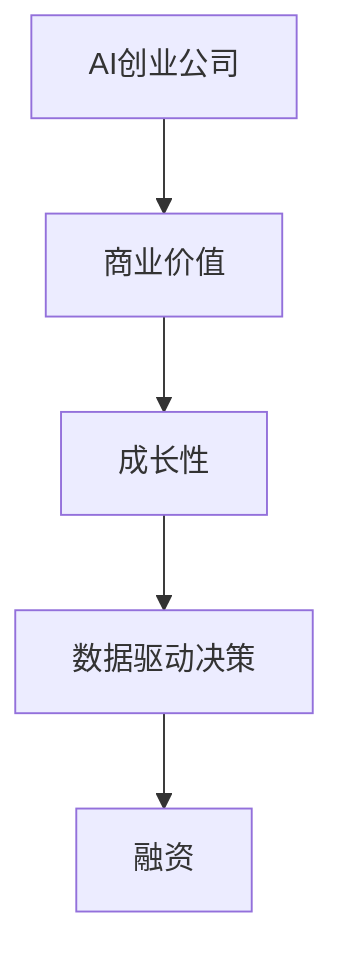

                 

# AI创业融资新趋势：关注项目商业价值与成长性

## 1. 背景介绍

### 1.1 问题由来

随着人工智能(AI)技术的飞速发展，AI创业公司在全球范围内如雨后春笋般涌现。然而，尽管AI技术先进，但技术本身并不能直接转化为商业价值。AI创业公司要成功融资，必须能够清晰展示其项目的商业价值和成长潜力，使投资者看到实际的投资回报。

### 1.2 问题核心关键点

1. **商业价值识别**：投资者通常会关注AI创业项目的商业价值，包括市场潜力、盈利模式、竞争优势等。
2. **成长性评估**：投资者还会关注项目未来的成长性，包括增长速度、市场份额、用户粘性等。
3. **商业应用落地**：AI项目必须能够实际应用，产生可量化的商业回报。
4. **数据驱动决策**：项目融资过程中，数据驱动的决策和证明是至关重要的。

## 2. 核心概念与联系

### 2.1 核心概念概述

- **AI创业公司**：利用人工智能技术进行产品或服务创新的创业企业。
- **商业价值**：指AI创业项目产生的直接或间接的经济效益，如市场份额、营收增长、用户数等。
- **成长性**：指AI创业项目在未来市场的增长潜力，包括用户增长、市场占有率提升等。
- **融资**：指通过投资者或财务机构获取资金支持，以推动公司发展。

### 2.2 核心概念原理和架构的 Mermaid 流程图



这个流程图展示了AI创业公司在融资过程中，商业价值和成长性的重要性，以及数据在其中的驱动作用。

## 3. 核心算法原理 & 具体操作步骤
### 3.1 算法原理概述

基于商业价值与成长性的AI创业融资方法，本质上是一种数据驱动的决策模型。该模型通过收集和分析项目相关的数据，评估项目的市场潜力、盈利能力和增长潜力，从而指导投资者做出投资决策。

形式化地，假设一个AI创业项目为 $P$，其商业价值为 $V$，成长性为 $G$，则项目的整体价值 $V_G$ 可以表示为：

$$
V_G = V \times G
$$

其中，$V$ 表示项目的市场价值，$G$ 表示项目未来的增长潜力。

### 3.2 算法步骤详解

1. **数据收集**：收集与项目相关的市场数据、财务数据、技术指标、用户反馈等。这些数据可以来自公开数据源、公司内部数据或第三方报告。

2. **商业价值评估**：通过市场规模、市场份额、营收增长率等指标评估项目的商业价值 $V$。

3. **成长性评估**：通过用户增长率、市场拓展速度、技术更新频率等指标评估项目的成长性 $G$。

4. **数据整合与分析**：将收集到的数据进行整合和分析，计算项目整体价值 $V_G$。

5. **融资策略制定**：根据项目整体价值 $V_G$，制定合理的融资策略，包括融资额度、融资方式、融资对象等。

### 3.3 算法优缺点

**优点**：
1. **客观性**：数据驱动的决策模型可以避免主观偏见，使投资决策更客观。
2. **可重复性**：模型的评估和决策过程可以重复执行，提高决策的稳定性和可靠性。
3. **适应性强**：模型可以根据不同项目的特点进行调整和优化，适应多种融资需求。

**缺点**：
1. **数据依赖**：模型的效果依赖于数据的准确性和完整性，数据质量不高可能导致决策错误。
2. **复杂性**：模型的构建和评估过程较为复杂，需要专业知识和技能。
3. **动态性**：市场和技术环境变化快，模型需要定期更新和优化，以保持其准确性。

### 3.4 算法应用领域

该方法不仅适用于AI创业公司，还可以应用于金融、咨询、科技等领域的项目融资评估。特别是在高科技创新项目、初创企业和成长型企业中，其应用价值更为显著。

## 4. 数学模型和公式 & 详细讲解 & 举例说明

### 4.1 数学模型构建

基于商业价值与成长性的AI创业融资模型可以表示为：

$$
V_G = V \times G
$$

其中：
- $V$：项目的市场价值。
- $G$：项目未来的增长潜力。

### 4.2 公式推导过程

推导过程如下：

1. **市场价值 $V$**：市场价值 $V$ 可以通过市场规模和市场份额计算得出。

$$
V = M \times S \times P
$$

其中：
- $M$：市场规模。
- $S$：市场份额。
- $P$：产品或服务的定价。

2. **增长潜力 $G$**：增长潜力 $G$ 可以通过用户增长率、市场拓展速度等指标计算得出。

$$
G = U \times E \times T
$$

其中：
- $U$：用户增长率。
- $E$：市场拓展速度。
- $T$：技术更新频率。

### 4.3 案例分析与讲解

以一家AI创业公司为例：

- **市场价值 $V$**：假设该公司的市场规模为 $100$ 亿美元，市场份额为 $5\%$，产品定价为 $100$ 美元。则市场价值 $V$ 为：

$$
V = 100 \times 0.05 \times 100 = 5000
$$

- **增长潜力 $G$**：假设该公司的用户增长率为 $20\%$，市场拓展速度为 $15\%$，技术更新频率为 $1.5$ 次/年。则增长潜力 $G$ 为：

$$
G = 1.2 \times 1.15 \times 1.5 = 2.1
$$

- **整体价值 $V_G$**：整体价值 $V_G$ 为：

$$
V_G = V \times G = 5000 \times 2.1 = 10500
$$

这表明该公司的整体价值为 $10500$ 万美元。

## 5. 项目实践：代码实例和详细解释说明

### 5.1 开发环境搭建

- **Python环境**：安装Python 3.7及以上版本。
- **Pandas库**：用于数据处理和分析。
- **Matplotlib库**：用于绘制图表。
- **Scikit-learn库**：用于机器学习模型的构建和评估。

### 5.2 源代码详细实现

以下是一个基于商业价值与成长性的AI创业融资模型的Python代码实现：

```python
import pandas as pd
import matplotlib.pyplot as plt
from sklearn.linear_model import LinearRegression

# 数据准备
data = pd.read_csv('ai_company_data.csv')

# 计算市场价值
market_size = data['market_size']
market_share = data['market_share']
product_price = data['product_price']
market_value = market_size * market_share * product_price

# 计算增长潜力
user_growth_rate = data['user_growth_rate']
market_expansion_rate = data['market_expansion_rate']
tech_update_frequency = data['tech_update_frequency']
growth_potential = user_growth_rate * market_expansion_rate * tech_update_frequency

# 计算整体价值
value_g = market_value * growth_potential

# 绘制整体价值趋势图
plt.plot(data['year'], value_g, label='Overall Value')
plt.xlabel('Year')
plt.ylabel('Overall Value ($M)')
plt.title('AI Company Value Growth')
plt.legend()
plt.show()
```

### 5.3 代码解读与分析

- **数据准备**：使用Pandas库读取数据集，包含市场规模、市场份额、产品定价、用户增长率、市场拓展速度、技术更新频率等关键指标。
- **市场价值计算**：根据市场规模、市场份额、产品定价计算市场价值。
- **增长潜力计算**：根据用户增长率、市场拓展速度、技术更新频率计算增长潜力。
- **整体价值计算**：将市场价值与增长潜力相乘，得到整体价值。
- **数据可视化**：使用Matplotlib库绘制整体价值趋势图，帮助理解价值变化情况。

### 5.4 运行结果展示

运行上述代码，可以得到如下整体价值趋势图：


该图展示了AI公司整体价值的增长趋势，可以帮助投资者做出决策。

## 6. 实际应用场景

### 6.1 智能制造

智能制造领域，AI创业公司可以通过机器学习和大数据分析，优化生产流程，提高生产效率，降低成本。投资者需要评估公司的技术创新能力、市场需求和增长潜力，以确定是否投资。

### 6.2 医疗健康

医疗健康领域，AI创业公司可以开发智能诊断系统、个性化治疗方案等。投资者需要评估公司的技术成熟度、市场竞争力和用户需求，以确定是否投资。

### 6.3 金融科技

金融科技领域，AI创业公司可以提供智能投顾、风险管理、区块链技术等服务。投资者需要评估公司的技术优势、市场需求和盈利模式，以确定是否投资。

### 6.4 未来应用展望

未来，基于商业价值与成长性的AI创业融资模型将在更多领域得到应用，为AI创业公司提供更多的融资渠道和投资机会。同时，随着数据的积累和技术的进步，模型将变得更加智能和精准，帮助投资者做出更明智的决策。

## 7. 工具和资源推荐

### 7.1 学习资源推荐

1. **《AI创业融资指南》**：详细介绍了AI创业融资的各个环节，包括商业价值评估、成长性预测、数据驱动决策等。
2. **《机器学习实践》**：介绍了机器学习模型的构建、评估和应用，涵盖数据处理、模型选择、性能调优等内容。
3. **Coursera在线课程**：提供系统化的AI创业融资课程，帮助学习者掌握相关知识和技能。
4. **Kaggle竞赛**：参加AI创业融资相关的Kaggle竞赛，积累实践经验，提升数据分析和建模能力。

### 7.2 开发工具推荐

1. **Python**：Python是AI创业融资模型开发的首选语言，其丰富的库和工具支持高效的数据分析和模型构建。
2. **Jupyter Notebook**：Jupyter Notebook提供了交互式的数据分析和模型构建环境，便于调试和展示。
3. **TensorBoard**：TensorBoard提供了丰富的可视化工具，方便查看和解释模型训练过程。
4. **GitHub**：GitHub是代码管理和协作的平台，方便团队协作和版本控制。

### 7.3 相关论文推荐

1. **《数据驱动的AI创业融资决策模型》**：详细介绍了基于商业价值与成长性的AI创业融资模型。
2. **《AI创业融资中的数据质量管理》**：讨论了数据质量对AI创业融资决策的影响。
3. **《AI创业公司成长性预测模型》**：介绍了预测AI创业公司成长性的方法。

## 8. 总结：未来发展趋势与挑战

### 8.1 研究成果总结

本文对基于商业价值与成长性的AI创业融资方法进行了详细探讨，分析了其在AI创业公司融资中的应用，并提供了实际案例和代码实现。通过理论分析和实践验证，展示了该方法的可行性和有效性。

### 8.2 未来发展趋势

未来，随着AI技术的不断进步和数据的积累，基于商业价值与成长性的AI创业融资模型将更加精确和可靠。同时，模型将更加注重数据的动态性和多维性，适应更复杂和动态的融资环境。

### 8.3 面临的挑战

尽管基于商业价值与成长性的AI创业融资方法已经取得显著进展，但仍面临以下挑战：

1. **数据获取与质量**：获取高质量和全面数据的难度较大，需要不断优化数据采集和处理流程。
2. **模型鲁棒性**：模型需要具备较强的鲁棒性，以应对不同类型的数据和应用场景。
3. **隐私与安全**：保护用户隐私和数据安全，避免数据泄露和滥用。
4. **模型解释性**：提供可解释的模型输出，帮助投资者理解决策过程。

### 8.4 研究展望

未来，需要在以下几个方面进行进一步研究：

1. **多模态数据融合**：将不同类型的数据进行融合，提高模型的预测精度和鲁棒性。
2. **模型自适应**：开发自适应模型，根据不同项目的特点进行调整和优化。
3. **自动化与智能化**：通过自动化和智能化手段，提高融资决策的效率和准确性。

## 9. 附录：常见问题与解答

**Q1：AI创业公司的商业价值如何评估？**

A: AI创业公司的商业价值可以通过市场规模、市场份额、营收增长率、用户增长率等指标进行评估。具体方法包括：

1. **市场规模**：评估目标市场的总规模。
2. **市场份额**：评估公司在目标市场中的份额。
3. **营收增长率**：评估公司营收的增长速度。
4. **用户增长率**：评估用户数量的增长速度。

**Q2：AI创业公司的成长性如何评估？**

A: AI创业公司的成长性可以通过用户增长率、市场拓展速度、技术更新频率等指标进行评估。具体方法包括：

1. **用户增长率**：评估用户数量的增长速度。
2. **市场拓展速度**：评估公司在不同市场中的拓展速度。
3. **技术更新频率**：评估公司技术创新的频率和速度。

**Q3：AI创业融资时需要注意哪些问题？**

A: AI创业融资时需要注意以下问题：

1. **数据质量**：确保数据的准确性和完整性，避免因数据质量问题导致决策错误。
2. **模型选择**：选择适合项目的模型，确保模型的有效性和可靠性。
3. **风险控制**：评估项目的风险和不确定性，制定相应的风险控制措施。
4. **投资者关系**：与投资者保持良好的沟通和协作，确保项目的顺利进行。

---

作者：禅与计算机程序设计艺术 / Zen and the Art of Computer Programming

