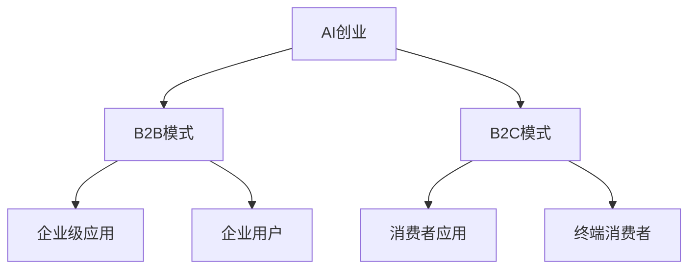

                 

# AI创业：B2B与B2C模式分析

> 关键词：AI创业, B2B模式, B2C模式, 企业级应用, 消费者应用, 人工智能市场, 商业策略

## 1. 背景介绍

随着人工智能技术的迅猛发展，越来越多的企业和创业者看到了一个充满机遇的市场。无论是B2B（企业对企业）还是B2C（企业对消费者），AI创业都展现出了巨大的潜力。然而，不同的商业模式有着不同的市场环境和适用场景，本文将从这两个角度出发，探讨AI创业的机遇与挑战。

## 2. 核心概念与联系

### 2.1 核心概念概述

在探讨B2B与B2C模式时，需要先理解几个核心概念：

- **AI创业**：利用人工智能技术进行创业，包括但不限于机器学习、深度学习、自然语言处理等领域。
- **B2B模式**：企业通过直接向其他企业提供产品或服务来实现商业化。
- **B2C模式**：企业直接向消费者提供产品或服务。
- **企业级应用**：指面向企业用户，用于提高效率、降低成本、创造价值的软件和服务。
- **消费者应用**：面向终端消费者，旨在提升用户体验、优化消费选择、满足个性化需求的应用。

这些概念之间的关系可以通过以下Mermaid流程图来展示：



## 3. 核心算法原理 & 具体操作步骤

### 3.1 算法原理概述

B2B与B2C模式在AI创业中的应用有着不同的算法原理和操作步骤。以下是详细分析：

#### 3.1.1 B2B模式

B2B模式中，AI企业通常会为企业客户提供定制化、高效的解决方案。算法原理主要包括以下几个方面：

- **数据预处理**：从企业提供的数据中提取有用的特征，去除噪音。
- **模型训练**：使用监督学习、无监督学习或强化学习等方法训练模型。
- **模型部署**：将训练好的模型部署到企业内部系统中，进行实时处理。
- **效果评估**：通过企业提供的反馈数据，评估模型效果。

#### 3.1.2 B2C模式

B2C模式中，AI企业主要面向终端消费者，提供个性化、便捷的智能服务。算法原理主要包括以下几个方面：

- **用户画像**：通过收集用户的在线行为、购买历史等信息，构建用户画像。
- **推荐系统**：根据用户画像，利用协同过滤、基于内容的推荐等算法，推荐商品或服务。
- **自然语言处理**：通过NLP技术，解析用户查询，生成智能回复。
- **效果评估**：通过用户的点击率、转化率等指标，评估推荐系统的性能。

### 3.2 算法步骤详解

#### 3.2.1 B2B模式

1. **需求分析**：与企业客户沟通，明确需求。
2. **数据收集**：根据需求，收集企业数据。
3. **数据清洗**：对收集到的数据进行清洗，提取特征。
4. **模型选择**：根据任务选择合适的模型（如决策树、神经网络、SVM等）。
5. **模型训练**：使用数据集训练模型。
6. **模型部署**：将训练好的模型部署到企业系统中。
7. **效果评估**：收集反馈数据，评估模型效果。
8. **持续优化**：根据反馈，持续优化模型。

#### 3.2.2 B2C模式

1. **用户数据收集**：收集用户的基本信息和行为数据。
2. **用户画像构建**：根据收集到的数据，构建用户画像。
3. **推荐系统设计**：设计推荐算法，如协同过滤、基于内容的推荐等。
4. **推荐系统训练**：使用用户数据训练推荐系统。
5. **自然语言处理**：使用NLP技术解析用户查询，生成智能回复。
6. **效果评估**：收集用户反馈数据，评估推荐系统性能。
7. **持续优化**：根据反馈，持续优化推荐系统和自然语言处理模型。

### 3.3 算法优缺点

#### 3.3.1 B2B模式

**优点**：

- **定制化**：能根据企业需求，提供量身定制的解决方案。
- **高精度**：通常数据质量较高，模型训练精度高。
- **稳定回报**：企业客户对长期合作信任度较高，回报稳定。

**缺点**：

- **高成本**：数据收集、模型定制和部署成本较高。
- **灵活性差**：定制化解决方案通常缺乏通用性，难以快速适应新需求。

#### 3.3.2 B2C模式

**优点**：

- **低成本**：用户数据容易获取，算法模型通常较为通用。
- **高灵活性**：快速响应市场需求，用户反馈直接影响模型改进。
- **市场大**：面向消费者，市场规模大，潜力无限。

**缺点**：

- **数据隐私**：用户数据隐私保护问题突出，存在法律风险。
- **竞争激烈**：市场竞争激烈，难以脱颖而出。
- **用户满意度**：用户体验要求高，满意度直接影响用户留存率。

### 3.4 算法应用领域

#### 3.4.1 B2B模式

- **智能客服**：为企业提供24/7的客户服务，提升客户满意度。
- **供应链管理**：优化企业的供应链管理，降低成本，提高效率。
- **风险管理**：通过数据分析，预测风险，辅助企业决策。
- **市场营销**：利用数据分析，精准投放广告，提高营销效果。

#### 3.4.2 B2C模式

- **智能推荐**：根据用户兴趣，推荐商品或服务。
- **智能搜索**：通过自然语言处理，提供智能搜索服务。
- **个性化广告**：根据用户行为，精准投放广告。
- **情感分析**：分析用户评论和反馈，提升产品和服务质量。

## 4. 数学模型和公式 & 详细讲解 & 举例说明

### 4.1 数学模型构建

在B2B和B2C模式中，常用的数学模型包括回归模型、分类模型、聚类模型等。

#### 4.1.1 B2B模式

**回归模型**：

- **线性回归**：$y = \beta_0 + \beta_1 x_1 + \beta_2 x_2 + ... + \beta_n x_n + \epsilon$
- **多项式回归**：$y = \beta_0 + \beta_1 x_1^k + \beta_2 x_2^k + ... + \beta_n x_n^k + \epsilon$

**分类模型**：

- **逻辑回归**：$P(Y=1) = \sigma(\beta_0 + \beta_1 x_1 + \beta_2 x_2 + ... + \beta_n x_n)$
- **支持向量机**：$arg\max_{\theta}(\sum_{i=1}^{n} \alpha_i - \frac{1}{2} \sum_{i,j=1}^{n} \alpha_i \alpha_j y_i y_j \langle x_i, x_j \rangle - C \sum_{i=1}^{n} \alpha_i)$

#### 4.1.2 B2C模式

**协同过滤**：

- **基于用户的协同过滤**：$similarity(x_i, x_j) = \frac{\sum_{k \in I} p_k(x_i) p_k(x_j)}{\sqrt{\sum_{k \in I} p_k(x_i)^2} \sqrt{\sum_{k \in I} p_k(x_j)^2}}$
- **基于物品的协同过滤**：$similarity(i, j) = \frac{\sum_{k \in I} r_{ik} r_{jk}}{\sqrt{\sum_{k \in I} r_{ik}^2} \sqrt{\sum_{k \in I} r_{jk}^2}}$

**基于内容的推荐**：

- **基于项目的推荐**：$\hat{r}_{ui} = \alpha \langle u, p_i \rangle + (1-\alpha) r_{mi}$
- **基于用户的推荐**：$\hat{r}_{ui} = \alpha \langle u, p_i \rangle + (1-\alpha) \frac{\sum_{j \in N_i} r_{uj} \langle j, p_i \rangle}{\sum_{j \in N_i} r_{uj}}$

### 4.2 公式推导过程

#### 4.2.1 B2B模式

以回归模型为例，推导线性回归的公式：

- **目标函数**：$\min_{\beta_0, \beta_1} \frac{1}{2N} \sum_{i=1}^{N} (y_i - (\beta_0 + \beta_1 x_{i1}))^2$
- **梯度下降**：$\beta_0^{t+1} = \beta_0^t - \alpha \frac{\sum_{i=1}^{N} (y_i - (\beta_0^t + \beta_1^t x_{i1}))}{N}$
- **最终结果**：$\beta_0 = \frac{\sum_{i=1}^{N} (y_i - \bar{y}) x_{i1} - \sum_{i=1}^{N} x_{i1} (\sum_{i=1}^{N} (y_i - \bar{y}))/N}{\sum_{i=1}^{N} x_{i1}^2 - (\sum_{i=1}^{N} x_{i1})^2/N}$

#### 4.2.2 B2C模式

以协同过滤为例，推导基于用户的协同过滤公式：

- **相似度计算**：$similarity(x_i, x_j) = \frac{\sum_{k \in I} p_k(x_i) p_k(x_j)}{\sqrt{\sum_{k \in I} p_k(x_i)^2} \sqrt{\sum_{k \in I} p_k(x_j)^2}}$
- **评分预测**：$\hat{r}_{ui} = \sum_{j \in N_i} \frac{r_{uj}}{\sigma(\hat{s}_{u}) + \epsilon} * \frac{\sigma(\hat{s}_j)}{\sum_{j \in N_i} \frac{\sigma(\hat{s}_j)}{\sigma(\hat{s}_{u}) + \epsilon}}$

### 4.3 案例分析与讲解

#### 4.3.1 B2B模式

**案例1：智能供应链管理**

某制造企业希望优化其供应链管理，提高物流效率，降低成本。通过与AI企业合作，部署了一套智能供应链管理系统。该系统基于机器学习模型，分析历史订单数据，预测需求变化，优化库存管理，从而大大提高了企业的运营效率和响应速度。

**案例2：风险管理**

某金融企业希望降低贷款风险，通过AI企业提供的风险管理解决方案，利用大数据和机器学习模型，分析借款人的历史行为数据，预测其还款能力，从而降低了贷款违约率，提高了风险控制能力。

#### 4.3.2 B2C模式

**案例1：智能推荐**

某电商平台希望提升用户体验，通过与AI企业合作，部署了一套智能推荐系统。该系统利用协同过滤算法，根据用户的历史购买记录和浏览行为，推荐相关商品，大幅提高了用户的购买转化率和满意度。

**案例2：智能客服**

某电信运营商希望提高客户服务效率，通过与AI企业合作，部署了一套智能客服系统。该系统利用自然语言处理技术，自动解答用户咨询，提升了服务响应速度和用户满意度。

## 5. 项目实践：代码实例和详细解释说明

### 5.1 开发环境搭建

#### 5.1.1 B2B模式

在B2B模式中，开发环境通常需要企业内部网络支持，且需要访问大量的企业数据。以下是Python环境下搭建B2B开发环境的示例：

1. **安装Python**：
   ```bash
   sudo apt-get update
   sudo apt-get install python3-pip
   ```

2. **安装必要的库**：
   ```bash
   pip install pandas numpy scikit-learn tensorflow
   ```

3. **安装企业内部网络**：
   ```bash
   sudo apt-get install openvpn
   sudo apt-get install VirtualBox
   ```

#### 5.1.2 B2C模式

在B2C模式中，开发环境通常需要在云平台上搭建，以便快速迭代和部署。以下是使用AWS搭建B2C开发环境的示例：

1. **创建EC2实例**：
   ```bash
   aws ec2 run-instances --image-id ami-0c55b159e7e7c09f9 --count 1 --instance-type t2.micro --key-name my-key-pair --security-group-ids sg-0123456789
   ```

2. **安装必要的库**：
   ```bash
   sudo apt-get update
   sudo apt-get install python3-pip
   ```

3. **安装AWS CLI**：
   ```bash
   pip install awscli
   aws configure
   ```

### 5.2 源代码详细实现

#### 5.2.1 B2B模式

以供应链管理为例，以下是使用Python实现机器学习模型的代码：

```python
import pandas as pd
from sklearn.linear_model import LinearRegression

# 读取数据
data = pd.read_csv('supply_chain_data.csv')

# 数据预处理
X = data[['demand', 'cost', 'lead_time']] # 特征
y = data['inventories'] # 目标变量

# 训练模型
model = LinearRegression()
model.fit(X, y)

# 预测
y_pred = model.predict(X)
```

#### 5.2.2 B2C模式

以智能推荐为例，以下是使用Python实现协同过滤的代码：

```python
import numpy as np
from scipy.spatial.distance import cosine

# 读取数据
ratings = pd.read_csv('ratings.csv')
movies = pd.read_csv('movies.csv')

# 用户-电影评分矩阵
movie_ratings = np.array(ratings[['movie_id', 'rating']])

# 计算相似度
def similarity(u, v):
    return 1 - cosine(movie_ratings[u], movie_ratings[v])

# 评分预测
def predict_ratings(user_id):
    similarities = [(similarity(i, user_id), ratings.iloc[i]['rating']) for i in range(len(ratings))]
    return np.mean([rating for similarity, rating in sorted(similarities)[-5:]], axis=0)
```

### 5.3 代码解读与分析

#### 5.3.1 B2B模式

**代码解读**：

- **数据预处理**：首先，从供应链数据中提取特征和目标变量，进行数据预处理。
- **模型训练**：使用线性回归模型，对数据进行训练。
- **预测**：使用训练好的模型，对新的供应链数据进行预测。

**代码分析**：

- **特征选择**：选择与目标变量相关的特征，如需求、成本和交货时间，确保模型预测准确性。
- **模型调参**：选择合适的模型参数，如学习率、正则化系数等，避免过拟合和欠拟合。
- **模型评估**：通过均方误差等指标，评估模型的性能。

#### 5.3.2 B2C模式

**代码解读**：

- **数据预处理**：读取用户和电影评分数据，构建用户-电影评分矩阵。
- **相似度计算**：计算用户之间的相似度，用于协同过滤推荐。
- **评分预测**：根据用户的评分历史，预测用户对电影的评分。

**代码分析**：

- **相似度计算**：使用余弦相似度计算用户之间的相似度，确保推荐系统的公平性和多样性。
- **评分预测**：基于协同过滤算法，根据用户的评分历史，推荐用户可能感兴趣的电影。
- **模型优化**：通过调整相似度计算方法和评分预测公式，优化推荐系统的性能。

### 5.4 运行结果展示

#### 5.4.1 B2B模式

**运行结果**：

```python
from sklearn.metrics import mean_squared_error

# 预测结果
y_pred = model.predict(X)

# 评估模型
mse = mean_squared_error(y, y_pred)
print(f'Mean Squared Error: {mse}')
```

**结果解释**：

- **模型评估**：通过均方误差评估模型的预测性能，输出模型评估结果。
- **调整模型**：根据评估结果，调整模型参数，提升预测精度。

#### 5.4.2 B2C模式

**运行结果**：

```python
# 预测评分
user_id = 1
predicted_rating = predict_ratings(user_id)

# 输出预测评分
print(f'Predicted rating for user {user_id}: {predicted_rating}')
```

**结果解释**：

- **评分预测**：根据用户的历史评分数据，预测其对新电影的评分。
- **推荐电影**：根据预测评分，推荐用户可能感兴趣的电影。
- **调整模型**：根据用户反馈，调整推荐算法，提高推荐系统的准确性。

## 6. 实际应用场景

### 6.1 B2B模式

#### 6.1.1 制造业

在制造业中，智能供应链管理、设备维护预测等应用场景广泛。企业可以通过AI技术，实现生产流程的优化、设备故障的预防和维修、库存管理等，从而提高生产效率，降低成本。

#### 6.1.2 金融业

在金融业中，风险管理、信用评估、欺诈检测等应用场景较多。通过AI技术，金融机构可以实现精准的风险评估和欺诈检测，提升金融安全性和客户满意度。

### 6.2 B2C模式

#### 6.2.1 电商零售

在电商零售中，智能推荐、智能客服、价格优化等应用场景广泛。电商平台可以通过AI技术，实现精准推荐，提高用户满意度，提升销售转化率。

#### 6.2.2 媒体娱乐

在媒体娱乐中，个性化推荐、智能广告投放、内容生成等应用场景较多。媒体企业可以通过AI技术，实现个性化的内容推荐和广告投放，提升用户体验和广告效果。

## 7. 工具和资源推荐

### 7.1 学习资源推荐

#### 7.1.1 B2B模式

- **机器学习课程**：Coursera的《机器学习》课程，由斯坦福大学教授Andrew Ng讲授。
- **深度学习框架**：TensorFlow官方文档，介绍深度学习框架的使用方法和最佳实践。
- **供应链管理书籍**：《智能供应链管理》，介绍供应链管理的智能技术应用。

#### 7.1.2 B2C模式

- **推荐系统书籍**：《推荐系统实践》，介绍推荐系统的设计、实现和优化。
- **NLP技术教程**：Hugging Face的NLP库教程，介绍NLP技术的实现方法。
- **用户体验设计书籍**：《设计心理学》，介绍用户体验设计的原理和实践。

### 7.2 开发工具推荐

#### 7.2.1 B2B模式

- **机器学习框架**：TensorFlow、Scikit-Learn、PyTorch。
- **大数据处理**：Hadoop、Spark。
- **数据可视化**：Matplotlib、Seaborn、Tableau。

#### 7.2.2 B2C模式

- **推荐系统框架**：TensorFlow Recommenders、PyTorch Lightening。
- **NLP框架**：Hugging Face Transformers、NLTK。
- **用户体验设计工具**：Adobe XD、Sketch。

### 7.3 相关论文推荐

#### 7.3.1 B2B模式

- **《机器学习实战》**：介绍机器学习算法的实现方法。
- **《深度学习》**：介绍深度学习的基本原理和应用场景。
- **《供应链管理》**：介绍供应链管理的理论基础和实践方法。

#### 7.3.2 B2C模式

- **《推荐系统》**：介绍推荐系统的基本原理和算法实现。
- **《自然语言处理》**：介绍自然语言处理的基本原理和应用场景。
- **《用户体验设计》**：介绍用户体验设计的理论基础和实践方法。

## 8. 总结：未来发展趋势与挑战

### 8.1 研究成果总结

通过对比B2B和B2C模式，我们发现AI创业在企业级应用和消费者应用中的潜力和差异。企业级应用通常需要定制化解决方案，能够大幅提升企业的运营效率和决策水平；消费者应用则侧重于个性化推荐和智能客服，提升用户体验和满意度。

### 8.2 未来发展趋势

#### 8.2.1 B2B模式

- **AI中台建设**：企业级AI应用将逐步向AI中台化转变，提升AI应用的复用性和效率。
- **数据驱动决策**：企业将更加依赖AI技术，实现数据驱动的决策和管理。
- **生态系统建设**：企业将构建自己的AI生态系统，涵盖数据、算法、技术等多个方面。

#### 8.2.2 B2C模式

- **个性化推荐**：AI技术将进一步提升个性化推荐的精准度和覆盖面。
- **智能客服**：智能客服将逐步普及，提升客户服务的效率和质量。
- **内容生成**：AI技术将实现更智能、更灵活的内容生成，提升内容创作效率。

### 8.3 面临的挑战

#### 8.3.1 B2B模式

- **数据安全和隐私**：企业级AI应用需要处理大量敏感数据，数据安全和隐私问题突出。
- **定制化成本高**：企业级AI应用需要高度定制，开发和部署成本高。
- **模型复杂度高**：企业级AI应用需要处理复杂的业务场景，模型复杂度高。

#### 8.3.2 B2C模式

- **用户隐私保护**：消费者应用需要处理大量用户数据，用户隐私保护问题突出。
- **市场竞争激烈**：消费者应用市场竞争激烈，难以脱颖而出。
- **用户体验提升**：消费者应用需要不断提升用户体验，满足用户需求。

### 8.4 研究展望

未来，B2B和B2C模式将在AI创业中发挥越来越重要的作用。随着AI技术的不断进步，我们可以预见到AI创业将更加智能、高效、个性化，为各行各业带来深远的变革。然而，要实现这一目标，我们还需要克服数据安全和隐私、定制化成本高、市场竞争激烈等挑战，推动AI技术的可持续发展。

## 9. 附录：常见问题与解答

**Q1：AI创业和传统创业有何不同？**

A: AI创业和传统创业最大的不同在于技术驱动的创新。AI创业通常需要深厚的技术积累和持续的算法创新，而传统创业则更多依赖市场敏锐度和运营管理。

**Q2：AI创业在B2B和B2C模式中各自的优势是什么？**

A: B2B模式的优势在于可以提供高度定制化、高精度的解决方案，满足企业用户的特定需求。B2C模式的优势在于能够快速迭代、高效响应市场变化，提升用户体验。

**Q3：如何应对AI创业中的数据隐私问题？**

A: 数据隐私保护是AI创业的重要挑战。可以通过数据匿名化、差分隐私等技术手段，保护用户数据隐私。同时，制定严格的数据使用和存储规范，建立隐私保护机制。

**Q4：AI创业中如何实现模型复用？**

A: 建立AI中台是实现模型复用的重要手段。通过构建统一的AI中台，可以实现模型的标准化和模块化，提升模型复用性和开发效率。

**Q5：AI创业中如何应对市场竞争？**

A: 面对激烈的市场竞争，AI创业需要不断优化模型和算法，提升技术壁垒。同时，建立有效的市场推广和品牌建设策略，提升市场知名度和用户黏性。

---

作者：禅与计算机程序设计艺术 / Zen and the Art of Computer Programming

