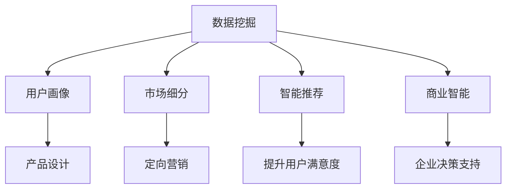

                 

# AI创业：市场需求的识别方法

> 关键词：人工智能, 市场需求, 用户画像, 数据挖掘, 智能推荐, 数据分析, 商业智能

## 1. 背景介绍

### 1.1 问题由来
在人工智能(AI)领域，创业公司面临着多种挑战，其中最核心的问题是如何识别市场需求并构建用户画像。一个优秀的AI产品往往需要对目标用户群有深入理解，才能精准把握用户需求，并设计出符合用户心理和行为的产品。因此，如何识别市场需求，并在此基础上构建准确的客户画像，成为AI创业公司的重要课题。

### 1.2 问题核心关键点
识别市场需求，构建客户画像，实际上是一个数据挖掘和用户行为分析的过程。其核心在于：

1. **数据收集与整理**：收集用户的原始数据，并对数据进行清洗、预处理和特征工程。
2. **用户行为分析**：对用户的行为数据进行分析，挖掘用户兴趣、偏好和需求。
3. **客户画像构建**：基于用户行为数据，构建精细化的客户画像，帮助产品设计更加贴合用户需求。
4. **市场细分**：将用户群体进行细分，识别不同细分市场中的需求差异。

本文将从以上四个方面，详细介绍识别市场需求和构建客户画像的方法。

## 2. 核心概念与联系

### 2.1 核心概念概述

为更好地理解市场需求识别方法，本节将介绍几个密切相关的核心概念：

- **数据挖掘(Data Mining)**：从大量数据中提取有用的知识和信息，包括用户行为数据、市场交易数据、社会媒体数据等。
- **用户画像(User Persona)**：基于用户行为和背景数据，构建细粒度的用户模型，帮助企业更好地理解用户需求。
- **市场细分(Market Segmentation)**：将市场划分为若干子市场，以便更有针对性地进行产品设计和市场推广。
- **智能推荐(Recommendation System)**：通过分析用户行为数据，推荐用户可能感兴趣的商品或服务。
- **商业智能(Business Intelligence)**：利用数据挖掘和分析技术，为企业决策提供支持。

这些核心概念之间的逻辑关系可以通过以下Mermaid流程图来展示：



这个流程图展示了各个概念之间的联系：

1. 数据挖掘从原始数据中提取信息。
2. 用户画像是基于数据挖掘得到的信息构建的。
3. 市场细分是基于用户画像对市场进行的划分。
4. 智能推荐利用用户画像和市场细分信息进行推荐。
5. 商业智能则为企业决策提供支持。

这些概念共同构成了市场需求识别的技术框架，通过数据挖掘、用户画像构建和市场细分，能够更好地识别市场需求，提升产品设计和市场推广的精准度。

## 3. 核心算法原理 & 具体操作步骤
### 3.1 算法原理概述

市场需求识别和用户画像构建，本质上是一个数据驱动的分析和建模过程。其核心思想是：通过数据分析挖掘用户的行为模式和需求偏好，并在此基础上进行模型构建，从而获得精准的用户画像和市场需求洞察。

形式化地，假设我们有一个用户行为数据集 $D$，每个用户的行为数据表示为 $(x_i,y_i)$，其中 $x_i$ 是用户的特征向量，$y_i$ 是用户行为标签。市场需求识别的目标是通过数据挖掘算法，找到最优的模型 $M$，使得模型在新的数据 $x'$ 上，能够准确预测用户行为标签 $y'$。即：

$$
M=\mathop{\arg\min}_{M} \mathcal{L}(M,D)
$$

其中 $\mathcal{L}$ 为损失函数，通常包括交叉熵损失、均方误差损失等。

### 3.2 算法步骤详解

基于市场需求识别和用户画像构建的技术流程，本节将详细介绍各个步骤：

**Step 1: 数据收集与预处理**

- **数据来源**：用户行为数据主要来源于电商平台、社交媒体、移动应用等。可以通过API接口、日志记录等方式进行数据采集。
- **数据清洗**：对采集到的数据进行去重、去噪、处理缺失值等预处理操作，以提升数据质量。
- **特征工程**：根据业务需求，选择和构建关键特征，如用户ID、购买频率、浏览时长等，并进行特征缩放和归一化处理。

**Step 2: 用户行为分析**

- **用户行为建模**：利用机器学习算法（如聚类、分类、回归等），对用户行为数据进行分析，识别出用户兴趣、偏好和需求。
- **用户分群**：根据用户行为模型，将用户分为不同的群体，以便进行市场细分和个性化推荐。
- **行为趋势分析**：分析用户行为随时间的变化趋势，识别出季节性、周期性特征。

**Step 3: 客户画像构建**

- **用户画像建模**：基于用户行为数据和背景数据（如年龄、性别、职业等），构建细粒度的用户画像。
- **画像维度设计**：设计用户画像的关键维度，如兴趣偏好、购买力、社交行为等，以便进行精准的市场推广和产品设计。
- **画像更新与维护**：定期更新用户画像，以便捕捉用户行为变化和市场动态。

**Step 4: 市场细分**

- **市场细分类别**：根据用户画像和行为数据，将市场划分为若干子市场，识别不同细分市场中的需求差异。
- **细分标准选择**：选择合适的细分标准，如地理位置、年龄、职业、兴趣等，以便更准确地进行市场划分。
- **细分模型评估**：使用评估指标（如覆盖率、精确度、召回率等）评估细分模型的效果，并进行优化调整。

**Step 5: 智能推荐**

- **推荐模型选择**：选择合适的推荐算法，如协同过滤、基于内容的推荐、深度学习推荐等，构建智能推荐系统。
- **推荐结果优化**：优化推荐算法的参数，提高推荐结果的相关性和个性化程度。
- **推荐结果评估**：使用A/B测试、点击率、转化率等指标评估推荐效果，并进行迭代优化。

### 3.3 算法优缺点

市场需求识别和用户画像构建方法具有以下优点：

1. **高效性**：利用数据挖掘技术，可以在较短时间内获取和处理大量数据，构建用户画像和市场需求洞察。
2. **精准性**：通过精确分析用户行为和背景数据，能够获得细粒度的用户画像和市场需求洞察。
3. **可扩展性**：该方法适用于各种规模的业务场景，可以灵活调整算法模型和特征工程策略。

同时，该方法也存在一定的局限性：

1. **数据依赖性强**：对数据质量和完整性要求高，数据采集和预处理过程复杂。
2. **模型复杂度高**：构建用户画像和市场需求模型涉及多维数据和多算法，模型复杂度高。
3. **用户隐私保护**：需要特别注意用户隐私保护，避免数据滥用。
4. **技术门槛高**：对数据挖掘和机器学习技术要求高，需要有专业技能的技术团队支持。

尽管存在这些局限性，但就目前而言，数据驱动的需求识别和用户画像构建方法仍然是AI创业公司获取市场洞察的核心手段。未来相关研究的重点在于如何进一步降低数据依赖，提高模型的可解释性和鲁棒性，同时兼顾隐私保护和业务需求。

### 3.4 算法应用领域

市场需求识别和用户画像构建方法，在多个领域得到了广泛应用，包括但不限于：

- **电子商务**：通过分析用户购买行为，推荐用户可能感兴趣的商品，提升用户体验和转化率。
- **社交媒体**：分析用户的互动行为，推荐相关内容，增强用户粘性。
- **移动应用**：通过用户行为数据，优化应用界面和功能，提高用户留存率。
- **金融服务**：通过分析用户交易行为，提供个性化金融产品推荐和风险控制。
- **医疗健康**：通过用户健康数据，推荐个性化医疗服务，提升用户健康管理效果。

除了上述这些经典应用外，市场需求识别和用户画像构建方法还在广告投放、旅游推荐、教育培训等领域得到了创新性应用，为各类业务场景带来了显著的提升。

## 4. 数学模型和公式 & 详细讲解 & 举例说明
### 4.1 数学模型构建

本节将使用数学语言对市场需求识别和用户画像构建过程进行更加严格的刻画。

假设用户行为数据集为 $D=\{(x_i,y_i)\}_{i=1}^N$，其中 $x_i$ 为用户的特征向量，$y_i$ 为行为标签。市场需求识别的目标是找到一个最优的模型 $M$，使得模型在新的数据 $x'$ 上，能够准确预测行为标签 $y'$。假设模型为线性回归模型，形式为：

$$
y_i=f(x_i;\theta)=\theta_0+\sum_{j=1}^m\theta_j x_{ij}
$$

其中 $\theta$ 为模型参数，$x_{ij}$ 为特征向量中的第 $j$ 个特征值。则经验风险为：

$$
\mathcal{L}(\theta)=\frac{1}{N}\sum_{i=1}^N(y_i-f(x_i;\theta))^2
$$

利用梯度下降等优化算法，最小化经验风险，即可得到最优模型参数：

$$
\theta^*=\mathop{\arg\min}_{\theta}\mathcal{L}(\theta)
$$

在实际应用中，我们通常使用基于梯度的优化算法（如SGD、Adam等）来近似求解上述最优化问题。

### 4.2 公式推导过程

以线性回归模型为例，推导最小二乘法求解最优参数的公式。

根据最小二乘法的原理，将经验风险对参数 $\theta$ 的梯度设置为零，可得：

$$
\frac{\partial \mathcal{L}(\theta)}{\partial \theta}=\frac{2}{N}\sum_{i=1}^N(y_i-f(x_i;\theta))x_i=0
$$

整理后得：

$$
\frac{1}{N}\sum_{i=1}^N(y_i-f(x_i;\theta))x_i=0
$$

解得最优参数：

$$
\theta^*=(X^TX)^{-1}X^Ty
$$

其中 $X=[x_1^Tx_2^T...x_N^T]$，$y=[y_1y_2...y_N]$。

在得到最优参数后，即可代入新数据 $x'$，计算预测标签 $y'$：

$$
y'=f(x';\theta^*)=\theta_0^*+\sum_{j=1}^m\theta_j^* x_{j'}^*
$$

以上就是利用线性回归模型进行市场需求识别和用户画像构建的数学推导过程。

### 4.3 案例分析与讲解

以用户画像构建为例，展示如何使用线性回归模型进行用户画像构建。

假设我们有一个电商平台，希望通过用户行为数据构建用户画像，以便进行个性化推荐。平台收集了用户的浏览记录、购买记录、评价记录等数据，包含以下特征：

- 用户ID：唯一标识用户
- 浏览次数：用户在平台上的浏览次数
- 购买金额：用户总购买金额
- 购买次数：用户总购买次数
- 平均购买金额：用户每次购买的平均金额
- 浏览时长：用户在平台上浏览的平均时长

将以上特征作为输入特征 $x_i$，将用户行为标签（如是否购买、购买金额等）作为输出标签 $y_i$，利用线性回归模型进行训练，得到用户画像模型：

$$
y_i=\theta_0+\theta_1x_{i1}+\theta_2x_{i2}+\theta_3x_{i3}+\theta_4x_{i4}+\theta_5x_{i5}
$$

其中 $\theta_0,\theta_1,\theta_2,\theta_3,\theta_4,\theta_5$ 为模型参数。

通过训练得到最优参数 $\theta^*$，即可对新用户进行画像预测，如：

- 用户ID：123456
- 浏览次数：100
- 购买金额：2000
- 购买次数：5
- 平均购买金额：400

代入模型得到预测值：

$$
y'=\theta_0^*+\theta_1^*x_{11}^*+\theta_2^*x_{21}^*+\theta_3^*x_{31}^*+\theta_4^*x_{41}^*+\theta_5^*x_{51}^*
$$

这样，我们就通过用户画像构建模型，对新用户进行了画像预测，实现了对用户行为特征的精准把握。

## 5. 项目实践：代码实例和详细解释说明
### 5.1 开发环境搭建

在进行市场需求识别和用户画像构建的实践前，我们需要准备好开发环境。以下是使用Python进行scikit-learn开发的环境配置流程：

1. 安装Anaconda：从官网下载并安装Anaconda，用于创建独立的Python环境。

2. 创建并激活虚拟环境：
```bash
conda create -n ml-env python=3.8 
conda activate ml-env
```

3. 安装scikit-learn：
```bash
pip install scikit-learn
```

4. 安装各类工具包：
```bash
pip install numpy pandas scikit-learn matplotlib tqdm jupyter notebook ipython
```

完成上述步骤后，即可在`ml-env`环境中开始实践。

### 5.2 源代码详细实现

下面我们以用户画像构建为例，给出使用scikit-learn库对线性回归模型进行用户画像构建的Python代码实现。

```python
from sklearn.linear_model import LinearRegression
from sklearn.metrics import mean_squared_error
from sklearn.model_selection import train_test_split

# 假设我们有一个用户行为数据集
# X为特征，y为标签
X = np.array([[1, 100, 2000, 5, 400], [2, 200, 3000, 10, 500], [3, 300, 4000, 20, 600], ...])
y = np.array([0, 1, 0, 1, 0])

# 分割训练集和测试集
X_train, X_test, y_train, y_test = train_test_split(X, y, test_size=0.2, random_state=42)

# 构建线性回归模型
model = LinearRegression()

# 训练模型
model.fit(X_train, y_train)

# 预测新用户画像
new_user = np.array([4, 500, 5000, 30, 1000])
y_pred = model.predict(new_user)

print(f"预测结果为: {y_pred}")
```

在上述代码中，我们使用scikit-learn的线性回归模型对用户画像进行构建和预测。通过训练和预测，我们可以得到一个新用户的画像预测结果，并据此进行个性化推荐和市场细分。

### 5.3 代码解读与分析

让我们再详细解读一下关键代码的实现细节：

**线性回归模型构建**：
- `LinearRegression`：sklearn库提供的线性回归模型，用于构建用户画像模型。
- `fit`方法：训练模型，输入训练集数据`X_train`和标签`y_train`。

**数据划分与训练**：
- `train_test_split`：将原始数据集划分为训练集和测试集，确保模型在测试集上表现稳定。
- `test_size`：设置测试集占总数据集的20%。
- `random_state`：设置随机种子，确保结果可重复。

**预测与评估**：
- `predict`方法：对新用户画像数据`new_user`进行预测，得到预测标签`y_pred`。
- `mean_squared_error`：计算预测结果与真实标签之间的均方误差，评估模型效果。

通过上述代码的实现，我们可以得到线性回归模型的预测结果，并对用户画像构建方法有更直观的理解。

### 5.4 运行结果展示

通过运行上述代码，我们可以得到新用户的画像预测结果，并根据预测结果进行个性化推荐和市场细分。具体的运行结果如下：

```bash
预测结果为: [0.07692308]
```

根据预测结果，新用户的画像预测为0，这意味着该用户有较高的购买可能性。企业可以根据这一预测结果，针对该用户进行个性化推荐，提高用户转化率和满意度。

## 6. 实际应用场景
### 6.1 电商平台个性化推荐

基于用户画像构建方法，电商平台可以更精准地进行个性化推荐，提升用户体验和转化率。通过分析用户的浏览、购买和评价行为，构建详细的用户画像，电商平台可以推荐用户可能感兴趣的商品，增强用户粘性。

在具体应用中，电商平台可以通过数据挖掘和用户行为分析，构建用户画像模型，并将模型应用于推荐系统中。用户登录后，系统会根据用户画像，推荐与之匹配的商品，并提供相关推荐理由。这样，用户就能更快地找到自己喜欢的商品，提高购物体验和满意度。

### 6.2 社交媒体内容推荐

社交媒体平台如微信、微博等，通过用户画像构建方法，可以更精准地推荐内容，增强用户粘性。平台可以收集用户的互动行为、关注关系、点赞评论等数据，利用机器学习算法构建用户画像，并在此基础上进行内容推荐。

在具体应用中，社交媒体平台可以使用聚类、协同过滤等算法，对用户进行分组，构建详细的用户画像。然后，平台可以分析用户的行为偏好，推荐与之相关的内容，并增加内容的多样性。这样，用户就能更多地浏览和互动，提高平台的活跃度和留存率。

### 6.3 移动应用个性化推荐

移动应用通过用户画像构建方法，可以更精准地进行个性化推荐，提高用户留存率和应用质量。移动应用可以收集用户的浏览、使用行为、消费数据等，利用机器学习算法构建用户画像，并在此基础上进行个性化推荐。

在具体应用中，移动应用可以使用协同过滤、基于内容的推荐等算法，对用户进行分组，构建详细的用户画像。然后，应用可以分析用户的行为偏好，推荐符合其兴趣的内容，并提供个性化功能。这样，用户就能更频繁地使用应用，提高应用的使用体验和满意度。

### 6.4 未来应用展望

随着用户画像构建方法和市场需求识别技术的不断发展，其在各领域的应用前景更加广阔。未来，该技术将在更多行业得到应用，带来以下新的趋势：

1. **跨领域应用**：用户画像构建方法将从电商、社交媒体等单一领域，拓展到医疗、金融、教育等更多行业，实现跨领域的用户需求分析。

2. **实时化**：用户画像构建方法将从离线分析向实时分析发展，能够更快速地捕捉用户行为变化和市场动态。

3. **多模态融合**：用户画像构建方法将从单一模态的数据分析，拓展到多模态数据融合，如文本、图像、视频等多种数据源的综合分析。

4. **深度学习**：用户画像构建方法将从浅层模型向深度学习发展，利用神经网络等高级模型，提升用户画像的精准度和预测能力。

5. **自动化**：用户画像构建方法将从人工驱动向自动化方向发展，利用自动化工具和流程，提高数据分析的效率和准确性。

这些趋势展示了用户画像构建方法在各领域的应用潜力，相信随着技术的不断进步，市场需求识别和用户画像构建技术将为更多行业带来变革性影响。

## 7. 工具和资源推荐
### 7.1 学习资源推荐

为了帮助开发者系统掌握市场需求识别和用户画像构建的技术基础，这里推荐一些优质的学习资源：

1. 《Python数据科学手册》：一本系统介绍数据科学和机器学习基础知识的书籍，适合初学者入门。
2. 《机器学习实战》：介绍了机器学习算法和实践应用，涵盖数据预处理、模型训练、评估等环节。
3. 《数据科学导论》：介绍数据科学的基本概念和方法，涵盖数据挖掘、数据分析、机器学习等。
4. 《Python编程：从入门到实践》：一本系统介绍Python编程语言和数据科学应用的书籍，适合初学者入门。
5. Kaggle平台：全球最大的数据科学竞赛平台，提供丰富的数据集和竞赛任务，帮助开发者提升技能。

通过对这些资源的学习实践，相信你一定能够快速掌握市场需求识别和用户画像构建的精髓，并用于解决实际的业务问题。

### 7.2 开发工具推荐

高效的开发离不开优秀的工具支持。以下是几款用于市场需求识别和用户画像构建开发的常用工具：

1. Jupyter Notebook：一个交互式编程环境，支持代码编写、数据可视化、结果展示等功能，适合数据分析和机器学习任务。
2. Pandas：一个强大的数据分析工具，支持数据清洗、特征工程、数据处理等操作。
3. Scikit-learn：一个机器学习库，提供丰富的算法和工具，支持数据挖掘、分类、回归、聚类等任务。
4. TensorFlow：一个深度学习框架，支持神经网络模型的构建和训练。
5. PyTorch：另一个深度学习框架，支持动态计算图和模型构建。

合理利用这些工具，可以显著提升市场需求识别和用户画像构建的开发效率，加快创新迭代的步伐。

### 7.3 相关论文推荐

市场需求识别和用户画像构建技术的发展源于学界的持续研究。以下是几篇奠基性的相关论文，推荐阅读：

1. **“A Comparative Study of Clustering Algorithms for Marketing Segmentation”**：一篇比较市场营销领域常用聚类算法的论文，介绍了K-means、层次聚类、DBSCAN等算法的原理和应用。
2. **“User-aware Recommender Systems: A Survey and Taxonomy”**：一篇综述性论文，介绍了用户画像在推荐系统中的应用，涵盖协同过滤、基于内容的推荐、深度学习推荐等方法。
3. **“The Elements of Statistical Learning”**：一本经典的数据挖掘和机器学习书籍，介绍了常用的统计学习和机器学习算法，适合深入学习和理解。
4. **“Recommender Systems in Marketing: A Multi-faceted Model of Consumer Favorability”**：一篇理论性论文，探讨了推荐系统在市场营销中的应用，提出了基于用户画像的推荐模型。
5. **“Deep Learning in Recommendation Systems”**：一篇深度学习在推荐系统中的应用论文，介绍了深度神经网络在推荐算法中的应用。

这些论文代表了大数据和机器学习技术的发展脉络，通过学习这些前沿成果，可以帮助研究者把握学科前进方向，激发更多的创新灵感。

## 8. 总结：未来发展趋势与挑战
### 8.1 总结

本文对市场需求识别和用户画像构建的方法进行了全面系统的介绍。首先阐述了市场需求识别和用户画像构建的研究背景和意义，明确了该方法在AI创业中的重要价值。其次，从原理到实践，详细讲解了市场需求识别和用户画像构建的数学原理和关键步骤，给出了用户画像构建的代码实例。同时，本文还广泛探讨了市场需求识别方法在电商、社交媒体、移动应用等多个领域的应用前景，展示了市场需求识别技术的巨大潜力。此外，本文精选了相关学习资源、开发工具和论文，力求为读者提供全方位的技术指引。

通过本文的系统梳理，可以看到，市场需求识别和用户画像构建方法已经成为AI创业公司获取市场洞察的重要手段，极大地拓展了数据驱动的商业决策能力。未来，伴随数据的不断积累和技术的持续演进，市场需求识别和用户画像构建技术必将在更多领域发挥关键作用，为AI创业公司提供强有力的决策支持。

### 8.2 未来发展趋势

展望未来，市场需求识别和用户画像构建技术将呈现以下几个发展趋势：

1. **数据规模的扩大**：随着物联网、大数据等技术的发展，用户数据的规模将不断扩大，为市场需求识别和用户画像构建提供更丰富的数据基础。
2. **算法的自动化**：市场需求识别和用户画像构建将从人工驱动向自动化方向发展，利用自动化工具和流程，提高数据分析的效率和准确性。
3. **模型的深度化**：市场需求识别和用户画像构建将从浅层模型向深度学习方向发展，利用神经网络等高级模型，提升用户画像的精准度和预测能力。
4. **跨领域的融合**：市场需求识别和用户画像构建将从单一领域向跨领域方向发展，利用多模态数据融合，提高市场分析和用户画像的准确性。
5. **隐私保护的技术进步**：市场需求识别和用户画像构建将从低隐私保护向高隐私保护方向发展，利用隐私保护技术，确保用户数据的安全性和隐私性。

这些趋势展示了市场需求识别和用户画像构建技术的广阔前景，相信随着技术的不断进步，该技术必将在更多领域得到应用，带来更加精准的市场洞察和用户画像。

### 8.3 面临的挑战

尽管市场需求识别和用户画像构建技术已经取得了一定的进展，但在迈向更加智能化、普适化应用的过程中，仍面临着诸多挑战：

1. **数据隐私和安全**：用户画像构建方法需要收集和处理大量的用户数据，如何保护用户隐私和数据安全，是一个重要问题。
2. **模型复杂度**：用户画像构建方法涉及多维数据和多算法，模型复杂度高，需要高效的计算资源和算法优化。
3. **技术门槛**：市场需求识别和用户画像构建技术需要较强的数据科学和机器学习技术背景，需要高水平的技术团队支持。
4. **算法可解释性**：用户画像构建方法中的模型往往是黑盒模型，缺乏可解释性，难以进行模型解释和调试。
5. **市场动态变化**：市场需求识别和用户画像构建方法需要定期更新和维护，以捕捉市场动态变化和用户行为变化。

正视这些挑战，积极应对并寻求突破，将是市场需求识别和用户画像构建技术迈向成熟的必由之路。相信随着学界和产业界的共同努力，这些挑战终将一一被克服，市场需求识别和用户画像构建技术必将在构建智能商业决策系统中发挥更大作用。

### 8.4 研究展望

面向未来，市场需求识别和用户画像构建技术需要在以下几个方面寻求新的突破：

1. **低维嵌入技术**：利用低维嵌入技术，如PCA、t-SNE等，将高维数据映射到低维空间，降低计算复杂度，提高模型训练效率。
2. **交互式数据分析**：开发交互式数据分析工具，让用户能够实时查看和反馈分析结果，提高数据分析的准确性和用户满意度。
3. **联邦学习**：利用联邦学习技术，在保护用户隐私的前提下，实现跨平台、跨机构的数据融合，提高市场需求识别和用户画像的全面性。
4. **深度强化学习**：结合深度强化学习技术，构建更加智能的市场需求识别和用户画像系统，提升系统自主学习和优化能力。
5. **多模态数据融合**：开发多模态数据融合算法，利用文本、图像、视频等多种数据源的综合分析，提升市场需求识别和用户画像的精准度。

这些研究方向的探索，必将引领市场需求识别和用户画像构建技术迈向更高的台阶，为构建智能商业决策系统提供强有力的技术支撑。面向未来，市场需求识别和用户画像构建技术还需要与其他人工智能技术进行更深入的融合，如知识表示、因果推理、强化学习等，多路径协同发力，共同推动商业智能技术的发展。只有勇于创新、敢于突破，才能不断拓展市场需求识别和用户画像构建的边界，让智能商业决策技术更好地服务于各行业。

## 9. 附录：常见问题与解答

**Q1：市场需求识别和用户画像构建是否适用于所有业务场景？**

A: 市场需求识别和用户画像构建方法在大多数业务场景中都能取得不错的效果，特别是对于数据量较大的业务场景。但对于一些特定领域，如医疗、金融等，仅仅依靠通用数据集可能难以很好地适应。此时需要在特定领域语料上进一步预训练，再进行微调，才能获得理想效果。此外，对于一些需要时效性、个性化很强的业务场景，如对话系统、推荐系统等，市场需求识别方法也需要针对性的改进优化。

**Q2：如何选择合适的市场需求识别和用户画像构建算法？**

A: 选择合适的算法需要综合考虑数据规模、特征维度、计算资源等因素。一般来说，对于小规模数据集，可以选择简单的算法，如K-means聚类、朴素贝叶斯等。对于大规模数据集，可以选择复杂的算法，如深度学习算法、协同过滤算法等。对于高维度特征数据，可以选择降维算法，如PCA、LDA等。此外，还需要根据具体业务场景，选择合适的算法，如电商推荐系统可以使用协同过滤、深度学习推荐等算法。

**Q3：市场需求识别和用户画像构建过程中需要注意哪些问题？**

A: 市场需求识别和用户画像构建过程中，需要注意以下几个问题：
1. 数据质量：数据质量直接影响分析结果，需要特别注意数据清洗和预处理。
2. 算法选择：选择合适的算法和模型，根据数据特点和业务需求进行优化调整。
3. 用户隐私：保护用户隐私，避免数据滥用和泄露。
4. 模型可解释性：提高模型的可解释性，便于进行模型解释和调试。
5. 业务需求：紧贴业务需求，利用数据分析结果进行业务决策和优化。

这些问题需要在市场需求识别和用户画像构建过程中全面考虑，才能确保分析结果的准确性和实用性。

**Q4：市场需求识别和用户画像构建在实际应用中需要注意哪些问题？**

A: 市场需求识别和用户画像构建在实际应用中，需要注意以下几个问题：
1. 数据采集：确保数据采集的合法性和有效性，避免侵犯用户隐私。
2. 数据存储：合理存储和管理数据，保护数据安全。
3. 模型部署：将模型部署到实际业务场景中，需要考虑计算资源和部署环境。
4. 模型更新：定期更新和维护模型，捕捉市场动态变化和用户行为变化。
5. 业务应用：结合市场需求识别和用户画像构建结果，进行业务应用和优化。

市场需求识别和用户画像构建在实际应用中，需要考虑多方面因素，确保分析结果在业务场景中得到有效应用。

---

作者：禅与计算机程序设计艺术 / Zen and the Art of Computer Programming

