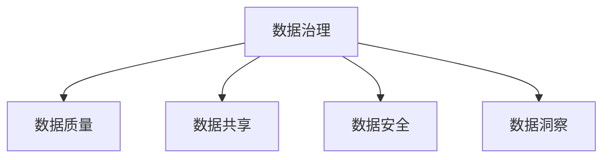

                 

# AI创业：数据管理的高效实践

> 关键词：AI创业、数据管理、高效实践、数据治理、大数据、云计算、数据安全、数据质量、数据共享、数据洞察、数据驱动

## 1. 背景介绍

### 1.1 问题由来
在人工智能（AI）创业领域，数据管理是企业成功的关键。尽管许多初创公司拥有先进的AI模型和算法，但数据管理不当可能会导致项目失败。数据管理不仅是基础架构问题，还涉及到业务流程、合规性、数据治理等各个方面。因此，本文将深入探讨AI创业中的数据管理问题，提供一套高效实践的方法论。

### 1.2 问题核心关键点
数据管理的核心关键点包括：数据获取、数据质量、数据治理、数据安全、数据共享和数据洞察。这些关键点在AI创业中至关重要，因为它们直接影响AI系统的训练和应用效果。

### 1.3 问题研究意义
研究和实践高效的数据管理方法，对于提升AI项目的成功率，降低数据管理成本，提高数据质量，确保数据安全和合规性，具有重要意义。

## 2. 核心概念与联系

### 2.1 核心概念概述

为更好地理解AI创业中数据管理的高效实践，本文将介绍几个关键概念：

- **数据治理**：管理和控制数据资产，确保数据的质量、安全性和可用性。包括数据标准、元数据管理、数据质量监控等。

- **数据质量**：数据质量的四个维度：完整性、准确性、一致性和及时性。高质量的数据是AI模型训练和应用的基础。

- **数据共享**：数据在组织内部的流通和共享，涉及数据的所有权、使用权、访问控制等问题。

- **数据安全**：确保数据在传输、存储和处理过程中的机密性、完整性和可用性。

- **数据洞察**：通过对数据进行分析和挖掘，提取有价值的知识，用于决策支持、业务优化等。

这些核心概念之间的逻辑关系可以通过以下Mermaid流程图来展示：



这个流程图展示了一些核心概念的联系，它们相互影响，共同构成数据管理的基础。

## 3. 核心算法原理 & 具体操作步骤
### 3.1 算法原理概述

数据管理的高效实践依赖于科学的数据治理方法和工具。其核心思想是构建一个数据生命周期管理体系，从数据获取、清洗、存储、共享到最终分析，每一步都需要严格管控。

数据管理的生命周期包括以下几个关键阶段：

1. **数据获取**：从多个数据源收集数据，并进行初步清洗和整合。
2. **数据清洗**：去除重复、缺失、错误的数据，确保数据质量。
3. **数据存储**：选择合适的存储介质和结构，确保数据的可用性和可扩展性。
4. **数据共享**：建立数据访问控制机制，确保数据在合规范围内共享。
5. **数据分析**：使用AI和机器学习算法，从数据中提取有价值的洞察。

### 3.2 算法步骤详解

数据管理的实施步骤一般包括以下几个关键步骤：

**Step 1: 数据审计和规划**

- 收集现有数据资产，评估其质量、完整性和可用性。
- 制定数据治理策略和数据质量标准。
- 识别数据孤岛和潜在的数据质量问题。

**Step 2: 数据集成和清洗**

- 使用ETL（Extract, Transform, Load）工具，从多个数据源中提取数据。
- 清洗数据，去除重复、缺失和错误数据。
- 使用规则和算法自动修复数据质量问题。

**Step 3: 数据存储和管理**

- 选择合适的数据存储介质和数据库管理系统（DBMS）。
- 设计数据模型，确保数据的规范化和一致性。
- 建立数据访问控制机制，确保数据的安全性和合规性。

**Step 4: 数据共享和协作**

- 建立数据共享平台，支持数据在组织内部的流通和共享。
- 使用API和Web服务，提供数据访问接口。
- 定期更新数据使用权和访问控制策略。

**Step 5: 数据洞察和应用**

- 使用数据仓库和数据湖，存储历史数据和实时数据。
- 应用AI和机器学习算法，从数据中提取有价值的洞察。
- 支持业务决策和运营优化，提供数据驱动的决策支持。

### 3.3 算法优缺点

数据管理的高效实践具有以下优点：

1. **提升数据质量**：通过严格的审计和清洗，确保数据的一致性和准确性。
2. **增强数据安全**：建立完善的数据访问控制机制，保护数据隐私和安全。
3. **提高数据共享效率**：建立统一的数据共享平台，优化数据流通和访问。
4. **促进数据洞察和应用**：通过数据仓库和数据湖，支持大规模数据分析和机器学习应用。

同时，该方法也存在一些局限性：

1. **成本高**：建立全面的数据治理体系需要大量的资源和人力投入。
2. **复杂性高**：数据管理的各个环节涉及技术、业务和管理等多方面的挑战。
3. **更新难度大**：数据治理策略需要定期更新，以适应业务变化和数据增长。

尽管存在这些局限性，但科学的数据管理方法是AI创业成功的关键，可以帮助企业降低风险，提升业务效率。

### 3.4 算法应用领域

数据管理的高效实践在AI创业中的应用领域广泛，包括但不限于：

- **金融科技**：处理客户交易数据、风险评估和合规管理。
- **医疗健康**：管理患者健康数据、临床试验数据和研究报告。
- **零售电商**：分析客户行为数据、优化供应链和销售策略。
- **智能制造**：监测设备运行数据、优化生产流程和质量控制。
- **智慧城市**：收集城市运行数据、优化交通管理和公共服务。

这些领域的数据管理需求不同，但高效的数据管理方法可以提供通用的解决方案。

## 4. 数学模型和公式 & 详细讲解  
### 4.1 数学模型构建

数据管理的高效实践需要建立一套数学模型来描述数据管理的过程。以下是一个简化的数据治理数学模型：

设 $D$ 为数据集，$A$ 为数据治理策略，$Q$ 为数据质量标准，$S$ 为数据安全措施，$T$ 为数据共享平台，$I$ 为数据洞察分析。则数据治理过程可以用以下公式表示：

$$
G(D, A, Q, S, T, I) = \max_{A, Q, S, T, I} \{ \text{数据质量}(D) \cdot \text{数据安全}(S) \cdot \text{数据共享}(T) \cdot \text{数据洞察}(I) \}
$$

其中 $\text{数据质量}(D)$ 和 $\text{数据安全}(S)$ 为优化目标，$\text{数据共享}(T)$ 和 $\text{数据洞察}(I)$ 为约束条件。

### 4.2 公式推导过程

数据质量的计算公式为：

$$
\text{数据质量}(D) = \frac{1}{n} \sum_{i=1}^n f(x_i)
$$

其中 $n$ 为数据集大小，$f(x_i)$ 为第 $i$ 个数据的评估函数。

数据安全的计算公式为：

$$
\text{数据安全}(S) = \sum_{i=1}^n g(x_i, s_i)
$$

其中 $g(x_i, s_i)$ 为第 $i$ 个数据的安全评分函数，$s_i$ 为第 $i$ 个数据的安全措施。

数据共享的计算公式为：

$$
\text{数据共享}(T) = \sum_{i=1}^n h(x_i, t_i)
$$

其中 $h(x_i, t_i)$ 为第 $i$ 个数据在数据共享平台上的评分函数，$t_i$ 为第 $i$ 个数据的使用权和访问控制策略。

数据洞察的计算公式为：

$$
\text{数据洞察}(I) = \sum_{i=1}^n k(x_i, y_i)
$$

其中 $k(x_i, y_i)$ 为第 $i$ 个数据在数据分析模型中的评估函数，$y_i$ 为第 $i$ 个数据的洞察结果。

### 4.3 案例分析与讲解

考虑一个电商平台的客户数据管理案例。客户数据包括交易记录、浏览行为、评价反馈等，数据治理过程如下：

1. **数据审计和规划**：评估现有数据的完整性和准确性，制定数据治理策略和质量标准。
2. **数据集成和清洗**：使用ETL工具从多个数据源提取数据，清洗重复、缺失和错误数据。
3. **数据存储和管理**：设计数据模型，选择合适的存储介质和数据库管理系统，建立数据访问控制机制。
4. **数据共享和协作**：建立数据共享平台，支持数据在组织内部的流通和共享，定期更新数据使用权和访问控制策略。
5. **数据洞察和应用**：使用数据仓库和数据湖，存储历史数据和实时数据，应用AI和机器学习算法，从数据中提取有价值的洞察，支持业务决策和运营优化。

## 5. 项目实践：代码实例和详细解释说明
### 5.1 开发环境搭建

在进行数据管理项目实践前，我们需要准备好开发环境。以下是使用Python进行Pandas和SQLAlchemy开发的环境配置流程：

1. 安装Anaconda：从官网下载并安装Anaconda，用于创建独立的Python环境。

2. 创建并激活虚拟环境：
```bash
conda create -n data-management python=3.8 
conda activate data-management
```

3. 安装Pandas和SQLAlchemy：
```bash
pip install pandas sqlalchemy
```

4. 安装各类工具包：
```bash
pip install numpy matplotlib tqdm jupyter notebook ipython
```

完成上述步骤后，即可在`data-management`环境中开始数据管理项目实践。

### 5.2 源代码详细实现

下面以电商客户数据管理为例，给出使用Pandas和SQLAlchemy对数据进行清洗、存储和分析的Python代码实现。

首先，定义数据处理函数：

```python
import pandas as pd
from sqlalchemy import create_engine

# 定义数据处理函数
def clean_and_load_data(file_path, table_name):
    # 加载数据
    data = pd.read_csv(file_path)
    
    # 数据清洗
    data = data.drop_duplicates().dropna().replace('NA', None)
    
    # 建立数据库连接
    engine = create_engine('sqlite:///data.db')
    
    # 写入数据库
    data.to_sql(table_name, con=engine, index=False, if_exists='replace', method='multi')
    
    return data
```

然后，定义数据存储和管理函数：

```python
# 定义数据存储和管理函数
def manage_data():
    # 创建数据表
    data = pd.DataFrame()
    data['customer_id'] = [1, 2, 3, 4, 5]
    data['transaction_date'] = pd.date_range(start='2021-01-01', end='2021-01-10', periods=5)
    data['transaction_amount'] = [100, 200, 300, 400, 500]
    data.to_sql('transactions', con=engine, index=False, if_exists='replace', method='multi')
    
    # 数据访问控制
    def get_access_token(customer_id):
        # 实现数据访问控制逻辑
        pass
    
    # 查询数据
    query = 'SELECT * FROM transactions WHERE transaction_amount > 300'
    data = pd.read_sql(query, con=engine)
    print(data)
```

最后，启动数据管理和分析流程：

```python
# 加载和清洗数据
clean_and_load_data('customer_data.csv', 'customers')
clean_and_load_data('transaction_data.csv', 'transactions')

# 数据管理
manage_data()

# 数据分析
from sklearn.linear_model import LinearRegression

# 定义数据分析函数
def analyze_data():
    # 加载数据
    data = pd.read_sql('SELECT * FROM customers', con=engine)
    
    # 数据处理
    X = data[['transaction_amount']]
    y = data['purchase_frequency']
    
    # 数据建模
    model = LinearRegression()
    model.fit(X, y)
    
    # 数据预测
    predictions = model.predict(X)
    print(predictions)
```

以上就是使用Pandas和SQLAlchemy对电商客户数据进行清洗、存储和分析的完整代码实现。可以看到，Pandas和SQLAlchemy使得数据管理项目开发变得简洁高效。

### 5.3 代码解读与分析

让我们再详细解读一下关键代码的实现细节：

**clean_and_load_data函数**：
- `pd.read_csv`方法：加载CSV文件数据。
- `drop_duplicates`方法：去除重复行。
- `dropna`方法：去除缺失值。
- `replace`方法：将文本数据转换为数字类型。
- `create_engine`方法：建立数据库连接。
- `to_sql`方法：将数据写入数据库。

**manage_data函数**：
- `pd.DataFrame`方法：创建数据表。
- `pd.date_range`方法：生成日期序列。
- `pd.read_sql`方法：查询数据库。
- `get_access_token`方法：实现数据访问控制逻辑。

**analyze_data函数**：
- `pd.read_sql`方法：查询数据库。
- `pd.DataFrame`方法：创建数据表。
- `LinearRegression`方法：构建线性回归模型。
- `model.fit`方法：训练模型。
- `model.predict`方法：进行预测。

可以看到，Pandas和SQLAlchemy使得数据管理项目开发变得简洁高效。开发者可以将更多精力放在数据处理、模型训练等高层逻辑上，而不必过多关注底层的实现细节。

当然，工业级的系统实现还需考虑更多因素，如模型的保存和部署、超参数的自动搜索、更灵活的数据访问控制等。但核心的数据管理流程基本与此类似。

## 6. 实际应用场景
### 6.1 电商客户管理

电商平台的客户数据管理可以大幅提升客户体验和运营效率。通过建立完整的数据治理体系，平台可以实时监测客户行为，进行精准营销和个性化推荐，提升客户满意度和转化率。

具体而言，可以建立统一的数据治理策略和标准，从多个数据源收集客户数据，并进行清洗和整合。建立数据共享平台，支持业务部门和第三方应用的数据访问和共享。应用机器学习算法，从客户数据中提取有价值的洞察，如客户购买行为、偏好、预测需求等，用于优化营销策略和产品设计。

### 6.2 金融风险管理

金融机构需要实时监控客户的信用风险和欺诈行为。通过数据治理和分析，银行和保险公司可以建立完备的风险管理体系，防范金融风险，提升风险控制能力。

具体而言，可以收集客户的信用评分、交易记录、行为数据等，进行数据清洗和整合。建立数据治理策略和数据访问控制机制，确保数据安全和合规。应用机器学习算法，从客户数据中提取有价值的洞察，如客户风险评分、欺诈行为预测等，用于风险评估和欺诈检测。

### 6.3 医疗健康管理

医疗机构需要管理和分析大量的患者数据，以提升医疗服务的质量和效率。通过数据治理和分析，医院可以建立完备的医疗数据管理体系，实现医疗数据的规范化和共享。

具体而言，可以收集患者的电子病历、检查报告、治疗方案等，进行数据清洗和整合。建立数据治理策略和数据访问控制机制，确保数据安全和合规。应用机器学习算法，从患者数据中提取有价值的洞察，如疾病诊断、治疗效果预测等，用于辅助医生诊断和治疗。

### 6.4 未来应用展望

随着数据管理技术的不断进步，数据治理将在更多领域得到应用，为传统行业带来变革性影响。

在智慧城市治理中，通过数据治理可以实现城市数据的规范化和共享，提高城市管理的自动化和智能化水平，构建更安全、高效的未来城市。

在智能制造领域，通过数据治理可以实现设备数据的规范化和共享，优化生产流程和质量控制，提高生产效率和产品质量。

在智慧零售领域，通过数据治理可以实现客户数据的规范化和共享，提升客户体验和运营效率，提高销售转化率。

此外，在智慧医疗、智能农业、智能交通等众多领域，数据治理技术也将不断涌现，为各行各业数字化转型升级提供新的技术路径。相信随着数据治理技术的不断发展，数据将成为推动经济社会发展的重要资产，数据治理将成为企业竞争力的重要体现。

## 7. 工具和资源推荐
### 7.1 学习资源推荐

为了帮助开发者系统掌握数据管理的高效实践，这里推荐一些优质的学习资源：

1. 《数据治理实践指南》系列博文：由数据治理专家撰写，深入浅出地介绍了数据治理的各个环节和最佳实践。

2. 《大数据技术与应用》课程：国内知名大学开设的大数据技术与应用课程，涵盖了大数据技术、数据治理、数据可视化等多个方面。

3. 《数据科学基础》书籍：讲解数据管理、数据清洗、数据分析、数据可视化等数据科学基础概念，适合初学者入门。

4. 数据治理平台官网：提供丰富的数据治理工具和最佳实践案例，包括ETL工具、数据湖、数据仓库等。

5. 《数据治理框架》论文：介绍了常见数据治理框架和最佳实践，如GDPR、ISO27001等，帮助理解数据治理的法规要求和行业标准。

通过对这些资源的学习实践，相信你一定能够快速掌握数据治理的精髓，并用于解决实际的数据管理问题。

### 7.2 开发工具推荐

高效的数据管理离不开优秀的工具支持。以下是几款用于数据管理开发的常用工具：

1. Python：开源的数据处理语言，支持Pandas、NumPy等数据处理库，广泛应用于数据清洗、分析和建模。

2. SQL：标准的数据库查询语言，支持数据存储、查询和分析，是数据管理的基础。

3. Apache Spark：分布式计算框架，支持大规模数据处理和分析，适合数据仓库和大数据应用。

4. Tableau：数据可视化工具，支持数据连接、可视化和分析，适合业务数据驱动决策。

5. Jupyter Notebook：开源的交互式编程环境，支持Python、R等多种语言，适合数据探索和分析。

合理利用这些工具，可以显著提升数据管理项目的开发效率，加快创新迭代的步伐。

### 7.3 相关论文推荐

数据治理技术的发展源于学界的持续研究。以下是几篇奠基性的相关论文，推荐阅读：

1. "The Data Warehousing Process"（《数据仓库过程》）：数据仓库的奠基之作，介绍了数据仓库的构建过程和最佳实践。

2. "A Taxonomy of Data Governance"（《数据治理框架》）：对常见数据治理框架和最佳实践进行了分类和总结，帮助理解数据治理的法规要求和行业标准。

3. "Big Data: Principles and Best Practices of Scalable Real-time Data Systems"（《大数据：可扩展实时数据系统原理与最佳实践》）：介绍了大数据技术的原理和最佳实践，适合大数据应用开发。

4. "Data Governance: An Enterprise Approach"（《数据治理：企业方法论》）：讲解了企业级数据治理的策略和流程，适合企业数据治理实践。

5. "A Survey on Big Data Security"（《大数据安全综述》）：介绍了大数据安全技术的发展和应用，适合数据治理和安全实践。

这些论文代表了大数据治理技术的发展脉络。通过学习这些前沿成果，可以帮助研究者把握学科前进方向，激发更多的创新灵感。

## 8. 总结：未来发展趋势与挑战
### 8.1 总结

本文对数据管理的高效实践进行了全面系统的介绍。首先阐述了数据管理在AI创业中的重要性和核心关键点，明确了数据治理在提升数据质量和效率方面的独特价值。其次，从原理到实践，详细讲解了数据治理的数学模型和核心步骤，给出了数据管理项目开发的完整代码实例。同时，本文还广泛探讨了数据管理在电商、金融、医疗等多个行业领域的应用前景，展示了数据管理技术的广泛潜力。

通过本文的系统梳理，可以看到，数据管理技术正在成为AI创业成功的关键，帮助企业降低风险，提升业务效率。未来，伴随数据管理技术的持续演进，数据将成为推动经济社会发展的重要资产，数据治理将成为企业竞争力的重要体现。

### 8.2 未来发展趋势

展望未来，数据管理技术将呈现以下几个发展趋势：

1. **自动化和智能化**：数据治理的自动化和智能化水平将不断提高，使用AI和机器学习技术优化数据管理流程，提升数据治理效率和效果。

2. **数据湖和大数据平台**：数据湖和大数据平台将成为数据治理的基础设施，支持大规模数据的存储、处理和分析。

3. **跨领域数据共享**：数据治理将突破行业和领域界限，实现跨领域、跨组织的数据共享和协作，提升数据治理的普适性和灵活性。

4. **数据隐私和安全**：数据隐私和安全将成为数据治理的重要关注点，使用区块链、联邦学习等技术保护数据隐私和安全。

5. **数据治理标准和法规**：数据治理标准和法规将逐步完善，确保数据治理的合规性和可审计性。

6. **数据洞察和应用**：数据治理将与AI和机器学习深度结合，从数据中提取有价值的洞察，支持业务决策和运营优化。

以上趋势凸显了数据治理技术的广阔前景。这些方向的探索发展，必将进一步提升数据管理系统的性能和应用范围，为各行各业数字化转型升级提供新的技术路径。

### 8.3 面临的挑战

尽管数据治理技术已经取得了瞩目成就，但在迈向更加智能化、普适化应用的过程中，它仍面临着诸多挑战：

1. **数据质量**：数据质量是数据治理的基础，但数据质量问题难以彻底解决，数据清洗和整合仍然需要大量人力和技术投入。

2. **数据隐私和安全**：数据隐私和安全问题日益突出，数据泄露和滥用风险增加。如何在保护数据隐私和安全的前提下，实现数据的共享和应用，仍然是一个重大挑战。

3. **数据标准化**：不同数据源和系统的数据格式、标准不一致，数据集成和共享困难。如何建立统一的数据标准，实现数据的规范化和标准化，将是一个长期挑战。

4. **数据治理成本**：数据治理需要大量的资源和技术投入，尤其是大型企业，数据治理成本高昂。如何平衡数据治理成本和数据管理收益，是一个亟待解决的问题。

5. **技术复杂性**：数据治理涉及技术、业务和管理等多个方面，技术复杂性高，需要多学科团队协作。

6. **数据动态变化**：数据动态变化频繁，数据治理策略需要及时更新和调整，以适应业务变化和数据增长。

正视数据治理面临的这些挑战，积极应对并寻求突破，将是大数据治理技术迈向成熟的必由之路。相信随着学界和产业界的共同努力，这些挑战终将一一被克服，数据治理必将在构建数据驱动的未来社会中扮演越来越重要的角色。

### 8.4 研究展望

面对数据治理面临的种种挑战，未来的研究需要在以下几个方面寻求新的突破：

1. **自动化和智能化**：开发更多自动化和智能化的数据治理工具，使用AI和机器学习技术优化数据管理流程，提升数据治理效率和效果。

2. **数据隐私和安全**：开发更加高效的数据隐私和安全技术，使用区块链、联邦学习等技术保护数据隐私和安全。

3. **数据标准化**：推动数据标准和规范的制定，建立统一的数据标准和数据共享平台，实现数据的规范化和标准化。

4. **数据治理成本**：探索低成本、高效益的数据治理方法，提高数据治理的性价比。

5. **技术复杂性**：推动跨学科合作，构建多学科团队，综合运用技术、业务和管理知识，提升数据治理的技术水平。

6. **数据动态变化**：开发动态数据治理框架，实现数据治理策略的自动调整和优化，适应业务变化和数据增长。

这些研究方向的探索，必将引领数据治理技术迈向更高的台阶，为构建数据驱动的未来社会提供新的技术路径。面向未来，数据治理技术还需要与其他人工智能技术进行更深入的融合，如知识表示、因果推理、强化学习等，多路径协同发力，共同推动数据治理系统的进步。只有勇于创新、敢于突破，才能不断拓展数据治理的边界，让数据成为推动经济社会发展的重要资产。

## 9. 附录：常见问题与解答

**Q1：数据治理和数据管理有什么区别？**

A: 数据治理是一种管理数据的方式，旨在确保数据的质量、安全性和可用性。数据管理则更广泛，包括数据的收集、存储、清洗、分析和共享等多个环节，涵盖数据生命周期的全过程。

**Q2：数据治理的核心关键点有哪些？**

A: 数据治理的核心关键点包括数据质量、数据安全、数据共享和数据洞察。数据质量是数据治理的基础，数据安全和共享是数据治理的重要目标，数据洞察则是数据治理的最终目的。

**Q3：如何进行数据治理的成本效益分析？**

A: 数据治理的成本效益分析需要考虑多个方面，包括数据治理的技术投入、人力成本、数据质量提升、业务效率提升等。可以构建数据治理的成本效益模型，定期进行评估和调整。

**Q4：数据治理对AI项目有哪些影响？**

A: 数据治理对AI项目的影响主要体现在数据质量和数据效率两个方面。良好的数据治理可以提升数据质量，提高AI模型的训练效果和应用效果。同时，数据治理还可以提高数据共享和协作效率，支持AI项目的快速迭代和优化。

**Q5：数据治理需要考虑哪些法律和合规要求？**

A: 数据治理需要考虑的数据法律和合规要求包括但不限于GDPR、ISO27001、CCPA等。需要根据不同国家和行业的法律法规，制定相应的数据治理策略和措施。

这些问题的解答，帮助读者理解数据治理的重要性和关键点，从而更好地应用数据治理技术，提升AI项目的成功率和效率。

---

作者：禅与计算机程序设计艺术 / Zen and the Art of Computer Programming

