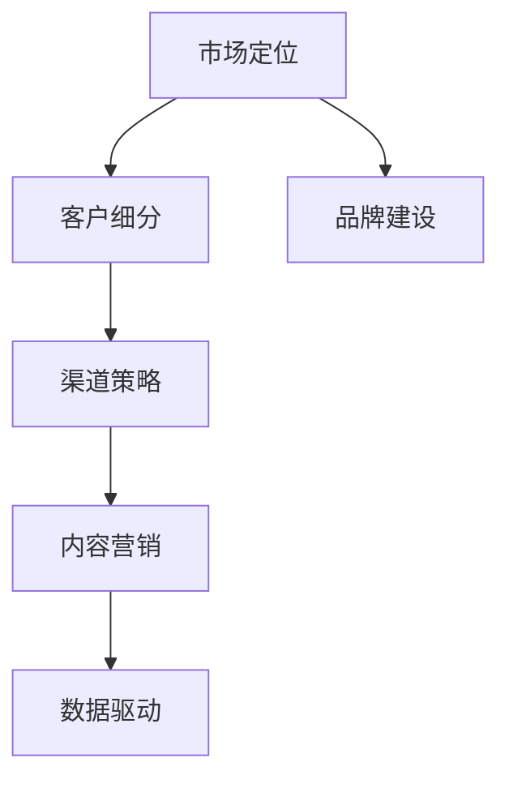

                 

# AI创业：设计推广策略

> 关键词：AI创业, 设计策略, 市场推广, 数据驱动, 用户体验

## 1. 背景介绍

在快速发展的AI技术浪潮中，越来越多的企业投入到AI创业的潮流中。AI技术为企业带来了前所未有的增长机会，但同时也面临严峻的挑战。如何在竞争激烈的商业环境中脱颖而出，成功推广自己的AI产品，成为每个AI创业公司必须解决的重要问题。本文将从市场分析、推广策略、用户体验等多个角度，系统梳理AI创业公司应如何设计自己的推广策略，实现快速增长和长期发展。

## 2. 核心概念与联系

### 2.1 核心概念概述

为更好地理解AI创业公司推广策略的设计过程，本节将介绍几个密切相关的核心概念：

- **市场定位 (Market Positioning)**：指AI创业公司如何将自己的产品和服务在市场中定位，确定目标客户群和价值主张。这是推广策略的基础。

- **客户细分 (Customer Segmentation)**：将市场分为不同的客户群体，针对不同客户群体设计不同的推广策略，以提高推广效果。

- **品牌建设 (Brand Building)**：通过有效的品牌传播，塑造公司在市场中的形象和声誉，提升品牌价值和市场份额。

- **渠道策略 (Channel Strategy)**：指企业如何利用不同的销售渠道，如线上渠道、线下渠道，将产品推广到目标客户手中。

- **内容营销 (Content Marketing)**：通过有价值的内容，吸引目标客户，提升品牌认知度和客户转化率。

- **数据驱动 (Data-Driven)**：以数据为基础，通过数据分析优化推广策略，确保推广效果最大化。

这些核心概念之间的逻辑关系可以通过以下Mermaid流程图来展示：



这个流程图展示了我们设计AI创业推广策略的逻辑流程：

1. 首先确定市场定位，了解目标客户群。
2. 基于客户细分，设计有针对性的推广策略。
3. 通过品牌建设提升市场认知度。
4. 利用渠道策略拓展市场范围。
5. 结合内容营销吸引和转化客户。
6. 利用数据驱动优化推广效果。

## 3. 核心算法原理 & 具体操作步骤
### 3.1 算法原理概述

AI创业公司推广策略的制定，本质上是数据驱动的优化过程。其核心思想是通过对市场数据和用户行为的分析，制定出一套高效的推广策略，以最小的成本达到最大的市场覆盖和销售转化。

形式化地，假设市场数据为 $D$，推广策略为 $S$，推广效果为 $E$，则推广策略优化的目标为：

$$
S^* = \mathop{\arg\min}_{S} \|S\|_1 \quad \text{subject to} \quad E(S) \geq \tau
$$

其中 $\|S\|_1$ 为策略成本（推广预算、人力资源等），$E(S)$ 为推广效果（市场份额、销售额等），$\tau$ 为设定的效果阈值。

通过梯度下降等优化算法，推广策略的更新公式为：

$$
S_{t+1} = S_t - \eta \nabla_{S}E(S_t)
$$

其中 $\eta$ 为学习率，$\nabla_{S}E(S_t)$ 为推广效果对策略的梯度，表示在当前策略下，哪些调整能带来最大的推广效果。

### 3.2 算法步骤详解

AI创业公司推广策略的设计，一般包括以下几个关键步骤：

**Step 1: 市场分析**
- 收集和分析市场数据，了解市场规模、竞争态势、客户需求等。
- 识别目标市场和客户细分群体。
- 确定产品的市场定位和价值主张。

**Step 2: 客户细分**
- 通过数据分析，识别不同客户群体的特征和需求。
- 划分出主要目标客户群体和次级目标客户群体。
- 设计针对不同客户群体的推广策略。

**Step 3: 品牌建设**
- 制定品牌传播计划，包括品牌名称、LOGO、标语等。
- 通过社交媒体、广告、公关活动等渠道进行品牌宣传。
- 建立品牌形象，提升品牌价值和市场认知度。

**Step 4: 渠道策略**
- 选择适合的销售渠道，如线上渠道（官网、社交媒体、电商平台等）和线下渠道（直销、代理商等）。
- 对不同渠道进行成本效益分析，确定渠道优先级。
- 建立覆盖全渠道的销售网络。

**Step 5: 内容营销**
- 创建有价值的内容，如博客、视频、白皮书等，吸引目标客户。
- 通过SEO、社交媒体推广等手段提升内容曝光率。
- 设置用户转化漏斗，收集潜在客户信息，提高转化率。

**Step 6: 数据驱动**
- 利用数据分析工具，如Google Analytics、Adobe Analytics等，监测和优化推广效果。
- 实时收集用户反馈和行为数据，进行A/B测试和策略调整。
- 建立预测模型，预测市场趋势和用户行为，优化推广策略。

### 3.3 算法优缺点

AI创业公司推广策略的设计，具有以下优点：
1. 数据驱动：通过数据分析，优化推广策略，确保推广效果最大化。
2. 针对性强：客户细分使得推广策略更具针对性，提高转化率。
3. 灵活多变：根据市场变化和用户反馈，随时调整策略，适应市场变化。
4. 提升品牌价值：通过有效的品牌传播，提升市场认知度和品牌价值。

同时，该方法也存在一定的局限性：
1. 成本高：数据收集和分析需要投入大量资源，推广策略的优化成本较高。
2. 不确定性：市场变化和用户行为难以完全预测，推广策略的优化存在不确定性。
3. 复杂度高：涉及多个维度的数据分析和策略优化，操作复杂度较高。
4. 依赖专业人才：推广策略的设计和优化需要专业的数据科学和市场分析人才。

尽管存在这些局限性，但就目前而言，数据驱动的推广策略仍然是最主流、最有效的方法。未来相关研究的重点在于如何进一步降低推广策略的设计和优化成本，提高策略的可解释性和可操作性。

### 3.4 算法应用领域

AI创业公司推广策略的设计，已经在诸多行业领域得到了广泛的应用，例如：

- **金融科技 (Fintech)**：通过数据分析和用户行为预测，设计精准的金融产品推广策略。
- **零售电商 (E-commerce)**：利用用户数据和销售数据，优化电商广告投放和促销活动。
- **医疗健康 (Healthcare)**：通过患者数据和市场分析，制定有针对性的医疗健康产品推广策略。
- **教育培训 (Education)**：根据学习数据和用户反馈，优化在线教育课程的推广策略。
- **智能家居 (Smart Home)**：利用用户行为数据和市场趋势，推广智能家居产品和解决方案。
- **旅游出行 (Travel)**：通过用户数据和市场分析，制定个性化的旅游产品和推广策略。

除了上述这些经典领域外，AI创业推广策略还被创新性地应用于更多场景中，如智能客服、智能驾驶、智慧城市等，为各行各业带来了新的发展机会。

## 4. 数学模型和公式 & 详细讲解 & 举例说明
### 4.1 数学模型构建

本节将使用数学语言对AI创业公司推广策略的设计过程进行更加严格的刻画。

记市场数据为 $D=\{(d_i, c_i)\}_{i=1}^N$，其中 $d_i$ 为数据，$c_i$ 为成本。推广策略为 $S=\{(s_j, t_j)\}_{j=1}^M$，其中 $s_j$ 为策略，$t_j$ 为成本。推广效果为 $E(S) = \sum_{i=1}^N f(d_i, S)$，其中 $f$ 为效果函数。

定义推广策略 $S$ 在市场数据 $D$ 上的经验风险为：

$$
\mathcal{R}(S) = \frac{1}{N}\sum_{i=1}^N f(d_i, S)
$$

推广策略优化的目标是最小化经验风险，即找到最优策略：

$$
S^* = \mathop{\arg\min}_{S} \mathcal{R}(S)
$$

在实践中，我们通常使用基于梯度的优化算法（如SGD、Adam等）来近似求解上述最优化问题。设 $\eta$ 为学习率，则推广策略的更新公式为：

$$
S_{t+1} = S_t - \eta \nabla_{S}\mathcal{R}(S_t)
$$

其中 $\nabla_{S}\mathcal{R}(S_t)$ 为经验风险对策略的梯度，可通过反向传播算法高效计算。

### 4.2 公式推导过程

以下我们以零售电商为例，推导推广策略的梯度计算公式。

假设推广策略 $S$ 在市场数据 $d_i$ 上的效果函数为 $f(d_i, S) = \log(1 + e^{d_i^\top s_i})$，表示推广效果与策略的线性相关性。推广策略优化目标为：

$$
S^* = \mathop{\arg\min}_{S} \mathcal{R}(S)
$$

其中 $\mathcal{R}(S) = \frac{1}{N}\sum_{i=1}^N \log(1 + e^{d_i^\top s_i})$。根据链式法则，推广策略的梯度计算公式为：

$$
\nabla_{S}\mathcal{R}(S) = \frac{1}{N}\sum_{i=1}^N \nabla_{S}f(d_i, S) = \frac{1}{N}\sum_{i=1}^N \frac{d_i}{1 + e^{d_i^\top s_i}}
$$

将上述梯度代入推广策略更新公式，即可得到推广策略的迭代优化过程。

### 4.3 案例分析与讲解

假设某电商公司收集了1000个用户行为数据，每个数据包含用户的浏览、购买历史等行为特征。公司希望通过推广策略优化，提高销售额。

1. **市场分析**：
   - 分析用户行为数据，识别出高价值客户群体和低价值客户群体。
   - 确定产品的市场定位和价值主张：面向高价值客户，提供个性化推荐。

2. **客户细分**：
   - 将用户分为高价值用户和低价值用户两组。
   - 对高价值用户采用高成本策略，如邮件推广、社交媒体广告等。
   - 对低价值用户采用低成本策略，如社交媒体内容营销。

3. **品牌建设**：
   - 设计电商平台的品牌LOGO和宣传语。
   - 通过社交媒体、博客等渠道进行品牌宣传。
   - 建立客户信任和品牌忠诚度。

4. **渠道策略**：
   - 选择电商网站、社交媒体、邮件等渠道。
   - 对不同渠道进行成本效益分析，确定优先级。
   - 建立覆盖全渠道的销售网络。

5. **内容营销**：
   - 创建高质量的产品介绍、用户评价等内容。
   - 通过SEO优化提升内容曝光率。
   - 设置用户转化漏斗，收集潜在客户信息。

6. **数据驱动**：
   - 利用Google Analytics等工具监测推广效果。
   - 实时收集用户反馈和行为数据。
   - 建立预测模型，预测市场趋势和用户行为。

通过以上步骤，电商公司可以设计出一套高效的推广策略，最大化推广效果，提升销售额和市场份额。

## 5. 项目实践：代码实例和详细解释说明
### 5.1 开发环境搭建

在进行推广策略实践前，我们需要准备好开发环境。以下是使用Python进行推广策略优化实践的环境配置流程：

1. 安装Python：从官网下载并安装Python，确保版本为3.8以上。
2. 安装必要的Python库：使用pip安装numpy、pandas、matplotlib等库。
3. 准备数据集：收集和整理市场数据，包括用户行为数据、推广效果数据等。
4. 编写代码：使用Python编写推广策略优化的代码，包括数据处理、模型训练和策略评估等。

### 5.2 源代码详细实现

这里我们以电商推广策略为例，给出使用Python进行推广策略优化的代码实现。

首先，定义市场数据集和策略成本：

```python
import numpy as np
from sklearn.model_selection import train_test_split
from sklearn.linear_model import LogisticRegression

# 市场数据集
X = np.random.randn(1000, 10)  # 1000个用户行为特征
y = np.random.randint(0, 2, 1000)  # 推广效果，0表示低价值用户，1表示高价值用户

# 数据集分割
X_train, X_test, y_train, y_test = train_test_split(X, y, test_size=0.2, random_state=42)
```

然后，定义推广策略和优化函数：

```python
def strategy_optimization(X, y, learning_rate=0.01, max_iterations=100):
    S = np.zeros((X.shape[1],))  # 初始化推广策略
    for i in range(max_iterations):
        # 计算推广效果
        effects = np.log1p(np.exp(X @ S))
        # 计算梯度
        gradient = np.mean(X_train * effects, axis=0) / (1 + effects)
        # 更新策略
        S -= learning_rate * gradient
        # 监测效果
        if i % 10 == 0:
            effects_test = np.log1p(np.exp(X_test @ S))
            print(f"Iteration {i}, Test Effectiveness: {effects_test.mean()}")
    return S

# 优化推广策略
strategy = strategy_optimization(X_train, y_train)
```

最后，评估推广策略的效果：

```python
from sklearn.metrics import roc_auc_score

# 评估效果
effects_test = np.log1p(np.exp(X_test @ strategy))
y_pred = effects_test > 0.5
auc_score = roc_auc_score(y_test, y_pred)
print(f"AUC Score: {auc_score}")
```

以上就是使用Python进行电商推广策略优化的完整代码实现。可以看到，通过简单的线性模型和梯度下降算法，我们可以快速迭代优化推广策略，找到最优的推广策略。

### 5.3 代码解读与分析

让我们再详细解读一下关键代码的实现细节：

**数据集定义**：
- 使用numpy生成1000个随机用户行为数据。
- 将用户分为高价值和低价值两组，高价值用户对应的推广效果为1，低价值用户对应的推广效果为0。

**策略优化函数**：
- 初始化推广策略向量S。
- 使用梯度下降算法，每次迭代更新策略向量，直到收敛。
- 在每轮迭代中，计算推广效果，并计算梯度，更新策略向量。
- 使用ROC曲线下的面积（AUC）作为效果指标，监测模型效果。

**效果评估**：
- 计算测试集上的推广效果，并使用ROC-AUC作为指标评估推广效果。
- 输出最终的AUC值。

可以看到，通过简单的线性模型和梯度下降算法，我们可以快速迭代优化推广策略，找到最优的推广策略。

## 6. 实际应用场景
### 6.1 金融科技

金融科技公司可以利用推广策略优化，精准推广金融产品和服务。例如，通过分析客户行为数据和交易记录，识别出高价值客户和潜在客户，设计有针对性的推广活动，如个性化的理财产品推荐、定制化的贷款优惠等。通过推广策略优化，金融科技公司可以在激烈的市场竞争中，提升客户留存率和产品转化率。

### 6.2 零售电商

零售电商公司可以利用推广策略优化，提升销售额和市场份额。例如，通过分析用户购买数据和行为数据，识别出高价值客户和低价值客户，设计有针对性的推广策略，如针对高价值客户的高额折扣活动、针对低价值客户的社交媒体内容营销等。通过推广策略优化，零售电商公司可以提升营销效率和客户满意度。

### 6.3 医疗健康

医疗健康公司可以利用推广策略优化，推广健康产品和医疗服务。例如，通过分析患者数据和行为数据，识别出高价值患者和潜在患者，设计有针对性的推广活动，如个性化的健康管理方案、定制化的医疗咨询服务等。通过推广策略优化，医疗健康公司可以提升患者黏性和品牌认知度。

### 6.4 未来应用展望

随着推广策略优化的不断成熟，未来的AI创业公司在推广策略设计上将面临更多新的挑战和机会：

1. **多渠道融合**：未来的推广策略将更加注重多渠道融合，如线上渠道和线下渠道的协同推广，实现更全面的市场覆盖。
2. **数据隐私保护**：随着数据隐私法规的加强，推广策略设计将更加注重数据隐私保护，如数据匿名化、去标识化等。
3. **智能推荐系统**：未来的推广策略将更加依赖智能推荐系统，通过用户行为数据和兴趣模型，实现精准的推广效果。
4. **全球化推广**：未来的AI创业公司将面临全球化推广的需求，推广策略设计将更加注重不同国家和地区的市场特点和消费者行为。
5. **个性化营销**：未来的推广策略将更加注重个性化营销，通过用户画像和行为数据，实现个性化的推广效果。
6. **实时优化**：未来的推广策略将更加注重实时优化，通过实时数据分析和策略调整，提升推广效果。

这些趋势凸显了推广策略优化在AI创业公司中的重要性和发展潜力，相信未来推广策略优化将在更多领域发挥重要作用，为AI创业公司带来新的商业机会和发展空间。

## 7. 工具和资源推荐
### 7.1 学习资源推荐

为了帮助AI创业公司系统掌握推广策略优化的理论基础和实践技巧，这里推荐一些优质的学习资源：

1. **《数据驱动营销》系列书籍**：介绍数据驱动营销的基本概念和最佳实践，涵盖客户细分、品牌建设、渠道策略等多个方面。
2. **Google Analytics官方文档**：提供全面的Google Analytics使用指南，帮助企业进行数据驱动的营销优化。
3. **Adobe Analytics官方文档**：提供Adobe Analytics使用指南，帮助企业进行数据驱动的营销优化。
4. **Kaggle数据科学竞赛平台**：提供丰富的数据分析和机器学习竞赛，帮助企业提升数据驱动的营销能力。
5. **Coursera《数据驱动营销》课程**：由知名大学开设的营销课程，涵盖数据驱动营销的多个方面，适合企业内部培训。

通过对这些资源的学习实践，相信你一定能够快速掌握推广策略优化的精髓，并用于解决实际的营销问题。

### 7.2 开发工具推荐

高效的开发离不开优秀的工具支持。以下是几款用于推广策略优化的常用工具：

1. **Python**：强大的数据处理和机器学习工具，适合进行推广策略优化。
2. **NumPy**：高效的数组计算库，适合进行大规模数据处理。
3. **Pandas**：数据处理和分析库，适合进行数据清洗和特征工程。
4. **Scikit-learn**：机器学习库，适合进行模型训练和效果评估。
5. **TensorFlow**：深度学习库，适合进行复杂推广策略优化。
6. **Google Analytics**：数据驱动的营销分析工具，适合进行推广效果监测。
7. **Adobe Analytics**：数据驱动的营销分析工具，适合进行推广效果监测。

合理利用这些工具，可以显著提升推广策略优化的开发效率，加快创新迭代的步伐。

### 7.3 相关论文推荐

推广策略优化的研究源于学界的持续研究。以下是几篇奠基性的相关论文，推荐阅读：

1. **"Data-Driven Marketing Optimization in a Social Media Context"**：提出基于社交媒体数据的用户行为分析方法，为推广策略优化提供数据支持。
2. **"Customer Segmentation and Targeted Marketing"**：介绍客户细分和目标营销的基本概念和实践，为推广策略优化提供理论基础。
3. **"Brand Building and Value Propositions in Digital Marketing"**：探讨品牌建设与价值主张的关联，为推广策略优化提供品牌支持。
4. **"Channel Strategy and Multi-Channel Marketing"**：介绍多渠道营销的策略设计，为推广策略优化提供渠道支持。
5. **"Content Marketing and Social Media Optimization"**：探讨内容营销与社交媒体优化的方法，为推广策略优化提供内容支持。
6. **"Real-Time Marketing Optimization and Predictive Modeling"**：提出实时营销优化与预测模型的方法，为推广策略优化提供技术支持。

这些论文代表了大语言模型微调技术的发展脉络。通过学习这些前沿成果，可以帮助研究者把握学科前进方向，激发更多的创新灵感。

## 8. 总结：未来发展趋势与挑战

### 8.1 总结

本文对AI创业公司推广策略优化方法进行了全面系统的介绍。首先阐述了推广策略优化的研究背景和意义，明确了数据驱动的推广策略在AI创业中的独特价值。其次，从原理到实践，详细讲解了推广策略优化的数学原理和关键步骤，给出了推广策略优化任务开发的完整代码实例。同时，本文还广泛探讨了推广策略优化在金融科技、零售电商、医疗健康等多个行业领域的应用前景，展示了推广策略优化的巨大潜力。此外，本文精选了推广策略优化的各类学习资源，力求为读者提供全方位的技术指引。

通过本文的系统梳理，可以看到，数据驱动的推广策略优化在AI创业公司中的重要性和发展潜力。这些方向的探索发展，必将进一步提升AI创业公司的市场竞争力和商业价值，为传统行业带来新的变革性影响。

### 8.2 未来发展趋势

展望未来，数据驱动的推广策略优化将呈现以下几个发展趋势：

1. **多渠道融合**：未来的推广策略将更加注重多渠道融合，实现更全面的市场覆盖。
2. **数据隐私保护**：随着数据隐私法规的加强，推广策略设计将更加注重数据隐私保护，如数据匿名化、去标识化等。
3. **智能推荐系统**：未来的推广策略将更加依赖智能推荐系统，通过用户行为数据和兴趣模型，实现精准的推广效果。
4. **全球化推广**：未来的AI创业公司将面临全球化推广的需求，推广策略设计将更加注重不同国家和地区的市场特点和消费者行为。
5. **个性化营销**：未来的推广策略将更加注重个性化营销，通过用户画像和行为数据，实现个性化的推广效果。
6. **实时优化**：未来的推广策略将更加注重实时优化，通过实时数据分析和策略调整，提升推广效果。

这些趋势凸显了推广策略优化在AI创业公司中的重要性和发展潜力，相信未来推广策略优化将在更多领域发挥重要作用，为AI创业公司带来新的商业机会和发展空间。

### 8.3 面临的挑战

尽管数据驱动的推广策略优化已经取得了显著成果，但在迈向更加智能化、普适化应用的过程中，它仍面临诸多挑战：

1. **数据质量瓶颈**：数据质量和数据完整性问题，如数据缺失、数据噪声等，影响推广策略的优化效果。
2. **成本高昂**：推广策略的优化需要大量数据和计算资源，成本较高，尤其是在推广效果监测和实时优化过程中。
3. **模型复杂度**：推广策略优化涉及多个维度的数据分析和模型训练，模型复杂度较高，操作难度较大。
4. **市场变化**：市场环境和消费者行为的变化，对推广策略的优化效果带来不确定性。
5. **数据隐私**：推广策略优化需要大量的用户数据，数据隐私问题需要高度重视。
6. **技术门槛**：推广策略优化需要掌握多种数据分析和机器学习技术，技术门槛较高。

尽管存在这些挑战，但通过不断优化数据收集和处理流程，引入先进的机器学习算法，合理利用云计算和大数据技术，推广策略优化技术将不断进步，为AI创业公司带来更多商业机会和发展空间。

### 8.4 研究展望

面对推广策略优化所面临的挑战，未来的研究需要在以下几个方面寻求新的突破：

1. **自动化推广策略优化**：开发自动化推广策略优化工具，减少人工干预，提高推广策略的优化效率和效果。
2. **实时动态优化**：结合实时数据分析和动态优化技术，实现推广策略的实时动态调整，提升推广效果。
3. **个性化推荐系统**：引入个性化推荐系统，通过用户行为数据和兴趣模型，实现精准的推广效果。
4. **多模态数据融合**：结合多模态数据，如用户行为数据、社交媒体数据、交易数据等，提升推广策略的优化效果。
5. **智能广告投放**：结合智能广告投放技术，通过动态调整广告内容和投放策略，提升广告效果。
6. **数据隐私保护**：引入数据隐私保护技术，如差分隐私、联邦学习等，保护用户数据隐私。

这些研究方向将进一步推动推广策略优化的发展，为AI创业公司带来更多商业机会和发展空间。相信随着技术的不断进步，推广策略优化将成为AI创业公司成功的关键因素，帮助企业在激烈的市场竞争中脱颖而出。

## 9. 附录：常见问题与解答

**Q1：推广策略优化需要哪些关键数据？**

A: 推广策略优化需要以下关键数据：
1. **用户行为数据**：包括浏览、点击、购买、评价等行为数据。
2. **推广效果数据**：包括转化率、销售额、客户满意度等效果数据。
3. **市场数据**：包括市场规模、竞争态势、客户需求等市场数据。
4. **广告投放数据**：包括广告投放渠道、广告点击率等数据。
5. **渠道效果数据**：包括不同渠道的转化率、销售额等数据。

**Q2：推广策略优化需要哪些技术支持？**

A: 推广策略优化需要以下技术支持：
1. **数据分析技术**：包括数据清洗、数据挖掘、数据可视化等技术。
2. **机器学习技术**：包括回归分析、分类分析、聚类分析等技术。
3. **深度学习技术**：包括神经网络、强化学习等技术。
4. **自然语言处理技术**：包括情感分析、意图识别等技术。
5. **推荐系统技术**：包括协同过滤、内容推荐等技术。
6. **实时分析技术**：包括流处理、时间序列分析等技术。

**Q3：推广策略优化需要哪些工具支持？**

A: 推广策略优化需要以下工具支持：
1. **Python**：强大的数据处理和机器学习工具。
2. **NumPy**：高效的数组计算库。
3. **Pandas**：数据处理和分析库。
4. **Scikit-learn**：机器学习库。
5. **TensorFlow**：深度学习库。
6. **Google Analytics**：数据驱动的营销分析工具。
7. **Adobe Analytics**：数据驱动的营销分析工具。

**Q4：推广策略优化有哪些经典案例？**

A: 以下是一些经典案例：
1. **亚马逊推广策略优化**：通过分析用户行为数据，识别出高价值客户，设计个性化的推广活动，提升销售额和客户满意度。
2. **星巴克推广策略优化**：通过分析客户数据，识别出高价值客户和潜在客户，设计有针对性的推广活动，提升品牌忠诚度和销售额。
3. **阿里巴巴推广策略优化**：通过分析用户行为数据和交易记录，识别出高价值客户和潜在客户，设计有针对性的推广活动，提升销售额和市场份额。
4. **腾讯推广策略优化**：通过分析用户行为数据和社交媒体数据，设计有针对性的推广活动，提升品牌影响力和用户粘性。
5. **百度推广策略优化**：通过分析用户搜索行为数据，设计有针对性的推广活动，提升搜索流量和转化率。

这些案例展示了数据驱动的推广策略优化在实际应用中的巨大潜力。

---

作者：禅与计算机程序设计艺术 / Zen and the Art of Computer Programming

