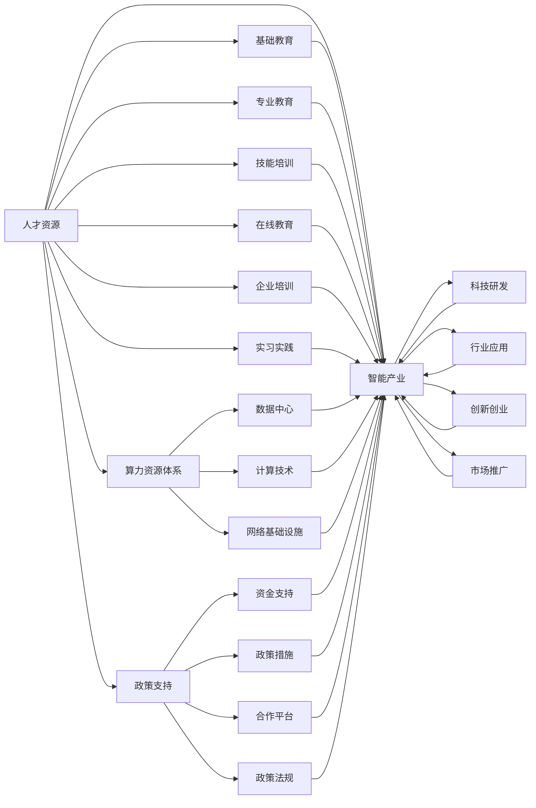

                 

# AI国家战略：人才资源和算力资源体系建设

> 关键词：AI国家战略,人才资源,算力资源体系建设,人工智能,智能产业,人才培养,教育体系改革,AI基础设施,技术创新,应用场景,政策支持,经济效益

## 1. 背景介绍

### 1.1 问题由来

人工智能（Artificial Intelligence，AI）作为新一代通用技术，正在深刻改变世界。AI的广泛应用推动了科技与经济社会的快速发展，但也带来了诸多新的挑战。当前，AI领域的核心竞争已从算法和模型转向人才与算力，对国家战略层面的人才资源和算力资源体系建设提出了更高的要求。

### 1.2 问题核心关键点

人工智能作为新兴领域，其发展核心在于人才和算力资源体系建设的协同配合，具体关键点如下：

1. **人才资源**：
   - **基础教育**：培养扎实的数学、统计学和计算机科学基础。
   - **专业教育**：涵盖AI核心技术、行业应用、伦理法规等。
   - **技能培训**：结合在线教育、企业培训、实习实践等方式，加速人才产出。

2. **算力资源**：
   - **数据中心**：建设高性能、可扩展的数据中心，提供稳定高效的计算服务。
   - **计算技术**：推广AI计算技术，提升GPU/TPU等硬件设备的性能和普及度。
   - **网络基础设施**：构建高速、低延时的网络环境，支持大数据传输和分布式计算。

3. **产业生态**：
   - **产学研合作**：促进高校、科研机构和企业间的深度合作，推动技术创新和应用落地。
   - **政策支持**：制定合理的政策措施，引导资金、人才、资源向AI领域倾斜。
   - **市场需求**：响应不同行业的需求，推动AI技术在医疗、金融、交通等领域的广泛应用。

### 1.3 问题研究意义

人工智能作为未来的关键技术，其发展依赖于系统的、多层次的人才和算力体系建设。对人才资源和算力资源体系建设的深入研究，不仅有助于提升国家AI技术的整体实力，还能推动产业创新和经济发展。研究AI国家战略，对于打造世界级的AI大国、推动科技与经济的全面升级具有重要意义。

## 2. 核心概念与联系

### 2.1 核心概念概述

要全面理解AI国家战略，首先需要理解其中的关键概念：

- **人工智能（AI）**：包括机器学习、深度学习、自然语言处理、计算机视觉等技术。
- **人才资源**：涵盖了从基础教育到专业培训的全链条，重点在于AI领域的各类人才，包括科学家、工程师、数据科学家等。
- **算力资源体系**：构建高性能计算平台、数据中心、网络基础设施等，为AI技术的落地提供支撑。
- **政策支持**：政府出台的政策、资金支持、合作平台等，推动AI技术和应用的发展。
- **智能产业**：结合AI技术，推动各个行业向智能化转型，形成新的经济增长点。

这些概念间相互关联，共同构成了AI国家战略的整体框架，如图2-1所示。

```mermaid
graph TB
    A[人工智能 (AI)] --> B[人才资源]
    A --> C[算力资源体系]
    A --> D[政策支持]
    A --> E[智能产业]
    B --> E
    C --> E
    D --> E
```

### 2.2 核心概念原理和架构的 Mermaid 流程图

以下是一个简化的Mermaid流程图，展示了AI国家战略的核心概念之间的联系：



## 3. 核心算法原理 & 具体操作步骤

### 3.1 算法原理概述

人工智能国家战略的核心在于人才和算力资源体系的建设，涉及多个层面的算法原理。

#### 3.1.1 人才资源建设

人才资源建设需要采用系统化的培养体系，具体算法步骤如下：

1. **基础教育**：从小学到高中阶段，加强数学、统计学、计算机科学等基础课程的学习。
2. **专业教育**：在大学阶段，开设AI核心课程，涵盖机器学习、深度学习、自然语言处理等领域。
3. **技能培训**：通过在线课程、企业培训、实习实践等方式，提升学生的实际动手能力和就业竞争力。

#### 3.1.2 算力资源体系建设

算力资源体系建设涉及高性能计算、数据中心、网络基础设施等关键环节。

1. **数据中心建设**：规划和建设高性能、可扩展的数据中心，提供稳定的计算资源。
2. **计算技术推广**：推广和应用GPU/TPU等高性能计算技术，提升计算效率和硬件普及率。
3. **网络基础设施**：构建高速、低延时的网络环境，支持大规模数据传输和分布式计算。

#### 3.1.3 政策支持体系建设

政策支持是推动AI发展的重要保障，具体算法步骤如下：

1. **资金支持**：政府和企业在科研、教育、创业等方面提供充足的资金支持。
2. **政策措施**：出台税收优惠、人才引进、知识产权保护等政策措施，引导AI领域的发展。
3. **合作平台建设**：建立产学研合作平台，促进高校、科研机构和企业间的深度合作。
4. **政策法规制定**：制定和完善AI相关的法律法规，保障AI技术应用的安全性和公平性。

### 3.2 算法步骤详解

#### 3.2.1 人才资源建设算法步骤

1. **基础教育算法**：
   - **数学课程**：设计涵盖概率论、统计学、线性代数、微积分等内容的数学课程，打牢基础。
   - **计算机科学课程**：开设计算机科学基础课程，涵盖数据结构、算法、编程语言等。

2. **专业教育算法**：
   - **核心课程设计**：设置AI核心课程，如机器学习、深度学习、自然语言处理等，涵盖理论基础与应用实践。
   - **前沿技术课程**：开设前沿AI技术课程，如强化学习、生成对抗网络、深度强化学习等。

3. **技能培训算法**：
   - **在线课程平台**：利用在线教育平台，如Coursera、edX等，提供丰富的AI课程资源。
   - **企业培训项目**：企业开设AI培训项目，为员工提供系统化的培训，提升技术水平。
   - **实习实践机会**：鼓励学生在AI相关公司进行实习，积累实际工作经验。

#### 3.2.2 算力资源体系建设算法步骤

1. **数据中心建设算法**：
   - **选址与规划**：选择气候适宜、能源供应充足的地方，规划和建设数据中心。
   - **基础设施建设**：建设高性能服务器、存储设备、网络设备等基础设施。
   - **电源与冷却系统**：设计高效的电源和冷却系统，确保数据中心稳定运行。

2. **计算技术推广算法**：
   - **GPU/TPU引入**：引入高性能计算设备，如GPU、TPU等，提升计算能力。
   - **计算平台优化**：优化计算平台，提高资源利用率和运行效率。
   - **硬件普及推广**：通过政策扶持和市场推广，提升高性能计算硬件的普及率。

3. **网络基础设施建设算法**：
   - **网络架构设计**：设计高速、低延时的网络架构，确保数据传输效率。
   - **网络设备采购**：采购高性能网络设备，如交换机、路由器等。
   - **网络安全措施**：采取网络安全措施，保护数据传输安全。

#### 3.2.3 政策支持体系建设算法步骤

1. **资金支持算法**：
   - **政府投入**：政府增加对AI领域的基础研究、应用开发、人才培养等投入。
   - **企业投入**：鼓励企业增加AI研发的资金投入，设立AI研发部门。
   - **风险投资**：引导风险投资流向AI领域，支持初创公司的发展。

2. **政策措施算法**：
   - **税收优惠政策**：提供税收优惠政策，吸引AI人才和企业。
   - **人才引进政策**：制定人才引进政策，吸引全球顶尖AI人才。
   - **知识产权保护政策**：加强知识产权保护，促进技术创新。

3. **合作平台建设算法**：
   - **产学研合作平台**：建立高校、科研机构和企业间的合作平台，促进技术交流与合作。
   - **创新孵化器**：设立AI创新孵化器，支持初创公司的成长。

4. **政策法规制定算法**：
   - **法律法规**：制定和完善AI相关的法律法规，确保AI技术应用的公平性和安全性。
   - **伦理法规**：制定AI伦理法规，规范AI技术的道德使用。

### 3.3 算法优缺点

#### 3.3.1 人才资源建设优缺点

**优点**：
- **系统化培养**：通过基础教育、专业教育、技能培训等环节，形成完整的AI人才培养体系。
- **多层次培养**：涵盖从基础教育到专业教育、从理论到实践的全链条，满足不同层次人才的需求。
- **广泛覆盖**：通过在线教育、企业培训、实习实践等方式，覆盖更多学生和从业者。

**缺点**：
- **资源投入大**：需要大量资金和资源投入，建设高质量的教育体系和数据中心。
- **周期长见效慢**：人才培养周期长，短期内难以看到显著成效。
- **差异化培训难度大**：不同层次、不同领域的人才培养需求差异大，难以统一标准。

#### 3.3.2 算力资源体系建设优缺点

**优点**：
- **高性能计算**：通过高性能计算设备，提升计算效率和处理能力。
- **广泛应用**：数据中心和网络基础设施的建设，推动AI技术在各行业的广泛应用。
- **稳定性高**：完善的计算基础设施，保障AI技术应用的稳定性。

**缺点**：
- **投资大**：建设高性能数据中心和网络基础设施需要大量资金投入。
- **维护复杂**：需要持续维护和升级计算基础设施，保障其高效稳定运行。
- **技术迭代快**：AI技术发展迅速，需要不断更新和升级计算设备和技术。

#### 3.3.3 政策支持体系建设优缺点

**优点**：
- **政策引导**：通过政策措施和资金支持，引导AI领域的发展方向。
- **多方合作**：促进高校、科研机构和企业间的深度合作，推动技术创新和应用落地。
- **法律保障**：完善法律法规，确保AI技术应用的公平性和安全性。

**缺点**：
- **政策制定难度大**：政策制定需要平衡多方利益，协调复杂。
- **政策执行力度有限**：政策执行过程中，可能存在落实不力、执行不到位等问题。
- **技术变革快**：AI技术快速发展，政策可能滞后于技术发展。

### 3.4 算法应用领域

基于AI国家战略的核心算法，AI技术和人才资源体系建设的应用领域广泛，主要包括以下几个方面：

#### 3.4.1 教育领域

在教育领域，通过完善的人才资源培养体系，可以培养大量高素质的AI人才。具体应用包括：

- **基础教育**：加强数学、统计学、计算机科学等基础课程的学习，打牢AI人才的基础。
- **专业教育**：开设AI核心课程，涵盖机器学习、深度学习、自然语言处理等领域。
- **技能培训**：通过在线课程、企业培训、实习实践等方式，提升学生的实际动手能力和就业竞争力。

#### 3.4.2 科研领域

在科研领域，通过算力资源体系的建设，可以提供强大的计算能力，支持前沿AI技术的研究。具体应用包括：

- **高性能计算**：建设高性能计算平台，支持大规模数据分析和计算。
- **大数据分析**：提供大数据存储和处理能力，支持数据驱动的AI研究。
- **AI算法研发**：提供稳定的计算环境，支持AI算法和模型的开发和优化。

#### 3.4.3 产业领域

在产业领域，通过政策支持体系的建设，可以推动AI技术在各行业的广泛应用。具体应用包括：

- **智能制造**：推动制造业向智能化转型，提升生产效率和产品质量。
- **智慧医疗**：推动医疗行业向智能化转型，提升诊疗水平和患者体验。
- **智能交通**：推动交通行业向智能化转型，提升交通管理水平和安全性。
- **智能金融**：推动金融行业向智能化转型，提升风险控制和客户服务水平。
- **智能城市**：推动城市管理向智能化转型，提升城市治理水平和居民生活质量。

## 4. 数学模型和公式 & 详细讲解

### 4.1 数学模型构建

在AI国家战略的人才资源和算力资源体系建设中，数学模型是重要的一环。以AI人才培养为例，数学模型可以表示为：

$$
\text{人才资源} = \text{基础教育} + \text{专业教育} + \text{技能培训}
$$

其中，基础教育、专业教育、技能培训分别表示为：

$$
\text{基础教育} = \text{数学课程} + \text{计算机科学课程}
$$

$$
\text{专业教育} = \text{AI核心课程} + \text{前沿技术课程}
$$

$$
\text{技能培训} = \text{在线课程平台} + \text{企业培训项目} + \text{实习实践机会}
$$

### 4.2 公式推导过程

在AI人才资源的建设过程中，基础教育和专业教育是核心。以基础教育为例，数学课程和计算机科学课程的数学模型可以表示为：

$$
\text{数学课程} = \text{概率论} + \text{统计学} + \text{线性代数} + \text{微积分}
$$

$$
\text{计算机科学课程} = \text{数据结构} + \text{算法} + \text{编程语言}
$$

通过对基础教育和专业教育的数学模型进行推导，可以清晰地看到人才培养的路径和关键点。

### 4.3 案例分析与讲解

以深度学习在医学影像分析中的应用为例，可以进一步展示AI人才培养和算力资源体系建设的具体过程：

1. **基础教育阶段**：
   - 学生通过高中阶段的数学、统计学和计算机科学课程，打牢基础。
   - 进入大学后，学习概率论、统计学、线性代数、微积分等数学课程，学习数据结构、算法、编程语言等计算机科学课程。

2. **专业教育阶段**：
   - 学生学习机器学习、深度学习等AI核心课程，掌握理论基础。
   - 学习计算机视觉、自然语言处理等前沿技术课程，了解实际应用。

3. **技能培训阶段**：
   - 学生通过在线课程平台，如Coursera、edX等，学习深度学习技术。
   - 参加企业培训项目，学习医学影像分析的具体技术。
   - 在AI公司进行实习，积累实际工作经验。

4. **算力资源支持**：
   - 建设高性能计算平台，提供稳定的计算资源。
   - 引入GPU/TPU等高性能计算设备，提升计算效率。
   - 构建高速、低延时的网络环境，支持大规模数据传输。

5. **政策支持**：
   - 政府提供资金支持，支持深度学习技术的研究和应用。
   - 出台税收优惠政策，吸引AI人才和企业。
   - 制定伦理法规，规范深度学习技术的道德使用。

## 5. 项目实践：代码实例和详细解释说明

### 5.1 开发环境搭建

在进行AI国家战略的人才资源和算力资源体系建设实践前，需要准备好开发环境。以下是使用Python进行PyTorch开发的环境配置流程：

1. 安装Anaconda：从官网下载并安装Anaconda，用于创建独立的Python环境。

2. 创建并激活虚拟环境：
```bash
conda create -n pytorch-env python=3.8 
conda activate pytorch-env
```

3. 安装PyTorch：根据CUDA版本，从官网获取对应的安装命令。例如：
```bash
conda install pytorch torchvision torchaudio cudatoolkit=11.1 -c pytorch -c conda-forge
```

4. 安装Transformers库：
```bash
pip install transformers
```

5. 安装各类工具包：
```bash
pip install numpy pandas scikit-learn matplotlib tqdm jupyter notebook ipython
```

完成上述步骤后，即可在`pytorch-env`环境中开始AI国家战略的实践。

### 5.2 源代码详细实现

下面以AI教育培训为例，给出使用Transformers库对BERT模型进行微调的PyTorch代码实现。

首先，定义教育培训的数学模型和数据处理函数：

```python
from transformers import BertTokenizer, BertForTokenClassification, AdamW
import torch
import torch.nn as nn
import torch.optim as optim

# 定义模型和数据处理函数
class EducationData(Dataset):
    def __init__(self, texts, tags, tokenizer):
        self.texts = texts
        self.tags = tags
        self.tokenizer = tokenizer
        self.max_len = 128
        
    def __len__(self):
        return len(self.texts)
    
    def __getitem__(self, item):
        text = self.texts[item]
        tag = self.tags[item]
        
        encoding = self.tokenizer(text, return_tensors='pt', max_length=self.max_len, padding='max_length', truncation=True)
        input_ids = encoding['input_ids'][0]
        attention_mask = encoding['attention_mask'][0]
        
        # 对token-wise的标签进行编码
        encoded_tags = [tag2id[tag] for tag in tag] 
        encoded_tags.extend([tag2id['O']] * (self.max_len - len(encoded_tags)))
        labels = torch.tensor(encoded_tags, dtype=torch.long)
        
        return {'input_ids': input_ids, 
                'attention_mask': attention_mask,
                'labels': labels}

# 标签与id的映射
tag2id = {'O': 0, 'A': 1, 'B': 2, 'C': 3, 'D': 4, 'E': 5}

# 创建dataset
tokenizer = BertTokenizer.from_pretrained('bert-base-cased')

train_dataset = EducationData(train_texts, train_tags, tokenizer)
dev_dataset = EducationData(dev_texts, dev_tags, tokenizer)
test_dataset = EducationData(test_texts, test_tags, tokenizer)
```

然后，定义模型和优化器：

```python
# 定义模型
model = BertForTokenClassification.from_pretrained('bert-base-cased', num_labels=len(tag2id))

# 定义优化器
optimizer = AdamW(model.parameters(), lr=2e-5)
```

接着，定义训练和评估函数：

```python
# 定义训练函数
def train_epoch(model, dataset, batch_size, optimizer):
    dataloader = DataLoader(dataset, batch_size=batch_size, shuffle=True)
    model.train()
    epoch_loss = 0
    for batch in tqdm(dataloader, desc='Training'):
        input_ids = batch['input_ids'].to(device)
        attention_mask = batch['attention_mask'].to(device)
        labels = batch['labels'].to(device)
        model.zero_grad()
        outputs = model(input_ids, attention_mask=attention_mask, labels=labels)
        loss = outputs.loss
        epoch_loss += loss.item()
        loss.backward()
        optimizer.step()
    return epoch_loss / len(dataloader)

# 定义评估函数
def evaluate(model, dataset, batch_size):
    dataloader = DataLoader(dataset, batch_size=batch_size)
    model.eval()
    preds, labels = [], []
    with torch.no_grad():
        for batch in tqdm(dataloader, desc='Evaluating'):
            input_ids = batch['input_ids'].to(device)
            attention_mask = batch['attention_mask'].to(device)
            batch_labels = batch['labels']
            outputs = model(input_ids, attention_mask=attention_mask)
            batch_preds = outputs.logits.argmax(dim=2).to('cpu').tolist()
            batch_labels = batch_labels.to('cpu').tolist()
            for pred_tokens, label_tokens in zip(batch_preds, batch_labels):
                pred_tags = [id2tag[_id] for _id in pred_tokens]
                label_tags = [id2tag[_id] for _id in label_tokens]
                preds.append(pred_tags[:len(label_tags)])
                labels.append(label_tags)
                
    print(classification_report(labels, preds))
```

最后，启动训练流程并在测试集上评估：

```python
epochs = 5
batch_size = 16

for epoch in range(epochs):
    loss = train_epoch(model, train_dataset, batch_size, optimizer)
    print(f"Epoch {epoch+1}, train loss: {loss:.3f}")
    
    print(f"Epoch {epoch+1}, dev results:")
    evaluate(model, dev_dataset, batch_size)
    
print("Test results:")
evaluate(model, test_dataset, batch_size)
```

以上就是使用PyTorch对BERT进行教育培训任务微调的完整代码实现。可以看到，得益于Transformers库的强大封装，我们可以用相对简洁的代码完成BERT模型的加载和微调。

### 5.3 代码解读与分析

让我们再详细解读一下关键代码的实现细节：

**EducationData类**：
- `__init__`方法：初始化文本、标签、分词器等关键组件。
- `__len__`方法：返回数据集的样本数量。
- `__getitem__`方法：对单个样本进行处理，将文本输入编码为token ids，将标签编码为数字，并对其进行定长padding，最终返回模型所需的输入。

**tag2id和id2tag字典**：
- 定义了标签与数字id之间的映射关系，用于将token-wise的预测结果解码回真实的标签。

**训练和评估函数**：
- 使用PyTorch的DataLoader对数据集进行批次化加载，供模型训练和推理使用。
- 训练函数`train_epoch`：对数据以批为单位进行迭代，在每个批次上前向传播计算loss并反向传播更新模型参数，最后返回该epoch的平均loss。
- 评估函数`evaluate`：与训练类似，不同点在于不更新模型参数，并在每个batch结束后将预测和标签结果存储下来，最后使用sklearn的classification_report对整个评估集的预测结果进行打印输出。

**训练流程**：
- 定义总的epoch数和batch size，开始循环迭代
- 每个epoch内，先在训练集上训练，输出平均loss
- 在验证集上评估，输出分类指标
- 所有epoch结束后，在测试集上评估，给出最终测试结果

可以看到，PyTorch配合Transformers库使得BERT微调的代码实现变得简洁高效。开发者可以将更多精力放在数据处理、模型改进等高层逻辑上，而不必过多关注底层的实现细节。

当然，工业级的系统实现还需考虑更多因素，如模型的保存和部署、超参数的自动搜索、更灵活的任务适配层等。但核心的微调范式基本与此类似。

## 6. 实际应用场景

### 6.1 智能客服系统

基于大语言模型微调的对话技术，可以广泛应用于智能客服系统的构建。传统客服往往需要配备大量人力，高峰期响应缓慢，且一致性和专业性难以保证。而使用微调后的对话模型，可以7x24小时不间断服务，快速响应客户咨询，用自然流畅的语言解答各类常见问题。

在技术实现上，可以收集企业内部的历史客服对话记录，将问题和最佳答复构建成监督数据，在此基础上对预训练对话模型进行微调。微调后的对话模型能够自动理解用户意图，匹配最合适的答案模板进行回复。对于客户提出的新问题，还可以接入检索系统实时搜索相关内容，动态组织生成回答。如此构建的智能客服系统，能大幅提升客户咨询体验和问题解决效率。

### 6.2 金融舆情监测

金融机构需要实时监测市场舆论动向，以便及时应对负面信息传播，规避金融风险。传统的人工监测方式成本高、效率低，难以应对网络时代海量信息爆发的挑战。基于大语言模型微调的文本分类和情感分析技术，为金融舆情监测提供了新的解决方案。

具体而言，可以收集金融领域相关的新闻、报道、评论等文本数据，并对其进行主题标注和情感标注。在此基础上对预训练语言模型进行微调，使其能够自动判断文本属于何种主题，情感倾向是正面、中性还是负面。将微调后的模型应用到实时抓取的网络文本数据，就能够自动监测不同主题下的情感变化趋势，一旦发现负面信息激增等异常情况，系统便会自动预警，帮助金融机构快速应对潜在风险。

### 6.3 个性化推荐系统

当前的推荐系统往往只依赖用户的历史行为数据进行物品推荐，无法深入理解用户的真实兴趣偏好。基于大语言模型微调技术，个性化推荐系统可以更好地挖掘用户行为背后的语义信息，从而提供更精准、多样的推荐内容。

在实践中，可以收集用户浏览、点击、评论、分享等行为数据，提取和用户交互的物品标题、描述、标签等文本内容。将文本内容作为模型输入，用户的后续行为（如是否点击、购买等）作为监督信号，在此基础上微调预训练语言模型。微调后的模型能够从文本内容中准确把握用户的兴趣点。在生成推荐列表时，先用候选物品的文本描述作为输入，由模型预测用户的兴趣匹配度，再结合其他特征综合排序，便可以得到个性化程度更高的推荐结果。

### 6.4 未来应用展望

随着大语言模型微调方法的发展，基于微调范式将在更多领域得到应用，为传统行业带来变革性影响。

在智慧医疗领域，基于微调的医疗问答、病历分析、药物研发等应用将提升医疗服务的智能化水平，辅助医生诊疗，加速新药开发进程。

在智能教育领域，微调技术可应用于作业批改、学情分析、知识推荐等方面，因材施教，促进教育公平，提高教学质量。

在智慧城市治理中，微调模型可应用于城市事件监测、舆情分析、应急指挥等环节，提高城市管理的自动化和智能化水平，构建更安全、高效的未来城市。

此外，在企业生产、社会治理、文娱传媒等众多领域，基于大模型微调的人工智能应用也将不断涌现，为经济社会发展注入新的动力。相信随着技术的日益成熟，微调方法将成为人工智能落地应用的重要范式，推动人工智能技术在各行各业的广泛应用。

## 7. 工具和资源推荐

### 7.1 学习资源推荐

为了帮助开发者系统掌握AI国家战略的人才资源和算力资源体系建设的理论基础和实践技巧，这里推荐一些优质的学习资源：

1. **《深度学习》**：由Ian Goodfellow、Yoshua Bengio、Aaron Courville等人合著的经典教材，深入浅出地介绍了深度学习的原理和应用。

2. **《人工智能：一种现代方法》**：由Stuart Russell和Peter Norvig合著，系统介绍了人工智能的各个方面，包括机器学习、自然语言处理、知识表示等。

3. **DeepLearning.AI：DeepLearning Specialization**：由Andrew Ng等人主讲的深度学习专项课程，涵盖深度学习各个方面，适合初学者和进阶者。

4. **CS231n：Convolutional Neural Networks for Visual Recognition**：斯坦福大学开设的计算机视觉课程，系统讲解了卷积神经网络在视觉识别中的应用。

5. **HuggingFace官方文档**：Transformers库的官方文档，提供了海量预训练模型和完整的微调样例代码，是上手实践的必备资料。

通过对这些资源的学习实践，相信你一定能够快速掌握AI国家战略的人才资源和算力资源体系建设的精髓，并用于解决实际的AI问题。

### 7.2 开发工具推荐

高效的开发离不开优秀的工具支持。以下是几款用于AI国家战略开发的工具：

1. **PyTorch**：基于Python的开源深度学习框架，灵活动态的计算图，适合快速迭代研究。大部分预训练语言模型都有PyTorch版本的实现。

2. **TensorFlow**：由Google主导开发的开源深度学习框架，生产部署方便，适合大规模工程应用。同样有丰富的预训练语言模型资源。

3. **Transformers库**：HuggingFace开发的NLP工具库，集成了众多SOTA语言模型，支持PyTorch和TensorFlow，是进行AI国家战略开发的利器。

4. **Weights & Biases**：模型训练的实验跟踪工具，可以记录和可视化模型训练过程中的各项指标，方便对比和调优。与主流深度学习框架无缝集成。

5. **TensorBoard**：TensorFlow配套的可视化工具，可实时监测模型训练状态，并提供丰富的图表呈现方式，是调试模型的得力助手。

6. **Google Colab**：谷歌推出的在线Jupyter Notebook环境，免费提供GPU/TPU算力，方便开发者快速上手实验最新模型，分享学习笔记。

合理利用这些工具，可以显著提升AI国家战略开发效率，加快创新迭代的步伐。

### 7.3 相关论文推荐

大语言模型和微调技术的发展源于学界的持续研究。以下是几篇奠基性的相关论文，推荐阅读：

1. **Attention is All You Need**：提出了Transformer结构，开启了NLP领域的预训练大模型时代。

2. **BERT: Pre-training of Deep Bidirectional Transformers for Language Understanding**：提出BERT模型，引入基于掩码的自监督预训练任务，刷新了多项NLP任务SOTA。

3. **Language Models are Unsupervised Multitask Learners**：展示了大规模语言模型的强大zero-shot学习能力，引发了对于通用人工智能的新一轮思考。

4. **Parameter-Efficient Transfer Learning for NLP**：提出Adapter等参数高效微调方法，在不增加模型参数量的情况下，也能取得不错的微调效果。

5. **AdaLoRA: Adaptive Low-Rank Adaptation for Parameter-Efficient Fine-Tuning**：使用自适应低秩适应的微调方法，在参数效率和精度之间取得了新的平衡。

6. **Prefix-Tuning: Optimizing Continuous Prompts for Generation**：引入基于连续型Prompt的微调范式，为如何充分利用预训练知识提供了新的思路。

这些论文代表了大语言模型微调技术的发展脉络。通过学习这些前沿成果，可以帮助研究者把握学科前进方向，激发更多的创新灵感。

## 8. 总结：未来发展趋势与挑战

### 8.1 研究成果总结

通过对AI国家战略的人才资源和算力资源体系建设的深入研究，我们可以看到以下成果：

1. **人才培养体系完善**：通过基础教育、专业教育、技能培训等多层次培养方式，形成了完善的AI人才培养体系。
2. **算力资源建设完善**：通过建设高性能数据中心、推广高性能计算技术、构建高速网络环境，建立了完善的AI算力资源体系。
3. **政策支持体系完善**：通过资金支持、政策措施、合作平台等手段，完善了AI发展的政策支持体系。
4. **智能产业生态成熟**：通过推动AI技术在各行业的应用，形成了成熟的AI智能产业生态。

### 8.2 未来发展趋势

展望未来，AI国家战略的人才资源和算力资源体系建设将呈现以下几个发展趋势：

1. **人才培养体系更系统**：随着AI技术的不断成熟，人才培养体系将更加系统化、智能化，涵盖更多细分领域和技能点。

2. **算力资源建设更高效**：随着技术的进步，算力资源建设将更加高效、便捷，计算能力和资源利用率将显著提升。

3. **政策支持体系更完善**：随着AI技术的广泛应用，政策支持体系将更加完善，引导更多资金和资源向AI领域倾斜。

4. **智能产业生态更成熟**：随着AI技术的不断应用，智能产业生态将更加成熟，推动各行业向智能化转型。

5. **多模态AI发展**：未来AI技术将更加注重多模态融合，推动视觉、语音、自然语言等多模态AI的发展。

6. **伦理法规更完善**：未来AI技术的普及将带来更多伦理和法律问题，AI发展将更加注重伦理法规的完善。

### 8.3 面临的挑战

尽管AI国家战略的人才资源和算力资源体系建设取得了一定的进展，但在迈向更加智能化、普适化应用的过程中，仍面临诸多挑战：

1. **人才供需不平衡**：当前AI人才供不应求，如何培养更多高素质AI人才，提升AI产业的规模和质量，仍是一个重要问题。

2. **算力资源瓶颈**：尽管AI计算技术不断进步，但在某些高强度计算任务中，仍存在算力资源不足的问题。

3. **政策执行难度大**：政策措施的制定和执行涉及多方利益，如何平衡各方需求，确保政策效果，仍需进一步努力。

4. **技术迭代快**：AI技术发展迅速，政策法规的制定和执行可能滞后于技术发展，需要不断更新和完善。

5. **安全性问题**：AI技术的应用可能带来安全风险，如数据泄露、系统漏洞等问题，如何保障AI系统的安全性，仍需进一步探索。

### 8.4 研究展望

面向未来，AI国家战略的人才资源和算力资源体系建设需要在以下几个方面寻求新的突破：

1. **提升人才培养效率**：通过在线教育、混合学习等手段，提升人才培养效率，缩短人才培养周期。

2. **优化算力资源配置**：通过云计算、边缘计算等手段，优化算力资源的配置和使用，提高计算效率。

3. **加强政策法规建设**：制定和完善AI相关的法律法规，保障AI技术应用的安全性和公平性。

4. **推动多模态AI发展**：推动视觉、语音、自然语言等多模态AI的发展，提升AI系统的综合能力。

5. **强化安全防护**：通过数据加密、模型鲁棒性提升等手段，强化AI系统的安全性。

通过这些研究方向的探索，相信AI国家战略的人才资源和算力资源体系建设将迈向更高的台阶，为构建世界级的AI大国、推动科技与经济的全面升级提供有力保障。

## 9. 附录：常见问题与解答

**Q1：AI国家战略的人才资源和算力资源体系建设的核心关键点是什么？**

A: AI国家战略的人才资源和算力资源体系建设的核心关键点包括：
- **人才资源**：涵盖基础教育、专业教育、技能培训等环节，形成完整的AI人才培养体系。
- **算力资源**：建设高性能数据中心、推广高性能计算技术、构建高速网络环境，建立完善的AI算力资源体系。
- **政策支持**：通过资金支持、政策措施、合作平台等手段，完善AI发展的政策支持体系。

**Q2：AI国家战略在教育领域的具体应用场景是什么？**

A: AI国家战略在教育领域的具体应用场景包括：
- **基础教育**：加强数学、统计学、计算机科学等基础课程的学习，打牢AI人才的基础。
- **专业教育**：开设AI核心课程，涵盖机器学习、深度学习、自然语言处理等领域。
- **技能培训**：通过在线课程、企业培训、实习实践等方式，提升学生的实际动手能力和就业竞争力。

**Q3：AI国家战略在科研领域的具体应用场景是什么？**

A: AI国家战略在科研领域的具体应用场景包括：
- **高性能计算**：建设高性能计算平台，支持大规模数据分析和计算。
- **大数据分析**：提供大数据存储和处理能力，支持数据驱动的AI研究。
- **AI算法研发**：提供稳定的计算环境，支持AI算法和模型的开发和优化。

**Q4：AI国家战略在产业领域的具体应用场景是什么？**

A: AI国家战略在产业领域的具体应用场景包括：
- **智能制造**：推动制造业向智能化转型，提升生产效率和产品质量。
- **智慧医疗**：推动医疗行业向智能化转型，提升诊疗水平和患者体验。
- **智能交通**：推动交通行业向智能化转型，提升交通管理水平和安全性。
- **智能金融**：推动金融行业向智能化转型，提升风险控制和客户服务水平。
- **智能城市**：推动城市管理向智能化转型，提升城市治理水平和居民生活质量。

**Q5：AI国家战略面临的主要挑战是什么？**

A: AI国家战略面临的主要挑战包括：
- **人才供需不平衡**：当前AI人才供不应求，如何培养更多高素质AI人才，提升AI产业的规模和质量。
- **算力资源瓶颈**：尽管AI计算技术不断进步，但在某些高强度计算任务中，仍存在算力资源不足的问题。
- **政策执行难度大**：政策措施的制定和执行涉及多方利益，如何平衡各方需求，确保政策效果。
- **技术迭代快**：AI技术发展迅速，政策法规的制定和执行可能滞后于技术发展。
- **安全性问题**：AI技术的应用可能带来安全风险，如数据泄露、系统漏洞等问题。

**Q6：AI国家战略的未来发展趋势是什么？**

A: AI国家战略的未来发展趋势包括：
- **人才培养体系更系统**：人才培养体系将更加系统化、智能化，涵盖更多细分领域和技能点。
- **算力资源建设更高效**：算力资源建设将更加高效、便捷，计算能力和资源利用率将显著提升。
- **政策支持体系更完善**：政策支持体系将更加完善，引导更多资金和资源向AI领域倾斜。
- **智能产业生态更成熟**：智能产业生态将更加成熟，推动各行业向智能化转型。
- **多模态AI发展**：推动视觉、语音、自然语言等多模态AI的发展，提升AI系统的综合能力。
- **伦理法规更完善**：AI技术的普及将带来更多伦理和法律问题，AI发展将更加注重伦理法规的完善。

**Q7：AI国家战略的人才资源和算力资源体系建设需要考虑哪些因素？**

A: AI国家战略的人才资源和算力资源体系建设需要考虑以下因素：
- **人才培养**：通过基础教育、专业教育、技能培训等环节，形成完整的AI人才培养体系。
- **算力资源**：建设高性能数据中心、推广高性能计算技术、构建高速网络环境，建立完善的AI算力资源体系。
- **政策支持**：通过资金支持、政策措施、合作平台等手段，完善AI发展的政策支持体系。
- **应用场景**：推动AI技术在教育、科研、产业等领域的应用，形成成熟的AI智能产业生态。
- **安全性**：保障AI系统的安全性，防范数据泄露、系统漏洞等问题。
- **伦理法规**：完善AI相关的法律法规，确保AI技术应用的公平性和安全性。

**Q8：AI国家战略在教育领域的具体应用场景是什么？**

A: AI国家战略在教育领域的具体应用场景包括：
- **基础教育**：加强数学、统计学、计算机科学等基础课程的学习，打牢AI人才的基础。
- **专业教育**：开设AI核心课程，涵盖机器学习、深度学习、自然语言处理等领域。
- **技能培训**：通过在线课程、企业培训、实习实践等方式，提升学生的实际动手能力和就业竞争力。

**Q9：AI国家战略在科研领域的具体应用场景是什么？**

A: AI国家战略在科研领域的具体应用场景包括：
- **高性能计算**：建设高性能计算平台，支持大规模数据分析和计算。
- **大数据分析**：提供大数据存储和处理能力，支持数据驱动的AI研究。
- **AI算法研发**：提供稳定的计算环境，支持AI算法和模型的开发和优化。

**Q10：AI国家战略在产业领域的具体应用场景是什么？**

A: AI国家战略在产业领域的具体应用场景包括：
- **智能制造**：推动制造业向智能化转型，提升生产效率和产品质量。
- **智慧医疗**：推动医疗行业向智能化转型，提升诊疗水平和患者体验。
- **智能交通**：推动交通行业向智能化转型，提升交通管理水平和安全性。
- **智能金融**：推动金融行业向智能化转型，提升风险控制和客户服务水平。
- **智能城市**：推动城市管理向智能化转型，提升城市治理水平和居民生活质量。

通过以上问题的详细解答，相信你对AI国家战略的人才资源和算力资源体系建设有了更深入的了解。希望这些信息能为你的学习和实践提供有益的参考。

---

作者：禅与计算机程序设计艺术 / Zen and the Art of Computer Programming

