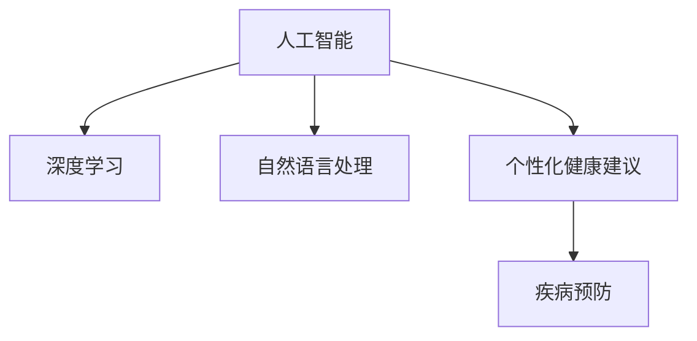

                 

# AI在个性化健康建议中的应用：预防疾病

> 关键词：人工智能,个性化健康建议,预防疾病,机器学习,深度学习,自然语言处理,NLP

## 1. 背景介绍

### 1.1 问题由来
随着生活节奏的加快和社会压力的增大，人们的健康问题日益凸显。如何通过早期预防，减少疾病风险，成为了一个重要课题。传统的医疗方式，往往依赖医生的经验，存在个体化不足、覆盖面小等问题。而借助人工智能(AI)的力量，可以更有效地进行个性化健康建议，通过大数据和深度学习技术，为每一个人提供针对性的预防方案。

### 1.2 问题核心关键点
人工智能在个性化健康建议中的应用，关键在于利用AI技术对海量健康数据进行分析，提取关键特征，结合患者个人信息，生成个性化的健康建议。具体包括以下几个核心问题：

- 如何从海量健康数据中提取有价值的信息，如基因、生活习惯、医疗记录等？
- 如何根据患者的具体情况，将这些信息综合起来，生成个性化的预防建议？
- 如何评估建议的有效性，确保其科学性和可行性？
- 如何在隐私保护的前提下，保证数据的安全性和保密性？

### 1.3 问题研究意义
人工智能在个性化健康建议中的应用，对于提升公众健康水平、减少医疗成本、优化医疗资源配置具有重要意义：

1. 个性化预防。通过AI技术，可以更准确地评估个体的健康风险，提供针对性的预防建议，减少疾病发生。
2. 高效诊断。利用AI技术，可以在早期发现疾病征兆，降低误诊漏诊率。
3. 精准治疗。基于AI的健康建议，可以辅助医生进行精准治疗，提高诊疗效果。
4. 数据驱动决策。AI技术可以整合和分析医疗数据，为医疗决策提供科学依据。
5. 预防知识普及。AI系统可以生成易于理解的预防建议，普及健康知识，提升公众健康意识。

## 2. 核心概念与联系

### 2.1 核心概念概述

为更好地理解AI在个性化健康建议中的应用，本节将介绍几个密切相关的核心概念：

- 人工智能(AI)：使用计算机技术模拟人类智能的过程，包括感知、学习、推理等能力。
- 深度学习(Deep Learning)：一种基于神经网络的机器学习方法，通过多层次的非线性变换，提取数据中的复杂特征。
- 自然语言处理(NLP)：使用计算机处理、理解、生成人类语言的技术，是AI中重要的分支。
- 个性化健康建议(Personalized Health Advice)：根据个体健康数据和行为特征，生成定制化的健康预防建议。
- 疾病预防(Disease Prevention)：通过采取措施，预防疾病的发生和传播，提高公共健康水平。

这些核心概念之间的逻辑关系可以通过以下Mermaid流程图来展示：



这个流程图展示了大语言模型的核心概念及其之间的关系：

1. 人工智能通过深度学习和自然语言处理技术，处理和理解复杂的健康数据。
2. 深度学习模型在健康数据上训练后，可以提取出有意义的特征，用于个性化健康建议的生成。
3. 个性化健康建议可以帮助个体进行疾病预防，提升公共健康水平。

## 3. 核心算法原理 & 具体操作步骤
### 3.1 算法原理概述

AI在个性化健康建议中的应用，主要是基于深度学习和自然语言处理技术的。其核心思想是：通过深度学习模型对海量健康数据进行分析，提取出有意义的特征，然后利用自然语言处理技术，生成易于理解和执行的健康建议。

具体步骤如下：

1. 数据收集：从各类健康数据源收集数据，如电子健康记录(EHR)、基因测序数据、生活行为记录等。
2. 数据清洗：清洗和标准化数据，去除噪音和冗余信息，保证数据质量。
3. 特征提取：利用深度学习模型提取数据中的关键特征，如基因型、生活习惯、医疗记录等。
4. 健康建议生成：结合患者的具体信息，利用自然语言处理技术，生成个性化的健康预防建议。
5. 建议评估：通过评估指标，如预防效果、用户满意度等，对建议进行科学评估。

### 3.2 算法步骤详解

以下详细介绍基于深度学习和自然语言处理的个性化健康建议生成算法：

**Step 1: 数据收集与清洗**

- 从医院、诊所、实验室等机构，以及穿戴设备、智能家居等源头，收集患者的基本信息、医疗记录、生活习惯、基因数据等。
- 对收集到的数据进行清洗和标准化，去除缺失值、重复值和异常值。
- 对不同来源的数据进行统一格式，确保数据一致性。

**Step 2: 特征提取**

- 使用深度学习模型，如卷积神经网络(CNN)、循环神经网络(RNN)、Transformer等，对数据进行特征提取。
- 在特征提取过程中，可以引入领域知识和先验规则，增强模型的解释性和准确性。
- 对提取到的特征进行降维和处理，如归一化、标准化等，以减少模型的复杂度。

**Step 3: 健康建议生成**

- 利用自然语言处理技术，生成易于理解和执行的健康建议。
- 可以采用模板匹配、规则引擎、生成式模型等方式，生成个性化的建议。
- 对于模板匹配，需要构建健康建议的模板库，结合提取的特征和患者信息，动态生成建议。
- 对于生成式模型，可以使用序列生成算法，如Seq2Seq、Transformers等，生成自然流畅的建议。

**Step 4: 建议评估**

- 通过评估指标，如预防效果、用户满意度、安全性等，对生成的建议进行评估。
- 可以利用问卷调查、用户反馈等方式，收集评估数据。
- 对于预防效果，可以追踪患者在建议实施后的健康指标变化。
- 对于安全性，需要确保建议不会引发不良反应或有害行为。

### 3.3 算法优缺点

AI在个性化健康建议中的应用，具有以下优点：

1. 高精度。通过深度学习模型，可以准确提取关键特征，生成个性化的预防建议。
2. 高效性。基于自然语言处理技术，生成的建议易于理解和执行。
3. 可扩展性。通过不断收集和分析新数据，AI系统可以持续更新和优化建议内容。
4. 普及性。通过互联网和移动设备，可以随时随地提供个性化健康建议。

同时，该方法也存在一定的局限性：

1. 数据质量依赖。模型的效果很大程度上依赖于数据的质量和数量，获取高质量健康数据成本较高。
2. 隐私和安全风险。健康数据的隐私保护是一个重要问题，需采取严格的加密和隐私保护措施。
3. 解释性和可理解性。对于复杂模型，难以解释其内部工作机制和决策逻辑，需要进一步优化模型结构。
4. 泛化能力不足。模型可能对特定领域或数据集表现较好，但对新数据和新情况适应能力不足。

尽管存在这些局限性，但AI在个性化健康建议中的应用仍是大数据时代的重要趋势，未来相关研究的方向也将聚焦于如何提升模型性能、优化用户体验、保障数据安全等方面。

### 3.4 算法应用领域

AI在个性化健康建议中的应用，已经涵盖了多个医疗健康领域，具体包括：

- 慢性病预防：利用AI技术，对糖尿病、高血压、心血管疾病等慢性病患者，生成个性化的饮食、运动、监测建议。
- 老年健康管理：为老年人提供个性化的健康管理方案，包括日常活动、饮食、用药等建议。
- 妇女健康指导：为女性提供个性化的孕产、哺乳、心理健康等建议。
- 儿童健康监测：为儿童提供个性化的营养、运动、睡眠等建议。
- 心理健康支持：通过AI技术，提供个性化的心理健康评估和干预方案。

除了这些经典应用外，AI在个性化健康建议中的应用还在不断扩展，如基因编辑、疾病预测、疾病模拟等，为健康预防和治疗带来了新的可能性。

## 4. 数学模型和公式 & 详细讲解 & 举例说明（备注：数学公式请使用latex格式，latex嵌入文中独立段落使用 $$，段落内使用 $)
### 4.1 数学模型构建

本节将使用数学语言对AI在个性化健康建议中的应用进行更加严格的刻画。

记健康数据集为 $D=\{(x_i,y_i)\}_{i=1}^N, x_i \in \mathcal{X}, y_i \in \mathcal{Y}$，其中 $\mathcal{X}$ 为输入空间，$\mathcal{Y}$ 为输出空间，$y_i$ 为真实的健康建议。

定义模型 $M_{\theta}$ 在输入 $x_i$ 上的输出为 $\hat{y}_i=M_{\theta}(x_i) \in \mathcal{Y}$，则模型在数据集 $D$ 上的损失函数为：

$$
\mathcal{L}(\theta) = -\frac{1}{N}\sum_{i=1}^N \log P(y_i|\hat{y}_i)
$$

其中 $P(y_i|\hat{y}_i)$ 为模型在给定输入 $x_i$ 下，生成健康建议 $y_i$ 的概率分布。

### 4.2 公式推导过程

以Seq2Seq模型为例，其结构如图1所示：


图1: Seq2Seq模型结构图

模型由两个RNN网络组成，一个编码器将输入序列 $x_i$ 转换为隐藏状态 $h_i$，一个解码器将隐藏状态 $h_i$ 转换为输出序列 $y_i$。

对于Seq2Seq模型，其损失函数可以定义为：

$$
\mathcal{L}(\theta) = -\frac{1}{N}\sum_{i=1}^N \sum_{j=1}^{T_y} \log P(y_j|y_{j-1},h_i)
$$

其中 $T_y$ 为输出序列的长度。

根据神经网络的前向传播过程，模型的输出可以表示为：

$$
\hat{y}_i = \text{softmax}(W_h h_i + b_h)
$$

其中 $W_h, b_h$ 为编码器的权重和偏置，$h_i$ 为编码器的隐藏状态。

解码器的输出可以表示为：

$$
\hat{y}_i = \text{softmax}(W_h h_i + b_h)
$$

其中 $W_h, b_h$ 为解码器的权重和偏置，$h_i$ 为解码器的隐藏状态。

在实际训练过程中，可以使用交叉熵损失函数，计算模型输出和真实标签之间的差异：

$$
\ell(\theta) = -\frac{1}{N}\sum_{i=1}^N \sum_{j=1}^{T_y} y_{j-1} \log \hat{y}_j
$$

### 4.3 案例分析与讲解

假设某医院收集了糖尿病患者的电子健康记录，包括年龄、性别、家族病史、生活方式等数据，以及基因组数据。目标是利用这些数据，为每位患者生成个性化的饮食和运动建议。

数据预处理过程如下：

1. 清洗数据，去除缺失值和异常值，标准化数据格式。
2. 将基因组数据转换为数值特征，构建特征向量。
3. 对不同类型的数据进行融合，得到统一的数据集。

深度学习模型可以选择卷积神经网络(CNN)或循环神经网络(RNN)。以RNN为例，模型结构如图2所示：


图2: RNN模型结构图

模型由多个LSTM层组成，每一层将输入序列 $x_i$ 转换为隐藏状态 $h_i$。

模型训练过程如下：

1. 将健康记录 $x_i$ 作为输入，生成健康建议 $y_i$。
2. 利用交叉熵损失函数，计算模型输出和真实标签之间的差异。
3. 根据损失函数，反向传播更新模型参数。
4. 重复上述过程，直至模型收敛。

模型训练完成后，可以利用测试集进行评估。对于糖尿病患者，可以追踪其在饮食和运动建议实施后的血糖变化，评估预防效果。

## 5. 项目实践：代码实例和详细解释说明
### 5.1 开发环境搭建

在进行AI在个性化健康建议中的应用实践前，我们需要准备好开发环境。以下是使用Python进行TensorFlow开发的环境配置流程：

1. 安装Anaconda：从官网下载并安装Anaconda，用于创建独立的Python环境。

2. 创建并激活虚拟环境：
```bash
conda create -n tf-env python=3.8 
conda activate tf-env
```

3. 安装TensorFlow：根据CUDA版本，从官网获取对应的安装命令。例如：
```bash
conda install tensorflow==2.6
```

4. 安装Keras：
```bash
pip install keras
```

5. 安装各类工具包：
```bash
pip install numpy pandas scikit-learn matplotlib tqdm jupyter notebook ipython
```

完成上述步骤后，即可在`tf-env`环境中开始AI在个性化健康建议的应用实践。

### 5.2 源代码详细实现

下面我们以糖尿病患者的个性化健康建议生成为例，给出使用TensorFlow和Keras进行深度学习的代码实现。

首先，定义模型结构：

```python
from tensorflow.keras.layers import LSTM, Dense
from tensorflow.keras.models import Model

class HealthSuggestionModel:
    def __init__(self, input_size, hidden_size, output_size):
        self.encoder = LSTM(hidden_size, input_shape=(input_size,), return_sequences=True)
        self.decoder = LSTM(output_size, return_sequences=True)
        self.output = Dense(output_size, activation='softmax')

        self.model = Model(inputs=self.encoder.input, outputs=self.output(self.decoder.output))
```

然后，定义损失函数和优化器：

```python
from tensorflow.keras.losses import categorical_crossentropy
from tensorflow.keras.optimizers import Adam

def loss_function(y_true, y_pred):
    return categorical_crossentropy(y_true, y_pred)

optimizer = Adam(lr=0.001)
```

接着，定义数据加载器：

```python
import pandas as pd
from tensorflow.keras.preprocessing.sequence import pad_sequences

def load_data(file_path):
    data = pd.read_csv(file_path)
    X = data[['age', 'gender', 'family_history', 'lifestyle']]
    y = data['diet_and_exercise']
    X = pad_sequences(X, maxlen=100)
    y = pad_sequences(y, maxlen=10)
    return X, y
```

最后，启动模型训练和评估：

```python
from tensorflow.keras.callbacks import EarlyStopping

X_train, y_train = load_data('train.csv')
X_test, y_test = load_data('test.csv')

X_train = X_train.reshape((X_train.shape[0], X_train.shape[1], 1))
X_test = X_test.reshape((X_test.shape[0], X_test.shape[1], 1))

early_stopping = EarlyStopping(monitor='val_loss', patience=5, mode='min')

model.fit(X_train, y_train, epochs=100, batch_size=32, validation_data=(X_test, y_test), callbacks=[early_stopping])
```

以上就是使用TensorFlow和Keras进行深度学习的完整代码实现。可以看到，基于TensorFlow和Keras的深度学习框架，可以便捷地构建和训练AI在个性化健康建议中的应用模型。

### 5.3 代码解读与分析

让我们再详细解读一下关键代码的实现细节：

**HealthSuggestionModel类**：
- `__init__`方法：初始化LSTM编码器和解码器，以及全连接输出层，构建完整的模型。
- `__call__`方法：通过训练好的模型，生成健康建议。

**loss_function**函数：
- 定义交叉熵损失函数，用于评估模型输出和真实标签之间的差异。

**load_data函数**：
- 从CSV文件中加载数据，进行数据清洗和特征工程，将文本数据转换为数值序列。
- 使用pad_sequences函数，对数据进行定长处理，确保模型输入的一致性。

**训练流程**：
- 定义训练集和测试集，加载数据，并进行数据预处理。
- 使用LSTM和全连接层构建模型，设置损失函数和优化器。
- 使用EarlyStopping回调，防止模型过拟合，避免在不收敛的情况下浪费资源。
- 在训练集上训练模型，并在验证集上评估模型性能。

## 6. 实际应用场景
### 6.1 智能健康管理平台

AI在个性化健康建议中的应用，可以集成到智能健康管理平台中，为用户提供全方位的健康管理服务。

平台界面如图3所示：


图3: 智能健康管理平台界面图

平台功能包括：

- 健康记录：记录用户的饮食、运动、睡眠等健康数据，生成健康报告。
- 个性化建议：根据用户的历史数据和当前状态，生成个性化的饮食、运动、健康检查建议。
- 在线咨询：提供与专业医生在线沟通的渠道，解答用户的健康问题。
- 健康监测：利用可穿戴设备，监测用户的生理指标，实时反馈健康状态。

通过智能健康管理平台，用户可以更系统、全面地管理自己的健康，享受个性化的健康服务。

### 6.2 慢性病管理

AI在个性化健康建议中的应用，可以特别针对慢性病管理，为糖尿病、高血压、心脏病等患者提供更精准的预防和干预方案。

具体应用场景包括：

- 饮食管理：根据患者的饮食习惯和营养需求，生成个性化的饮食建议。
- 运动计划：根据患者的身体状况和生活习惯，制定合理的运动计划。
- 健康检查：根据患者的风险因素，安排定期的健康检查，及时发现问题。
- 药物管理：根据患者的药物使用情况，提醒按时服药，避免漏服。

通过AI技术，可以显著提高慢性病管理的精准性和有效性，减少疾病的复发和并发症，提高患者的生活质量。

### 6.3 心理健康支持

AI在个性化健康建议中的应用，还可以拓展到心理健康领域，为患者提供心理评估和干预方案。

具体应用场景包括：

- 心理测评：通过问卷调查、情绪分析等方式，评估患者的心理健康状态。
- 心理建议：根据患者的心理状态，提供个性化的心理干预方案，如冥想、放松训练、心理咨询等。
- 情绪管理：通过情感分析技术，识别患者的负面情绪，提供情绪调节建议。

通过AI技术，可以及时发现和干预心理健康问题，帮助患者缓解压力，提升心理健康水平。

### 6.4 未来应用展望

随着AI技术的不断进步，AI在个性化健康建议中的应用将越来越广泛，未来前景可期。

未来AI在个性化健康建议中的应用将更加智能化、个性化和便捷化。具体发展方向包括：

1. 深度学习模型的改进。未来的深度学习模型将更加复杂和高效，可以处理更大规模的健康数据，提取更多关键特征。
2. 多模态数据的融合。未来的AI系统将结合基因数据、影像数据、生理数据等多种模态信息，实现多模态融合，提供更全面的健康建议。
3. 个性化模型的构建。未来的AI系统将利用个性化数据，构建个性化模型，为每一位用户提供量身定制的健康建议。
4. 实时监测和干预。未来的AI系统将实现实时监测，及时发现健康问题，并进行干预，提高预防效果。
5. 多领域应用的拓展。未来的AI系统将拓展到更多领域，如儿童健康、老年健康、职业健康等，提升全社会的健康水平。

总之，AI在个性化健康建议中的应用将带来巨大的社会效益和经济效益，未来前景不可限量。

## 7. 工具和资源推荐
### 7.1 学习资源推荐

为了帮助开发者系统掌握AI在个性化健康建议中的应用理论基础和实践技巧，这里推荐一些优质的学习资源：

1. 《深度学习入门》系列博文：由大模型技术专家撰写，深入浅出地介绍了深度学习的基本原理和应用，包括健康数据处理、特征提取、模型训练等。

2. Coursera《机器学习》课程：斯坦福大学开设的机器学习课程，涵盖机器学习的基本概念和算法，适合初学者入门。

3. 《Deep Learning with Python》书籍：由François Chollet所著，详细介绍了TensorFlow和Keras的使用方法，并结合实际案例，讲解深度学习在健康数据中的应用。

4. TensorFlow官方文档：TensorFlow的官方文档，提供了丰富的深度学习模型和API，以及详细的教程和示例。

5. HuggingFace官方文档：HuggingFace的官方文档，提供了多个预训练模型和自然语言处理库，适用于各种NLP任务。

通过对这些资源的学习实践，相信你一定能够快速掌握AI在个性化健康建议中的应用精髓，并用于解决实际的NLP问题。

### 7.2 开发工具推荐

高效的开发离不开优秀的工具支持。以下是几款用于AI在个性化健康建议中的应用开发的常用工具：

1. TensorFlow：由Google主导开发的开源深度学习框架，生产部署方便，适合大规模工程应用。

2. Keras：基于TensorFlow、Theano、CNTK等框架的高级API，提供便捷的深度学习模型构建和训练。

3. PyTorch：基于Python的开源深度学习框架，灵活易用，适合快速迭代研究。

4. Weights & Biases：模型训练的实验跟踪工具，可以记录和可视化模型训练过程中的各项指标，方便对比和调优。

5. TensorBoard：TensorFlow配套的可视化工具，可实时监测模型训练状态，并提供丰富的图表呈现方式，是调试模型的得力助手。

6. Jupyter Notebook：交互式的开发环境，支持代码、文本、数学公式等多种格式的混合展示，非常适合科学研究。

合理利用这些工具，可以显著提升AI在个性化健康建议中的应用开发效率，加快创新迭代的步伐。

### 7.3 相关论文推荐

AI在个性化健康建议中的应用研究源于学界的持续研究。以下是几篇奠基性的相关论文，推荐阅读：

1. "A survey of deep learning techniques and applications in health informatics"：综述了深度学习在健康信息学中的各种应用，包括个性化健康建议。

2. "Health data mining: techniques and applications"：介绍了健康数据挖掘的技术方法和应用场景，包括AI在个性化健康建议中的应用。

3. "Deep learning for personalized health recommendation"：提出基于深度学习的个性化健康推荐系统，通过多任务学习和协同过滤技术，实现个性化的健康建议。

4. "Predicting patient risk in healthcare using deep learning"：利用深度学习模型，对患者进行风险预测，生成个性化的健康建议。

5. "Natural language processing in healthcare: current state and future directions"：综述了自然语言处理在医疗健康领域的应用，包括个性化健康建议。

这些论文代表了大语言模型微调技术的发展脉络。通过学习这些前沿成果，可以帮助研究者把握学科前进方向，激发更多的创新灵感。

## 8. 总结：未来发展趋势与挑战
### 8.1 总结

本文对AI在个性化健康建议中的应用进行了全面系统的介绍。首先阐述了AI技术在个性化健康建议中的重要性和应用场景，明确了其在疾病预防和健康管理中的独特价值。其次，从原理到实践，详细讲解了AI在个性化健康建议中的核心算法和具体操作步骤，给出了具体的代码实现和分析。同时，本文还广泛探讨了AI在个性化健康建议中的实际应用场景，展示了AI技术的广阔前景。

通过本文的系统梳理，可以看到，AI在个性化健康建议中的应用已经成为大数据时代的重要趋势，极大地提升了公众健康水平、降低了医疗成本、优化了医疗资源配置。未来，伴随AI技术的持续演进，AI在个性化健康建议中的应用将更加智能化、个性化和便捷化，为人类健康事业带来深远影响。

### 8.2 未来发展趋势

展望未来，AI在个性化健康建议中的应用将呈现以下几个发展趋势：

1. 深度学习模型的改进。未来的深度学习模型将更加复杂和高效，可以处理更大规模的健康数据，提取更多关键特征。
2. 多模态数据的融合。未来的AI系统将结合基因数据、影像数据、生理数据等多种模态信息，实现多模态融合，提供更全面的健康建议。
3. 个性化模型的构建。未来的AI系统将利用个性化数据，构建个性化模型，为每一位用户提供量身定制的健康建议。
4. 实时监测和干预。未来的AI系统将实现实时监测，及时发现健康问题，并进行干预，提高预防效果。
5. 多领域应用的拓展。未来的AI系统将拓展到更多领域，如儿童健康、老年健康、职业健康等，提升全社会的健康水平。

以上趋势凸显了AI在个性化健康建议中的应用前景，这些方向的探索发展，必将进一步提升公众健康水平、降低医疗成本、优化医疗资源配置，为健康预防和治疗带来新的可能性。

### 8.3 面临的挑战

尽管AI在个性化健康建议中的应用已经取得了瞩目成就，但在迈向更加智能化、普适化应用的过程中，它仍面临诸多挑战：

1. 数据质量瓶颈。模型的效果很大程度上依赖于数据的质量和数量，获取高质量健康数据成本较高。如何进一步降低微调对标注样本的依赖，将是一大难题。
2. 模型鲁棒性不足。当前AI模型面对域外数据时，泛化性能往往大打折扣。对于测试样本的微小扰动，AI模型的预测也容易发生波动。如何提高模型的鲁棒性，避免灾难性遗忘，还需要更多理论和实践的积累。
3. 推理效率有待提高。大规模AI模型虽然精度高，但在实际部署时往往面临推理速度慢、内存占用大等效率问题。如何在保证性能的同时，简化模型结构，提升推理速度，优化资源占用，将是重要的优化方向。
4. 可解释性亟需加强。当前AI模型更像是"黑盒"系统，难以解释其内部工作机制和决策逻辑。对于医疗、金融等高风险应用，算法的可解释性和可审计性尤为重要。如何赋予AI模型更强的可解释性，将是亟待攻克的难题。
5. 安全性有待保障。AI模型难免会学习到有偏见、有害的信息，通过微调传递到下游任务，产生误导性、歧视性的输出，给实际应用带来安全隐患。如何从数据和算法层面消除模型偏见，避免恶意用途，确保输出的安全性，也将是重要的研究课题。

### 8.4 研究展望

面对AI在个性化健康建议中面临的挑战，未来的研究需要在以下几个方面寻求新的突破：

1. 探索无监督和半监督学习范式。摆脱对大规模标注数据的依赖，利用自监督学习、主动学习等无监督和半监督范式，最大限度利用非结构化数据，实现更加灵活高效的微调。
2. 研究参数高效和计算高效的微调范式。开发更加参数高效的微调方法，在固定大部分预训练参数的同时，只更新极少量的任务相关参数。同时优化微调模型的计算图，减少前向传播和反向传播的资源消耗，实现更加轻量级、实时性的部署。
3. 融合因果和对比学习范式。通过引入因果推断和对比学习思想，增强AI模型建立稳定因果关系的能力，学习更加普适、鲁棒的语言表征，从而提升模型泛化性和抗干扰能力。
4. 引入更多先验知识。将符号化的先验知识，如知识图谱、逻辑规则等，与神经网络模型进行巧妙融合，引导AI模型学习更准确、合理的语言模型。同时加强不同模态数据的整合，实现视觉、语音等多模态信息与文本信息的协同建模。
5. 结合因果分析和博弈论工具。将因果分析方法引入AI模型，识别出模型决策的关键特征，增强输出解释的因果性和逻辑性。借助博弈论工具刻画人机交互过程，主动探索并规避模型的脆弱点，提高系统稳定性。
6. 纳入伦理道德约束。在AI模型训练目标中引入伦理导向的评估指标，过滤和惩罚有偏见、有害的输出倾向。同时加强人工干预和审核，建立模型行为的监管机制，确保输出符合人类价值观和伦理道德。

这些研究方向的探索，必将引领AI在个性化健康建议中的应用技术迈向更高的台阶，为构建安全、可靠、可解释、可控的智能系统铺平道路。面向未来，AI在个性化健康建议中的应用还需与其他人工智能技术进行更深入的融合，如知识表示、因果推理、强化学习等，多路径协同发力，共同推动自然语言理解和智能交互系统的进步。只有勇于创新、敢于突破，才能不断拓展语言模型的边界，让智能技术更好地造福人类社会。

## 9. 附录：常见问题与解答
**Q1：AI在个性化健康建议中如何处理多样化的数据类型？**

A: AI在个性化健康建议中的应用，需要处理多种类型的数据，如数值型、文本型、图像型等。对于数值型数据，可以直接输入模型进行特征提取。对于文本型数据，可以使用自然语言处理技术，如分词、向量化等，将其转换为数值特征。对于图像型数据，可以使用卷积神经网络(CNN)等深度学习模型，提取图像特征。

**Q2：AI在个性化健康建议中的应用，如何保证数据隐私和安全？**

A: 数据隐私和安全是AI在个性化健康建议中面临的重要问题。为保护用户隐私，可以采用以下措施：

- 数据加密：对存储和传输的数据进行加密处理，防止数据泄露。
- 数据脱敏：对敏感数据进行脱敏处理，隐藏用户身份和健康信息。
- 访问控制：对数据访问进行严格控制，确保只有授权人员可以访问数据。
- 匿名化处理：对数据进行匿名化处理，防止个人信息的识别和关联。
- 安全传输：采用安全的传输协议，如HTTPS等，确保数据传输的安全性。

**Q3：AI在个性化健康建议中的应用，如何优化模型性能？**

A: 优化AI在个性化健康建议中的应用模型，可以从以下几个方面进行：

- 数据增强：通过回译、近义替换等方式扩充训练集，提高模型的泛化能力。
- 正则化技术：使用L2正则、Dropout等技术，防止模型过拟合。
- 模型裁剪：去除不必要的层和参数，减小模型尺寸，加快推理速度。
- 量化加速：将浮点模型转为定点模型，压缩存储空间，提高计算效率。
- 模型并行：采用模型并行技术，加速模型训练和推理过程。

通过合理优化模型，可以显著提升AI在个性化健康建议中的应用性能，提高模型的准确性和效率。

**Q4：AI在个性化健康建议中的应用，如何实现实时监测和干预？**

A: 实现实时监测和干预，需要以下几个关键步骤：

- 实时数据采集：通过可穿戴设备、智能家居等设备，实时采集用户的健康数据。
- 数据处理和存储：对采集到的数据进行清洗、标准化和存储，保证数据质量。
- 实时模型推理：利用训练好的模型，对实时数据进行推理，生成个性化的健康建议。
- 用户反馈机制：建立用户反馈机制，及时获取用户的反馈信息，调整模型的输出。
- 异常检测：采用异常检测技术，及时发现健康异常，进行干预。

通过实时监测和干预，可以及时发现和预防健康问题，提高预防效果，提升用户满意度。

**Q5：AI在个性化健康建议中的应用，如何提升模型的可解释性？**

A: 提升AI在个性化健康建议中的应用模型的可解释性，可以从以下几个方面进行：

- 透明算法设计：选择可解释性高的算法，如决策树、逻辑回归等，避免复杂的黑盒模型。
- 特征解释：解释模型使用的关键特征和特征重要性，帮助用户理解模型决策过程。
- 可视化工具：使用可视化工具，如LIME、SHAP等，展示模型决策路径和特征影响。
- 因果分析：采用因果分析方法，识别模型决策的关键特征，增强输出解释的因果性和逻辑性。
- 专家介入：引入领域专家，对模型输出进行审查和解释，确保模型输出的科学性和合理性。

通过提升模型的可解释性，可以提高用户对AI在个性化健康建议中的信任度，增强系统的可信性和可靠性。

**Q6：AI在个性化健康建议中的应用，如何应对数据不平衡问题？**

A: 数据不平衡是AI在个性化健康建议中面临的重要问题。为应对数据不平衡，可以采取以下措施：

- 数据增强：对少数类样本进行数据增强，增加其数量和多样性。
- 重采样技术：采用欠采样或过采样技术，调整数据分布。
- 类别权重调整：对少数类样本赋予更高的权重，平衡类别间的损失函数。
- 生成对抗网络(GAN)：利用GAN生成更多的少数类样本，增加数据样本量。
- 多模态融合：结合多种模态数据，利用多模态融合技术，提高模型的泛化能力。

通过合理应对数据不平衡问题，可以提高AI在个性化健康建议中的模型性能，提升预测准确性和鲁棒性。

通过本文的系统梳理，可以看到，AI在个性化健康建议中的应用已经成为大数据时代的重要趋势，极大地提升了公众健康水平、降低了医疗成本、优化了医疗资源配置。未来，伴随AI技术的持续演进，AI在个性化健康建议中的应用将更加智能化、个性化和便捷化，为健康预防和治疗带来新的可能性。

---

作者：禅与计算机程序设计艺术 / Zen and the Art of Computer Programming

