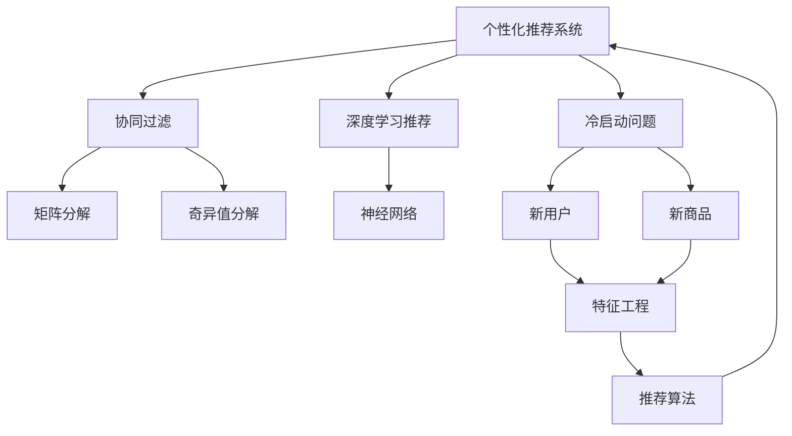

                 

# AI在个性化推荐中的创新应用

> 关键词：个性化推荐,深度学习,协同过滤,推荐算法,神经网络,冷启动问题,分布式推荐系统,数据隐私保护,用户行为建模,内容推荐

## 1. 背景介绍

### 1.1 问题由来
个性化推荐系统（Personalized Recommendation System, PReS）是现代互联网公司获取用户粘性和收益增长的重要手段。通过深度学习等先进技术，个性化推荐系统已经实现了显著的性能提升。推荐系统能够根据用户的历史行为数据和偏好，实时为用户推荐其感兴趣的内容，提升用户体验和满意度。

目前，个性化推荐系统广泛应用于电商、社交媒体、视频网站等多个领域。如淘宝的“猜你喜欢”、亚马逊的“发现相似商品”、Netflix的“电影推荐”等，都是基于深度学习和推荐算法开发的经典案例。但同时，随着用户量的持续增长，个性化推荐系统的数据量和计算复杂度也在不断提升，如何高效、准确地处理海量数据，成为了亟待解决的问题。

### 1.2 问题核心关键点
个性化推荐系统通过深度学习和推荐算法，对用户和商品之间的关系进行建模。常用的推荐算法包括协同过滤、基于内容的推荐、深度学习推荐等。其中，协同过滤是最经典的推荐算法之一，通过对用户行为数据和商品评分数据进行建模，预测用户对未评分商品的兴趣。

协同过滤算法又可以分为基于用户的协同过滤和基于物品的协同过滤。基于用户的协同过滤通过计算用户之间的相似度，推荐与用户兴趣相似的商品；基于物品的协同过滤通过计算商品之间的相似度，推荐与用户评分高的商品。

尽管协同过滤算法在推荐效果上表现优异，但其依赖于用户评分数据，对于新用户或新商品，即所谓的“冷启动问题”，需要额外的处理方法。

## 2. 核心概念与联系

### 2.1 核心概念概述

为更好地理解个性化推荐系统的核心原理，本节将介绍几个密切相关的核心概念：

- 个性化推荐系统：通过深度学习等技术，根据用户的历史行为数据和偏好，实时为用户推荐其感兴趣的内容。
- 协同过滤算法：基于用户或商品之间的相似度进行推荐，通过矩阵分解、奇异值分解等方法建模用户和商品之间的关系。
- 深度学习推荐：通过神经网络对用户行为数据进行建模，预测用户对未评分商品的兴趣。
- 冷启动问题：对于新用户或新商品，由于缺乏历史评分数据，需要额外的处理方法。
- 分布式推荐系统：通过多机并行和分布式计算，实现高效推荐。
- 数据隐私保护：在推荐过程中，如何保护用户数据的隐私安全。

这些核心概念之间的逻辑关系可以通过以下Mermaid流程图来展示：



这个流程图展示了个性化推荐系统的核心概念及其之间的关系：

1. 个性化推荐系统通过协同过滤、深度学习推荐等算法对用户和商品之间的关系进行建模。
2. 协同过滤通过矩阵分解、奇异值分解等方法，对用户评分数据进行建模。
3. 深度学习推荐通过神经网络对用户行为数据进行建模，预测用户对未评分商品的兴趣。
4. 对于冷启动问题，推荐系统需要结合基于行为的数据和特征工程进行处理。
5. 分布式推荐系统通过多机并行和分布式计算，提升推荐效率。
6. 数据隐私保护是推荐系统的核心要求，需合理设计算法和架构，避免数据泄露。

这些概念共同构成了个性化推荐系统的学习和应用框架，使其能够在用户行为数据的基础上，实时高效地推荐相关内容。通过理解这些核心概念，我们可以更好地把握个性化推荐系统的技术细节和工作原理。

## 3. 核心算法原理 & 具体操作步骤
### 3.1 算法原理概述

个性化推荐系统的主要算法原理包括以下几个方面：

1. **协同过滤算法**：基于用户或物品的评分数据，通过计算相似度来推荐用户可能感兴趣的物品。
2. **深度学习推荐**：利用神经网络对用户行为数据进行建模，预测用户对未评分物品的兴趣。
3. **基于内容的推荐**：根据物品的属性特征，推荐与用户已评分物品相似的物品。
4. **矩阵分解**：将用户评分矩阵分解成用户矩阵和物品矩阵，通过低秩矩阵分解获得用户和物品的特征表示。
5. **奇异值分解(SVD)**：对用户评分矩阵进行奇异值分解，找到用户和物品的隐向量，实现稀疏矩阵的稠密表示。
6. **深度神经网络**：通过多层神经网络对用户行为数据进行建模，预测用户对未评分物品的兴趣。

### 3.2 算法步骤详解

基于协同过滤和深度学习推荐的个性化推荐系统，一般包括以下几个关键步骤：

**Step 1: 数据收集与预处理**
- 收集用户行为数据和物品评分数据，包括点击、浏览、评分、购买等。
- 对数据进行清洗、去重、归一化等预处理，确保数据的质量和一致性。

**Step 2: 特征提取与建模**
- 提取用户和物品的特征，如用户的兴趣标签、物品的分类标签等。
- 对用户评分矩阵进行矩阵分解或奇异值分解，获得用户和物品的隐向量表示。
- 利用神经网络对用户行为数据进行建模，获得用户对未评分物品的兴趣预测。

**Step 3: 相似度计算与推荐**
- 计算用户之间的相似度，根据相似度推荐物品。
- 利用深度神经网络预测用户对未评分物品的兴趣，并将其添加到推荐列表中。

**Step 4: 推荐结果排序**
- 结合用户评分、物品评分、用户行为特征等因素，对推荐结果进行排序。
- 将推荐结果返回给用户，并实时更新推荐列表。

### 3.3 算法优缺点

个性化推荐系统通过协同过滤和深度学习推荐，具有以下优点：
1. 精确度高。基于用户行为数据的深度学习推荐算法，能够更好地捕捉用户偏好，提升推荐精度。
2. 实时性强。协同过滤和深度学习推荐能够实时更新推荐结果，提高用户体验。
3. 可扩展性好。分布式推荐系统通过多机并行和分布式计算，实现高效推荐。
4. 用户粘度高。推荐系统能够不断发现新兴趣，保持用户粘性。

同时，该方法也存在一定的局限性：
1. 数据需求高。深度学习推荐算法依赖于用户行为数据，对于新用户或新商品，推荐效果可能不佳。
2. 模型复杂度大。深度神经网络模型参数量大，训练复杂度高，需要较长的计算时间和计算资源。
3. 冷启动问题。对于新用户或新商品，推荐系统需要额外处理，以解决冷启动问题。
4. 数据隐私问题。推荐系统需要收集和处理大量用户数据，如何保护用户隐私成为重要问题。

尽管存在这些局限性，但就目前而言，个性化推荐系统通过协同过滤和深度学习推荐算法，已经在电商、社交媒体、视频网站等多个领域取得了广泛应用，成为提升用户体验的重要手段。

### 3.4 算法应用领域

基于协同过滤和深度学习的个性化推荐系统，已经在电商、社交媒体、视频网站等多个领域得到了广泛应用，具体如下：

1. 电商推荐：通过分析用户的浏览、点击、购买等行为，为用户推荐相关商品。如淘宝的“猜你喜欢”、亚马逊的“发现相似商品”。

2. 社交媒体推荐：根据用户关注、点赞、评论等行为，为用户推荐相关内容。如Facebook的“推荐新闻”、微博的“热门话题”。

3. 视频网站推荐：根据用户的观看记录、评分、点赞等行为，为用户推荐相关视频。如Netflix的“电影推荐”、优酷的“精选推荐”。

4. 音乐推荐：根据用户的听歌记录、评分、收藏等行为，为用户推荐相关歌曲。如Spotify的“每日推荐”、网易云音乐的“发现相似歌曲”。

此外，个性化推荐系统还广泛应用于新闻推荐、游戏推荐、智能家居等多个领域，为人们提供个性化、精准的服务。

## 4. 数学模型和公式 & 详细讲解  
### 4.1 数学模型构建

本节将使用数学语言对基于协同过滤和深度学习的个性化推荐系统进行更加严格的刻画。

设用户集合为 $U=\{u_1,u_2,\cdots,u_N\}$，物品集合为 $I=\{i_1,i_2,\cdots,i_M\}$，用户对物品的评分矩阵为 $R \in \mathbb{R}^{N \times M}$，其中 $R_{u_i,i_j}=r_{i_j}^u$ 表示用户 $u_i$ 对物品 $i_j$ 的评分。

假设用户和物品的特征分别表示为 $X \in \mathbb{R}^{N \times D}$ 和 $Y \in \mathbb{R}^{M \times D}$，其中 $D$ 为特征维度。

定义用户 $u_i$ 对物品 $i_j$ 的评分预测值为 $y_{i_j}^u=\langle \bar{X}_u,\bar{Y}_{i_j}\rangle$，其中 $\bar{X}_u$ 和 $\bar{Y}_{i_j}$ 分别为用户 $u_i$ 和物品 $i_j$ 的特征向量表示。

基于协同过滤和深度学习的个性化推荐系统的目标是最小化预测评分与实际评分的误差，即：

$$
\min_{X,Y} \frac{1}{N} \sum_{i=1}^N \sum_{j=1}^M ||r_{i_j}^u - \langle \bar{X}_u,\bar{Y}_{i_j}\rangle ||^2
$$

### 4.2 公式推导过程

对于基于协同过滤的推荐系统，假设用户-物品评分矩阵 $R$ 低秩矩阵分解为 $R=U \times V^T$，其中 $U \in \mathbb{R}^{N \times K}$ 和 $V \in \mathbb{R}^{M \times K}$ 分别为用户和物品的低秩特征表示矩阵，$K$ 为隐向量维度。

则用户 $u_i$ 对物品 $i_j$ 的评分预测值为：

$$
y_{i_j}^u=\langle \bar{X}_u,\bar{Y}_{i_j}\rangle=\sum_{k=1}^K u_{ik}v_{jk}
$$

其中 $\bar{X}_u=\sum_{k=1}^K u_{ik}\bar{X}_k$ 和 $\bar{Y}_{i_j}=\sum_{k=1}^K v_{jk}\bar{Y}_k$，$\bar{X}_k$ 和 $\bar{Y}_k$ 分别为用户和物品的特征向量表示。

对于基于深度学习的推荐系统，假设使用多层神经网络对用户行为数据进行建模，输入为 $x_{u_i} \in \mathbb{R}^{d_x}$，输出为 $y_{i_j}^u \in \mathbb{R}^{d_y}$，则神经网络的隐层表示为：

$$
h_1 = \sigma(W_1x_{u_i}+b_1)
$$
$$
h_2 = \sigma(W_2h_1+b_2)
$$
$$
\cdots
$$
$$
y_{i_j}^u = \sigma(W_Lh_{L-1}+b_L)
$$

其中 $W_k \in \mathbb{R}^{d_k \times d_{k-1}}$ 和 $b_k \in \mathbb{R}^{d_k}$ 分别为第 $k$ 层的权重和偏置向量，$h_k$ 为第 $k$ 层的隐层表示。

### 4.3 案例分析与讲解

以Spotify的个性化音乐推荐为例，展示基于协同过滤和深度学习的推荐系统的工作原理：

Spotify使用协同过滤和深度学习相结合的方式，为用户提供个性化的音乐推荐。具体步骤如下：

1. 数据收集：Spotify收集用户的听歌记录、评分、收藏等行为数据，以及音乐的标签、流派、艺术家等属性数据。

2. 特征提取：提取用户和音乐的特征，如用户的兴趣标签、音乐的分类标签等。

3. 协同过滤：将用户评分矩阵 $R$ 进行低秩矩阵分解，获得用户和音乐的隐向量表示。

4. 深度学习：利用多层神经网络对用户行为数据进行建模，预测用户对未评分音乐的兴趣。

5. 推荐排序：结合用户评分、音乐评分、用户行为特征等因素，对推荐结果进行排序。

6. 实时更新：根据用户的实时行为数据，实时更新推荐列表。

通过上述步骤，Spotify能够为用户提供个性化、精准的音乐推荐服务，增强用户粘性和满意度。

## 5. 项目实践：代码实例和详细解释说明
### 5.1 开发环境搭建

在进行推荐系统开发前，我们需要准备好开发环境。以下是使用Python进行TensorFlow开发的环境配置流程：

1. 安装Anaconda：从官网下载并安装Anaconda，用于创建独立的Python环境。

2. 创建并激活虚拟环境：
```bash
conda create -n tf-env python=3.8 
conda activate tf-env
```

3. 安装TensorFlow：根据CUDA版本，从官网获取对应的安装命令。例如：
```bash
conda install tensorflow-gpu -c conda-forge -c pypi -c anaconda
```

4. 安装TensorFlow Addons：提供更多深度学习模型和算法，包括协同过滤和深度学习推荐算法。

5. 安装各类工具包：
```bash
pip install numpy pandas scikit-learn matplotlib tqdm jupyter notebook ipython
```

完成上述步骤后，即可在`tf-env`环境中开始推荐系统开发。

### 5.2 源代码详细实现

下面我们以Spotify的个性化音乐推荐为例，给出使用TensorFlow实现协同过滤和深度学习推荐系统的PyTorch代码实现。

首先，定义协同过滤的特征矩阵和用户-物品评分矩阵：

```python
import numpy as np
from tensorflow_addons.layers import InputMatrix

user_features = np.random.randn(100, 10)
item_features = np.random.randn(10000, 10)
R = np.random.randn(100, 10000) * 0.1
```

然后，定义协同过滤的模型：

```python
from tensorflow.keras.layers import Dense, Embedding
from tensorflow.keras.models import Model

num_users = 100
num_items = 10000
num_factors = 10

user_input = InputMatrix(user_features, num_users, name='user')
item_input = InputMatrix(item_features, num_items, name='item')

user_embedding = Embedding(num_users, num_factors)(user_input)
item_embedding = Embedding(num_items, num_factors)(item_input)

user_item = user_embedding @ item_embedding

user_item = Dense(1, activation='relu')(user_item)

model = Model(inputs=[user_input, item_input], outputs=user_item)
```

接着，定义深度学习的模型：

```python
from tensorflow.keras.layers import Input, Dense, Dropout
from tensorflow.keras.models import Model

user_input = Input(shape=(1,))
item_input = Input(shape=(1,))

h1 = Dense(64, activation='relu')(user_input)
h2 = Dense(64, activation='relu')(item_input)

concat = concatenate([h1, h2], axis=1)

h3 = Dense(64, activation='relu')(concat)
h4 = Dense(64, activation='relu')(h3)
h5 = Dense(1, activation='relu')(h4)

model = Model(inputs=[user_input, item_input], outputs=h5)
```

最后，定义推荐系统的训练函数：

```python
from tensorflow.keras.optimizers import Adam
from tensorflow.keras.losses import MeanSquaredError

optimizer = Adam(lr=0.001)
loss = MeanSquaredError()

def train_model(model, user_input, item_input, R):
    model.compile(optimizer=optimizer, loss=loss)
    model.fit([user_input, item_input], R, epochs=10, batch_size=128)
```

完成上述代码实现后，即可在`tf-env`环境中进行协同过滤和深度学习推荐系统的训练。

### 5.3 代码解读与分析

让我们再详细解读一下关键代码的实现细节：

**协同过滤模型**：
- `InputMatrix`层：用于将高维稀疏矩阵转换为稠密矩阵，并返回稀疏表示。
- `Embedding`层：将用户和物品的特征转换为隐向量表示。
- `Dense`层：对隐向量进行全连接操作，获得用户和物品的评分预测。

**深度学习模型**：
- `Input`层：用于输入用户和物品的ID。
- `Dense`层：对用户和物品的ID进行特征提取和融合。
- `concatenate`层：将用户和物品的特征向量拼接。
- `Dropout`层：防止过拟合。
- `Dense`层：对拼接后的特征进行多次全连接操作，最终获得评分预测。

**训练函数**：
- `Adam`优化器：用于优化模型的损失函数。
- `MeanSquaredError`损失函数：用于计算预测评分与实际评分的误差。
- `fit`方法：用于训练模型，并指定训练轮数和批次大小。

通过以上代码实现，可以看到TensorFlow的强大封装能力和灵活性，可以快速构建并训练协同过滤和深度学习推荐模型。

## 6. 实际应用场景
### 6.1 电商推荐

电商推荐是个性化推荐系统的重要应用之一。通过推荐系统，电商网站能够为用户推荐其感兴趣的商品，提升用户粘性和销售额。

在电商推荐中，推荐系统需要处理海量的用户行为数据和商品数据。通过协同过滤和深度学习推荐，推荐系统能够根据用户的历史行为数据，预测用户对未评分商品的兴趣，从而实现个性化推荐。

电商推荐系统已经在淘宝、京东、亚马逊等电商平台得到了广泛应用。如淘宝的“猜你喜欢”、亚马逊的“发现相似商品”等，都是基于推荐系统的经典案例。

### 6.2 视频推荐

视频推荐是个性化推荐系统的另一大应用领域。通过推荐系统，视频网站能够为用户推荐其感兴趣的视频内容，提升用户观看时间和平台收益。

在视频推荐中，推荐系统需要处理海量的用户行为数据和视频数据。通过协同过滤和深度学习推荐，推荐系统能够根据用户的历史观看记录，预测用户对未观看视频的兴趣，从而实现个性化推荐。

视频推荐系统已经在Netflix、YouTube、爱奇艺等视频网站得到了广泛应用。如Netflix的“电影推荐”、YouTube的“推荐视频”等，都是基于推荐系统的经典案例。

### 6.3 音乐推荐

音乐推荐是个性化推荐系统的典型应用之一。通过推荐系统，音乐平台能够为用户推荐其感兴趣的音乐内容，提升用户粘性和平台收益。

在音乐推荐中，推荐系统需要处理海量的用户行为数据和音乐数据。通过协同过滤和深度学习推荐，推荐系统能够根据用户的听歌记录，预测用户对未听歌音乐的兴趣，从而实现个性化推荐。

音乐推荐系统已经在Spotify、网易云音乐等音乐平台得到了广泛应用。如Spotify的“每日推荐”、网易云音乐的“发现相似歌曲”等，都是基于推荐系统的经典案例。

### 6.4 未来应用展望

随着个性化推荐系统的发展，其应用范围也在不断扩展。未来，推荐系统将能够在更多领域发挥其重要作用：

1. **金融推荐**：通过推荐系统，金融机构能够为用户推荐其感兴趣的投资产品，提升用户投资满意度和收益。如银行理财、基金推荐等。

2. **教育推荐**：通过推荐系统，教育平台能够为用户推荐其感兴趣的学习资源，提升学习效果和满意度。如在线课程推荐、学习资料推荐等。

3. **医疗推荐**：通过推荐系统，医疗机构能够为用户推荐其感兴趣的医疗资源，提升诊疗效率和满意度。如医院推荐、医生推荐等。

4. **新闻推荐**：通过推荐系统，新闻平台能够为用户推荐其感兴趣的新闻内容，提升用户阅读时间和平台流量。如今日头条、人民日报等。

5. **智能家居推荐**：通过推荐系统，智能家居设备能够为用户推荐其感兴趣的产品和服务，提升用户生活便利性。如智能音箱、智能门锁等。

综上所述，个性化推荐系统已经在电商、视频、音乐等多个领域取得了显著的成果。未来，随着技术的不断进步，推荐系统将在更多领域得到应用，为人们提供更加个性化、精准的服务。

## 7. 工具和资源推荐
### 7.1 学习资源推荐

为了帮助开发者系统掌握个性化推荐系统的理论基础和实践技巧，这里推荐一些优质的学习资源：

1. 《推荐系统基础》（王昊军）：详细介绍推荐系统的基本原理和常用算法，适合初学者入门。

2. 《深度学习推荐系统》（周志华）：深入讲解深度学习在推荐系统中的应用，涵盖协同过滤、深度学习推荐等多个方面。

3. Coursera《推荐系统》课程：由斯坦福大学开设的课程，讲解推荐系统的基本原理和应用。

4 Kaggle推荐系统竞赛：参加Kaggle等数据科学竞赛，实际动手练习推荐系统的设计和优化。

5 《TensorFlow推荐系统实战》书籍：介绍TensorFlow在推荐系统中的应用，提供大量实战案例和代码实现。

通过对这些资源的学习实践，相信你一定能够快速掌握个性化推荐系统的精髓，并用于解决实际的推荐问题。
###  7.2 开发工具推荐

高效的开发离不开优秀的工具支持。以下是几款用于推荐系统开发的常用工具：

1. TensorFlow：由Google主导开发的深度学习框架，生产部署方便，适合大规模工程应用。

2. PyTorch：基于Python的开源深度学习框架，灵活动态的计算图，适合快速迭代研究。

3. TensorFlow Addons：提供更多深度学习模型和算法，包括协同过滤和深度学习推荐算法。

4 Jupyter Notebook：交互式编程环境，方便代码实现和数据分析。

5 Weights & Biases：模型训练的实验跟踪工具，可以记录和可视化模型训练过程中的各项指标，方便对比和调优。

6 TensorBoard：TensorFlow配套的可视化工具，可实时监测模型训练状态，并提供丰富的图表呈现方式，是调试模型的得力助手。

合理利用这些工具，可以显著提升推荐系统的开发效率，加快创新迭代的步伐。

### 7.3 相关论文推荐

个性化推荐系统的发展源于学界的持续研究。以下是几篇奠基性的相关论文，推荐阅读：

1. <a href="https://arxiv.org/abs/1607.02009">The Promise of Collaborative Filtering</a>：介绍协同过滤的基本原理和应用。

2. <a href="https://arxiv.org/abs/1707.02701">Deep Neural Networks for Recommender Systems</a>：介绍深度学习在推荐系统中的应用。

3. <a href="https://arxiv.org/abs/1903.07397">Neural Collaborative Filtering</a>：介绍神经网络在协同过滤中的应用。

4. <a href="https://arxiv.org/abs/1706.00263">Attention-Based Recommender Systems</a>：介绍基于注意力机制的推荐系统。

5. <a href="https://arxiv.org/abs/1711.03872">Deep Attr-wise Matching for Recommender Systems</a>：介绍深度学习在物品属性匹配中的应用。

这些论文代表了个性化推荐系统的发展脉络。通过学习这些前沿成果，可以帮助研究者把握学科前进方向，激发更多的创新灵感。

## 8. 总结：未来发展趋势与挑战

### 8.1 总结

本文对基于协同过滤和深度学习的个性化推荐系统进行了全面系统的介绍。首先阐述了个性化推荐系统的研究背景和意义，明确了推荐系统在提升用户体验和满意度方面的重要作用。其次，从原理到实践，详细讲解了协同过滤和深度学习推荐算法的数学模型和具体实现，提供了实际案例的代码实现。最后，探讨了推荐系统在电商、视频、音乐等多个领域的应用，展望了未来的发展方向。

通过本文的系统梳理，可以看到，个性化推荐系统通过协同过滤和深度学习推荐算法，已经在电商、视频、音乐等多个领域取得了显著的成果。未来，随着技术的不断进步，推荐系统将在更多领域得到应用，为人们提供更加个性化、精准的服务。

### 8.2 未来发展趋势

展望未来，个性化推荐系统的推荐技术将呈现以下几个发展趋势：

1. **多模态推荐**：未来的推荐系统将融合视觉、语音、文本等多模态信息，实现更加全面、精准的推荐。

2. **跨领域推荐**：推荐系统将跨领域融合，实现不同领域之间的推荐协同。如电商和视频之间的推荐协同，提升推荐效果。

3. **实时推荐**：未来的推荐系统将实现实时推荐，即时响应用户需求。如实时生成推荐结果，提升用户体验。

4. **分布式推荐**：通过多机并行和分布式计算，实现高效推荐。如Spark、Flink等分布式计算框架的应用。

5. **个性化推荐算法优化**：未来的推荐算法将更加注重个性化推荐，避免推荐“千人一面”。如基于梯度的推荐算法优化，提升个性化推荐效果。

6. **深度学习推荐算法优化**：未来的推荐算法将更加注重深度学习算法优化，提升推荐效果。如推荐神经网络的优化，提升推荐精度。

以上趋势凸显了个性化推荐系统的广阔前景。这些方向的探索发展，必将进一步提升推荐系统的性能和应用范围，为人们提供更加智能化、个性化的推荐服务。

### 8.3 面临的挑战

尽管个性化推荐系统已经取得了显著的成果，但在迈向更加智能化、普适化应用的过程中，它仍面临着诸多挑战：

1. **数据量需求高**：深度学习推荐算法依赖于用户行为数据，对于新用户或新商品，推荐效果可能不佳。如何处理冷启动问题，是未来推荐系统需要解决的重要问题。

2. **模型复杂度高**：深度神经网络模型参数量大，训练复杂度高，需要较长的计算时间和计算资源。如何优化模型结构，提升训练效率，也是未来推荐系统需要解决的重要问题。

3. **数据隐私问题**：推荐系统需要收集和处理大量用户数据，如何保护用户隐私，是未来推荐系统需要解决的重要问题。

4. **推荐效果不稳定**：推荐系统在处理极端数据时，容易产生不稳定推荐。如何提高推荐系统的鲁棒性，是未来推荐系统需要解决的重要问题。

5. **推荐偏差问题**：推荐系统可能存在推荐偏差，如对某些类别的推荐不足。如何消除推荐偏差，是未来推荐系统需要解决的重要问题。

6. **推荐公平性问题**：推荐系统可能存在推荐公平性问题，如对某些群体的推荐不足。如何消除推荐公平性问题，是未来推荐系统需要解决的重要问题。

尽管存在这些挑战，但未来推荐系统通过协同过滤和深度学习推荐算法，仍然有望在电商、视频、音乐等多个领域得到应用，为人们提供更加个性化、精准的服务。

### 8.4 研究展望

面对个性化推荐系统所面临的挑战，未来的研究需要在以下几个方面寻求新的突破：

1. **多模态推荐**：融合视觉、语音、文本等多模态信息，实现更加全面、精准的推荐。

2. **跨领域推荐**：跨领域融合，实现不同领域之间的推荐协同，提升推荐效果。

3. **实时推荐**：实现实时推荐，即时响应用户需求，提升用户体验。

4. **分布式推荐**：通过多机并行和分布式计算，实现高效推荐。

5. **推荐算法优化**：注重个性化推荐算法优化，提升个性化推荐效果。

6. **深度学习推荐算法优化**：优化推荐神经网络，提升推荐精度。

7. **冷启动问题解决**：针对冷启动问题，采用推荐算法和数据处理方法，提升推荐效果。

8. **数据隐私保护**：在推荐过程中，合理设计算法和架构，避免数据泄露。

9. **推荐系统鲁棒性提升**：提高推荐系统的鲁棒性，避免不稳定推荐。

10. **推荐公平性提升**：消除推荐偏差和公平性问题，提升推荐公平性。

这些研究方向的探索，必将引领个性化推荐系统技术迈向更高的台阶，为构建智能推荐系统提供新的思路和方向。面向未来，推荐系统需要从多个方面进行创新，才能真正实现个性化、精准的推荐服务。

## 9. 附录：常见问题与解答

**Q1：推荐系统是否适用于所有应用场景？**

A: 推荐系统在电商、视频、音乐等多个领域已经取得了显著的成果，但在某些领域，如医疗、金融等，推荐系统的效果可能有限。因此，在实际应用中需要根据具体场景进行优化和改进。

**Q2：推荐系统如何处理冷启动问题？**

A: 推荐系统通常采用以下几种方法处理冷启动问题：

1. 基于行为的数据：利用用户的行为数据，如浏览、点击、购买等，生成用户画像，用于推荐。

2. 特征工程：提取用户和物品的特征，如用户兴趣标签、物品分类标签等，用于推荐。

3. 协同过滤：通过协同过滤算法，根据用户已评分物品的相似性，推荐未评分物品。

4. 深度学习推荐：利用深度学习算法，根据用户的行为数据，预测用户对未评分物品的兴趣。

通过以上方法，推荐系统能够在一定程度上处理冷启动问题，提升推荐效果。

**Q3：推荐系统如何保护用户隐私？**

A: 推荐系统通常采用以下几种方法保护用户隐私：

1. 数据匿名化：对用户数据进行匿名化处理，保护用户隐私。

2. 数据加密：对用户数据进行加密处理，防止数据泄露。

3. 差分隐私：通过添加噪声等技术，保护用户隐私。

4. 用户控制：让用户控制自己的数据使用范围，保护用户隐私。

通过以上方法，推荐系统能够在一定程度上保护用户隐私，避免数据泄露风险。

**Q4：推荐系统如何提升推荐效果？**

A: 推荐系统可以通过以下几种方法提升推荐效果：

1. 特征工程：提取用户和物品的特征，提升推荐效果。

2. 协同过滤和深度学习推荐：通过协同过滤和深度学习推荐，提升推荐效果。

3. 多模态推荐：融合视觉、语音、文本等多模态信息，提升推荐效果。

4. 分布式推荐：通过多机并行和分布式计算，提升推荐效果。

5. 推荐算法优化：优化推荐算法，提升推荐效果。

6. 深度学习推荐算法优化：优化推荐神经网络，提升推荐效果。

7. 推荐系统鲁棒性提升：提高推荐系统的鲁棒性，避免不稳定推荐。

8. 推荐公平性提升：消除推荐偏差和公平性问题，提升推荐公平性。

通过以上方法，推荐系统能够在一定程度上提升推荐效果，满足用户需求。

**Q5：推荐系统如何在电商、视频、音乐等多个领域应用？**

A: 推荐系统已经在电商、视频、音乐等多个领域得到了广泛应用，具体如下：

1. 电商推荐：通过推荐系统，电商网站能够为用户推荐其感兴趣的商品，提升用户粘性和销售额。

2. 视频推荐：通过推荐系统，视频网站能够为用户推荐其感兴趣的视频内容，提升用户观看时间和平台收益。

3. 音乐推荐：通过推荐系统，音乐平台能够为用户推荐其感兴趣的音乐内容，提升用户粘性和平台收益。

4. 金融推荐：通过推荐系统，金融机构能够为用户推荐其感兴趣的投资产品，提升用户投资满意度和收益。

5. 教育推荐：通过推荐系统，教育平台能够为用户推荐其感兴趣的学习资源，提升学习效果和满意度。

6. 医疗推荐：通过推荐系统，医疗机构能够为用户推荐其感兴趣的医疗资源，提升诊疗效率和满意度。

7. 新闻推荐：通过推荐系统，新闻平台能够为用户推荐其感兴趣的新闻内容，提升用户阅读时间和平台流量。

8. 智能家居推荐：通过推荐系统，智能家居设备能够为用户推荐其感兴趣的产品和服务，提升用户生活便利性。

综上所述，推荐系统已经在电商、视频、音乐等多个领域取得了显著的成果，未来有望在更多领域得到应用，为人们提供更加个性化、精准的服务。

---

作者：禅与计算机程序设计艺术 / Zen and the Art of Computer Programming

