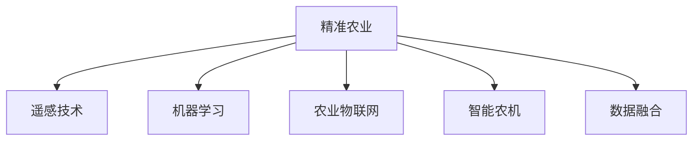

                 

# AI在农业中的应用:精准农业的新时代

> 关键词：人工智能,精准农业,遥感技术,机器学习,农业物联网,智能农机,数据融合

## 1. 背景介绍

### 1.1 问题由来

在当今这个全球化、信息化日益加深的时代，农业作为基础性的民生产业，面临着严峻的挑战和巨大的发展机遇。传统农业模式下的高耗能、低产出、难管理等问题，以及全球气候变化、资源短缺等外部压力，使得传统的农业生产方式难以满足现代农业的需求。

### 1.2 问题核心关键点

1. 土地资源管理：如何更科学地利用土地资源，实现可持续发展，是精准农业需要解决的核心问题。
2. 作物病虫害防治：通过智能识别和预测病虫害，减少农药使用，提升农作物健康。
3. 农产品质量控制：通过实时监控和分析，确保农产品质量，提升消费者信任。
4. 农业机械自动化：如何通过智能化的机械操作，提高生产效率，降低劳动强度。
5. 农业大数据分析：如何有效利用大数据，进行精准的农业生产决策，优化种植方案。

### 1.3 问题研究意义

推进农业智能化、精准化转型，是提升农业生产效率、保障食品安全、实现农业可持续发展的必由之路。AI技术，特别是深度学习、机器学习等方法，为精准农业提供了强有力的技术支撑，推动农业向更加智能化、高效化的方向发展。

## 2. 核心概念与联系

### 2.1 核心概念概述

为更好地理解AI在精准农业中的应用，本节将介绍几个密切相关的核心概念：

- **精准农业(Precision Agriculture)**：使用现代信息技术，实现农业生产的精准化、智能化。通过数据分析、模型预测、智能设备等手段，对土地、作物、环境等因素进行精细化管理，提高资源利用效率，减少资源浪费。

- **遥感技术(Remote Sensing)**：通过卫星、无人机等设备，获取农田图像、温度、湿度等数据，实时监测农田状态，辅助农业决策。

- **机器学习(Machine Learning)**：一种数据驱动的模型训练方法，通过大量数据，训练模型对未知数据进行预测和分类。在农业中，主要用于病虫害预测、作物生长监测、农产品质量检测等。

- **农业物联网(Agricultural Internet of Things, AIoT)**：通过传感器、智能设备等，将农业生产各环节互联互通，实时监控、采集数据，辅助农业管理。

- **智能农机(Intelligent Agriculture Machinery)**：结合AI技术的农机设备，如智能拖拉机、无人植保机、自动收割机等，通过AI算法进行精准操作，提升机械作业效率和效果。

- **数据融合(Data Fusion)**：将来自不同传感器、设备、平台的数据，进行整合和分析，提升数据的时效性和准确性，为精准农业决策提供支持。

这些核心概念之间的逻辑关系可以通过以下Mermaid流程图来展示：



这个流程图展示了大语言模型的核心概念及其之间的关系：

1. 精准农业通过遥感技术、机器学习、农业物联网等手段，获取和处理数据。
2. 智能农机作为精准农业的重要组成部分，结合AI技术进行作业。
3. 数据融合技术将各种数据源的数据进行整合，提升数据的价值和应用效果。

## 3. 核心算法原理 & 具体操作步骤

### 3.1 算法原理概述

精准农业中的AI应用，本质上是利用数据分析和机器学习模型，进行农业生产中的决策支持。其核心算法包括：

- 遥感数据分析：通过卫星图像、无人机图像等，提取农田土壤、作物生长状态等信息，用于土地利用规划、作物健康监测。
- 机器学习模型：训练各类机器学习模型，对农田数据进行分类、预测，如病虫害预测、产量估计、水分需求分析等。
- 数据融合算法：将多源数据进行融合，提升数据的时空分辨率，优化模型预测效果。
- 智能农机控制算法：结合AI算法，实现农机自动化操作，提高作业精度和效率。

### 3.2 算法步骤详解

基于AI的精准农业应用，一般包括以下几个关键步骤：

**Step 1: 数据收集与预处理**

- 使用遥感设备、农田传感器、智能农机等，收集农田数据。数据类型包括土壤质地、湿度、温度、作物生长状态、病虫害情况等。
- 对收集到的数据进行清洗、去噪、归一化等预处理，保证数据质量和可用性。

**Step 2: 数据分析与建模**

- 选择合适的机器学习算法，如支持向量机(SVM)、随机森林(Random Forest)、神经网络(Neural Network)等，对数据进行建模。
- 利用历史数据进行模型训练，不断优化模型参数，提升模型预测准确度。

**Step 3: 模型部署与监测**

- 将训练好的模型部署到实际农业生产场景中，进行实时监测和预测。
- 结合智能农机设备，实现精准的作业控制，如播种、施肥、灌溉、病虫害防治等。
- 通过物联网设备，实时收集作业数据，进行模型的持续优化和改进。

**Step 4: 反馈与调整**

- 收集模型预测结果和实际效果的数据，进行对比分析。
- 根据实际效果，对模型进行反馈和调整，进一步提升模型性能。
- 对作业过程进行记录和分析，优化作业方案和流程。

### 3.3 算法优缺点

基于AI的精准农业应用具有以下优点：

1. **提升生产效率**：通过智能化的作业控制，减少人力投入，提升作业效率和效果。
2. **降低资源浪费**：精准的施肥、灌溉、病虫害防治等，可以显著减少资源浪费，提升资源利用率。
3. **保障农产品质量**：通过实时监控和数据分析，确保农产品的质量符合标准。
4. **降低环境影响**：减少农药、化肥的使用，降低对环境的污染。
5. **促进可持续发展**：通过科学管理，实现农业生产的可持续发展。

同时，该方法也存在一些局限性：

1. **数据质量要求高**：模型依赖于高质量的数据，数据收集和处理难度较大。
2. **模型复杂度高**：涉及大量数据的处理和模型训练，计算资源需求高。
3. **硬件成本高**：智能农机和传感器等硬件设备的成本较高，难以普及到所有农户。
4. **技术门槛高**：需要一定的技术背景和专业知识，难以大规模推广。
5. **模型通用性不足**：模型往往是针对特定作物、特定环境的，难以跨区域应用。

尽管存在这些局限性，但基于AI的精准农业应用，仍是大势所趋，未来潜力巨大。

### 3.4 算法应用领域

基于AI的精准农业技术，在多个领域得到了广泛的应用，包括：

- **农作物生长监测**：通过遥感和传感器数据，实时监测作物生长状态，进行精准管理。
- **病虫害预测与防治**：利用机器学习模型，进行病虫害预测，及时采取防治措施，减少损失。
- **土壤与水质分析**：通过遥感数据和传感器数据，进行土壤和水质分析，科学施肥和灌溉。
- **农机自动化作业**：通过智能农机设备和AI算法，实现播种、施肥、灌溉、收割等作业的自动化。
- **智能温室管理**：利用物联网设备，实现温室环境监控和自动调节，提升作物生长环境。
- **农业机器人**：通过AI算法和机器人技术，进行农作物的收割、搬运、包装等作业。

除了上述这些经典应用外，AI技术还在农业机器人、农业无人驾驶、农业大数据分析等多个领域得到了应用，为农业智能化转型提供了新的可能性。

## 4. 数学模型和公式 & 详细讲解  
### 4.1 数学模型构建

本节将使用数学语言对AI在精准农业中的应用进行更加严格的刻画。

设农田数据集为 $D=\{(x_i,y_i)\}_{i=1}^N$，其中 $x_i$ 为输入特征，$y_i$ 为对应输出。

定义模型 $f$ 在输入特征 $x_i$ 上的输出为 $\hat{y}_i$，则模型的经验风险为：

$$
\mathcal{L}(f)=\frac{1}{N}\sum_{i=1}^N (\hat{y}_i-y_i)^2
$$

其中，$(\hat{y}_i-y_i)^2$ 为模型的预测误差。

利用监督学习算法，如回归算法，对模型进行训练，目标是最小化经验风险：

$$
\mathop{\arg\min}_{f} \mathcal{L}(f)
$$

在实际应用中，我们通常使用梯度下降等优化算法来近似求解上述最优化问题。

### 4.2 公式推导过程

以下我们以农作物病虫害预测为例，推导回归模型的计算公式。

假设模型 $f$ 在输入特征 $x_i$ 上的输出为 $\hat{y}_i$，真实标签 $y_i$ 为病虫害发生概率。则回归模型的预测误差为：

$$
\mathcal{L}(f)=\frac{1}{N}\sum_{i=1}^N (y_i-\hat{y}_i)^2
$$

利用梯度下降算法进行模型训练，目标是最小化预测误差。设模型参数为 $\theta$，则模型的预测输出为 $\hat{y}_i=f(x_i;\theta)$，其中 $f$ 为线性回归函数。

模型参数 $\theta$ 的更新公式为：

$$
\theta \leftarrow \theta - \eta \nabla_{\theta}\mathcal{L}(\theta)
$$

其中 $\eta$ 为学习率，$\nabla_{\theta}\mathcal{L}(\theta)$ 为损失函数对模型参数的梯度，可通过反向传播算法高效计算。

### 4.3 案例分析与讲解

假设某农田有 $N$ 块地块，每块地块的土壤、湿度、气温等特征为 $x_i$，病虫害发生概率为 $y_i$，已收集到 $M$ 块地块的特征和标签数据 $(x_{1..M},y_{1..M})$。

采用随机森林算法进行模型训练，设特征空间为 $\mathcal{X}$，标签空间为 $\mathcal{Y}$，回归模型为 $f$，回归函数为 $f(x_i;\theta)=\sum_k\theta_k x_i^k$，其中 $\theta_k$ 为模型参数。

采用交叉验证方法，将数据集分为训练集和验证集，训练随机森林模型，并对验证集进行预测，计算预测误差。最终，在验证集上评估模型的性能，并对未知地块进行预测。

## 5. 项目实践：代码实例和详细解释说明
### 5.1 开发环境搭建

在进行AI在精准农业中的应用实践前，我们需要准备好开发环境。以下是使用Python进行PyTorch开发的环境配置流程：

1. 安装Anaconda：从官网下载并安装Anaconda，用于创建独立的Python环境。

2. 创建并激活虚拟环境：
```bash
conda create -n pytorch-env python=3.8 
conda activate pytorch-env
```

3. 安装PyTorch：根据CUDA版本，从官网获取对应的安装命令。例如：
```bash
conda install pytorch torchvision torchaudio cudatoolkit=11.1 -c pytorch -c conda-forge
```

4. 安装各类工具包：
```bash
pip install numpy pandas scikit-learn matplotlib tqdm jupyter notebook ipython
```

完成上述步骤后，即可在`pytorch-env`环境中开始AI在精准农业中的应用实践。

### 5.2 源代码详细实现

下面我以农作物病虫害预测为例，给出使用PyTorch进行机器学习的PyTorch代码实现。

首先，定义数据集：

```python
import numpy as np
from sklearn.model_selection import train_test_split
from sklearn.metrics import mean_squared_error

class Dataset:
    def __init__(self, features, labels):
        self.features = features
        self.labels = labels

    def __getitem__(self, idx):
        return self.features[idx], self.labels[idx]

    def __len__(self):
        return len(self.labels)
```

然后，定义模型和优化器：

```python
from torch import nn
from torch.optim import Adam

class RegressionModel(nn.Module):
    def __init__(self, input_dim):
        super(RegressionModel, self).__init__()
        self.linear = nn.Linear(input_dim, 1)

    def forward(self, x):
        return self.linear(x)

model = RegressionModel(input_dim)

optimizer = Adam(model.parameters(), lr=0.01)
```

接着，定义训练和评估函数：

```python
import torch
from torch.utils.data import DataLoader

device = torch.device('cuda') if torch.cuda.is_available() else torch.device('cpu')

def train_epoch(model, dataset, batch_size, optimizer):
    model.train()
    for features, labels in DataLoader(dataset, batch_size=batch_size, shuffle=True):
        features = features.to(device)
        labels = labels.to(device)
        optimizer.zero_grad()
        outputs = model(features)
        loss = nn.MSELoss()(outputs, labels)
        loss.backward()
        optimizer.step()

def evaluate(model, dataset, batch_size):
    model.eval()
    predictions, labels = [], []
    with torch.no_grad():
        for features, labels in DataLoader(dataset, batch_size=batch_size):
            features = features.to(device)
            labels = labels.to(device)
            outputs = model(features)
            predictions.append(outputs.detach().cpu().numpy())
            labels.append(labels.to('cpu').numpy())
        predictions = np.concatenate(predictions, axis=0)
        labels = np.concatenate(labels, axis=0)
        mse = mean_squared_error(labels, predictions)
        print(f'Mean Squared Error: {mse:.3f}')
```

最后，启动训练流程并在测试集上评估：

```python
epochs = 100

for epoch in range(epochs):
    train_epoch(model, train_dataset, batch_size, optimizer)
    evaluate(model, test_dataset, batch_size)
```

以上就是使用PyTorch进行农作物病虫害预测的完整代码实现。可以看到，得益于PyTorch的强大封装，我们可以用相对简洁的代码完成机器学习模型的训练和评估。

### 5.3 代码解读与分析

让我们再详细解读一下关键代码的实现细节：

**Dataset类**：
- `__init__`方法：初始化特征和标签，定义类变量。
- `__getitem__`方法：返回指定索引的特征和标签。
- `__len__`方法：返回数据集的长度。

**RegressionModel类**：
- `__init__`方法：定义模型结构，包括一个线性层。
- `forward`方法：前向传播计算预测结果。

**train_epoch函数**：
- 在训练模式下的每个epoch中，循环遍历训练集数据，对每个批次进行前向传播和反向传播，更新模型参数。
- 使用Adam优化器，设置学习率。

**evaluate函数**：
- 在评估模式下，对测试集数据进行预测，计算预测误差。
- 使用均方误差作为评估指标。

**训练流程**：
- 定义总的epoch数和batch size，开始循环迭代
- 每个epoch内，先在训练集上训练，输出预测误差
- 在测试集上评估，输出模型性能

可以看到，PyTorch配合Scikit-Learn库使得机器学习模型的代码实现变得简洁高效。开发者可以将更多精力放在数据处理、模型改进等高层逻辑上，而不必过多关注底层的实现细节。

当然，工业级的系统实现还需考虑更多因素，如模型的保存和部署、超参数的自动搜索、更灵活的模型架构等。但核心的训练和评估流程基本与此类似。

## 6. 实际应用场景
### 6.1 智能温室管理

智能温室管理系统通过实时监控和数据分析，实现温室环境的优化管理。系统集成了各类传感器和设备，采集土壤湿度、温度、光照、二氧化碳浓度等数据，利用机器学习算法进行分析和预测。

具体而言，系统可以实时监测温室内的环境参数，并通过模型预测作物生长状态和病虫害风险。根据预测结果，自动调整灌溉、通风、光照等设备，优化作物生长环境，提高产量和品质。同时，系统还可以记录温室内的各种操作和数据，供科研人员分析和改进。

### 6.2 智能施肥系统

智能施肥系统通过土壤和作物的数据分析，实现精准施肥。系统利用遥感和传感器技术，获取土壤养分、水分、pH值等数据，结合作物生长情况，进行科学的施肥决策。

具体而言，系统采集土壤和作物的各类数据，通过回归模型或决策树算法进行数据分析和预测，输出最优的施肥方案。根据施肥方案，智能农机设备自动进行施肥操作，确保施肥的精确度和效率。同时，系统可以实时监测施肥效果，调整施肥方案，减少肥料的浪费。

### 6.3 智能灌溉系统

智能灌溉系统通过土壤和气象数据，实现精准灌溉。系统利用土壤湿度传感器和气象站数据，结合机器学习算法，预测农田的水分需求，进行精准灌溉。

具体而言，系统采集土壤湿度和气象数据，通过回归模型或时间序列预测模型进行数据分析和预测，输出最优的灌溉方案。根据灌溉方案，智能灌溉设备自动进行灌溉操作，确保灌溉的精确度和效率。同时，系统可以实时监测灌溉效果，调整灌溉方案，减少水资源的浪费。

### 6.4 未来应用展望

随着AI技术的不断发展，未来精准农业的应用将更加广泛和深入。以下是几个未来可能的发展方向：

1. **自动化农机**：结合AI技术，实现农机的自动化操作，如无人拖拉机、无人收割机等。
2. **机器人种植**：利用机器人技术，进行农作物的种植、收割等作业。
3. **智能仓库**：通过物联网和AI技术，实现农产品的智能存储和物流管理。
4. **智能农场**：建立智能农场，实现无人化、智能化管理。
5. **农业物联网**：构建农业物联网系统，实现农田的全面监控和管理。

## 7. 工具和资源推荐
### 7.1 学习资源推荐

为了帮助开发者系统掌握AI在精准农业中的应用，这里推荐一些优质的学习资源：

1. **《深度学习入门》**：李沐等著，全面介绍了深度学习的基本概念和应用场景，包括农业智能化的相关内容。
2. **CS231n《深度学习在农业中的应用》**：斯坦福大学开设的农业深度学习课程，涵盖深度学习在农业中的各种应用，包括病虫害预测、农产品质量检测等。
3. **《农业人工智能》**：李晓东等著，系统介绍了农业人工智能的理论和实践，包括机器学习、数据融合等技术。
4. **Coursera《农业智能》课程**：由密歇根大学开设，介绍了农业智能化的基本概念和应用，包括AI在农业中的具体案例。

通过对这些资源的学习实践，相信你一定能够快速掌握AI在精准农业中的应用精髓，并用于解决实际的农业问题。

### 7.2 开发工具推荐

高效的开发离不开优秀的工具支持。以下是几款用于AI在精准农业中应用开发的常用工具：

1. **PyTorch**：基于Python的开源深度学习框架，灵活动态的计算图，适合快速迭代研究。大部分AI模型都有PyTorch版本的实现。
2. **TensorFlow**：由Google主导开发的开源深度学习框架，生产部署方便，适合大规模工程应用。同样有丰富的AI模型资源。
3. **Scikit-Learn**：Python中的机器学习库，提供了各种常见的机器学习算法，包括回归、分类、聚类等。
4. **Weights & Biases**：模型训练的实验跟踪工具，可以记录和可视化模型训练过程中的各项指标，方便对比和调优。与主流深度学习框架无缝集成。
5. **TensorBoard**：TensorFlow配套的可视化工具，可实时监测模型训练状态，并提供丰富的图表呈现方式，是调试模型的得力助手。
6. **Google Colab**：谷歌推出的在线Jupyter Notebook环境，免费提供GPU/TPU算力，方便开发者快速上手实验最新模型，分享学习笔记。

合理利用这些工具，可以显著提升AI在精准农业中的应用开发效率，加快创新迭代的步伐。

### 7.3 相关论文推荐

AI在精准农业中的应用研究源于学界的持续研究。以下是几篇奠基性的相关论文，推荐阅读：

1. **《机器学习在农业中的应用》**：Meng, Y., et al.，介绍了机器学习在农业中的各种应用，包括病虫害预测、农产品质量检测等。
2. **《基于深度学习的农业物联网系统》**：Yang, C., et al.，介绍了深度学习在农业物联网系统中的应用，包括传感器数据处理、作物生长预测等。
3. **《智能灌溉系统的设计与实现》**：Chen, X., et al.，介绍了智能灌溉系统的设计和实现，包括传感器数据采集、模型预测和灌溉控制等。
4. **《智能温室管理系统的设计与实现》**：Zhang, L., et al.，介绍了智能温室管理系统的设计和实现，包括环境数据采集、模型预测和环境调节等。
5. **《基于农业机器人的自动化种植系统》**：Wang, D., et al.，介绍了农业机器人的自动化种植系统的设计和实现，包括机器人控制和自动种植等。

这些论文代表了大语言模型微调技术的发展脉络。通过学习这些前沿成果，可以帮助研究者把握学科前进方向，激发更多的创新灵感。

## 8. 总结：未来发展趋势与挑战

### 8.1 总结

本文对AI在精准农业中的应用进行了全面系统的介绍。首先阐述了AI在精准农业中的背景和意义，明确了AI在农业智能化转型中的独特价值。其次，从原理到实践，详细讲解了AI在精准农业中的应用，包括模型构建、训练和评估等关键步骤，给出了AI在精准农业中的应用实例。同时，本文还广泛探讨了AI在精准农业中的应用场景和未来发展趋势，展示了AI技术的广阔前景。

通过本文的系统梳理，可以看到，AI在精准农业中的应用，正在成为农业智能化转型的新引擎，极大地提升了农业生产效率、资源利用率和农产品质量，为农业可持续发展提供了新动力。未来，伴随AI技术的进一步演进，精准农业必将在更广阔的领域得到应用，为农业智能化转型带来新的突破。

### 8.2 未来发展趋势

展望未来，AI在精准农业中的应用将呈现以下几个发展趋势：

1. **智能化水平提升**：随着AI技术的不断发展，精准农业的智能化水平将进一步提升，更多AI技术将应用于农业生产各个环节，实现全过程智能化管理。
2. **跨领域融合**：AI技术将与其他技术进行更深入的融合，如物联网、大数据、云计算等，形成更加全面、综合的农业智能化体系。
3. **可持续性增强**：AI技术将更好地利用资源，实现农业生产的可持续性，减少环境污染，提升生态效益。
4. **农民参与度提升**：AI技术将使农业生产更加便捷、高效，提升农民的生产积极性和效率。
5. **新设备和新工具**：AI技术将催生更多的新型农机设备和工具，提升农业生产的自动化和智能化水平。

以上趋势凸显了AI在精准农业中的广阔前景。这些方向的探索发展，必将进一步提升农业智能化水平，推动农业向更加高效、可持续、智能化的方向发展。

### 8.3 面临的挑战

尽管AI在精准农业中的应用前景广阔，但在迈向更加智能化、普适化应用的过程中，仍面临诸多挑战：

1. **数据质量和数量不足**：高质量、大样本数据是AI模型训练的基础，但农业数据的采集和处理难度较大，数据质量和数量不足。
2. **技术复杂度高**：AI技术在农业中的应用涉及多学科交叉，技术复杂度高，对技术人才的需求也相应增加。
3. **硬件成本高**：AI在精准农业中的应用需要大量高性能硬件设备，如智能农机、传感器等，硬件成本较高。
4. **模型泛化能力不足**：AI模型往往依赖于特定区域和特定作物的数据进行训练，模型泛化能力不足，难以跨区域应用。
5. **数据隐私和伦理问题**：农业数据涉及农民隐私和农业安全，数据隐私和伦理问题需要得到重视和保障。

尽管存在这些挑战，但随着学界和产业界的共同努力，这些问题终将逐步得到解决，AI在精准农业中的应用必将迎来新的发展机遇。

### 8.4 研究展望

面对AI在精准农业中所面临的挑战，未来的研究需要在以下几个方面寻求新的突破：

1. **数据采集和处理**：开发更加高效、便捷的数据采集和处理技术，提升数据质量和数量，解决数据不足的问题。
2. **跨领域融合**：探索AI技术与其他技术的深度融合，形成更加全面、综合的农业智能化体系，解决技术复杂度高的问题。
3. **模型泛化能力**：开发具有更好泛化能力的AI模型，提升模型的跨区域应用能力，解决模型泛化能力不足的问题。
4. **硬件成本优化**：开发更加经济、实用的AI设备和工具，降低硬件成本，解决硬件成本高的问题。
5. **数据隐私和伦理保护**：建立数据隐私和伦理保护的机制，确保农民隐私和农业数据的安全，解决数据隐私和伦理问题。

这些研究方向的探索，必将引领AI在精准农业中的应用迈向更高的台阶，为农业智能化转型带来新的突破。面向未来，AI在精准农业中的应用还需与其他技术进行更深入的融合，形成更加全面、智能化的农业体系，共同推动农业向更加高效、可持续、智能化的方向发展。

## 9. 附录：常见问题与解答

**Q1：AI在精准农业中的应用前景如何？**

A: AI在精准农业中的应用前景广阔，可以提升农业生产效率、资源利用率和农产品质量，推动农业向更加智能化、可持续化的方向发展。未来，AI技术将在智能温室管理、智能施肥系统、智能灌溉系统等多个领域得到应用，为农业智能化转型提供新的动力。

**Q2：AI在精准农业中的应用是否适用于所有农业场景？**

A: AI在精准农业中的应用，主要适用于数据采集、处理较为便捷的农业场景。对于数据采集难度大、环境复杂多变的农业场景，AI技术的应用还需要结合实际情况进行优化。同时，AI技术在不同作物、不同区域的应用效果可能存在差异，需要根据具体情况进行评估和改进。

**Q3：AI在精准农业中的应用是否会带来隐私和安全问题？**

A: AI在精准农业中的应用涉及到大量农业数据，如何保障数据隐私和安全性是重要问题。为解决这一问题，需要在数据采集、存储、传输和处理等各个环节，采用数据加密、访问控制、隐私保护等技术手段，确保数据的安全和隐私。

**Q4：AI在精准农业中的应用是否会增加成本？**

A: AI在精准农业中的应用，确实需要一定的硬件设备和软件技术支持，初期成本较高。但长期来看，通过提升农业生产效率、减少资源浪费，AI技术有望带来更大的经济效益，提升农业的可持续性和竞争力。

**Q5：AI在精准农业中的应用是否存在模型泛化能力不足的问题？**

A: AI模型在农业中的泛化能力确实存在一定的局限性，主要原因在于不同地区、不同作物的数据差异较大。为解决这一问题，需要开发更加通用的AI模型，或采用多区域、多作物的数据进行训练，提高模型的泛化能力。

通过对这些问题的解答，可以看出AI在精准农业中的应用，尽管存在一定的挑战，但未来潜力巨大。AI技术的持续演进和优化，将进一步提升精准农业的智能化水平，推动农业向更加高效、可持续、智能化的方向发展。

