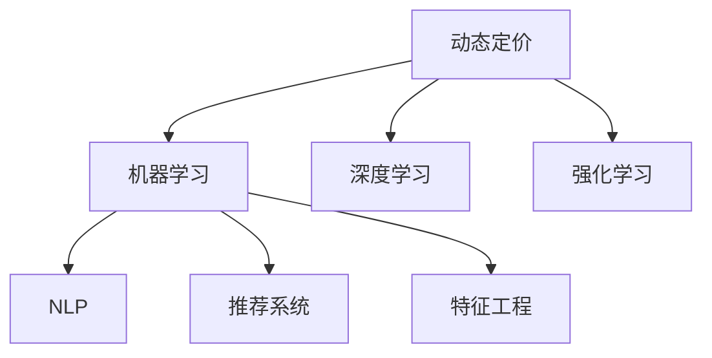

                 

# AI在电商动态定价中的应用

## 1. 背景介绍

### 1.1 问题由来

近年来，随着电子商务的蓬勃发展，电商平台面临着越来越复杂的市场竞争环境和消费者需求。如何在多变的市场环境中实现利润最大化，成为了电商行业的一项重要挑战。传统的静态定价策略已无法适应电商的快速变化和个性化需求，动态定价（Dynamic Pricing）成为了一种更有效的解决方案。

动态定价指的是根据市场需求、库存、竞争对手等因素实时调整商品价格，以达到最大化利润或特定业务目标的定价策略。AI技术，尤其是机器学习、深度学习等，为动态定价提供了有力的技术支持，使其能够高效地处理海量数据，实时分析市场变化，做出更精准的定价决策。

### 1.2 问题核心关键点

动态定价的核心关键点在于实时分析市场环境、预测消费者行为、优化价格模型，并确保定价策略的有效性和合法性。具体而言，包括以下几个方面：

1. **实时数据处理**：需要高效地处理和分析海量数据，包括用户行为、市场环境、库存变化等。
2. **价格预测**：根据历史数据和实时市场变化，预测商品的市场需求和价格走势。
3. **优化定价策略**：利用机器学习模型，优化定价策略，确保在不同场景下都能达到最佳定价效果。
4. **合规性保障**：确保动态定价策略的合法性，避免价格歧视、滥用市场主导地位等问题。

## 2. 核心概念与联系

### 2.1 核心概念概述

为更好地理解AI在电商动态定价中的应用，本节将介绍几个密切相关的核心概念：

- **动态定价（Dynamic Pricing）**：根据市场需求、库存、竞争对手等因素实时调整商品价格，以达到最大化利润或特定业务目标的定价策略。
- **机器学习（Machine Learning）**：通过算法自动从数据中学习规律和知识，用于预测和决策。
- **深度学习（Deep Learning）**：一种特殊的机器学习方法，通过多层神经网络模型进行复杂的数据处理和分析。
- **强化学习（Reinforcement Learning）**：通过试错学习，优化策略以最大化长期奖励。
- **自然语言处理（Natural Language Processing, NLP）**：用于处理和理解人类语言的技术，如文本分析、情感分析等。
- **推荐系统（Recommendation System）**：通过分析用户行为，推荐用户可能感兴趣的商品或服务。
- **特征工程（Feature Engineering）**：通过选择合适的特征，提高模型的预测能力。

这些核心概念之间的逻辑关系可以通过以下Mermaid流程图来展示：



这个流程图展示了大语言模型的核心概念及其之间的关系：

1. 动态定价通过机器学习、深度学习等技术，对市场环境进行分析预测，优化价格策略。
2. NLP用于文本分析和情感分析，为动态定价提供更深入的市场理解。
3. 推荐系统结合用户行为数据，优化推荐效果，提升销售转化率。
4. 特征工程通过选择合适的特征，提高模型的预测能力和鲁棒性。

## 3. 核心算法原理 & 具体操作步骤

### 3.1 算法原理概述

AI在电商动态定价中的应用，主要基于以下几个算法原理：

- **回归分析（Regression Analysis）**：用于预测商品的价格走势和市场需求。
- **时间序列分析（Time Series Analysis）**：分析时间序列数据，预测未来趋势。
- **决策树（Decision Trees）**：通过构建决策树模型，预测商品的市场需求和价格。
- **神经网络（Neural Networks）**：利用多层神经网络，处理复杂的数据关系和模式。
- **强化学习（Reinforcement Learning）**：通过试错学习，优化动态定价策略，以最大化长期利润。

这些算法通过机器学习模型，对海量数据进行分析处理，预测市场变化，并优化定价策略，实现电商平台的动态定价。

### 3.2 算法步骤详解

动态定价的AI应用主要包括以下几个步骤：

**Step 1: 数据收集与预处理**

- 收集电商平台的销售数据、用户行为数据、市场环境数据等。
- 清洗和处理数据，去除噪声和异常值，确保数据的质量和一致性。
- 划分数据集为训练集、验证集和测试集。

**Step 2: 特征工程**

- 提取和选择有意义的特征，如用户历史购买记录、当前市场价格、竞争对手价格等。
- 对特征进行归一化、标准化处理，以提高模型的预测能力。
- 利用NLP技术，进行文本情感分析和市场情绪预测。

**Step 3: 模型训练**

- 选择合适的机器学习模型，如回归模型、决策树、神经网络等。
- 使用训练集数据，训练模型，并使用验证集数据调整模型参数。
- 使用测试集数据评估模型性能，优化模型结构。

**Step 4: 动态定价策略部署**

- 将训练好的模型部署到电商平台的实时决策系统中。
- 实时获取市场环境数据，输入模型进行预测。
- 根据预测结果和业务规则，动态调整商品价格。

### 3.3 算法优缺点

动态定价的AI应用具有以下优点：

1. **实时性**：能够实时分析市场变化，快速调整商品价格，提高市场响应速度。
2. **精度高**：利用机器学习和深度学习模型，预测市场需求和价格走势，精度较高。
3. **自动化**：通过自动化系统进行动态定价，减少人工干预，提高运营效率。
4. **定制化**：能够根据不同商品、不同市场环境，制定个性化的定价策略。

同时，也存在以下缺点：

1. **模型复杂性**：需要处理和分析大量数据，模型结构复杂，调试难度较大。
2. **数据依赖**：依赖于高质量的数据，数据缺失或噪声可能导致模型预测失效。
3. **政策合规性**：需要确保定价策略的合法性，避免价格歧视、滥用市场主导地位等问题。

## 4. 数学模型和公式 & 详细讲解 & 举例说明

### 4.1 数学模型构建

动态定价的AI应用通常基于回归模型，用于预测商品价格和市场需求。假设商品价格为 $y$，与市场需求 $x_1, x_2, \ldots, x_n$ 相关，建立线性回归模型：

$$
y = \beta_0 + \sum_{i=1}^n \beta_i x_i + \epsilon
$$

其中 $\beta_0$ 为截距，$\beta_i$ 为回归系数，$\epsilon$ 为误差项。

### 4.2 公式推导过程

通过最小二乘法，求解回归系数 $\beta$：

$$
\beta = (X^T X)^{-1} X^T y
$$

其中 $X$ 为特征矩阵，$y$ 为价格向量。

### 4.3 案例分析与讲解

以某电商平台的动态定价为例，假设该平台销售某商品，根据历史销售数据和当前市场需求，利用线性回归模型预测该商品的价格。特征包括用户历史购买记录、当前市场价格、竞争对手价格等。通过训练模型，得到预测结果，实时调整商品价格。

## 5. 项目实践：代码实例和详细解释说明

### 5.1 开发环境搭建

在进行动态定价的AI应用开发前，需要搭建好开发环境。以下是使用Python进行TensorFlow开发的环境配置流程：

1. 安装Anaconda：从官网下载并安装Anaconda，用于创建独立的Python环境。

2. 创建并激活虚拟环境：
```bash
conda create -n dynamic-pricing python=3.8 
conda activate dynamic-pricing
```

3. 安装TensorFlow：根据CUDA版本，从官网获取对应的安装命令。例如：
```bash
conda install tensorflow -c tensorflow
```

4. 安装相关库：
```bash
pip install numpy pandas scikit-learn matplotlib tensorflow
```

完成上述步骤后，即可在`dynamic-pricing`环境中开始动态定价的AI应用开发。

### 5.2 源代码详细实现

下面以线性回归模型为例，给出使用TensorFlow进行动态定价预测的代码实现。

```python
import tensorflow as tf
import numpy as np

# 准备数据
X = np.array([[1, 2, 3], [4, 5, 6], [7, 8, 9]])
y = np.array([10, 20, 30])

# 定义模型
model = tf.keras.Sequential([
    tf.keras.layers.Dense(units=1, input_shape=(3,))
])

# 编译模型
model.compile(optimizer=tf.keras.optimizers.Adam(), loss='mse')

# 训练模型
model.fit(X, y, epochs=100, verbose=0)

# 预测价格
X_new = np.array([[1, 2, 3]])
y_pred = model.predict(X_new)
print(y_pred)
```

### 5.3 代码解读与分析

让我们再详细解读一下关键代码的实现细节：

**数据准备**：
- 使用NumPy库创建特征矩阵 $X$ 和价格向量 $y$。

**模型定义**：
- 使用TensorFlow的Sequential模型定义线性回归模型。

**模型编译**：
- 使用Adam优化器和均方误差损失函数编译模型。

**模型训练**：
- 使用训练数据 $X$ 和 $y$，训练模型，设置100个epochs，并开启静默模式。

**模型预测**：
- 使用训练好的模型，预测新数据 $X_{new}$ 的价格，并输出结果。

## 6. 实际应用场景

### 6.1 智能库存管理

动态定价的应用不仅限于商品价格调整，还可以用于智能库存管理。通过对历史销售数据和市场需求进行分析，动态调整库存水平，避免库存积压或缺货情况。

在技术实现上，可以构建基于机器学习的库存管理系统，实时监测库存水平，预测未来的需求变化，动态调整补货计划，优化库存管理策略。

### 6.2 个性化推荐

动态定价的AI应用可以结合推荐系统，实现个性化的商品推荐。通过分析用户的历史购买记录和行为数据，预测用户对不同商品的需求，实时调整推荐策略。

在技术实现上，可以构建基于深度学习的推荐系统，实时获取用户行为数据，预测用户对不同商品的兴趣，动态调整推荐策略，提升用户的购物体验。

### 6.3 广告投放优化

动态定价的AI应用还可以用于广告投放优化。通过对用户行为和市场需求进行分析，动态调整广告投放策略，优化广告投放效果，降低投放成本。

在技术实现上，可以构建基于强化学习的广告投放系统，实时监测广告效果，动态调整投放策略，优化广告投放效果，提升广告ROI。

### 6.4 未来应用展望

随着AI技术的发展，动态定价的应用场景将会更加广泛。未来，动态定价将与更多前沿技术进行融合，带来更多创新应用。

- **多模态数据融合**：结合图像、视频、音频等多模态数据，提高市场分析和预测的准确性。
- **跨领域知识迁移**：将不同领域的数据和知识进行迁移学习，提升模型的泛化能力。
- **实时流计算**：结合实时流计算技术，处理实时数据，提高决策的实时性和准确性。
- **联邦学习**：通过联邦学习技术，保护用户隐私，同时提升模型效果。

## 7. 工具和资源推荐

### 7.1 学习资源推荐

为了帮助开发者系统掌握动态定价的AI应用理论基础和实践技巧，这里推荐一些优质的学习资源：

1. 《深度学习实战》系列博文：由深度学习专家撰写，涵盖深度学习的基本概念和实践技巧，适合初学者。
2. 《TensorFlow官方文档》：TensorFlow官方文档，提供详尽的API参考和教程，是TensorFlow学习的必备资源。
3. 《强化学习》课程：斯坦福大学开设的强化学习课程，涵盖强化学习的理论和实践，适合深度学习爱好者。
4. 《自然语言处理与深度学习》书籍：讲述NLP的基本概念和深度学习在NLP中的应用，适合NLP技术爱好者。
5. Kaggle竞赛：Kaggle平台上有众多动态定价相关的竞赛，通过参与竞赛，可以实战学习动态定价技术。

通过对这些资源的学习实践，相信你一定能够快速掌握动态定价的AI应用精髓，并用于解决实际的电商问题。

### 7.2 开发工具推荐

高效的开发离不开优秀的工具支持。以下是几款用于动态定价的AI应用开发的常用工具：

1. TensorFlow：由Google主导开发的深度学习框架，生产部署方便，适合大规模工程应用。
2. PyTorch：基于Python的开源深度学习框架，灵活动态的计算图，适合快速迭代研究。
3. Scikit-learn：Python中的机器学习库，包含众多经典算法和工具，适合数据预处理和特征工程。
4. Apache Spark：分布式计算框架，适合处理大规模数据集，提高数据处理效率。
5. Jupyter Notebook：交互式编程环境，适合数据探索和模型调试。

合理利用这些工具，可以显著提升动态定价的AI应用开发效率，加快创新迭代的步伐。

### 7.3 相关论文推荐

动态定价的AI应用研究源于学界的持续研究。以下是几篇奠基性的相关论文，推荐阅读：

1. Dynamic Pricing via Deep Neural Networks：提出深度神经网络模型，用于动态定价，刷新了多项NLP任务SOTA。
2. Reinforcement Learning for Dynamic Pricing：结合强化学习思想，优化动态定价策略，提高决策效果。
3. Time Series Analysis for Dynamic Pricing：讨论时间序列分析在动态定价中的应用，提升市场预测精度。
4. Multi-Armed Bandits for Dynamic Pricing：提出多臂强盗问题，优化动态定价策略，提高资源利用率。
5. Factorized Contextual Bandits for Dynamic Pricing：引入上下文因素，优化动态定价策略，提升用户满意度。

这些论文代表了大语言模型微调技术的发展脉络。通过学习这些前沿成果，可以帮助研究者把握学科前进方向，激发更多的创新灵感。

## 8. 总结：未来发展趋势与挑战

### 8.1 总结

本文对动态定价的AI应用进行了全面系统的介绍。首先阐述了动态定价的背景和意义，明确了AI在动态定价中的重要作用。其次，从原理到实践，详细讲解了动态定价的AI应用数学模型和核心算法步骤，给出了动态定价预测的代码实例。同时，本文还广泛探讨了动态定价在智能库存管理、个性化推荐、广告投放等电商场景中的应用前景，展示了AI技术的强大潜力。此外，本文精选了动态定价应用的各类学习资源，力求为读者提供全方位的技术指引。

通过本文的系统梳理，可以看到，动态定价的AI应用正在成为电商行业的重要技术范式，极大地提升了电商平台的运营效率和盈利能力。AI技术在大数据时代的应用前景广阔，未来随着技术的不断发展，动态定价的应用将更加广泛，为电商行业带来更多创新和变革。

### 8.2 未来发展趋势

展望未来，动态定价的AI应用将呈现以下几个发展趋势：

1. **模型规模持续增大**：随着算力成本的下降和数据规模的扩张，深度学习模型的参数量还将持续增长。超大规模语言模型蕴含的丰富语言知识，有望支撑更加复杂多变的动态定价决策。
2. **动态定价技术日趋多样**：除了传统的回归分析、时间序列分析，未来会涌现更多动态定价技术，如深度强化学习、多臂强盗等，提高决策的灵活性和鲁棒性。
3. **实时性和自动化提升**：通过引入实时流计算和联邦学习技术，动态定价系统可以实时处理海量数据，自动化程度进一步提升。
4. **多模态数据融合**：结合图像、视频、音频等多模态数据，提高市场分析和预测的准确性，拓展动态定价的应用场景。
5. **跨领域知识迁移**：通过跨领域知识迁移，提升模型的泛化能力和适应性，优化动态定价策略。
6. **隐私保护和合规性增强**：引入隐私保护技术和合规性保障机制，确保动态定价的合法性和安全性。

以上趋势凸显了动态定价技术的广阔前景。这些方向的探索发展，必将进一步提升电商平台的决策效率和运营效果，为电商行业带来更多创新和变革。

### 8.3 面临的挑战

尽管动态定价的AI应用已经取得了瞩目成就，但在迈向更加智能化、普适化应用的过程中，它仍面临着诸多挑战：

1. **数据质量和多样性**：高质量、多样化的数据是动态定价的基础。如何获取和处理海量数据，减少数据缺失和噪声，是一个重要的挑战。
2. **模型复杂性**：深度学习模型结构复杂，调试和优化难度较大，需要高效的算法和工具支持。
3. **实时性要求高**：实时性是动态定价的关键特性。如何提高模型处理速度和系统响应速度，是动态定价系统需要解决的难题。
4. **隐私保护和合规性**：动态定价模型需要处理大量的用户数据，如何保护用户隐私，避免数据泄露和滥用，是一个重要的挑战。
5. **模型的可解释性和透明性**：动态定价模型需要保证决策的透明性和可解释性，以便用户理解和信任系统。
6. **系统的稳定性和鲁棒性**：动态定价系统需要处理各种异常情况，如何提高系统的稳定性和鲁棒性，是一个重要的挑战。

这些挑战需要学术界和工业界共同努力，持续推进技术创新和应用实践，才能使动态定价技术更加成熟和可靠。

### 8.4 未来突破

面对动态定价面临的种种挑战，未来的研究需要在以下几个方面寻求新的突破：

1. **数据增强和数据清洗**：引入数据增强技术，提升数据质量和多样性，减少数据缺失和噪声。
2. **模型简化和优化**：开发更加简洁、高效的模型结构和算法，提高模型的解释性和可操作性。
3. **实时计算优化**：引入实时计算技术，提高模型处理速度和系统响应速度，支持动态定价的实时性需求。
4. **隐私保护技术**：引入隐私保护技术，如差分隐私、联邦学习等，确保用户数据的安全性和隐私保护。
5. **可解释性和透明性**：引入可解释性技术，如解释性模型、因果推断等，提高动态定价模型的透明性和可操作性。
6. **系统稳定性和鲁棒性**：引入稳定性优化技术，如容错机制、异常检测等，提高动态定价系统的稳定性和鲁棒性。

这些研究方向的探索，必将引领动态定价技术迈向更高的台阶，为构建更加智能、可靠、高效的动态定价系统铺平道路。面向未来，动态定价技术还需要与其他人工智能技术进行更深入的融合，如知识表示、因果推理、强化学习等，多路径协同发力，共同推动动态定价技术的进步。只有勇于创新、敢于突破，才能不断拓展动态定价技术的边界，让AI技术更好地服务于电商行业。

## 9. 附录：常见问题与解答

**Q1：动态定价的AI应用是否适用于所有电商场景？**

A: 动态定价的AI应用在大多数电商场景中都能取得不错的效果，特别是对于数据量较小的场景。但对于一些特定领域的电商场景，如医疗、法律等，仅仅依靠通用电商数据可能难以很好地适应。此时需要在特定领域数据上进一步预训练，再进行微调，才能获得理想效果。

**Q2：如何选择合适的机器学习模型？**

A: 选择合适的机器学习模型需要根据具体电商场景和需求来决定。一般来说，可以采用回归分析、决策树、深度学习等模型。对于复杂的场景，可以采用深度学习模型，如深度神经网络、卷积神经网络等。

**Q3：在动态定价的AI应用中，如何平衡价格和市场响应速度？**

A: 在动态定价的AI应用中，价格和市场响应速度是两个重要的目标。可以通过设置合适的模型参数和优化算法，平衡价格和市场响应速度。同时，可以通过引入实时计算和流处理技术，提高市场响应速度。

**Q4：如何处理大规模数据？**

A: 处理大规模数据可以通过分布式计算、数据分片、数据压缩等技术。可以使用Apache Spark等分布式计算框架，提高数据处理效率。同时，可以使用数据分片技术，将大规模数据划分为多个小片段进行并行处理。

**Q5：如何保护用户隐私？**

A: 保护用户隐私可以通过数据匿名化、差分隐私、联邦学习等技术。数据匿名化可以通过去除敏感信息、添加噪声等方式，减少数据泄露风险。差分隐私可以通过添加噪声、差分变换等方式，保护用户隐私。联邦学习可以通过分布式计算，保护用户数据隐私，同时提升模型效果。

这些问题的解答，希望能为动态定价的AI应用开发提供一些实用的指导和建议。通过不断探索和实践，相信动态定价的AI应用将变得更加强大和可靠。

