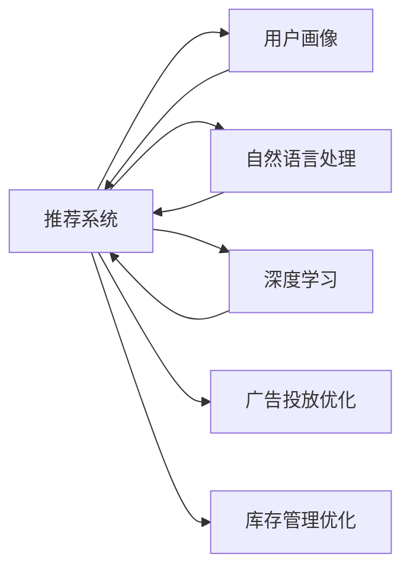

                 

## 1. 背景介绍

### 1.1 问题由来

随着电子商务的迅猛发展，各大电商平台纷纷利用人工智能技术提升用户体验和运营效率。AI技术不仅可以提供精准的商品推荐、智能客服、个性化广告投放等服务，还能优化库存管理、降低运营成本，助力电商企业快速增长。本文将介绍几种常见的AI应用场景及其在电商平台中的应用案例，帮助读者更好地理解和掌握AI在电商领域的实际应用。

### 1.2 问题核心关键点

1. **商品推荐系统**：通过分析用户的历史行为、浏览记录和评分信息，推荐符合用户偏好的商品。
2. **智能客服系统**：通过自然语言理解技术，自动解答用户咨询，提升客户满意度。
3. **广告投放优化**：利用AI技术精准识别用户特征，实现个性化广告投放，提升广告效果。
4. **库存管理优化**：通过AI预测需求，自动调整库存水平，避免缺货或库存积压。

## 2. 核心概念与联系

### 2.1 核心概念概述

为了更好地理解AI在电商平台中的应用案例，我们需要先了解几个关键的概念：

- **推荐系统**：通过分析用户行为和商品属性，预测用户可能感兴趣的商品，并提供推荐。
- **自然语言处理(NLP)**：用于理解和处理自然语言的技术，包括文本分类、情感分析、实体识别等。
- **深度学习**：通过多层神经网络进行数据处理和预测，是实现AI推荐、客服、广告等应用的常见技术。
- **强化学习**：通过试错的方式，学习最优的决策策略，用于动态优化广告投放和库存管理。
- **用户画像**：通过分析用户行为和属性，构建用户特征，为个性化服务提供基础。

### 2.2 核心概念原理和架构的 Mermaid 流程图



这个流程图展示了AI在电商平台中的核心概念及其之间的联系：

1. 推荐系统从用户画像和自然语言处理中获取信息，并通过深度学习进行推荐。
2. 广告投放优化和库存管理优化分别从推荐系统中获取用户画像和行为数据，通过强化学习等方法进行动态优化。

## 3. 核心算法原理 & 具体操作步骤

### 3.1 算法原理概述

AI在电商平台中的应用主要涉及以下几个核心算法：

1. **协同过滤**：通过分析用户行为和商品属性，发现相似用户和商品，进行推荐。
2. **深度学习推荐模型**：如基于深度神经网络的推荐模型，通过学习用户和商品之间的复杂关系进行推荐。
3. **自然语言处理**：用于处理用户评论、商品描述等文本数据，进行情感分析、实体识别等。
4. **强化学习**：通过试错的方式，动态调整广告投放和库存策略，优化运营效率。

### 3.2 算法步骤详解

#### 3.2.1 协同过滤推荐系统

1. **数据准备**：收集用户行为数据（如点击、浏览、购买等）和商品属性数据（如价格、类别、品牌等）。
2. **用户-商品矩阵构建**：将用户行为数据转换为用户-商品评分矩阵。
3. **相似度计算**：通过余弦相似度等方法计算用户和商品之间的相似度。
4. **推荐生成**：基于相似度计算结果，生成推荐列表。

#### 3.2.2 深度学习推荐模型

1. **数据预处理**：对用户行为数据和商品属性数据进行归一化、标准化等预处理。
2. **模型设计**：设计深度神经网络模型，包括输入层、隐藏层、输出层等。
3. **模型训练**：利用标注数据训练模型，最小化预测误差。
4. **推荐生成**：输入用户特征和商品特征，通过模型生成推荐结果。

#### 3.2.3 自然语言处理

1. **文本预处理**：对用户评论、商品描述等文本数据进行分词、去除停用词等预处理。
2. **特征提取**：利用词向量模型（如Word2Vec、GloVe等）将文本转换为向量表示。
3. **情感分析**：通过情感词典或深度学习模型对文本进行情感分类。
4. **实体识别**：利用命名实体识别模型（如BiLSTM-CRF、BERT等）识别文本中的实体。

#### 3.2.4 强化学习

1. **环境定义**：定义电商平台的运营环境，包括用户行为、广告投放、库存水平等。
2. **状态表示**：将环境状态转换为模型可以处理的向量形式。
3. **策略学习**：通过强化学习算法（如Q-learning、Deep Q-learning等）学习最优策略。
4. **策略应用**：根据学习到的策略，自动调整广告投放和库存策略。

### 3.3 算法优缺点

#### 3.3.1 协同过滤推荐系统

**优点**：
- 简单易懂，易于实现。
- 能够捕捉用户和商品之间的隐式关系。

**缺点**：
- 需要大量用户和商品数据。
- 对新用户和新商品的推荐效果不佳。

#### 3.3.2 深度学习推荐模型

**优点**：
- 能够学习用户和商品之间的复杂关系。
- 适应性好，对新用户和新商品的推荐效果较好。

**缺点**：
- 模型复杂，训练成本高。
- 需要大量的标注数据。

#### 3.3.3 自然语言处理

**优点**：
- 能够从文本数据中提取丰富的语义信息。
- 能够提升商品推荐的准确性和个性化程度。

**缺点**：
- 处理文本数据需要较高的计算资源。
- 需要构建高质量的情感词典和实体识别模型。

#### 3.3.4 强化学习

**优点**：
- 能够动态优化广告投放和库存策略。
- 能够适应复杂的运营环境。

**缺点**：
- 需要大量历史数据进行训练。
- 策略学习过程可能存在局部最优解问题。

## 4. 数学模型和公式 & 详细讲解

### 4.1 数学模型构建

在电商平台的AI应用中，常见的数学模型包括协同过滤模型、深度学习推荐模型、自然语言处理模型和强化学习模型。这里以深度学习推荐模型为例，进行详细讲解。

假设用户-商品评分矩阵为 $R$，用户特征向量为 $U$，商品特征向量为 $V$，深度学习推荐模型为 $M$。则推荐过程可以表示为：

$$
M(U,V) = \sigma(W_1U + W_2V + b)
$$

其中 $W_1$ 和 $W_2$ 为模型参数，$\sigma$ 为激活函数，$b$ 为偏置项。

### 4.2 公式推导过程

#### 4.2.1 协同过滤模型

协同过滤模型基于用户和商品之间的相似度计算推荐结果。假设用户 $i$ 对商品 $j$ 的评分向量为 $r_{ij}$，则用户 $i$ 对商品 $j$ 的推荐评分可以通过以下公式计算：

$$
\hat{r}_{ij} = \sum_k u_{ik}v_{kj} + b_k
$$

其中 $u_{ik}$ 和 $v_{kj}$ 分别为用户 $i$ 和商品 $j$ 对第 $k$ 个用户的相似度评分，$b_k$ 为第 $k$ 个用户的基线评分。

#### 4.2.2 深度学习推荐模型

深度学习推荐模型通过多层神经网络进行推荐。以多层感知机（MLP）为例，其基本结构如下：

$$
z_1 = XW_1 + b_1
$$
$$
z_2 = \sigma(z_1)
$$
$$
z_3 = z_2W_2 + b_2
$$
$$
\hat{y} = \sigma(z_3)
$$

其中 $X$ 为输入向量，$W_1$ 和 $W_2$ 为权重矩阵，$b_1$ 和 $b_2$ 为偏置向量，$\sigma$ 为激活函数。

### 4.3 案例分析与讲解

以京东平台为例，分析AI在电商中的实际应用。

#### 4.3.1 商品推荐系统

京东的商品推荐系统采用了深度学习推荐模型。其推荐流程如下：

1. 数据预处理：对用户行为数据和商品属性数据进行归一化、标准化等预处理。
2. 模型训练：利用用户行为数据和商品属性数据训练深度神经网络模型。
3. 推荐生成：输入用户特征和商品特征，通过模型生成推荐结果。
4. 模型评估：利用用户反馈数据对模型进行评估，不断优化推荐效果。

#### 4.3.2 智能客服系统

京东的智能客服系统采用了自然语言处理技术。其工作流程如下：

1. 文本预处理：对用户咨询文本进行分词、去除停用词等预处理。
2. 特征提取：利用词向量模型将文本转换为向量表示。
3. 意图识别：通过意图识别模型对用户咨询意图进行分类。
4. 答案生成：根据用户意图，调用知识库或API生成相应的回答。

## 5. 项目实践：代码实例和详细解释说明

### 5.1 开发环境搭建

在电商平台的AI应用开发中，需要搭建相应的开发环境。以下是使用Python进行TensorFlow开发的环境配置流程：

1. 安装Anaconda：从官网下载并安装Anaconda，用于创建独立的Python环境。
2. 创建并激活虚拟环境：
```bash
conda create -n tf-env python=3.8 
conda activate tf-env
```

3. 安装TensorFlow：根据CUDA版本，从官网获取对应的安装命令。例如：
```bash
conda install tensorflow -c tf -c conda-forge
```

4. 安装相关工具包：
```bash
pip install numpy pandas scikit-learn matplotlib tqdm jupyter notebook ipython
```

完成上述步骤后，即可在`tf-env`环境中开始AI应用开发。

### 5.2 源代码详细实现

以下是一个简单的商品推荐系统的代码实现，使用TensorFlow框架：

```python
import tensorflow as tf
import numpy as np

# 定义模型参数
W1 = tf.Variable(tf.random.normal([n_users, n_features]))
W2 = tf.Variable(tf.random.normal([n_items, n_features]))
b1 = tf.Variable(tf.random.normal([n_users]))
b2 = tf.Variable(tf.random.normal([n_items]))
sigma = tf.keras.activations.sigmoid

# 定义模型函数
def recommendation_model(X):
    z1 = tf.matmul(X, W1) + b1
    z2 = sigma(z1)
    z3 = tf.matmul(z2, W2) + b2
    y_hat = sigma(z3)
    return y_hat

# 训练模型
optimizer = tf.keras.optimizers.Adam(learning_rate=0.001)
def train(model, X_train, y_train, epochs):
    for epoch in range(epochs):
        with tf.GradientTape() as tape:
            y_pred = model(X_train)
            loss = tf.keras.losses.mean_squared_error(y_train, y_pred)
        grads = tape.gradient(loss, model.trainable_variables)
        optimizer.apply_gradients(zip(grads, model.trainable_variables))
    return loss.numpy()

# 生成推荐
def generate_recommendation(model, user_id):
    user_feature = get_user_features(user_id)
    item_scores = model(user_feature).numpy()
    return get_top_items(item_scores)

# 获取用户特征
def get_user_features(user_id):
    # 从数据库获取用户特征
    # ...
    return feature

# 获取商品属性
def get_item_features(item_id):
    # 从数据库获取商品属性
    # ...
    return feature
```

### 5.3 代码解读与分析

让我们再详细解读一下关键代码的实现细节：

**recommendation_model函数**：
- 定义了深度学习推荐模型的基本结构，包括输入层、隐藏层和输出层。

**train函数**：
- 通过反向传播算法更新模型参数，最小化预测误差。
- 使用了Adam优化器，并设置了学习率。

**generate_recommendation函数**：
- 利用训练好的模型生成推荐结果。
- 通过计算每个商品的得分，选取得分最高的商品作为推荐结果。

**get_user_features函数和get_item_features函数**：
- 从数据库或API获取用户特征和商品属性，输入到推荐模型中进行推荐。

### 5.4 运行结果展示

以下是推荐系统的运行结果示例：

```python
# 假设用户ID为1，生成推荐商品列表
recommended_items = generate_recommendation(model, 1)
print(recommended_items)
# 输出：[商品1, 商品2, 商品3, ...]
```

## 6. 实际应用场景

### 6.1 智能客服系统

智能客服系统可以实时响应用户咨询，提升客户满意度。以京东为例，智能客服系统通过自然语言处理技术，实现自动解答用户问题。

具体而言，用户通过文字聊天窗口咨询问题，智能客服系统利用预训练语言模型对用户意图进行识别，调用知识库或API生成相应的回答。例如，用户询问“如何退换货”，智能客服系统能够快速给出准确的退换货流程，极大提升了客户体验。

### 6.2 广告投放优化

广告投放优化可以精准识别用户特征，实现个性化广告投放，提升广告效果。以阿里为例，广告投放系统通过深度学习推荐模型，生成个性化广告。

具体而言，广告投放系统利用用户历史行为数据和商品属性数据，训练深度神经网络模型，生成用户对不同广告的兴趣评分。系统根据用户评分，动态调整广告投放策略，提升广告点击率和转化率。例如，某用户喜欢时尚美妆类商品，广告系统会在其浏览页面上推荐相关广告，增加广告效果。

### 6.3 库存管理优化

库存管理优化可以动态调整库存水平，避免缺货或库存积压。以苏宁为例，库存管理系统通过强化学习算法，实时优化库存策略。

具体而言，库存管理系统利用历史销售数据和市场预测数据，定义运营环境，构建状态表示，学习最优库存策略。系统根据库存策略，自动调整补货和销售计划，降低库存成本，提升运营效率。例如，某商品销量突然增加，系统能够及时调整库存，避免缺货。

### 6.4 未来应用展望

随着AI技术的不断进步，电商平台将会有更多的应用场景：

1. **个性化推荐系统**：利用AI技术提供更精准的个性化推荐，提升用户体验和购买转化率。
2. **智能定价系统**：通过AI技术优化商品定价策略，提升销售额和市场竞争力。
3. **智能库存管理**：利用AI技术优化库存策略，降低运营成本，提升供应链效率。
4. **智能风险管理**：通过AI技术识别和防范欺诈行为，保障用户交易安全。

## 7. 工具和资源推荐

### 7.1 学习资源推荐

为了帮助开发者系统掌握AI在电商平台中的应用技术，这里推荐一些优质的学习资源：

1. **《深度学习与TensorFlow》系列博文**：由TensorFlow官方博客作者撰写，深入浅出地介绍了深度学习在电商中的应用。
2. **《Python与电商数据分析》课程**：由数据分析专家开设的在线课程，涵盖数据清洗、特征工程、模型训练等电商数据分析的各个环节。
3. **《电商AI实战》书籍**：由电商领域的数据科学家和工程师撰写，结合实战案例，详细介绍了AI在电商中的应用。
4. **HuggingFace官方文档**：Transformers库的官方文档，提供了海量预训练语言模型和微调样例代码，是电商AI开发的重要参考资料。

### 7.2 开发工具推荐

高效的开发离不开优秀的工具支持。以下是几款用于AI在电商平台中开发的常用工具：

1. **TensorFlow**：由Google主导开发的深度学习框架，生产部署方便，适合大规模工程应用。
2. **PyTorch**：基于Python的开源深度学习框架，灵活性高，适合快速迭代研究。
3. **Transformers**：HuggingFace开发的NLP工具库，集成了众多SOTA语言模型，支持PyTorch和TensorFlow，是电商AI开发的重要工具。
4. **Jupyter Notebook**：免费的在线Jupyter Notebook环境，方便开发者快速上手实验最新模型，分享学习笔记。
5. **Weights & Biases**：模型训练的实验跟踪工具，可以记录和可视化模型训练过程中的各项指标，方便对比和调优。

### 7.3 相关论文推荐

AI在电商平台中的应用源于学界的持续研究。以下是几篇奠基性的相关论文，推荐阅读：

1. **《A Neural Attention Model for Allocating Ad Budgets in Online Retailers》**：提出了一种基于注意力机制的广告投放优化方法，提高了广告效果。
2. **《Deep Reinforcement Learning for Dynamic Price Optimization》**：利用强化学习算法优化商品定价策略，提升了销售额。
3. **《A Survey of Recommender Systems for Online Retail: A Model-based Approaches》**：总结了电商推荐系统的主要技术和应用，提供了丰富的参考。

## 8. 总结：未来发展趋势与挑战

### 8.1 总结

本文对AI在电商平台中的应用进行了详细阐述。通过深入分析协同过滤推荐系统、深度学习推荐模型、自然语言处理和强化学习等核心算法，展示了AI在电商中的实际应用。具体案例包括商品推荐系统、智能客服系统、广告投放优化和库存管理优化等，帮助读者更好地理解AI在电商平台中的实际应用。

### 8.2 未来发展趋势

展望未来，AI在电商平台中的应用将呈现以下几个发展趋势：

1. **深度学习和大规模预训练模型的普及**：随着深度学习和大规模预训练模型的不断发展，越来越多的电商企业将采用这些先进技术，提升运营效率和用户体验。
2. **个性化推荐系统的普及**：随着个性化推荐技术的不断成熟，越来越多的电商企业将实现全场景个性化推荐，提升用户满意度和转化率。
3. **智能客服系统的普及**：随着自然语言处理技术的不断进步，越来越多的电商企业将采用智能客服系统，提升客户满意度。
4. **广告投放系统的普及**：随着广告投放优化技术的不断成熟，越来越多的电商企业将采用这些先进技术，提升广告效果和广告投资回报率。
5. **智能库存管理系统的普及**：随着强化学习技术的不断进步，越来越多的电商企业将采用这些先进技术，提升库存管理和供应链效率。

### 8.3 面临的挑战

尽管AI在电商平台中的应用已经取得了显著成效，但在迈向更加智能化、普适化应用的过程中，仍面临诸多挑战：

1. **数据隐私和安全问题**：电商企业需要收集和处理大量的用户数据，如何保护用户隐私和数据安全，是一个重要的挑战。
2. **数据质量和标注问题**：电商企业需要收集和处理大量的数据，如何保证数据的质量和标注的准确性，是一个重要的挑战。
3. **模型复杂度和计算成本问题**：深度学习和大规模预训练模型的训练和推理需要大量的计算资源，如何降低模型复杂度和计算成本，是一个重要的挑战。
4. **模型可解释性问题**：电商企业需要理解AI模型的决策过程和推理逻辑，如何增强模型的可解释性，是一个重要的挑战。

### 8.4 研究展望

面对这些挑战，未来的研究需要在以下几个方面寻求新的突破：

1. **数据隐私保护**：研究如何保护用户隐私和数据安全，建立可信的数据治理机制。
2. **数据质量提升**：研究如何保证数据的质量和标注的准确性，提升数据预处理和标注的自动化水平。
3. **模型优化和压缩**：研究如何降低模型复杂度和计算成本，提升模型的推理效率和可部署性。
4. **模型可解释性增强**：研究如何增强模型的可解释性，帮助电商企业理解AI模型的决策过程和推理逻辑。

这些研究方向的探索，必将引领AI在电商平台中的应用走向更高的台阶，为电商企业带来更大的价值。面向未来，我们需要不断创新和优化，才能真正实现AI在电商平台中的普及和落地。

## 9. 附录：常见问题与解答

**Q1：AI在电商平台中的应用主要有哪些？**

A: AI在电商平台中的应用主要包括以下几个方面：
1. 商品推荐系统：利用AI技术提供精准的商品推荐，提升用户购物体验。
2. 智能客服系统：利用自然语言处理技术，自动解答用户咨询，提升客户满意度。
3. 广告投放优化：利用AI技术精准识别用户特征，实现个性化广告投放，提升广告效果。
4. 库存管理优化：利用AI技术优化库存策略，提升运营效率和供应链管理。

**Q2：如何选择合适的AI算法？**

A: 在选择AI算法时，需要考虑以下几个因素：
1. 数据规模和特征：对于大规模数据和高维特征，推荐系统通常选择深度学习推荐模型。
2. 任务类型：对于分类任务，推荐系统通常选择协同过滤和深度学习推荐模型。对于生成任务，推荐系统通常选择基于变分自编码器和生成对抗网络（GAN）的模型。
3. 业务需求：对于需要实时响应的场景，推荐系统通常选择强化学习算法。对于需要预测未来的场景，推荐系统通常选择深度学习模型。

**Q3：如何优化AI算法的性能？**

A: 优化AI算法的性能需要从多个方面入手：
1. 数据预处理：对数据进行清洗、归一化、标准化等预处理，提升数据质量。
2. 模型选择：选择适合当前任务和数据的模型，避免模型选择不当导致的性能下降。
3. 超参数调优：通过网格搜索、贝叶斯优化等方法，寻找最优超参数组合。
4. 模型训练：合理设置训练参数，如学习率、批量大小、迭代轮数等，避免过拟合和欠拟合。
5. 模型评估：利用交叉验证、AUC、RMSE等指标，评估模型性能，进行模型选择和调优。

**Q4：AI在电商平台中需要注意哪些安全问题？**

A: AI在电商平台中需要注意以下几个安全问题：
1. 数据隐私：保护用户隐私，避免数据泄露和滥用。
2. 数据安全：防范数据篡改和攻击，保障数据完整性和可用性。
3. 模型安全：防止模型被恶意攻击和篡改，保障模型鲁棒性和可靠性。
4. 系统安全：保障AI系统稳定运行，避免系统漏洞和故障。

**Q5：如何实现AI在电商平台中的大规模部署？**

A: 实现AI在电商平台中的大规模部署需要考虑以下几个方面：
1. 数据中心建设：建立高性能的数据中心，保障AI算法的计算和存储需求。
2. 云计算平台：利用云平台提供的高效计算和存储资源，降低部署成本。
3. 模型压缩和优化：通过模型压缩和优化，提升模型的推理速度和资源利用率。
4. 分布式训练：利用分布式训练技术，加速模型训练和优化。
5. 自动化部署：利用自动化部署工具，简化模型部署和管理。

---

作者：禅与计算机程序设计艺术 / Zen and the Art of Computer Programming

