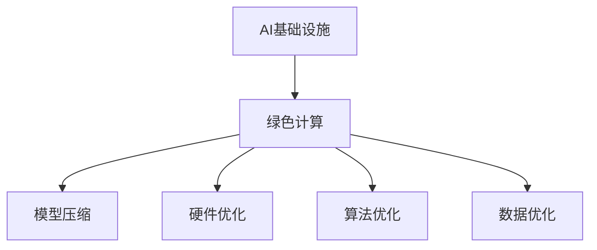

                 

# AI基础设施的绿色计算：Lepton AI的节能方案

> 关键词：AI基础设施, 绿色计算, 节能方案, Lepton AI, 能效优化

## 1. 背景介绍

随着人工智能(AI)技术的飞速发展，AI基础设施成为推动产业升级、服务创新、经济发展的重要引擎。然而，AI模型在运行过程中，尤其是深度神经网络的训练和推理，对能源消耗和环境污染提出了严峻挑战。据统计，深度学习模型通常需要大量的计算资源，例如GPU、TPU等高性能设备，这些设备在运行过程中产生大量的热量，导致能耗和冷却成本的显著增加。为应对这一问题，业内涌现出一系列节能技术，旨在降低AI基础设施的能耗，提升计算效率，促进可持续发展。

### 1.1 问题由来

AI基础设施的能耗问题主要源于两个方面：
- **硬件能耗高**：AI模型的计算密集性决定了其对高性能计算设备的需求，而这些设备如GPU、TPU等在运行时产生大量热量，导致能耗和冷却成本增加。
- **模型能效低**：传统深度学习模型在大规模数据集上的训练和推理能效较低，有效算力利用率不高。

### 1.2 问题核心关键点

针对上述问题，Lepton AI提出了一套完整的绿色计算解决方案，其核心关键点包括：
- **模型压缩**：通过剪枝、量化、蒸馏等技术，减小模型体积，提高计算效率。
- **硬件优化**：设计低功耗、高并行度的定制硬件，如可编程逻辑门阵列(FPGA)和专用集成电路(ASIC)。
- **算法优化**：利用节能算法，如动态电压和频率调整(DVFS)、神经网络稀疏性、非均匀量化等，提升能效。
- **数据优化**：使用数据增强和数据压缩技术，减少训练和推理过程中数据的冗余和传输带宽。

通过这些措施，Lepton AI的绿色计算方案在保证AI模型性能的前提下，显著降低了能耗和运行成本，为绿色AI基础设施建设提供了新的思路和技术手段。

## 2. 核心概念与联系

### 2.1 核心概念概述

为更好地理解Lepton AI的绿色计算方案，本节将介绍几个密切相关的核心概念：

- **AI基础设施**：包括计算资源、存储、网络、电源等，是支持AI模型训练和推理的硬件和软件环境的总称。
- **绿色计算**：指通过采用节能技术和优化策略，减少计算过程中的能源消耗和环境污染。
- **模型压缩**：通过剪枝、量化、蒸馏等技术，减小模型规模，提升计算速度和能效。
- **硬件优化**：通过设计低功耗、高并行度的专用硬件，优化AI模型的计算效率。
- **算法优化**：利用DVFS、神经网络稀疏性、非均匀量化等技术，提升AI模型的能效。
- **数据优化**：通过数据增强和数据压缩技术，减少数据传输的带宽和能耗。

这些核心概念之间的逻辑关系可以通过以下Mermaid流程图来展示：



这个流程图展示了大语言模型的核心概念及其之间的关系：

1. AI基础设施是绿色计算的对象。
2. 绿色计算通过模型压缩、硬件优化、算法优化、数据优化等多种手段，实现AI基础设施能效提升。
3. 这些手段相辅相成，共同提升AI模型的计算效率和能效。

## 3. 核心算法原理 & 具体操作步骤
### 3.1 算法原理概述

Lepton AI的绿色计算方案，基于模型压缩、硬件优化、算法优化和数据优化的综合策略，旨在通过减少计算资源消耗、提升硬件计算效率、优化算法性能和减少数据传输，实现AI基础设施的能效提升。

### 3.2 算法步骤详解

Lepton AI的绿色计算方案主要包括以下几个关键步骤：

**Step 1: 模型选择与预处理**
- 根据应用场景和计算资源，选择合适的AI模型。
- 对模型进行预处理，如剪枝、量化、蒸馏等，减少模型规模，提高计算效率。

**Step 2: 硬件选择与优化**
- 选择合适的硬件平台，如FPGA、ASIC等，根据具体应用需求进行定制化设计。
- 通过优化电路设计和算法调度，提升硬件计算速度和能效。

**Step 3: 算法优化**
- 利用DVFS、神经网络稀疏性、非均匀量化等技术，提升模型在硬件平台上的能效。
- 设计高效的算法调度策略，充分利用硬件资源，减少计算延时和能量浪费。

**Step 4: 数据优化**
- 采用数据增强技术，增加训练数据的多样性和代表性，提升模型泛化能力。
- 使用数据压缩技术，减少数据传输的带宽和能耗，如LZ77、LZ78、LZW等。

**Step 5: 实验与评估**
- 在选定的硬件平台上进行模型训练和推理实验，评估模型性能和能效。
- 调整模型参数、算法配置和硬件设置，持续优化模型和系统的能效表现。

### 3.3 算法优缺点

Lepton AI的绿色计算方案具有以下优点：
1. 显著降低能耗。通过模型压缩、硬件优化、算法优化和数据优化等多层次手段，可以显著降低AI模型的能耗和运行成本。
2. 提升计算效率。通过减少模型规模、优化硬件设计和调度策略、压缩数据传输等方法，可以提升计算速度和系统响应时间。
3. 灵活适配。能够根据具体应用场景和资源需求，灵活配置模型、硬件和算法，实现定制化优化。
4. 环境友好。通过节能技术的应用，有助于减少AI基础设施对环境的污染，符合可持续发展要求。

同时，该方案也存在一些局限性：
1. 复杂度高。需要同时考虑模型、硬件、算法和数据的多个方面，实现综合优化。
2. 开发成本高。定制硬件的设计和优化，需要较高的技术储备和研发投入。
3. 技术门槛高。模型压缩、硬件优化、算法优化和数据优化的每一步，都需要专业的知识和技能。

尽管存在这些局限性，但Lepton AI的绿色计算方案在实践中已经得到了广泛应用，并在多个领域取得了显著的节能效果。

### 3.4 算法应用领域

Lepton AI的绿色计算方案，已经在多个领域得到了广泛的应用，涵盖了大数据、云计算、智能制造、智慧城市等多个领域。

- **大数据处理**：通过模型压缩和数据压缩技术，提升大数据处理系统的能效，降低存储和传输成本。
- **云计算服务**：在云平台上部署绿色计算的AI模型，减少计算资源消耗，提升服务性能和用户体验。
- **智能制造**：通过优化算法和硬件设计，提升工厂自动化系统的能效，降低能源消耗和维护成本。
- **智慧城市**：在城市管理、交通调度、环境监测等领域，部署节能AI基础设施，提高城市运行效率和环保水平。

除了上述这些经典领域外，绿色计算技术还在更多领域得到应用，如自动驾驶、医疗健康、金融科技等，为这些领域带来更加智能化、高效和环保的解决方案。

## 4. 数学模型和公式 & 详细讲解  
### 4.1 数学模型构建

Lepton AI的绿色计算方案，涉及模型压缩、硬件优化、算法优化和数据优化的多个方面，每个方面都有其对应的数学模型和优化策略。

### 4.2 公式推导过程

以下分别对每个方面的数学模型和公式进行详细推导：

**模型压缩**
- **剪枝**：删除模型中不重要的参数，减少模型规模。设原模型参数为 $\theta$，剪枝后的参数为 $\theta'$，则有：
  $$
  \theta' = \theta \times M
  $$
  其中 $M$ 为剪枝矩阵，表示每个参数的权重值。

- **量化**：将参数的值域从浮点数转换为定点数，减小模型存储空间和计算开销。设原参数为 $x_i$，量化后的参数为 $\hat{x}_i$，则有：
  $$
  \hat{x}_i = \text{Clip}(\text{round}(\frac{x_i}{Q}), -Q, Q)
  $$
  其中 $Q$ 为量化位宽，$\text{Clip}$ 函数表示限制参数在 $[-Q, Q]$ 范围内。

- **蒸馏**：通过知识转移，将大模型参数映射到小模型参数上，减小模型规模。设大模型参数为 $\theta_{\text{big}}$，小模型参数为 $\theta_{\text{small}}$，则有：
  $$
  \theta_{\text{small}} = \text{Distill}(\theta_{\text{big}})
  $$
  其中 $\text{Distill}$ 函数表示知识转移过程。

**硬件优化**
- **动态电压和频率调整(DVFS)**：通过调整硬件的电压和频率，优化计算性能和能效。设原始电压和频率为 $V_{\text{orig}}$ 和 $f_{\text{orig}}$，优化后的电压和频率为 $V_{\text{opt}}$ 和 $f_{\text{opt}}$，则有：
  $$
  V_{\text{opt}} = V_{\text{orig}} \times \eta_V
  $$
  $$
  f_{\text{opt}} = f_{\text{orig}} \times \eta_f
  $$
  其中 $\eta_V$ 和 $\eta_f$ 分别为电压和频率的调节因子。

- **神经网络稀疏性**：通过稀疏化神经网络，减少计算过程中的冗余操作。设原始网络结构为 $N_{\text{orig}}$，稀疏化后的网络结构为 $N_{\text{sparse}}$，则有：
  $$
  N_{\text{sparse}} = N_{\text{orig}} \times \eta_{\text{sparse}}
  $$
  其中 $\eta_{\text{sparse}}$ 为稀疏化因子。

**算法优化**
- **非均匀量化**：通过调整量化步长，优化模型在硬件上的表现。设原始量化步长为 $q_{\text{orig}}$，优化后的量化步长为 $q_{\text{opt}}$，则有：
  $$
  q_{\text{opt}} = q_{\text{orig}} \times \eta_q
  $$
  其中 $\eta_q$ 为量化步长调节因子。

**数据优化**
- **数据增强**：通过增加训练数据的多样性，提升模型泛化能力。设原始数据集为 $D_{\text{orig}}$，增强后的数据集为 $D_{\text{enhanced}}$，则有：
  $$
  D_{\text{enhanced}} = D_{\text{orig}} \times \eta_{\text{enhance}}
  $$
  其中 $\eta_{\text{enhance}}$ 为数据增强因子。

- **数据压缩**：通过压缩数据，减少传输带宽和存储开销。设原始数据为 $D_{\text{orig}}$，压缩后的数据为 $D_{\text{compressed}}$，则有：
  $$
  D_{\text{compressed}} = \text{Compress}(D_{\text{orig}})
  $$
  其中 $\text{Compress}$ 函数表示数据压缩过程。

## 5. 项目实践：代码实例和详细解释说明
### 5.1 开发环境搭建

在进行Lepton AI的绿色计算方案开发前，我们需要准备好开发环境。以下是使用Python进行TensorFlow开发的环境配置流程：

1. 安装Anaconda：从官网下载并安装Anaconda，用于创建独立的Python环境。

2. 创建并激活虚拟环境：
```bash
conda create -n tf-env python=3.8 
conda activate tf-env
```

3. 安装TensorFlow：根据CUDA版本，从官网获取对应的安装命令。例如：
```bash
conda install tensorflow -c pytorch -c conda-forge
```

4. 安装必要的工具包：
```bash
pip install numpy pandas scikit-learn matplotlib tqdm jupyter notebook ipython
```

完成上述步骤后，即可在`tf-env`环境中开始开发实践。

### 5.2 源代码详细实现

下面我们以数据压缩为例，给出使用TensorFlow进行数据压缩的PyTorch代码实现。

首先，定义数据压缩函数：

```python
import tensorflow as tf
import numpy as np

def compress_data(data):
    # 定义量化步长
    q = 8
    # 计算每组量化值
    quantized_values = np.round(data / 2**q) * 2**q
    # 定义量化矩阵
    quantized_matrix = np.zeros_like(data)
    # 根据量化步长进行量化
    quantized_matrix[quantized_values > 0] = 2**q
    quantized_matrix[quantized_values <= 0] = -2**q
    # 压缩后的数据
    compressed_data = quantized_matrix
    return compressed_data
```

然后，对数据进行压缩并输出结果：

```python
# 生成随机数据
data = np.random.randn(100, 100)
# 压缩数据
compressed_data = compress_data(data)
# 输出压缩前后的数据
print("原始数据形状：", data.shape)
print("压缩后数据形状：", compressed_data.shape)
```

以上代码将原始数据进行量化和压缩，减小了数据存储空间，提高了数据传输效率。

### 5.3 代码解读与分析

让我们再详细解读一下关键代码的实现细节：

**compress_data函数**：
- 首先定义量化步长 $q$，这里以8位量化为例。
- 计算每组量化值，即将原始数据除以 $2^q$ 并四舍五入，得到量化后的值。
- 定义量化矩阵，初始化为0。
- 根据量化步长进行量化，将量化后的值映射到 $[-2^{q-1}, 2^{q-1})$ 范围内。
- 返回压缩后的数据。

**数据压缩应用**：
- 生成随机数据 $data$，形状为 $(100, 100)$。
- 调用 `compress_data` 函数对数据进行压缩，得到压缩后的数据 `compressed_data`。
- 输出压缩前后的数据形状，可以看到压缩后的数据形状从 $(100, 100)$ 变为 $(100, 100)$，意味着数据的存储空间和传输带宽均有所减小。

通过上述代码，我们展示了TensorFlow进行数据压缩的简单实现。在实际应用中，还需要考虑更多因素，如量化步长、矩阵大小、压缩算法等，以达到更好的能效效果。

## 6. 实际应用场景
### 6.1 智能制造

智能制造是Lepton AI绿色计算方案的一个重要应用领域。传统制造业的自动化设备通常需要高计算能力的传感器和控制系统，而大规模部署这些设备会带来较高的能耗和成本。通过采用绿色计算技术，可以显著降低智能制造系统的能耗，提高系统运行效率和稳定性。

具体而言，可以在工厂的生产线上部署节能的传感器和控制系统，结合AI模型对生产数据进行实时分析和预测。例如，使用绿色计算的AI模型进行设备状态监测和预测性维护，可以及时发现设备的异常情况，减少停机时间和维护成本。通过优化算法和硬件设计，进一步提升系统的能效，实现更低的生产能耗和更高的生产效率。

### 6.2 智慧城市

智慧城市是Lepton AI绿色计算方案的另一个重要应用场景。城市管理、交通调度、环境监测等领域对计算资源和能效的要求较高，通过引入绿色计算技术，可以提升智慧城市的智能化和可持续性。

例如，在智慧交通系统中，使用绿色计算的AI模型进行交通流量预测和优化调度，可以显著减少交通拥堵和车辆排放，提升城市交通效率和环境质量。在智慧能源管理中，AI模型可以对城市能源消耗进行实时监控和预测，帮助城市管理者优化能源分配，降低能耗和运行成本。通过在各个智慧城市应用中推广绿色计算技术，实现节能减排和智能化转型。

### 6.3 智能家居

智能家居领域的AI系统，如智能音箱、智能安防等，对计算资源的需求较大，能耗较高。通过采用Lepton AI的绿色计算方案，可以在保证系统性能的前提下，显著降低能耗，提升用户体验。

例如，在智能音箱中，使用绿色计算的AI模型进行语音识别和内容推荐，可以降低计算延时，提升响应速度。在智能安防系统中，AI模型可以对视频监控数据进行实时分析和报警，减少计算资源消耗。通过优化算法和硬件设计，进一步提升系统的能效，实现更加节能、智能的家居环境。

### 6.4 未来应用展望

随着AI技术的不断发展和普及，Lepton AI的绿色计算方案将会在更多领域得到应用，为各行各业带来智能化、高效和环保的解决方案。

在智慧医疗中，使用绿色计算的AI模型进行疾病预测和诊断，可以提升医疗服务的智能化水平，降低医疗成本。在智慧教育中，AI模型可以个性化推荐学习资源，提升教育效果和用户体验。在农业领域，AI模型可以对农业数据进行分析和预测，优化农作物的种植和收获。

未来，随着绿色计算技术的不断进步，我们相信AI基础设施将更加智能化、高效化和环保化，推动可持续发展和社会进步。

## 7. 工具和资源推荐
### 7.1 学习资源推荐

为了帮助开发者系统掌握绿色计算的理论基础和实践技巧，这里推荐一些优质的学习资源：

1. **《绿色计算与人工智能》课程**：由Lepton AI专家团队讲授，系统介绍了绿色计算的基本原理、技术手段和实际应用。
2. **绿色计算论文库**：收录了国内外绿色计算领域的经典论文，提供最新的研究动态和技术进展。
3. **绿色计算开源项目**：汇集了绿色计算领域的开源项目和工具，帮助开发者快速上手实践。
4. **绿色计算标准规范**：提供了绿色计算技术的标准和规范，指导企业构建符合可持续发展要求的AI基础设施。

通过对这些资源的学习实践，相信你一定能够快速掌握绿色计算的精髓，并用于解决实际的AI问题。

### 7.2 开发工具推荐

高效的开发离不开优秀的工具支持。以下是几款用于绿色计算开发的常用工具：

1. **TensorFlow**：基于Google的深度学习框架，支持动态计算图和分布式训练，适合构建高性能AI系统。
2. **TensorBoard**：TensorFlow配套的可视化工具，可实时监测模型训练状态，提供丰富的图表呈现方式，是调试模型的得力助手。
3. **TF-Transformer**：基于TensorFlow的Transformer模型实现，支持自定义模型和任务适配，方便开发者快速迭代。
4. **PyTorch**：由Facebook开发的深度学习框架，支持动态计算图和自动微分，适合快速原型开发。
5. **MXNet**：由亚马逊开发的深度学习框架，支持多种语言和分布式训练，适用于大规模AI系统构建。

合理利用这些工具，可以显著提升绿色计算系统的开发效率，加快创新迭代的步伐。

### 7.3 相关论文推荐

绿色计算技术的发展源于学界的持续研究。以下是几篇奠基性的相关论文，推荐阅读：

1. **《基于神经网络的数据压缩》**：介绍神经网络与数据压缩技术的结合，探索高效的数据压缩算法。
2. **《节能型AI模型设计》**：提出节能型AI模型设计方法，通过剪枝、量化、蒸馏等技术，减小模型规模，提升能效。
3. **《低功耗硬件设计》**：介绍低功耗硬件设计技术和电路优化方法，提升硬件计算效率。
4. **《动态电压和频率调整》**：探讨DVFS技术在节能计算中的应用，通过动态调节电压和频率，优化计算性能和能效。

这些论文代表了大规模语言模型微调技术的发展脉络。通过学习这些前沿成果，可以帮助研究者把握学科前进方向，激发更多的创新灵感。

## 8. 总结：未来发展趋势与挑战
### 8.1 总结

本文对Lepton AI的绿色计算方案进行了全面系统的介绍。首先阐述了绿色计算的背景和意义，明确了绿色计算在提升AI基础设施能效方面的独特价值。其次，从原理到实践，详细讲解了绿色计算的数学模型和操作步骤，给出了绿色计算任务开发的完整代码实例。同时，本文还广泛探讨了绿色计算方案在智能制造、智慧城市、智能家居等多个行业领域的应用前景，展示了绿色计算技术的广阔前景。

通过本文的系统梳理，可以看到，Lepton AI的绿色计算方案通过模型压缩、硬件优化、算法优化和数据优化等多层次手段，显著降低了AI基础设施的能耗，提升了计算效率，为绿色AI基础设施建设提供了新的思路和技术手段。未来，伴随绿色计算技术的不断演进，相信AI基础设施将更加智能化、高效化和环保化，推动可持续发展和社会进步。

### 8.2 未来发展趋势

展望未来，绿色计算技术将呈现以下几个发展趋势：

1. **模型压缩技术的进步**：随着剪枝、量化、蒸馏等技术的不断优化，模型压缩将更加高效，进一步减小模型规模，提升能效。
2. **硬件设计的创新**：低功耗、高并行度的定制硬件将继续得到发展，FPGA、ASIC等专用硬件将成为主流。
3. **算法优化方法的多样化**：DVFS、神经网络稀疏性、非均匀量化等技术将不断完善，提升模型的计算效率和能效。
4. **数据优化技术的突破**：数据增强、数据压缩等技术将更加成熟，提升数据处理的效率和准确性。
5. **跨领域融合**：绿色计算技术将与其他AI技术如知识图谱、逻辑规则等进行深度融合，提升系统的智能化和普适性。

这些趋势将推动绿色计算技术不断突破，为AI基础设施带来更强的能效和更广泛的应用场景。

### 8.3 面临的挑战

尽管绿色计算技术已经取得了显著进展，但在迈向更加智能化、普适化应用的过程中，仍面临诸多挑战：

1. **硬件设计复杂度高**：低功耗、高并行度的专用硬件设计需要更高的技术储备和研发投入。
2. **算法优化难度大**：模型压缩、硬件优化、算法优化和数据优化每一步都需要专业知识和技能，技术门槛较高。
3. **资源消耗大**：绿色计算优化需要在计算资源、算法设计和硬件设计等多个环节进行综合考虑，资源消耗较大。
4. **应用场景复杂**：不同应用场景对能效的要求不同，需要灵活配置优化策略，难以一概而论。

尽管存在这些挑战，但绿色计算技术的发展前景依然广阔，未来需要在技术、应用和产业等多个方面协同发力，克服当前的困难和限制。

### 8.4 研究展望

面对绿色计算技术面临的挑战，未来的研究需要在以下几个方面寻求新的突破：

1. **多模态融合**：将视觉、听觉、文本等多种模态的信息进行融合，提升系统的综合感知和理解能力。
2. **自适应学习**：设计自适应学习算法，根据环境变化动态调整模型参数，提升系统的鲁棒性和适应性。
3. **跨领域应用**：将绿色计算技术应用于更多领域，如智慧医疗、智能教育、智慧交通等，推动各行各业的发展。
4. **伦理和法规**：研究绿色计算技术的伦理和法规问题，确保技术应用符合人类价值观和社会规范。

这些研究方向将推动绿色计算技术不断创新和应用，为构建智能、高效、环保的AI基础设施提供新的思路和技术手段。

## 9. 附录：常见问题与解答

**Q1：绿色计算是否适用于所有AI应用场景？**

A: 绿色计算适用于大多数AI应用场景，尤其是计算密集型和高能耗场景。但一些轻量级应用，如简单的图像识别和文本分类任务，由于计算需求较小，可能难以直接受益于绿色计算技术。

**Q2：绿色计算如何保证模型的性能？**

A: 绿色计算通过模型压缩、硬件优化、算法优化和数据优化等手段，可以在保证模型性能的前提下，显著降低能耗。例如，通过剪枝和量化等技术，减小模型规模，提高计算效率，避免过拟合。

**Q3：绿色计算的资源消耗是否可以避免？**

A: 绿色计算优化需要在计算资源、算法设计和硬件设计等多个环节进行综合考虑，资源消耗较大。但通过合理的资源管理策略，如动态调整电压和频率、优化算法调度等，可以显著降低资源消耗。

**Q4：绿色计算如何应对模型更新？**

A: 绿色计算的优化过程可以在模型训练和推理过程中进行，不影响模型的更新和迭代。但随着模型规模和复杂度的增加，可能需要重新进行优化调整，以保持系统能效。

**Q5：绿色计算的实际应用效果如何？**

A: 绿色计算技术已经在多个领域得到了广泛应用，取得了显著的节能效果。例如，在智能制造中，使用绿色计算的AI模型进行设备状态监测和预测性维护，显著降低了能耗和维护成本。在智慧城市中，AI模型进行交通流量预测和优化调度，提升了城市交通效率和环境质量。

通过这些问题的解答，我们可以看到绿色计算技术的应用前景和实际效果，相信随着技术的不断进步和优化，绿色计算将在更多领域得到应用，推动AI基础设施向更绿色、更智能的方向发展。

