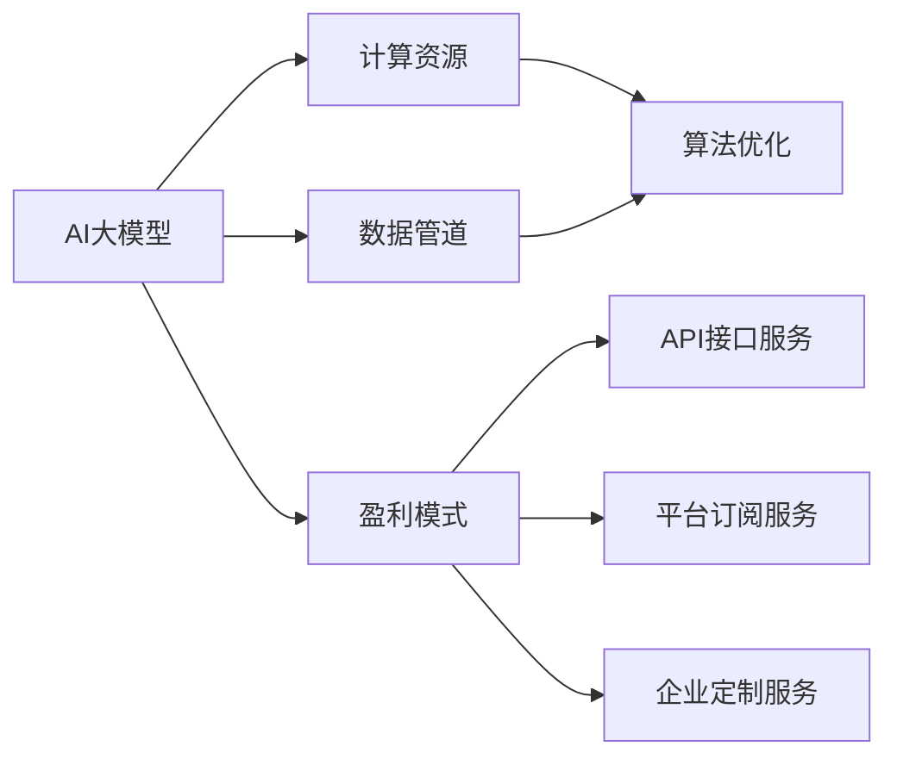

                 

# AI大模型创业：如何实现未来盈利？

## 1. 背景介绍

### 1.1 问题由来
近年来，AI大模型在各行各业的应用不断深入，带来了巨大的经济效益和社会价值。然而，对AI大模型企业而言，如何实现商业化运营、盈利，依然是一大挑战。

AI大模型通常依赖于海量的数据、强大的计算资源和复杂的算法模型，这些高昂的投入如何回收成本，并通过盈利模式实现可持续发展，成为了摆在企业面前的难题。

### 1.2 问题核心关键点
AI大模型的商业化运营涉及以下关键点：

- **数据获取与处理**：如何获取高质量的数据，并对其进行清洗、标注等预处理。
- **计算资源**：如何高效利用计算资源，提高模型训练和推理的效率。
- **算法优化**：如何通过算法优化，提升模型性能和稳定性。
- **盈利模式**：如何设计合理的盈利模式，实现商业化运营。

本文将从上述四个关键点出发，探讨AI大模型企业如何实现未来盈利。

## 2. 核心概念与联系

### 2.1 核心概念概述

为更好地理解AI大模型创业中盈利模式的构建，本文将介绍几个关键概念：

- **AI大模型**：指基于深度学习框架训练的庞大神经网络模型，用于解决特定领域的复杂任务，如自然语言处理、图像识别等。
- **数据管道**：指数据从采集到清洗、标注等环节的自动化流程，确保数据的持续供应和质量。
- **计算资源**：指用于模型训练和推理的计算设备，如GPU、TPU、云计算资源等。
- **算法优化**：指通过模型压缩、量化、剪枝等技术手段，优化模型结构，提高性能和效率。
- **盈利模式**：指企业通过AI大模型提供服务或产品的商业模式，如API接口服务、平台订阅服务、企业定制服务等。

这些概念之间的联系可以通过以下Mermaid流程图展示：



此流程图展示了AI大模型与数据管道、计算资源、算法优化和盈利模式之间的关系：

1. AI大模型的构建依赖于数据管道和计算资源。
2. 算法优化可以提升AI大模型的性能和效率。
3. 盈利模式决定了AI大模型的商业化路径。
4. 盈利模式的选择还需结合API接口服务、平台订阅服务和企业定制服务等具体方式。

## 3. 核心算法原理 & 具体操作步骤

### 3.1 算法原理概述

AI大模型的盈利模式设计主要基于以下几个关键原理：

- **数据经济**：高质量的数据是AI大模型性能的基础，数据获取和处理的高效性直接影响盈利能力。
- **计算经济**：高效利用计算资源，降低训练和推理成本。
- **算法经济**：通过算法优化，提升模型性能，降低资源消耗。
- **应用经济**：合理设计盈利模式，提供多样化的服务，扩大市场覆盖。

### 3.2 算法步骤详解

以下是AI大模型盈利模式设计的主要步骤：

**Step 1: 数据获取与处理**

- **数据采集**：从网络、公开数据集、用户上传等多渠道获取数据。
- **数据清洗**：去除噪声、重复数据，进行标注。
- **数据增强**：通过数据扩充技术，提高数据的多样性和质量。

**Step 2: 计算资源管理**

- **资源分配**：根据任务需求，合理分配GPU、TPU等计算资源。
- **资源调度**：动态调整资源配置，优化计算效率。
- **资源共享**：采用云平台、Kubernetes等技术，实现资源共享。

**Step 3: 算法优化**

- **模型压缩**：减少模型参数量，降低内存占用。
- **量化加速**：将浮点计算转换为定点计算，提高计算速度。
- **剪枝优化**：去除冗余连接和节点，提升模型效率。

**Step 4: 盈利模式设计**

- **API接口服务**：提供模型预测服务，按调用次数收费。
- **平台订阅服务**：提供开发者平台，收取订阅费用。
- **企业定制服务**：根据企业需求定制模型，提供定制化解决方案。

**Step 5: 持续优化**

- **反馈机制**：收集用户反馈，持续优化模型和服务。
- **模型更新**：定期更新模型，提升性能和稳定性。
- **市场推广**：通过市场推广，扩大用户群体。

### 3.3 算法优缺点

AI大模型盈利模式设计的优缺点如下：

**优点**：

1. **灵活性**：可提供多种服务形式，满足不同客户需求。
2. **可扩展性**：可快速适应市场变化，不断扩展服务范围。
3. **高效率**：通过数据管道和算法优化，提高数据处理和模型训练效率。

**缺点**：

1. **高投入**：初始阶段需要大量资金投入，数据和计算资源获取成本高。
2. **市场竞争激烈**：众多企业都在争抢市场份额，竞争激烈。
3. **技术复杂性**：算法优化和系统设计技术要求高，需要多学科知识。

### 3.4 算法应用领域

AI大模型盈利模式设计在多个领域都有应用，例如：

- **医疗健康**：提供疾病诊断、医疗影像分析等服务，按项目或服务收费。
- **金融服务**：提供风险评估、欺诈检测等服务，按调用次数收费。
- **智能制造**：提供设备监控、质量检测等服务，按月或按项目收费。
- **智慧城市**：提供交通管理、环境监测等服务，按使用量或服务收费。

## 4. 数学模型和公式 & 详细讲解  
### 4.1 数学模型构建

本文以自然语言处理(NLP)中的文本分类任务为例，介绍基于AI大模型的盈利模式设计。

假设我们有一批标记好的文本数据 $D = \{(x_i, y_i)\}_{i=1}^N$，其中 $x_i$ 为输入文本，$y_i \in \{1, -1\}$ 为标签。我们的目标是训练一个分类模型 $M_{\theta}$，使其能够对新文本进行分类。

**模型构建**：

$$
M_{\theta} = \text{BERT}_{\theta}(x_i) = \text{Linear}(\text{Pool}(\text{BERT}(x_i)))
$$

其中，$\text{BERT}_{\theta}$ 为预训练好的BERT模型，$\text{Linear}$ 为线性分类器，$\text{Pool}$ 为文本池化操作。

**损失函数**：

$$
\mathcal{L}(\theta) = -\frac{1}{N} \sum_{i=1}^N y_i \log \text{Softmax}(M_{\theta}(x_i))
$$

其中，$\text{Softmax}$ 为softmax函数，用于将模型输出转换为概率分布。

### 4.2 公式推导过程

**前向传播**：

$$
z_i = \text{BERT}_{\theta}(x_i)
$$

$$
\hat{y}_i = \text{Softmax}(z_i)
$$

**反向传播**：

$$
\frac{\partial \mathcal{L}(\theta)}{\partial z_i} = -y_i \frac{\hat{y}_i}{\hat{y}_i} + \frac{1-y_i}{1-\hat{y}_i}
$$

$$
\frac{\partial \mathcal{L}(\theta)}{\partial \theta} = \sum_{i=1}^N \frac{\partial \mathcal{L}(\theta)}{\partial z_i} \frac{\partial z_i}{\partial \theta}
$$

### 4.3 案例分析与讲解

以一家医疗影像分类公司为例，该公司主要提供CT扫描图像的肿瘤分类服务。公司设计了基于AI大模型的盈利模式如下：

1. **数据获取**：公司与多家医院合作，获取大量带标签的CT图像数据。
2. **模型训练**：使用BERT模型对数据进行训练，得到分类模型 $M_{\theta}$。
3. **API接口服务**：开发API接口，允许医院上传CT图像，获取分类结果。
4. **平台订阅服务**：提供开发者平台，供医疗机构开发自己的分类应用。
5. **企业定制服务**：根据企业需求定制模型，提供个性化解决方案。

## 5. 项目实践：代码实例和详细解释说明

### 5.1 开发环境搭建

为实现上述盈利模式，公司需要搭建以下开发环境：

1. **数据管道**：使用Apache Kafka、Apache Beam等工具，搭建数据采集和处理管道。
2. **计算资源**：使用AWS、Google Cloud等云平台，获取GPU和TPU资源。
3. **算法优化**：使用TensorFlow、PyTorch等深度学习框架，进行模型压缩和量化。
4. **服务部署**：使用Docker、Kubernetes等容器技术，进行模型和服务部署。

### 5.2 源代码详细实现

以下是基于TensorFlow实现的文本分类模型的代码：

```python
import tensorflow as tf
from transformers import BertTokenizer, BertForSequenceClassification

# 加载数据
train_dataset = ...
val_dataset = ...
test_dataset = ...

# 加载BERT模型
tokenizer = BertTokenizer.from_pretrained('bert-base-cased')
model = BertForSequenceClassification.from_pretrained('bert-base-cased', num_labels=2)

# 模型训练
model.compile(optimizer=tf.keras.optimizers.Adam(learning_rate=2e-5),
              loss=tf.keras.losses.SparseCategoricalCrossentropy(from_logits=True),
              metrics=['accuracy'])

model.fit(train_dataset, epochs=3, validation_data=val_dataset)

# 模型评估
test_loss, test_acc = model.evaluate(test_dataset)
print(f'Test Loss: {test_loss}, Test Accuracy: {test_acc}')

# API接口服务
def predict(text):
    encoded_input = tokenizer.encode(text, return_tensors='pt')
    logits = model(encoded_input)[0]
    prediction = tf.argmax(logits, axis=-1)
    return prediction.numpy()[0]
```

### 5.3 代码解读与分析

**数据管道搭建**：

- **数据采集**：使用Apache Kafka从数据源获取文本数据，并进行初步清洗。
- **数据增强**：通过同义词替换、随机噪声等技术，增强数据多样性。
- **数据标注**：由专业人员对文本数据进行标注，确保数据质量。

**计算资源管理**：

- **资源分配**：在AWS上分配GPU资源，用于模型训练。
- **资源调度**：使用Kubernetes进行动态资源调整，优化计算效率。
- **资源共享**：将计算资源开放给开发者平台，方便其进行模型训练和推理。

**算法优化**：

- **模型压缩**：使用TensorFlow的模型压缩工具，减少模型参数量。
- **量化加速**：将模型转换为定点计算，提高计算速度。
- **剪枝优化**：使用TensorFlow的剪枝工具，去除冗余连接和节点。

**服务部署**：

- **API接口服务**：使用Flask搭建API接口，提供模型预测服务。
- **平台订阅服务**：开发开发者平台，供医疗机构开发应用。
- **企业定制服务**：根据企业需求，定制化模型和解决方案。

## 6. 实际应用场景

### 6.1 医疗影像分类

某医院利用AI大模型提供CT扫描图像的肿瘤分类服务，通过API接口服务，医院可以实时上传图像，获取分类结果。平台订阅服务允许医院自定义模型，提高诊断准确性。企业定制服务则根据医院需求，提供个性化的肿瘤分类解决方案。

### 6.2 金融风险评估

某金融机构利用AI大模型提供客户信用评估服务，通过API接口服务，金融机构可以实时获取客户信用评分。平台订阅服务允许金融机构定制化模型，提高信用评估的准确性。企业定制服务则根据金融机构需求，提供个性化的风险评估解决方案。

### 6.3 智能制造设备监控

某制造企业利用AI大模型提供设备监控服务，通过API接口服务，设备制造商可以实时监控设备状态，获取故障预测结果。平台订阅服务允许制造商自定义模型，提高设备监控的准确性。企业定制服务则根据制造商需求，提供个性化的设备监控解决方案。

### 6.4 智慧城市环境监测

某智慧城市利用AI大模型提供环境监测服务，通过API接口服务，政府可以实时获取环境数据，进行数据分析和决策。平台订阅服务允许政府自定义模型，提高环境监测的准确性。企业定制服务则根据政府需求，提供个性化的环境监测解决方案。

## 7. 工具和资源推荐

### 7.1 学习资源推荐

为帮助开发者掌握AI大模型的盈利模式设计，本文推荐以下学习资源：

1. **《深度学习理论与实践》**：介绍深度学习理论基础和常用算法，帮助开发者掌握模型训练和优化技巧。
2. **《TensorFlow实战》**：介绍TensorFlow框架的使用和优化，帮助开发者实现高效模型训练和推理。
3. **《Kubernetes实战》**：介绍Kubernetes集群管理和资源调度，帮助开发者实现高效计算资源管理。
4. **《Apache Kafka实战》**：介绍Apache Kafka的数据管道搭建和优化，帮助开发者实现高效数据采集和处理。

### 7.2 开发工具推荐

为实现AI大模型的盈利模式设计，本文推荐以下开发工具：

1. **TensorFlow**：提供深度学习框架和优化工具，支持多种模型训练和推理。
2. **Apache Kafka**：提供数据管道搭建和优化工具，支持高效数据采集和处理。
3. **AWS**：提供云平台和计算资源，支持高效模型训练和推理。
4. **Flask**：提供API接口搭建工具，支持模型预测服务。
5. **Kubernetes**：提供容器化部署和资源调度工具，支持高效计算资源管理。

### 7.3 相关论文推荐

为深入了解AI大模型的盈利模式设计，本文推荐以下相关论文：

1. **《深度学习在自然语言处理中的应用》**：介绍深度学习在NLP中的应用，帮助开发者理解AI大模型的基本原理。
2. **《TensorFlow优化实践》**：介绍TensorFlow框架的优化实践，帮助开发者实现高效模型训练和推理。
3. **《Kubernetes集群管理》**：介绍Kubernetes集群的搭建和管理，帮助开发者实现高效计算资源管理。
4. **《Apache Kafka数据管道优化》**：介绍Apache Kafka的数据管道优化实践，帮助开发者实现高效数据采集和处理。

## 8. 总结：未来发展趋势与挑战

### 8.1 总结

本文系统探讨了AI大模型创业中的盈利模式设计，从数据获取与处理、计算资源管理、算法优化和盈利模式设计四个关键点出发，详细阐述了其设计和实现过程。通过分析真实案例，本文展示了AI大模型在医疗影像分类、金融风险评估、智能制造设备监控和智慧城市环境监测等领域的成功应用。同时，本文还推荐了相关的学习资源、开发工具和研究论文，帮助开发者掌握AI大模型的盈利模式设计。

## 8.2 未来发展趋势

AI大模型盈利模式设计将呈现以下几个发展趋势：

1. **数据经济**：高质量的数据将更加重要，数据获取和处理技术将进一步提升。
2. **计算经济**：计算资源将更加普及，云计算和大规模集群技术将推动高效资源管理。
3. **算法经济**：算法优化技术将进一步提升，模型压缩、量化和剪枝等技术将得到广泛应用。
4. **应用经济**：AI大模型将应用于更多领域，提供多样化的服务，市场覆盖将进一步扩大。

## 8.3 面临的挑战

尽管AI大模型盈利模式设计在多个领域取得了成功应用，但仍然面临以下挑战：

1. **数据获取和处理成本高**：高质量数据的获取和处理成本较高，制约了企业的盈利能力。
2. **计算资源成本高**：计算资源的获取和维护成本较高，增加了企业运营负担。
3. **算法优化难度大**：算法优化技术复杂，需要多学科知识，增加了研发难度。
4. **市场竞争激烈**：众多企业争抢市场份额，市场竞争激烈。

## 8.4 研究展望

为应对这些挑战，未来的研究需要在以下几个方面取得突破：

1. **数据获取和处理技术**：探索更多数据获取渠道，提升数据处理效率，降低数据获取成本。
2. **计算资源管理技术**：研究更多云平台和大规模集群技术，提升计算资源利用率，降低计算资源成本。
3. **算法优化技术**：研究更多高效的模型压缩、量化和剪枝技术，提升模型性能和效率。
4. **市场推广和营销策略**：研究更多市场推广和营销策略，扩大用户群体，提升市场占有率。

综上所述，AI大模型盈利模式设计需要从数据获取与处理、计算资源管理、算法优化和盈利模式设计四个关键点出发，进行全面优化和提升。通过系统化的设计和持续的优化，AI大模型将能够实现更好的商业化运营和盈利。

---

作者：禅与计算机程序设计艺术 / Zen and the Art of Computer Programming

