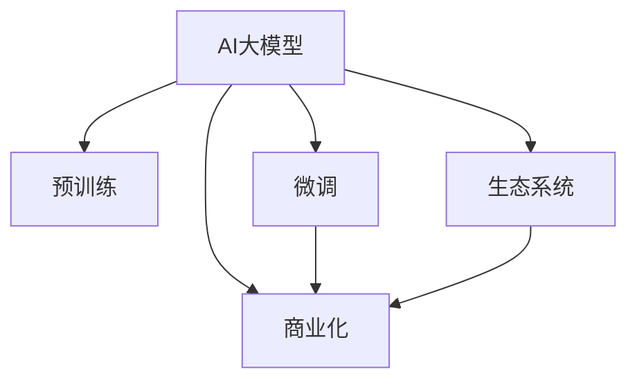

                 

# AI大模型创业：如何应对未来市场挑战？

> 关键词：AI大模型,创业,市场挑战,商业化策略,技术栈,风险管理,用户需求,未来趋势

## 1. 背景介绍

### 1.1 问题由来
随着人工智能技术的高速发展，AI大模型成为创业者和企业争相布局的热点。从GPT-3到ChatGPT，再到GPT-4，大模型的应用领域不断扩展，从文本生成到语音识别，再到视觉理解，AI大模型展示出了强大的跨领域能力。然而，随着市场竞争的加剧和应用场景的复杂化，AI大模型的创业之路也面临诸多挑战。如何在大模型创业中应对这些挑战，从而在激烈的市场竞争中脱颖而出，是摆在所有创业者面前的重要课题。

### 1.2 问题核心关键点
AI大模型创业的核心在于如何利用先进技术解决实际问题，实现商业价值的最大化。这不仅需要具备深厚的技术积累，还需要对市场环境、用户需求、商业模式有深刻理解。本文将从技术、市场、商业化等多个维度，深入探讨AI大模型创业中应如何应对未来市场挑战。

### 1.3 问题研究意义
随着AI技术的普及，AI大模型的应用场景日益增多，为各行各业带来了新的机遇。但对于AI大模型创业来说，如何在技术创新、市场竞争、商业化运营等方面取得突破，成为决定其成功的关键。通过深入分析AI大模型创业中的核心问题，可以为创业者提供战略指导，帮助其在市场竞争中胜出。

## 2. 核心概念与联系

### 2.1 核心概念概述

为更好地理解AI大模型创业的过程，本节将介绍几个密切相关的核心概念：

- AI大模型（AI Large Models）：指基于深度学习技术训练出的超大参数规模模型，如GPT、BERT、DETR等。这些模型通过预训练获得丰富的语言、图像、声音等表示能力，能够在各种自然语言处理、计算机视觉、语音识别等任务中实现卓越表现。
- 预训练（Pre-training）：指在大规模无标签数据上进行自监督学习，学习到通用的特征表示。通过预训练，模型能够获得丰富的知识，适用于多种下游任务。
- 微调（Fine-tuning）：指在预训练模型的基础上，通过少量标注数据对模型进行有监督学习，以适配特定任务。微调能够显著提升模型在特定任务上的表现。
- 商业化（Commercialization）：将技术转化为可量化的商业价值的过程。包括市场调研、产品设计、运营推广、客户服务等环节。
- 生态系统（Ecosystem）：指围绕AI大模型构建的完整技术、市场、社区等资源环境。良好的生态系统有助于模型技术的快速迭代和市场扩展。

这些核心概念之间的逻辑关系可以通过以下Mermaid流程图来展示：



这个流程图展示了大模型创业的完整流程：

1. 大模型通过预训练获得基础能力。
2. 微调适配特定任务，提升模型性能。
3. 商业化将技术转化为商业价值。
4. 生态系统提供技术、市场等环境支持。

## 3. 核心算法原理 & 具体操作步骤
### 3.1 算法原理概述

AI大模型创业的核心在于如何利用大模型的技术优势，解决实际问题，实现商业化。以下将详细介绍AI大模型创业的关键技术原理和操作步骤：

### 3.2 算法步骤详解

**Step 1: 市场调研与用户需求分析**
- 了解市场趋势和技术发展动态，确定目标用户群体和主要竞争对手。
- 通过问卷调查、访谈、竞品分析等方式，获取用户需求和痛点，确定产品功能和特性。

**Step 2: 选择预训练模型和构建任务适配层**
- 根据应用场景选择合适的预训练模型，如GPT、BERT、DETR等。
- 设计适配层，包含输出层、损失函数等，适配特定任务，如分类、匹配、生成等。

**Step 3: 数据集准备与微调训练**
- 收集、清洗、标注数据集，确保数据质量和多样性。
- 使用选定的预训练模型和适配层，在数据集上进行微调训练，优化模型性能。

**Step 4: 产品开发与技术实现**
- 将微调后的模型集成到产品中，开发API接口和用户界面。
- 实现高效推理引擎，支持模型的实时响应和批量处理。

**Step 5: 市场推广与用户反馈**
- 制定市场推广策略，选择合适的营销渠道和手段。
- 收集用户反馈，不断优化产品功能和性能，提升用户体验。

**Step 6: 持续优化与生态建设**
- 持续收集新数据，重新微调模型，保持模型性能的领先性。
- 构建开发者社区，分享技术经验和生态资源，吸引更多的开发者和用户。

### 3.3 算法优缺点

AI大模型创业的优势在于：

- 技术领先：大模型拥有强大的深度学习能力，能够在多种自然语言处理任务中实现卓越表现。
- 应用广泛：适用于文本生成、图像识别、语音识别等多种应用场景，具有广阔的市场前景。
- 生态丰富：得益于丰富的开源资源和社区支持，可以快速迭代和优化产品。

然而，大模型创业也存在一些局限性：

- 数据需求高：由于模型规模庞大，需要大量的标注数据进行微调，数据获取成本高。
- 技术门槛高：大模型的训练和部署需要深厚的技术积累，对人才和资源要求高。
- 市场竞争激烈：AI大模型技术壁垒较低，市场准入门槛低，竞争激烈。

### 3.4 算法应用领域

AI大模型创业在多个领域有着广泛的应用，以下是几个典型的应用场景：

1. **智能客服与推荐系统**：通过微调大模型，实现智能问答、推荐算法，提高客户服务效率和用户体验。
2. **医疗诊断与健康管理**：利用大模型的自然语言处理能力，分析病历、药品说明书等文本数据，辅助医生诊断和治疗。
3. **金融风控与风险管理**：结合大模型的文本分析能力和统计模型，进行风险预警和信用评估。
4. **教育与培训**：通过自然语言处理和大数据分析，实现个性化教学、智能评测等功能。
5. **智慧城市与交通管理**：利用大模型的图像识别能力，优化城市管理、交通控制等系统。

这些应用场景展示了AI大模型在各个领域的重要价值，未来随着技术的不断进步，大模型创业的领域还将进一步拓展。

## 4. 数学模型和公式 & 详细讲解 & 举例说明
### 4.1 数学模型构建

以下将使用数学语言对AI大模型创业中的关键模型构建过程进行详细讲解。

假设预训练模型为 $M_{\theta}$，目标任务为 $T$，训练数据集为 $D=\{(x_i,y_i)\}_{i=1}^N$。假设适配层为 $L$，输出为 $y$，则目标函数为：

$$
\mathcal{L}(\theta, L) = \frac{1}{N} \sum_{i=1}^N \ell(M_{\theta}(x_i), y_i)
$$

其中，$\ell$ 为损失函数，用于衡量模型预测与真实标签之间的差异。常见损失函数包括交叉熵、均方误差等。

### 4.2 公式推导过程

以文本分类任务为例，进行详细推导。假设模型输出为 $\hat{y}=M_{\theta}(x)$，真实标签为 $y \in \{0,1\}$，交叉熵损失函数为：

$$
\ell(M_{\theta}(x), y) = -y\log \hat{y} - (1-y)\log(1-\hat{y})
$$

则目标函数为：

$$
\mathcal{L}(\theta, L) = -\frac{1}{N} \sum_{i=1}^N [y_i\log \hat{y}_i + (1-y_i)\log(1-\hat{y}_i)]
$$

根据链式法则，目标函数对参数 $\theta$ 的梯度为：

$$
\frac{\partial \mathcal{L}(\theta, L)}{\partial \theta} = -\frac{1}{N} \sum_{i=1}^N (\frac{y_i}{\hat{y}_i}-\frac{1-y_i}{1-\hat{y}_i}) \frac{\partial M_{\theta}(x_i)}{\partial \theta}
$$

在得到梯度后，使用优化算法（如Adam、SGD等）更新模型参数，最小化目标函数，完成模型微调。

### 4.3 案例分析与讲解

以智能客服系统为例，分析其模型构建和训练过程。

1. **数据准备**：
   - 收集历史客服对话数据，标注用户意图和响应标签。
   - 清洗数据，去除无用信息，构建训练集、验证集和测试集。

2. **模型选择**：
   - 选择GPT-3作为预训练模型，其具有强大的语言生成能力。
   - 设计适配层，输出层为线性层，损失函数为交叉熵。

3. **模型微调**：
   - 在微调过程中，保持预训练权重不变，仅调整适配层参数。
   - 使用Adam优化算法，学习率为1e-5，批大小为32，迭代轮数为5。

4. **模型评估**：
   - 在验证集上评估模型性能，使用BLEU、ROUGE等指标。
   - 调整模型超参数，进一步提升模型效果。

5. **模型应用**：
   - 将微调后的模型集成到智能客服系统中，实现自然语言处理功能。
   - 通过API接口提供服务，支持用户提问和响应。

## 5. 项目实践：代码实例和详细解释说明
### 5.1 开发环境搭建

在进行AI大模型创业项目实践前，需要准备好开发环境。以下是使用Python进行PyTorch开发的环境配置流程：

1. 安装Anaconda：从官网下载并安装Anaconda，用于创建独立的Python环境。

2. 创建并激活虚拟环境：
```bash
conda create -n pytorch-env python=3.8 
conda activate pytorch-env
```

3. 安装PyTorch：根据CUDA版本，从官网获取对应的安装命令。例如：
```bash
conda install pytorch torchvision torchaudio cudatoolkit=11.1 -c pytorch -c conda-forge
```

4. 安装Transformer库：
```bash
pip install transformers
```

5. 安装各类工具包：
```bash
pip install numpy pandas scikit-learn matplotlib tqdm jupyter notebook ipython
```

完成上述步骤后，即可在`pytorch-env`环境中开始项目实践。

### 5.2 源代码详细实现

以下是一个使用PyTorch进行文本分类任务的Python代码实现，包含模型加载、数据处理、训练、评估等步骤：

```python
import torch
import torch.nn as nn
import torch.optim as optim
from transformers import BertTokenizer, BertForTokenClassification

# 加载数据集
tokenizer = BertTokenizer.from_pretrained('bert-base-uncased')
train_data = ...
dev_data = ...
test_data = ...

# 加载预训练模型
model = BertForTokenClassification.from_pretrained('bert-base-uncased', num_labels=num_labels)

# 定义损失函数和优化器
criterion = nn.CrossEntropyLoss()
optimizer = optim.AdamW(model.parameters(), lr=1e-5)

# 训练模型
model.train()
for epoch in range(num_epochs):
    for batch in train_data:
        inputs = tokenizer(batch['input'], return_tensors='pt', padding=True)
        labels = batch['labels']
        outputs = model(**inputs)
        loss = criterion(outputs.logits, labels)
        optimizer.zero_grad()
        loss.backward()
        optimizer.step()

# 评估模型
model.eval()
with torch.no_grad():
    dev_loss, dev_acc = ...
    test_loss, test_acc = ...

# 返回结果
return dev_loss, dev_acc, test_loss, test_acc
```

### 5.3 代码解读与分析

让我们再详细解读一下关键代码的实现细节：

**数据处理**：
- 使用BertTokenizer从预训练模型中加载分词器，对输入数据进行分词、编码和padding，得到模型所需的输入张量。

**模型加载**：
- 使用BertForTokenClassification从预训练模型中加载适配层，初始化模型参数。

**训练过程**：
- 在训练过程中，通过前向传播计算损失，使用AdamW优化器更新模型参数。

**评估过程**：
- 在评估过程中，关闭梯度更新，计算模型在验证集和测试集上的损失和准确率。

**结果返回**：
- 返回模型在验证集和测试集上的损失和准确率，用于后续的分析和优化。

## 6. 实际应用场景

### 6.1 智能客服系统

AI大模型在智能客服系统中有着广泛的应用。通过微调预训练模型，可以实现智能问答、对话生成等功能，大幅提升客服系统的自动化水平和用户体验。

**项目实践**：
- 收集客户咨询数据，标注用户意图和响应模板。
- 使用GPT-3进行微调，得到智能客服模型。
- 将模型集成到客服系统中，提供自然语言交互功能。

**技术挑战**：
- 需要处理海量数据，构建高质量标注集。
- 需要优化模型推理速度，满足实时响应需求。

### 6.2 医疗诊断系统

AI大模型在医疗诊断中也展现出巨大潜力。通过微调大模型，可以实现疾病诊断、病情分析等功能，辅助医生进行高效精准的诊断和治疗。

**项目实践**：
- 收集医学文献、病历等数据，标注疾病标签。
- 使用BERT进行微调，得到医疗诊断模型。
- 将模型集成到医疗平台中，提供疾病诊断和建议。

**技术挑战**：
- 需要处理复杂的医学术语和领域知识。
- 需要保证模型的稳定性和可解释性，避免误诊风险。

### 6.3 金融风险管理系统

AI大模型在金融领域也大有可为。通过微调大模型，可以实现金融风险预警、信用评估等功能，提升金融机构的风险管理能力。

**项目实践**：
- 收集金融交易数据，标注交易类别和风险等级。
- 使用GPT-3进行微调，得到金融风险管理模型。
- 将模型集成到交易系统中，提供风险预警和评估功能。

**技术挑战**：
- 需要处理大量高维稀疏数据。
- 需要保证模型的鲁棒性和准确性，避免误判风险。

## 7. 工具和资源推荐
### 7.1 学习资源推荐

为了帮助开发者系统掌握AI大模型创业的理论基础和实践技巧，这里推荐一些优质的学习资源：

1. 《深度学习与人工智能》系列课程：由知名学者和专家讲授，涵盖深度学习、自然语言处理、计算机视觉等多个领域。

2. Coursera《自然语言处理》课程：由斯坦福大学提供的NLP经典课程，讲解NLP基础概念和经典模型。

3. Kaggle数据科学竞赛：提供大量数据集和竞赛任务，帮助开发者提升实战能力。

4. PyTorch官方文档：详细介绍了PyTorch的使用方法，包括模型构建、训练和推理等环节。

5. HuggingFace官方文档：提供了丰富的预训练模型和微调样例，是学习和实践的必备资料。

### 7.2 开发工具推荐

高效的开发离不开优秀的工具支持。以下是几款用于AI大模型创业开发的常用工具：

1. PyTorch：基于Python的开源深度学习框架，灵活动态的计算图，适合快速迭代研究。

2. TensorFlow：由Google主导开发的开源深度学习框架，生产部署方便，适合大规模工程应用。

3. Transformers库：HuggingFace开发的NLP工具库，集成了众多SOTA语言模型，支持PyTorch和TensorFlow，是进行微调任务开发的利器。

4. Jupyter Notebook：免费、开源的交互式笔记本，支持多种编程语言和数据可视化。

5. Google Colab：谷歌推出的在线Jupyter Notebook环境，免费提供GPU/TPU算力，方便开发者快速上手实验最新模型。

### 7.3 相关论文推荐

AI大模型和创业技术的发展源于学界的持续研究。以下是几篇奠基性的相关论文，推荐阅读：

1. Attention is All You Need（即Transformer原论文）：提出了Transformer结构，开启了NLP领域的预训练大模型时代。

2. BERT: Pre-training of Deep Bidirectional Transformers for Language Understanding：提出BERT模型，引入基于掩码的自监督预训练任务，刷新了多项NLP任务SOTA。

3. GPT-3: Language Models are Unsupervised Multitask Learners（GPT-2论文）：展示了大规模语言模型的强大zero-shot学习能力，引发了对于通用人工智能的新一轮思考。

4. Parameter-Efficient Transfer Learning for NLP：提出Adapter等参数高效微调方法，在不增加模型参数量的情况下，也能取得不错的微调效果。

5. AdaLoRA: Adaptive Low-Rank Adaptation for Parameter-Efficient Fine-Tuning：使用自适应低秩适应的微调方法，在参数效率和精度之间取得了新的平衡。

这些论文代表了大模型创业技术的发展脉络。通过学习这些前沿成果，可以帮助研究者把握学科前进方向，激发更多的创新灵感。

## 8. 总结：未来发展趋势与挑战

### 8.1 总结

本文对AI大模型创业的过程进行了全面系统的介绍。首先阐述了大模型创业的背景和意义，明确了创业的关键步骤和技术要点。通过深入分析市场调研、模型微调、产品开发等环节，探讨了AI大模型创业的完整流程和细节。其次，从技术、市场、商业化等多个维度，详细讲解了大模型创业中的核心问题，为创业者提供了战略指导。

通过本文的系统梳理，可以看到，AI大模型创业是一个复杂且富有挑战的过程，需要跨学科的知识和经验。在技术创新、市场竞争、商业化运营等方面，创业者需要综合考虑，不断优化，才能在激烈的市场竞争中脱颖而出。

### 8.2 未来发展趋势

展望未来，AI大模型创业将呈现以下几个发展趋势：

1. 技术创新持续领先：AI大模型的技术创新将不断加速，新的算法和模型将层出不穷，推动技术前沿的突破。

2. 应用场景日益丰富：随着技术的进步，AI大模型的应用场景将不断扩展，涵盖更多行业和领域，带来更多商业机会。

3. 产品生态不断完善：围绕AI大模型的生态系统将日益丰富，包括开发者社区、数据平台、应用场景等，形成完整的生态体系。

4. 商业化模式多样化：AI大模型的商业化将不再局限于传统的软件和硬件销售，还将涵盖平台服务、API接口、数据分析等多种模式。

5. 用户体验不断提升：通过不断优化模型和界面设计，提升用户体验，增强用户粘性，成为AI大模型创业的重要目标。

### 8.3 面临的挑战

尽管AI大模型创业前景广阔，但也面临着诸多挑战：

1. 技术壁垒较高：AI大模型的技术创新需要深厚的技术积累，对人才和资源要求高。

2. 市场竞争激烈：AI大模型的市场准入门槛低，竞争激烈，创业公司需要具备较强的市场洞察力和快速响应能力。

3. 数据获取困难：AI大模型的训练需要大量高质量数据，但数据获取成本高，且隐私和安全问题不容忽视。

4. 商业化难度大：AI大模型的产品开发和市场推广需要跨学科协作，难度较大。

5. 用户需求多样：不同行业的用户需求千差万别，AI大模型的应用需要高度定制化，产品设计和功能开发难度大。

### 8.4 研究展望

面对AI大模型创业中的种种挑战，未来的研究需要在以下几个方面寻求新的突破：

1. 探索高效能、低成本的微调方法：降低微调对标注数据的依赖，提高模型训练和推理效率。

2. 研究用户需求导向的产品设计：深入分析用户需求和痛点，优化产品功能和性能，提升用户体验。

3. 开发智能化、可解释的算法模型：通过多模态融合和因果推理，提升模型的解释性和鲁棒性。

4. 建立跨学科的协作机制：促进技术、市场、产品等各环节的协同创新，形成完整的AI大模型创业生态。

5. 加强知识产权保护：通过专利申请、开源合作等方式，保护技术成果和商业利益，避免侵权风险。

这些研究方向的探索，必将引领AI大模型创业技术迈向更高的台阶，为构建安全、可靠、可解释、可控的智能系统铺平道路。面向未来，AI大模型创业需要不断创新、勇于突破，才能在激烈的市场竞争中胜出。

## 9. 附录：常见问题与解答

**Q1: AI大模型创业的核心是什么？**

A: AI大模型创业的核心在于利用大模型的技术优势，解决实际问题，实现商业化。这不仅需要具备深厚的技术积累，还需要对市场环境、用户需求、商业模式有深刻理解。

**Q2: 如何选择合适的预训练模型？**

A: 应根据应用场景选择适合的预训练模型，如GPT、BERT、DETR等。对于文本生成任务，可以选择GPT系列；对于图像识别，可以选择ResNet、VGG等；对于语音识别，可以选择WaveNet、Tacotron等。

**Q3: 如何降低微调对标注数据的依赖？**

A: 探索无监督和半监督微调方法，如自监督学习、主动学习等，利用非结构化数据进行微调。此外，可以使用Prompt Learning等技术，在少量标注数据下实现高效的微调。

**Q4: 如何保证AI大模型的鲁棒性和可解释性？**

A: 引入对抗训练和因果推理技术，提高模型的鲁棒性。通过解释性分析、可解释AI等手段，提升模型的可解释性。

**Q5: 如何构建良好的AI大模型创业生态？**

A: 构建开发者社区，分享技术经验和生态资源。与行业伙伴合作，形成完整的技术、市场、产品生态链。

---

作者：禅与计算机程序设计艺术 / Zen and the Art of Computer Programming

