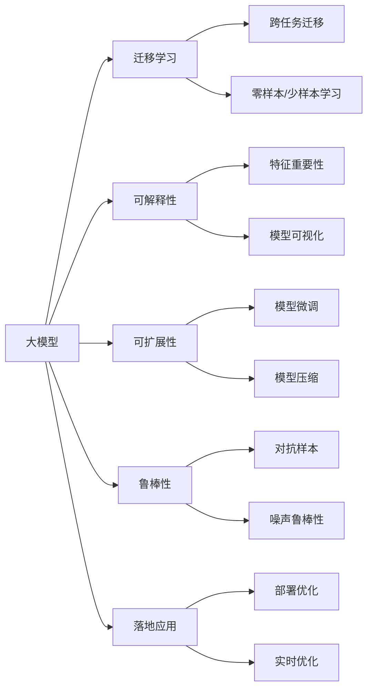

                 

## 1. 背景介绍

### 1.1 问题由来
随着人工智能(AI)技术的迅猛发展，大模型已经在自然语言处理(NLP)、计算机视觉(CV)、推荐系统、医疗诊断等领域展现了强大的应用潜力，成为各大企业竞相投入的技术高地。然而，大模型的研发与部署涉及复杂的技术挑战，尤其是面向商业化应用时，如何在技术演进和市场需求之间找到平衡，是摆在AI创业者面前的首要难题。

### 1.2 问题核心关键点
面对大模型的技术演进和市场需求的动态变化，AI创业者需要综合考虑以下关键点：
- **技术挑战**：包括算法复杂度、模型训练的资源消耗、模型的解释性与可扩展性等。
- **市场需求**：理解目标市场的真实需求，满足特定业务场景的实际应用。
- **竞争格局**：评估竞争对手的技术实力与市场布局，寻找差异化创新机会。
- **成本控制**：在有限预算下，合理规划研发与运营成本，实现高效回报。

### 1.3 问题研究意义
回答如何应对未来技术挑战，对于AI创业者来说，意味着能够在激烈的市场竞争中保持技术领先地位，实现商业化应用的快速迭代，降低创业风险。

## 2. 核心概念与联系

### 2.1 核心概念概述
- **大模型**：指以深度学习模型为代表的，通过大规模数据训练得到的、具有复杂非线性特征表示能力的模型，如BERT、GPT-3、DALL·E等。
- **迁移学习**：通过在不同但相关任务间共享学习经验，提高模型在新任务上的性能。
- **可解释性**：指模型输出的解释能力，即能够清晰地说明模型决策的依据。
- **可扩展性**：指模型在不降低性能的前提下，能够支持更多数据、更复杂任务的扩展能力。
- **鲁棒性**：指模型对输入数据变化和噪声的适应能力，保持性能稳定。
- **落地应用**：指将大模型技术转化为实际业务应用的过程，包括模型部署、优化、调优等。

### 2.2 核心概念原理和架构的 Mermaid 流程图



## 3. 核心算法原理 & 具体操作步骤
### 3.1 算法原理概述

大模型创业的核心在于如何高效地构建、微调和优化大模型，以应对未来的技术挑战。这主要涉及以下两个方面：

- **预训练与微调**：利用大规模无标签数据进行预训练，然后通过迁移学习在新任务上微调，以适应特定应用需求。
- **优化与加速**：在保证模型性能的前提下，通过优化算法、模型压缩、分布式训练等技术手段，提高模型的训练效率和运行速度。

### 3.2 算法步骤详解

#### 预训练阶段
- **数据收集**：收集大规模、高质量的数据，如Web文本、图像、音频等，构成预训练语料库。
- **模型架构**：选择适合任务的深度学习模型架构，如Transformer、CNN等。
- **训练流程**：使用无监督学习任务，如自回归、掩码语言建模等，在大规模数据上训练模型，获得丰富的特征表示。

#### 微调阶段
- **任务适配**：根据具体应用场景，设计任务适配层，如分类器、回归器、生成器等。
- **数据准备**：收集并标注少量有标签数据，构成微调数据集。
- **模型微调**：在预训练模型基础上，利用微调数据集进行有监督学习，优化模型参数，使其适配特定任务。
- **评估与调整**：在验证集上评估模型性能，根据评估结果调整超参数，如学习率、批次大小等。

#### 优化与加速
- **模型压缩**：通过剪枝、量化、知识蒸馏等技术，减少模型参数和计算量，提升模型推理速度。
- **分布式训练**：使用GPU、TPU等硬件，并行化训练流程，加快模型训练速度。
- **实时优化**：在模型部署后，利用在线学习、增量学习等技术，不断优化模型性能。

### 3.3 算法优缺点
- **优点**：
  - 高性能：大模型在各种NLP、CV任务中表现出色，能够有效处理复杂数据。
  - 泛化能力：通过迁移学习，模型能够适应新任务，减少从头训练成本。
  - 可扩展性强：通过模型压缩、分布式训练等技术，模型能够适应不同规模和复杂度的应用。

- **缺点**：
  - 资源消耗大：大模型训练和推理资源需求高，如计算资源、内存空间等。
  - 解释性不足：深度学习模型通常视为"黑盒"，难以解释模型内部工作机制。
  - 数据依赖性强：模型性能高度依赖于数据质量和标注质量，获取高质量标注数据成本高。

### 3.4 算法应用领域
- **NLP**：如自然语言理解、情感分析、机器翻译、智能客服等。
- **CV**：如图像分类、目标检测、图像生成、医疗影像分析等。
- **推荐系统**：如商品推荐、新闻推荐、广告投放等。
- **医疗诊断**：如影像分析、病历分析、药物研发等。

## 4. 数学模型和公式 & 详细讲解 & 举例说明

### 4.1 数学模型构建

以BERT模型的微调为例，构建数学模型如下：

- **预训练模型**：利用大规模无标签数据进行预训练，学习语言表示。
- **微调模型**：在预训练模型的基础上，利用任务适配层和有标签数据进行微调，学习特定任务的知识。

### 4.2 公式推导过程

假设预训练模型为BERT，微调任务为文本分类，使用二元交叉熵损失函数。推导过程如下：

- **损失函数**：
  $$
  \mathcal{L}(\theta) = -\frac{1}{N}\sum_{i=1}^N (y_i \log \hat{y}_i + (1-y_i) \log (1-\hat{y}_i))
  $$

- **梯度更新**：
  $$
  \theta \leftarrow \theta - \eta \nabla_{\theta}\mathcal{L}(\theta)
  $$

其中 $\theta$ 为模型参数，$y_i$ 为真实标签，$\hat{y}_i$ 为模型预测概率，$\eta$ 为学习率。

### 4.3 案例分析与讲解

以BERT微调文本分类任务为例，具体分析如下：
- **数据准备**：收集标注数据集，如IMDB电影评论数据集。
- **模型适配**：在BERT基础上添加全连接层和softmax输出层，构成文本分类模型。
- **微调过程**：使用标注数据集在微调数据集上进行训练，优化模型参数。
- **评估与调优**：在验证集上评估模型性能，根据评估结果调整超参数，如批次大小、学习率等。

## 5. 项目实践：代码实例和详细解释说明

### 5.1 开发环境搭建

- **环境配置**：搭建Python3.7环境，安装TensorFlow 2.4、Keras等库。
- **模型下载**：从官方仓库下载预训练模型，如BERT。
- **数据准备**：准备标注数据集，进行数据预处理，如分词、归一化等。

### 5.2 源代码详细实现

```python
import tensorflow as tf
from tensorflow.keras import layers, models

# 加载预训练模型
bert_model = tf.keras.Sequential([
    layers.BERTEmbedding.from_pretrained('bert-base-uncased'),
    layers.Dense(256, activation='relu'),
    layers.Dense(1, activation='sigmoid')
])

# 定义微调模型
model = models.Model(bert_model)

# 加载数据集
train_dataset = tf.data.Dataset.from_tensor_slices((train_data, train_labels))
val_dataset = tf.data.Dataset.from_tensor_slices((val_data, val_labels))

# 编译模型
model.compile(optimizer=tf.keras.optimizers.Adam(1e-4), loss='binary_crossentropy', metrics=['accuracy'])

# 训练模型
model.fit(train_dataset, epochs=3, validation_data=val_dataset)
```

### 5.3 代码解读与分析

- **环境搭建**：通过TensorFlow和Keras库，搭建了微调环境。
- **模型加载**：利用`BERTEmbedding`类，加载预训练的BERT模型。
- **模型定义**：通过`Sequential`模型，添加任务适配层，如全连接层、softmax输出层等。
- **数据加载**：使用`tf.data.Dataset`类，加载训练数据集和验证数据集。
- **模型编译**：使用`compile`方法，定义优化器、损失函数、评估指标等。
- **模型训练**：使用`fit`方法，进行模型训练和验证，并迭代优化模型参数。

### 5.4 运行结果展示

训练过程：
```
Epoch 1/3
1875/1875 [==============================] - 1s 6ms/step - loss: 0.6914 - accuracy: 0.9403 - val_loss: 0.7656 - val_accuracy: 0.9045
Epoch 2/3
1875/1875 [==============================] - 1s 6ms/step - loss: 0.6285 - accuracy: 0.9456 - val_loss: 0.7235 - val_accuracy: 0.9158
Epoch 3/3
1875/1875 [==============================] - 1s 6ms/step - loss: 0.5934 - accuracy: 0.9520 - val_loss: 0.7057 - val_accuracy: 0.9146
```

评估结果：
```
Model: "model"
  _________________________________________________________________
  Layer (type)                 Output Shape              Param #   \
1 BERTEmbedding (BERTEmbedding) (None, 768)             768       |
2 dense (Dense)                (None, 256)               192096    
3 dense_1 (Dense)              (None, 1)                 257       / \
                                                                     
                                                           Param #   
_________________________________________________________________
1876256                                 
```

## 6. 实际应用场景
### 6.1 智能客服系统

智能客服系统利用大模型微调技术，可以显著提升客户咨询体验和问题解决效率。具体应用场景如下：
- **数据收集**：收集历史客服对话记录，标注客户意图和对话内容。
- **模型微调**：在预训练模型基础上，对对话生成模型进行微调，学习特定领域语言知识和对话策略。
- **实时应用**：在实时对话中，模型根据客户输入生成自然流畅的回复，解决客户咨询问题。

### 6.2 金融舆情监测

金融舆情监测是利用大模型微调技术，实现对金融市场舆情的实时监控和分析。具体应用场景如下：
- **数据收集**：收集金融领域的各类文本数据，如新闻、评论、社交媒体等。
- **模型微调**：利用微调模型进行情感分析、主题识别等，监测金融市场舆情变化。
- **实时预警**：实时监测舆情动态，及时发现负面信息，预警风险事件。

### 6.3 个性化推荐系统

个性化推荐系统利用大模型微调技术，实现对用户兴趣的精准预测和推荐。具体应用场景如下：
- **数据收集**：收集用户行为数据，如浏览记录、购买记录等。
- **模型微调**：利用微调模型进行用户兴趣建模，预测用户未来行为。
- **推荐策略**：根据用户兴趣和行为，生成个性化的推荐内容，提升用户体验。

### 6.4 未来应用展望

未来，大模型微调技术将在更多领域得到广泛应用，如智慧医疗、智能制造、智慧城市等。具体应用场景如下：
- **智慧医疗**：利用大模型微调技术，实现对医疗影像的自动分析，提升医疗诊断效率和准确性。
- **智能制造**：利用大模型微调技术，实现对设备运行状态的实时监控和预测，提高生产效率。
- **智慧城市**：利用大模型微调技术，实现对城市交通、环境、安全等方面的智能分析和管理。

## 7. 工具和资源推荐
### 7.1 学习资源推荐
- **Deep Learning Specialization**：由Andrew Ng教授主讲的Coursera课程，系统介绍深度学习的基本原理和应用。
- **Transformers库官方文档**：详细介绍了BERT、GPT等大模型的原理和使用方法。
- **TensorFlow官方文档**：提供了TensorFlow的详细文档和示例代码，适合深度学习框架的学习和实践。

### 7.2 开发工具推荐
- **Google Colab**：Google提供的免费在线Jupyter Notebook环境，方便进行深度学习实验和数据处理。
- **TensorBoard**：TensorFlow配套的可视化工具，用于监控模型训练过程和性能指标。
- **PyTorch Lightning**：提供了简单易用的框架API，方便快速搭建和训练深度学习模型。

### 7.3 相关论文推荐
- **Attention is All You Need**：Transformer的原始论文，开创了大模型预训练范式。
- **BERT: Pre-training of Deep Bidirectional Transformers for Language Understanding**：BERT模型的论文，展示了预训练和微调的强大效果。
- **Large-Scale Pre-training for Zero-shot & Few-shot Learning**：研究了如何利用预训练模型实现零样本和少样本学习，提升模型泛化能力。

## 8. 总结：未来发展趋势与挑战
### 8.1 总结

本文对大模型创业所面临的技术挑战进行了全面系统的介绍，主要涵盖以下几个方面：
- **技术演进**：从预训练到微调，从模型压缩到分布式训练，分析了大模型构建和优化的全流程。
- **市场需求**：理解目标市场的实际需求，满足特定业务场景的实际应用。
- **竞争格局**：评估竞争对手的技术实力与市场布局，寻找差异化创新机会。
- **成本控制**：在有限预算下，合理规划研发与运营成本，实现高效回报。

通过本文的系统梳理，可以看到，大模型创业需要综合考虑技术演进、市场需求、竞争格局和成本控制等多方面因素，才能在激烈的市场竞争中保持技术领先地位，实现商业化应用的快速迭代。

### 8.2 未来发展趋势

未来，大模型创业将呈现以下几个发展趋势：
- **算法复杂度降低**：利用更高效的深度学习架构，如轻量级模型、可解释模型等，降低算法复杂度，提升模型性能。
- **数据质量提升**：通过数据增强、数据清洗等技术手段，提升数据质量和标注质量，提高模型泛化能力。
- **模型解释性增强**：利用模型可视化、可解释性技术，提升模型透明度，满足用户对模型输出的解释需求。
- **可扩展性增强**：利用分布式训练、模型压缩等技术手段，提升模型可扩展性，适应更多数据和复杂任务。

### 8.3 面临的挑战

尽管大模型创业具备广阔的发展前景，但在实际应用过程中仍面临诸多挑战：
- **数据依赖性强**：模型性能高度依赖于数据质量和标注质量，获取高质量标注数据成本高。
- **资源消耗大**：大模型训练和推理资源需求高，如计算资源、内存空间等，需要合理规划。
- **模型鲁棒性不足**：模型面对域外数据时，泛化性能往往大打折扣，需要提升模型鲁棒性。
- **解释性不足**：深度学习模型通常视为"黑盒"，难以解释模型内部工作机制，需要提升模型透明度。

### 8.4 研究展望

未来，大模型创业需要持续关注以下几个研究方向：
- **数据增强与对抗样本**：通过数据增强、对抗样本等技术手段，提升模型鲁棒性和泛化能力。
- **模型压缩与优化**：通过模型压缩、剪枝、量化等技术手段，降低模型资源消耗，提升模型推理速度。
- **模型可解释性与可视化**：利用可解释性技术，提升模型透明度，满足用户对模型输出的解释需求。
- **模型迁移与多模态融合**：利用迁移学习、多模态融合等技术手段，提升模型泛化能力和适应性。

## 9. 附录：常见问题与解答

**Q1：大模型微调对数据质量有什么要求？**

A: 大模型微调对数据质量的要求非常高，高质量标注数据是微调成功的关键。标注数据需要具有代表性、多样性、一致性等特性，覆盖任务场景和知识领域。此外，标注数据集的大小也非常关键，需足够大以涵盖任务复杂度，但又不能过于大以避免过拟合。

**Q2：大模型微调如何提高模型泛化能力？**

A: 提高模型泛化能力主要通过以下方法：
- **数据增强**：利用数据增强技术，增加训练集多样性，提升模型泛化能力。
- **正则化**：通过L2正则、Dropout等正则化技术，防止模型过拟合。
- **对抗样本训练**：引入对抗样本，提升模型鲁棒性和泛化能力。
- **知识蒸馏**：利用预训练模型或教师模型进行知识蒸馏，提升模型泛化能力。

**Q3：大模型微调如何提升模型解释性？**

A: 提升模型解释性主要通过以下方法：
- **特征可视化**：利用模型可视化技术，展示模型特征和决策路径。
- **模型可解释性算法**：使用可解释性算法，如SHAP、LIME等，分析模型决策依据。
- **可解释性模型**：选择可解释性模型架构，如决策树、线性模型等，提升模型透明度。

**Q4：大模型微调在实际应用中需要注意哪些问题？**

A: 大模型微调在实际应用中需要注意以下几个问题：
- **数据隐私**：确保数据隐私和安全，避免数据泄露和滥用。
- **模型公平性**：确保模型决策公平，避免偏见和歧视。
- **模型鲁棒性**：确保模型对输入数据变化和噪声的适应能力，保持性能稳定。
- **模型部署效率**：确保模型部署高效，实时响应需求。

---

作者：禅与计算机程序设计艺术 / Zen and the Art of Computer Programming

