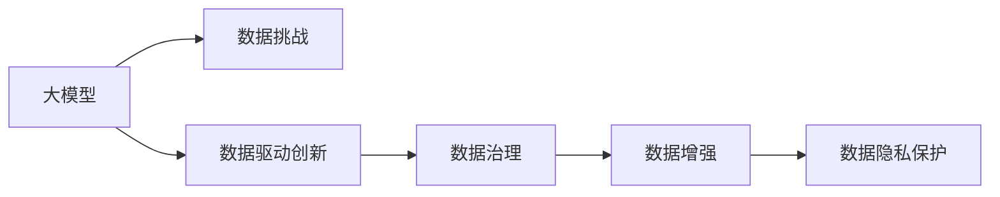

                 

# AI大模型创业：如何应对未来数据挑战？

> 关键词：AI大模型,数据挑战,创业策略,数据收集,数据标注,数据清洗,数据增强,数据隐私保护,数据驱动创新

## 1. 背景介绍

### 1.1 问题由来

随着人工智能技术的飞速发展，大模型（如BERT、GPT-3等）在自然语言处理（NLP）、计算机视觉（CV）、语音识别（ASR）等领域取得了卓越的成果，这些模型的核心依赖在于大量高质量的数据进行训练和微调。然而，随着数据量的激增，企业在数据收集、标注、清洗、存储等方面面临了巨大的挑战。这些问题直接制约了AI大模型创业公司的扩张速度和技术突破，尤其是在数据驱动的创新型领域。

### 1.2 问题核心关键点

数据是AI大模型的生命线，但数据收集、标注和清洗成本高、周期长，且质量难以保证。这些问题在大模型创业公司中尤为突出，直接影响模型的训练效率和效果。解决数据挑战是创业公司迈向成功的重要一步。

## 2. 核心概念与联系

### 2.1 核心概念概述

为更好地理解数据在大模型创业中的重要性及其相关挑战，本节将介绍几个核心概念：

- **大模型(Large Model)**：指参数量巨大、训练数据量庞大的深度学习模型，例如BERT、GPT-3、ViT等。这些模型通常需要海量数据进行预训练和微调，以获取高水平的泛化能力和应用性能。

- **数据挑战(Data Challenges)**：包括数据收集、标注、清洗、存储、传输和隐私保护等，这些环节直接影响大模型的训练效果和应用性能。数据质量不高或数据量不足都会显著影响模型性能。

- **数据驱动创新(Data-Driven Innovation)**：指利用数据进行模型训练和优化，进而推动技术创新和应用发展的过程。在大模型创业中，数据驱动创新是关键驱动力。

- **数据治理(Data Governance)**：指对数据进行系统性的管理，包括数据的质量、来源、权限和合规性等，确保数据在高质量和合法性的基础上得到有效利用。

- **数据增强(Data Augmentation)**：指通过对原始数据进行变换和扩充，生成更多样化的训练样本，以提升模型的泛化能力。

- **数据隐私保护(Data Privacy Protection)**：指在数据收集、存储和使用过程中，采取措施保护用户的隐私信息，避免数据泄露和滥用。

这些核心概念通过以下Mermaid流程图来展示：



这个流程图展示了数据在大模型创业中的重要性及其关联的概念，即数据挑战是基础，数据治理是保障，数据增强是方法，数据隐私保护是原则，而数据驱动创新则是最终目标。

## 3. 核心算法原理 & 具体操作步骤

### 3.1 算法原理概述

大模型创业的核心在于如何高效地收集、标注和利用高质量的数据。这一过程本质上是一个多阶段的数据治理和增强过程，需要通过系统化的管理和优化技术，确保数据的质量和多样性。

大模型的训练通常涉及以下几个步骤：

1. **数据收集**：从多个渠道（如公开数据集、用户数据、第三方数据提供商等）收集大量样本。
2. **数据标注**：对收集到的数据进行标注，生成带有标签的数据集，供模型训练。
3. **数据清洗**：去除噪声和异常数据，确保数据质量和一致性。
4. **数据增强**：通过扩充和变换原始数据，生成更多样化的训练样本。
5. **数据隐私保护**：确保数据在处理和使用过程中，符合隐私保护法规和最佳实践。
6. **数据驱动创新**：利用优化后的数据，训练高质量的大模型，推动业务创新和发展。

### 3.2 算法步骤详解

以下是具体的算法步骤：

#### 3.2.1 数据收集

- **数据源选择**：评估和选择合适的数据源，确保数据的丰富性和多样性。
- **数据质量评估**：对数据源进行质量评估，选择优质数据。
- **数据整合**：将来自不同来源的数据整合到一个统一的格式和结构中，方便后续处理。

#### 3.2.2 数据标注

- **标注策略设计**：根据任务需求设计合理的标注策略，包括标注类型、标注质量等。
- **标注工具选择**：选择或开发高效的标注工具，提升标注效率和准确性。
- **标注团队管理**：组织和培训标注团队，确保标注质量和一致性。

#### 3.2.3 数据清洗

- **异常值检测**：通过统计和机器学习方法，检测和去除异常值和噪声。
- **数据一致性检查**：确保数据格式、标注等一致性，避免数据错误。
- **数据去重**：去除重复数据，减少冗余，提高数据效率。

#### 3.2.4 数据增强

- **数据扩充**：通过扩充、合成、变换等方法，生成新的训练样本。
- **数据变换**：使用图像旋转、截断、平移等方法，变换数据结构。
- **数据重采样**：对数据进行重采样，平衡数据分布。

#### 3.2.5 数据隐私保护

- **隐私保护技术**：采用加密、匿名化、差分隐私等技术，保护数据隐私。
- **合规管理**：确保数据处理符合GDPR、CCPA等隐私保护法规和最佳实践。
- **数据使用审计**：建立数据使用审计机制，监控数据使用情况。

#### 3.2.6 数据驱动创新

- **模型训练**：使用优化后的数据，训练高质量的大模型。
- **模型评估**：通过测试集评估模型性能，确保模型效果。
- **模型优化**：根据评估结果，优化模型参数和架构，提升模型性能。
- **应用集成**：将训练好的模型集成到业务系统中，推动业务创新和发展。

### 3.3 算法优缺点

**优点**：

1. **提升模型性能**：高质量、多样化的数据训练，可以显著提升大模型的泛化能力和应用效果。
2. **加速模型开发**：数据收集和标注自动化，可以大幅缩短模型训练周期，加速模型开发。
3. **降低成本**：系统化的数据管理和优化技术，可以降低数据处理和标注成本。
4. **保障数据隐私**：通过隐私保护技术，确保数据在使用过程中不泄露用户隐私。

**缺点**：

1. **数据收集难度大**：高质量的数据源有限，特别是特定领域和场景的数据收集更加困难。
2. **标注成本高**：高质量标注需要人工参与，成本高，周期长。
3. **数据清洗复杂**：数据质量参差不齐，清洗过程复杂且耗时。
4. **隐私保护难度大**：隐私保护技术复杂，需要专业知识和技能。

### 3.4 算法应用领域

基于数据挑战的大模型创业，已经广泛应用于多个领域，例如：

- **自然语言处理**：利用文本数据训练语言模型，如BERT、GPT等。
- **计算机视觉**：利用图像数据训练图像识别和分类模型，如ResNet、ViT等。
- **语音识别**：利用音频数据训练语音识别和语音合成模型，如Wav2Vec2等。
- **推荐系统**：利用用户行为数据训练推荐模型，提升推荐效果。
- **智能客服**：利用用户对话数据训练对话模型，提升客户服务质量。
- **金融风控**：利用交易数据训练风险模型，提高金融风控能力。

## 4. 数学模型和公式 & 详细讲解 & 举例说明

### 4.1 数学模型构建

在AI大模型创业中，数据驱动创新是核心。构建数学模型需要以下几个步骤：

1. **数据表示**：将数据表示为向量或矩阵形式，方便进行计算和处理。
2. **模型选择**：根据任务需求选择合适的模型结构，如神经网络、卷积神经网络（CNN）、循环神经网络（RNN）等。
3. **模型训练**：通过反向传播算法优化模型参数，最小化损失函数，提升模型效果。
4. **模型评估**：通过测试集评估模型性能，确保模型效果。

以文本分类为例，其数学模型可以表示为：

$$
y = f(x; \theta)
$$

其中，$y$为分类结果，$x$为输入数据，$f$为模型函数，$\theta$为模型参数。

### 4.2 公式推导过程

以文本分类为例，模型函数的推导如下：

$$
f(x; \theta) = softmax(Wx + b)
$$

其中，$W$和$b$为模型参数，$x$为输入向量，$softmax$函数用于将输出转化为概率分布。

### 4.3 案例分析与讲解

以BERT模型为例，其预训练过程可以表示为：

$$
M_{\theta}(x) = \text{BERT}_{\theta}(x)
$$

其中，$M_{\theta}$为BERT模型，$x$为输入文本，$\theta$为模型参数。

在微调过程中，目标函数为：

$$
\mathcal{L}(\theta) = \frac{1}{N} \sum_{i=1}^N \ell(M_{\theta}(x_i), y_i)
$$

其中，$\ell$为损失函数，$y_i$为真实标签。

## 5. 项目实践：代码实例和详细解释说明

### 5.1 开发环境搭建

在进行数据驱动创新项目开发前，我们需要准备好开发环境。以下是使用Python进行PyTorch开发的环境配置流程：

1. 安装Anaconda：从官网下载并安装Anaconda，用于创建独立的Python环境。
2. 创建并激活虚拟环境：
```bash
conda create -n pytorch-env python=3.8 
conda activate pytorch-env
```
3. 安装PyTorch：根据CUDA版本，从官网获取对应的安装命令。例如：
```bash
conda install pytorch torchvision torchaudio cudatoolkit=11.1 -c pytorch -c conda-forge
```
4. 安装Transformers库：
```bash
pip install transformers
```
5. 安装各类工具包：
```bash
pip install numpy pandas scikit-learn matplotlib tqdm jupyter notebook ipython
```

完成上述步骤后，即可在`pytorch-env`环境中开始项目开发。

### 5.2 源代码详细实现

这里我们以BERT模型为例，给出使用Transformers库进行数据驱动创新项目开发的PyTorch代码实现。

首先，定义数据处理函数：

```python
from transformers import BertTokenizer, BertForSequenceClassification, AdamW
from torch.utils.data import DataLoader, Dataset
import torch

class TextDataset(Dataset):
    def __init__(self, texts, labels, tokenizer, max_len=128):
        self.texts = texts
        self.labels = labels
        self.tokenizer = tokenizer
        self.max_len = max_len
        
    def __len__(self):
        return len(self.texts)
    
    def __getitem__(self, item):
        text = self.texts[item]
        label = self.labels[item]
        
        encoding = self.tokenizer(text, return_tensors='pt', max_length=self.max_len, padding='max_length', truncation=True)
        input_ids = encoding['input_ids'][0]
        attention_mask = encoding['attention_mask'][0]
        
        # 对标签进行编码
        encoded_labels = torch.tensor(label, dtype=torch.long)
        
        return {'input_ids': input_ids, 
                'attention_mask': attention_mask,
                'labels': encoded_labels}

# 数据准备
tokenizer = BertTokenizer.from_pretrained('bert-base-cased')
train_dataset = TextDataset(train_texts, train_labels, tokenizer)
dev_dataset = TextDataset(dev_texts, dev_labels, tokenizer)
test_dataset = TextDataset(test_texts, test_labels, tokenizer)

# 模型选择和初始化
model = BertForSequenceClassification.from_pretrained('bert-base-cased', num_labels=2)
optimizer = AdamW(model.parameters(), lr=2e-5)

# 训练和评估
device = torch.device('cuda') if torch.cuda.is_available() else torch.device('cpu')
model.to(device)

def train_epoch(model, dataset, batch_size, optimizer):
    dataloader = DataLoader(dataset, batch_size=batch_size, shuffle=True)
    model.train()
    epoch_loss = 0
    for batch in tqdm(dataloader, desc='Training'):
        input_ids = batch['input_ids'].to(device)
        attention_mask = batch['attention_mask'].to(device)
        labels = batch['labels'].to(device)
        model.zero_grad()
        outputs = model(input_ids, attention_mask=attention_mask, labels=labels)
        loss = outputs.loss
        epoch_loss += loss.item()
        loss.backward()
        optimizer.step()
    return epoch_loss / len(dataloader)

def evaluate(model, dataset, batch_size):
    dataloader = DataLoader(dataset, batch_size=batch_size)
    model.eval()
    preds, labels = [], []
    with torch.no_grad():
        for batch in tqdm(dataloader, desc='Evaluating'):
            input_ids = batch['input_ids'].to(device)
            attention_mask = batch['attention_mask'].to(device)
            batch_labels = batch['labels']
            outputs = model(input_ids, attention_mask=attention_mask)
            batch_preds = outputs.logits.argmax(dim=1).to('cpu').tolist()
            batch_labels = batch_labels.to('cpu').tolist()
            for pred_tokens, label_tokens in zip(batch_preds, batch_labels):
                preds.append(pred_tokens)
                labels.append(label_tokens)
                
    print(classification_report(labels, preds))

# 训练和评估
epochs = 5
batch_size = 16

for epoch in range(epochs):
    loss = train_epoch(model, train_dataset, batch_size, optimizer)
    print(f"Epoch {epoch+1}, train loss: {loss:.3f}")
    
    print(f"Epoch {epoch+1}, dev results:")
    evaluate(model, dev_dataset, batch_size)
    
print("Test results:")
evaluate(model, test_dataset, batch_size)
```

以上就是使用PyTorch对BERT进行数据驱动创新项目开发的完整代码实现。可以看到，Transformers库提供了便捷的API接口，使得大模型微调的过程更加高效和易于实现。

### 5.3 代码解读与分析

让我们再详细解读一下关键代码的实现细节：

**TextDataset类**：
- `__init__`方法：初始化文本、标签、分词器等关键组件。
- `__len__`方法：返回数据集的样本数量。
- `__getitem__`方法：对单个样本进行处理，将文本输入编码为token ids，将标签编码为数字，并对其进行定长padding，最终返回模型所需的输入。

**模型选择和初始化**：
- 使用BertForSequenceClassification类选择并初始化BERT模型。
- 设置AdamW优化器及其学习率。

**训练和评估函数**：
- 使用DataLoader对数据集进行批次化加载，供模型训练和推理使用。
- 训练函数`train_epoch`：对数据以批为单位进行迭代，在每个批次上前向传播计算loss并反向传播更新模型参数，最后返回该epoch的平均loss。
- 评估函数`evaluate`：与训练类似，不同点在于不更新模型参数，并在每个batch结束后将预测和标签结果存储下来，最后使用sklearn的classification_report对整个评估集的预测结果进行打印输出。

**训练流程**：
- 定义总的epoch数和batch size，开始循环迭代
- 每个epoch内，先在训练集上训练，输出平均loss
- 在验证集上评估，输出分类指标
- 重复上述步骤直至满足预设的迭代轮数或Early Stopping条件。

## 6. 实际应用场景

### 6.1 智能客服系统

数据驱动的智能客服系统，利用客户历史对话记录进行模型训练和微调，提升客服服务质量。通过文本分类和对话生成技术，系统能够自动理解用户意图，匹配最合适的答案模板进行回复。对于新用户的查询，还可以接入检索系统实时搜索相关内容，动态生成最佳回答。

### 6.2 金融舆情监测

数据驱动的金融舆情监测系统，通过收集金融领域相关的新闻、报道、评论等文本数据，对其进行主题标注和情感标注。在此基础上对BERT模型进行微调，使其能够自动判断文本属于何种主题，情感倾向是正面、中性还是负面。系统实时监测不同主题下的情感变化趋势，一旦发现负面信息激增等异常情况，系统便会自动预警，帮助金融机构快速应对潜在风险。

### 6.3 个性化推荐系统

数据驱动的个性化推荐系统，利用用户浏览、点击、评论、分享等行为数据，提取和用户交互的物品标题、描述、标签等文本内容。将文本内容作为模型输入，用户的后续行为（如是否点击、购买等）作为监督信号，在此基础上微调BERT模型。模型能够从文本内容中准确把握用户的兴趣点。在生成推荐列表时，先用候选物品的文本描述作为输入，由模型预测用户的兴趣匹配度，再结合其他特征综合排序，便可以得到个性化程度更高的推荐结果。

### 6.4 未来应用展望

随着数据驱动创新技术的不断进步，基于数据挑战的大模型创业必将在更多领域得到应用，为传统行业带来变革性影响。

在智慧医疗领域，数据驱动的智能问诊系统，利用患者历史病历数据进行模型训练和微调，辅助医生诊疗，提高诊断效率和准确性。

在智能教育领域，数据驱动的个性化学习系统，利用学生学习行为数据进行模型训练和微调，因材施教，促进教育公平，提高教学质量。

在智慧城市治理中，数据驱动的城市事件监测系统，通过收集城市各种传感器数据，分析城市运行状况，优化城市资源配置，提升城市管理水平。

此外，在企业生产、社会治理、文娱传媒等众多领域，数据驱动的AI大模型创业也将不断涌现，为经济社会发展注入新的动力。相信随着技术的日益成熟，数据驱动创新技术将成为人工智能落地应用的重要范式，推动人工智能技术向更广阔的领域加速渗透。

## 7. 工具和资源推荐

### 7.1 学习资源推荐

为了帮助开发者系统掌握数据驱动创新技术的理论基础和实践技巧，这里推荐一些优质的学习资源：

1. 《深度学习与人工智能》系列课程：由知名高校和研究机构提供的深度学习课程，涵盖从基础理论到高级实践的全面内容。
2. Kaggle：数据科学和机器学习的竞赛平台，提供大量高质量的公开数据集和代码资源，可以练手实践。
3. PyTorch官方文档：PyTorch官方提供的详细文档和教程，适合初学者和进阶者使用。
4. HuggingFace官方文档：Transformers库的官方文档，提供了海量预训练模型和微调样例代码，是入门和实践的最佳资料。
5. DataRobot：面向商业应用的数据科学平台，提供自动化的数据处理和模型训练服务，适合企业开发者使用。

通过对这些资源的学习实践，相信你一定能够快速掌握数据驱动创新的精髓，并用于解决实际的业务问题。

### 7.2 开发工具推荐

高效的开发离不开优秀的工具支持。以下是几款用于数据驱动创新项目开发的常用工具：

1. PyTorch：基于Python的开源深度学习框架，灵活动态的计算图，适合快速迭代研究。大部分预训练语言模型都有PyTorch版本的实现。
2. TensorFlow：由Google主导开发的开源深度学习框架，生产部署方便，适合大规模工程应用。同样有丰富的预训练语言模型资源。
3. Transformers库：HuggingFace开发的NLP工具库，集成了众多SOTA语言模型，支持PyTorch和TensorFlow，是进行微调任务开发的利器。
4. Weights & Biases：模型训练的实验跟踪工具，可以记录和可视化模型训练过程中的各项指标，方便对比和调优。与主流深度学习框架无缝集成。
5. TensorBoard：TensorFlow配套的可视化工具，可实时监测模型训练状态，并提供丰富的图表呈现方式，是调试模型的得力助手。

合理利用这些工具，可以显著提升数据驱动创新项目的开发效率，加快创新迭代的步伐。

### 7.3 相关论文推荐

数据驱动创新技术的发展源于学界的持续研究。以下是几篇奠基性的相关论文，推荐阅读：

1. Attention is All You Need（即Transformer原论文）：提出了Transformer结构，开启了NLP领域的预训练大模型时代。
2. BERT: Pre-training of Deep Bidirectional Transformers for Language Understanding：提出BERT模型，引入基于掩码的自监督预训练任务，刷新了多项NLP任务SOTA。
3. Data Augmentation in AI：探讨了数据增强技术在AI中的应用，包括图像增强、文本增强等，提升了模型泛化能力。
4. Privacy-Preserving Deep Learning：介绍了隐私保护技术在深度学习中的应用，确保数据在处理和使用过程中不泄露用户隐私。
5. Model Distillation：介绍了模型蒸馏技术，通过知识转移优化模型训练，减少数据需求和计算量。

这些论文代表了大模型数据驱动创新技术的发展脉络。通过学习这些前沿成果，可以帮助研究者把握学科前进方向，激发更多的创新灵感。

## 8. 总结：未来发展趋势与挑战

### 8.1 总结

本文对基于数据挑战的大模型创业方法进行了全面系统的介绍。首先阐述了数据驱动创新在大模型创业中的重要性及其相关挑战，明确了数据驱动创新在大模型创业中的核心价值。其次，从原理到实践，详细讲解了数据驱动创新的数学原理和关键步骤，给出了数据驱动创新项目开发的完整代码实例。同时，本文还广泛探讨了数据驱动创新技术在智能客服、金融舆情、个性化推荐等多个行业领域的应用前景，展示了数据驱动创新的巨大潜力。此外，本文精选了数据驱动创新的各类学习资源，力求为读者提供全方位的技术指引。

通过本文的系统梳理，可以看到，数据驱动创新技术在大模型创业中扮演着关键角色，极大地拓展了预训练语言模型的应用边界，催生了更多的落地场景。受益于高质量数据和系统化的方法，大模型创业公司可以更快地构建高性能的AI系统，推动业务创新和发展。未来，伴随数据驱动创新技术的不断演进，基于大模型的AI应用必将在更多领域大放异彩，深刻影响人类的生产生活方式。

### 8.2 未来发展趋势

展望未来，数据驱动创新技术将呈现以下几个发展趋势：

1. 数据收集自动化。自动数据收集和标注技术不断进步，使得大模型训练所需的数据量大幅降低。
2. 数据治理智能化。数据治理工具和平台不断优化，使得数据管理更加高效、自动化。
3. 数据增强多样化。数据增强技术不断发展，使得模型训练数据更加多样化、丰富化。
4. 数据隐私保护严密化。隐私保护技术不断提升，确保数据在处理和使用过程中不泄露用户隐私。
5. 数据驱动创新泛化化。数据驱动创新技术不断扩展，覆盖更多领域和应用场景。

以上趋势凸显了数据驱动创新技术的广阔前景。这些方向的探索发展，必将进一步提升大模型系统的性能和应用范围，为构建人机协同的智能时代提供新的技术路径。

### 8.3 面临的挑战

尽管数据驱动创新技术已经取得了显著成效，但在迈向更加智能化、普适化应用的过程中，它仍面临诸多挑战：

1. 数据收集瓶颈。虽然数据收集自动化技术不断进步，但高质量数据源仍然有限，特别是在特定领域和场景下。如何高效、低成本地获取高质量数据，是一个重要挑战。
2. 数据标注难度大。高质量标注需要人工参与，成本高，周期长。如何提高标注效率和质量，是一个需要解决的问题。
3. 数据清洗复杂。数据质量参差不齐，清洗过程复杂且耗时。如何自动化数据清洗，是一个重要的研究方向。
4. 隐私保护难度大。隐私保护技术复杂，需要专业知识和技能。如何在保障隐私的同时，利用数据驱动创新，是一个重要挑战。
5. 数据驱动创新效果不稳定。数据驱动创新效果受数据质量和数量影响较大，如何提高数据驱动创新效果稳定性，是一个重要的研究方向。

正视数据驱动创新面临的这些挑战，积极应对并寻求突破，将是大模型数据驱动创新技术走向成熟的必由之路。相信随着学界和产业界的共同努力，这些挑战终将一一被克服，数据驱动创新技术必将在构建安全、可靠、可解释、可控的智能系统铺平道路。

### 8.4 研究展望

面向未来，数据驱动创新技术需要在以下几个方面寻求新的突破：

1. 探索无监督和半监督数据驱动创新方法。摆脱对大规模标注数据的依赖，利用自监督学习、主动学习等无监督和半监督范式，最大限度利用非结构化数据，实现更加灵活高效的数据驱动创新。
2. 研究数据驱动创新效果提升方法。通过数据增强、数据清洗、数据重采样等技术，提高数据驱动创新效果，优化模型性能。
3. 引入更多先验知识。将符号化的先验知识，如知识图谱、逻辑规则等，与神经网络模型进行巧妙融合，引导数据驱动创新过程学习更准确、合理的语言模型。
4. 融合因果分析和博弈论工具。将因果分析方法引入数据驱动创新模型，识别出模型决策的关键特征，增强输出解释的因果性和逻辑性。借助博弈论工具刻画人机交互过程，主动探索并规避模型的脆弱点，提高系统稳定性。
5. 纳入伦理道德约束。在数据驱动创新目标中引入伦理导向的评估指标，过滤和惩罚有偏见、有害的输出倾向。同时加强人工干预和审核，建立模型行为的监管机制，确保输出符合人类价值观和伦理道德。

这些研究方向的探索，必将引领数据驱动创新技术迈向更高的台阶，为构建安全、可靠、可解释、可控的智能系统铺平道路。面向未来，数据驱动创新技术还需要与其他人工智能技术进行更深入的融合，如知识表示、因果推理、强化学习等，多路径协同发力，共同推动自然语言理解和智能交互系统的进步。只有勇于创新、敢于突破，才能不断拓展语言模型的边界，让智能技术更好地造福人类社会。

## 9. 附录：常见问题与解答

**Q1：数据驱动创新技术是否适用于所有AI大模型？**

A: 数据驱动创新技术适用于大多数AI大模型，特别是那些依赖于大量数据进行训练和微调的模型。但对于一些需要高精度、高效率的模型，可能需要结合其他优化方法，如知识蒸馏、模型剪枝等，以提高模型性能和效率。

**Q2：数据驱动创新技术在应用过程中如何平衡数据质量和数据量？**

A: 数据驱动创新技术需要高质量的数据来训练模型，但数据量不足也会影响模型性能。平衡数据质量和数据量的方法包括：
1. 数据增强：通过扩充和变换原始数据，生成更多样化的训练样本，提高模型泛化能力。
2. 数据清洗：去除噪声和异常数据，确保数据质量和一致性。
3. 数据重采样：对数据进行重采样，平衡数据分布。
4. 数据混合：结合多种数据源，提高数据多样性。

**Q3：如何提高数据驱动创新技术的稳定性和泛化能力？**

A: 提高数据驱动创新技术的稳定性和泛化能力，可以采取以下措施：
1. 数据增强：生成更多样化的训练样本，提高模型泛化能力。
2. 数据清洗：去除噪声和异常数据，确保数据质量和一致性。
3. 数据重采样：对数据进行重采样，平衡数据分布。
4. 数据混合：结合多种数据源，提高数据多样性。
5. 数据蒸馏：通过知识转移优化模型训练，减少数据需求和计算量。
6. 模型优化：通过超参数调优、模型剪枝等技术，提高模型性能和效率。

**Q4：数据驱动创新技术在实际应用中需要注意哪些问题？**

A: 数据驱动创新技术在实际应用中需要注意以下问题：
1. 数据收集难度大：高质量的数据源有限，特别是特定领域和场景下。如何高效、低成本地获取高质量数据，是一个重要挑战。
2. 数据标注成本高：高质量标注需要人工参与，成本高，周期长。如何提高标注效率和质量，是一个需要解决的问题。
3. 数据清洗复杂：数据质量参差不齐，清洗过程复杂且耗时。如何自动化数据清洗，是一个重要的研究方向。
4. 隐私保护难度大：隐私保护技术复杂，需要专业知识和技能。如何在保障隐私的同时，利用数据驱动创新，是一个重要挑战。
5. 数据驱动创新效果不稳定：数据驱动创新效果受数据质量和数量影响较大，如何提高数据驱动创新效果稳定性，是一个重要的研究方向。

这些问题的解决，将是大模型数据驱动创新技术走向成熟的必由之路。相信随着学界和产业界的共同努力，这些挑战终将一一被克服，数据驱动创新技术必将在构建安全、可靠、可解释、可控的智能系统铺平道路。

---

作者：禅与计算机程序设计艺术 / Zen and the Art of Computer Programming

