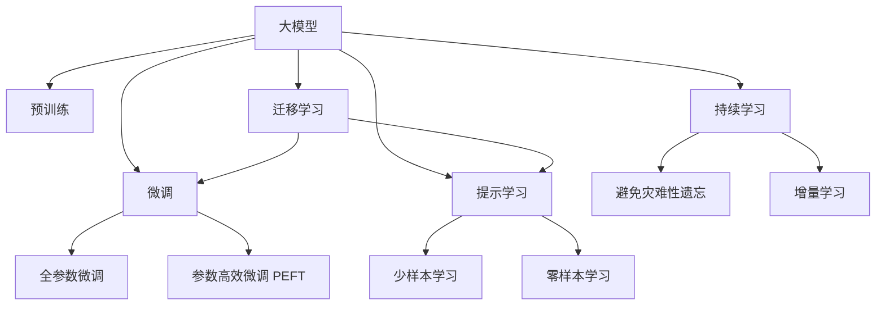

                 

## 1. 背景介绍

在人工智能（AI）技术的驱动下，大模型（Big Models）正迅速崛起，成为AI创业领域的新风口。大模型以其强大的泛化能力和多任务处理能力，展示了显著的性能优势。但同时，也面临着激烈的市场竞争和复杂的技术挑战。本文旨在探讨大模型创业的战略与策略，为创业者提供实用的指导。

## 2. 核心概念与联系

### 2.1 核心概念概述

为更好地理解大模型创业的战略与策略，本节将介绍几个密切相关的核心概念：

- **大模型（Big Models）**：指采用先进深度学习架构（如Transformer）训练的大量参数模型，如BERT、GPT、T5等。大模型通过在海量数据上进行预训练，具备强大的学习能力。

- **预训练（Pre-training）**：指在大规模无标签数据上进行自监督训练，学习通用的语言或图像表示。预训练为模型提供了强大的初始化权重。

- **微调（Fine-tuning）**：指在大模型基础上，通过有监督训练优化模型在特定任务上的性能。微调常用于自然语言处理（NLP）、计算机视觉（CV）等任务。

- **迁移学习（Transfer Learning）**：利用预训练模型的知识，在特定任务上进行微调，提升模型性能。

- **参数高效微调（Parameter-Efficient Fine-tuning, PEFT）**：通过只更新部分参数，提升微调效率，减少过拟合。

- **提示学习（Prompt Learning）**：通过精心设计输入模板，引导模型输出特定结果，减少微调参数。

- **少样本学习（Few-shot Learning）**：在少数标注样本情况下，模型仍能学习并准确分类。

- **零样本学习（Zero-shot Learning）**：无需任何标注样本，模型能根据任务描述生成答案。

- **持续学习（Continual Learning）**：模型能持续从新数据中学习，避免遗忘旧知识。

这些概念之间的逻辑关系可以通过以下Mermaid流程图来展示：



### 2.2 核心概念原理和架构

大模型创业的基石是大模型的构建和优化。以下为大模型和微调的核心算法原理：

**大模型构建：**

- **预训练步骤**：
  1. **数据准备**：获取大规模无标签数据集，如ImageNet、维基百科等。
  2. **模型选择**：选择适合的深度学习架构，如Transformer。
  3. **训练**：在预训练数据集上使用自监督任务（如掩码语言模型、自回归模型）进行预训练。

**微调步骤**：

- **数据准备**：准备特定任务的标注数据集。
- **模型初始化**：选择预训练好的大模型，作为微调的起点。
- **模型适配**：设计适配层，如添加分类头、解码器等，用于特定任务。
- **优化器选择**：选择合适的优化器（如AdamW）和超参数（如学习率、批大小）。
- **训练与验证**：在标注数据集上训练模型，并在验证集上进行性能评估。
- **测试与部署**：在测试集上评估模型性能，并将模型部署到实际应用中。

## 3. 核心算法原理 & 具体操作步骤

### 3.1 算法原理概述

大模型创业的核心算法是预训练-微调范式。该范式通过预训练学习通用知识，并通过微调针对特定任务进行优化。微调可以显著提升模型在特定任务上的性能，尤其在小样本场景下。

### 3.2 算法步骤详解

**Step 1: 数据准备**

- **数据收集**：收集大量无标签数据进行预训练。
- **数据标注**：收集少量标注数据进行微调。

**Step 2: 模型构建**

- **预训练模型选择**：选择已有的大模型（如BERT、GPT等）作为初始权重。
- **任务适配层设计**：根据任务类型添加适配层，如分类头、解码器等。

**Step 3: 模型微调**

- **优化器选择**：选择合适的优化器，如AdamW。
- **学习率设置**：根据微调任务调整学习率。
- **训练过程**：在微调数据集上进行训练，使用验证集监控性能。

**Step 4: 模型评估与部署**

- **性能评估**：在测试集上评估模型性能。
- **模型部署**：将模型集成到实际应用中。

### 3.3 算法优缺点

**优点：**

- **泛化能力强**：大模型在多个任务上表现优异。
- **学习效率高**：通过微调，模型可在少量标注数据上快速适应新任务。
- **参数高效**：参数高效微调技术（PEFT）可在不增加参数量的情况下提升性能。

**缺点：**

- **数据依赖**：微调依赖标注数据，标注成本高。
- **过拟合风险**：模型在特定数据集上可能过拟合。
- **复杂度**：模型构建和微调过程复杂，需专业知识和工具。

### 3.4 算法应用领域

大模型和微调技术在多个领域得到广泛应用：

- **自然语言处理（NLP）**：情感分析、文本分类、机器翻译、问答系统等。
- **计算机视觉（CV）**：图像分类、目标检测、图像生成等。
- **语音识别**：语音转文本、文本转语音等。
- **推荐系统**：个性化推荐、广告投放等。

## 4. 数学模型和公式 & 详细讲解 & 举例说明

### 4.1 数学模型构建

假设大模型为 $M_{\theta}$，微调任务为 $T$。微调的目标是在标注数据集 $D$ 上最小化损失函数 $\mathcal{L}$：

$$
\hat{\theta} = \mathop{\arg\min}_{\theta} \mathcal{L}(M_{\theta}, D)
$$

其中，$\mathcal{L}(M_{\theta}, D) = \frac{1}{N} \sum_{i=1}^N \ell(M_{\theta}(x_i), y_i)$，$\ell$ 为损失函数，$x_i$ 为输入，$y_i$ 为标签。

### 4.2 公式推导过程

以二分类任务为例，推导损失函数和梯度：

$$
\ell(M_{\theta}(x), y) = -[y\log M_{\theta}(x) + (1-y)\log(1 - M_{\theta}(x))]
$$

在数据集 $D$ 上，经验风险为：

$$
\mathcal{L}(\theta) = -\frac{1}{N} \sum_{i=1}^N \ell(M_{\theta}(x_i), y_i)
$$

前向传播计算损失函数：

$$
L_{\theta} = -\frac{1}{N} \sum_{i=1}^N [y_i\log M_{\theta}(x_i) + (1-y_i)\log(1 - M_{\theta}(x_i))]
$$

反向传播计算梯度：

$$
\frac{\partial \mathcal{L}}{\partial \theta} = -\frac{1}{N} \sum_{i=1}^N (\frac{y_i}{M_{\theta}(x_i)} - \frac{1-y_i}{1 - M_{\theta}(x_i)}) \frac{\partial M_{\theta}(x_i)}{\partial \theta}
$$

其中，$\frac{\partial M_{\theta}(x_i)}{\partial \theta}$ 为模型对输入 $x_i$ 的梯度。

### 4.3 案例分析与讲解

以图像分类任务为例，使用ResNet-50进行预训练，在ImageNet上训练200个epoch，然后在CIFAR-10上进行微调。

- **数据准备**：收集CIFAR-10的标注数据。
- **模型初始化**：选择预训练好的ResNet-50作为初始权重。
- **适配层设计**：添加全连接层和softmax层，输出CIFAR-10的类别概率。
- **优化器选择**：使用AdamW优化器。
- **训练过程**：在CIFAR-10上进行微调，使用验证集监控性能。
- **评估与部署**：在测试集上评估模型性能，将模型部署到实际应用中。

## 5. 项目实践：代码实例和详细解释说明

### 5.1 开发环境搭建

- **环境安装**：
  - **Python**：
    ```bash
    sudo apt-get install python3-pip
    ```
  - **PyTorch**：
    ```bash
    pip install torch torchvision torchaudio
    ```
  - **TensorFlow**：
    ```bash
    pip install tensorflow
    ```

- **环境配置**：
  - **虚拟环境**：
    ```bash
    python3 -m venv venv
    source venv/bin/activate
    ```

### 5.2 源代码详细实现

以图像分类任务为例，展示TensorFlow框架下的微调代码：

```python
import tensorflow as tf
from tensorflow.keras.applications.resnet50 import ResNet50
from tensorflow.keras.layers import Dense, Flatten
from tensorflow.keras.models import Model
from tensorflow.keras.optimizers import Adam

# 预训练模型
base_model = ResNet50(weights='imagenet', include_top=False, input_shape=(224, 224, 3))

# 添加适配层
x = base_model.output
x = Flatten()(x)
x = Dense(1024, activation='relu')(x)
predictions = Dense(10, activation='softmax')(x)

# 构建模型
model = Model(inputs=base_model.input, outputs=predictions)

# 冻结预训练层的权重
for layer in base_model.layers:
    layer.trainable = False

# 配置优化器
optimizer = Adam(lr=0.001)
model.compile(optimizer=optimizer, loss='categorical_crossentropy', metrics=['accuracy'])

# 训练数据准备
train_data = ...
val_data = ...
test_data = ...

# 训练模型
history = model.fit(train_data, validation_data=val_data, epochs=10, batch_size=32)

# 评估模型
test_loss, test_acc = model.evaluate(test_data)
print(f"Test accuracy: {test_acc}")
```

### 5.3 代码解读与分析

- **模型构建**：使用ResNet-50作为初始权重，添加适配层进行微调。
- **冻结预训练层**：仅更新适配层的权重，避免破坏预训练权重。
- **配置优化器**：使用Adam优化器，调整学习率。
- **数据准备**：收集训练、验证和测试数据集。
- **模型训练**：在训练数据集上进行微调，使用验证集监控性能。
- **模型评估**：在测试集上评估模型性能。

### 5.4 运行结果展示

运行上述代码，可在测试集上获得微调后的模型性能评估结果。

## 6. 实际应用场景

### 6.1 医疗影像分析

医疗影像分析是大模型在医学领域的重要应用之一。通过微调，大模型能够快速适应新医学影像数据的分析任务，提升诊断效率和准确率。

- **数据准备**：收集大量的医学影像数据，并进行标注。
- **模型初始化**：选择预训练好的大模型，如ResNet系列。
- **适配层设计**：添加自定义的卷积层和全连接层，用于医学影像的特征提取和分类。
- **微调过程**：在标注好的医学影像数据上进行微调。
- **评估与部署**：在新的医学影像数据上评估模型性能，并将模型部署到医疗影像分析系统中。

### 6.2 自动驾驶

自动驾驶是大模型在智能交通领域的重要应用之一。通过微调，大模型能够从大量驾驶数据中学习到交通规则和行为模式，提升驾驶决策的准确性和安全性。

- **数据准备**：收集大量的驾驶数据，并进行标注。
- **模型初始化**：选择预训练好的大模型，如ResNet系列。
- **适配层设计**：添加自定义的卷积层和全连接层，用于驾驶数据的特征提取和决策。
- **微调过程**：在标注好的驾驶数据上进行微调。
- **评估与部署**：在新的驾驶数据上评估模型性能，并将模型部署到自动驾驶系统中。

### 6.3 金融风险控制

金融风险控制是大模型在金融领域的重要应用之一。通过微调，大模型能够从大量的交易数据中学习到金融市场的行为模式和风险特征，提升风险控制能力。

- **数据准备**：收集大量的金融交易数据，并进行标注。
- **模型初始化**：选择预训练好的大模型，如BERT。
- **适配层设计**：添加自定义的全连接层和softmax层，用于金融风险的分类和预测。
- **微调过程**：在标注好的金融交易数据上进行微调。
- **评估与部署**：在新的交易数据上评估模型性能，并将模型部署到金融风险控制系统。

## 7. 工具和资源推荐

### 7.1 学习资源推荐

- **《深度学习》**：Ian Goodfellow等著，深入介绍深度学习的基础理论和算法。
- **《TensorFlow官方文档》**：详细介绍TensorFlow框架的使用和优化。
- **《PyTorch官方文档》**：详细介绍PyTorch框架的使用和优化。
- **Coursera的深度学习课程**：由Andrew Ng等教授开设，全面介绍深度学习的理论和实践。
- **Hugging Face博客**：提供大量的NLP和CV大模型微调案例和代码。

### 7.2 开发工具推荐

- **PyTorch**：灵活、高效的深度学习框架，适合研究型应用。
- **TensorFlow**：生产部署友好，适合大规模工程应用。
- **Jupyter Notebook**：轻量级的交互式编程环境，方便调试和展示代码。
- **Weights & Biases**：模型训练的实验跟踪工具，记录和可视化模型训练指标。
- **TensorBoard**：可视化工具，监测模型训练状态和性能。

### 7.3 相关论文推荐

- **《大模型的自监督学习》**：介绍大模型和预训练的自监督学习范式。
- **《Fine-Tuning Pretrained Models for Transfer Learning》**：介绍微调技术在大模型中的应用。
- **《基于大模型的少样本学习》**：介绍少样本学习和零样本学习在大模型中的应用。

## 8. 总结：未来发展趋势与挑战

### 8.1 总结

本文全面介绍了大模型和微调的算法原理、操作步骤、实际应用场景以及未来发展趋势。大模型和微调技术正在引领AI创业的新浪潮，将在医疗、自动驾驶、金融等众多领域发挥重要作用。

### 8.2 未来发展趋势

- **多模态融合**：大模型将融合视觉、语音、文本等多种模态数据，提升在多任务上的表现。
- **跨领域迁移学习**：大模型将具备更强的跨领域迁移能力，提升在不同领域上的应用效果。
- **实时推理**：大模型将具备更强的实时推理能力，适应低延迟场景需求。
- **自动化模型优化**：自动化模型优化技术，如超参数优化、模型压缩等，将显著提升大模型的应用效率。
- **数据和模型的可解释性**：模型决策过程的透明性将成为研究热点，提升用户对大模型的信任和接受度。

### 8.3 面临的挑战

- **数据和算力成本**：大模型的训练和微调需要大量的数据和算力，成本较高。
- **模型复杂性**：大模型的构建和微调过程复杂，需要高水平的技术团队。
- **模型鲁棒性**：大模型在面对新数据时，可能存在泛化性能不足的问题。
- **模型可解释性**：大模型的决策过程不透明，缺乏可解释性。
- **伦理和安全性**：大模型可能存在偏见和有害信息，需要引入伦理和安全性约束。

### 8.4 研究展望

- **自监督和半监督学习**：探索无需标注数据的自监督和半监督学习范式。
- **参数高效微调**：开发参数高效微调技术，提升微调效率和效果。
- **跨领域迁移学习**：研究跨领域迁移学习的理论和算法，提升大模型的通用性。
- **多模态融合**：探索多模态数据的融合方法，提升大模型在不同模态上的表现。
- **可解释性技术**：研究提升模型可解释性的方法和工具，增强用户信任。

## 9. 附录：常见问题与解答

**Q1: 如何选择合适的预训练模型？**

A: 根据任务类型和数据集规模选择合适的预训练模型。例如，图像分类任务可以选择ResNet系列模型，自然语言处理任务可以选择BERT、GPT等模型。

**Q2: 如何处理过拟合问题？**

A: 常见的处理方法包括数据增强、正则化、提前停止等。数据增强可以通过旋转、裁剪等方式扩充数据集。正则化可以通过L2正则、Dropout等方式防止过拟合。提前停止可以在验证集上监控性能，及时停止训练。

**Q3: 大模型在应用中的部署难点是什么？**

A: 大模型在应用中的部署难点包括资源消耗、推理速度和模型压缩等。需要采用梯度累积、模型压缩等技术，优化大模型的部署效率。

**Q4: 如何提高模型的可解释性？**

A: 可以采用模型蒸馏、局部可解释性方法等技术，提升大模型的可解释性。同时，可以引入可视化工具，如TensorBoard，辅助理解模型决策过程。

---

作者：禅与计算机程序设计艺术 / Zen and the Art of Computer Programming

