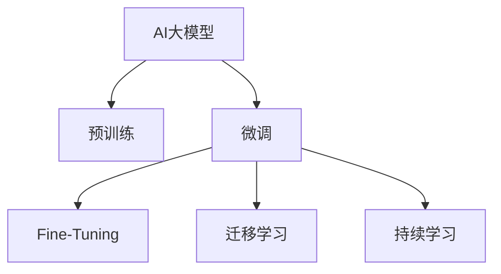

                 

## 1. 背景介绍

随着人工智能技术的迅猛发展，AI大模型在各行各业的应用日益广泛。从智能客服到医疗诊断，从金融风控到智能制造，大模型已经在很多领域展示了其卓越的性能。然而，随着越来越多企业涌入AI领域，创业公司如何应对来自巨头的竞争压力，成为关注的焦点。

本文将深入探讨AI大模型的核心原理和操作步骤，介绍其常见应用领域和相关学习资源，并提供创业公司应对未来竞争对手的策略。通过系统的梳理，我们希望能为创业者提供全面的技术参考和思考框架。

## 2. 核心概念与联系

### 2.1 核心概念概述

- **AI大模型**：以深度学习为基础，通过在大型数据集上进行预训练，学习到通用或特定领域的知识表示，具有强大推理和生成能力的模型。

- **预训练**：使用大规模未标注数据，通过自监督学习任务训练模型，使其具备初步的知识表示能力。

- **微调(Fine-Tuning)**：在预训练模型的基础上，使用下游任务的数据对模型进行有监督学习优化，使其适配特定任务。

- **迁移学习**：通过在不同任务之间共享知识，提升模型在新任务上的性能。

- **持续学习**：使模型能够不断学习新知识，避免遗忘旧知识，适应数据分布的变化。

这些核心概念构成了AI大模型的基础架构，帮助其在各种应用场景中展现出色性能。

### 2.2 核心概念原理和架构的 Mermaid 流程图



## 3. 核心算法原理 & 具体操作步骤

### 3.1 算法原理概述

AI大模型的核心算法主要分为预训练和微调两部分。预训练通过大规模数据集学习到通用的知识表示，微调则在此基础上针对具体任务进行优化。

预训练通常使用自监督学习任务，如掩码语言模型、下一句预测等，训练出具备强大推理能力的模型。微调则是将预训练模型作为初始化参数，在特定任务的数据集上进行有监督学习，以适配该任务的需求。

### 3.2 算法步骤详解

AI大模型的微调步骤如下：

1. **选择预训练模型**：根据任务需求选择合适的预训练模型，如GPT、BERT等。
2. **准备数据集**：收集并标注下游任务的数据集。
3. **添加任务适配层**：设计适合特定任务的任务适配层，如分类器的线性层和交叉熵损失。
4. **设置超参数**：选择合适的优化器、学习率、批大小等。
5. **训练模型**：使用下游任务的数据集进行微调训练。
6. **评估模型**：在验证集上评估模型性能，选择最优模型进行微调。
7. **部署模型**：将微调后的模型部署到实际应用场景中。

### 3.3 算法优缺点

**优点**：

- 基于已有的大模型，可以减少从头训练的时间和成本。
- 微调后的模型通常表现优于从头训练的模型。
- 迁移学习可以提升模型在新任务上的性能。

**缺点**：

- 依赖标注数据，标注成本较高。
- 模型对输入数据的分布变化敏感，可能产生灾难性遗忘。
- 模型复杂度高，对硬件资源要求较高。

### 3.4 算法应用领域

AI大模型在自然语言处理、计算机视觉、语音识别、推荐系统等多个领域得到了广泛应用。以下是几个典型应用案例：

- **自然语言处理**：情感分析、文本分类、机器翻译等。
- **计算机视觉**：图像分类、目标检测、图像生成等。
- **语音识别**：语音转文本、说话人识别、情感识别等。
- **推荐系统**：商品推荐、新闻推荐、广告推荐等。

## 4. 数学模型和公式 & 详细讲解 & 举例说明

### 4.1 数学模型构建

AI大模型的微调过程可以表示为：

$$
\theta = \arg\min_{\theta} \frac{1}{N}\sum_{i=1}^N \mathcal{L}(\theta;(x_i, y_i))
$$

其中，$\theta$ 表示模型参数，$(x_i, y_i)$ 表示训练样本和标签，$\mathcal{L}$ 表示损失函数。

### 4.2 公式推导过程

以分类任务为例，假设模型在输入 $x$ 上的输出为 $\hat{y} = M_\theta(x)$，真实标签为 $y$，则交叉熵损失函数为：

$$
\mathcal{L}(\theta;(x,y)) = -(y \log \hat{y} + (1-y) \log (1-\hat{y}))
$$

### 4.3 案例分析与讲解

以图像分类为例，可以使用ImageNet预训练的ResNet模型，通过微调实现新的分类任务。

- **预训练模型**：使用ImageNet数据集预训练的ResNet模型。
- **数据集准备**：收集并标注新的分类数据集。
- **任务适配层**：添加全连接层和Softmax层作为分类器。
- **微调训练**：使用新的分类数据集对ResNet模型进行微调。
- **评估**：在验证集上评估模型性能。
- **部署**：将微调后的模型部署到实际应用中。

## 5. 项目实践：代码实例和详细解释说明

### 5.1 开发环境搭建

使用Python和TensorFlow进行AI大模型的微调。安装TensorFlow、Keras等库，并使用GPU加速训练。

```bash
pip install tensorflow keras tensorflow-gpu
```

### 5.2 源代码详细实现

以图像分类为例，使用Keras实现模型的微调。

```python
import tensorflow as tf
from tensorflow import keras

# 加载预训练模型
base_model = keras.applications.ResNet50(weights='imagenet', include_top=False)

# 添加分类器
x = base_model.output
x = keras.layers.GlobalAveragePooling2D()(x)
x = keras.layers.Dense(1024, activation='relu')(x)
predictions = keras.layers.Dense(num_classes, activation='softmax')(x)
model = keras.models.Model(inputs=base_model.input, outputs=predictions)

# 冻结预训练层
for layer in base_model.layers:
    layer.trainable = False

# 设置优化器和超参数
optimizer = keras.optimizers.Adam(lr=0.001)
model.compile(optimizer=optimizer, loss='categorical_crossentropy', metrics=['accuracy'])

# 训练模型
model.fit(train_generator, epochs=10, validation_data=val_generator)
```

### 5.3 代码解读与分析

代码中，首先加载预训练的ResNet50模型，并在其顶部添加分类器。由于模型已经预训练，因此只需微调最后几层。通过设置训练参数，模型可以在新数据集上进行微调。

## 6. 实际应用场景

AI大模型在金融、医疗、智能制造等多个领域得到了广泛应用。以下是几个典型场景：

### 6.1 金融风控

AI大模型可以用于信用评分、欺诈检测等任务。通过微调，模型能够在大量标注数据上快速学习并适应新的业务场景。

### 6.2 医疗诊断

AI大模型可以用于疾病诊断、治疗方案推荐等。通过在特定领域的数据集上进行微调，模型能够学习到特定领域的专业知识，提升诊断和治疗的准确性。

### 6.3 智能制造

AI大模型可以用于缺陷检测、生产调度等任务。通过在制造设备生成的数据上进行微调，模型能够识别异常，提升生产效率。

## 7. 工具和资源推荐

### 7.1 学习资源推荐

1. **Coursera课程**：斯坦福大学的“Convolutional Neural Networks for Visual Recognition”，由Andrew Ng主讲，介绍了CNN的基本原理和应用。
2. **TensorFlow官方文档**：详细介绍了TensorFlow的使用方法和API，包括图像处理、自然语言处理等任务。
3. **Keras官方文档**：介绍了Keras的基本使用和高级技巧，适合快速上手深度学习任务。

### 7.2 开发工具推荐

1. **TensorFlow**：适合深度学习任务，支持GPU加速，社区活跃。
2. **PyTorch**：适合研究型任务，灵活性高，支持动态计算图。
3. **Jupyter Notebook**：适合数据分析和模型调试，支持代码单元格和绘图功能。

### 7.3 相关论文推荐

1. **“ImageNet Classification with Deep Convolutional Neural Networks”**：介绍CNN在图像分类任务上的应用。
2. **“Using Pre-trained Models for Sequence Labeling with BERT”**：介绍BERT在大规模文本分类任务上的应用。
3. **“A Survey on Transfer Learning”**：介绍了迁移学习的基本原理和应用。

## 8. 总结：未来发展趋势与挑战

### 8.1 研究成果总结

AI大模型在自然语言处理、计算机视觉等领域取得了显著成果，广泛应用于金融、医疗、智能制造等多个行业。

### 8.2 未来发展趋势

1. **模型规模化**：未来预训练模型将更加庞大，具有更强的泛化能力和应用潜力。
2. **微调技术改进**：研究更加高效的微调方法，减少对标注数据的依赖，提升模型的泛化能力。
3. **多模态融合**：将图像、语音、文本等多种模态的数据进行融合，提升模型的感知能力。
4. **联邦学习**：通过分布式学习，在保护数据隐私的前提下，提升模型的性能。
5. **边缘计算**：在边缘设备上进行模型推理，降低延迟，提升响应速度。

### 8.3 面临的挑战

1. **数据隐私保护**：在数据共享过程中，如何保护用户隐私和数据安全。
2. **模型解释性**：如何解释和理解AI模型的决策过程，增强模型的可信度。
3. **鲁棒性和可靠性**：如何提升模型的鲁棒性和可靠性，避免在实际应用中的错误和偏差。

### 8.4 研究展望

未来，AI大模型将在更多行业得到应用，提升各行各业的智能化水平。同时，研究者将重点关注模型可解释性、鲁棒性和隐私保护等方面，推动AI技术的可持续发展。

## 9. 附录：常见问题与解答

**Q1：什么是AI大模型？**

A: AI大模型是指使用大规模数据集预训练的深度学习模型，具备强大的推理和生成能力，能够解决复杂的任务。

**Q2：如何选择合适的预训练模型？**

A: 根据任务需求选择适合的预训练模型，如文本分类任务可以选择BERT或GPT，图像分类任务可以选择ResNet或VGG。

**Q3：微调过程中如何避免过拟合？**

A: 使用正则化、dropout等方法，同时增加数据集的多样性，减少模型对特定数据分布的依赖。

**Q4：AI大模型在金融风控中有哪些应用？**

A: 用于信用评分、欺诈检测、风险评估等任务，提升金融机构的业务决策效率和风险管理能力。

**Q5：AI大模型未来发展方向有哪些？**

A: 模型规模化、多模态融合、联邦学习、边缘计算等方向将会是未来AI大模型发展的重点。

---

作者：禅与计算机程序设计艺术 / Zen and the Art of Computer Programming

