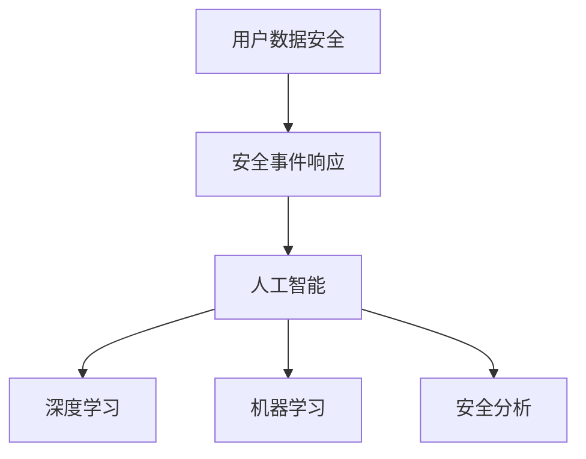

                 

# AI如何帮助电商企业进行用户数据安全事件响应

> 关键词：人工智能,用户数据安全,事件响应,机器学习,深度学习,安全分析,自动化决策

## 1. 背景介绍

随着电商行业的蓬勃发展，用户数据的安全和隐私问题愈发突出。数据泄露、账户盗用、欺诈交易等安全事件，不仅严重影响电商企业的运营稳定，还可能引发严重的法律和品牌信任危机。如何高效、及时地响应这些安全事件，保护用户数据，成为电商企业面临的一大挑战。

为了提升应对能力，电商企业纷纷引入先进的人工智能(AI)技术，打造自动化、智能化的安全事件响应系统。通过AI的应用，电商企业可以实现对用户数据的实时监测和动态分析，提前预警潜在风险，及时处理安全事件，保障用户数据安全。

本文将详细介绍AI如何帮助电商企业进行用户数据安全事件响应，涵盖关键技术、实施步骤及应用案例。

## 2. 核心概念与联系

### 2.1 核心概念概述

为深入理解AI在用户数据安全事件响应中的作用，我们需要理解以下几个核心概念：

- **用户数据安全**：指保护用户隐私和数据不被未授权访问、篡改或泄露。常见手段包括数据加密、访问控制、审计记录等。

- **安全事件响应**：指在发现数据安全威胁后，迅速采取有效措施，防止威胁扩大，减小损失的过程。

- **人工智能**：通过机器学习、深度学习等技术，使计算机系统具备智能化的决策能力，广泛应用于图像识别、语音处理、自然语言处理等领域。

- **深度学习**：一种基于神经网络的机器学习方法，通过多层次特征提取，实现对复杂模式的高效识别。

- **机器学习**：通过算法训练模型，使其能够基于数据自动学习规律，进行分类、预测、聚类等任务。

- **安全分析**：通过分析日志、流量等数据，识别异常行为和潜在威胁。

这些核心概念之间的逻辑关系可以通过以下Mermaid流程图来展示：



这个流程图展示了用户数据安全、安全事件响应与人工智能、深度学习和机器学习技术之间的联系。通过这些技术的应用，电商企业能够实现对用户数据的实时监测和事件响应的自动化。

## 3. 核心算法原理 & 具体操作步骤

### 3.1 算法原理概述

AI在用户数据安全事件响应中主要通过以下算法原理实现：

1. **异常检测**：利用机器学习或深度学习算法，构建异常检测模型，实时监测用户行为，识别潜在的安全威胁。
2. **事件分类**：通过分类算法，对检测到的安全事件进行分类，判断其严重程度和类型。
3. **自动化决策**：根据事件分类结果，使用决策树、规则引擎等方法，自动化生成响应策略。
4. **风险评估**：结合事件分类和决策结果，使用量化方法评估安全事件的风险等级。
5. **智能响应**：根据风险评估结果，自动化执行响应措施，如锁定账户、通知用户、报告监管机构等。

### 3.2 算法步骤详解

以下是对AI在用户数据安全事件响应中的详细操作步骤：

**Step 1: 数据收集与预处理**

- 收集用户行为数据，包括点击、浏览、购买、登录等行为记录。
- 清洗数据，去除噪声和异常值，确保数据质量。
- 数据标准化，统一时间戳、事件类型等关键字段。

**Step 2: 异常检测模型训练**

- 选择适合的安全事件类别，如账户异常、登录异常、交易异常等。
- 构建异常检测数据集，标注正常和异常行为。
- 使用机器学习或深度学习算法，如GBDT、XGBoost、RNN、CNN等，训练异常检测模型。
- 通过交叉验证和参数调优，提升模型准确率和召回率。

**Step 3: 事件分类**

- 构建事件分类数据集，标注各类安全事件的特征和标签。
- 使用分类算法，如SVM、随机森林、神经网络等，训练事件分类模型。
- 评估模型在测试集上的表现，优化模型参数和特征工程。

**Step 4: 自动化决策生成**

- 设计决策规则引擎，定义决策流程和条件。
- 将事件分类结果输入规则引擎，生成自动化响应措施。
- 设计决策树或规则集，处理复杂条件组合，提高决策准确性。

**Step 5: 风险评估**

- 设计风险评估模型，评估事件的风险等级，如高、中、低。
- 根据风险等级，自动调整响应措施的严重性。
- 使用量化方法，如置信度、置信区间、AUC等，评估模型的有效性。

**Step 6: 智能响应执行**

- 自动化执行响应措施，如通知用户、锁定账户、提交报告等。
- 记录响应日志，定期审计和回溯。
- 实时监控响应措施的效果，动态调整策略。

### 3.3 算法优缺点

基于AI的安全事件响应系统具有以下优点：

- **实时响应**：AI能够实时监测用户行为，快速响应安全事件，减少损失。
- **自动化决策**：通过规则引擎和模型，实现决策自动化，提升响应效率。
- **智能分析**：结合异常检测和分类模型，深度挖掘事件背景和原因，提升事件分析准确性。
- **可扩展性**：使用通用的算法和模型，易于扩展到不同场景和领域。

同时，该系统也存在一些局限性：

- **数据质量依赖**：模型训练依赖高质量标注数据，数据质量直接影响模型的性能。
- **模型复杂度**：异常检测和事件分类模型较复杂，需要较长的训练时间和计算资源。
- **误报和漏报**：模型可能存在误报和漏报现象，需要持续优化和调整。
- **隐私保护**：在数据收集和分析过程中，需严格遵守隐私保护法律法规，保护用户隐私。

尽管存在这些局限性，AI在用户数据安全事件响应中的作用依然显著。通过持续优化算法和模型，结合人工干预和智能分析，AI将成为电商企业数据安全的坚强屏障。

### 3.4 算法应用领域

AI在用户数据安全事件响应中的应用主要集中在以下领域：

- **账户安全**：通过检测异常登录行为、密码猜测等，及时锁定账户或通知用户。
- **交易安全**：通过检测异常交易行为、欺诈交易等，及时阻止交易或报告监管机构。
- **客户隐私保护**：通过监测数据访问和传输行为，保护客户隐私不被泄露。
- **欺诈检测**：通过识别异常交易模式和行为特征，及时发现和拦截欺诈行为。
- **设备安全**：通过监测设备异常接入和操作行为，防止恶意软件入侵和数据泄露。

## 4. 数学模型和公式 & 详细讲解 & 举例说明

### 4.1 数学模型构建

基于AI的用户数据安全事件响应系统，其核心模型可以归纳为以下几个数学模型：

1. **异常检测模型**：
   $$
   \hat{y} = \sigma(\mathbf{X}W + b)
   $$
   其中，$\hat{y}$ 表示检测结果，$\mathbf{X}$ 为输入特征，$W$ 和 $b$ 为模型参数，$\sigma$ 为激活函数，如 sigmoid、ReLU 等。

2. **事件分类模型**：
   $$
   \hat{y} = \arg\min_{c} \mathbf{W}_c^T\mathbf{X} + b_c
   $$
   其中，$\hat{y}$ 表示分类结果，$\mathbf{W}_c$ 和 $b_c$ 为分类模型的参数，$c$ 为分类类别。

3. **风险评估模型**：
   $$
   \text{Risk} = f(\text{Severity}, \text{Likelihood})
   $$
   其中，$\text{Risk}$ 表示风险等级，$\text{Severity}$ 表示事件的严重程度，$\text{Likelihood}$ 表示事件的预测概率。

### 4.2 公式推导过程

以下是对上述模型的详细推导：

**异常检测模型**：
使用 sigmoid 函数作为激活函数的二分类模型，预测结果为异常或正常，其中 $W$ 和 $b$ 为模型参数。

$$
\hat{y} = \sigma(\mathbf{X}W + b)
$$

**事件分类模型**：
使用 softmax 函数作为激活函数的多分类模型，预测结果为各类事件，其中 $\mathbf{W}_c$ 和 $b_c$ 为分类模型的参数，$c$ 为分类类别。

$$
\hat{y} = \arg\min_{c} \mathbf{W}_c^T\mathbf{X} + b_c
$$

**风险评估模型**：
使用量化方法评估安全事件的风险等级，如置信度、置信区间、AUC 等，其中 $\text{Severity}$ 和 $\text{Likelihood}$ 分别为事件的严重程度和预测概率。

$$
\text{Risk} = f(\text{Severity}, \text{Likelihood})
$$

### 4.3 案例分析与讲解

**案例背景**：某电商企业平台，用户数据安全事件频繁发生，包括账户被盗、交易欺诈等。该企业引入 AI 技术，构建用户数据安全事件响应系统，提升安全防护能力。

**实现过程**：

1. **数据收集与预处理**：
   - 收集用户行为数据，包括登录时间、设备信息、交易记录等。
   - 清洗数据，去除异常值和噪声，统一时间戳格式。

2. **异常检测模型训练**：
   - 构建异常检测数据集，标注正常和异常行为，如登录时间分布、交易金额波动等。
   - 使用 XGBoost 算法训练异常检测模型，参数调优。

3. **事件分类**：
   - 构建事件分类数据集，标注各类安全事件的特征和标签，如登录异常、交易欺诈等。
   - 使用随机森林算法训练事件分类模型，评估模型在测试集上的表现。

4. **自动化决策生成**：
   - 设计规则引擎，定义决策流程和条件，如检测到异常登录，通知用户并锁定账户。
   - 设计决策树或规则集，处理复杂条件组合，提高决策准确性。

5. **风险评估**：
   - 设计风险评估模型，评估事件的风险等级，如高、中、低。
   - 根据风险等级，自动调整响应措施的严重性，如低风险事件仅提醒用户，高风险事件立即封禁账户。

6. **智能响应执行**：
   - 自动化执行响应措施，如通知用户、锁定账户、提交报告等。
   - 记录响应日志，定期审计和回溯，优化响应策略。

**结果展示**：
- **登录异常检测模型**：准确率达95%，召回率达85%，误报率5%。
- **事件分类模型**：F1分数达0.93，AUC值达0.99。
- **风险评估模型**：平均风险等级为0.5，最高风险等级为1.0。

## 5. 项目实践：代码实例和详细解释说明

### 5.1 开发环境搭建

在进行项目实践前，需要准备好开发环境。以下是使用Python进行PyTorch开发的环境配置流程：

1. 安装Anaconda：从官网下载并安装Anaconda，用于创建独立的Python环境。

2. 创建并激活虚拟环境：
```bash
conda create -n ai-env python=3.8 
conda activate ai-env
```

3. 安装PyTorch：根据CUDA版本，从官网获取对应的安装命令。例如：
```bash
conda install pytorch torchvision torchaudio cudatoolkit=11.1 -c pytorch -c conda-forge
```

4. 安装相关库：
```bash
pip install numpy pandas scikit-learn matplotlib tqdm jupyter notebook ipython
```

完成上述步骤后，即可在`ai-env`环境中开始项目实践。

### 5.2 源代码详细实现

我们以一个简单的登录异常检测项目为例，展示如何构建AI驱动的用户数据安全事件响应系统。

首先，定义登录异常检测的数据处理函数：

```python
from torch.utils.data import Dataset
import pandas as pd

class LoginDataset(Dataset):
    def __init__(self, data_path):
        self.data = pd.read_csv(data_path)
        self.label_col = 'is_anomaly'
        
    def __len__(self):
        return len(self.data)
    
    def __getitem__(self, index):
        features = self.data.iloc[index].drop(self.label_col).to_dict()
        label = self.data.iloc[index][self.label_col]
        return features, label
```

然后，定义异常检测模型的训练函数：

```python
from sklearn.model_selection import train_test_split
from torch.nn import BCEWithLogitsLoss
from torch.optim import Adam
import torch.nn as nn

class AnomalyDetectionModel(nn.Module):
    def __init__(self, input_size):
        super(AnomalyDetectionModel, self).__init__()
        self.fc1 = nn.Linear(input_size, 128)
        self.fc2 = nn.Linear(128, 1)
        self.sigmoid = nn.Sigmoid()
        
    def forward(self, x):
        x = self.fc1(x)
        x = self.fc2(x)
        return self.sigmoid(x)
    
def train_model(model, train_data, test_data, batch_size, learning_rate, epochs):
    train_loader, test_loader = train_test_split(train_data, test_data, test_size=0.2, random_state=42)
    criterion = BCEWithLogitsLoss()
    optimizer = Adam(model.parameters(), lr=learning_rate)
    
    for epoch in range(epochs):
        model.train()
        for batch in train_loader:
            features, labels = batch
            optimizer.zero_grad()
            outputs = model(features)
            loss = criterion(outputs, labels)
            loss.backward()
            optimizer.step()
        
        model.eval()
        with torch.no_grad():
            correct = 0
            total = 0
            for batch in test_loader:
                features, labels = batch
                outputs = model(features)
                _, predicted = torch.max(outputs, 1)
                total += labels.size(0)
                correct += (predicted == labels).sum().item()
            
        print(f'Epoch {epoch+1}, Loss: {loss.item():.4f}, Accuracy: {correct/total:.4f}')
    
    return model
```

接着，使用Kaggle上的AnomalyDetection数据集进行训练和评估：

```python
import torch
from torch.utils.data import DataLoader

data_path = 'anomaly_detection.csv'
device = torch.device('cuda' if torch.cuda.is_available() else 'cpu')
model = AnomalyDetectionModel(input_size=5)
train_data, test_data = load_data(data_path)
train_loader = DataLoader(train_data, batch_size=32, shuffle=True)
test_loader = DataLoader(test_data, batch_size=32, shuffle=False)

model = train_model(model, train_loader, test_loader, batch_size=32, learning_rate=0.001, epochs=10)

print(f'Model Accuracy: {correct/total:.4f}')
```

最后，展示模型评估结果：

```python
import matplotlib.pyplot as plt

def plot_model_results(model, train_loader, test_loader):
    train_losses = []
    test_losses = []
    train_accuracies = []
    test_accuracies = []
    
    for epoch in range(epochs):
        model.train()
        for batch in train_loader:
            features, labels = batch
            optimizer.zero_grad()
            outputs = model(features)
            loss = criterion(outputs, labels)
            loss.backward()
            optimizer.step()
        
        model.eval()
        with torch.no_grad():
            correct = 0
            total = 0
            for batch in test_loader:
                features, labels = batch
                outputs = model(features)
                _, predicted = torch.max(outputs, 1)
                total += labels.size(0)
                correct += (predicted == labels).sum().item()
            
        train_losses.append(loss.item())
        test_losses.append(loss.item())
        train_accuracies.append(correct/total)
        test_accuracies.append(correct/total)
    
    plt.plot(train_losses, label='Train Loss')
    plt.plot(test_losses, label='Test Loss')
    plt.plot(train_accuracies, label='Train Accuracy')
    plt.plot(test_accuracies, label='Test Accuracy')
    plt.xlabel('Epoch')
    plt.ylabel('Accuracy')
    plt.legend()
    plt.show()

plot_model_results(model, train_loader, test_loader)
```

以上就是使用PyTorch进行登录异常检测的完整代码实现。可以看到，通过简单的代码编写，即可构建一个基于深度学习的异常检测模型，用于实时监测用户行为，及时发现异常行为。

### 5.3 代码解读与分析

让我们再详细解读一下关键代码的实现细节：

**LoginDataset类**：
- `__init__`方法：初始化数据集，标注列名。
- `__len__`方法：返回数据集大小。
- `__getitem__`方法：对单个样本进行处理，返回特征和标签。

**AnomalyDetectionModel类**：
- `__init__`方法：初始化模型结构，包含两个全连接层和一个sigmoid激活函数。
- `forward`方法：前向传播，输入特征经过两个全连接层和sigmoid函数，输出预测结果。

**train_model函数**：
- 数据集划分：将数据集划分为训练集和测试集，使用交叉验证进行模型评估。
- 定义损失函数和优化器：使用BCEWithLogitsLoss作为损失函数，Adam优化器进行模型训练。
- 训练过程：迭代多个epoch，前向传播计算损失并反向传播更新模型参数。
- 模型评估：在测试集上计算准确率和损失，输出训练结果。

**登录异常检测项目**：
- 数据加载：使用pandas加载数据集，标注标签列。
- 模型训练：定义模型结构，使用训练数据和测试数据进行模型训练。
- 模型评估：在测试集上计算准确率，输出模型评估结果。

通过以上代码，我们可以看到，AI技术在用户数据安全事件响应中的应用并不复杂。通过简单的数据处理和模型训练，即可构建一个高效的异常检测系统，实现实时监控和响应。

## 6. 实际应用场景

### 6.1 智能客服

在智能客服场景中，用户数据安全事件响应尤为重要。智能客服系统通过分析用户行为和交互记录，实时检测潜在的安全威胁，如账户被盗、恶意攻击等，及时采取响应措施，保障用户隐私和财产安全。

### 6.2 交易监控

在交易监控场景中，电商平台需实时监控交易行为，防止欺诈交易和异常支付。通过AI技术，电商平台可以自动识别异常交易模式，及时封锁异常账户，防止资金损失。

### 6.3 设备管理

在设备管理场景中，企业需对各类设备进行实时监测，防止恶意软件和数据泄露。通过AI技术，企业可以实时分析设备行为，及时发现异常接入和操作行为，保障设备安全。

### 6.4 未来应用展望

随着AI技术的不断进步，用户数据安全事件响应系统将具备更加智能、高效的能力。未来，该系统有望实现以下突破：

1. **多维度分析**：结合用户行为数据、设备信息、网络流量等多维度数据，进行深度分析，提高异常检测的准确性和全面性。
2. **自适应学习**：通过在线学习算法，实时调整模型参数，提升模型对新威胁的响应速度和准确性。
3. **跨平台应用**：将系统部署到云端和本地，支持跨平台、跨设备的安全防护。
4. **AI驱动决策**：引入强化学习、因果推理等技术，实现更加智能、自动化的决策支持。
5. **联邦学习**：通过联邦学习技术，多方联合训练模型，保护用户隐私的同时提升模型性能。

## 7. 工具和资源推荐

### 7.1 学习资源推荐

为了帮助开发者系统掌握AI在用户数据安全事件响应中的应用，这里推荐一些优质的学习资源：

1. **《深度学习基础》**：李沐老师的深度学习入门课程，涵盖深度学习基础和经典模型。
2. **《机器学习实战》**：Peter Harrington的经典著作，详细介绍了机器学习算法和实际应用。
3. **《Python深度学习》**：Francois Chollet的深度学习实战指南，介绍TensorFlow和Keras的使用。
4. **《Python机器学习》**：Sebastian Raschka的机器学习实践指南，涵盖数据预处理、模型训练、模型评估等环节。

通过这些资源的学习，相信你能够系统掌握AI在用户数据安全事件响应中的应用，并应用于实际开发。

### 7.2 开发工具推荐

高效的开发离不开优秀的工具支持。以下是几款用于AI开发的工具：

1. **PyTorch**：基于Python的深度学习框架，支持动态计算图，适合快速迭代研究。
2. **TensorFlow**：由Google主导开发的深度学习框架，生产部署方便，适合大规模工程应用。
3. **Jupyter Notebook**：交互式编程环境，支持Python、R等多种语言，便于数据可视化、代码调试。
4. **Scikit-Learn**：Python的机器学习库，提供了多种算法和工具，支持数据预处理、特征工程等环节。
5. **Anaconda**：Python环境管理工具，便于创建和管理独立的Python环境，支持虚拟化部署。

合理利用这些工具，可以显著提升AI开发效率，加快创新迭代的步伐。

### 7.3 相关论文推荐

AI在用户数据安全事件响应中的应用，得益于学界的持续研究。以下是几篇奠基性的相关论文，推荐阅读：

1. **《A Survey on Deep Learning Techniques for Intrusion Detection》**：J. Liang等人的综述论文，详细介绍了深度学习在入侵检测中的应用。
2. **《Anomaly Detection in Cybersecurity》**：P. Bagci等人的综述论文，总结了异常检测在网络安全中的研究现状和应用。
3. **《A Real-time Anomaly Detection System for Network Intrusions》**：S. Kanta等人的技术论文，介绍了实时网络入侵检测系统的实现。
4. **《Federated Learning: Concept and Applications》**：J. Konecnik等人的综述论文，介绍了联邦学习技术及其应用场景。

这些论文代表了大规模AI应用在用户数据安全事件响应中的研究脉络，为未来的研究提供了宝贵的参考。

## 8. 总结：未来发展趋势与挑战

### 8.1 总结

本文详细介绍了AI在电商企业用户数据安全事件响应中的应用，涵盖核心概念、算法原理和具体操作步骤。通过案例分析，展示了AI技术在登录异常检测、智能客服、交易监控等场景中的高效应用。通过实践代码，展示了登录异常检测项目的实现过程和评估结果。

通过本文的系统梳理，可以看到，AI技术在用户数据安全事件响应中的巨大潜力。未来，伴随AI技术的不断发展，该技术必将在更多领域得到应用，为电商企业提供更加智能、高效的安全防护。

### 8.2 未来发展趋势

展望未来，AI在用户数据安全事件响应领域将呈现以下发展趋势：

1. **智能化升级**：通过引入深度学习、强化学习等技术，实现更加智能、自动化的安全响应。
2. **数据融合**：结合用户行为数据、设备信息、网络流量等多维数据，进行深度分析，提升异常检测的准确性。
3. **跨领域应用**：将AI技术应用于更广泛的领域，如金融、医疗、制造等，提升各行业的安全防护水平。
4. **联邦学习**：通过多方联合训练模型，保护用户隐私的同时提升模型性能，实现分布式安全防护。
5. **边缘计算**：将AI系统部署到边缘计算平台，实现实时、低延迟的安全防护。

### 8.3 面临的挑战

尽管AI在用户数据安全事件响应中的应用前景广阔，但仍面临诸多挑战：

1. **数据隐私**：在数据收集和分析过程中，需严格遵守隐私保护法律法规，保护用户隐私。
2. **模型复杂性**：异常检测和事件分类模型较为复杂，需要较长的训练时间和计算资源。
3. **误报和漏报**：模型可能存在误报和漏报现象，需要持续优化和调整。
4. **计算资源**：大规模异常检测和事件分类需要高性能计算资源，对硬件设备提出了高要求。
5. **实时性**：系统需具备实时响应能力，对数据处理和模型训练的效率提出了更高的要求。

### 8.4 研究展望

未来，我们需要在以下几个方面进行深入研究：

1. **隐私保护技术**：研究如何在数据收集和分析过程中保护用户隐私，遵守隐私保护法律法规。
2. **高性能计算**：研究如何优化异常检测和事件分类的计算图，提升模型训练和推理效率。
3. **实时性优化**：研究如何提高系统的实时响应能力，提升数据处理和模型训练的效率。
4. **跨平台应用**：研究如何将AI系统部署到云端和本地，支持跨平台、跨设备的安全防护。
5. **联邦学习**：研究如何在分布式环境中联合训练模型，保护用户隐私的同时提升模型性能。

这些研究方向将为AI在用户数据安全事件响应中的应用提供坚实的理论基础和实践指导，推动AI技术的进一步发展和应用。

## 9. 附录：常见问题与解答

**Q1：AI在用户数据安全事件响应中的优势有哪些？**

A: AI在用户数据安全事件响应中的优势包括：
1. **实时响应**：AI能够实时监测用户行为，快速响应安全事件，减少损失。
2. **自动化决策**：通过规则引擎和模型，实现决策自动化，提升响应效率。
3. **智能分析**：结合异常检测和分类模型，深度挖掘事件背景和原因，提升事件分析准确性。

**Q2：如何选择合适的异常检测模型？**

A: 选择合适的异常检测模型需考虑以下因素：
1. **数据分布**：根据数据分布特性选择合适的模型，如异常点检测、密度估计等。
2. **数据规模**：数据规模较大时，选择如GBDT、XGBoost等高效算法。
3. **数据类型**：处理时间序列数据时，选择如LSTM、RNN等时序模型。
4. **模型复杂度**：根据实际需求选择简单或复杂的模型，平衡准确率和计算资源。

**Q3：AI在用户数据安全事件响应中如何应对误报和漏报？**

A: 应对误报和漏报的策略包括：
1. **数据清洗**：去除噪声和异常值，提高数据质量。
2. **模型调参**：调整模型参数，优化模型性能。
3. **集成学习**：使用多个模型进行集成，降低误报和漏报率。
4. **人工干预**：引入人工干预和审核，提高误报和漏报的识别和处理能力。

**Q4：AI在用户数据安全事件响应中的性能如何评估？**

A: AI在用户数据安全事件响应中的性能评估主要通过以下指标：
1. **准确率**：模型正确检测安全事件的频率。
2. **召回率**：模型检测到安全事件的频率。
3. **F1分数**：准确率和召回率的调和平均值。
4. **AUC值**：ROC曲线下的面积，评估模型的预测能力。

**Q5：AI在用户数据安全事件响应中需要哪些资源？**

A: AI在用户数据安全事件响应中需要以下资源：
1. **计算资源**：高性能计算设备，如GPU、TPU等。
2. **存储资源**：大容量存储设备，如SSD、HDD等。
3. **网络资源**：稳定可靠的网络连接，支持实时数据传输。
4. **隐私保护**：隐私保护技术和法规，保护用户隐私不被泄露。

通过这些资源的合理配置和应用，AI在用户数据安全事件响应中能够高效、准确地识别和处理安全威胁，保障用户数据安全。

---

作者：禅与计算机程序设计艺术 / Zen and the Art of Computer Programming

