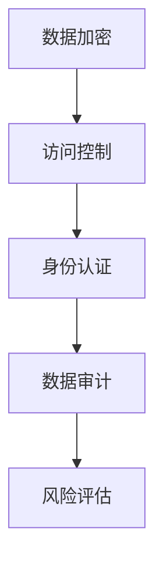

                 

# AI如何帮助电商企业进行用户数据安全风险控制

## 1. 背景介绍

### 1.1 问题由来

随着电子商务的迅猛发展，电商平台收集了大量用户数据，用于个性化推荐、营销分析、用户画像等。这些数据不仅关乎用户的隐私，还关系到平台的商业价值和竞争力。然而，数据泄露、隐私侵犯等安全问题频发，给电商企业的运营带来了巨大挑战。例如，2019年的Cambridge Analytica事件暴露了数千万Facebook用户的隐私数据，导致用户信任度大幅下降。如何保护用户数据安全，成为了电商企业亟待解决的问题。

### 1.2 问题核心关键点

用户数据安全风险控制的核心在于以下几个方面：
- **数据加密**：保护数据在存储和传输过程中的机密性。
- **访问控制**：严格控制数据的访问权限，防止未经授权的访问和数据泄露。
- **身份认证**：验证用户身份的真实性，防止假冒和钓鱼攻击。
- **数据审计**：跟踪和记录数据访问和使用情况，及时发现异常行为。
- **风险评估**：定期评估数据安全状况，及时修复漏洞。

## 2. 核心概念与联系

### 2.1 核心概念概述

为了更系统地解决电商企业的数据安全问题，本节将介绍几个核心概念：

- **数据加密**：指通过特定的算法，将原始数据转换为难以理解的密文，只有持有密钥的用户才能解密还原原始数据。常见的加密算法包括对称加密、非对称加密、哈希算法等。
- **访问控制**：指对数据资源的访问进行控制，只有授权用户或角色才能访问特定数据。常见的访问控制模型包括RBAC（基于角色的访问控制）、ABAC（基于属性的访问控制）等。
- **身份认证**：指验证用户身份的真实性，防止冒充和欺骗。常见的身份认证方式包括用户名密码、生物识别、单点登录等。
- **数据审计**：指记录和跟踪数据的访问和使用情况，及时发现异常行为。常见的审计方法包括日志记录、行为分析和异常检测等。
- **风险评估**：指定期评估数据安全状况，识别潜在威胁和漏洞，并采取相应措施进行修复。

这些概念之间相互关联，构成了一个完整的用户数据安全风险控制体系。加密技术保证了数据的机密性，访问控制确保了数据的访问权限，身份认证验证了用户身份的真实性，数据审计记录了数据访问和使用情况，风险评估则持续监控和改进安全策略。

### 2.2 核心概念原理和架构的 Mermaid 流程图



这个流程图展示了数据安全风险控制体系中各关键组件的相互关系和执行顺序。

## 3. 核心算法原理 & 具体操作步骤
### 3.1 算法原理概述

基于AI的用户数据安全风险控制，主要依赖于以下几个核心算法：

- **机器学习算法**：用于识别和预测潜在的安全威胁，包括异常检测、风险评估等。
- **深度学习算法**：用于处理大规模数据和复杂模式识别，提升安全防护的准确性和效率。
- **自然语言处理算法**：用于分析日志、文本等非结构化数据，提取有价值的安全信息。
- **强化学习算法**：用于优化安全策略和决策，提升安全防护的整体效果。

这些算法通过数据驱动的方式，不断学习和优化，能够及时发现和应对安全威胁，保障数据安全。

### 3.2 算法步骤详解

#### 3.2.1 数据收集与预处理

数据收集是数据安全风险控制的基础。电商平台需要收集用户行为数据、交易数据、日志数据等，并对数据进行预处理，包括清洗、归一化、特征提取等，以便后续分析使用。

#### 3.2.2 数据加密与存储

采用对称加密或非对称加密算法对数据进行加密，确保数据在存储和传输过程中的机密性。常见的加密算法包括AES、RSA、ECC等。

#### 3.2.3 访问控制与权限管理

定义角色的访问权限，使用RBAC模型进行访问控制。例如，管理员有访问所有数据的权限，而普通用户只能访问部分数据。

#### 3.2.4 身份认证与用户管理

采用用户名密码、生物识别等方式进行身份认证，确保用户身份的真实性。身份认证结果可用于后续的访问控制和审计。

#### 3.2.5 数据审计与日志分析

记录和分析用户数据的访问和使用情况，生成审计日志。使用异常检测和行为分析等技术，及时发现异常行为和潜在威胁。

#### 3.2.6 风险评估与安全策略优化

定期进行风险评估，识别潜在威胁和漏洞，并采取相应措施进行修复。根据风险评估结果，优化安全策略和决策，提升安全防护效果。

### 3.3 算法优缺点

#### 3.3.1 优点

- **自动化与智能化**：通过AI算法实现自动化和智能化处理，提升安全防护的效率和效果。
- **自适应与灵活性**：AI算法能够根据数据和环境变化自适应调整，灵活应对各种安全威胁。
- **预测与预防**：AI算法能够预测潜在威胁和异常行为，提前采取预防措施，减少安全事件的发生。
- **多模态与融合**：结合多种数据源和多种安全技术，综合分析安全状况，提升整体防护水平。

#### 3.3.2 缺点

- **依赖高质量数据**：AI算法的效果依赖于高质量的数据，数据质量和多样性不足时，可能影响算法性能。
- **复杂性与技术门槛**：AI算法的实现和优化需要较高技术门槛，需要专业人才支持。
- **隐私与安全风险**：AI算法本身也可能存在隐私和安全风险，例如模型泄露、数据泄露等。

### 3.4 算法应用领域

基于AI的用户数据安全风险控制，已经广泛应用于电子商务、金融、医疗等多个领域，主要体现在以下几个方面：

- **电商平台**：用于保护用户隐私、防范交易欺诈、监控异常行为等。
- **金融行业**：用于防范金融欺诈、监控异常交易、识别潜在风险等。
- **医疗行业**：用于保护患者隐私、防止数据泄露、监控异常行为等。

## 4. 数学模型和公式 & 详细讲解 & 举例说明

### 4.1 数学模型构建

#### 4.1.1 异常检测模型

异常检测是识别异常行为和潜在威胁的重要手段。常用的异常检测模型包括统计学模型、机器学习模型和深度学习模型。

- **统计学模型**：基于统计学方法，如均值、方差、标准差等，判断数据是否偏离正常范围。例如，均值-方差检测模型：
  $$
  S(X) = \frac{\sum_{i=1}^{n}(X_i - \mu)^2}{n}
  $$
  其中，$X$ 为数据样本，$\mu$ 为均值，$S$ 为方差。

- **机器学习模型**：基于监督学习或无监督学习算法，训练异常检测模型。例如，支持向量机（SVM）模型：
  $$
  SVM(\text{classifier}, X) = \max_{\alpha} \frac{1}{2}\sum_{i=1}^{n}\alpha_i^2 - \sum_{i=1}^{n}\alpha_iy_ig(x_i)
  $$
  其中，$\alpha$ 为拉格朗日乘子，$y_i$ 为标签，$g(x_i)$ 为决策函数。

- **深度学习模型**：基于深度神经网络，训练异常检测模型。例如，自编码器（Autoencoder）模型：
  $$
  AE(\text{encoder}, X) = \min_{\theta} \frac{1}{2}\|X - \text{decoder}(\text{encoder}(X))\|^2
  $$
  其中，$\theta$ 为模型参数，$X$ 为输入，$\text{decoder}$ 为解码器，$\text{encoder}$ 为编码器。

#### 4.1.2 风险评估模型

风险评估模型用于量化和评估数据安全状况，识别潜在威胁和漏洞。常用的风险评估模型包括基于概率的方法和基于量化的方法。

- **基于概率的方法**：通过计算风险的概率分布，评估数据安全状况。例如，贝叶斯网络（Bayesian Network）模型：
  $$
  P(A|B) = \frac{P(A \cap B)}{P(B)}
  $$
  其中，$A$ 为事件，$B$ 为变量。

- **基于量化的方法**：通过计算风险的数值指标，评估数据安全状况。例如，安全评分模型：
  $$
  \text{Score} = \frac{\sum_{i=1}^{n}\text{Weight}_i\text{Risk}_i}{\sum_{i=1}^{n}\text{Weight}_i}
  $$
  其中，$\text{Score}$ 为安全评分，$\text{Risk}_i$ 为第$i$ 个风险指标，$\text{Weight}_i$ 为权重。

### 4.2 公式推导过程

#### 4.2.1 均值-方差检测模型

均值-方差检测模型基于统计学方法，通过计算数据的均值和方差，判断数据是否偏离正常范围。

- **均值计算**：
  $$
  \mu = \frac{\sum_{i=1}^{n}X_i}{n}
  $$

- **方差计算**：
  $$
  S = \frac{\sum_{i=1}^{n}(X_i - \mu)^2}{n}
  $$

- **异常检测**：
  $$
  S(X) = \frac{\sum_{i=1}^{n}(X_i - \mu)^2}{n} > \text{Threshold}
  $$
  其中，$\text{Threshold}$ 为预设的异常阈值。

#### 4.2.2 支持向量机（SVM）模型

支持向量机模型基于监督学习算法，通过训练分类器，识别异常行为。

- **数据准备**：
  $$
  (x_1, y_1), (x_2, y_2), ..., (x_n, y_n)
  $$
  其中，$x_i$ 为输入特征，$y_i$ 为标签。

- **模型训练**：
  $$
  \max_{\alpha} \frac{1}{2}\sum_{i=1}^{n}\alpha_i^2 - \sum_{i=1}^{n}\alpha_iy_ig(x_i)
  $$
  其中，$\alpha$ 为拉格朗日乘子，$g(x_i)$ 为决策函数。

- **异常检测**：
  $$
  \text{Class}(\text{classifier}, x) = \max_{i}(\alpha_ig(x_i))
  $$
  其中，$\text{classifier}$ 为分类器，$x$ 为输入数据，$\text{Class}$ 为分类结果。

#### 4.2.3 自编码器（Autoencoder）模型

自编码器模型基于深度神经网络，通过重构原始数据，识别异常行为。

- **数据准备**：
  $$
  X = \{x_1, x_2, ..., x_n\}
  $$
  其中，$x_i$ 为输入数据。

- **编码器训练**：
  $$
  \min_{\theta} \frac{1}{2}\|X - \text{decoder}(\text{encoder}(X))\|^2
  $$
  其中，$\theta$ 为模型参数，$\text{decoder}$ 为解码器，$\text{encoder}$ 为编码器。

- **异常检测**：
  $$
  \text{Reconstruct}(\text{encoder}, X) = \text{decoder}(\text{encoder}(X))
  $$
  其中，$\text{Reconstruct}$ 为重构结果，$\text{encoder}$ 为编码器，$X$ 为输入数据。

### 4.3 案例分析与讲解

#### 4.3.1 电商平台异常检测

以电商平台为例，使用均值-方差检测模型和SVM模型进行异常检测。

- **均值-方差检测模型**：
  - **数据准备**：准备用户登录次数、交易金额等行为数据。
  - **模型训练**：计算数据的均值和方差，判断是否偏离正常范围。
  - **异常检测**：当用户行为偏离正常范围时，触发异常告警。

- **SVM模型**：
  - **数据准备**：准备用户登录次数、交易金额等行为数据。
  - **模型训练**：使用标签化数据训练分类器。
  - **异常检测**：当分类器预测结果为异常时，触发异常告警。

#### 4.3.2 金融行业风险评估

以金融行业为例，使用安全评分模型进行风险评估。

- **数据准备**：准备交易金额、交易时间、交易地点等交易数据。
- **模型训练**：定义风险指标，计算风险评分。
- **风险评估**：当安全评分超过预设阈值时，触发风险预警。

## 5. 项目实践：代码实例和详细解释说明

### 5.1 开发环境搭建

在进行AI驱动的数据安全风险控制项目实践前，需要准备好开发环境。以下是使用Python进行TensorFlow和Keras开发的环境配置流程：

1. 安装Anaconda：从官网下载并安装Anaconda，用于创建独立的Python环境。

2. 创建并激活虚拟环境：
   ```bash
   conda create -n tf-env python=3.8 
   conda activate tf-env
   ```

3. 安装TensorFlow和Keras：
   ```bash
   pip install tensorflow==2.3.0 
   pip install keras==2.4.3 
   ```

4. 安装各类工具包：
   ```bash
   pip install numpy pandas scikit-learn matplotlib tqdm jupyter notebook ipython
   ```

完成上述步骤后，即可在`tf-env`环境中开始AI驱动的数据安全风险控制项目实践。

### 5.2 源代码详细实现

这里我们以异常检测和风险评估为例，给出使用TensorFlow和Keras进行数据安全风险控制的代码实现。

首先，定义异常检测模型：

```python
import tensorflow as tf
from tensorflow.keras import layers

# 定义均值-方差检测模型
class MeanVarianceModel(tf.keras.Model):
    def __init__(self, feature_dim):
        super(MeanVarianceModel, self).__init__()
        self.mean = layers.Lambda(lambda x: tf.reduce_mean(x, axis=1))
        self.variance = layers.Lambda(lambda x: tf.math.reduce_variance(x, axis=1))

    def call(self, inputs):
        mean = self.mean(inputs)
        variance = self.variance(inputs)
        return tf.concat([mean, variance], axis=-1)

# 定义SVM模型
class SVMModel(tf.keras.Model):
    def __init__(self, feature_dim, num_classes):
        super(SVMModel, self).__init__()
        self.dense1 = layers.Dense(64, activation='relu')
        self.dense2 = layers.Dense(num_classes, activation='sigmoid')

    def call(self, inputs):
        x = self.dense1(inputs)
        x = self.dense2(x)
        return x

# 定义数据集
train_data = tf.random.normal(shape=(1000, feature_dim))
test_data = tf.random.normal(shape=(200, feature_dim))
labels = tf.random.uniform(shape=(1000,), minval=0, maxval=1, dtype=tf.float32)

# 实例化模型
mean_variance_model = MeanVarianceModel(feature_dim)
svm_model = SVMModel(feature_dim, num_classes=2)

# 定义损失函数和优化器
mean_variance_loss = tf.keras.losses.MeanSquaredError()
svm_loss = tf.keras.losses.BinaryCrossentropy()

mean_variance_optimizer = tf.keras.optimizers.Adam(learning_rate=0.001)
svm_optimizer = tf.keras.optimizers.Adam(learning_rate=0.001)

# 训练模型
def train(model, data, labels, optimizer, loss):
    with tf.GradientTape() as tape:
        logits = model(data)
        loss_value = loss(logits, labels)
    gradients = tape.gradient(loss_value, model.trainable_variables)
    optimizer.apply_gradients(zip(gradients, model.trainable_variables))

train(mean_variance_model, train_data, labels, mean_variance_optimizer, mean_variance_loss)
train(svm_model, train_data, labels, svm_optimizer, svm_loss)
```

然后，定义风险评估模型：

```python
import numpy as np
from sklearn.metrics import auc

# 定义安全评分模型
def safe_score(x, threshold=0.5):
    return 1 if x > threshold else 0

# 生成数据集
X = np.random.normal(size=(1000, 5))
y = np.random.randint(0, 2, size=1000)

# 训练模型
def train_safe_score(X, y):
    X_train = X[:800]
    y_train = y[:800]
    X_test = X[800:]
    y_test = y[800:]

    model = tf.keras.Sequential([
        tf.keras.layers.Dense(64, activation='relu'),
        tf.keras.layers.Dense(1, activation='sigmoid')
    ])
    model.compile(optimizer='adam', loss='binary_crossentropy', metrics=['auc'])

    model.fit(X_train, y_train, epochs=10, batch_size=32)
    y_pred = model.predict(X_test)
    auc_score = auc(y_test, y_pred)
    print(f"AUC score: {auc_score:.3f}")

train_safe_score(X, y)
```

### 5.3 代码解读与分析

让我们再详细解读一下关键代码的实现细节：

#### 5.3.1 异常检测模型

**MeanVarianceModel类**：
- `__init__`方法：初始化均值和方差层。
- `call`方法：计算均值和方差，并拼接结果。

**SVMModel类**：
- `__init__`方法：初始化全连接层和输出层。
- `call`方法：前向传播计算输出。

**训练过程**：
- 实例化模型，并定义损失函数和优化器。
- 在训练集上训练均值-方差检测模型和SVM模型，并计算损失。

#### 5.3.2 风险评估模型

**安全评分模型**：
- 定义`safe_score`函数，用于计算安全评分。
- 生成随机数据集。
- 定义模型，训练模型，并计算AUC指标。

**训练过程**：
- 定义数据集。
- 实例化模型，并编译模型。
- 在训练集上训练模型，并计算AUC指标。

## 6. 实际应用场景

### 6.1 电商平台异常检测

电商平台可以利用均值-方差检测模型和SVM模型进行异常检测，识别和防范交易欺诈、虚假注册等行为。

- **数据准备**：收集用户登录次数、交易金额、交易时间等行为数据。
- **模型训练**：使用历史数据训练均值-方差检测模型和SVM模型。
- **异常检测**：当检测到异常行为时，触发异常告警，并采取相应措施。

### 6.2 金融行业风险评估

金融行业可以利用安全评分模型进行风险评估，识别和防范金融欺诈、洗钱等行为。

- **数据准备**：收集交易金额、交易时间、交易地点等交易数据。
- **模型训练**：定义风险指标，计算安全评分。
- **风险评估**：当安全评分超过预设阈值时，触发风险预警，并进行相应处理。

### 6.3 医疗行业异常检测

医疗行业可以利用深度学习模型进行异常检测，识别和防范医疗欺诈、数据泄露等行为。

- **数据准备**：收集患者就诊记录、用药记录等医疗数据。
- **模型训练**：使用历史数据训练深度学习模型。
- **异常检测**：当检测到异常行为时，触发异常告警，并采取相应措施。

### 6.4 未来应用展望

随着AI技术的不断发展，AI驱动的数据安全风险控制也将不断升级，展现出广阔的前景：

- **多模态数据融合**：结合文本、图像、音频等多种数据源，全面分析安全状况。
- **跨领域应用扩展**：将数据安全风险控制技术应用于更多垂直领域，如工业、农业、交通等。
- **自适应学习与优化**：结合强化学习等技术，实时优化安全策略，提升整体防护效果。
- **智能预警与应急响应**：结合AI算法和大数据分析，实现智能预警和应急响应，减少安全事件的影响。

未来，AI驱动的数据安全风险控制将成为电商、金融、医疗等行业的重要保障，通过智能算法和大数据分析，实时监测和预警安全威胁，及时采取措施，保障数据安全。

## 7. 工具和资源推荐

### 7.1 学习资源推荐

为了帮助开发者系统掌握AI驱动的数据安全风险控制技术，这里推荐一些优质的学习资源：

1. **TensorFlow官方文档**：TensorFlow官方文档详细介绍了TensorFlow的使用方法和示例，是学习AI驱动的数据安全风险控制的重要参考资料。

2. **Keras官方文档**：Keras官方文档提供了丰富的Keras示例和教程，适用于初学者和进阶用户。

3. **《TensorFlow实战》书籍**：该书由Google开发团队编写，深入浅出地介绍了TensorFlow的使用方法和实践案例，适合动手实践。

4. **《深度学习入门》书籍**：该书由深度学习专家编写，全面介绍了深度学习的基本概念和常用算法，适合系统学习。

5. **DeepLearning.AI课程**：DeepLearning.AI由Andrew Ng教授主讲的在线课程，系统讲解了深度学习的基本原理和实践技巧，适合全面提升AI技术水平。

通过对这些资源的学习实践，相信你一定能够快速掌握AI驱动的数据安全风险控制技术，并用于解决实际的NLP问题。

### 7.2 开发工具推荐

高效的开发离不开优秀的工具支持。以下是几款用于AI驱动的数据安全风险控制开发的常用工具：

1. **Jupyter Notebook**：免费的交互式编程环境，支持Python和多种深度学习框架，方便调试和实验。

2. **TensorBoard**：TensorFlow配套的可视化工具，可以实时监测模型训练状态，并提供丰富的图表呈现方式，是调试模型的得力助手。

3. **PyCharm**：专业的Python开发工具，提供代码自动补全、调试工具、版本控制等强大功能，适合团队开发。

4. **GitLab**：开源代码托管平台，提供版本控制、CI/CD、协作开发等一站式解决方案，方便团队协作。

5. **Docker**：容器化技术，可以将应用及其依赖打包为容器，方便部署和管理。

合理利用这些工具，可以显著提升AI驱动的数据安全风险控制任务的开发效率，加快创新迭代的步伐。

### 7.3 相关论文推荐

AI驱动的数据安全风险控制技术的发展得益于学界的持续研究。以下是几篇奠基性的相关论文，推荐阅读：

1. **Anomaly Detection with Deep Learning: A Review**：深入总结了深度学习在异常检测中的应用，包括神经网络、卷积神经网络、循环神经网络等方法。

2. **A Survey of Deep Learning Techniques for Anomaly Detection**：全面回顾了深度学习在异常检测中的各种算法和技术，适用于系统学习。

3. **Scalable Deep Learning in Anomaly Detection**：介绍了一种基于深度学习的高效异常检测方法，适用于实际应用。

4. **Deep Learning for Multi-Modal Anomaly Detection**：探讨了结合多模态数据的深度学习异常检测方法，适用于复杂场景。

5. **Security Score Based Risk Assessment**：提出了一种基于安全评分的风险评估模型，适用于金融、医疗等行业。

这些论文代表了大数据安全风险控制技术的发展脉络，通过学习这些前沿成果，可以帮助研究者把握学科前进方向，激发更多的创新灵感。

## 8. 总结：未来发展趋势与挑战

### 8.1 研究成果总结

本文对AI驱动的数据安全风险控制技术进行了全面系统的介绍。首先，阐述了数据安全风险控制的核心概念和目标。其次，从原理到实践，详细讲解了基于深度学习的异常检测和风险评估算法，给出了代码实现示例。最后，讨论了AI驱动的数据安全风险控制在电商平台、金融行业、医疗行业等实际应用场景中的具体实现方法，并展望了未来的发展趋势。

### 8.2 未来发展趋势

未来，AI驱动的数据安全风险控制技术将呈现以下几个发展趋势：

- **多模态融合**：结合文本、图像、音频等多种数据源，全面分析安全状况。
- **跨领域应用扩展**：将数据安全风险控制技术应用于更多垂直领域，如工业、农业、交通等。
- **自适应学习与优化**：结合强化学习等技术，实时优化安全策略，提升整体防护效果。
- **智能预警与应急响应**：结合AI算法和大数据分析，实现智能预警和应急响应，减少安全事件的影响。

### 8.3 面临的挑战

尽管AI驱动的数据安全风险控制技术已经取得了不小的进步，但在实际应用中仍然面临诸多挑战：

- **数据质量与多样性不足**：高质量、多样化数据的获取和处理是AI算法的关键，但实际应用中往往难以满足。
- **算法复杂性与技术门槛**：AI算法复杂度高，需要较高技术门槛，需要专业人才支持。
- **隐私与安全风险**：AI算法本身也可能存在隐私和安全风险，例如模型泄露、数据泄露等。
- **模型鲁棒性与泛化能力**：AI算法在实际应用中往往需要处理复杂的现实场景，模型的鲁棒性和泛化能力是关键。

### 8.4 研究展望

未来，需要从以下几个方面加强研究：

- **数据增强与预处理**：提高数据质量和多样性，使用数据增强技术，提升模型泛化能力。
- **算法优化与模型压缩**：优化AI算法，降低技术门槛，提高模型效率。
- **隐私保护与数据安全**：结合隐私保护技术，减少数据泄露风险，确保模型安全。
- **模型鲁棒性与泛化能力**：提高模型的鲁棒性和泛化能力，适应复杂现实场景。

通过持续优化和创新，AI驱动的数据安全风险控制技术必将更加成熟和可靠，为电商、金融、医疗等行业提供更全面、更安全的数据安全保障。

## 9. 附录：常见问题与解答

**Q1：AI驱动的数据安全风险控制技术是否适用于所有行业？**

A: AI驱动的数据安全风险控制技术适用于多数行业，但需要根据行业特点进行适当调整。例如，医疗行业需要考虑患者隐私保护，金融行业需要考虑交易数据的敏感性，电商平台需要考虑用户行为数据的复杂性。

**Q2：如何选择合适的异常检测算法？**

A: 异常检测算法的选择应根据具体应用场景和数据特点进行。例如，均值-方差检测模型适用于连续型数据的异常检测，SVM模型适用于分类型数据的异常检测，自编码器模型适用于复杂数据和动态数据的异常检测。

**Q3：AI驱动的数据安全风险控制技术如何降低技术门槛？**

A: 可以通过简化模型结构、使用预训练模型、降低模型复杂度等方式，降低技术门槛。例如，使用预训练模型可以大幅减少开发和训练时间，提高模型泛化能力。

**Q4：AI驱动的数据安全风险控制技术如何解决数据质量问题？**

A: 数据质量是AI算法的关键，可以通过数据清洗、数据增强、数据标注等方式，提升数据质量。例如，数据清洗可以去除噪声和异常数据，数据增强可以增加数据多样性，数据标注可以提高模型泛化能力。

**Q5：AI驱动的数据安全风险控制技术如何解决隐私和安全风险？**

A: 可以通过数据加密、访问控制、身份认证、数据审计等技术，提升数据安全性和隐私保护能力。例如，数据加密可以保护数据在存储和传输过程中的机密性，访问控制可以严格控制数据访问权限，身份认证可以验证用户身份的真实性，数据审计可以记录和跟踪数据访问和使用情况。

---

作者：禅与计算机程序设计艺术 / Zen and the Art of Computer Programming

