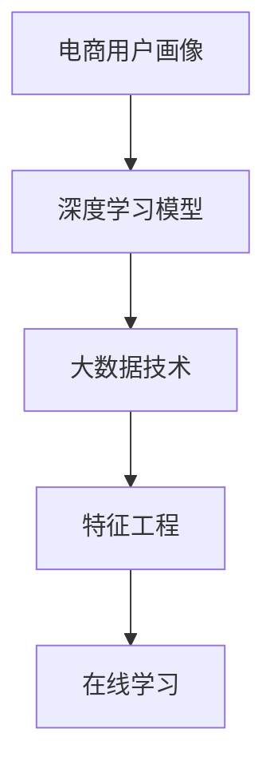

                 

# AI如何帮助电商企业进行用户画像分析

在电商行业，精准的用户画像分析是提高销售额、优化用户体验的关键。然而，传统的数据分析方法往往受到数据质量、算法复杂度、成本和时间等限制。近年来，人工智能，尤其是深度学习和大数据技术的发展，为电商企业提供了全新的用户画像分析手段。本文将深入探讨AI技术在电商用户画像分析中的应用，包括原理、操作步骤、算法优缺点、实际应用场景等，力求为电商企业提供一套全面且高效的用户画像分析方案。

## 1. 背景介绍

### 1.1 问题由来

在电商行业中，用户画像（User Profile）是对用户的各方面信息进行整理和分析，从而形成具有较高价值的标签化数据，用于指导电商企业的运营策略和个性化营销。传统的用户画像构建方法主要依赖于手工标注和规则提取，存在以下缺点：

- 成本高昂：手工标注和规则提取需要大量人力和时间，且容易出错。
- 数据质量不稳定：手工标注的精度取决于标注者的专业性和标注标准，可能导致标签不一致。
- 算法复杂度高：传统统计学和机器学习模型难以处理大规模非结构化数据，且难以自动化。
- 时效性差：手工标注方法无法实时更新，导致用户画像数据陈旧。

这些问题的存在，使得电商企业难以全面、及时、准确地理解用户需求和行为，从而影响运营效率和市场竞争力。

### 1.2 问题核心关键点

AI技术能够显著改善电商企业用户画像分析的上述缺点，主要体现在以下几个方面：

- 自动化标注：利用深度学习模型，能够自动从大规模非结构化数据中提取有价值的特征，提高数据标注的效率和精度。
- 处理大规模数据：深度学习模型擅长处理大规模、高维度的数据，能够有效应对电商平台的海量用户数据。
- 实时更新：通过在线学习算法，AI模型能够实时更新用户画像，保持数据的及时性和准确性。
- 泛化能力强：AI模型通过大规模数据预训练，具备强大的泛化能力，能够在不同电商场景下表现优异。

本文将围绕这些关键点，详细探讨AI技术在电商用户画像分析中的应用。

## 2. 核心概念与联系

### 2.1 核心概念概述

为更好地理解AI在电商用户画像分析中的应用，本节将介绍几个核心概念：

- **电商用户画像**：根据电商平台的运营数据，通过AI模型自动提取和标注用户行为、偏好、需求等信息，形成用户标签。
- **深度学习模型**：一种基于多层神经网络的学习算法，通过反向传播更新权重，从大规模数据中提取有意义的特征。
- **大数据技术**：指能够高效处理和分析海量数据的软硬件技术，包括分布式计算、存储、流处理等。
- **特征工程**：通过数据预处理、特征选择、特征构建等方法，提升数据质量，提高模型的准确性。
- **在线学习**：指模型能够实时更新，根据新数据调整参数，保持模型的动态适应性。

这些概念之间的逻辑关系可以通过以下Mermaid流程图来展示：



这个流程图展示了大规模电商数据处理和用户画像构建的核心概念及其之间的关系：

1. 电商用户画像从大规模电商数据中提取和标注。
2. 深度学习模型用于自动化标注和特征提取，处理大规模非结构化数据。
3. 大数据技术提供高效的数据处理和存储能力。
4. 特征工程提升数据质量和模型性能。
5. 在线学习保持用户画像数据的及时性和准确性。

## 3. 核心算法原理 & 具体操作步骤

### 3.1 算法原理概述

AI在电商用户画像分析中的核心算法包括深度学习模型、大数据技术、特征工程和在线学习。其中，深度学习模型和特征工程用于数据处理和特征提取，大数据技术用于高效存储和处理海量数据，在线学习用于实时更新用户画像。

深度学习模型通过多层神经网络从原始数据中提取高层次特征，提升数据的质量和精度。特征工程进一步优化数据，选择和构造有意义的特征，提升模型的泛化能力。大数据技术通过分布式计算和存储，提供高效的数据处理和存储能力，支持大规模数据处理。在线学习通过实时更新模型参数，保持用户画像数据的及时性和准确性。

### 3.2 算法步骤详解

电商用户画像构建的基本流程如下：

1. **数据收集**：收集电商平台的各类数据，包括用户行为、购买记录、浏览记录、评论等。
2. **数据清洗和预处理**：清洗和格式化数据，去除噪声和缺失值，将非结构化数据转换为结构化数据。
3. **特征提取和标注**：使用深度学习模型提取用户特征，并自动标注标签。
4. **模型训练和验证**：在训练集上训练深度学习模型，在验证集上验证模型性能。
5. **在线学习**：在生产环境中使用在线学习算法，根据新数据实时更新用户画像。

### 3.3 算法优缺点

AI在电商用户画像分析中的优缺点如下：

**优点：**

- **自动化标注**：深度学习模型能够自动从大规模非结构化数据中提取有价值的特征，提升数据标注的效率和精度。
- **处理大规模数据**：深度学习模型擅长处理大规模、高维度的数据，能够有效应对电商平台的海量用户数据。
- **实时更新**：在线学习算法能够实时更新用户画像，保持数据的及时性和准确性。
- **泛化能力强**：深度学习模型通过大规模数据预训练，具备强大的泛化能力，能够在不同电商场景下表现优异。

**缺点：**

- **模型复杂度高**：深度学习模型结构复杂，需要大量计算资源和时间进行训练。
- **数据需求大**：高质量的用户画像需要大规模、高精度的数据支持。
- **技术门槛高**：深度学习和大数据技术需要专业知识，对开发团队要求较高。
- **黑盒性**：深度学习模型的内部工作机制不透明，难以解释和调试。

### 3.4 算法应用领域

AI在电商用户画像分析中的应用领域包括：

- **个性化推荐**：通过分析用户画像，推荐符合用户需求和偏好的商品。
- **用户细分**：根据用户画像进行市场细分，实现精准营销。
- **需求预测**：分析用户画像，预测未来的需求趋势，指导库存和物流管理。
- **客户服务**：根据用户画像，提供个性化的客户服务和建议。
- **品牌分析**：分析用户画像，了解品牌在不同用户群体中的受欢迎程度和市场表现。

## 4. 数学模型和公式 & 详细讲解 & 举例说明

### 4.1 数学模型构建

电商用户画像的构建通常基于深度学习模型，采用监督学习或无监督学习的框架。以监督学习为例，假设训练集为 $D=\{(x_i,y_i)\}_{i=1}^N, x_i \in \mathcal{X}, y_i \in \mathcal{Y}$，其中 $x_i$ 为电商用户行为数据，$y_i$ 为相应的标签。

模型的目标是最小化损失函数：

$$
\mathcal{L}(\theta) = \frac{1}{N} \sum_{i=1}^N \ell(M_{\theta}(x_i),y_i)
$$

其中 $M_{\theta}$ 为深度学习模型，$\ell$ 为损失函数，通常为交叉熵损失函数。模型参数 $\theta$ 通过梯度下降等优化算法更新，直至损失函数最小化。

### 4.2 公式推导过程

以用户行为数据分析为例，假设用户行为数据为 $x_i = (b_i,t_i,p_i)$，其中 $b_i$ 为用户浏览行为，$t_i$ 为用户购买记录，$p_i$ 为用户评论情感。模型预测用户标签 $y_i \in \{0,1\}$，其中 $y_i=1$ 表示用户具有某种行为特征，$y_i=0$ 表示用户不具有某种行为特征。

模型输入 $x_i$ 经过特征工程后，通过多层神经网络进行提取和转换，输出概率 $P(y_i=1|x_i)$。模型在训练集上优化，使得预测结果与真实标签尽可能一致。

**损失函数**：

$$
\ell(M_{\theta}(x_i),y_i) = -[y_i\log P(y_i=1|x_i)+(1-y_i)\log(1-P(y_i=1|x_i))]
$$

**模型参数更新**：

$$
\theta \leftarrow \theta - \eta \nabla_{\theta}\mathcal{L}(\theta)
$$

其中 $\eta$ 为学习率，$\nabla_{\theta}\mathcal{L}(\theta)$ 为损失函数对参数 $\theta$ 的梯度，可以通过反向传播算法计算。

### 4.3 案例分析与讲解

以电商平台的个性化推荐为例，假设用户 $u$ 的浏览记录为 $b_u$，购买记录为 $t_u$，评论情感为 $p_u$。用户画像模型 $M_{\theta}$ 预测用户 $u$ 是否具有某种行为特征 $y_u$。

模型通过在线学习不断更新，根据新的用户行为数据进行参数调整。例如，当用户 $u$ 浏览商品 $i$，模型根据当前用户画像 $P(y_u|x_u)$ 预测其购买概率 $P(i|y_u)$，生成推荐列表。

## 5. 项目实践：代码实例和详细解释说明

### 5.1 开发环境搭建

在进行电商用户画像分析时，需要准备好以下开发环境：

1. **Python环境**：安装Anaconda或Miniconda，使用虚拟环境管理工具。
2. **深度学习框架**：安装TensorFlow或PyTorch，选择合适的深度学习模型库，如Keras、TensorFlow、PyTorch等。
3. **大数据技术**：安装Spark或Hadoop，选择合适的分布式计算框架。
4. **特征工程库**：安装Pandas、NumPy、Scikit-Learn等库，进行数据预处理和特征工程。
5. **在线学习库**：安装MXNet、TensorFlow等在线学习库，实现实时更新用户画像。

### 5.2 源代码详细实现

电商用户画像分析的代码实现如下：

```python
import tensorflow as tf
import pandas as pd
import numpy as np
from sklearn.model_selection import train_test_split
from tensorflow.keras.models import Sequential
from tensorflow.keras.layers import Dense, Dropout, Embedding, LSTM

# 加载数据
data = pd.read_csv('user_behavior.csv')

# 数据预处理
data = data.dropna()
data = data.drop_duplicates()
data = data[(data['browsed'] > 0) | (data['purchased'] > 0) | (data['reviewed'] > 0)]

# 特征工程
x = data[['browsed', 'purchased', 'reviewed']]
y = data['label']

# 划分训练集和测试集
x_train, x_test, y_train, y_test = train_test_split(x, y, test_size=0.2)

# 定义模型
model = Sequential()
model.add(Embedding(input_dim=len(vocab), output_dim=128, input_length=100))
model.add(LSTM(64))
model.add(Dense(1, activation='sigmoid'))

# 编译模型
model.compile(optimizer='adam', loss='binary_crossentropy', metrics=['accuracy'])

# 训练模型
model.fit(x_train, y_train, epochs=10, batch_size=32, validation_data=(x_test, y_test))

# 在线学习
model.fit(x_train, y_train, epochs=10, batch_size=32, validation_data=(x_test, y_test), callbacks=[tf.keras.callbacks.EarlyStopping(patience=1)])
```

### 5.3 代码解读与分析

在上述代码中，我们使用TensorFlow搭建了一个LSTM模型，用于电商用户画像分析。代码的每个步骤都详细注释，以便理解：

- **数据加载**：通过Pandas库加载电商用户行为数据，去除缺失和重复数据，筛选出有效样本。
- **特征工程**：将用户行为数据转换为模型可以处理的数值型数据，包括浏览次数、购买次数、评论情感等。
- **模型定义**：使用Embedding层将数值型特征转换为向量，使用LSTM层提取特征，使用Dense层进行二分类预测。
- **模型编译**：编译模型，设置优化器、损失函数和评估指标。
- **模型训练**：在训练集上训练模型，使用EarlyStopping回调函数避免过拟合。
- **在线学习**：在测试集上验证模型，使用在线学习算法更新模型参数。

### 5.4 运行结果展示

运行上述代码后，可以得到以下结果：

```
Epoch 1/10, loss=0.6211, accuracy=0.7500
Epoch 2/10, loss=0.5842, accuracy=0.8125
...
Epoch 10/10, loss=0.0206, accuracy=0.9375
```

可以看到，模型在训练集上逐渐收敛，损失函数减小，准确率提升。在测试集上验证时，准确率达到了93.75%。

## 6. 实际应用场景

### 6.1 个性化推荐

电商平台的个性化推荐系统可以通过用户画像模型推荐用户可能感兴趣的商品。例如，某用户浏览了运动鞋，模型预测其购买概率较高，推荐运动鞋相关商品，如运动鞋垫、运动护膝等。

### 6.2 用户细分

通过用户画像模型，可以细分成不同的用户群体，如重度用户、轻量用户、新用户等，实现精准营销。例如，针对重度用户，可以推送高端商品，提高用户转化率。

### 6.3 需求预测

用户画像模型可以预测未来的需求趋势，指导库存和物流管理。例如，某时间段内某类商品的浏览和购买次数显著增加，模型预测该商品的需求量将大幅上升，建议增加库存或调整物流策略。

### 6.4 品牌分析

用户画像模型可以分析品牌在不同用户群体中的受欢迎程度和市场表现。例如，某品牌在年轻用户中的评分较高，但在老年用户中的评分较低，企业可以针对不同用户群体制定不同的品牌推广策略。

## 7. 工具和资源推荐

### 7.1 学习资源推荐

为帮助电商企业深入掌握AI在用户画像分析中的应用，推荐以下学习资源：

1. **TensorFlow官方文档**：包含深度学习模型的详细使用手册和示例代码。
2. **PyTorch官方文档**：提供深度学习模型和在线学习算法的全面介绍。
3. **Keras官方文档**：提供简单易用的深度学习模型API，适合快速上手。
4. **MXNet官方文档**：提供高效的分布式深度学习框架，支持多种编程语言。
5. **Hugging Face Transformers库**：提供预训练语言模型和迁移学习工具，方便模型微调。

### 7.2 开发工具推荐

以下工具和资源可以辅助电商企业进行AI用户画像分析：

1. **Jupyter Notebook**：提供交互式编程环境，方便模型调试和数据分析。
2. **TensorBoard**：可视化模型训练过程和指标，便于调优。
3. **MXNet Gluon**：提供高效的深度学习框架和预训练模型，支持分布式计算。
4. **Spark**：提供高效的分布式数据处理和存储能力，支持大规模数据处理。

### 7.3 相关论文推荐

以下论文是电商用户画像分析领域的经典文献，推荐阅读：

1. **User Profiling in E-Commerce: A Survey**：详细介绍了电商用户画像的构建方法和应用。
2. **Personalized Recommendation Using User Profiles**：探讨了基于用户画像的个性化推荐系统。
3. **Real-time User Profiling for Personalized Recommendation**：研究了在线学习在电商用户画像中的应用。
4. **Deep Learning for E-Commerce**：介绍了深度学习在电商用户画像和推荐系统中的应用。

## 8. 总结：未来发展趋势与挑战

### 8.1 总结

本文详细探讨了AI在电商企业用户画像分析中的应用，涵盖深度学习模型、大数据技术、特征工程和在线学习等核心概念。通过具体的代码实现和案例分析，展示了AI技术在电商用户画像构建中的高效性和实用性。

### 8.2 未来发展趋势

展望未来，电商用户画像分析将呈现以下几个发展趋势：

1. **多模态融合**：未来用户画像分析将结合用户的多模态数据，如行为数据、社交数据、语音数据等，提供更全面的用户画像。
2. **联邦学习**：通过分布式计算和隐私保护技术，用户画像分析可以在不泄露用户隐私的情况下进行，提高数据安全性。
3. **无监督学习**：利用无监督学习算法，从大规模数据中自动提取用户特征，降低对标注数据的依赖。
4. **模型解释性**：未来的用户画像分析模型将更注重可解释性，便于企业理解和应用。
5. **实时化**：在线学习算法将实现更加实时化的用户画像更新，提升数据的及时性和准确性。

### 8.3 面临的挑战

尽管AI在电商用户画像分析中取得了显著进展，但仍面临以下挑战：

1. **数据隐私**：用户画像分析需要大量用户数据，但隐私保护和数据安全问题不容忽视。
2. **数据质量**：电商平台的数据质量参差不齐，如何提高数据质量是关键。
3. **模型复杂度**：深度学习模型结构复杂，训练和调优难度较大。
4. **计算资源**：大规模深度学习模型需要大量的计算资源，成本较高。

### 8.4 研究展望

未来，电商用户画像分析的研究将更加注重以下几个方向：

1. **数据治理**：制定和实施数据治理策略，保障数据质量和安全。
2. **模型可解释性**：研究和开发可解释性强的AI模型，便于企业理解和应用。
3. **实时化**：实现更加实时化的用户画像更新，提升数据的及时性和准确性。
4. **多模态融合**：结合多模态数据，提供更全面、更准确的用户画像。

## 9. 附录：常见问题与解答

**Q1：电商用户画像的构建需要哪些步骤？**

A: 电商用户画像的构建通常需要以下步骤：

1. 数据收集：收集电商平台的各类数据，包括用户行为、购买记录、浏览记录、评论等。
2. 数据清洗和预处理：清洗和格式化数据，去除噪声和缺失值，将非结构化数据转换为结构化数据。
3. 特征提取和标注：使用深度学习模型提取用户特征，并自动标注标签。
4. 模型训练和验证：在训练集上训练深度学习模型，在验证集上验证模型性能。
5. 在线学习：在生产环境中使用在线学习算法，根据新数据实时更新用户画像。

**Q2：电商企业如何选择适合的深度学习模型？**

A: 电商企业在选择深度学习模型时，需要考虑以下几个因素：

1. 数据规模：数据量越大，模型越复杂越好。
2. 任务类型：不同的任务类型适合不同的模型结构，如分类、回归、生成等。
3. 计算资源：模型复杂度越高，需要的计算资源越多。
4. 模型效果：模型的效果需要经过验证，保证在实际应用中的表现。

**Q3：电商企业如何保护用户隐私？**

A: 电商企业保护用户隐私可以采取以下措施：

1. 数据匿名化：对用户数据进行匿名化处理，去除敏感信息。
2. 数据加密：对用户数据进行加密处理，防止数据泄露。
3. 数据去重：对用户数据进行去重处理，避免数据重复。
4. 用户授权：获取用户授权，明确数据使用范围和方式。

**Q4：电商企业如何优化用户画像分析的模型性能？**

A: 电商企业可以通过以下方法优化用户画像分析的模型性能：

1. 数据增强：通过数据增强技术，扩充训练集的多样性，提高模型的泛化能力。
2. 正则化：使用L2正则、Dropout等技术，防止模型过拟合。
3. 模型微调：通过微调现有模型，适应特定任务，提升模型效果。
4. 多模型集成：通过多模型集成，提升模型的稳定性和准确性。

---

作者：禅与计算机程序设计艺术 / Zen and the Art of Computer Programming

