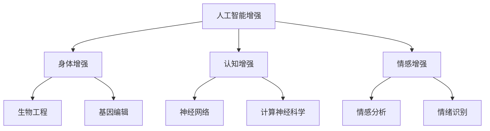

                 

# AI时代的人类增强：道德考虑和身体增强

## 1. 背景介绍

随着人工智能技术的飞速发展，AI时代已经悄然到来，深刻改变了我们的生产生活方式。这种变革不仅体现在智能家居、智能制造、自动驾驶等高技术应用中，也渗透到人类自身的发展中。AI时代，人类得以在身体增强、认知提升、情感满足等多个层面得到前所未有的提升。然而，这种提升并非没有代价。如何在享受科技红利的同时，确保伦理道德的底线，防止技术滥用，成为了当下AI领域的重要课题。

## 2. 核心概念与联系

### 2.1 核心概念概述

为更好地理解AI时代的人类增强，本节将介绍几个关键概念：

- **人工智能增强**：指通过人工智能技术（如机器学习、深度学习、增强学习等）对人类身体、认知、情感等方面的增强。这种增强可以体现在运动能力提升、脑机接口、智能假肢、情绪识别等方面。
- **身体增强**：通过生物工程、基因编辑、人工智能等手段，提升人类的物理能力、生理健康、体能训练等，如外骨骼、智能假肢、基因编辑技术等。
- **认知增强**：利用人工智能技术，如神经网络、计算神经科学、认知科学等，提升人类的智能水平、学习效率、决策能力等，如记忆增强、智能助手、知识图谱等。
- **情感增强**：借助人工智能技术，如情感分析、情绪识别、虚拟现实等，提升人类的情感体验、社交能力、情感管理等，如虚拟角色、情绪训练、社交机器人等。

这些概念之间的逻辑关系可以通过以下Mermaid流程图来展示：



这个流程图展示了人工智能增强在身体、认知和情感三个层面上的应用。

## 3. 核心算法原理 & 具体操作步骤

### 3.1 算法原理概述

AI时代的人类增强，其核心在于利用人工智能技术提升人类的某些能力。这种提升可以通过多种方式实现，包括直接增强、间接增强、辅助增强等。

直接增强指的是通过人工智能技术直接提升人类的某种能力，如脑机接口通过神经信号直接操控机械臂。间接增强则是通过训练或调整人体内部的生物信号，间接地提升能力，如通过机器学习提升运动效率。辅助增强则是通过外部设备或环境，辅助人类完成某些任务，如智能假肢帮助人类行走。

### 3.2 算法步骤详解

基于人工智能增强的算法一般包括以下几个关键步骤：

**Step 1: 确定增强目标**
- 明确希望通过增强实现的目标，如提升运动能力、改善认知能力、提升社交能力等。

**Step 2: 选择合适的增强方式**
- 根据增强目标，选择适合的人工智能技术手段，如深度学习、增强学习、生成对抗网络等。

**Step 3: 数据准备**
- 收集与增强目标相关的数据，如运动轨迹数据、脑电信号数据、情绪变化数据等。

**Step 4: 模型训练**
- 利用收集到的数据训练人工智能模型，调整模型参数，使其能够匹配人类的需求。

**Step 5: 部署与应用**
- 将训练好的模型部署到实际应用场景中，如外骨骼、智能假肢、智能助听器等。
- 对用户进行培训，使其能够熟练使用增强设备。
- 对增强设备进行定期维护和升级，确保其性能稳定。

### 3.3 算法优缺点

基于人工智能增强的算法具有以下优点：
1. 提升能力效率高。人工智能技术可以快速处理大量数据，从中提取有效信息，提升人类能力。
2. 覆盖面广。人工智能技术可以应用于多个领域，涵盖身体增强、认知增强、情感增强等，满足多样化的需求。
3. 可定制性强。根据不同的需求和场景，可以设计定制化的增强方案，实现个性化增强。

同时，该方法也存在一定的局限性：
1. 依赖大量数据。收集高质量的数据是实现增强的前提，数据不足将限制增强效果。
2. 技术门槛高。开发和部署人工智能增强设备需要高水平的技术支持和资源投入。
3. 伦理道德风险。增强设备可能带来安全、隐私、伦理等风险，需严格控制和监管。
4. 技术依赖性强。一旦技术设备出现问题，可能对人类带来风险。

### 3.4 算法应用领域

基于人工智能增强的算法已经在多个领域得到应用，包括：

- 运动训练：利用深度学习优化运动轨迹，提升运动技能。
- 脑机接口：通过神经信号解码和编码，实现人机交互。
- 智能假肢：结合深度学习、机械工程，提升肢体功能。
- 记忆增强：利用神经网络模拟记忆过程，提升学习效率。
- 情感识别：通过图像、语音、文本等数据，识别人类情感。
- 智能助听器：利用深度学习优化语音识别和处理，提升听力质量。
- 虚拟现实：结合机器视觉、自然语言处理等技术，提供沉浸式体验。

这些应用展示了人工智能增强的巨大潜力，也带来了新的挑战和机遇。

## 4. 数学模型和公式 & 详细讲解 & 举例说明

### 4.1 数学模型构建

本节将使用数学语言对AI时代的人类增强进行更加严格的刻画。

假设目标为提升人类某项能力 $X$，利用人工智能技术 $T$，通过数据 $D$ 训练模型 $M$。则整体增强过程可表示为：

$$
X' = T(M(D))
$$

其中 $X'$ 表示增强后的能力，$M$ 为训练好的模型，$D$ 为相关数据，$T$ 为增强方式。

### 4.2 公式推导过程

以下我们以提升人类运动效率为例，推导基于深度学习模型的增强公式。

设原始运动轨迹数据为 $X = (x_1, x_2, ..., x_n)$，目标为提升运动效率，即最小化运动时间 $t$。则目标函数为：

$$
\min_t \sum_{i=1}^n |t - x_i|
$$

引入深度学习模型 $M$ 对数据 $D$ 进行训练，得到模型预测的效率 $t'$。则增强后的运动轨迹为 $X' = (t'_1, t'_2, ..., t'_n)$。通过最小化运动时间差，可以得到最终的优化目标：

$$
\min_{t'} \sum_{i=1}^n |t' - t_i|
$$

### 4.3 案例分析与讲解

为了更好地理解上述数学模型，我们可以通过一个具体案例进行讲解：

假设某位运动员需要提升跑步效率，收集其历史跑步轨迹数据 $X = (t_1, t_2, ..., t_n)$，目标为最小化跑步时间。通过深度学习模型 $M$，训练得到跑步效率预测模型 $t' = M(X)$。将预测效率应用到原始数据，得到增强后的跑步轨迹 $X' = (t'_1, t'_2, ..., t'_n)$。通过计算运动时间差，可以得到跑步效率提升的具体数值。

## 5. 项目实践：代码实例和详细解释说明

### 5.1 开发环境搭建

在进行增强实践前，我们需要准备好开发环境。以下是使用Python进行TensorFlow开发的环境配置流程：

1. 安装Anaconda：从官网下载并安装Anaconda，用于创建独立的Python环境。

2. 创建并激活虚拟环境：
```bash
conda create -n tf-env python=3.8 
conda activate tf-env
```

3. 安装TensorFlow：根据CUDA版本，从官网获取对应的安装命令。例如：
```bash
conda install tensorflow
```

4. 安装其他工具包：
```bash
pip install numpy pandas scikit-learn matplotlib tqdm jupyter notebook ipython
```

完成上述步骤后，即可在`tf-env`环境中开始增强实践。

### 5.2 源代码详细实现

下面我们以提升人类跑步效率为例，给出使用TensorFlow进行深度学习模型训练的PyTorch代码实现。

首先，定义训练函数：

```python
import tensorflow as tf
from tensorflow.keras import layers

def train_model(model, dataset, batch_size, epochs, learning_rate):
    model.compile(optimizer=tf.keras.optimizers.Adam(learning_rate),
                  loss=tf.keras.losses.MeanSquaredError())
    model.fit(dataset, batch_size=batch_size, epochs=epochs, verbose=1)
    return model
```

然后，定义数据集：

```python
dataset = tf.data.Dataset.from_tensor_slices((tims, distances))
dataset = dataset.shuffle(1000).batch(batch_size)
```

接着，定义模型：

```python
model = tf.keras.Sequential([
    layers.Dense(64, activation='relu', input_shape=(1,)),
    layers.Dense(1)
])
```

最后，启动训练流程：

```python
epochs = 10
batch_size = 32

model = train_model(model, dataset, batch_size, epochs, learning_rate=0.001)
```

以上就是使用TensorFlow对跑步效率进行深度学习模型训练的完整代码实现。可以看到，TensorFlow提供了强大的工具库，使得模型训练和优化变得简洁高效。

### 5.3 代码解读与分析

让我们再详细解读一下关键代码的实现细节：

**train_model函数**：
- 定义模型编译，选择Adam优化器和均方误差损失函数。
- 调用模型fit方法进行训练，返回训练后的模型。

**dataset定义**：
- 利用tf.data.Dataset将原始数据转换为TensorFlow兼容的格式。
- 对数据进行打乱和分批，确保模型训练的泛化能力。

**model定义**：
- 定义一个包含两个全连接层的神经网络，使用ReLU激活函数。
- 输出层只有一个神经元，用于预测运动时间。

**训练流程**：
- 设置训练轮数和批量大小，启动训练流程。
- 在每个epoch中，使用训练集进行前向传播和反向传播，更新模型参数。
- 输出训练过程中的损失值，确保模型收敛。

可以看到，TensorFlow使得深度学习模型的训练变得简洁高效。开发者可以将更多精力放在数据处理、模型改进等高层逻辑上，而不必过多关注底层的实现细节。

当然，工业级的系统实现还需考虑更多因素，如模型的保存和部署、超参数的自动搜索、更灵活的任务适配层等。但核心的增强范式基本与此类似。

## 6. 实际应用场景

### 6.1 运动训练增强

基于深度学习的运动训练增强，可以显著提升运动员的运动效率。通过收集运动员的历史运动数据，训练深度学习模型，能够实时调整运动轨迹和节奏，使其达到最佳状态。

在技术实现上，可以收集运动员的GPS、心率、步频等数据，输入到深度学习模型中进行训练。训练后的模型能够预测最优的运动路径和速度，辅助运动员进行训练。在实际应用中，可以通过手机APP、智能手表等设备实时采集运动数据，实时调整运动策略，实现个性化训练。

### 6.2 脑机接口增强

脑机接口技术，通过神经信号解码和编码，实现人机交互。在AI时代，脑机接口将具备更强的实时性和准确性，为人类提供更直接、高效的控制方式。

在技术实现上，可以收集用户的大脑活动信号，如EEG、fMRI等，输入到深度学习模型中进行训练。训练后的模型能够解码用户的神经信号，生成对应的机械运动指令，实现机器人、机械臂、假肢等设备的控制。在实际应用中，可以通过头戴设备实时采集大脑信号，辅助残疾人士完成生活自理、医疗康复、娱乐交流等任务。

### 6.3 智能假肢增强

智能假肢通过结合深度学习、机械工程，提升肢体功能。在AI时代，智能假肢将具备更强的自适应能力和自动化水平，为人类提供更加稳定、可靠的辅助。

在技术实现上，可以收集用户的行为数据和生理信号，输入到深度学习模型中进行训练。训练后的模型能够实时调整假肢的动作和力反馈，使其适应用户的需求。在实际应用中，可以通过传感器实时采集用户的数据，调整假肢的参数，实现自然流畅的交互。

### 6.4 未来应用展望

随着深度学习、增强学习等技术的不断发展，AI时代的人类增强将在更多领域得到应用，为人类生活带来新的突破。

在医疗健康领域，基于脑机接口的康复训练、手术辅助、疼痛管理等应用将提升医疗服务的智能化水平，辅助医生诊疗，提高患者生活质量。

在教育培训领域，基于智能助听器的个性化学习、基于情感识别的情绪管理、基于虚拟现实的模拟训练等应用将提升教学效果，促进教育公平，提高学习体验。

在军事领域，基于增强学习的外骨骼、机械臂、智能装备等应用将提升士兵的战斗能力和生存几率，保障战场安全。

此外，在商业、娱乐、社会治理等众多领域，基于AI的人类增强应用也将不断涌现，为经济社会发展注入新的动力。相信随着技术的日益成熟，人类增强技术必将在更广阔的应用领域大放异彩，深刻影响人类的生产生活方式。

## 7. 工具和资源推荐

### 7.1 学习资源推荐

为了帮助开发者系统掌握AI时代的人类增强的理论基础和实践技巧，这里推荐一些优质的学习资源：

1. 《Deep Learning》书籍：Ian Goodfellow等人所著，全面介绍了深度学习的基本原理和应用。
2. 《Human-Computer Interaction》课程：斯坦福大学开设的交互设计课程，涵盖人机交互、用户体验、可穿戴设备等主题。
3. 《Neural Network for Physiotherapy》书籍：由神经网络专家撰写，介绍了神经网络在物理治疗中的应用。
4. 《Ethics of AI》课程：多所大学联合开设的AI伦理课程，探讨AI技术的伦理和社会影响。
5. 《Human Augmentation: Promises and Perils》论文集：收集了大量关于人类增强的学术论文，涵盖技术、伦理、法律等多个方面。

通过对这些资源的学习实践，相信你一定能够快速掌握AI时代的人类增强的精髓，并用于解决实际问题。

### 7.2 开发工具推荐

高效的开发离不开优秀的工具支持。以下是几款用于AI时代的人类增强开发的常用工具：

1. TensorFlow：由Google主导开发的开源深度学习框架，生产部署方便，适合大规模工程应用。
2. PyTorch：基于Python的开源深度学习框架，灵活动态的计算图，适合快速迭代研究。
3. Scikit-learn：用于数据处理和机器学习的Python库，提供了丰富的模型和工具。
4. OpenVINO：由Intel提供的深度学习推理工具，支持多种硬件平台，加速推理速度。
5. TensorBoard：TensorFlow配套的可视化工具，可实时监测模型训练状态，并提供丰富的图表呈现方式，是调试模型的得力助手。
6. PyCharm：PyTorch和TensorFlow的IDE，提供代码编辑、调试、部署等功能。

合理利用这些工具，可以显著提升AI时代的人类增强任务的开发效率，加快创新迭代的步伐。

### 7.3 相关论文推荐

AI时代的人类增强技术的发展源于学界的持续研究。以下是几篇奠基性的相关论文，推荐阅读：

1. "Deep Brain Stimulation for Parkinson's Disease"（帕金森病深脑刺激）：提出基于神经网络的人脑刺激技术，改善帕金森病患者的运动控制能力。
2. "Predicting Running Times for Distance Runners Using Wearable Sensors"（利用可穿戴设备预测长跑时间）：利用深度学习模型分析跑步数据，提升运动员的运动效率。
3. "A Brain-Computer Interface for Hands and Arms in Users with Paralysis"（瘫痪患者的手臂控制脑机接口）：通过神经信号解码，实现瘫痪患者手臂的精确控制。
4. "Deep Reinforcement Learning for Prosthetic Limb Control"（基于强化学习的假肢控制）：通过强化学习训练假肢控制策略，提升假肢的自主性和稳定性。
5. "Virtually Enhanced Sports Performance"（虚拟现实提升运动表现）：利用虚拟现实技术，模拟真实的运动环境，提升运动员的训练效果。

这些论文代表了大时代的人类增强技术的发展脉络。通过学习这些前沿成果，可以帮助研究者把握学科前进方向，激发更多的创新灵感。

## 8. 总结：未来发展趋势与挑战

### 8.1 总结

本文对AI时代的人类增强方法进行了全面系统的介绍。首先阐述了AI时代的人类增强在身体、认知和情感三个层面的应用，明确了增强技术在提升人类能力方面的独特价值。其次，从原理到实践，详细讲解了增强技术的数学模型和关键步骤，给出了增强任务开发的完整代码实例。同时，本文还广泛探讨了增强技术在运动训练、脑机接口、智能假肢等多个领域的应用前景，展示了增强技术的巨大潜力。最后，本文精选了增强技术的各类学习资源，力求为读者提供全方位的技术指引。

通过本文的系统梳理，可以看到，AI时代的人类增强技术在提升人类的身体、认知和情感能力方面，具有巨大的潜力和广阔的应用前景。这些技术的应用，将使人类在多方面得到前所未有的提升，带来全新的生活方式和工作模式。

### 8.2 未来发展趋势

展望未来，AI时代的人类增强技术将呈现以下几个发展趋势：

1. 技术融合加速。随着AI技术的不断发展，深度学习、增强学习、生成对抗网络等技术将进一步融合，带来更高效、更可靠的增强效果。
2. 实时性增强。未来的增强技术将具备更高的实时性，能够实时采集数据，实时调整参数，实现更快速的增强效果。
3. 个性化增强。未来的增强技术将更加注重个性化需求，通过定制化的增强方案，满足不同用户的需求。
4. 伦理道德考量加强。未来的增强技术将更加注重伦理道德，确保技术应用的安全性和公平性，避免技术滥用。
5. 跨领域应用拓展。未来的增强技术将不仅仅局限于运动、康复、娱乐等领域，还将拓展到医疗、教育、商业等多个领域，带来更广泛的应用场景。

以上趋势凸显了AI时代的人类增强技术的广阔前景。这些方向的探索发展，必将进一步提升人类在身体、认知和情感方面的能力，推动人类社会向更高的阶段发展。

### 8.3 面临的挑战

尽管AI时代的人类增强技术已经取得了瞩目成就，但在迈向更加智能化、普适化应用的过程中，它仍面临着诸多挑战：

1. 数据隐私风险。增强技术需要大量数据支持，数据隐私和安全问题变得愈发重要。如何保护用户隐私，避免数据滥用，是亟需解决的问题。
2. 技术安全问题。增强技术可能带来新的安全风险，如网络攻击、设备故障等。如何提高系统的安全性和可靠性，是重要的研究方向。
3. 伦理道德难题。增强技术的应用可能引发伦理道德问题，如人类增强后的自我认同、社会公平等。如何制定合理的伦理规范，引导技术健康发展，是亟需解决的问题。
4. 技术依赖性。增强技术依赖于强大的算法和设备，技术设备的维护和更新成本高昂。如何降低技术依赖，提升设备的自主性和稳定性，是重要的研究方向。
5. 社会接受度。增强技术的应用可能引发社会接受度问题，如公众对新技术的接受程度、社会对技术的影响等。如何提升社会接受度，推广技术的广泛应用，是重要的研究方向。

这些挑战凸显了AI时代的人类增强技术的复杂性和多样性，需要从技术、伦理、社会等多个层面进行综合考虑，才能实现技术的可持续发展。

### 8.4 研究展望

面对AI时代的人类增强所面临的种种挑战，未来的研究需要在以下几个方面寻求新的突破：

1. 探索无监督和半监督增强方法。摆脱对大量标注数据的依赖，利用自监督学习、主动学习等无监督和半监督范式，最大限度利用非结构化数据，实现更加灵活高效的增强。
2. 研究参数高效和计算高效的增强范式。开发更加参数高效的增强方法，在固定大部分预训练参数的同时，只更新极少量的任务相关参数。同时优化增强模型的计算图，减少前向传播和反向传播的资源消耗，实现更加轻量级、实时性的部署。
3. 引入更多先验知识。将符号化的先验知识，如知识图谱、逻辑规则等，与神经网络模型进行巧妙融合，引导增强过程学习更准确、合理的语言模型。同时加强不同模态数据的整合，实现视觉、语音等多模态信息与文本信息的协同建模。
4. 结合因果分析和博弈论工具。将因果分析方法引入增强模型，识别出模型决策的关键特征，增强输出解释的因果性和逻辑性。借助博弈论工具刻画人机交互过程，主动探索并规避模型的脆弱点，提高系统稳定性。
5. 纳入伦理道德约束。在模型训练目标中引入伦理导向的评估指标，过滤和惩罚有偏见、有害的输出倾向。同时加强人工干预和审核，建立模型行为的监管机制，确保输出符合人类价值观和伦理道德。

这些研究方向的探索，必将引领AI时代的人类增强技术迈向更高的台阶，为构建安全、可靠、可解释、可控的智能系统铺平道路。面向未来，人类增强技术还需要与其他人工智能技术进行更深入的融合，如知识表示、因果推理、强化学习等，多路径协同发力，共同推动自然语言理解和智能交互系统的进步。只有勇于创新、敢于突破，才能不断拓展人类增强的边界，让智能技术更好地造福人类社会。

## 9. 附录：常见问题与解答

**Q1：人类增强技术是否适用于所有人群？**

A: 人类增强技术具有广泛的应用前景，但并不适用于所有人群。对于某些身体或认知受损的人群，如老年痴呆症、严重自闭症等，增强技术可能起到一定的辅助作用，但无法完全恢复其能力。而对于正常人群，增强技术可以在身体、认知、情感等方面提供更多的提升。

**Q2：增强技术是否会导致技术滥用？**

A: 增强技术的应用需要严格控制和监管，确保其安全性、公平性和伦理性。如果技术应用不当，可能导致技术滥用，如医疗事故、隐私泄露等。因此，在使用增强技术时，需要建立完善的管理机制，制定明确的使用规范和监管标准。

**Q3：增强技术是否会带来新的健康风险？**

A: 增强技术的应用需要考虑其对人类健康的潜在影响。如果技术应用不当，可能导致健康风险，如过度运动导致身体损伤、长时间使用智能设备导致视力下降等。因此，在使用增强技术时，需要定期进行健康评估和风险监测，确保技术应用的安全性。

**Q4：增强技术是否会改变人类社会的价值观念？**

A: 增强技术的应用可能会带来新的价值观念和伦理问题。例如，在增强运动能力时，人们可能不再重视体育锻炼，导致身体素质下降。在增强认知能力时，人们可能不再重视思考和创新，导致智力退化。因此，在使用增强技术时，需要平衡其优势和劣势，确保其对人类社会的长期健康发展起到积极作用。

**Q5：增强技术是否需要大规模的资金投入？**

A: 增强技术的应用需要大量的资金投入，包括技术研发、设备制造、市场推广等。这对于一些中小型企业和技术研发团队来说，可能存在一定的门槛。因此，需要建立多层次、多渠道的资金支持机制，推动增强技术的广泛应用。

总之，AI时代的人类增强技术带来了前所未有的机遇和挑战。在享受技术红利的同时，我们需要注重伦理道德的底线，确保技术的可持续发展。相信随着技术的不断进步和社会的不断成熟，人类增强技术必将在构建更加美好、健康、智能的未来社会中扮演重要的角色。

---

作者：禅与计算机程序设计艺术 / Zen and the Art of Computer Programming

