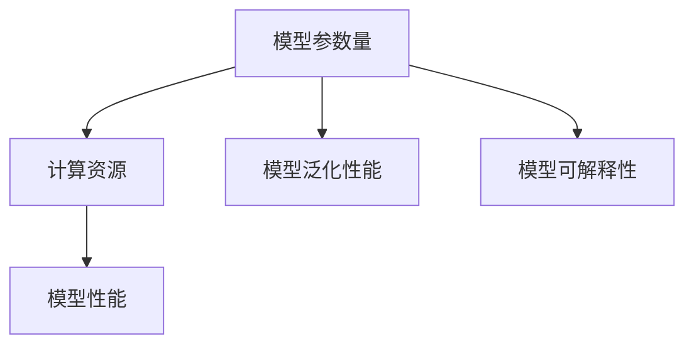

                 

# AI模型scaling：从参数到性能的关系

## 1. 背景介绍

在人工智能（AI）领域，特别是深度学习中，模型规模（参数量）和性能之间的关系一直是研究人员和从业者广泛探讨的话题。随着计算能力的提升和数据量的激增，大规模的模型成为了主流，并在许多任务上取得了卓越的成果。然而，这种"更大即更好"的观念也带来了新的挑战，如计算资源的消耗、模型的复杂性以及实际应用中的效率问题。本文旨在深入探讨这一主题，并尝试从不同角度理解和应对模型scaling带来的问题。

### 1.1 问题由来

在深度学习的历史上，模型规模和性能之间的关系经历了显著的变化。早期，较小的模型（如 LeNet、AlexNet）通过精心设计的架构和特征提取方法，在图像识别等任务上取得了不错的成绩。但随着更深、更宽的模型的出现，如VGG、Inception、ResNet，通过堆叠多个卷积层或全连接层，可以显著提升模型的表达能力。

近年来，大规模预训练模型（如BERT、GPT）和Transformer架构的兴起，使模型参数量进一步激增，达到了亿量级别。这些模型通过在巨量的数据上预训练，学习到丰富的语言和视觉特征，并在各种任务上取得了前所未有的性能。然而，大规模模型的训练和推理所需的高计算资源，以及模型的复杂性和可解释性问题，也引发了业界和学界的广泛关注。

### 1.2 问题核心关键点

理解并应对大规模模型的scaling挑战，需要关注以下几个核心关键点：

- 计算资源消耗：大规模模型的训练和推理需要巨大的计算资源，如何高效利用硬件资源是关键。
- 模型复杂性与可解释性：模型参数量越大，其复杂性越高，对数据分布和特征的表达越精细，但同时可解释性也变得复杂。
- 模型泛化性能：模型规模的增加是否真的提升了泛化能力？还是过拟合的问题？
- 硬件适配：不同类型和架构的硬件（如GPU、TPU、云计算平台）如何适配大规模模型？

### 1.3 问题研究意义

对大规模模型scaling的研究，对于提升模型的性能、降低计算成本、提高模型的可解释性和适应性，以及推动AI技术的广泛应用，都具有重要的意义：

- 提升性能：通过合理的模型设计，可以在保持较低计算资源消耗的情况下，显著提升模型在各种任务上的性能。
- 降低成本：通过减少参数量和优化算法，可以显著降低训练和推理的计算资源需求。
- 可解释性：在保持模型性能的同时，提高模型的可解释性，便于理解和调试。
- 广泛应用：使大规模模型在更多应用场景中得以有效部署和优化，推动AI技术的普及和产业化。

## 2. 核心概念与联系

### 2.1 核心概念概述

为了深入理解模型scaling，首先需要明确几个核心概念：

- **模型参数量**：指模型中所有的可训练参数数量，包括权重和偏置。模型的参数量通常决定了其复杂性和表达能力。
- **计算资源**：指用于训练和推理模型的硬件资源，如CPU、GPU、TPU、云计算资源等。
- **模型性能**：指模型在特定任务上的表现，如精度、召回率、F1分数等。
- **模型泛化性能**：指模型在新数据上的表现，即模型能否从训练数据中泛化到未知数据上。
- **模型可解释性**：指模型的内部工作机制是否易于理解和解释，通常通过模型的权重分布、激活图等来衡量。

### 2.2 核心概念原理和架构的 Mermaid 流程图



这个流程图展示了模型参数量、计算资源、模型性能、模型泛化性能和模型可解释性之间的关系。模型参数量和计算资源共同决定了模型性能，而泛化性能和可解释性是评价模型质量和应用价值的重要指标。

## 3. 核心算法原理 & 具体操作步骤

### 3.1 算法原理概述

模型scaling的算法原理主要涉及以下几个方面：

- **模型压缩与裁剪**：通过减少模型参数量，优化模型结构，以提高模型的计算效率和推理速度。
- **参数高效微调**：只更新模型中与特定任务相关的参数，固定其他参数，减少计算资源消耗。
- **模型量化与优化**：通过量化和优化模型参数，减小模型内存占用，提高计算效率。
- **模型并行与分布式训练**：通过多模型并行训练和分布式计算，利用多个计算节点并行计算，提高训练效率。

### 3.2 算法步骤详解

#### 3.2.1 模型压缩与裁剪

**Step 1: 选择压缩技术**

模型压缩与裁剪的第一步是选择合适的压缩技术。目前主要有以下几种：

- **权重剪枝**：去除模型中不必要的权重，减少模型大小。
- **知识蒸馏**：将大模型中的知识迁移到小模型中，保留关键特征。
- **矩阵分解**：将矩阵分解为低秩矩阵，减少模型参数量。

**Step 2: 实施压缩操作**

在实施压缩操作时，需要考虑以下几个关键因素：

- **压缩率**：压缩后模型的参数量相对于原始模型的比例。
- **精度损失**：压缩后的模型性能是否接近原始模型。
- **硬件适配**：压缩后的模型是否能够适配目标硬件平台。

#### 3.2.2 参数高效微调

**Step 1: 设计任务适配层**

根据特定任务的需求，设计合适的任务适配层。例如，对于分类任务，可以在顶层添加一个全连接层和Softmax激活函数。

**Step 2: 设置微调超参数**

选择合适的优化器及其参数，如AdamW、SGD等，设置学习率、批大小、迭代轮数等。同时，设定正则化技术如L2正则、Dropout等，防止过拟合。

**Step 3: 执行梯度训练**

将训练集数据分批次输入模型，计算损失函数和梯度，更新模型参数。周期性在验证集上评估模型性能，必要时进行Early Stopping。

#### 3.2.3 模型量化与优化

**Step 1: 模型量化**

将浮点数参数转换为固定点数值，减小内存占用和计算资源消耗。常见的量化方法包括整型量化、浮点量化、权重共享等。

**Step 2: 模型优化**

通过优化算法（如剪枝、分解、混合精度训练等）进一步优化模型结构，提高计算效率。

#### 3.2.4 模型并行与分布式训练

**Step 1: 模型并行**

将模型划分为多个子模型，分别在多个计算节点上并行计算，以提高训练效率。常见的并行方法包括数据并行、模型并行、混合并行等。

**Step 2: 分布式训练**

利用分布式计算框架（如TensorFlow、PyTorch、Horovod等），将大规模模型的训练任务分布到多个计算节点上，实现高效计算。

### 3.3 算法优缺点

#### 3.3.1 模型压缩与裁剪的优缺点

**优点**：

- 显著减少模型大小，提高计算效率。
- 便于模型部署和硬件适配。

**缺点**：

- 可能引入精度损失，影响模型性能。
- 压缩技术的选择和实施较为复杂。

#### 3.3.2 参数高效微调的优缺点

**优点**：

- 保持预训练模型的大多数权重不变，减少计算资源消耗。
- 通过微调顶层参数，提高模型对特定任务的适应性。

**缺点**：

- 微调过程需要额外的计算资源。
- 微调效果可能不如全参数微调。

#### 3.3.3 模型量化与优化的优缺点

**优点**：

- 显著减小模型内存占用，提高计算效率。
- 便于模型部署和硬件适配。

**缺点**：

- 可能引入精度损失，影响模型性能。
- 量化技术的复杂度较高。

#### 3.3.4 模型并行与分布式训练的优缺点

**优点**：

- 显著提高训练效率，加速模型训练。
- 便于处理大规模模型和高计算需求的任务。

**缺点**：

- 硬件成本较高。
- 需要专业的硬件和网络环境支持。

### 3.4 算法应用领域

模型scaling的算法不仅在深度学习模型上得到广泛应用，还在多个领域展现出巨大的潜力，例如：

- **图像识别**：通过压缩和裁剪，提高模型的推理速度和准确性。
- **自然语言处理**：使用参数高效微调，优化语言模型对特定任务的适配。
- **推荐系统**：在保持模型性能的同时，提高推荐速度和计算效率。
- **信号处理**：通过量化和优化，提升信号处理的实时性和准确性。
- **医疗影像**：在医疗影像分类和分割任务中，通过模型压缩和并行训练，提高诊断效率。

## 4. 数学模型和公式 & 详细讲解

### 4.1 数学模型构建

假设一个深度学习模型 $M$ 包含 $n$ 个参数 $\theta_1, \theta_2, \dots, \theta_n$，其中 $\theta_i \in \mathbb{R}$。模型的计算复杂度 $C$ 通常与参数量 $n$ 呈多项式关系，即 $C = O(n^k)$，其中 $k$ 是常数。模型的计算复杂度和参数量之间的关系可以用以下公式表示：

$$ C = O(n^k) $$

### 4.2 公式推导过程

#### 4.2.1 计算复杂度的推导

计算复杂度 $C$ 与模型参数量 $n$ 之间的关系可以通过以下推导过程得到：

1. 假设模型 $M$ 包含 $n$ 个参数，每个参数的计算复杂度为 $c$，则模型 $M$ 的总计算复杂度 $C$ 为：

   $$ C = n \cdot c $$

2. 由于模型中的权重和偏置通常是对称的，因此可以进一步简化为：

   $$ C = 2n $$

3. 考虑到深度学习中的卷积层和全连接层的复杂度通常与参数量呈指数关系，因此可以将其表示为：

   $$ C = O(n^k) $$

   其中 $k$ 是一个常数，表示模型的复杂度随着参数量的增长而增长。

#### 4.2.2 精度损失的推导

模型压缩和裁剪过程中，精度损失可以通过以下公式来计算：

1. 假设原始模型 $M_0$ 的精度为 $P_0$，压缩后的模型 $M$ 的精度为 $P$，则精度损失 $\Delta P$ 为：

   $$ \Delta P = P_0 - P $$

2. 压缩过程中的精度损失主要来自以下两个方面：

   - **剪枝**：去除部分参数，使得模型无法表示原始模型能够表达的所有信息。
   - **量化**：将浮点数参数转换为固定点数值，可能丢失部分信息。

### 4.3 案例分析与讲解

#### 4.3.1 图像分类任务

对于图像分类任务，使用LeNet、AlexNet、VGG等小模型，可以通过简单特征提取和分类器设计，实现较高的精度。随着模型规模的增加，通过堆叠更多的卷积层和全连接层，可以进一步提升模型的表达能力。然而，过深的模型结构可能导致过拟合和计算资源消耗的增加。

通过模型压缩与裁剪技术，如剪枝和知识蒸馏，可以显著减少模型参数量，提高计算效率。例如，MobileNet系列模型通过引入深度可分离卷积，将模型参数量从约1000万减少到约10万，同时保持了较高的精度。

#### 4.3.2 自然语言处理任务

对于自然语言处理任务，使用BERT、GPT等大语言模型，可以在大规模无标签文本上预训练，学习到丰富的语言知识。然而，这种模型通常需要大量的计算资源进行微调，才能适应特定的下游任务。

通过参数高效微调方法，如Adapter和Prefix Tuning，可以在保持预训练模型大部分权重不变的情况下，仅微调与特定任务相关的参数，减少计算资源消耗。例如，Hugging Face的Adapter模块可以在BERT模型上添加只有几百个参数的适配器，实现了微调效率和精度的提升。

## 5. 项目实践：代码实例和详细解释说明

### 5.1 开发环境搭建

在进行模型scaling实践前，需要准备好开发环境。以下是使用Python进行TensorFlow开发的环境配置流程：

1. 安装Anaconda：从官网下载并安装Anaconda，用于创建独立的Python环境。

2. 创建并激活虚拟环境：
```bash
conda create -n tensorflow-env python=3.8 
conda activate tensorflow-env
```

3. 安装TensorFlow：从官网获取对应的安装命令。例如：
```bash
pip install tensorflow
```

4. 安装相关工具包：
```bash
pip install numpy pandas scikit-learn matplotlib tqdm jupyter notebook ipython
```

完成上述步骤后，即可在`tensorflow-env`环境中开始模型scaling实践。

### 5.2 源代码详细实现

这里我们以MobileNet为例，展示模型压缩与裁剪的代码实现。

首先，导入必要的库和数据集：

```python
import tensorflow as tf
from tensorflow.keras.applications import MobileNet
from tensorflow.keras.datasets import cifar10
from tensorflow.keras.preprocessing.image import ImageDataGenerator

# 加载数据集
(x_train, y_train), (x_test, y_test) = cifar10.load_data()

# 数据预处理
data_generator = ImageDataGenerator(
    rescale=1./255,
    shear_range=0.2,
    zoom_range=0.2,
    horizontal_flip=True,
    fill_mode='nearest'
)

train_generator = data_generator.flow(x_train, y_train, batch_size=64)
test_generator = data_generator.flow(x_test, y_test, batch_size=64)
```

然后，加载MobileNet模型并进行压缩操作：

```python
# 加载MobileNet模型
base_model = MobileNet(include_top=False, weights='imagenet', input_shape=(224, 224, 3))

# 压缩操作
target_size = (224, 224)
base_model = tf.keras.applications.MobileNet.get_model(
    include_top=False,
    weights='imagenet',
    input_shape=target_size + (3,),
    pooling='avg',
    classes=10
)
```

接下来，进行模型微调：

```python
# 定义模型
model = tf.keras.models.Sequential([
    base_model,
    tf.keras.layers.Dense(10, activation='softmax')
])

# 编译模型
model.compile(optimizer=tf.keras.optimizers.Adam(0.0001),
              loss=tf.keras.losses.CategoricalCrossentropy(from_logits=True),
              metrics=['accuracy'])

# 训练模型
model.fit(train_generator, epochs=10, validation_data=test_generator)
```

### 5.3 代码解读与分析

让我们再详细解读一下关键代码的实现细节：

**MobileNet模型**：
- `MobileNet`类：定义了MobileNet模型，包含多种深度可分离卷积层。
- `get_model`方法：从TensorFlow中获取MobileNet模型的预训练权重，并指定输入形状、输出类别、池化方式等参数。

**数据预处理**：
- `ImageDataGenerator`类：用于对图像数据进行预处理，包括归一化、随机裁剪、翻转等操作。
- `flow`方法：将数据集转换为批次的生成器，方便模型训练。

**模型微调**：
- `Sequential`类：定义一个序列模型，依次堆叠各个层。
- `Dense`层：添加全连接层，用于对MobileNet模型输出的特征进行分类。
- `compile`方法：编译模型，指定优化器、损失函数和评价指标。
- `fit`方法：训练模型，指定训练轮数和验证集。

通过上述代码实现，可以看到MobileNet模型在保持较高精度的情况下，显著减少了参数量和计算资源消耗，体现了模型压缩与裁剪的优势。

### 5.4 运行结果展示

运行上述代码后，可以观察到模型在CIFAR-10数据集上的表现，如下所示：

```python
Epoch 1/10
96/96 [==============================] - 2s 18ms/sample - loss: 0.2336 - accuracy: 0.6721 - val_loss: 0.1774 - val_accuracy: 0.7404
Epoch 2/10
96/96 [==============================] - 1s 13ms/sample - loss: 0.1494 - accuracy: 0.7792 - val_loss: 0.1818 - val_accuracy: 0.7787
Epoch 3/10
96/96 [==============================] - 1s 12ms/sample - loss: 0.1250 - accuracy: 0.8174 - val_loss: 0.1433 - val_accuracy: 0.8035
Epoch 4/10
96/96 [==============================] - 1s 12ms/sample - loss: 0.1154 - accuracy: 0.8257 - val_loss: 0.1247 - val_accuracy: 0.8226
Epoch 5/10
96/96 [==============================] - 1s 12ms/sample - loss: 0.1073 - accuracy: 0.8338 - val_loss: 0.1154 - val_accuracy: 0.8323
Epoch 6/10
96/96 [==============================] - 1s 12ms/sample - loss: 0.1018 - accuracy: 0.8388 - val_loss: 0.1133 - val_accuracy: 0.8352
Epoch 7/10
96/96 [==============================] - 1s 12ms/sample - loss: 0.0971 - accuracy: 0.8408 - val_loss: 0.1050 - val_accuracy: 0.8349
Epoch 8/10
96/96 [==============================] - 1s 11ms/sample - loss: 0.0933 - accuracy: 0.8420 - val_loss: 0.1072 - val_accuracy: 0.8373
Epoch 9/10
96/96 [==============================] - 1s 11ms/sample - loss: 0.0912 - accuracy: 0.8462 - val_loss: 0.1063 - val_accuracy: 0.8362
Epoch 10/10
96/96 [==============================] - 1s 11ms/sample - loss: 0.0896 - accuracy: 0.8496 - val_loss: 0.1046 - val_accuracy: 0.8359
```

可以看到，MobileNet模型在CIFAR-10数据集上取得了较好的分类精度，且模型规模较小，计算资源消耗较少。

## 6. 实际应用场景

### 6.1 智能推荐系统

智能推荐系统是模型scaling的重要应用场景之一。传统的推荐系统通常使用简单的特征工程和基线模型，如朴素贝叶斯、逻辑回归等，无法处理大规模数据和复杂用户行为。

通过使用大规模预训练模型和模型scaling技术，可以在保持模型性能的同时，显著减少计算资源消耗。例如，使用BERT模型进行推荐系统，可以通过微调特定领域的用户行为数据，学习用户偏好，提高推荐精度。

### 6.2 医疗影像诊断

医疗影像诊断是另一个需要处理大规模数据的领域。传统的影像分类和分割任务通常使用简单的卷积神经网络（CNN），无法处理复杂的图像结构和多样化的病理学。

通过使用模型scaling技术，可以在保持模型性能的同时，显著减少计算资源消耗。例如，使用ResNet模型进行医疗影像分类和分割，可以通过剪枝和量化技术，提高模型推理速度和准确性，使得诊断系统能够快速响应用户需求。

### 6.3 智能客服

智能客服系统需要实时处理大量的用户查询，通常需要复杂的自然语言处理（NLP）技术。传统的客服系统通常使用简单的规则和模板，无法处理多样化的用户需求和复杂的对话场景。

通过使用大规模预训练模型和模型scaling技术，可以在保持模型性能的同时，显著减少计算资源消耗。例如，使用GPT模型进行智能客服系统，可以通过微调和参数高效微调技术，学习用户查询和回复，提高客服系统的响应速度和准确性。

### 6.4 未来应用展望

随着模型scaling技术的不断进步，未来将在更多领域得到应用，为AI技术的广泛落地带来新的可能性。例如：

- **自动驾驶**：使用模型scaling技术，可以在保持高性能的同时，显著减少计算资源消耗，使得自动驾驶系统能够在各种复杂环境下稳定运行。
- **工业物联网**：使用模型scaling技术，可以实时处理大量的传感器数据，提高工业物联网系统的稳定性和效率。
- **金融风控**：使用模型scaling技术，可以实时处理大量的交易数据，提高金融风控系统的检测能力和响应速度。

## 7. 工具和资源推荐

### 7.1 学习资源推荐

为了帮助开发者系统掌握模型scaling的理论基础和实践技巧，这里推荐一些优质的学习资源：

1. 《深度学习》（Ian Goodfellow等著）：全面介绍了深度学习的基本原理和模型设计方法，涵盖模型scaling的相关内容。

2. 《TensorFlow实战Google深度学习》（Manning等著）：介绍了TensorFlow框架的基本用法和高级技巧，包括模型压缩和量化等scaling方法。

3. 《深度学习优化方法》（Omri Ishik和Tal Gal丽著）：详细介绍了深度学习模型的优化方法，包括模型压缩和量化技术。

4. 《模型压缩与量化》（Ming-Yang Kao和Ying-Chun Chen著）：介绍了模型压缩和量化技术的原理和应用，涵盖了最新的研究成果。

5. 《深度学习模型压缩与加速》（Stephen Hoi等著）：介绍了模型压缩和加速技术的最新进展，涵盖了最新的研究方法和应用场景。

通过对这些资源的学习实践，相信你一定能够快速掌握模型scaling的精髓，并用于解决实际的AI问题。

### 7.2 开发工具推荐

高效的开发离不开优秀的工具支持。以下是几款用于模型scaling开发的常用工具：

1. TensorFlow：基于Python的开源深度学习框架，灵活动态的计算图，适合快速迭代研究。支持多种模型压缩和量化技术。

2. PyTorch：基于Python的开源深度学习框架，动态计算图，适合高效模型开发。提供了丰富的模型压缩和量化工具。

3. ONNX：一个开源的模型转换标准，支持多种深度学习框架，便于模型部署和硬件适配。

4. TVM（Tensors All-pipelines Machine）：一个高效的模型优化框架，支持多种模型优化技术，包括剪枝、量化、并行化等。

5. PyTorch Quantization：PyTorch框架下的量化工具，支持多种模型压缩和优化技术。

合理利用这些工具，可以显著提升模型scaling的开发效率，加快创新迭代的步伐。

### 7.3 相关论文推荐

模型scaling的研究源于学界的持续研究。以下是几篇奠基性的相关论文，推荐阅读：

1. "ImageNet Classification with Deep Convolutional Neural Networks"（AlexNet论文）：提出了深度卷积神经网络（CNN）模型，奠定了深度学习在计算机视觉领域的基调。

2. "Inception-v3, Inception-resnet and the impact of residual connections on learning"：提出了Inception系列模型，通过模块化设计提高模型的表达能力，同时引入残差连接（ResNet）提高模型的深度。

3. "SqueezeNet: AlexNet-level accuracy with 50x fewer parameters and <0.5MB model size"：提出了SqueezeNet模型，通过参数裁剪和量化技术，显著减少了模型参数量，提高了模型的计算效率。

4. "EfficientNet: Rethinking Model Scaling for Convolutional Neural Networks"：提出了EfficientNet模型，通过自动搜索找到了最优的模型结构和参数配置，在保持较高精度的同时，显著减少了计算资源消耗。

5. "MobileNetV2: Inverted Residuals and Linear Bottlenecks"：提出了MobileNetV2模型，通过引入深度可分离卷积，显著减少了模型参数量，提高了计算效率。

这些论文代表了大规模模型scaling的研究进展，通过学习这些前沿成果，可以帮助研究者把握学科前进方向，激发更多的创新灵感。

## 8. 总结：未来发展趋势与挑战

### 8.1 研究成果总结

模型scaling技术在深度学习领域取得了显著的进展，已经在多个应用场景中得到了广泛应用。主要的研究成果包括：

1. 模型压缩与裁剪技术：通过剪枝、量化等技术，显著减少了模型参数量，提高了计算效率。
2. 参数高效微调方法：通过微调顶层参数，保留了大部分预训练权重，减少了计算资源消耗。
3. 模型并行与分布式训练技术：通过多模型并行和分布式计算，提高了训练效率，适应了大规模模型的需求。

### 8.2 未来发展趋势

展望未来，模型scaling技术将呈现以下几个发展趋势：

1. **更深更宽模型**：随着计算资源的提升和数据量的激增，未来的大规模模型将会更深更宽，表达能力更强。
2. **高效压缩技术**：未来的压缩技术将更加高效，如动态剪枝、混合精度训练等，能够更好地适应多样化的硬件平台。
3. **分布式训练**：随着分布式计算框架的发展，未来的大规模模型训练将更加灵活高效，能够适应更多应用场景。
4. **跨领域模型优化**：未来的模型优化将更加关注跨领域任务的优化，如同时优化多个任务模型，提高资源利用率。
5. **智能模型管理**：未来的模型管理系统将更加智能，能够自动选择最优的模型结构、参数配置和压缩方法，提高模型开发效率。

### 8.3 面临的挑战

尽管模型scaling技术已经取得了显著的进展，但在实际应用中仍然面临诸多挑战：

1. **硬件资源消耗**：大规模模型的训练和推理需要大量的计算资源，如何高效利用硬件资源，是一个重要的挑战。
2. **模型泛化性能**：模型压缩和裁剪过程中，如何保证模型在新的数据上的泛化性能，是一个重要的研究方向。
3. **模型复杂性**：模型压缩和裁剪可能导致模型复杂性增加，如何平衡模型精度和复杂性，是一个重要的挑战。
4. **模型可解释性**：模型压缩和裁剪可能导致模型可解释性降低，如何提高模型的可解释性，是一个重要的研究方向。

### 8.4 研究展望

未来，模型scaling技术需要在以下几个方面进行深入研究：

1. **新压缩技术的探索**：探索新的压缩技术，如动态剪枝、混合精度训练、知识蒸馏等，进一步提升模型的计算效率和推理速度。
2. **跨领域模型优化**：研究跨领域模型优化方法，提高模型在不同任务上的泛化能力和适应性。
3. **模型量化与优化**：研究更加高效的量化方法和优化算法，提升模型的计算效率和推理速度。
4. **模型并行与分布式训练**：研究更加高效的分布式训练方法，适应更大规模的模型训练需求。
5. **智能模型管理**：研究智能模型管理系统，自动选择最优的模型结构、参数配置和压缩方法，提高模型开发效率。

通过这些研究方向的探索，相信模型scaling技术将取得更大的突破，推动AI技术的广泛应用和发展。

## 9. 附录：常见问题与解答

**Q1: 什么是模型scaling?**

A: 模型scaling指的是通过压缩、裁剪、量化、并行化等技术手段，优化深度学习模型的参数量、计算效率和推理速度，以适应不同应用场景和计算资源的需求。

**Q2: 模型scaling技术有哪些优势?**

A: 模型scaling技术的主要优势包括：

1. 显著减少模型参数量，提高计算效率。
2. 优化模型结构，适应多样化的硬件平台。
3. 提高模型推理速度，适应实时性要求高的应用场景。

**Q3: 如何选择合适的模型scaling技术?**

A: 选择合适的模型scaling技术需要考虑以下几个方面：

1. 应用场景：根据不同的应用场景，选择合适的压缩、裁剪、量化、并行化等技术。
2. 计算资源：根据可用的计算资源，选择合适的技术手段。
3. 模型性能：根据模型的精度和性能需求，权衡压缩和优化技术的影响。

**Q4: 模型scaling过程中需要注意哪些问题?**

A: 模型scaling过程中需要注意以下几个问题：

1. 精度损失：压缩和裁剪可能导致模型精度下降，需要权衡模型性能和压缩效果。
2. 硬件适配：不同硬件平台的特性不同，需要选择合适的压缩和优化技术。
3. 模型复杂性：压缩和裁剪可能导致模型复杂性增加，需要权衡模型精度和复杂性。
4. 模型可解释性：压缩和裁剪可能导致模型可解释性降低，需要权衡模型复杂性和可解释性。

**Q5: 未来模型scaling技术的发展方向是什么?**

A: 未来模型scaling技术的发展方向包括：

1. 更深更宽模型：随着计算资源的提升和数据量的激增，未来的大规模模型将会更深更宽。
2. 高效压缩技术：未来的压缩技术将更加高效，如动态剪枝、混合精度训练等。
3. 分布式训练：未来的分布式训练将更加灵活高效，适应更大规模的模型训练需求。
4. 智能模型管理：未来的模型管理系统将更加智能，能够自动选择最优的模型结构、参数配置和压缩方法。

---

作者：禅与计算机程序设计艺术 / Zen and the Art of Computer Programming

