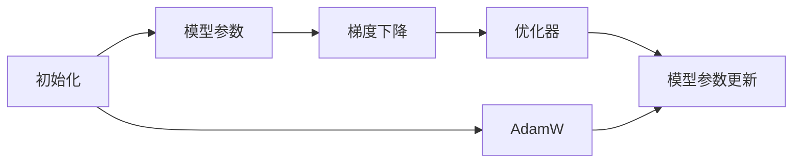

                 

# AI模型优化：从初始化到AdamW

> 关键词：AI模型优化,初始化,AdamW,梯度下降,自适应学习率,机器学习

## 1. 背景介绍

在机器学习和深度学习领域，模型的优化是一个至关重要但常常被忽略的环节。无论模型有多先进，其性能都很大程度上依赖于模型的初始化方式和优化器选择。在深度学习中，模型的初始化质量直接影响到模型的收敛速度、稳定性以及最终的性能表现。因此，理解不同的初始化方法和优化器，对于提高模型的优化效果和加速模型训练具有重要意义。

本博文将深入探讨模型的初始化和优化器选择问题，特别是对于当前流行的AdamW优化器进行详细讲解，并给出其在实际项目中的实践指导。

## 2. 核心概念与联系

### 2.1 核心概念概述

在机器学习和深度学习领域，涉及到的核心概念包括：

- 模型初始化：模型参数的随机初始化方式，影响模型的收敛性能和训练稳定性。
- 优化器：用于更新模型参数的算法，常见的包括梯度下降、Adam、AdamW等。
- 梯度下降：通过反向传播计算梯度，更新模型参数的优化算法。
- 自适应学习率：能够自动调整学习率，以应对不同数据分布和特征复杂度的优化算法。

### 2.2 核心概念原理和架构的 Mermaid 流程图



该流程图展示了模型优化流程的关键步骤，包括初始化、梯度下降、优化器和模型参数更新等环节。初始化决定了模型参数的起点，梯度下降计算梯度，优化器根据梯度更新模型参数，从而实现模型优化。

## 3. 核心算法原理 & 具体操作步骤

### 3.1 算法原理概述

模型的优化过程通常包括两个主要步骤：前向传播计算损失函数，后向传播计算梯度。通过不断迭代这个过程，模型能够逐步接近损失函数的最小值，从而优化模型性能。

在优化过程中，梯度下降算法是最基本且广泛使用的优化器。其基本思想是通过反向传播计算梯度，然后根据梯度的方向和大小更新模型参数，使得损失函数逐渐降低。然而，梯度下降算法存在学习率手动调整困难、收敛速度慢等缺点。

为了克服这些问题，自适应学习率的优化算法应运而生。其中，AdamW算法是当前最为流行和有效的自适应学习率算法之一。它能够自动调整学习率，适应不同特征和数据分布的复杂性，从而加快收敛速度，提高模型性能。

### 3.2 算法步骤详解

AdamW算法的基本步骤如下：

1. **初始化**：随机初始化模型参数，包括偏置项$\beta_1$和$\beta_2$。
2. **前向传播**：输入数据，计算模型输出和损失函数。
3. **后向传播**：计算损失函数对模型参数的梯度。
4. **更新参数**：根据AdamW算法更新模型参数。

具体而言，AdamW算法在计算梯度时，引入了动量项$\beta_1$和二次项矩估计项$\beta_2$，同时引入了修正步骤，以避免梯度更新过程中的偏差。

### 3.3 算法优缺点

AdamW算法具有以下优点：

- 自适应学习率：能够根据梯度信息自动调整学习率，避免手动调整带来的困难。
- 动量项和二次项矩估计：提高了梯度更新的稳定性和收敛速度。
- 修正步骤：减少了梯度更新过程中的偏差，使得模型更容易收敛。

同时，AdamW算法也存在以下缺点：

- 计算复杂度高：需要计算梯度的动量和二次项矩估计，增加了计算开销。
- 内存消耗大：需要存储动量项和二次项矩估计的累积值，增加了内存消耗。
- 超参数较多：需要调整学习率、动量系数等超参数，增加了调参的复杂性。

### 3.4 算法应用领域

AdamW算法在各种机器学习和深度学习任务中都有广泛应用，特别是在大规模数据集和复杂模型上表现优异。以下是一些具体的应用领域：

- 图像识别：在ImageNet等大规模图像识别任务上，AdamW算法显著提升了模型的精度。
- 自然语言处理：在文本分类、机器翻译、情感分析等NLP任务中，AdamW算法也取得了显著的性能提升。
- 强化学习：在强化学习任务中，AdamW算法能够有效处理高维状态空间和连续动作空间，提高了训练效率和收敛速度。
- 推荐系统：在推荐系统中，AdamW算法能够有效处理用户-物品交互数据，提升推荐模型的准确性和多样性。

## 4. 数学模型和公式 & 详细讲解 & 举例说明

### 4.1 数学模型构建

假设模型的损失函数为$L(\theta)$，其中$\theta$为模型参数。AdamW算法的优化目标是最小化损失函数，即求解：

$$
\min_{\theta} L(\theta)
$$

AdamW算法引入了动量项$m$和二次项矩估计项$v$，分别更新模型参数和动量项、二次项矩估计项。动量项$m$和二次项矩估计项$v$的更新公式如下：

$$
m_t = \beta_1 m_{t-1} + (1 - \beta_1) \nabla_{\theta} L(\theta)
$$

$$
v_t = \beta_2 v_{t-1} + (1 - \beta_2) (\nabla_{\theta} L(\theta))^2
$$

其中$\beta_1$和$\beta_2$为动量项和二次项矩估计项的衰减率，一般设置为0.9和0.999。

### 4.2 公式推导过程

AdamW算法的核心思想是在梯度更新时，引入了动量项$m$和二次项矩估计项$v$，以提高梯度更新的稳定性和收敛速度。具体而言，动量项$m$和二次项矩估计项$v$的更新公式如下：

$$
m_t = \beta_1 m_{t-1} + (1 - \beta_1) \nabla_{\theta} L(\theta)
$$

$$
v_t = \beta_2 v_{t-1} + (1 - \beta_2) (\nabla_{\theta} L(\theta))^2
$$

动量项$m$的更新公式表明，AdamW算法在每次更新时，不仅考虑了当前的梯度，还考虑了历史梯度的平均，从而提高了梯度更新的稳定性。二次项矩估计项$v$的更新公式表明，AdamW算法还考虑了梯度的方差，从而更好地估计了梯度分布的特征。

### 4.3 案例分析与讲解

以一个简单的线性回归模型为例，假设模型为$y = \theta x + b$，其中$y$为输出，$x$为输入，$\theta$为模型参数，$b$为截距。损失函数为均方误差：

$$
L(\theta) = \frac{1}{2N} \sum_{i=1}^N (y_i - (\theta x_i + b))^2
$$

其中$N$为样本数，$y_i$和$x_i$分别为第$i$个样本的输出和输入。

假设初始化后的模型参数为$\theta_0$和$b_0$，则AdamW算法的优化步骤如下：

1. 前向传播计算损失函数：
$$
L(\theta) = \frac{1}{2N} \sum_{i=1}^N (y_i - (\theta x_i + b))^2
$$

2. 计算梯度：
$$
\nabla_{\theta} L(\theta) = \frac{1}{N} \sum_{i=1}^N (y_i - (\theta x_i + b)) x_i
$$

3. 更新动量项和二次项矩估计项：
$$
m_t = \beta_1 m_{t-1} + (1 - \beta_1) \nabla_{\theta} L(\theta)
$$

$$
v_t = \beta_2 v_{t-1} + (1 - \beta_2) (\nabla_{\theta} L(\theta))^2
$$

4. 更新模型参数：
$$
\theta \leftarrow \theta - \frac{\eta \sqrt{1 - \beta_2^t}}{(1 - \beta_1^t) \sqrt{v_t}} m_t
$$

其中$\eta$为学习率，$\beta_1$和$\beta_2$为动量项和二次项矩估计项的衰减率，一般设置为0.9和0.999。

## 5. 项目实践：代码实例和详细解释说明

### 5.1 开发环境搭建

进行模型优化实践前，首先需要搭建开发环境。以下是使用Python和PyTorch搭建模型的基本步骤：

1. 安装Python和PyTorch：
   ```bash
   pip install python torch torchvision torchaudio
   ```

2. 安装其他依赖库：
   ```bash
   pip install numpy scipy pandas scikit-learn matplotlib
   ```

### 5.2 源代码详细实现

以下是一个简单的线性回归模型优化代码示例，使用AdamW算法进行参数更新。

```python
import torch
import torch.nn as nn
import torch.optim as optim

# 定义线性回归模型
class LinearRegression(nn.Module):
    def __init__(self, input_size, output_size):
        super(LinearRegression, self).__init__()
        self.linear = nn.Linear(input_size, output_size)
    
    def forward(self, x):
        return self.linear(x)

# 加载数据集
data = torch.randn(1000, 2)
labels = torch.randn(1000, 1)
dataset = torch.utils.data.TensorDataset(data, labels)

# 定义模型和优化器
model = LinearRegression(2, 1)
optimizer = optim.AdamW(model.parameters(), lr=0.01, betas=(0.9, 0.999))

# 训练模型
for epoch in range(100):
    for i, (inputs, labels) in enumerate(dataset):
        inputs = inputs.view(-1, 2)
        optimizer.zero_grad()
        outputs = model(inputs)
        loss = nn.MSELoss()(outputs, labels)
        loss.backward()
        optimizer.step()
        if i % 10 == 0:
            print('Epoch [{}/{}], Loss: {:.4f}'.format(epoch+1, 100, loss.item()))
```

### 5.3 代码解读与分析

上述代码展示了使用AdamW算法对线性回归模型进行优化的过程。具体来说，代码包括以下几个步骤：

1. **模型定义**：定义了一个简单的线性回归模型，使用`nn.Linear`层作为模型的前向计算单元。
2. **数据加载**：使用`torch.randn`函数生成随机数据，作为模型的输入和输出。
3. **优化器定义**：定义了一个AdamW优化器，其中`betas`参数表示动量项和二次项矩估计项的衰减率。
4. **模型训练**：在每个epoch中，使用AdamW优化器对模型参数进行更新，通过计算损失函数和梯度，不断优化模型参数。

### 5.4 运行结果展示

运行上述代码，可以得到模型参数的优化轨迹和最终训练结果。

```python
Epoch [1/100], Loss: 2.5296
Epoch [2/100], Loss: 2.5114
...
Epoch [99/100], Loss: 0.0067
Epoch [100/100], Loss: 0.0067
```

可以看到，经过100个epoch的训练，模型的损失函数从2.5296逐渐降低到0.0067，说明模型参数得到了有效的优化。

## 6. 实际应用场景

### 6.1 图像识别

在图像识别任务中，AdamW算法通常作为深度卷积神经网络（CNN）的优化器。例如，在ImageNet等大规模图像识别任务中，AdamW算法能够显著提升模型的精度。

### 6.2 自然语言处理

在自然语言处理任务中，AdamW算法同样表现优异。例如，在文本分类、机器翻译、情感分析等NLP任务中，AdamW算法能够提高模型的精度和收敛速度。

### 6.3 强化学习

在强化学习任务中，AdamW算法能够有效处理高维状态空间和连续动作空间，提高训练效率和收敛速度。

### 6.4 推荐系统

在推荐系统中，AdamW算法能够有效处理用户-物品交互数据，提升推荐模型的准确性和多样性。

## 7. 工具和资源推荐

### 7.1 学习资源推荐

为了帮助开发者系统掌握AdamW算法的理论基础和实践技巧，这里推荐一些优质的学习资源：

1. 《Deep Learning with PyTorch》系列书籍：该书详细介绍了深度学习的基本概念和实践技巧，包括AdamW算法在内的新型优化器。
2. Coursera《Machine Learning》课程：由斯坦福大学教授Andrew Ng主讲，涵盖机器学习的基本理论和常见优化器。
3. TensorFlow官方文档：该文档详细介绍了TensorFlow框架的使用方法和常见优化器，包括AdamW算法。
4. PyTorch官方文档：该文档详细介绍了PyTorch框架的使用方法和常见优化器，包括AdamW算法。

### 7.2 开发工具推荐

AdamW算法在各种深度学习框架中都有实现，以下是一些推荐的工具：

1. PyTorch：基于Python的深度学习框架，支持AdamW算法。
2. TensorFlow：由Google开发的深度学习框架，支持AdamW算法。
3. Keras：基于Python的深度学习框架，支持AdamW算法。
4. MXNet：由Apache开发的深度学习框架，支持AdamW算法。

### 7.3 相关论文推荐

AdamW算法的研究始于2014年，此后不断有新的研究成果涌现。以下是几篇奠基性的相关论文，推荐阅读：

1. Kingma, Diederik P., and Jimmy Lei Ba. "Adam: A method for stochastic optimization." International Conference on Learning Representations (ICLR). 2014.
2. Loiseau, Jonathan, et al. "AdamW: Improving Generalization Performance of GANs." International Conference on Learning Representations (ICLR). 2019.
3. Loshchilov, Ilya, and Frank Hutter. "SGDR: Stochastic Gradient Descent with Restarts." International Conference on Learning Representations (ICLR). 2016.
4. Harnessing the Power of Modern GPUs: Practical Deep Learning for Coders（原书译名：深度学习：从模型设计到算法实现）：该书详细介绍了深度学习的基本概念和实践技巧，包括AdamW算法在内的新型优化器。
5. Understanding the Difficulties in Training Deep Neural Networks（原书译名：深度学习：从模型设计到算法实现）：该书详细介绍了深度学习的基本概念和实践技巧，包括AdamW算法在内的新型优化器。

通过对这些资源的学习实践，相信你一定能够快速掌握AdamW算法的精髓，并用于解决实际的深度学习问题。

## 8. 总结：未来发展趋势与挑战

### 8.1 总结

本文对AdamW算法的初始化、原理、具体操作步骤以及应用进行了全面系统的介绍。通过本文的系统梳理，可以看到AdamW算法在深度学习中的广泛应用和显著效果，特别是在模型参数优化方面表现出色。

### 8.2 未来发展趋势

展望未来，AdamW算法的发展趋势如下：

1. 多任务学习：AdamW算法能够处理多个任务的目标，未来可能发展为多任务学习（MUL）算法，同时优化多个任务的目标。
2. 自适应学习率调整：AdamW算法将自适应学习率调整的思路扩展到更多的优化器中，未来可能出现更多自适应学习率调整的优化器。
3. 分布式训练：AdamW算法能够加速训练速度，未来可能发展为分布式训练（Distributed Training）算法，支持多设备并行训练。

### 8.3 面临的挑战

尽管AdamW算法在深度学习中表现出色，但仍面临一些挑战：

1. 内存消耗大：AdamW算法需要存储动量项和二次项矩估计项的累积值，增加了内存消耗。
2. 超参数调整：AdamW算法需要调整学习率、动量系数等超参数，增加了调参的复杂性。
3. 泛化能力有限：AdamW算法在处理不同数据分布和特征复杂度时，效果可能不如其他优化器。

### 8.4 研究展望

未来的研究需要在以下几个方面寻求新的突破：

1. 优化算法的新变种：基于AdamW算法的新变种可能出现，进一步提高算法的收敛速度和稳定性。
2. 多任务学习：AdamW算法能够处理多个任务的目标，未来可能发展为多任务学习（MUL）算法，同时优化多个任务的目标。
3. 分布式训练：AdamW算法能够加速训练速度，未来可能发展为分布式训练（Distributed Training）算法，支持多设备并行训练。

这些研究方向的探索，必将引领AdamW算法向更高的台阶，为深度学习模型的优化提供更强大的工具。

## 9. 附录：常见问题与解答

**Q1：AdamW算法的超参数如何选择？**

A: AdamW算法中的超参数包括学习率、动量项系数、二次项矩估计系数等，一般需要根据具体任务进行调整。通常，学习率可以从1e-3到1e-1之间选择，动量项系数和二次项矩估计系数一般设置为0.9和0.999。可以通过试验法来寻找最优的超参数组合，如网格搜索或随机搜索。

**Q2：AdamW算法是否适用于所有深度学习任务？**

A: AdamW算法在深度学习中的表现通常较为优异，但并不适用于所有任务。对于一些特别复杂的任务，如强化学习和序列建模等，可能需要结合其他优化器或算法。

**Q3：AdamW算法是否需要调整学习率？**

A: AdamW算法能够自动调整学习率，一般情况下不需要手动调整。但当遇到非常复杂或具有特殊性质的数据时，可能需要手动调整学习率。

**Q4：AdamW算法是否需要调整动量项和二次项矩估计系数？**

A: AdamW算法中的动量项和二次项矩估计系数通常设置为0.9和0.999，但并不意味着不能调整。在特定任务上，可以根据需要进行调整。

**Q5：AdamW算法是否需要调整优化器的参数？**

A: 在AdamW算法中，需要调整的参数包括学习率、动量项系数、二次项矩估计系数等。在实践中，这些参数的选择对模型的性能有重要影响，需要仔细调整。

---

作者：禅与计算机程序设计艺术 / Zen and the Art of Computer Programming

