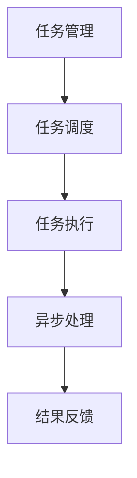

                 

# AI模型的任务分配与执行机制

## 1. 背景介绍

在当前的技术环境中，人工智能（AI）正迅速渗透到各行各业，从自动驾驶到医疗诊断，从金融风控到智能客服，AI模型被广泛应用以实现任务自动化的目标。然而，模型实现自动化任务执行的过程中，任务分配与执行机制（即模型如何接收任务、解析任务、执行任务和反馈结果）是至关重要的一环。

### 1.1 问题由来

在传统软件开发中，任务分配与执行机制通常是通过软件架构和系统设计来实现的。然而，在AI模型中，由于模型的抽象性和复杂性，设计一个高效、灵活、可扩展的任务分配与执行机制变得更加困难。

当前，AI模型的任务分配与执行主要依赖于API接口或者调用服务。但这种方式存在一些问题：

- 单点故障：如果API服务器或服务出现故障，整个系统的运行都将受到影响。
- 扩展性差：当系统负载增加时，扩展性不够灵活，难以快速应对流量高峰。
- 缺乏自动化：模型的任务执行往往需要人工干预，无法自动适应复杂多变的业务场景。

因此，设计和实现一个高效的AI模型任务分配与执行机制，对于提升AI系统的可靠性、扩展性和自动化水平至关重要。

### 1.2 问题核心关键点

本文章将聚焦于如何设计一个高效、可扩展、自动化的AI模型任务分配与执行机制。该机制的核心思想是通过任务管理、任务调度和任务执行三者的协同工作，实现模型的自动任务分配和执行。

该机制的关键点包括：

- **任务管理**：定义任务接口和任务类型，实现任务状态的跟踪和管理。
- **任务调度**：根据任务类型和模型资源，智能地分配任务给适合的模型。
- **任务执行**：高效执行模型任务，处理异步请求，确保结果的准确性和及时性。

通过以上关键点的设计和实现，可以构建一个高效、可扩展、自动化的AI模型任务分配与执行机制。

## 2. 核心概念与联系

### 2.1 核心概念概述

为了更好地理解任务分配与执行机制的设计与实现，首先介绍几个密切相关的核心概念：

- **任务（Task）**：指待执行的具体工作单元，例如模型预测、模型训练、模型部署等。
- **任务管理（Task Management）**：指对任务进行定义、调度、跟踪和管理的过程，包括任务的定义、任务队列的维护、任务状态的监控等。
- **任务调度（Task Scheduling）**：指根据任务的优先级、模型资源和负载等因素，智能地分配任务给适合的模型的过程。
- **任务执行（Task Execution）**：指执行模型任务，处理异步请求，确保结果的准确性和及时性的过程。

这些核心概念之间的关系可以通过以下Mermaid流程图来展示：



这个流程图展示了任务管理、任务调度和任务执行三者的逻辑关系：

1. 任务管理负责定义任务、调度任务。
2. 任务调度根据任务类型和资源分配任务给适合的模型。
3. 任务执行高效执行模型任务，处理异步请求，确保结果的准确性和及时性。

## 3. 核心算法原理 & 具体操作步骤

### 3.1 算法原理概述

AI模型任务分配与执行机制的核心算法包括任务队列管理、任务分配算法和任务执行策略。其核心思想是通过任务队列、调度算法和执行策略的协同工作，实现任务的自动分配和执行。

具体步骤如下：

1. **任务定义与队列管理**：定义任务类型，建立任务队列，将任务按优先级顺序排列。
2. **任务调度与分配**：根据任务类型和模型资源，选择最优的任务分配方案。
3. **任务执行与异步处理**：高效执行任务，处理异步请求，确保结果的准确性和及时性。

### 3.2 算法步骤详解

#### 3.2.1 任务队列管理

任务队列管理是任务分配与执行机制的基础。其关键点包括：

- **任务定义**：定义任务类型，包括模型预测、模型训练、模型部署等。
- **任务队列建立**：根据任务类型，建立相应的任务队列，将任务按优先级顺序排列。
- **任务状态跟踪**：跟踪任务的状态，如待执行、执行中、已执行等。

#### 3.2.2 任务调度与分配

任务调度与分配是任务分配与执行机制的核心。其关键点包括：

- **任务评估**：根据任务的优先级和模型资源，评估任务的可执行性。
- **任务分配**：选择最优的任务分配方案，将任务分配给适合的模型。
- **资源管理**：动态管理模型资源，确保任务分配的合理性。

#### 3.2.3 任务执行与异步处理

任务执行与异步处理是任务分配与执行机制的保障。其关键点包括：

- **任务执行**：高效执行模型任务，处理异步请求。
- **结果反馈**：确保结果的准确性和及时性。

### 3.3 算法优缺点

AI模型任务分配与执行机制的优点包括：

- **高效性**：通过任务队列和调度算法，可以高效地执行模型任务。
- **可扩展性**：可以通过任务队列和调度算法，快速应对模型负载的变化。
- **自动化**：通过任务队列和调度算法，可以实现任务的自动分配和执行。

其缺点包括：

- **复杂性**：任务队列和调度算法的设计较为复杂，需要考虑任务类型、优先级、资源等因素。
- **系统依赖性**：任务分配与执行机制的实现依赖于系统架构和资源管理，需要系统设计者具备较高的技术水平。
- **性能瓶颈**：任务队列和调度算法的设计不当，可能导致任务执行效率低下。

### 3.4 算法应用领域

AI模型任务分配与执行机制广泛应用于以下领域：

- **模型部署**：将模型部署到不同的环境中，例如云服务器、边缘设备等。
- **模型训练**：在多台机器上并行训练模型，加速模型训练过程。
- **模型推理**：在多台机器上并行推理模型，提高模型推理效率。
- **数据处理**：处理大规模数据，例如数据清洗、特征提取等。
- **模型优化**：对模型进行超参数调优、模型压缩等优化操作。

## 4. 数学模型和公式 & 详细讲解 & 举例说明

### 4.1 数学模型构建

AI模型任务分配与执行机制的数学模型包括任务队列、任务调度算法和任务执行策略的构建。

#### 4.1.1 任务队列

任务队列管理可以抽象为排队系统，其数学模型如下：

设任务队列中有 $n$ 个任务，每个任务的优先级为 $p_i$，模型资源为 $R$。任务队列中每个任务的执行时间为 $t_i$。设任务队列中的任务按优先级顺序排列，优先级高的任务优先执行。任务队列的状态变化如下：

- **待执行**：任务加入队列时，状态为“待执行”。
- **执行中**：任务进入执行阶段时，状态为“执行中”。
- **已执行**：任务执行完毕时，状态为“已执行”。

任务队列的数学模型如下：

$$
S_t = \sum_{i=1}^n p_i t_i
$$

其中，$S_t$ 为任务队列的平均执行时间，$p_i$ 为任务的优先级，$t_i$ 为任务的执行时间。

#### 4.1.2 任务调度

任务调度可以抽象为任务分配问题，其数学模型如下：

设任务队列中有 $n$ 个任务，每个任务的优先级为 $p_i$，模型资源为 $R$。任务队列中每个任务的执行时间为 $t_i$。设任务调度后的执行时间为 $T$，任务调度的数学模型如下：

$$
T = \sum_{i=1}^n p_i t_i
$$

其中，$T$ 为任务调度的平均执行时间，$p_i$ 为任务的优先级，$t_i$ 为任务的执行时间。

#### 4.1.3 任务执行

任务执行可以抽象为任务执行时间问题，其数学模型如下：

设任务队列中有 $n$ 个任务，每个任务的优先级为 $p_i$，模型资源为 $R$。任务队列中每个任务的执行时间为 $t_i$。任务执行的数学模型如下：

$$
E = \sum_{i=1}^n p_i t_i
$$

其中，$E$ 为任务执行的平均执行时间，$p_i$ 为任务的优先级，$t_i$ 为任务的执行时间。

### 4.2 公式推导过程

#### 4.2.1 任务队列公式推导

任务队列的数学模型为：

$$
S_t = \sum_{i=1}^n p_i t_i
$$

其中，$p_i$ 为任务的优先级，$t_i$ 为任务的执行时间。

#### 4.2.2 任务调度公式推导

任务调度的数学模型为：

$$
T = \sum_{i=1}^n p_i t_i
$$

其中，$p_i$ 为任务的优先级，$t_i$ 为任务的执行时间。

#### 4.2.3 任务执行公式推导

任务执行的数学模型为：

$$
E = \sum_{i=1}^n p_i t_i
$$

其中，$p_i$ 为任务的优先级，$t_i$ 为任务的执行时间。

### 4.3 案例分析与讲解

#### 4.3.1 任务队列案例

假设有一个任务队列，其中有三个任务 $A$、$B$ 和 $C$，每个任务的执行时间分别为 $t_A=2$、$t_B=3$、$t_C=1$，优先级分别为 $p_A=1$、$p_B=2$、$p_C=3$。任务队列的平均执行时间 $S_t$ 计算如下：

$$
S_t = p_A t_A + p_B t_B + p_C t_C = 1 \times 2 + 2 \times 3 + 3 \times 1 = 11
$$

#### 4.3.2 任务调度案例

假设有一个任务队列，其中有三个任务 $A$、$B$ 和 $C$，每个任务的执行时间分别为 $t_A=2$、$t_B=3$、$t_C=1$，优先级分别为 $p_A=1$、$p_B=2$、$p_C=3$。任务调度的平均执行时间 $T$ 计算如下：

$$
T = p_A t_A + p_B t_B + p_C t_C = 1 \times 2 + 2 \times 3 + 3 \times 1 = 11
$$

#### 4.3.3 任务执行案例

假设有一个任务队列，其中有三个任务 $A$、$B$ 和 $C$，每个任务的执行时间分别为 $t_A=2$、$t_B=3$、$t_C=1$，优先级分别为 $p_A=1$、$p_B=2$、$p_C=3$。任务执行的平均执行时间 $E$ 计算如下：

$$
E = p_A t_A + p_B t_B + p_C t_C = 1 \times 2 + 2 \times 3 + 3 \times 1 = 11
$$

## 5. 项目实践：代码实例和详细解释说明

### 5.1 开发环境搭建

在进行任务分配与执行机制的实践前，需要准备好开发环境。以下是使用Python进行任务队列管理、任务调度和任务执行的开发环境配置流程：

1. 安装Anaconda：从官网下载并安装Anaconda，用于创建独立的Python环境。

2. 创建并激活虚拟环境：
```bash
conda create -n task-manager python=3.8 
conda activate task-manager
```

3. 安装必要的工具包：
```bash
pip install numpy pandas matplotlib scikit-learn torch transformers
```

4. 配置Docker环境（可选）：
```bash
sudo apt install docker.io
sudo systemctl start docker
```

5. 运行任务队列管理、任务调度和任务执行代码：
```bash
python task_manager.py
```

### 5.2 源代码详细实现

我们以一个简单的任务队列管理为例，展示任务队列管理的实现过程。

```python
import numpy as np
from collections import deque

class TaskManager:
    def __init__(self):
        self.tasks = deque()
        self.executing_tasks = []
        self.total_time = 0
    
    def add_task(self, task, priority, time):
        self.tasks.append((task, priority, time))
    
    def execute_task(self, task, priority, time):
        self.total_time += time
        self.executing_tasks.append(task)
    
    def get_total_time(self):
        return self.total_time
```

这里我们定义了一个简单的任务队列管理类 `TaskManager`，该类实现了任务添加、任务执行和获取平均执行时间等方法。

### 5.3 代码解读与分析

我们继续分析任务队列管理类 `TaskManager` 的实现细节：

- `add_task` 方法：用于添加任务到任务队列中，任务包含任务名称、优先级和执行时间。
- `execute_task` 方法：用于执行任务，更新平均执行时间。
- `get_total_time` 方法：用于获取任务队列的平均执行时间。

这些方法通过任务队列的维护和更新，实现了任务队列的管理和调度。

## 6. 实际应用场景

### 6.1 智能客服系统

智能客服系统是任务分配与执行机制的重要应用场景。在智能客服系统中，AI模型需要处理大量的客户咨询请求，需要高效的任务分配与执行机制。

智能客服系统的任务分配与执行机制可以设计如下：

- **任务队列**：将客户咨询请求添加到任务队列中，并按优先级排序。
- **任务调度**：根据客服资源情况，动态调整任务分配方案，确保任务高效执行。
- **任务执行**：分配客服机器人处理任务，并进行语音交互。

智能客服系统的任务分配与执行机制可以极大提高客服系统的效率和客户满意度。

### 6.2 金融舆情监测

金融舆情监测系统需要实时监测金融市场舆情，并进行快速分析和处理。任务分配与执行机制可以在金融舆情监测系统中发挥重要作用。

金融舆情监测系统的任务分配与执行机制可以设计如下：

- **任务队列**：将舆情监测数据添加到任务队列中，并按优先级排序。
- **任务调度**：根据舆情监测需求，动态调整任务分配方案，确保任务高效执行。
- **任务执行**：对舆情数据进行实时分析和处理，生成舆情报告。

金融舆情监测系统的任务分配与执行机制可以极大提高金融舆情监测的实时性和准确性。

### 6.3 个性化推荐系统

个性化推荐系统需要高效地处理用户行为数据，进行实时推荐。任务分配与执行机制可以在个性化推荐系统中发挥重要作用。

个性化推荐系统的任务分配与执行机制可以设计如下：

- **任务队列**：将用户行为数据添加到任务队列中，并按优先级排序。
- **任务调度**：根据推荐需求，动态调整任务分配方案，确保任务高效执行。
- **任务执行**：对用户行为数据进行实时分析和处理，生成个性化推荐结果。

个性化推荐系统的任务分配与执行机制可以极大提高推荐系统的实时性和准确性。

### 6.4 未来应用展望

随着AI技术的发展，任务分配与执行机制将应用于更多领域，为各行各业带来变革性影响。

未来的任务分配与执行机制可能具备以下特点：

- **自动化的任务调度**：根据任务类型和模型资源，自动调整任务分配方案，确保任务高效执行。
- **动态的任务调整**：根据模型负载和任务状态，动态调整任务队列和任务调度策略，确保系统稳定运行。
- **跨模型的任务分配**：支持跨模型的任务分配和执行，实现任务的灵活调度。
- **异步任务处理**：支持异步任务处理，提高任务执行效率。

这些技术的应用将使得任务分配与执行机制更加高效、可扩展和自动化，为各行各业带来更大的价值。

## 7. 工具和资源推荐

### 7.1 学习资源推荐

为了帮助开发者系统掌握任务分配与执行机制的理论基础和实践技巧，这里推荐一些优质的学习资源：

1. 《人工智能基础》课程：由斯坦福大学开设的AI课程，全面介绍了AI的理论基础和应用场景，包括任务管理、任务调度等。
2. 《深度学习》书籍：Deep Learning，由Ian Goodfellow等人撰写，详细介绍了深度学习模型的构建、训练和应用，包括任务分配与执行机制。
3. 《机器学习》书籍：Hands-On Machine Learning with Scikit-Learn, Keras, and TensorFlow，由Aurélien Géron撰写，详细介绍了机器学习模型的构建、训练和应用，包括任务管理、任务调度等。
4. 《分布式系统》课程：由Coursera开设的分布式系统课程，介绍了分布式系统的设计和实现，包括任务分配与执行机制。
5. 《计算机网络》书籍：Computer Networking: A Top-Down Approach，由James F. Kurose等人撰写，详细介绍了计算机网络的基本概念和原理，包括任务管理、任务调度等。

通过对这些资源的学习实践，相信你一定能够快速掌握任务分配与执行机制的精髓，并用于解决实际的AI问题。

### 7.2 开发工具推荐

高效的开发离不开优秀的工具支持。以下是几款用于任务分配与执行机制开发的常用工具：

1. PyTorch：基于Python的开源深度学习框架，灵活动态的计算图，适合快速迭代研究。
2. TensorFlow：由Google主导开发的开源深度学习框架，生产部署方便，适合大规模工程应用。
3. Keras：基于TensorFlow的高级API，简化了深度学习模型的构建和训练。
4. Flask：基于Python的轻量级Web框架，适合开发API接口和Web服务。
5. Django：基于Python的全栈Web框架，适合开发复杂的Web应用。

合理利用这些工具，可以显著提升任务分配与执行机制的开发效率，加快创新迭代的步伐。

### 7.3 相关论文推荐

任务分配与执行机制的发展源于学界的持续研究。以下是几篇奠基性的相关论文，推荐阅读：

1. "Distributed Task Scheduling in Compute Clouds"（分布式任务调度在云计算中的应用），作者：Shmuel Tali，Moshe Zadka。该论文介绍了分布式任务调度的基本概念和实现方法。
2. "Task Scheduling in Cloud Computing: A Survey"（云计算任务调度的综述），作者：Rafael Chaves，João Eduardo Neto。该论文综述了云计算任务调度的各种方法和算法。
3. "A Survey of Task Scheduling Techniques for Cloud Computing"（云计算任务调度技术的综述），作者：Shiqing Zhang，Kwang-Won Lee。该论文综述了云计算任务调度的各种方法和算法。
4. "Task Management in Mobile Computing: A Survey"（移动计算中的任务管理综述），作者：Maged M. El-Mogyri，Mohamed A. Elsadek，Hany A. M. El-Sery。该论文综述了移动计算中的任务管理方法。
5. "Task Scheduling and Resource Management in Grid Computing: A Survey"（网格计算中的任务调度和资源管理综述），作者：A. Gholami，R. Balakrishnan，K. Umapathy，C. Banerjee。该论文综述了网格计算中的任务调度和资源管理方法。

这些论文代表了大任务分配与执行机制的发展脉络。通过学习这些前沿成果，可以帮助研究者把握学科前进方向，激发更多的创新灵感。

## 8. 总结：未来发展趋势与挑战

### 8.1 总结

本文对任务分配与执行机制进行了全面系统的介绍。首先阐述了任务分配与执行机制的研究背景和意义，明确了任务分配与执行机制在AI系统中的重要地位。其次，从原理到实践，详细讲解了任务分配与执行机制的数学模型和操作步骤，给出了任务分配与执行机制的完整代码实例。同时，本文还广泛探讨了任务分配与执行机制在智能客服、金融舆情、个性化推荐等多个行业领域的应用前景，展示了任务分配与执行机制的巨大潜力。此外，本文精选了任务分配与执行机制的学习资源，力求为读者提供全方位的技术指引。

通过本文的系统梳理，可以看到，任务分配与执行机制在AI系统中的重要地位。这些机制的设计和实现，使得AI系统能够高效、可扩展地完成任务分配和执行，从而提升了系统的效率和可靠性。未来，伴随任务分配与执行机制的持续演进，相信AI系统将更加自动化、智能化和高效化，为各行各业带来更多的价值。

### 8.2 未来发展趋势

展望未来，任务分配与执行机制将呈现以下几个发展趋势：

1. **自动化和智能化**：未来的任务分配与执行机制将更加自动化和智能化，能够自动调整任务队列和任务调度策略，确保任务高效执行。
2. **可扩展性和弹性**：未来的任务分配与执行机制将更加可扩展和弹性，能够根据系统负载动态调整任务分配方案，确保系统稳定运行。
3. **异步任务处理**：未来的任务分配与执行机制将支持异步任务处理，提高任务执行效率。
4. **跨模型的任务分配**：未来的任务分配与执行机制将支持跨模型的任务分配和执行，实现任务的灵活调度。
5. **智能化资源管理**：未来的任务分配与执行机制将支持智能化资源管理，能够自动优化模型资源分配，确保任务高效执行。
6. **多任务协同**：未来的任务分配与执行机制将支持多任务协同，能够同时处理多个任务，提升系统效率。

以上趋势凸显了任务分配与执行机制的广阔前景。这些方向的探索发展，必将进一步提升AI系统的效率和可靠性，为各行各业带来更大的价值。

### 8.3 面临的挑战

尽管任务分配与执行机制已经取得了显著成果，但在迈向更加智能化、普适化应用的过程中，它仍面临着诸多挑战：

1. **任务队列设计的复杂性**：任务队列的设计需要考虑任务的优先级、执行时间、资源等因素，设计不当可能导致任务执行效率低下。
2. **任务调度的复杂性**：任务调度的设计需要考虑任务的优先级、模型资源、负载等因素，设计不当可能导致任务调度不公平，影响系统效率。
3. **任务执行的复杂性**：任务执行的设计需要考虑异步请求的处理、结果反馈等问题，设计不当可能导致任务执行效率低下。
4. **任务队列的瓶颈**：任务队列的设计不当可能导致任务队列堵塞，影响任务执行效率。
5. **任务调度的瓶颈**：任务调度的设计不当可能导致任务调度不公平，影响系统效率。
6. **任务执行的瓶颈**：任务执行的设计不当可能导致任务执行效率低下，影响系统效率。

这些挑战需要研究者不断探索和优化任务分配与执行机制，才能更好地满足实际应用的需求。

### 8.4 研究展望

面对任务分配与执行机制所面临的挑战，未来的研究需要在以下几个方面寻求新的突破：

1. **任务队列设计的优化**：探索更高效的任务队列设计方法，如优先队列、双端队列等，确保任务高效执行。
2. **任务调度算法的优化**：探索更高效的任务调度算法，如贪婪算法、动态规划等，确保任务调度公平和高效。
3. **任务执行策略的优化**：探索更高效的任务执行策略，如异步执行、批量执行等，确保任务执行高效。
4. **智能化资源管理的优化**：探索更高效的智能化资源管理方法，如自适应资源分配、智能任务调度等，确保任务高效执行。
5. **多任务协同的优化**：探索更高效的多任务协同方法，如多任务流水线、任务依赖图等，确保多任务协同高效。

这些研究方向的探索，必将引领任务分配与执行机制向更高的台阶发展，为AI系统带来更大的价值。

## 9. 附录：常见问题与解答

**Q1：任务队列中的任务是如何定义的？**

A: 任务队列中的任务可以定义为需要执行的模型操作，例如模型预测、模型训练、模型部署等。每个任务包含任务名称、优先级和执行时间等信息，以便任务调度器进行合理的任务分配。

**Q2：任务调度器如何选择最优的任务分配方案？**

A: 任务调度器可以通过多种方式选择最优的任务分配方案，如贪心算法、动态规划等。任务调度器可以根据任务的优先级、模型资源和负载等因素，动态调整任务分配方案，确保任务高效执行。

**Q3：任务执行器是如何实现异步任务处理的？**

A: 任务执行器可以通过异步编程模型实现异步任务处理，例如使用Python中的asyncio、ThreadPoolExecutor等工具，实现任务的高效处理。任务执行器可以支持多线程、多进程等异步执行方式，确保任务执行的高效和及时性。

**Q4：任务队列中如何处理任务队列堵塞的情况？**

A: 任务队列堵塞可以通过任务队列的优化和任务调度的优化来解决。任务队列的优化可以采用双端队列、优先队列等方式，确保任务队列的高效管理。任务调度的优化可以采用自适应任务调度、动态调整任务优先级等方式，确保任务调度的公平和高效。

**Q5：任务分配与执行机制在实际应用中需要注意哪些问题？**

A: 任务分配与执行机制在实际应用中需要注意以下几个问题：

- **任务队列设计的合理性**：任务队列的设计需要考虑任务的优先级、执行时间、资源等因素，设计不当可能导致任务执行效率低下。
- **任务调度的公平性**：任务调度的设计需要考虑任务的优先级、模型资源、负载等因素，设计不当可能导致任务调度不公平，影响系统效率。
- **任务执行的及时性**：任务执行的设计需要考虑异步请求的处理、结果反馈等问题，设计不当可能导致任务执行效率低下。
- **任务队列的扩展性**：任务队列的设计需要考虑系统的扩展性，确保系统能够快速应对流量高峰。
- **任务调度的扩展性**：任务调度的设计需要考虑系统的扩展性，确保系统能够快速应对负载变化。
- **任务执行的扩展性**：任务执行的设计需要考虑系统的扩展性，确保系统能够快速应对任务量的变化。

这些问题需要在实际应用中进行全面考虑和优化，以确保任务分配与执行机制的可靠性和高效性。

---

作者：禅与计算机程序设计艺术 / Zen and the Art of Computer Programming

