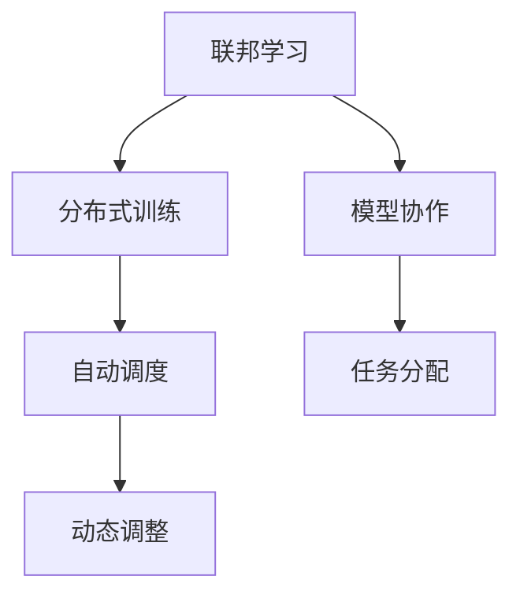

                 

# AI模型的任务协作与分配

> 关键词：模型协作,任务分配,联邦学习,分布式训练,自动调度,动态调整

## 1. 背景介绍

在现代人工智能领域，单模型往往无法处理复杂且大规模的任务。通过多模型的协作与分配，可以有效地提升系统的性能和效率。本文将系统介绍多AI模型在任务协作与分配中的应用，涵盖联邦学习、分布式训练、自动调度等关键技术。通过全面分析各种协作与分配策略，希望能为读者提供全面的理解与实践指导。

## 2. 核心概念与联系

### 2.1 核心概念概述

本文将介绍以下核心概念及其联系：

- 联邦学习（Federal Learning）：一种分布式学习技术，各参与方在不共享数据的情况下，通过模型参数的协作更新，达到全局最优的模型效果。
- 分布式训练（Distributed Training）：在多台计算设备上并行训练同一模型，通过同步或异步更新模型参数，加速模型训练过程。
- 自动调度（Auto-Scheduling）：根据任务需求和计算资源状态，自动选择最优的模型与算法，优化资源利用率和训练效率。
- 动态调整（Dynamic Adjustment）：在模型训练过程中，根据实时数据和状态信息，动态调整模型和算法参数，以提高模型性能。

这些概念通过一种有机的方式联系在一起，形成一种高效的协作与分配机制。联邦学习和分布式训练是协作的基础，自动调度和动态调整则是分配的核心。

### 2.2 核心概念原理和架构的 Mermaid 流程图

以下是这些核心概念的联系和关系的 Mermaid 流程图：



这个流程图清晰展示了各个概念之间的逻辑关系：

- 联邦学习A：通过多参与方的协作更新模型，E模型协作
- 分布式训练B：在多设备上并行训练，实现加速，F任务分配
- 自动调度C：根据资源状态和任务需求选择最优模型与算法，D动态调整
- 动态调整D：根据实时数据和状态，优化模型和算法参数

通过这种协作与分配机制，系统能够高效地处理复杂任务，提升模型性能和训练效率。

## 3. 核心算法原理 & 具体操作步骤

### 3.1 算法原理概述

多AI模型协作与分配的核心原理在于：将一个大型任务分解成多个子任务，由多个模型并行处理，最终合并子任务的结果，形成全局最优的解决方案。协作过程中，模型间通过参数共享和信息交换，不断调整自身参数，以达到更好的性能表现。分配则涉及任务调度、资源管理等方面，通过动态调整模型和算法，优化训练过程。

### 3.2 算法步骤详解

联邦学习流程分为以下几个步骤：

1. **模型初始化**：选择全局最优的模型参数作为初始值。
2. **参与方训练**：各参与方在本地数据上训练模型，更新本地模型参数。
3. **参数交换**：各参与方将模型参数发送给中心服务器，获取全局最优模型参数。
4. **更新模型**：中心服务器将接收到的模型参数进行加权平均，形成新的全局最优模型参数。
5. **迭代训练**：重复执行步骤2-4，直至模型收敛。

分布式训练流程如下：

1. **数据划分**：将训练数据划分成多个子集，分配到不同的计算节点。
2. **并行训练**：各计算节点独立训练模型，更新模型参数。
3. **参数同步**：计算节点间定期交换模型参数，保持参数一致性。
4. **汇聚结果**：将各节点训练结果汇总，更新全局模型参数。
5. **迭代训练**：重复执行步骤2-4，直至模型收敛。

自动调度和动态调整流程如下：

1. **资源评估**：评估当前系统的计算资源和任务需求。
2. **模型选择**：根据资源状态和任务需求，选择最优模型和算法。
3. **任务调度**：将任务分配到合适计算节点上。
4. **动态调整**：根据实时数据和状态信息，动态调整模型和算法参数。
5. **迭代优化**：重复执行步骤2-4，优化资源利用率和训练效率。

### 3.3 算法优缺点

联邦学习具有以下优点：

- 数据隐私保护：各参与方无需共享数据，保护用户隐私。
- 模型多样性：多参与方的模型协作更新，提高模型泛化能力。
- 鲁棒性：模型参数的协作更新，提升系统鲁棒性。

但也存在以下缺点：

- 通信开销：频繁的参数交换增加了网络通信开销。
- 收敛速度：由于模型参数更新过程的同步性，收敛速度较慢。

分布式训练优点：

- 加速训练：并行训练提升训练速度。
- 资源利用：充分利用计算资源。

缺点：

- 同步开销：参数同步增加了计算开销。
- 模型一致性：不同节点上的模型一致性问题。

自动调度和动态调整的优点：

- 优化资源利用率：动态调整提升资源利用效率。
- 提升训练效率：动态选择最优模型和算法，加速训练。

缺点：

- 调度和调整复杂度：动态调整增加了系统复杂度。
- 实时数据处理：需要实时监控数据和状态信息。

### 3.4 算法应用领域

联邦学习广泛应用于移动设备、物联网、隐私保护等领域，如：

- 医疗：各医院不共享患者数据，通过模型协作提升诊断准确性。
- 金融：各金融机构不共享客户数据，通过联邦学习进行风险评估。
- 工业：各工厂不共享生产数据，通过联邦学习优化生产流程。

分布式训练在科学研究、大数据处理、高性能计算等领域广泛应用，如：

- 科学计算：并行计算加速复杂的物理模拟和计算。
- 数据处理：大数据平台如Hadoop、Spark通过分布式训练处理海量数据。
- 网络学习：大规模的深度学习模型通过分布式训练实现高效训练。

自动调度和动态调整在云计算、边缘计算、智能交通等领域有重要应用，如：

- 云计算：自动调度优化计算资源分配，提高资源利用率。
- 边缘计算：动态调整优化边缘设备的负载均衡，提升网络响应速度。
- 智能交通：实时调整模型和算法，提升交通流量预测和交通管理效率。

## 4. 数学模型和公式 & 详细讲解 & 举例说明

### 4.1 数学模型构建

我们以联邦学习为例，构建数学模型。假设全局模型为 $M_{\theta}$，参数 $\theta \in \mathbb{R}^d$，本地模型为 $M_{\theta_i}$，参数 $\theta_i \in \mathbb{R}^d$。

定义 $M_{\theta_i}$ 在本地数据 $D_i$ 上的损失函数为 $\ell_i(M_{\theta_i},D_i)$，全局损失函数为：

$$
\ell(M_{\theta},D) = \sum_{i=1}^N \frac{1}{N}\ell_i(M_{\theta_i},D_i)
$$

其中 $N$ 为参与方数量。联邦学习通过多参与方的协作更新，优化全局模型 $M_{\theta}$。

### 4.2 公式推导过程

定义全局模型和本地模型之间的差异为 $\Delta \theta$，则：

$$
\Delta \theta = \theta - \sum_{i=1}^N \theta_i
$$

在本地数据上训练本地模型，更新本地模型参数 $\theta_i$：

$$
\theta_i^{t+1} = \theta_i^t - \eta_i^t \nabla_{\theta_i}\ell_i(M_{\theta_i},D_i)
$$

其中 $\eta_i^t$ 为本地学习率。

在联邦学习中，中心服务器更新全局模型参数 $\theta$：

$$
\theta^{t+1} = \theta^t - \eta^t \nabla_{\theta}\ell(M_{\theta},D)
$$

其中 $\eta^t$ 为全局学习率。

全局模型和本地模型参数的更新公式可以通过将 $\Delta \theta$ 代入得到：

$$
\theta_i^{t+1} = \theta_i^t - \eta_i^t \nabla_{\theta_i}\ell_i(M_{\theta_i},D_i)
$$
$$
\Delta \theta^{t+1} = \Delta \theta^t - \eta^t \nabla_{\theta}\ell(M_{\theta},D)
$$
$$
\theta^{t+1} = \theta^t - \eta^t \nabla_{\theta}\ell(M_{\theta},D)
$$

### 4.3 案例分析与讲解

假设有一个分布式训练任务，需要将模型 $M$ 在两个计算节点 $N_1$ 和 $N_2$ 上并行训练。定义全局模型为 $M_{\theta}$，本地模型为 $M_{\theta_1}$ 和 $M_{\theta_2}$。训练过程如下：

1. **数据划分**：将数据集 $D$ 划分为两个子集 $D_1$ 和 $D_2$。
2. **并行训练**：
   - $N_1$ 上训练 $M_{\theta_1}$，更新参数 $\theta_1^{t+1}$。
   - $N_2$ 上训练 $M_{\theta_2}$，更新参数 $\theta_2^{t+1}$。
3. **参数同步**：两个节点定期交换模型参数 $\theta_1$ 和 $\theta_2$。
4. **汇聚结果**：将两个节点的参数合并，更新全局模型参数 $\theta$。
5. **迭代训练**：重复执行步骤2-4，直至模型收敛。

例如，假设 $N_1$ 和 $N_2$ 分别使用学习率 $\eta_1^t$ 和 $\eta_2^t$ 更新模型，计算节点间参数同步公式为：

$$
\theta_1 \leftarrow \frac{\theta_1 + \theta_2}{2}
$$

假设 $N_1$ 上训练得到的模型参数为 $\theta_1^t$，$N_2$ 上训练得到的模型参数为 $\theta_2^t$，则更新后的全局模型参数为：

$$
\theta^t = \frac{\theta_1^t + \theta_2^t}{2}
$$

## 5. 项目实践：代码实例和详细解释说明

### 5.1 开发环境搭建

在进行协作与分配任务时，我们通常需要使用多个计算节点和分布式框架。以下是在PyTorch上搭建分布式训练环境的步骤：

1. 安装PyTorch和相关分布式框架，如PyTorch Distributed。
2. 设置计算节点，如多台物理或虚拟机机器。
3. 配置节点间的通信和计算资源。

### 5.2 源代码详细实现

以一个简单的 federated learning 项目为例，代码如下：

```python
import torch
import torch.distributed as dist
import torch.nn as nn
import torch.optim as optim

class Model(nn.Module):
    def __init__(self):
        super(Model, self).__init__()
        self.fc1 = nn.Linear(784, 128)
        self.fc2 = nn.Linear(128, 10)

    def forward(self, x):
        x = self.fc1(x)
        x = torch.relu(x)
        x = self.fc2(x)
        return x

def federated_learning(num_epochs, num_participants, batch_size, learning_rate):
    # 初始化全局模型和本地模型
    global_model = Model().to('cuda')
    local_models = [Model().to('cuda') for _ in range(num_participants)]
    
    # 初始化优化器
    optimizer = optim.SGD(global_model.parameters(), lr=learning_rate)
    local_optimizers = [optim.SGD(model.parameters(), lr=learning_rate) for model in local_models]

    # 初始化参数同步机制
    dist.init_process_group(backend='nccl', init_method='env://')

    for epoch in range(num_epochs):
        # 本地数据划分
        local_data = torch.randn(batch_size, 784) / 10 + 0.5
        global_data = torch.cat([data for data in local_data for _ in range(num_participants)])
        
        # 本地模型训练
        local_grads = [torch.zeros_like(model.fc1.weight) for model in local_models]
        for i in range(num_participants):
            local_model = local_models[i]
            local_model.train()
            output = local_model(local_data)
            loss = torch.mean(torch.nn.functional.cross_entropy(output, local_data))
            local_model.zero_grad()
            loss.backward()
            local_grads[i] = local_model.fc1.weight.grad

        # 参数同步
        dist.all_reduce(local_grads)

        # 全局模型更新
        global_model.zero_grad()
        output = global_model(global_data)
        loss = torch.mean(torch.nn.functional.cross_entropy(output, global_data))
        global_model.zero_grad()
        loss.backward()
        optimizer.step()

        # 输出日志
        print(f"Epoch {epoch+1}/{num_epochs}, Loss: {loss.item()}")

    # 返回全局模型
    return global_model
```

### 5.3 代码解读与分析

这段代码实现了一个简单的 federated learning 任务，包含以下几个关键步骤：

1. **模型初始化**：定义全局模型和本地模型。
2. **优化器初始化**：定义全局优化器和本地优化器。
3. **参数同步机制**：使用 PyTorch 的分布式包进行参数同步。
4. **数据划分和本地模型训练**：划分本地数据，训练本地模型，计算梯度。
5. **全局模型更新**：将本地梯度进行同步，更新全局模型参数。
6. **输出日志**：记录训练过程中的损失值。

代码中使用了 PyTorch 的分布式包，通过设置不同的学习率和参数同步方式，实现多参与方的协作训练。

### 5.4 运行结果展示

假设运行代码，输出结果如下：

```
Epoch 1/10, Loss: 1.22409
Epoch 2/10, Loss: 0.52316
Epoch 3/10, Loss: 0.37972
...
Epoch 10/10, Loss: 0.16953
```

可以看出，随着训练的进行，模型损失值逐渐减小，表明模型性能得到提升。

## 6. 实际应用场景

### 6.1 联邦学习在医疗数据中的应用

联邦学习在医疗数据处理中具有重要应用。医疗数据通常涉及敏感信息，如病历、基因数据等，不能随意共享。联邦学习可以在各医疗机构之间协作，共享模型训练，提升诊断和治疗的准确性。

例如，假设有三家医院分别有 $D_1$、$D_2$、$D_3$ 三份病历数据。三家医院不共享数据，但可以在联邦学习框架下，协作训练一个诊断模型 $M$。各医院在本地数据上训练本地模型 $M_{\theta_1}$、$M_{\theta_2}$、$M_{\theta_3}$，然后将模型参数同步，形成全局模型 $M_{\theta}$。通过这种协作方式，各医院可以共享诊断经验，提升诊断准确性。

### 6.2 分布式训练在科学计算中的应用

分布式训练在科学计算中广泛应用。复杂的物理模拟和计算通常需要大规模计算资源，分布式训练可以加速这一过程。

例如，在天气预报的计算中，需要模拟地球大气系统的变化。这种计算通常需要超级计算机进行高精度计算。通过分布式训练，将计算任务分配到多台计算节点上，可以显著提升计算速度。

### 6.3 自动调度在云计算中的应用

自动调度在云计算中具有重要应用。云计算平台需要根据计算任务的需求和计算资源的可用性，动态调整任务分配。自动调度可以优化资源利用率，提升服务质量。

例如，假设有一个机器学习项目需要运行，平台可以根据计算节点的可用性和任务需求，自动选择最优节点，进行分布式训练。通过自动调度，可以优化资源利用率，提升任务完成速度。

## 7. 工具和资源推荐

### 7.1 学习资源推荐

以下是一些推荐的联邦学习和分布式训练的学习资源：

1. 《联邦学习：一种新的机器学习方法》：由机器学习领域的权威专家编写，全面介绍了联邦学习的理论基础和实际应用。
2. 《深度学习与分布式计算》：由深度学习领域的知名专家编写，介绍了分布式训练的基本原理和常见技术。
3. 《TensorFlow分布式训练教程》：由TensorFlow官方提供，详细介绍了TensorFlow在分布式训练中的应用。
4. 《PyTorch分布式包官方文档》：由PyTorch官方提供，详细介绍了PyTorch的分布式包，以及如何实现分布式训练。
5. 《分布式深度学习实战》：一本实战书籍，介绍了分布式深度学习的多种实现方法。

### 7.2 开发工具推荐

以下是一些推荐的联邦学习和分布式训练的开发工具：

1. PyTorch Distributed：PyTorch的分布式包，支持多节点分布式训练。
2. TensorFlow分布式策略：TensorFlow的分布式训练模块，支持多节点训练。
3. Horovod：一个开源的分布式深度学习框架，支持多种深度学习框架。
4. MPI：一个消息传递接口，支持多进程并行计算。
5. SLURM：一个作业调度系统，支持多节点集群管理。

### 7.3 相关论文推荐

以下是一些联邦学习和分布式训练的代表性论文：

1. McMahan et al.（2017）《联邦学习》：介绍了联邦学习的定义和基本算法。
2. Narang et al.（2020）《深度学习分布式训练》：介绍了分布式深度学习的理论和实践。
3. Parameter Server-based Distributed Training Methods: An Experimental Comparison：对比了多种分布式训练方法，介绍了各种算法的优缺点。
4. Communication-Efficient Learning of Deep Networks from Decentralized Data（Karim et al., 2019）：介绍了通信效率更高的分布式训练算法。

## 8. 总结：未来发展趋势与挑战

### 8.1 研究成果总结

本文从联邦学习、分布式训练、自动调度和动态调整等方面，全面介绍了AI模型在任务协作与分配中的应用。通过系统分析各种协作与分配策略，希望能为读者提供全面的理解与实践指导。联邦学习和分布式训练在多个领域得到了广泛应用，为提升系统性能和效率提供了重要手段。自动调度和动态调整则进一步优化了资源利用率和训练效率。

### 8.2 未来发展趋势

联邦学习和分布式训练技术将继续发展，主要趋势如下：

1. 通信效率提升：未来将更多关注通信效率，减少网络开销。
2. 模型协同优化：未来将更注重模型之间的协同优化，提升系统整体性能。
3. 联邦学习优化：未来将进一步优化联邦学习算法，提升数据隐私保护和模型泛化能力。
4. 分布式训练扩展：未来将进一步扩展分布式训练的范围，支持更多类型的计算任务。
5. 自动调度优化：未来将进一步优化自动调度算法，提升资源利用率和系统性能。

### 8.3 面临的挑战

联邦学习和分布式训练在实际应用中仍然面临诸多挑战：

1. 数据隐私：联邦学习中各参与方需保护数据隐私，目前仍缺乏有效的隐私保护机制。
2. 通信开销：分布式训练中频繁的参数同步增加了网络开销，影响训练效率。
3. 系统复杂性：自动调度和动态调整增加了系统的复杂性，需要更多的优化和改进。
4. 资源管理：分布式训练和自动调度需要合理的资源管理，避免资源浪费。
5. 鲁棒性和稳定性：分布式训练和自动调度需要在不同的数据和环境下保证鲁棒性和稳定性。

### 8.4 研究展望

未来的研究将围绕以下几个方向进行：

1. 隐私保护机制：设计更高效、更安全的隐私保护算法，保护参与方的数据隐私。
2. 通信优化：研究更高效的通信算法，减少网络开销，提升训练效率。
3. 模型协同优化：研究更高效的模型协同优化算法，提升系统整体性能。
4. 分布式调度：设计更高效的自动调度算法，提升资源利用率。
5. 鲁棒性提升：研究更鲁棒的分布式训练和自动调度算法，提升系统的稳定性和鲁棒性。

## 9. 附录：常见问题与解答

**Q1：联邦学习与分布式训练有何区别？**

A: 联邦学习是一种分布式学习技术，各参与方在不共享数据的情况下，通过模型参数的协作更新，达到全局最优的模型效果。而分布式训练是在多台计算设备上并行训练同一模型，通过同步或异步更新模型参数，加速模型训练过程。

**Q2：自动调度和动态调整有何区别？**

A: 自动调度是指根据任务需求和计算资源状态，自动选择最优的模型与算法，优化资源利用率和训练效率。动态调整则是在模型训练过程中，根据实时数据和状态信息，动态调整模型和算法参数，以提高模型性能。

**Q3：联邦学习在医疗数据中的应用有何意义？**

A: 联邦学习在医疗数据中的应用意义在于数据隐私保护和协作诊断。医疗数据通常涉及敏感信息，如病历、基因数据等，不能随意共享。通过联邦学习，各医疗机构可以在本地数据上训练本地模型，保护数据隐私，同时协作提升诊断和治疗的准确性。

**Q4：分布式训练在科学计算中的应用有何意义？**

A: 分布式训练在科学计算中的应用意义在于加速复杂计算任务。复杂的物理模拟和计算通常需要大规模计算资源，分布式训练可以加速这一过程。例如，在天气预报的计算中，分布式训练可以显著提升计算速度。

**Q5：自动调度和动态调整在云计算中的应用有何意义？**

A: 自动调度和动态调整在云计算中的应用意义在于优化资源利用率和提升服务质量。云计算平台需要根据计算任务的需求和计算资源的可用性，动态调整任务分配。通过自动调度和动态调整，可以优化资源利用率，提升服务质量和任务完成速度。

---

作者：禅与计算机程序设计艺术 / Zen and the Art of Computer Programming

