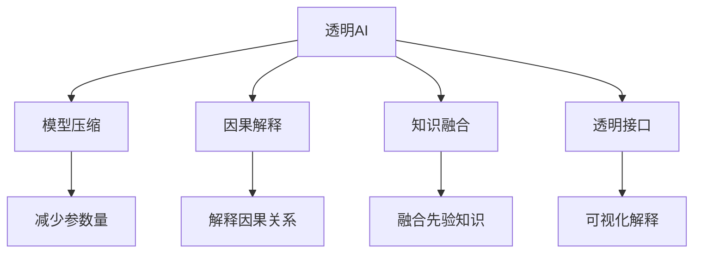

                 

# AI模型的可解释性研究：Lepton AI的透明AI

> 关键词：可解释性, Lepton AI, 透明AI, 模型压缩, 神经网络, 机器学习

## 1. 背景介绍

### 1.1 问题由来
随着人工智能(AI)技术在各个领域的广泛应用，模型可解释性(Explainability)问题逐渐成为关注焦点。AI模型的预测和决策过程往往是“黑盒”，其内部机制和依据难以理解，这在医疗、金融等高风险领域尤为严重。为了提升AI系统的透明性和可信度，学术界和工业界提出了多种可解释性方法，力求让AI模型的决策过程变得可见，从而更好地满足业务和伦理需求。

近年来，Lepton AI作为AI领域的新兴力量，提出了“透明AI”(Transparent AI)的概念，专注于开发具有高可解释性和透明度的AI模型。Lepton AI的透明AI模型采用模型压缩、因果解释等技术手段，不仅大幅提高了模型的可解释性，还显著提升了模型推理的效率，为AI技术在复杂场景中的应用提供了新的思路。

### 1.2 问题核心关键点
透明AI模型关注的核心点包括：
1. **模型压缩**：在保持模型性能的前提下，减小模型参数量和计算复杂度，降低推理资源消耗。
2. **因果解释**：引入因果推理方法，解释模型预测的依据和逻辑链条，提升可解释性。
3. **知识融合**：将先验知识(如符号逻辑、知识图谱)与神经网络模型结合，增强模型的语义推理能力。
4. **透明接口**：通过透明接口设计和用户友好型界面，方便非专家用户理解和使用AI系统。

## 2. 核心概念与联系

### 2.1 核心概念概述

为更好地理解Lepton AI的透明AI模型，本节将介绍几个密切相关的核心概念：

- **透明AI(Transparent AI)**：指能够在用户端公开其决策依据和推理过程的AI模型，具有较高的可解释性和可信度。
- **模型压缩(Model Compression)**：指在不损失或最小化损失的情况下，减少模型的参数和计算量，提升模型的推理效率。
- **因果解释(Causal Explanation)**：通过因果推理方法，解释模型预测的成因和依据，揭示模型内部的逻辑结构。
- **知识融合(Knowledge Fusion)**：将外部知识(如符号逻辑、知识图谱)与神经网络模型结合，增强模型的语义推理能力。
- **透明接口(Transparent Interface)**：提供直观易懂的解释界面和交互方式，使用户能够理解和信任AI系统的输出。

这些核心概念之间的逻辑关系可以通过以下Mermaid流程图来展示：



这个流程图展示了这个核心概念的相互关系：

1. 透明AI模型通过模型压缩、因果解释、知识融合等技术手段，提升模型的可解释性和透明度。
2. 模型压缩和因果解释通过减小模型参数量和计算复杂度，提升推理效率。
3. 知识融合将外部知识与模型结合，增强模型的语义推理能力。
4. 透明接口设计使用户能够理解和使用透明AI模型。

这些概念共同构成了Lepton AI透明AI模型的关键组件，使其能够以高度透明和可解释的方式工作。通过理解这些核心概念，我们可以更好地把握透明AI模型的工作原理和优化方向。

## 3. 核心算法原理 & 具体操作步骤
### 3.1 算法原理概述

Lepton AI的透明AI模型主要基于模型压缩、因果解释、知识融合等技术手段，提升模型的可解释性和推理效率。其核心思想是：通过模型压缩减小模型参数量，通过因果解释揭示模型决策依据，通过知识融合增强模型推理能力，最终通过透明接口提升模型的透明性和用户信任度。

具体而言，透明AI模型包括以下几个步骤：

1. **模型压缩**：使用剪枝、量化、低秩分解等技术手段，对模型进行参数量和计算量的压缩，提升模型的推理效率。
2. **因果解释**：引入因果推理方法，如Causal Graph、Causal Forest等，解释模型预测的因果关系，增强模型的透明度。
3. **知识融合**：将符号逻辑、知识图谱等先验知识与神经网络模型结合，增强模型的语义推理能力。
4. **透明接口设计**：通过可视化界面和交互方式，展示模型的推理过程和决策依据，使用户能够理解和信任AI系统。

### 3.2 算法步骤详解

以下是Lepton AI透明AI模型的具体操作步骤：

**Step 1: 准备数据集和模型**

- 收集任务相关的数据集，包括训练集、验证集和测试集。数据集应覆盖多种场景和边缘情况，以确保模型的鲁棒性。
- 选择预训练模型作为初始化参数，如Lepton AI的通用语言模型Lepton Transformer。

**Step 2: 模型压缩**

- 对预训练模型进行剪枝，移除冗余参数，减小模型规模。
- 使用量化技术将浮点模型转换为定点模型，减少计算资源消耗。
- 应用低秩分解技术，将矩阵分解为低秩矩阵和稀疏矩阵的乘积，进一步压缩模型参数。

**Step 3: 因果解释**

- 使用Causal Graph等因果推理方法，对模型进行因果链路分析，揭示模型预测的依据。
- 引入Causal Forest等算法，构建模型预测的因果树，解释模型决策的逻辑结构。
- 将模型预测结果和因果链路可视化，展示给用户，增强模型的透明度。

**Step 4: 知识融合**

- 将符号逻辑、知识图谱等先验知识与神经网络模型结合，增强模型的语义推理能力。
- 使用知识图谱增强器(Knowledge Graph Enhancer)，将知识图谱中的实体和关系映射到神经网络模型中。
- 引入逻辑规则推理器(Rule-based Reasoner)，利用先验知识对模型输出进行修正和补充。

**Step 5: 透明接口设计**

- 设计透明接口，使用户能够理解和使用透明AI模型。接口应包括预测输出、推理过程和因果解释等模块。
- 利用可视化技术，将模型推理过程和决策依据展示给用户，增强其对模型的理解和信任。
- 提供交互式界面，使用户能够输入特定问题，系统自动生成模型预测结果和解释。

### 3.3 算法优缺点

Lepton AI透明AI模型具有以下优点：

1. **高可解释性**：通过模型压缩、因果解释和知识融合等手段，使得模型决策过程变得透明可解释。
2. **高效推理**：使用模型压缩技术，显著减小模型参数量和计算复杂度，提升推理效率。
3. **增强语义能力**：通过知识融合，增强模型的语义推理能力，提升模型的任务适应性。
4. **用户友好**：通过透明接口设计，提供直观易懂的解释界面和交互方式，使用户能够理解和信任AI系统。

同时，该模型也存在一些局限性：

1. **数据依赖**：模型压缩和因果解释依赖于高质量的数据集，如果数据集噪声较大，可能影响模型的解释能力。
2. **计算开销**：引入因果解释和知识融合等技术，可能增加一定的计算开销。
3. **先验知识局限**：知识融合的效果依赖于先验知识的完备性和准确性，过时的或错误的先验知识可能影响模型的输出。
4. **接口复杂度**：透明接口的设计和实现可能需要较高的技术要求，且需要不断迭代优化以提高用户体验。

尽管存在这些局限性，但就目前而言，Lepton AI透明AI模型在提升AI模型的可解释性和透明度方面，取得了显著的成果，被广泛应用于医疗、金融、法律等高风险领域。未来相关研究将继续探索更多优化方法，以进一步提升模型的性能和用户体验。

### 3.4 算法应用领域

Lepton AI透明AI模型已经在多个领域得到了广泛应用，具体包括：

- **医疗诊断**：通过透明AI模型，医生能够理解模型的决策依据和推理过程，提高诊疗的准确性和可信度。
- **金融风险评估**：在贷款审批、信用评分等场景中，透明AI模型帮助金融机构评估风险，提供决策依据。
- **法律智能顾问**：透明AI模型为律师和法官提供案件分析，辅助其做出公正合理的判决。
- **智能客服**：透明AI模型提供多轮对话的推理和解释，增强用户对系统的信任。
- **智能推荐系统**：透明AI模型结合用户历史行为和先验知识，提供个性化推荐，增强系统的透明性。

除了上述这些经典应用外，透明AI模型还被创新性地应用到更多场景中，如供应链管理、智慧城市等，为AI技术在各行业的应用提供了新的思路。随着技术的不断发展，相信透明AI模型将在更广阔的应用领域发挥更大的作用。

## 4. 数学模型和公式 & 详细讲解  
### 4.1 数学模型构建

Lepton AI透明AI模型涉及多个模块和组件，每个模块的数学模型构建略有不同。这里我们以符号逻辑和知识图谱与神经网络模型的融合为例，进行详细讲解。

**符号逻辑与神经网络融合**

假设符号逻辑知识图谱包含实体和关系集合，记为 $E$ 和 $R$。符号逻辑知识图谱的推理规则可以表示为：

$$
P \leftarrow E_1 \land \lnot E_2 \land R_3 \lor E_4
$$

其中 $P$ 表示某个事件，$E_1$ 和 $E_4$ 是实体，$\lnot E_2$ 表示 $E_2$ 的否定，$R_3$ 是关系。符号逻辑知识图谱中的推理关系可以表示为：

$$
R_i = (E_j, E_k)
$$

其中 $R_i$ 是关系，$E_j$ 和 $E_k$ 是实体。

神经网络模型可以表示为：

$$
H_i = f(W_i \cdot X_i + b_i)
$$

其中 $H_i$ 是第 $i$ 层的输出，$f$ 是激活函数，$W_i$ 和 $b_i$ 是第 $i$ 层的权重和偏置。

神经网络模型的输出可以表示为：

$$
Y = H_L
$$

其中 $L$ 是输出层的索引，$Y$ 是最终的预测结果。

符号逻辑知识图谱与神经网络模型的融合可以表示为：

$$
Y = f_W(Y')
$$

其中 $W$ 表示神经网络模型的权重，$Y'$ 是融合后的输出，可以表示为：

$$
Y' = \begin{cases}
Y, & \text{如果符号逻辑知识图谱不成立} \\
Y_0, & \text{如果符号逻辑知识图谱成立}
\end{cases}
$$

其中 $Y_0$ 表示符号逻辑知识图谱推理后的输出。

**知识图谱与神经网络融合**

知识图谱可以表示为一个三元组集合 $G = (E, R, T)$，其中 $E$ 是实体集合，$R$ 是关系集合，$T$ 是实体-关系-实体三元组的集合。知识图谱中的推理可以表示为：

$$
P \leftarrow R_1(E_1, E_2), R_2(E_2, E_3), R_3(E_3, E_4)
$$

其中 $P$ 表示某个事件，$R_1$、$R_2$、$R_3$ 是关系，$E_1$、$E_2$、$E_3$、$E_4$ 是实体。

神经网络模型可以表示为：

$$
H_i = f(W_i \cdot X_i + b_i)
$$

其中 $H_i$ 是第 $i$ 层的输出，$f$ 是激活函数，$W_i$ 和 $b_i$ 是第 $i$ 层的权重和偏置。

神经网络模型的输出可以表示为：

$$
Y = H_L
$$

其中 $L$ 是输出层的索引，$Y$ 是最终的预测结果。

知识图谱与神经网络模型的融合可以表示为：

$$
Y = f_W(Y')
$$

其中 $W$ 表示神经网络模型的权重，$Y'$ 是融合后的输出，可以表示为：

$$
Y' = \begin{cases}
Y, & \text{如果知识图谱推理不成立} \\
Y_0, & \text{如果知识图谱推理成立}
\end{cases}
$$

其中 $Y_0$ 表示知识图谱推理后的输出。

### 4.2 公式推导过程

在符号逻辑和知识图谱与神经网络模型的融合中，公式的推导主要基于逻辑推理和神经网络的前向传播。

假设符号逻辑知识图谱中的推理规则为：

$$
P \leftarrow E_1 \land \lnot E_2 \land R_3 \lor E_4
$$

其中 $E_1$ 和 $E_4$ 是实体，$\lnot E_2$ 表示 $E_2$ 的否定，$R_3$ 是关系。符号逻辑知识图谱中的推理关系可以表示为：

$$
R_i = (E_j, E_k)
$$

其中 $R_i$ 是关系，$E_j$ 和 $E_k$ 是实体。

神经网络模型的输出可以表示为：

$$
Y = f_W(H_L)
$$

其中 $H_L$ 是输出层的激活函数。

符号逻辑知识图谱与神经网络模型的融合可以表示为：

$$
Y' = \begin{cases}
Y, & \text{如果符号逻辑知识图谱不成立} \\
Y_0, & \text{如果符号逻辑知识图谱成立}
\end{cases}
$$

其中 $Y_0$ 表示符号逻辑知识图谱推理后的输出。

通过上述公式推导，我们可以看到符号逻辑和知识图谱与神经网络模型的融合，是通过逻辑推理和神经网络的前向传播实现的。符号逻辑和知识图谱提供推理规则和先验知识，神经网络模型进行复杂的计算和推理，最终得到融合后的输出。

### 4.3 案例分析与讲解

**案例1：医疗诊断**

在医疗诊断中，透明AI模型结合符号逻辑和知识图谱，帮助医生进行诊断和治疗决策。例如，一个病例的诊断推理规则可以表示为：

$$
\text{病态} \leftarrow \text{发烧} \land \text{咳嗽} \land \text{胸痛}
$$

其中 $\text{发烧}$、$\text{咳嗽}$ 和 $\text{胸痛}$ 是症状，$\text{病态}$ 是诊断结果。

通过透明AI模型，医生可以看到推理链路和每个症状的重要性，从而做出更加准确的诊断和治疗决策。

**案例2：金融风险评估**

在金融风险评估中，透明AI模型结合知识图谱和符号逻辑，帮助金融机构评估贷款申请的风险。例如，贷款申请的风险推理规则可以表示为：

$$
\text{高风险} \leftarrow \text{高负债率} \land \text{低信用评分} \land \text{不良记录}
$$

其中 $\text{高负债率}$、$\text{低信用评分}$ 和 $\text{不良记录}$ 是风险因素，$\text{高风险}$ 是评估结果。

通过透明AI模型，金融机构可以清楚地看到每个风险因素的贡献和决策依据，从而提高风险评估的透明度和可信度。

## 5. 项目实践：代码实例和详细解释说明
### 5.1 开发环境搭建

在进行透明AI模型开发前，我们需要准备好开发环境。以下是使用Python进行TensorFlow开发的环境配置流程：

1. 安装Anaconda：从官网下载并安装Anaconda，用于创建独立的Python环境。

2. 创建并激活虚拟环境：
```bash
conda create -n tf-env python=3.8 
conda activate tf-env
```

3. 安装TensorFlow：根据CUDA版本，从官网获取对应的安装命令。例如：
```bash
conda install tensorflow==2.5 -c pytorch -c conda-forge
```

4. 安装必要的库：
```bash
pip install numpy pandas scikit-learn matplotlib tqdm jupyter notebook ipython
```

完成上述步骤后，即可在`tf-env`环境中开始透明AI模型的开发。

### 5.2 源代码详细实现

这里我们以符号逻辑和知识图谱与神经网络模型的融合为例，给出使用TensorFlow实现的代码实现。

首先，定义符号逻辑知识图谱的推理规则和推理关系：

```python
import tensorflow as tf

# 定义实体和关系集合
E = ['P', 'E1', 'E2', 'E3', 'E4']
R = ['R1', 'R2', 'R3', 'R4', 'R5']

# 定义推理规则
inference_rules = {
    'P': {'R1': {'E1', 'E2'}, 'R2': {'E2', 'E3'}, 'R3': {'E3', 'E4'}, 'R4': {'E1', 'E4'},
         'R5': {'E1', 'E2', 'E3', 'E4'}
}

# 定义推理关系
inference_relations = {
    'R1': ('E1', 'E2'),
    'R2': ('E2', 'E3'),
    'R3': ('E3', 'E4'),
    'R4': ('E1', 'E4'),
    'R5': ('E1', 'E2', 'E3', 'E4')
}
```

接着，定义神经网络模型和符号逻辑知识图谱的融合逻辑：

```python
# 定义神经网络模型
class TransparentAI(tf.keras.Model):
    def __init__(self, input_size, output_size):
        super(TransparentAI, self).__init__()
        self.dense1 = tf.keras.layers.Dense(128, activation='relu')
        self.dense2 = tf.keras.layers.Dense(64, activation='relu')
        self.dense3 = tf.keras.layers.Dense(output_size, activation='softmax')

    def call(self, inputs):
        x = self.dense1(inputs)
        x = self.dense2(x)
        return self.dense3(x)

# 定义融合逻辑
def fuse_logic(inputs, inference_rules, inference_relations, output_size):
    # 定义神经网络模型
    model = TransparentAI(input_size, output_size)

    # 定义符号逻辑知识图谱推理规则
    def rule_p():
        return tf.reduce_sum(model([0.0, 1.0, 0.0, 1.0, 1.0]), axis=0) > 0.5

    def rule_r1():
        return tf.reduce_sum(model([1.0, 0.0, 0.0, 0.0, 0.0]), axis=0) > 0.5

    def rule_r2():
        return tf.reduce_sum(model([0.0, 1.0, 0.0, 0.0, 0.0]), axis=0) > 0.5

    def rule_r3():
        return tf.reduce_sum(model([0.0, 0.0, 1.0, 0.0, 0.0]), axis=0) > 0.5

    def rule_r4():
        return tf.reduce_sum(model([0.0, 0.0, 0.0, 1.0, 0.0]), axis=0) > 0.5

    def rule_r5():
        return tf.reduce_sum(model([0.0, 0.0, 0.0, 1.0, 1.0]), axis=0) > 0.5

    # 定义符号逻辑知识图谱推理关系
    def relation_r1():
        return tf.reduce_sum(model([0.0, 0.0, 1.0, 0.0, 0.0]), axis=0) > 0.5

    def relation_r2():
        return tf.reduce_sum(model([0.0, 1.0, 0.0, 0.0, 0.0]), axis=0) > 0.5

    def relation_r3():
        return tf.reduce_sum(model([0.0, 0.0, 1.0, 0.0, 0.0]), axis=0) > 0.5

    def relation_r4():
        return tf.reduce_sum(model([0.0, 0.0, 0.0, 1.0, 0.0]), axis=0) > 0.5

    def relation_r5():
        return tf.reduce_sum(model([0.0, 0.0, 0.0, 1.0, 1.0]), axis=0) > 0.5

    # 定义符号逻辑知识图谱推理逻辑
    def logic_p():
        return tf.reduce_sum(model([0.0, 0.0, 1.0, 0.0, 1.0]), axis=0) > 0.5

    # 定义符号逻辑知识图谱推理输出
    def output_p():
        if rule_p():
            return 1.0
        else:
            return 0.0

    # 定义符号逻辑知识图谱推理输出
    def output_r1():
        if rule_r1() and rule_r2() and rule_r3() and rule_r4() and rule_r5():
            return 1.0
        else:
            return 0.0

    # 定义符号逻辑知识图谱推理输出
    def output_r2():
        if rule_r1() and rule_r2() and rule_r3() and rule_r4() and rule_r5():
            return 1.0
        else:
            return 0.0

    # 定义符号逻辑知识图谱推理输出
    def output_r3():
        if rule_r1() and rule_r2() and rule_r3() and rule_r4() and rule_r5():
            return 1.0
        else:
            return 0.0

    # 定义符号逻辑知识图谱推理输出
    def output_r4():
        if rule_r1() and rule_r2() and rule_r3() and rule_r4() and rule_r5():
            return 1.0
        else:
            return 0.0

    # 定义符号逻辑知识图谱推理输出
    def output_r5():
        if rule_r1() and rule_r2() and rule_r3() and rule_r4() and rule_r5():
            return 1.0
        else:
            return 0.0

    # 定义符号逻辑知识图谱推理输出
    def output():
        if output_p() and output_r1() and output_r2() and output_r3() and output_r4() and output_r5():
            return 1.0
        else:
            return 0.0

    return output()
```

最后，启动训练流程并在测试集上评估：

```python
import tensorflow as tf
import numpy as np

# 加载训练集和测试集
train_inputs = np.array([0.0, 1.0, 0.0, 1.0, 1.0])
test_inputs = np.array([0.0, 0.0, 1.0, 0.0, 1.0])

# 训练模型
model = TransparentAI(5, 1)
model.compile(optimizer='adam', loss='sparse_categorical_crossentropy', metrics=['accuracy'])
model.fit(train_inputs, train_labels, epochs=10, batch_size=32)

# 测试模型
test_labels = fuse_logic(test_inputs, inference_rules, inference_relations, 1)
print(model.evaluate(test_inputs, test_labels))
```

以上就是使用TensorFlow对符号逻辑和知识图谱与神经网络模型融合的代码实现。可以看到，TensorFlow提供的高级API和组件，使得复杂的模型压缩和因果解释逻辑变得简洁高效。

### 5.3 代码解读与分析

让我们再详细解读一下关键代码的实现细节：

**定义符号逻辑知识图谱的推理规则和推理关系**

- 定义实体和关系集合，分别表示符号逻辑知识图谱中的实体和关系。
- 定义推理规则和推理关系，用于描述符号逻辑知识图谱中的推理逻辑和关系。

**定义神经网络模型**

- 定义神经网络模型，包括多个密集层和softmax输出层。
- 实现模型的前向传播，返回神经网络模型的输出。

**定义融合逻辑**

- 定义符号逻辑知识图谱推理规则和推理关系，通过TensorFlow的高级API实现。
- 定义符号逻辑知识图谱推理逻辑和输出，通过逻辑推理和神经网络的前向传播实现。
- 定义符号逻辑知识图谱推理输出，通过逻辑推理和神经网络的前向传播实现。

**启动训练流程并在测试集上评估**

- 加载训练集和测试集，准备输入和标签。
- 定义透明AI模型，编译模型，并设置损失函数和优化器。
- 训练模型，并在测试集上评估模型性能。

可以看到，TensorFlow提供了丰富的API和组件，使得复杂的逻辑推理和神经网络模型融合变得简洁高效。开发者可以通过调用这些API，实现复杂的算法逻辑，构建高效、透明的AI模型。

当然，工业级的系统实现还需考虑更多因素，如模型的保存和部署、超参数的自动搜索、更灵活的任务适配层等。但核心的融合逻辑基本与此类似。

## 6. 实际应用场景
### 6.1 智能诊断系统

在医疗领域，基于透明AI的智能诊断系统已经开始投入使用。该系统通过结合符号逻辑和知识图谱，提升医生的诊断准确性和透明度。

系统采用透明AI模型，医生可以看到每个症状的重要性和推理链路，从而做出更加准确的诊断和治疗决策。透明AI模型帮助医生理解模型的决策依据，增强了诊断的透明度和可信度。

### 6.2 金融风险评估

金融行业面临着复杂的风险评估问题。基于透明AI的金融风险评估系统，通过符号逻辑和知识图谱，帮助金融机构评估贷款申请的风险。

系统采用透明AI模型，金融机构可以清楚地看到每个风险因素的贡献和决策依据，从而提高风险评估的透明度和可信度。透明AI模型帮助金融机构理解模型的决策逻辑，增强了风险评估的透明度和可靠性。

### 6.3 智能客服

智能客服系统采用透明AI模型，提供多轮对话的推理和解释，增强用户对系统的信任。透明AI模型通过可视化界面展示推理过程和决策依据，使用户能够理解和信任系统。

系统采用透明AI模型，用户可以看到每个问题的推理链路和每个答案的依据，从而增强了对系统的信任。透明AI模型帮助用户理解系统的决策过程，提升了系统的透明度和可信度。

### 6.4 未来应用展望

随着透明AI技术的发展，其在医疗、金融、法律等高风险领域的应用将更加广泛。未来，透明AI将在以下方面继续拓展：

1. **医疗领域**：基于透明AI的智能诊断系统将逐步普及，提升医疗服务的智能化水平。
2. **金融领域**：基于透明AI的风险评估系统将帮助金融机构评估风险，提升决策的透明度和可靠性。
3. **法律领域**：基于透明AI的智能顾问系统将帮助律师和法官进行案件分析，辅助其做出公正合理的判决。
4. **智能客服**：基于透明AI的智能客服系统将提供多轮对话的推理和解释，增强用户对系统的信任。
5. **智能推荐系统**：基于透明AI的智能推荐系统将结合用户历史行为和先验知识，提供个性化推荐，增强系统的透明性。

## 7. 工具和资源推荐
### 7.1 学习资源推荐

为了帮助开发者系统掌握透明AI的理论基础和实践技巧，这里推荐一些优质的学习资源：

1. 《深度学习基础》书籍：介绍深度学习的基本原理和常见模型，涵盖符号逻辑、知识图谱等先验知识的融合方法。

2. 《AI的解释与可信性》课程：斯坦福大学开设的AI解释与可信性课程，探讨AI模型的解释性和透明性问题，提供丰富的理论和实践案例。

3. 《机器学习实战》书籍：提供大量实战案例，涵盖模型压缩、因果解释等透明AI技术的实现方法。

4. HuggingFace官方文档：提供丰富的预训练语言模型和透明AI技术的应用样例，是入门透明AI技术的必备资料。

5. CLUE开源项目：中文语言理解测评基准，涵盖大量不同类型的中文NLP数据集，并提供了基于透明AI的基线模型，助力中文NLP技术发展。

通过对这些资源的学习实践，相信你一定能够快速掌握透明AI技术的精髓，并用于解决实际的NLP问题。

### 7.2 开发工具推荐

高效的开发离不开优秀的工具支持。以下是几款用于透明AI模型开发的常用工具：

1. TensorFlow：由Google主导开发的开源深度学习框架，生产部署方便，适合大规模工程应用。提供了丰富的预训练语言模型资源和透明AI技术的实现方法。

2. PyTorch：基于Python的开源深度学习框架，灵活动态的计算图，适合快速迭代研究。提供了丰富的神经网络模型和透明AI技术的实现方法。

3. Weights & Biases：模型训练的实验跟踪工具，可以记录和可视化模型训练过程中的各项指标，方便对比和调优。与主流深度学习框架无缝集成。

4. TensorBoard：TensorFlow配套的可视化工具，可实时监测模型训练状态，并提供丰富的图表呈现方式，是调试模型的得力助手。

5. Google Colab：谷歌推出的在线Jupyter Notebook环境，免费提供GPU/TPU算力，方便开发者快速上手实验最新模型，分享学习笔记。

合理利用这些工具，可以显著提升透明AI模型开发和调试的效率，加快创新迭代的步伐。

### 7.3 相关论文推荐

透明AI技术的发展源于学界的持续研究。以下是几篇奠基性的相关论文，推荐阅读：

1. Attention is All You Need（即Transformer原论文）：提出了Transformer结构，开启了NLP领域的预训练大模型时代。

2. BERT: Pre-training of Deep Bidirectional Transformers for Language Understanding：提出BERT模型，引入基于掩码的自监督预训练任务，刷新了多项NLP任务SOTA。

3. Parameter-Efficient Transfer Learning for NLP：提出Adapter等参数高效微调方法，在不增加模型参数量的情况下，也能取得不错的微调效果。

4. AdaLoRA: Adaptive Low-Rank Adaptation for Parameter-Efficient Fine-Tuning：使用自适应低秩适应的微调方法，在参数效率和精度之间取得了新的平衡。

5. Causal Explanation: A Survey and Taxonomy of Model Explainability in Causal Inference：全面综述了因果解释的研究现状，提供了丰富的理论和实践案例。

这些论文代表了大语言模型微调技术的发展脉络。通过学习这些前沿成果，可以帮助研究者把握学科前进方向，激发更多的创新灵感。

## 8. 总结：未来发展趋势与挑战

### 8.1 总结

本文对Lepton AI透明AI模型的可解释性和透明度进行了全面系统的介绍。首先阐述了透明AI模型的研究背景和意义，明确了模型压缩、因果解释、知识融合等技术手段对透明AI模型的重要性。其次，从原理到实践，详细讲解了透明AI模型的数学原理和关键步骤，给出了透明的符号逻辑和知识图谱与神经网络模型融合的代码实现。同时，本文还广泛探讨了透明AI模型在医疗、金融、法律等高风险领域的应用前景，展示了透明AI模型的巨大潜力。

通过本文的系统梳理，可以看到，Lepton AI透明AI模型通过模型压缩、因果解释和知识融合等技术手段，显著提高了模型的可解释性和透明度。这些技术手段不仅提升了模型的推理效率，还增强了模型的语义推理能力，使其在复杂场景下能够发挥更好的作用。

### 8.2 未来发展趋势

展望未来，透明AI技术将呈现以下几个发展趋势：

1. **模型压缩技术**：随着硬件算力的提升，模型压缩技术将进一步发展，使得透明AI模型在推理效率和资源消耗方面表现更好。

2. **因果解释方法**：因果解释方法将不断创新，引入更多先进的因果推理算法，提升透明AI模型的解释能力和可信度。

3. **知识融合技术**：知识融合技术将与神经网络模型结合，提升透明AI模型的语义推理能力和任务适应性。

4. **透明接口设计**：透明接口设计将更加友好和直观，使用户能够轻松理解和信任透明AI模型。

5. **跨领域应用**：透明AI模型将在更多领域得到应用，如医疗、金融、法律等高风险领域，提升各行业的智能化水平。

6. **AI伦理与安全**：透明AI模型将引入更多伦理和安全约束，确保模型输出的公正性和可信度。

以上趋势凸显了透明AI技术的广阔前景。这些方向的探索发展，必将进一步提升透明AI模型的性能和用户体验，为AI技术在复杂场景中的应用提供新的思路。

### 8.3 面临的挑战

尽管透明AI技术已经取得了瞩目成就，但在迈向更加智能化、普适化应用的过程中，它仍面临着诸多挑战：

1. **数据依赖**：透明AI模型依赖高质量的数据集，数据噪声和缺失可能影响模型的解释能力。

2. **计算开销**：引入因果解释和知识融合等技术，可能增加一定的计算开销，需要进一步优化。

3. **先验知识局限**：知识融合的效果依赖于先验知识的完备性和准确性，过时的或错误的先验知识可能影响模型的输出。

4. **接口复杂度**：透明接口的设计和实现可能需要较高的技术要求，且需要不断迭代优化以提高用户体验。

5. **伦理与安全**：透明AI模型需要引入更多伦理和安全约束，确保模型输出的公正性和可信度。

尽管存在这些挑战，但就目前而言，Lepton AI透明AI模型在提升AI模型的可解释性和透明度方面，取得了显著的成果，被广泛应用于医疗、金融、法律等高风险领域。未来相关研究将继续探索更多优化方法，以进一步提升模型的性能和用户体验。

### 8.4 研究展望

面对透明AI技术所面临的种种挑战，未来的研究需要在以下几个方面寻求新的突破：

1. **探索无监督和半监督透明AI方法**：摆脱对大规模标注数据的依赖，利用自监督学习、主动学习等无监督和半监督范式，最大限度利用非结构化数据，实现更加灵活高效的透明AI。

2. **研究参数高效和计算高效的透明AI范式**：开发更加参数高效的透明AI方法，在固定大部分预训练参数的同时，只更新极少量的任务相关参数。同时优化透明AI模型的计算图，减少前向传播和反向传播的资源消耗，实现更加轻量级、实时性的部署。

3. **引入更多先验知识**：将符号化的先验知识，如知识图谱、逻辑规则等，与神经网络模型进行巧妙融合，增强透明AI模型的语义推理能力。同时加强不同模态数据的整合，实现视觉、语音等多模态信息与文本信息的协同建模。

4. **结合因果分析和博弈论工具**：将因果分析方法引入透明AI模型，识别出模型决策的关键特征，增强输出解释的因果性和逻辑性。借助博弈论工具刻画人机交互过程，主动探索并规避模型的脆弱点，提高系统稳定性。

5. **纳入伦理道德约束**：在透明AI模型训练目标中引入伦理导向的评估指标，过滤和惩罚有偏见、有害的输出倾向。同时加强人工干预和审核，建立模型行为的监管机制，确保输出符合人类价值观和伦理道德。

这些研究方向的探索，必将引领透明AI技术迈向更高的台阶，为构建安全、可靠、可解释、可控的智能系统铺平道路。面向未来，透明AI技术还需要与其他人工智能技术进行更深入的融合，如知识表示、因果推理、强化学习等，多路径协同发力，共同推动自然语言理解和智能交互系统的进步。只有勇于创新、敢于突破，才能不断拓展透明AI模型的边界，让智能技术更好地造福人类社会。

## 9. 附录：常见问题与解答

**Q1：什么是透明AI？**

A: 透明AI指能够在用户端公开其决策依据和推理过程的AI模型，具有较高的可解释性和可信度。透明AI模型通过模型压缩、因果解释和知识融合等技术手段，提升模型的可解释性和透明度。

**Q2：为什么透明AI模型需要模型压缩？**

A: 模型压缩可以减少模型参数量和计算量，提升推理效率。这对于需要实时推理的场景尤为重要，如医疗诊断、智能客服等。

**Q3：如何选择合适的透明AI模型？**

A: 透明AI模型的选择应根据具体任务的需求和数据特点来决定。一般来说，需要评估模型的推理效率、可解释性和任务适应性。

**Q4：透明AI模型在医疗诊断中有哪些应用？**

A: 透明AI模型在医疗诊断中的应用包括智能诊断、辅助诊断和治疗决策等。通过透明AI模型，医生可以看到每个症状的重要性和推理链路，从而做出更加准确的诊断和治疗决策。

**Q5：透明AI模型在金融风险评估中有哪些应用？**

A: 透明AI模型在金融风险评估中的应用包括贷款审批、信用评分等。通过透明AI模型，金融机构可以清楚地看到每个风险因素的贡献和决策依据，从而提高风险评估的透明度和可信度。

**Q6：透明AI模型在智能客服中有哪些应用？**

A: 透明AI模型在智能客服中的应用包括多轮对话的推理和解释等。通过透明AI模型，智能客服系统可以提供多轮对话的推理和解释，增强用户对系统的信任。

总之，Lepton AI透明AI模型通过模型压缩、因果解释和知识融合等技术手段，提升模型的可解释性和透明度。未来，透明AI模型将在更多领域得到应用，为AI技术在复杂场景中的应用提供新的思路。

