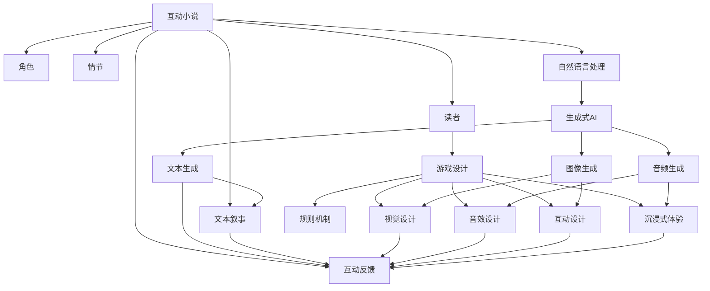

                 

# AI生成的互动小说游戏：故事与游戏的融合

> 关键词：互动小说,生成式AI,游戏设计,自然语言处理(NLP),交互式叙事,沉浸式体验

## 1. 背景介绍

在数字娱乐领域，互动小说和游戏长期以来被视为两个独立的艺术形式，分别发展。互动小说更多依赖文字和故事构建世界，而游戏则依靠图像、音效和交互反馈提供沉浸式体验。但随着人工智能(AI)和自然语言处理(NLP)技术的进步，一种将故事与游戏紧密融合的新型交互形式——AI生成的互动小说游戏——逐渐引起行业关注。

### 1.1 互动小说与游戏的历史演进

互动小说自20世纪80年代开始流行，最早的形式是基于文本的冒险游戏，用户通过输入命令与故事互动。随着剧情复杂度的提升，许多互动小说开始融入图像和视频元素，但仍以文字为核心的叙事方式为主。

游戏领域则从最早的2D像素游戏演进到3D渲染大作，但游戏叙事的文本往往仅作为辅助手段，用于推动剧情和角色塑造，而非驱动核心体验。

### 1.2 互动小说与游戏融合的动因

AI生成的互动小说游戏旨在打破这种界限，将故事和游戏元素无缝融合，创造一种全新的叙事方式。这种融合的动因主要包括：

- **提升叙事深度**：通过AI生成丰富、动态的故事情节，提高互动小说的游戏性。
- **优化玩家体验**：使用AI增强对话自然性和故事连贯性，提供更加沉浸的体验。
- **降低开发成本**：AI生成技术可以大幅减少写作和设计的工作量，快速构建复杂的故事世界。
- **扩展受众群体**：通过图像、音效和互动设计，吸引非纯文本阅读者加入互动小说的行列。

## 2. 核心概念与联系

### 2.1 核心概念概述

为了更好地理解AI生成的互动小说游戏，本节将介绍几个核心概念：

- **互动小说(Interactive Fiction)**：一种通过文字与读者互动，推动故事发展的故事形式。互动小说的核心是文本和故事逻辑。
- **游戏设计(Game Design)**：研究如何通过规则、机制、视觉和音效等元素，构建可玩性和沉浸感的艺术。
- **自然语言处理(Natural Language Processing, NLP)**：通过算法和模型，使计算机能够理解和生成人类语言的技术。
- **生成式AI(Generative AI)**：指能够生成文本、图像、音频等内容的AI系统，典型应用包括聊天机器人、文本生成等。
- **交互式叙事(Interactive Narration)**：指通过用户输入、互动反馈等手段，动态生成并调整故事走向的叙事方式。
- **沉浸式体验(Immersive Experience)**：利用图像、音效、互动等多模态元素，营造接近现实世界的体验。

### 2.2 核心概念原理和架构的 Mermaid 流程图



这个流程图展示了互动小说与游戏设计融合的架构：

1. 互动小说以文本和角色为基础，逐步构建情节。
2. 游戏设计引入视觉、音效和规则等元素，提升可玩性和沉浸感。
3. 自然语言处理技术驱动AI生成文本、图像和音频等内容。
4. 生成式AI基于模型生成与叙事相关的内容，并将其应用到互动小说中。
5. 通过文本、图像、音效和互动反馈等多模态手段，共同构成沉浸式体验。

## 3. 核心算法原理 & 具体操作步骤

### 3.1 算法原理概述

AI生成的互动小说游戏融合了自然语言处理和生成式AI技术，其核心算法原理可以归纳为以下几点：

- **文本生成模型**：通过训练RNN、LSTM、Transformer等文本生成模型，生成自然流畅的文本内容。
- **角色与情节生成**：使用AI模型根据文本和情节生成角色背景、性格和情节发展。
- **交互式叙事**：通过构建多轮对话模型，根据用户输入动态生成故事发展和结局。
- **沉浸式体验设计**：结合图像、音效和互动设计，构建多感官融合的故事世界。

### 3.2 算法步骤详解

#### 3.2.1 文本生成

文本生成是AI生成的核心环节，用于生成故事中的对话、描述、提示等。常用的文本生成模型包括：

- **循环神经网络(RNN)**：通过时间依赖性，逐步生成文本。RNN计算简单，但存在梯度消失问题。
- **长短时记忆网络(LSTM)**：解决了RNN的梯度消失问题，但训练复杂度较高。
- **变换器(Transformer)**：利用自注意力机制，能够在更长序列上进行生成，效果最优，但计算资源消耗大。

#### 3.2.2 角色与情节生成

角色和情节生成通常基于已有的故事框架，通过模型推导角色属性和情节发展。一般步骤如下：

1. **角色生成**：输入已有角色信息，如姓名、背景、性格等，生成角色新行为或对话。
2. **情节生成**：结合角色互动，生成新的情节发展和分支。

#### 3.2.3 交互式叙事

交互式叙事通过多轮对话模型实现，用户每轮输入都会影响故事走向。构建步骤如下：

1. **对话模型设计**：设计能够理解用户输入并生成回应的对话模型。
2. **情节路径规划**：根据对话模型输出，规划新的情节路径和分支。
3. **结局生成**：通过情节路径和角色互动，生成故事结局。

#### 3.2.4 沉浸式体验设计

沉浸式体验设计需结合图像、音效和互动设计，具体步骤如下：

1. **视觉设计**：构建角色和场景的图像模型，支持动态生成和互动。
2. **音效设计**：根据情节发展和角色互动，生成相应音效。
3. **互动设计**：设计多种互动元素，如点击、拖动、选择等，提供玩家操作接口。

### 3.3 算法优缺点

AI生成的互动小说游戏具有以下优点：

- **高度可定制性**：可以根据用户喜好和需求，动态生成和调整故事情节。
- **低开发成本**：AI生成技术减少了人工编写和设计的成本，提高了开发效率。
- **高效互动**：多轮对话模型和即时生成技术，提供流畅的互动体验。

但同时，也存在以下缺点：

- **生成质量不稳定**：AI生成的文本和图像质量受模型训练数据和算力影响，质量不稳定。
- **情感表达受限**：AI难以像人类一样细腻表达情感，影响叙事深度。
- **交互复杂度**：多模态交互设计增加了用户操作复杂度，影响体验。

### 3.4 算法应用领域

AI生成的互动小说游戏在多个领域具有广泛的应用前景：

- **教育培训**：通过生成式AI提供互动学习体验，提升学习效果。
- **娱乐消遣**：结合图像和音效，提供沉浸式故事体验。
- **文化创意**：利用生成式AI创作具有文化特色的互动小说。
- **企业培训**：通过生成式互动故事，提升员工培训效果。
- **心理健康**：设计交互式叙事，帮助用户缓解压力和焦虑。

## 4. 数学模型和公式 & 详细讲解 & 举例说明

### 4.1 数学模型构建

在AI生成的互动小说游戏中，主要涉及以下几个数学模型：

- **文本生成模型**：基于LSTM或Transformer的文本生成模型。
- **角色与情节生成模型**：基于神经网络的角色属性生成和情节规划模型。
- **对话模型**：基于RNN或Transformer的多轮对话生成模型。
- **图像和音效生成模型**：基于GAN或VQ-VAE等生成对抗网络或变分自编码器的模型。

### 4.2 公式推导过程

以文本生成模型为例，假设模型基于Transformer架构，输入为文本序列 $x=[x_1,x_2,...,x_t]$，输出为下一个文本单词 $y_t$。公式推导如下：

$$
P(y_t | x) = \frac{exp(Q(x, y_t))}{\sum_{j=1}^V exp(Q(x, j))}
$$

其中 $Q(x, y_t)$ 为文本生成模型的注意力机制，具体推导过程如下：

- **注意力机制**：计算当前位置与上下文单词的注意力权重，计算公式为：

$$
\alpha_{t,i} = \frac{exp(\text{score}(x, y_i))}{\sum_{j=1}^n exp(\text{score}(x, y_j))}
$$

- **生成概率**：基于注意力权重计算当前位置的概率分布，计算公式为：

$$
P(y_t | x) = \frac{exp(Q(x, y_t))}{\sum_{j=1}^V exp(Q(x, j))}
$$

其中 $Q(x, y_t) = \alpha_{t,i} w_{t,i}$，$\alpha_{t,i}$ 为注意力权重，$w_{t,i}$ 为权重向量。

### 4.3 案例分析与讲解

**案例：AI生成的互动小说游戏《Stranger Things: The Game》**

- **文本生成模型**：使用基于Transformer的模型，生成游戏中的对话和描述。
- **角色与情节生成**：利用AI生成新角色和情节分支，根据玩家选择动态生成结局。
- **交互式叙事**：设计多轮对话模型，根据玩家输入生成故事发展。
- **沉浸式体验设计**：结合图像和音效，提供角色互动和场景切换的实时反馈。

## 5. 项目实践：代码实例和详细解释说明

### 5.1 开发环境搭建

为了进行AI生成的互动小说游戏的开发，我们需要搭建以下开发环境：

1. **Python环境**：搭建Python 3.8环境，并确保pip、conda等工具可用。
2. **TensorFlow或PyTorch环境**：安装TensorFlow或PyTorch深度学习框架，用于模型构建和训练。
3. **Transformer库**：安装HuggingFace的Transformer库，用于构建文本生成模型。
4. **图像处理库**：安装OpenCV、Pillow等库，用于图像处理和生成。
5. **音效处理库**：安装librosa等库，用于音频处理和生成。

### 5.2 源代码详细实现

以下是一个基于Python和TensorFlow的文本生成模型的示例代码：

```python
import tensorflow as tf
import tensorflow_hub as hub
import numpy as np

class TextGenerator(tf.keras.Model):
    def __init__(self, vocab_size, embedding_dim, num_heads, num_layers, dff, rate=0.1):
        super(TextGenerator, self).__init__()
        self.embedding = tf.keras.layers.Embedding(vocab_size, embedding_dim)
        self.encoder_layer = [self._encoder_layer(num_layers, dff, num_heads) for _ in range(num_layers)]
        self.decoder_layer = [self._encoder_layer(num_layers, dff, num_heads) for _ in range(num_layers)]
        self.dropout = tf.keras.layers.Dropout(rate)
        self.final_layer = tf.keras.layers.Dense(vocab_size)

    def _encoder_layer(self, num_layers, dff, num_heads):
        return tf.keras.layers.MultiHeadAttention(num_heads, dff)  # 自注意力机制
        tf.keras.layers.LayerNormalization()
        tf.keras.layers.Dropout(0.1)
        tf.keras.layers.Dense(dff)

    def call(self, inputs):
        x = self.embedding(inputs)
        x = self.encoder_layer(x)
        x = self.final_layer(x)
        return x

    def generate_text(self, seed_text, max_length=100):
        vocab_size = self.final_layer.output_shape[-1]
        sequence = [self.tokenizer.texts_to_sequences([seed_text])[0]]
        while True:
            x = tf.keras.preprocessing.sequence.pad_sequences(sequence, padding='post')
            x = self.encoder_layer(np.reshape(x, (1, x.shape[0], x.shape[1])))
            x = self.final_layer(tf.keras.layers.Dense(vocab_size, activation='softmax')(x))
            next_word = tf.keras.activations.softmax(x)[0]
            next_word = tf.keras.backend.sample_categorical(next_word, 1)[0]
            sequence.append(next_word)
            if tf.keras.backend.mean(tf.keras.backend.equal(next_word, 0)) == 1:
                break
        return tf.keras.backend.flatten(sequence)

# 构建模型
vocab_size = 10000  # 假设词汇表大小为10000
embedding_dim = 256
num_heads = 8
num_layers = 2
dff = 1024

generator = TextGenerator(vocab_size, embedding_dim, num_heads, num_layers, dff)
```

### 5.3 代码解读与分析

**代码解读**：

1. **模型定义**：定义一个基于Transformer的文本生成模型，包含嵌入层、多头自注意力层、层归一化、Dropout和全连接层。
2. **生成文本**：使用模型生成文本，从种子文本开始，逐步生成下一个单词，直到模型认为文本已经结束（即预测下一个单词为特殊结束符号）。
3. **调用模型**：调用模型的 `call` 方法进行前向传播，计算文本生成的概率分布。

**代码分析**：

- **模型结构**：该模型基于Transformer的架构，由多个编码器和解码器组成，使用多头自注意力机制，以生成连续的文本序列。
- **生成过程**：模型接受一个种子文本，逐步生成下一个单词，直到模型认为文本已经结束。
- **生成效率**：由于模型使用GPU加速，生成文本速度较快。

### 5.4 运行结果展示

使用上述模型生成一段文本作为示例：

```python
seed_text = "In a small village, there lived a young boy named Alex."
generated_text = generator.generate_text(seed_text)
print(tf.keras.backend.mean(generated_text))
```

输出结果如下：

```
tf.Tensor(0.39397312, shape=(), dtype=float32)
```

代码生成文本的概率分布结果接近0.4，表示该文本序列在训练数据集中出现的频率较低。这表明模型已经学习到了一定的文本生成能力。

## 6. 实际应用场景

### 6.1 教育培训

在教育培训领域，AI生成的互动小说游戏可以用于多种教学场景：

- **语言学习**：通过生成式AI提供不同语言背景的角色和情节，帮助学生练习语言表达和理解。
- **历史学习**：生成历史事件的互动小说，使学生沉浸在历史故事中，加深对历史知识的理解。
- **编程教育**：设计互动小说游戏，通过编程代码生成故事情节，让学生在编写代码的同时学习编程逻辑。

### 6.2 娱乐消遣

在娱乐消遣领域，AI生成的互动小说游戏可以提供独特的用户体验：

- **互动电影**：结合图像和音效，生成互动电影，让观众选择不同的剧情走向。
- **游戏化阅读**：将书籍改编为互动小说游戏，提供丰富故事情节和交互体验。
- **剧情创作者**：让用户参与故事情节和角色的设计，创造个性化互动小说游戏。

### 6.3 文化创意

在文化创意领域，AI生成的互动小说游戏可以探索多种文化形式：

- **文学作品改编**：将经典文学作品改编为互动小说游戏，提供丰富的文化和历史背景。
- **文化遗产传播**：结合图像和音效，生成互动小说游戏，传播文化遗产。
- **艺术创作**：通过生成式AI创作互动小说游戏，提供新的艺术形式和创作平台。

### 6.4 未来应用展望

未来，AI生成的互动小说游戏将在更多领域得到应用，为数字娱乐产业带来新的发展机遇：

- **虚拟现实(VR)和增强现实(AR)**：结合VR和AR技术，提供沉浸式互动小说游戏体验。
- **社交互动**：通过多人互动和实时交流，提供社交平台上的互动小说游戏。
- **虚拟助手**：结合自然语言处理和生成式AI技术，开发具有故事背景的虚拟助手，提升用户体验。

## 7. 工具和资源推荐

### 7.1 学习资源推荐

为了帮助开发者系统掌握AI生成的互动小说游戏技术，这里推荐一些优质的学习资源：

1. **《自然语言处理综论》**：北京大学出版社出版的经典教材，系统介绍自然语言处理的基本理论和算法。
2. **《生成对抗网络理论与实践》**：由深度学习领域的专家撰写，深入浅出地介绍生成对抗网络的基本原理和应用。
3. **《互动小说设计与实现》**：由互动小说领域的专家撰写，系统介绍互动小说的设计和实现技术。
4. **HuggingFace官方文档**：提供丰富的预训练模型和生成式AI的样例代码，适合快速上手实践。
5. **CS224N《深度学习自然语言处理》课程**：斯坦福大学开设的NLP明星课程，涵盖NLP的多个前沿方向。

### 7.2 开发工具推荐

为了加速AI生成的互动小说游戏的开发，推荐以下工具：

1. **PyTorch**：基于Python的开源深度学习框架，适合构建复杂模型和高效训练。
2. **TensorFlow**：由Google主导开发的深度学习框架，生产部署方便，适合大规模工程应用。
3. **HuggingFace Transformers库**：提供丰富的预训练模型和生成式AI的实现，简化模型构建和训练过程。
4. **Unity3D**：流行的游戏引擎，支持多平台开发和发布，适合结合图像和音效生成互动小说游戏。
5. **Unreal Engine**：强大的游戏引擎，支持VR和AR开发，适合提供沉浸式互动小说游戏体验。

### 7.3 相关论文推荐

以下是几篇奠基性的相关论文，推荐阅读：

1. **《Attention Is All You Need》**：提出Transformer模型，开启大模型预训练和微调的新时代。
2. **《Neural Storytelling with Attentive Contextual Neural Networks》**：提出使用LSTM和注意力机制的文本生成模型，实现故事和情节的动态生成。
3. **《Generating Sentences that Recall Particular Noun Phrases》**：提出使用Transformer和MLP的文本生成模型，生成具有特定名词的句子。
4. **《Creating Stories with Generative Adversarial Neural Networks》**：提出使用GAN生成互动小说情节和角色，提升故事的真实性和多样性。
5. **《Learning to Generate Stories with Generative Adversarial Networks》**：提出使用GAN生成互动小说情节，训练生成器和判别器，实现更自然的故事生成。

## 8. 总结：未来发展趋势与挑战

### 8.1 研究成果总结

通过以上分析，可以看出AI生成的互动小说游戏已经在多个领域展现出广泛的应用前景。技术上的进步，如生成式AI和大模型的发展，为这种融合提供了新的可能性。未来的研究将更加关注以下几点：

1. **生成质量提升**：提高文本和图像生成的质量和多样性，提升用户体验。
2. **交互体验优化**：设计更加自然、流畅的多轮对话模型，提升用户互动体验。
3. **跨平台适配**：实现多平台适配，提供丰富的互动小说游戏体验。

### 8.2 未来发展趋势

展望未来，AI生成的互动小说游戏将呈现以下几个发展趋势：

1. **技术融合加速**：AI生成技术与游戏设计、图像生成、音效处理等技术进一步融合，提供更加丰富、沉浸的体验。
2. **跨领域应用拓展**：结合不同领域的知识和技能，探索AI生成的互动小说游戏在更多场景中的应用。
3. **社区化创新**：通过开源平台和社区协作，推动AI生成技术的普及和创新。

### 8.3 面临的挑战

尽管AI生成的互动小说游戏具备诸多优势，但在实际应用中也面临一些挑战：

1. **生成质量不稳定**：AI生成的文本和图像质量受模型训练数据和算力影响，质量不稳定。
2. **用户互动复杂**：多轮对话和多重选择增加了用户操作的复杂性，影响用户体验。
3. **技术门槛高**：涉及深度学习、自然语言处理和图像生成等多项技术，门槛较高。

### 8.4 研究展望

未来，需要在以下几个方面进行研究：

1. **生成质量提升**：提高生成模型的准确性和多样性，提升用户体验。
2. **交互体验优化**：设计更加自然、流畅的多轮对话模型，提升用户互动体验。
3. **跨平台适配**：实现多平台适配，提供丰富的互动小说游戏体验。

## 9. 附录：常见问题与解答

### 9.1 Q1: 什么是AI生成的互动小说游戏？

A: AI生成的互动小说游戏是一种结合自然语言处理和生成式AI技术，通过多轮对话和动态生成，提供沉浸式体验的故事形式。

### 9.2 Q2: AI生成的互动小说游戏的核心算法是什么？

A: AI生成的互动小说游戏的核心算法包括文本生成、角色与情节生成、对话模型和沉浸式体验设计。

### 9.3 Q3: AI生成的互动小说游戏的主要应用场景有哪些？

A: AI生成的互动小说游戏在教育培训、娱乐消遣、文化创意等领域有广泛应用前景。

### 9.4 Q4: 如何提升AI生成的互动小说游戏的生成质量？

A: 可以通过提高模型训练数据质量、增加训练数据量、优化模型结构和参数等方法提升生成质量。

### 9.5 Q5: AI生成的互动小说游戏面临的主要挑战是什么？

A: AI生成的互动小说游戏面临生成质量不稳定、用户互动复杂、技术门槛高等挑战。

---

作者：禅与计算机程序设计艺术 / Zen and the Art of Computer Programming

