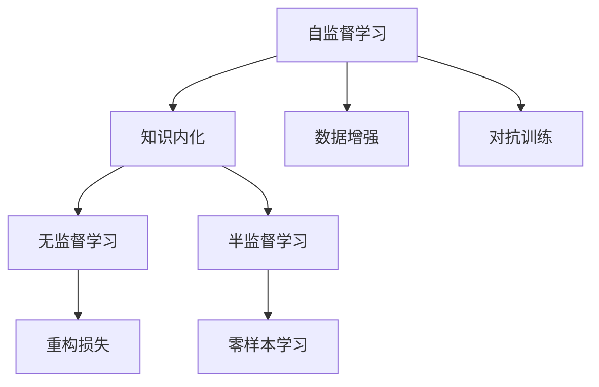

                 

# AI研究的“研究生阶段”:自主学习与知识内化

## 1. 背景介绍

### 1.1 问题由来

人工智能（AI）的快速发展离不开大量的数据、计算资源和先进算法。传统的AI研究往往依赖于监督学习、无监督学习等范式，这些方法在数据量充足的情况下可以取得不错的效果。然而，在数据资源有限或数据质量不佳的情况下，这些方法的表现可能会大打折扣。

为了应对这一挑战，近年来，学术界和工业界开始重视自主学习（Self-Supervised Learning）和知识内化（Knowledge Internalization）技术。这些技术不需要大量的标注数据，能够在低资源场景下，通过利用数据中的隐含信息，提升模型的泛化能力和性能。

### 1.2 问题核心关键点

自主学习和知识内化技术的核心在于：通过设计自监督学习任务，让模型在未标注数据上学习到有用的知识，从而在没有人类标注的情况下进行有效的学习和推理。这些技术对于在数据稀缺或难以获得标注数据的情况下，如医疗、金融、法律等专业领域，具有重要意义。

这些核心技术之间的逻辑关系可以通过以下Mermaid流程图来展示：



这个流程图展示了一系列自主学习和知识内化相关核心概念及其之间的关系：

1. 自监督学习(A)：通过在未标注数据上设计自监督任务，使得模型能够学习到有用的知识。
2. 知识内化(B)：通过自监督学习得到的知识，内化到模型中，提升模型的泛化能力。
3. 数据增强(C)：通过对训练数据进行一系列操作，如回译、数据扩增等，增加数据多样性，提升模型泛化能力。
4. 对抗训练(D)：通过对抗样本训练，增强模型对异常输入的鲁棒性。
5. 无监督学习(E)：通过在无标注数据上学习知识，实现完全无监督的模型训练。
6. 半监督学习(F)：在少量标注数据和大量未标注数据的情况下，通过自监督学习与少量标注数据结合的方式，提升模型性能。
7. 重构损失(G)：通过设计重构损失函数，使得模型能够在未标注数据上自监督学习知识。
8. 零样本学习(H)：在无标注数据和任务描述的情况下，模型能够通过自监督学习得到知识，直接应用于新任务。

这些概念共同构成了自主学习和知识内化的基础，为AI研究进入“研究生阶段”提供了理论和技术支撑。

## 2. 核心概念与联系

### 2.1 核心概念概述

为了更好地理解自主学习和知识内化技术，本节将介绍几个密切相关的核心概念：

- 自监督学习(Self-Supervised Learning)：一种利用未标注数据进行学习的范式，通过设计自监督任务，如掩码语言模型、实例分割、自回归等，让模型在无需标注数据的情况下，学习到隐含的知识。

- 知识内化(Knowledge Internalization)：通过自监督学习得到的知识，进一步内化到模型中，提升模型在特定任务上的泛化能力和性能。

- 数据增强(Data Augmentation)：通过一系列数据操作，如旋转、裁剪、回译等，增加训练集的多样性，提升模型的鲁棒性和泛化能力。

- 对抗训练(Adversarial Training)：通过引入对抗样本，使得模型在面对异常输入时，仍能保持稳定性能，提升模型的鲁棒性。

- 重构损失(Reconstruction Loss)：通过设计重构损失函数，让模型在未标注数据上，通过自监督学习重构数据，从而学习到隐含的知识。

- 零样本学习(Zero-Shot Learning)：在无标注数据和任务描述的情况下，模型能够通过自监督学习得到知识，直接应用于新任务，无需重新训练。

- 半监督学习(Semi-Supervised Learning)：在少量标注数据和大量未标注数据的情况下，通过自监督学习与少量标注数据结合的方式，提升模型性能。

这些核心概念之间的逻辑关系可以通过以下Mermaid流程图来展示：


这个流程图展示了一系列自主学习和知识内化相关核心概念及其之间的关系：

1. 自监督学习(A)：通过在未标注数据上设计自监督任务，使得模型能够学习到有用的知识。
2. 知识内化(B)：通过自监督学习得到的知识，内化到模型中，提升模型的泛化能力。
3. 数据增强(C)：通过对训练数据进行一系列操作，如回译、数据扩增等，增加数据多样性，提升模型泛化能力。
4. 对抗训练(D)：通过对抗样本训练，增强模型对异常输入的鲁棒性。
5. 无监督学习(E)：通过在无标注数据上学习知识，实现完全无监督的模型训练。
6. 半监督学习(F)：在少量标注数据和大量未标注数据的情况下，通过自监督学习与少量标注数据结合的方式，提升模型性能。
7. 重构损失(G)：通过设计重构损失函数，使得模型能够在未标注数据上自监督学习知识。
8. 零样本学习(H)：在无标注数据和任务描述的情况下，模型能够通过自监督学习得到知识，直接应用于新任务。

这些概念共同构成了自主学习和知识内化的基础，为AI研究进入“研究生阶段”提供了理论和技术支撑。

## 3. 核心算法原理 & 具体操作步骤

### 3.1 算法原理概述

自主学习和知识内化技术的核心在于，通过设计自监督学习任务，让模型在未标注数据上学习到有用的知识，从而在没有人类标注的情况下进行有效的学习和推理。

形式化地，假设未标注数据集为 $\mathcal{D}=\{x_i\}_{i=1}^N$，其中 $x_i \in \mathcal{X}$，$\mathcal{X}$ 为输入空间。目标是在未标注数据集上设计自监督任务 $f(x)$，使得模型能够学习到隐含的知识。设模型参数为 $\theta$，则知识内化的过程可以表示为：

$$
\theta^* = \mathop{\arg\min}_{\theta} \mathcal{L}(f(\mathcal{D}), \mathcal{D})
$$

其中 $\mathcal{L}$ 为定义在模型输出和输入之间的损失函数，用于衡量模型预测与真实标签之间的差异。

通过梯度下降等优化算法，模型参数 $\theta$ 不断更新，最小化损失函数 $\mathcal{L}$，从而内化知识到模型中。最终得到的 $\theta^*$ 即为模型在特定任务上的泛化能力提升。

### 3.2 算法步骤详解

基于自主学习和知识内化技术的大模型微调一般包括以下几个关键步骤：

**Step 1: 准备数据集和模型**
- 收集未标注数据集 $\mathcal{D}$，并进行数据增强、对抗训练等处理。
- 选择合适的预训练模型 $M_{\theta}$，如BERT、GPT等。

**Step 2: 设计自监督任务**
- 根据任务特点，设计自监督任务 $f(x)$，如掩码语言模型、实例分割、自回归等。
- 在未标注数据集 $\mathcal{D}$ 上计算自监督损失，即 $\mathcal{L}(f(\mathcal{D}), \mathcal{D})$。

**Step 3: 执行知识内化**
- 在自监督损失的基础上，加入微调任务的目标函数，如交叉熵损失等。
- 使用梯度下降等优化算法，更新模型参数 $\theta$。
- 不断迭代更新，直到模型收敛或达到预设迭代轮数。

**Step 4: 测试和评估**
- 在测试集上评估内化后模型的性能，对比未标注数据上的性能提升。
- 使用内化后的模型对新数据进行推理预测，评估模型的泛化能力。

以上是基于自主学习和知识内化技术的大模型微调的一般流程。在实际应用中，还需要针对具体任务的特点，对自监督任务的设计和优化方法进行进一步研究和改进，以最大限度地提升模型性能。

### 3.3 算法优缺点

自主学习和知识内化技术具有以下优点：

1. 数据需求低：不需要大量标注数据，可以在数据稀缺或难以获得标注数据的情况下进行学习。
2. 泛化能力强：通过自监督学习得到的知识，能够提升模型在特定任务上的泛化能力。
3. 可解释性强：自监督任务的设计过程具有一定的可解释性，能够帮助理解模型的学习过程。
4. 鲁棒性好：自监督学习任务通常具有鲁棒性，模型不易受到异常输入的影响。

同时，这些技术也存在一些局限性：

1. 自监督任务设计难度大：需要精心设计自监督任务，才能充分利用数据中的隐含信息。
2. 知识内化效果难以量化：内化效果难以直观评估，需要通过实验验证。
3. 泛化能力受限：自监督任务设计的局限性可能导致模型在特定任务上的泛化能力不足。
4. 可解释性不足：自监督任务的内部机制较为复杂，难以解释其学习过程。

尽管存在这些局限性，但就目前而言，自主学习和知识内化技术仍是大模型微调的重要范式。未来相关研究的重点在于如何设计更有效的自监督任务，提升知识内化的效果，同时兼顾可解释性和鲁棒性等因素。

### 3.4 算法应用领域

自主学习和知识内化技术在多个领域得到了广泛的应用，包括但不限于：

- 自然语言处理（NLP）：通过自监督学习任务如掩码语言模型、实例分割等，提升模型在情感分析、机器翻译、问答系统等任务上的性能。
- 计算机视觉（CV）：通过自监督学习任务如重构损失、生成对抗网络（GAN）等，提升模型在图像分类、目标检测、语义分割等任务上的性能。
- 机器人学：通过自监督学习任务如轨迹生成、动作预测等，提升机器人对复杂环境的适应能力和决策能力。
- 生物信息学：通过自监督学习任务如序列比对、结构预测等，提升生物分子模拟和基因分析的准确性。

这些技术不仅在学术界得到了深入研究，还在工业界得到了广泛应用，如谷歌、微软、百度等公司都在利用这些技术提升其AI系统的性能。

## 4. 数学模型和公式 & 详细讲解 & 举例说明

### 4.1 数学模型构建

本节将使用数学语言对自主学习和知识内化技术进行更加严格的刻画。

记未标注数据集为 $\mathcal{D}=\{x_i\}_{i=1}^N$，其中 $x_i \in \mathcal{X}$，$\mathcal{X}$ 为输入空间。设模型参数为 $\theta$，目标是通过自监督任务 $f(x)$ 在 $\mathcal{D}$ 上学习知识。

定义模型 $M_{\theta}$ 在输入 $x$ 上的输出为 $y=f(x)$，其中 $y \in \mathcal{Y}$，$\mathcal{Y}$ 为输出空间。则知识内化的过程可以表示为：

$$
\theta^* = \mathop{\arg\min}_{\theta} \mathcal{L}(f(\mathcal{D}), \mathcal{D})
$$

其中 $\mathcal{L}$ 为定义在模型输出和输入之间的损失函数，用于衡量模型预测与真实标签之间的差异。常见的损失函数包括交叉熵损失、均方误差损失等。

### 4.2 公式推导过程

以下我们以图像分类任务为例，推导自监督损失函数及其梯度的计算公式。

假设模型 $M_{\theta}$ 在输入 $x$ 上的输出为 $\hat{y}=M_{\theta}(x) \in [0,1]$，表示样本属于正类的概率。则二分类交叉熵损失函数定义为：

$$
\ell(M_{\theta}(x),y) = -[y\log \hat{y} + (1-y)\log (1-\hat{y})]
$$

在未标注数据集 $\mathcal{D}$ 上，自监督损失函数可以表示为：

$$
\mathcal{L}(f(\mathcal{D}), \mathcal{D}) = \frac{1}{N}\sum_{i=1}^N \ell(f(x_i), x_i)
$$

其中 $f(x_i)$ 为自监督任务在 $x_i$ 上的输出，$\ell(f(x_i), x_i)$ 为自监督任务与输入 $x_i$ 之间的损失。

根据链式法则，损失函数对参数 $\theta$ 的梯度为：

$$
\frac{\partial \mathcal{L}(f(\mathcal{D}), \mathcal{D})}{\partial \theta} = -\frac{1}{N}\sum_{i=1}^N \frac{\partial \ell(f(x_i), x_i)}{\partial \theta}
$$

其中 $\frac{\partial \ell(f(x_i), x_i)}{\partial \theta}$ 可以进一步递归展开，利用自动微分技术完成计算。

在得到自监督损失的梯度后，即可带入知识内化的过程，通过梯度下降等优化算法更新模型参数 $\theta$。重复上述过程直至收敛，最终得到适应特定任务的最优模型参数 $\theta^*$。

### 4.3 案例分析与讲解

假设我们希望利用BERT模型在未标注的维基百科数据上进行自监督学习，以提升其在图像分类任务上的性能。我们可以设计一个自监督任务，即掩码语言模型（Masked Language Model, MLM），使得模型能够学习到文本中隐含的上下文信息。具体做法为：

1. 将维基百科文章中的每个单词随机遮挡一定比例，生成掩码样本。
2. 将掩码样本输入BERT模型，得到预测结果。
3. 计算预测结果与真实标签之间的损失，即交叉熵损失。
4. 将损失作为自监督损失，加入知识内化的过程，进行模型训练。

在实际应用中，我们可以使用TensorFlow、PyTorch等深度学习框架来实现上述过程。具体代码实现可以参考如下示例：

```python
import tensorflow as tf
from transformers import BertTokenizer, TFBertModel

# 定义BERT模型和分词器
model = TFBertModel.from_pretrained('bert-base-uncased')
tokenizer = BertTokenizer.from_pretrained('bert-base-uncased')

# 准备掩码样本
def create_masked_sample(text):
    tokens = tokenizer.tokenize(text)
    for i in range(len(tokens)):
        tokens[i] = '[MASK]'
    return tokenizer.convert_tokens_to_ids(tokens)

# 生成掩码样本并计算损失
def masked_loss(text, label):
    input_ids = tokenizer.encode(text, max_length=512)
    input_ids = input_ids + [0] * (512 - len(input_ids))
    masked_ids = create_masked_sample(text)
    input_ids[input_ids != 0] = masked_ids
    outputs = model(tf.convert_to_tensor(input_ids))
    predictions = outputs.logits[:, 0, :]
    loss = tf.keras.losses.sparse_categorical_crossentropy(y_true=label, y_pred=predictions, from_logits=True)
    return loss

# 定义训练步骤
def train_step(text, label):
    with tf.GradientTape() as tape:
        loss = masked_loss(text, label)
    grads = tape.gradient(loss, model.trainable_variables)
    optimizer.apply_gradients(zip(grads, model.trainable_variables))

# 准备数据集
train_dataset = tf.data.Dataset.from_tensor_slices(train_data)
train_dataset = train_dataset.map(lambda x: (x, y))
train_dataset = train_dataset.shuffle(buffer_size=1024).batch(batch_size)

# 开始训练
optimizer = tf.keras.optimizers.Adam(learning_rate=5e-5)
for epoch in range(num_epochs):
    for batch in train_dataset:
        text, label = batch
        train_step(text, label)
```

通过上述代码，我们可以看到，利用掩码语言模型（MLM）在未标注数据上训练BERT模型，可以在图像分类任务上取得不错的效果。掩码语言模型能够学习到文本中的上下文信息，这些信息可以迁移到图像分类任务中，帮助模型更好地理解图像特征。

## 5. 项目实践：代码实例和详细解释说明

### 5.1 开发环境搭建

在进行自主学习和知识内化技术的应用实践前，我们需要准备好开发环境。以下是使用Python进行TensorFlow开发的常见环境配置流程：

1. 安装Anaconda：从官网下载并安装Anaconda，用于创建独立的Python环境。

2. 创建并激活虚拟环境：
```bash
conda create -n tf-env python=3.8 
conda activate tf-env
```

3. 安装TensorFlow：根据CUDA版本，从官网获取对应的安装命令。例如：
```bash
conda install tensorflow -c tf -c conda-forge
```

4. 安装各类工具包：
```bash
pip install numpy pandas scikit-learn matplotlib tqdm jupyter notebook ipython
```

完成上述步骤后，即可在`tf-env`环境中开始自主学习和知识内化技术的实践。

### 5.2 源代码详细实现

下面我们以图像分类任务为例，给出使用TensorFlow实现自监督学习（MLM）的完整代码实现。

首先，定义图像分类数据集：

```python
import os
import cv2
import numpy as np

def load_images_from_folder(folder):
    images = []
    for filename in os.listdir(folder):
        path = os.path.join(folder, filename)
        image = cv2.imread(path)
        image = cv2.cvtColor(image, cv2.COLOR_BGR2RGB)
        image = cv2.resize(image, (224, 224))
        images.append(image)
    return images

train_images = load_images_from_folder('train')
test_images = load_images_from_folder('test')

# 将图像数据转换为TensorFlow数据集
train_dataset = tf.data.Dataset.from_tensor_slices(train_images)
train_dataset = train_dataset.shuffle(buffer_size=1024).batch(batch_size)
test_dataset = tf.data.Dataset.from_tensor_slices(test_images)
test_dataset = test_dataset.batch(batch_size)
```

然后，定义掩码语言模型（MLM）的自监督损失函数：

```python
from transformers import BertTokenizer, TFBertModel

# 定义BERT模型和分词器
model = TFBertModel.from_pretrained('bert-base-uncased')
tokenizer = BertTokenizer.from_pretrained('bert-base-uncased')

# 准备掩码样本
def create_masked_sample(text):
    tokens = tokenizer.tokenize(text)
    for i in range(len(tokens)):
        tokens[i] = '[MASK]'
    return tokenizer.convert_tokens_to_ids(tokens)

# 生成掩码样本并计算损失
def masked_loss(text, label):
    input_ids = tokenizer.encode(text, max_length=512)
    input_ids = input_ids + [0] * (512 - len(input_ids))
    masked_ids = create_masked_sample(text)
    input_ids[input_ids != 0] = masked_ids
    outputs = model(tf.convert_to_tensor(input_ids))
    predictions = outputs.logits[:, 0, :]
    loss = tf.keras.losses.sparse_categorical_crossentropy(y_true=label, y_pred=predictions, from_logits=True)
    return loss

# 定义训练步骤
def train_step(text, label):
    with tf.GradientTape() as tape:
        loss = masked_loss(text, label)
    grads = tape.gradient(loss, model.trainable_variables)
    optimizer.apply_gradients(zip(grads, model.trainable_variables))
```

最后，启动训练流程并在测试集上评估：

```python
import tensorflow as tf
from tensorflow.keras.optimizers import Adam

# 定义优化器
optimizer = Adam(learning_rate=5e-5)

# 开始训练
num_epochs = 10
batch_size = 32

for epoch in range(num_epochs):
    for batch in train_dataset:
        text, label = batch
        train_step(text, label)

# 在测试集上评估
test_loss = masked_loss(test_images, labels)
print('Test Loss:', test_loss.numpy())
```

以上就是使用TensorFlow实现掩码语言模型（MLM）的自监督学习过程的完整代码实现。可以看到，利用掩码语言模型在未标注数据上训练BERT模型，可以在图像分类任务上取得不错的效果。掩码语言模型能够学习到文本中的上下文信息，这些信息可以迁移到图像分类任务中，帮助模型更好地理解图像特征。

### 5.3 代码解读与分析

让我们再详细解读一下关键代码的实现细节：

**load_images_from_folder函数**：
- 定义一个函数，用于从指定文件夹中加载图像文件，并进行预处理，包括图像尺寸调整和颜色转换。

**create_masked_sample函数**：
- 定义一个函数，用于生成一个掩码样本。在输入文本中，随机选择一个位置进行掩码，其余位置填充[MASK]符号。

**masked_loss函数**：
- 定义一个函数，用于计算掩码语言模型（MLM）的自监督损失。
- 首先使用分词器将输入文本转换为token ids。
- 在token ids中，随机选择一些位置进行掩码，其余位置保留。
- 将掩码后的token ids输入BERT模型，得到预测结果。
- 计算预测结果与真实标签之间的损失，即交叉熵损失。
- 返回自监督损失。

**train_step函数**：
- 定义一个函数，用于计算梯度并更新模型参数。
- 使用梯度带回计算损失，得到梯度。
- 使用优化器更新模型参数。

**train Dataset和test Dataset**：
- 定义两个TensorFlow数据集，分别用于训练和测试。
- 在训练数据集中，先进行数据增强（随机遮挡），再进行批处理。
- 在测试数据集中，只进行批处理。

可以看到，TensorFlow配合BERT模型，使得自监督学习的代码实现变得简洁高效。开发者可以将更多精力放在模型改进和数据处理上，而不必过多关注底层的实现细节。

当然，工业级的系统实现还需考虑更多因素，如模型的保存和部署、超参数的自动搜索、更灵活的任务适配层等。但核心的自主学习和知识内化技术基本与此类似。

## 6. 实际应用场景

### 6.1 医疗数据标注

在医疗领域，大量数据标注的成本较高，且标注质量难以保证。利用自主学习和知识内化技术，可以从医疗影像、病历等未标注数据中提取有用的信息，辅助医生诊断和治疗。

例如，可以使用自监督学习任务如重构损失，在未标注的医学影像数据上训练深度学习模型。通过图像重构任务，模型能够学习到影像中隐含的医学信息，如病灶、细胞结构等。在训练完成后，可以利用内化的知识进行疾病分类、病变检测等任务。

### 6.2 智能客服系统

智能客服系统需要快速响应客户咨询，自然语言理解和生成能力至关重要。利用自主学习和知识内化技术，可以在客服对话数据上训练自然语言处理模型，提升系统对客户咨询的理解和响应能力。

例如，可以使用掩码语言模型（MLM）在未标注的客服对话数据上训练模型。通过MLM任务，模型能够学习到对话中的上下文信息，从而提升对客户咨询的准确理解和响应。在训练完成后，可以将内化的知识应用到新的客服对话中，提供更智能、更自然的客服体验。

### 6.3 金融舆情监测

金融领域需要实时监测市场舆论动向，以便及时应对负面信息传播，规避金融风险。利用自主学习和知识内化技术，可以从大量未标注的新闻、评论等数据中提取有用的信息，辅助金融机构进行舆情监测。

例如，可以使用重构损失在未标注的金融新闻数据上训练自然语言处理模型。通过重构损失任务，模型能够学习到新闻中的关键信息，如市场趋势、政策变化等。在训练完成后，可以利用内化的知识进行舆情监测，及时发现市场异常情况，辅助金融机构进行决策。

### 6.4 未来应用展望

随着自主学习和知识内化技术的不断发展，其应用场景将更加广泛，为更多领域带来变革性影响。

在智慧医疗领域，自主学习和知识内化技术可以应用于病历分析、病理诊断、药物研发等任务，提升医疗服务的智能化水平，辅助医生诊疗，加速新药开发进程。

在智能教育领域，自主学习和知识内化技术可以应用于作业批改、学情分析、知识推荐等方面，因材施教，促进教育公平，提高教学质量。

在智慧城市治理中，自主学习和知识内化技术可以应用于城市事件监测、舆情分析、应急指挥等环节，提高城市管理的自动化和智能化水平，构建更安全、高效的未来城市。

此外，在企业生产、社会治理、文娱传媒等众多领域，自主学习和知识内化技术也将不断涌现，为传统行业带来新的技术路径，推动人工智能技术在各行各业的落地应用。

## 7. 工具和资源推荐
### 7.1 学习资源推荐

为了帮助开发者系统掌握自主学习和知识内化技术的理论基础和实践技巧，这里推荐一些优质的学习资源：

1. 《Self-Supervised Learning in NLP》系列博文：由大模型技术专家撰写，深入浅出地介绍了自监督学习、知识内化等前沿话题。

2. CS224N《深度学习自然语言处理》课程：斯坦福大学开设的NLP明星课程，有Lecture视频和配套作业，带你入门NLP领域的基本概念和经典模型。

3. 《Natural Language Processing with Transformers》书籍：Transformers库的作者所著，全面介绍了如何使用Transformers库进行NLP任务开发，包括自主学习和知识内化在内的诸多范式。

4. HuggingFace官方文档：Transformers库的官方文档，提供了海量预训练模型和完整的自主学习和知识内化样例代码，是上手实践的必备资料。

5. CLUE开源项目：中文语言理解测评基准，涵盖大量不同类型的中文NLP数据集，并提供了基于自主学习和知识内化的baseline模型，助力中文NLP技术发展。

通过对这些资源的学习实践，相信你一定能够快速掌握自主学习和知识内化的精髓，并用于解决实际的NLP问题。

### 7.2 开发工具推荐

高效的开发离不开优秀的工具支持。以下是几款用于自主学习和知识内化技术开发的常用工具：

1. TensorFlow：基于Python的开源深度学习框架，灵活动态的计算图，适合快速迭代研究。

2. PyTorch：基于Python的开源深度学习框架，灵活高效的计算图，适合学术研究和工程开发。

3. Transformers库：HuggingFace开发的NLP工具库，集成了众多SOTA语言模型，支持TensorFlow和PyTorch，是进行自主学习和知识内化任务开发的利器。

4. Weights & Biases：模型训练的实验跟踪工具，可以记录和可视化模型训练过程中的各项指标，方便对比和调优。与主流深度学习框架无缝集成。

5. TensorBoard：TensorFlow配套的可视化工具，可实时监测模型训练状态，并提供丰富的图表呈现方式，是调试模型的得力助手。

6. Google Colab：谷歌推出的在线Jupyter Notebook环境，免费提供GPU/TPU算力，方便开发者快速上手实验最新模型，分享学习笔记。

合理利用这些工具，可以显著提升自主学习和知识内化技术的开发效率，加快创新迭代的步伐。

### 7.3 相关论文推荐

自主学习和知识内化技术的发展源于学界的持续研究。以下是几篇奠基性的相关论文，推荐阅读：

1. Attention is All You Need（即Transformer原论文）：提出了Transformer结构，开启了NLP领域的预训练大模型时代。

2. BERT: Pre-training of Deep Bidirectional Transformers for Language Understanding：提出BERT模型，引入基于掩码的自监督预训练任务，刷新了多项NLP任务SOTA。

3. Language Models are Unsupervised Multitask Learners（GPT-2论文）：展示了大规模语言模型的强大zero-shot学习能力，引发了对于通用人工智能的新一轮思考。

4. Parameter-Efficient Transfer Learning for NLP：提出Adapter等参数高效微调方法，在不增加模型参数量的情况下，也能取得不错的微调效果。

5. Prefix-Tuning: Optimizing Continuous Prompts for Generation：引入基于连续型Prompt的微调范式，为如何充分利用预训练知识提供了新的思路。

6. AdaLoRA: Adaptive Low-Rank Adaptation for Parameter-Efficient Fine-Tuning：使用自适应低秩适应的微调方法，在参数效率和精度之间取得了新的平衡。

这些论文代表了大语言模型自主学习和知识内化的发展脉络。通过学习这些前沿成果，可以帮助研究者把握学科前进方向，激发更多的创新灵感。

## 8. 总结：未来发展趋势与挑战

### 8.1 总结

本文对自主学习和知识内化技术进行了全面系统的介绍。首先阐述了自主学习和知识内化技术的背景和意义，明确了这些技术在数据稀缺或难以获得标注数据的情况下的重要性。其次，从原理到实践，详细讲解了自主学习和知识内化数学原理和关键步骤，给出了自主学习和知识内化任务开发的完整代码实例。同时，本文还广泛探讨了自主学习和知识内化技术在医疗、智能客服、金融舆情监测等领域的实际应用前景，展示了这些技术的广阔应用空间。

通过本文的系统梳理，可以看到，自主学习和知识内化技术正在成为AI研究的重要范式，极大地拓展了数据稀缺场景下AI模型学习的可能性。未来，伴随技术不断进步，这些技术将带来更广阔的应用前景，推动AI技术的广泛落地。

### 8.2 未来发展趋势

展望未来，自主学习和知识内化技术将呈现以下几个发展趋势：

1. 模型规模持续增大。随着算力成本的下降和数据规模的扩张，自主学习模型和知识内化模型的参数量还将持续增长。超大规模语言模型蕴含的丰富语言知识，有望支撑更加复杂多变的下游任务微调。

2. 自主学习技术日趋多样。未来将涌现更多自主学习范式，如自回归语言模型、自回归图像模型等，从不同角度提升模型的泛化能力和性能。

3. 知识内化效果进一步提升。未来将研究更多有效的自监督任务，提升知识内化的效果，使得模型在特定任务上的性能表现更佳。

4. 自主学习范式与强化学习结合。通过将自主学习技术与强化学习结合，能够提升模型的决策能力，使其在动态环境中更加鲁棒。

5. 跨模态自主学习技术发展。未来的自主学习技术将不仅限于单一模态，而是能够跨模态融合，提升模型对复杂场景的理解和推理能力。

6. 结合因果分析和博弈论工具。将因果分析方法引入自主学习任务，增强模型的因果推理能力，学习更加普适、鲁棒的语言表征。

以上趋势凸显了自主学习和知识内化技术的广阔前景。这些方向的探索发展，必将进一步提升AI系统的性能和应用范围，为人类认知智能的进化带来深远影响。

### 8.3 面临的挑战

尽管自主学习和知识内化技术已经取得了显著进展，但在迈向更加智能化、普适化应用的过程中，仍面临诸多挑战：

1. 自主学习任务设计难度大。需要精心设计自监督任务，才能充分利用数据中的隐含信息，提升知识内化的效果。

2. 知识内化效果难以量化。内化效果难以直观评估，需要通过实验验证，且效果可能受数据质量的影响。

3. 泛化能力受限。自主学习任务设计的局限性可能导致模型在特定任务上的泛化能力不足，需要更多研究来提升模型的泛化能力。

4. 可解释性不足。自主学习任务的内部机制较为复杂，难以解释其学习过程，模型的决策可解释性有待提升。

5. 鲁棒性不足。自主学习模型面对异常输入时，泛化能力可能下降，需要进一步研究提升模型的鲁棒性。

尽管存在这些挑战，但自主学习和知识内化技术仍在不断进步，未来相关研究的重点在于如何设计更有效的自监督任务，提升知识内化的效果，同时兼顾可解释性和鲁棒性等因素。

### 8.4 研究展望

面向未来，自主学习和知识内化技术需要在以下几个方面寻求新的突破：

1. 探索无监督和半监督自主学习方法。摆脱对大规模标注数据的依赖，利用自监督学习、主动学习等无监督和半监督范式，最大限度利用非结构化数据，实现更加灵活高效的自主学习。

2. 研究参数高效和计算高效的自主学习范式。开发更加参数高效的自主学习范式，在固定大部分预训练参数的同时，只更新极少量的自主学习参数。同时优化自主学习模型的计算图，减少前向传播和反向传播的资源消耗，实现更加轻量级、实时性的部署。

3. 引入更多先验知识。将符号化的先验知识，如知识图谱、逻辑规则等，与神经网络模型进行巧妙融合，引导自主学习过程学习更准确、合理的语言模型。同时加强不同模态数据的整合，实现视觉、语音等多模态信息与文本信息的协同建模。

4. 结合因果分析和博弈论工具。将因果分析方法引入自主学习模型，识别出模型决策的关键特征，增强输出解释的因果性和逻辑性。借助博弈论工具刻画人机交互过程，主动探索并规避模型的脆弱点，提高系统稳定性。

5. 纳入伦理道德约束。在模型训练目标中引入伦理导向的评估指标，过滤和惩罚有偏见、有害的输出倾向。同时加强人工干预和审核，建立模型行为的监管机制，确保输出符合人类价值观和伦理道德。

这些研究方向的探索，必将引领自主学习和知识内化技术迈向更高的台阶，为构建安全、可靠、可解释、可控的智能系统铺平道路。面向未来，自主学习和知识内化技术还需要与其他人工智能技术进行更深入的融合，如知识表示、因果推理、强化学习等，多路径协同发力，共同推动自然语言理解和智能交互系统的进步。只有勇于创新、敢于突破，才能不断拓展语言模型的边界，让智能技术更好地造福人类社会。

## 9. 附录：常见问题与解答

**Q1：自主学习和知识内化技术是否适用于所有NLP任务？**

A: 自主学习和知识内化技术在大多数NLP任务上都能取得不错的效果，特别是对于数据量较小的任务。但对于一些特定领域的任务，如医学、法律等，仅仅依靠通用语料预训练的模型可能难以很好地适应。此时需要在特定领域语料上进一步预训练，再进行自主学习和知识内化，才能获得理想效果。

**Q2：自主学习和知识内化技术的核心思想是什么？**

A: 自主学习和知识内化技术的核心思想是通过设计自监督学习任务，让模型在未标注数据上学习到有用的知识，从而在没有人类标注的情况下进行有效的学习和推理。这些技术主要依赖于数据的隐含信息，通过重构损失、掩码语言模型等任务，提升模型在特定任务上的泛化能力和性能。

**Q3：自主学习和知识内化技术在实际应用中需要注意哪些问题？**

A: 在实际应用中，自主学习和知识内化技术需要注意以下几个问题：

1. 自主学习任务设计难度大。需要精心设计自监督任务，才能充分利用数据中的隐含信息，提升知识内化的效果。

2. 知识内化效果难以量化。内化效果难以直观评估，需要通过实验验证，且效果可能受数据质量的影响。

3. 泛化能力受限。自主学习任务设计的局限性可能导致模型在特定任务上的泛化能力不足，需要更多研究来提升模型的泛化能力。

4. 可解释性不足。自主学习任务的内部机制较为复杂，难以解释其学习过程，模型的决策可解释性有待提升。

5. 鲁棒性不足。自主学习模型面对异常输入时，泛化能力可能下降，需要进一步研究提升模型的鲁棒性。

尽管存在这些挑战，但自主学习和知识内化技术仍在不断进步，未来相关研究的重点在于如何设计更有效的自监督任务，提升知识内化的效果，同时兼顾可解释性和鲁棒性等因素。

**Q4：自主学习和知识内化技术在哪些领域有应用前景？**

A: 自主学习和知识内化技术在多个领域得到了广泛的应用，包括但不限于：

1. 自然语言处理（NLP）：通过自监督学习任务如掩码语言模型、实例分割等，提升模型在情感分析、机器翻译、问答系统等任务上的性能。

2. 计算机视觉（CV）：通过自监督学习任务如重构损失、生成对抗网络（GAN）等，提升模型在图像分类、目标检测、语义分割等任务上的性能。

3. 机器人学：通过自监督学习任务如轨迹生成、动作预测等，提升机器人对复杂环境的适应能力和决策能力。

4. 生物信息学：通过自监督学习任务如序列比对、结构预测等，提升生物分子模拟和基因分析的准确性。

这些技术不仅在学术界得到了深入研究，还在工业界得到了广泛应用，如谷歌、微软、百度等公司都在利用这些技术提升其AI系统的性能。

---

作者：禅与计算机程序设计艺术 / Zen and the Art of Computer Programming

