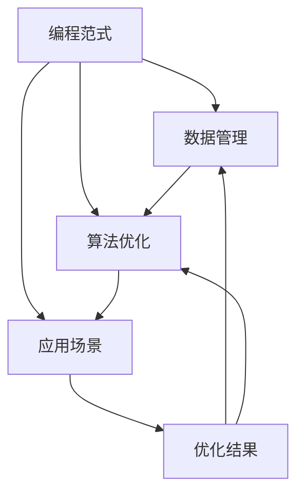

                 

## 1. 背景介绍

### 1.1 问题由来

随着人工智能(AI)技术的飞速发展，编程范式和语言也在不断演变。从早期单一的机器指令到高级的面向对象编程、函数式编程，再到今天更加灵活的声明式编程和组件化编程，编程范式正不断地突破传统，迈向新的高度。这些演进不仅提升了开发效率，也带来了全新的技术挑战。本文将深入探讨AI编程的新思路与技术挑战，为AI开发者提供全面的参考。

### 1.2 问题核心关键点

AI编程的主要目标是通过数据驱动和算法优化，让机器具备自动学习和决策的能力。其中，编程范式、数据管理、算法优化和应用场景等几个关键点构成了AI编程的核心。如何设计出既高效又易于维护的编程体系，成为AI领域持续研究的重点。

本文将从编程范式的设计、数据管理的优化、算法的创新与应用场景的拓展等几个方面，全面探讨AI编程的新思路与技术挑战。通过系统的梳理，帮助读者理解和掌握最新的AI编程技术。

## 2. 核心概念与联系

### 2.1 核心概念概述

为更好地理解AI编程的新思路与技术挑战，我们首先需要明确几个关键概念：

- **编程范式**：编程范式是指编程时所遵循的基本方式或风格。它决定了程序的结构、组织和表达方式。常见的编程范式包括面向对象、函数式、声明式等。
- **数据管理**：数据管理是指如何组织、存储和操作数据。对于AI编程，数据管理尤为重要，因为数据质量直接决定了模型训练的效果。
- **算法优化**：算法优化是指通过各种技术手段，提升算法的效率和效果。对于AI编程，算法优化是确保模型快速收敛和鲁棒性的关键。
- **应用场景**：应用场景是指编程技术在实际应用中的具体情境。AI编程的应用场景广泛，包括自然语言处理(NLP)、计算机视觉(CV)、语音识别等。

这些概念之间的联系通过以下Mermaid流程图进行展示：



这个流程图展示了编程范式、数据管理、算法优化和应用场景之间的相互影响与协同作用。

## 3. 核心算法原理 & 具体操作步骤

### 3.1 算法原理概述

AI编程的核心是数据驱动和算法优化。数据驱动意味着程序的设计和优化要以数据为基础，通过数据来指导算法的选择和调整。算法优化则是指通过技术手段提升算法的效率和效果，确保模型在实际应用中表现出色。

AI编程的算法原理主要包括以下几个方面：

1. **深度学习算法**：深度学习算法通过多层神经网络模拟人类神经系统的信息处理方式，能够处理非线性、高维度数据。常见的深度学习算法包括卷积神经网络(CNN)、循环神经网络(RNN)、长短期记忆网络(LSTM)等。
2. **强化学习算法**：强化学习算法通过奖励机制来指导模型学习最优策略。常见的强化学习算法包括Q-learning、SARSA等。
3. **迁移学习**：迁移学习是指将一个领域学到的知识应用到另一个领域，以加速模型在特定任务上的学习。常见的迁移学习包括知识蒸馏、微调等。
4. **模型压缩**：模型压缩是指在不影响模型性能的前提下，减小模型大小，提升模型推理速度。常见的模型压缩技术包括剪枝、量化、稀疏化等。

### 3.2 算法步骤详解

AI编程的算法步骤主要包括以下几个关键环节：

1. **数据预处理**：数据预处理是AI编程的重要环节，包括数据清洗、归一化、特征工程等。数据预处理的目的是提升数据质量，确保模型训练的效果。
2. **模型训练**：模型训练是AI编程的核心环节，包括选择合适的算法、设置合适的超参数、使用合适的优化器等。模型训练的目的是通过优化算法参数，使模型在训练集上表现出色。
3. **模型评估**：模型评估是AI编程的必要环节，包括使用验证集和测试集评估模型性能、分析模型预测结果、调整模型参数等。模型评估的目的是确保模型在实际应用中表现出色。
4. **模型部署**：模型部署是将训练好的模型应用到实际场景中的过程。模型部署的目的是确保模型在生产环境中稳定运行，提升用户体验。

### 3.3 算法优缺点

AI编程的算法优缺点如下：

**优点**：

1. **高效性**：AI编程能够处理大规模数据集，高效地训练模型。
2. **灵活性**：AI编程能够根据数据特点，灵活选择算法和优化策略。
3. **可解释性**：AI编程可以通过特征分析、可视化等方式，提升模型的可解释性。

**缺点**：

1. **高成本**：AI编程需要大量计算资源和数据资源，成本较高。
2. **复杂性**：AI编程涉及复杂算法和大量数据处理，容易出错。
3. **可解释性不足**：AI编程的模型往往是"黑盒"，难以解释其内部工作机制。

### 3.4 算法应用领域

AI编程的应用领域广泛，主要包括以下几个方面：

1. **自然语言处理**：自然语言处理是AI编程的重要应用领域，包括文本分类、情感分析、机器翻译等。
2. **计算机视觉**：计算机视觉是AI编程的另一个重要应用领域，包括图像识别、目标检测、图像生成等。
3. **语音识别**：语音识别是AI编程的最新应用领域，包括语音合成、语音识别等。
4. **智能推荐**：智能推荐是AI编程的典型应用场景，包括商品推荐、内容推荐等。
5. **自动驾驶**：自动驾驶是AI编程的重要前沿应用，包括环境感知、路径规划等。

## 4. 数学模型和公式 & 详细讲解

### 4.1 数学模型构建

AI编程的数学模型构建主要包括以下几个方面：

1. **神经网络模型**：神经网络模型是AI编程的核心模型，包括多层感知机(MLP)、卷积神经网络(CNN)、循环神经网络(RNN)等。
2. **强化学习模型**：强化学习模型是AI编程的另一个重要模型，包括Q-learning、SARSA等。
3. **迁移学习模型**：迁移学习模型是将一个领域学到的知识应用到另一个领域的模型，包括知识蒸馏、微调等。

### 4.2 公式推导过程

以多层感知机(MLP)为例，推导其前向传播和反向传播公式。

**前向传播公式**：

$$
\begin{aligned}
\mathbf{h} &= \mathbf{W}_1 \mathbf{x} + \mathbf{b}_1 \\
\mathbf{y} &= \mathbf{W}_2 \mathbf{h} + \mathbf{b}_2
\end{aligned}
$$

其中，$\mathbf{x}$ 为输入，$\mathbf{y}$ 为输出，$\mathbf{h}$ 为隐藏层输出，$\mathbf{W}_1$ 和 $\mathbf{W}_2$ 为权重矩阵，$\mathbf{b}_1$ 和 $\mathbf{b}_2$ 为偏置向量。

**反向传播公式**：

$$
\begin{aligned}
\frac{\partial \mathcal{L}}{\partial \mathbf{W}_1} &= \frac{\partial \mathcal{L}}{\partial \mathbf{h}} \cdot \mathbf{h}^T \\
\frac{\partial \mathcal{L}}{\partial \mathbf{W}_2} &= \frac{\partial \mathcal{L}}{\partial \mathbf{y}} \cdot \mathbf{y}^T \\
\frac{\partial \mathcal{L}}{\partial \mathbf{b}_1} &= \frac{\partial \mathcal{L}}{\partial \mathbf{h}} \\
\frac{\partial \mathcal{L}}{\partial \mathbf{b}_2} &= \frac{\partial \mathcal{L}}{\partial \mathbf{y}}
\end{aligned}
$$

其中，$\mathcal{L}$ 为损失函数，$\frac{\partial \mathcal{L}}{\partial \mathbf{W}_1}$ 和 $\frac{\partial \mathcal{L}}{\partial \mathbf{W}_2}$ 为权重矩阵的梯度，$\frac{\partial \mathcal{L}}{\partial \mathbf{b}_1}$ 和 $\frac{\partial \mathcal{L}}{\partial \mathbf{b}_2}$ 为偏置向量的梯度。

### 4.3 案例分析与讲解

以自然语言处理(NLP)为例，分析其在AI编程中的应用。

**文本分类**：文本分类是NLP中的一个重要任务，通过训练模型将文本分为不同类别。常见的文本分类算法包括朴素贝叶斯、支持向量机(SVM)、卷积神经网络(CNN)等。

**情感分析**：情感分析是NLP中的另一个重要任务，通过训练模型分析文本的情感倾向。常见的情感分析算法包括LSTM、GRU等。

## 5. 项目实践：代码实例和详细解释说明

### 5.1 开发环境搭建

在进行AI编程实践前，我们需要准备好开发环境。以下是使用Python进行TensorFlow开发的环境配置流程：

1. 安装Anaconda：从官网下载并安装Anaconda，用于创建独立的Python环境。

2. 创建并激活虚拟环境：
```bash
conda create -n tf-env python=3.8 
conda activate tf-env
```

3. 安装TensorFlow：根据CUDA版本，从官网获取对应的安装命令。例如：
```bash
pip install tensorflow
```

4. 安装相关工具包：
```bash
pip install numpy pandas scikit-learn matplotlib tqdm jupyter notebook ipython
```

完成上述步骤后，即可在`tf-env`环境中开始AI编程实践。

### 5.2 源代码详细实现

下面我们以自然语言处理(NLP)中的文本分类任务为例，给出使用TensorFlow进行模型训练的PyTorch代码实现。

首先，定义文本分类任务的数据处理函数：

```python
from tensorflow.keras.preprocessing.text import Tokenizer
from tensorflow.keras.preprocessing.sequence import pad_sequences

def load_data(path, max_len=128):
    with open(path, 'r', encoding='utf-8') as f:
        lines = f.readlines()
    texts = [line.strip() for line in lines]
    labels = [int(label) for line in lines]

    tokenizer = Tokenizer(num_words=10000)
    tokenizer.fit_on_texts(texts)
    sequences = tokenizer.texts_to_sequences(texts)
    padded_sequences = pad_sequences(sequences, maxlen=max_len, padding='post')

    return padded_sequences, labels
```

然后，定义模型和优化器：

```python
from tensorflow.keras.models import Sequential
from tensorflow.keras.layers import Embedding, LSTM, Dense

model = Sequential()
model.add(Embedding(input_dim=10000, output_dim=128, input_length=max_len))
model.add(LSTM(128))
model.add(Dense(1, activation='sigmoid'))

optimizer = tf.keras.optimizers.Adam(learning_rate=0.001)
```

接着，定义训练和评估函数：

```python
from tensorflow.keras.callbacks import EarlyStopping

def train_epoch(model, data, batch_size, optimizer):
    model.compile(optimizer=optimizer, loss='binary_crossentropy', metrics=['accuracy'])
    model.fit(x=data[0], y=data[1], batch_size=batch_size, epochs=10, validation_split=0.2)
    
def evaluate(model, test_data, batch_size):
    test_loss, test_acc = model.evaluate(test_data[0], test_data[1], batch_size=batch_size)
    print(f'Test loss: {test_loss:.4f}, Test accuracy: {test_acc:.4f}')
```

最后，启动训练流程并在测试集上评估：

```python
train_data, train_labels = load_data('train.txt')
dev_data, dev_labels = load_data('dev.txt')
test_data, test_labels = load_data('test.txt')

train_epoch(model, train_data, batch_size=32, optimizer=optimizer)
evaluate(model, dev_data, batch_size=32)
evaluate(model, test_data, batch_size=32)
```

以上就是使用TensorFlow对文本分类任务进行模型训练的完整代码实现。可以看到，TensorFlow的高级API使得模型训练和评估变得简洁高效。

### 5.3 代码解读与分析

让我们再详细解读一下关键代码的实现细节：

**load_data函数**：
- 定义了文本和标签的加载函数，将文本文件读入，并进行文本向量化、填充等预处理。

**train_epoch函数**：
- 定义了模型训练的函数，使用Adam优化器，设置合适的学习率和损失函数，使用EarlyStopping避免过拟合。

**evaluate函数**：
- 定义了模型评估的函数，在测试集上评估模型的损失和准确率。

**训练流程**：
- 定义了训练的epoch数和批量大小，开始循环迭代
- 每个epoch内，先在训练集上训练，输出损失和准确率
- 在验证集上评估，输出验证集结果
- 所有epoch结束后，在测试集上评估，输出最终测试结果

可以看到，TensorFlow提供了丰富的API，使得模型训练和评估变得非常简单。开发者可以将更多精力放在数据处理和模型优化上，而不必过多关注底层的实现细节。

当然，工业级的系统实现还需考虑更多因素，如模型的保存和部署、超参数的自动搜索、更灵活的任务适配层等。但核心的训练范式基本与此类似。

## 6. 实际应用场景

### 6.1 智能客服系统

基于AI编程的智能客服系统，可以广泛应用于企业客户服务领域。传统的客服系统需要大量人力，高峰期响应缓慢，且一致性和专业性难以保证。使用AI编程构建的智能客服系统，可以7x24小时不间断服务，快速响应客户咨询，用自然流畅的语言解答各类常见问题。

在技术实现上，可以收集企业内部的历史客服对话记录，将问题和最佳答复构建成监督数据，在此基础上对预训练模型进行微调。微调后的模型能够自动理解用户意图，匹配最合适的答案模板进行回复。对于客户提出的新问题，还可以接入检索系统实时搜索相关内容，动态组织生成回答。如此构建的智能客服系统，能大幅提升客户咨询体验和问题解决效率。

### 6.2 金融舆情监测

金融机构需要实时监测市场舆论动向，以便及时应对负面信息传播，规避金融风险。传统的人工监测方式成本高、效率低，难以应对网络时代海量信息爆发的挑战。基于AI编程的文本分类和情感分析技术，为金融舆情监测提供了新的解决方案。

具体而言，可以收集金融领域相关的新闻、报道、评论等文本数据，并对其进行主题标注和情感标注。在此基础上对预训练语言模型进行微调，使其能够自动判断文本属于何种主题，情感倾向是正面、中性还是负面。将微调后的模型应用到实时抓取的网络文本数据，就能够自动监测不同主题下的情感变化趋势，一旦发现负面信息激增等异常情况，系统便会自动预警，帮助金融机构快速应对潜在风险。

### 6.3 个性化推荐系统

当前的推荐系统往往只依赖用户的历史行为数据进行物品推荐，无法深入理解用户的真实兴趣偏好。基于AI编程的个性化推荐系统可以更好地挖掘用户行为背后的语义信息，从而提供更精准、多样的推荐内容。

在实践中，可以收集用户浏览、点击、评论、分享等行为数据，提取和用户交互的物品标题、描述、标签等文本内容。将文本内容作为模型输入，用户的后续行为（如是否点击、购买等）作为监督信号，在此基础上微调预训练语言模型。微调后的模型能够从文本内容中准确把握用户的兴趣点。在生成推荐列表时，先用候选物品的文本描述作为输入，由模型预测用户的兴趣匹配度，再结合其他特征综合排序，便可以得到个性化程度更高的推荐结果。

### 6.4 未来应用展望

随着AI编程技术的发展，未来其在更多领域的应用前景将更加广阔。例如：

- **智慧医疗**：基于AI编程的医疗问答、病历分析、药物研发等应用将提升医疗服务的智能化水平，辅助医生诊疗，加速新药开发进程。
- **智能教育**：AI编程可应用于作业批改、学情分析、知识推荐等方面，因材施教，促进教育公平，提高教学质量。
- **智慧城市治理**：AI编程可应用于城市事件监测、舆情分析、应急指挥等环节，提高城市管理的自动化和智能化水平，构建更安全、高效的未来城市。
- **自动驾驶**：AI编程的重要前沿应用，包括环境感知、路径规划等，将推动自动驾驶技术的发展。
- **智能家居**：AI编程可应用于智能家居设备的语音识别、场景感知等方面，提升用户的生活体验。

此外，在企业生产、社会治理、文娱传媒等众多领域，AI编程技术也将不断涌现，为经济社会发展注入新的动力。相信随着技术的日益成熟，AI编程范式将成为人工智能落地应用的重要范式，推动人工智能技术在更广阔领域的应用。

## 7. 工具和资源推荐

### 7.1 学习资源推荐

为了帮助开发者系统掌握AI编程的理论基础和实践技巧，这里推荐一些优质的学习资源：

1. **《TensorFlow 2.0实战》**：作者邱老师，系统介绍TensorFlow 2.0的各项功能和应用，结合实例进行详细讲解。
2. **《深度学习与TensorFlow》**：清华大学出版社出版的教材，全面介绍了深度学习的基础知识和TensorFlow的使用。
3. **《深度学习框架TensorFlow 2.x实战》**：人民日报出版社出版的教材，系统介绍了TensorFlow 2.x的各种功能和使用技巧。
4. **TensorFlow官方文档**：提供了丰富的API文档和代码示例，是TensorFlow学习的必备资源。
5. **Kaggle竞赛平台**：提供了大量数据集和代码示例，适合进行实战练习和项目实践。

通过对这些资源的学习实践，相信你一定能够快速掌握AI编程的核心技术，并用于解决实际的AI问题。

### 7.2 开发工具推荐

高效的开发离不开优秀的工具支持。以下是几款用于AI编程开发的常用工具：

1. **Jupyter Notebook**：强大的交互式开发环境，适合进行快速实验和代码迭代。
2. **PyCharm**：开源的Python IDE，提供了丰富的功能和插件，适合进行大型项目开发。
3. **TensorBoard**：TensorFlow的可视化工具，可以实时监测模型训练状态，并提供丰富的图表呈现方式。
4. **Git**：版本控制系统，适合进行代码版本管理和团队协作。
5. **Docker**：容器化技术，适合进行模型部署和管理。

合理利用这些工具，可以显著提升AI编程的开发效率，加快创新迭代的步伐。

### 7.3 相关论文推荐

AI编程的发展源于学界的持续研究。以下是几篇奠基性的相关论文，推荐阅读：

1. **《TensorFlow: A System for Large-Scale Machine Learning》**：TensorFlow的核心论文，详细介绍了TensorFlow的设计思想和实现方式。
2. **《Deep Learning》**：Ian Goodfellow的深度学习经典教材，涵盖了深度学习的方方面面。
3. **《A Survey of Deep Learning Architectures and Applications》**：详细介绍了深度学习架构和应用领域，适合入门学习和深入研究。

这些论文代表了大规模人工智能编程的发展脉络。通过学习这些前沿成果，可以帮助研究者把握学科前进方向，激发更多的创新灵感。

## 8. 总结：未来发展趋势与挑战

### 8.1 研究成果总结

AI编程技术的迅速发展，不仅推动了深度学习、自然语言处理等领域的突破，也在驱动人工智能技术的全面落地。通过数据驱动和算法优化，AI编程能够高效地处理大规模数据，实现自动学习和决策，展现出广阔的应用前景。

### 8.2 未来发展趋势

展望未来，AI编程技术的发展趋势将更加多样和深入。主要体现在以下几个方面：

1. **自动化编程**：自动化编程技术将进一步提升开发效率，减少人工干预。未来的编程将更多地依赖机器智能和模型优化，而不是手工编写代码。
2. **多模态编程**：多模态编程技术将结合图像、语音、文本等多种模态的数据，提升编程的灵活性和适应性。未来的编程将更多地依赖多模态数据的融合和处理。
3. **智能编程助手**：智能编程助手技术将提供更加智能化的编程支持，包括代码自动生成、问题诊断、版本管理等。未来的编程将更多地依赖智能助手进行辅助。
4. **隐私和安全**：隐私和安全将成为AI编程的重要关注点，未来的编程将更多地考虑数据隐私和模型安全性，确保用户信息的安全。
5. **跨领域融合**：AI编程将更多地与其他人工智能技术进行融合，如知识表示、因果推理、强化学习等，实现多路径协同发力，推动人工智能技术的全面发展。

### 8.3 面临的挑战

尽管AI编程技术已经取得了瞩目成就，但在迈向更加智能化、普适化应用的过程中，仍面临诸多挑战：

1. **数据依赖**：AI编程对数据依赖性强，数据质量和数据量直接决定了模型的性能。如何获取和处理大规模高质量数据，成为AI编程的重要挑战。
2. **算法复杂度**：AI编程涉及复杂算法和大量数据处理，容易出错。如何设计高效、稳定的算法，提升算法的鲁棒性，将是AI编程的重要课题。
3. **模型可解释性**：AI编程的模型往往是"黑盒"，难以解释其内部工作机制。如何提升模型的可解释性，确保模型决策的透明和可控，将是AI编程的重要研究方向。
4. **隐私和安全**：AI编程涉及大量用户数据，如何保护用户隐私和数据安全，将是AI编程的重要挑战。
5. **跨领域融合**：AI编程将更多地与其他人工智能技术进行融合，如何实现多路径协同发力，将是AI编程的重要课题。

### 8.4 研究展望

面对AI编程所面临的挑战，未来的研究需要在以下几个方面寻求新的突破：

1. **自动化编程**：如何通过自动化编程技术，提升开发效率，减少人工干预，将是AI编程的重要研究方向。
2. **多模态编程**：如何通过多模态编程技术，结合图像、语音、文本等多种模态的数据，提升编程的灵活性和适应性，将是AI编程的重要研究方向。
3. **智能编程助手**：如何通过智能编程助手技术，提供更加智能化的编程支持，包括代码自动生成、问题诊断、版本管理等，将是AI编程的重要研究方向。
4. **隐私和安全**：如何通过隐私和安全技术，保护用户隐私和数据安全，确保用户信息的安全，将是AI编程的重要研究方向。
5. **跨领域融合**：如何通过跨领域融合技术，实现多路径协同发力，推动人工智能技术的全面发展，将是AI编程的重要研究方向。

总之，AI编程技术正处于快速发展阶段，未来将会有更多创新和突破。唯有勇于创新、敢于突破，才能不断拓展AI编程的边界，让AI技术更好地服务于社会和经济。

## 9. 附录：常见问题与解答

**Q1：AI编程与传统编程有何不同？**

A: AI编程与传统编程的最大不同在于，AI编程更多地依赖数据驱动和模型优化，而不是手工编写代码。AI编程能够自动学习数据中的模式，并根据模式生成代码，提升编程效率和代码质量。

**Q2：AI编程的算法优化有哪些方法？**

A: AI编程的算法优化方法包括剪枝、量化、稀疏化等，能够在不影响模型性能的前提下，减小模型大小，提升模型推理速度。

**Q3：AI编程的模型可解释性有哪些提升方法？**

A: 提升AI编程的模型可解释性，可以通过可视化技术、因果分析方法、特征分析等手段，使模型的决策过程更加透明和可控。

**Q4：AI编程的未来应用场景有哪些？**

A: AI编程的未来应用场景包括自然语言处理、计算机视觉、语音识别、智能推荐、自动驾驶、智能家居等，这些领域都将受益于AI编程的智能化、自动化和跨领域融合。

**Q5：AI编程的开发工具有哪些？**

A: AI编程的开发工具包括Jupyter Notebook、PyCharm、TensorBoard、Git、Docker等，这些工具能够提升开发效率，支持协作开发和版本管理。

综上所述，AI编程技术的迅速发展，正在全面改变我们的编程方式和应用场景。通过数据驱动和模型优化，AI编程能够实现自动学习和决策，展现出广阔的应用前景。然而，AI编程也面临着数据依赖、算法复杂度、模型可解释性、隐私安全等诸多挑战，需要我们在未来的研究中不断突破和创新。

