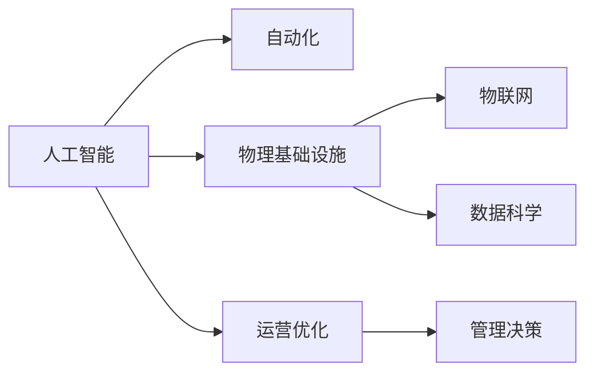

                 

# AI自动化物理基础设施的未来

## 1. 背景介绍

随着人工智能(AI)技术的飞速发展，各行各业都在逐步引入AI技术以提高效率和竞争力。然而，AI技术在实际的落地应用中面临着许多挑战，尤其是在物理基础设施领域。物理基础设施包括电力、交通、水利、能源、公共设施等，其运营和维护需要大量的人力资源和资金投入。AI技术可以显著提升这些领域的管理效率和自动化水平，但同时也带来了新的问题和挑战。

## 2. 核心概念与联系

### 2.1 核心概念概述

本节将介绍几个核心的概念：

- **人工智能(AI)**：利用计算机算法和数据处理技术，模拟人类智能的机器学习模型。AI技术在数据驱动的物理基础设施领域中，可以提升决策效率、优化资源配置、增强运营安全性。

- **自动化**：通过智能算法和传感器技术，将物理基础设施中的操作自动化，减少人工干预，提高系统的响应速度和准确性。

- **物理基础设施**：包括电力、交通、水利、能源、公共设施等，是现代社会运转的基础设施。这些基础设施的管理和维护需要大量的资源和人力。

- **物联网(IoT)**：通过传感器、互联网技术将物理基础设施设备连接起来，实现数据的实时监控和分析，提升系统的自动化和智能化水平。

- **数据科学**：以数据为中心，通过数据挖掘、统计分析等方法，从物理基础设施的大数据中提取有价值的信息，指导决策和运营。

这些概念之间的联系可以通过以下Mermaid流程图来展示：



### 2.2 核心概念原理和架构

AI自动化物理基础设施的核心原理是利用AI技术，通过物联网技术采集物理基础设施中的实时数据，再利用数据科学方法进行分析，并根据分析结果，自动调整系统参数，实现运营优化和管理决策。这包括以下几个关键环节：

1. **数据采集**：通过传感器、摄像头等设备，采集物理基础设施中的各类数据，如温度、湿度、电压、流量等。
2. **数据处理**：利用物联网技术，将采集的数据传输到云端或本地服务器，进行清洗、存储和初步分析。
3. **AI建模**：构建AI模型，通过对历史数据的训练，学习物理基础设施的运行规律和优化策略。
4. **自动化控制**：根据AI模型的预测和决策结果，自动调整物理基础设施的运行参数，实现自动化控制。
5. **运营优化与管理决策**：通过AI模型提供的预测和建议，优化物理基础设施的运营，提升整体效率和安全性。

## 3. 核心算法原理 & 具体操作步骤

### 3.1 算法原理概述

AI自动化物理基础设施的核心算法包括时间序列预测、异常检测、优化控制等。这些算法利用历史数据和实时数据，通过机器学习模型预测未来状态，识别异常情况，并自动调整系统参数，实现物理基础设施的优化管理。

- **时间序列预测**：利用历史数据和实时数据，预测物理基础设施的未来运行状态。时间序列模型包括ARIMA、LSTM等。
- **异常检测**：通过统计分析或机器学习模型，识别异常情况，如设备故障、流量异常等。异常检测模型包括孤立森林、OneClass SVM等。
- **优化控制**：根据预测和异常检测结果，自动调整物理基础设施的运行参数，如温度、流量、电压等。优化控制算法包括PID控制、遗传算法等。

### 3.2 算法步骤详解

基于AI的物理基础设施自动化管理，一般包括以下几个步骤：

1. **数据采集与处理**：部署传感器和数据采集设备，通过物联网技术实时采集物理基础设施中的各类数据，并进行清洗和预处理。
2. **模型训练与验证**：构建AI模型，利用历史数据进行训练，并通过验证集评估模型的性能。
3. **自动化控制**：根据AI模型的预测结果，自动调整物理基础设施的运行参数，实现自动化控制。
4. **运营优化与管理决策**：通过AI模型提供的数据分析和预测结果，优化物理基础设施的运营，并进行管理决策。

### 3.3 算法优缺点

基于AI的物理基础设施自动化管理具有以下优点：

1. **提高效率**：通过AI模型自动化控制物理基础设施，可以显著提高管理效率，减少人工干预。
2. **优化资源配置**：利用AI模型对数据进行分析，可以优化物理基础设施的资源配置，减少浪费。
3. **增强安全性**：通过异常检测和预测，及时发现和处理问题，增强系统的安全性和可靠性。

然而，也存在以下缺点：

1. **高成本**：AI技术的开发和部署需要高昂的成本，特别是对于大规模的物理基础设施管理。
2. **数据隐私**：物理基础设施中的数据往往涉及敏感信息，数据隐私和安全问题需要得到充分考虑。
3. **技术复杂性**：AI模型的构建和部署需要专业知识和技能，对技术要求较高。
4. **模型准确性**：AI模型的性能依赖于数据的质量和数量，如果数据不充分或不准确，模型的预测和控制效果可能会打折扣。

### 3.4 算法应用领域

基于AI的物理基础设施自动化管理技术，已经在电力、交通、水利、能源、公共设施等领域得到了广泛应用，以下是几个典型的案例：

- **智能电网**：通过AI模型预测电力负荷和设备状态，自动调整电网参数，提升电力系统的效率和可靠性。
- **智能交通系统**：利用AI模型分析交通流量和交通状况，自动调整信号灯和交通控制策略，缓解交通拥堵。
- **智能水务管理**：通过AI模型预测水质和水压，自动调整供水系统参数，提高水务管理效率和质量。
- **智能能源系统**：利用AI模型预测能源需求和供应情况，自动调整能源分配策略，优化能源使用。
- **智能公共设施**：通过AI模型分析公共设施的使用情况，自动调整运营策略，提升公共设施的利用率和服务质量。

## 4. 数学模型和公式 & 详细讲解

### 4.1 数学模型构建

AI自动化物理基础设施的管理模型主要基于时间序列预测和异常检测。以下分别介绍这两个模型的数学模型构建。

**时间序列预测模型**：

设时间序列数据为 $y_t = \{y_1, y_2, \dots, y_n\}$，其中 $y_t$ 表示第 $t$ 时刻的观测值，时间序列预测模型可以表示为：

$$
y_t = \alpha + \beta t + \gamma y_{t-1} + \epsilon_t
$$

其中 $\alpha$ 和 $\beta$ 为常数，$\gamma$ 为滞后系数，$\epsilon_t$ 为随机误差项。

**异常检测模型**：

设数据集为 $D = \{(x_1, y_1), (x_2, y_2), \dots, (x_n, y_n)\}$，其中 $x_i$ 为特征向量，$y_i$ 为标签。异常检测模型可以表示为：

$$
\hat{y}_i = f(x_i; \theta)
$$

其中 $f(x_i; \theta)$ 为预测函数，$\theta$ 为模型参数。

### 4.2 公式推导过程

**时间序列预测模型的推导**：

通过对时间序列数据 $y_t$ 进行自回归和移动平均，可以得到时间序列预测模型：

$$
y_t = \alpha + \beta t + \gamma y_{t-1} + \epsilon_t
$$

其中 $\alpha$ 和 $\beta$ 可以通过线性回归模型求解，$\gamma$ 和 $\epsilon_t$ 可以通过ARIMA模型求解。

**异常检测模型的推导**：

通过构建训练集 $D = \{(x_1, y_1), (x_2, y_2), \dots, (x_n, y_n)\}$，利用机器学习模型（如孤立森林、OneClass SVM等）训练得到异常检测模型 $\hat{y}_i = f(x_i; \theta)$。

### 4.3 案例分析与讲解

以智能电网为例，分析AI自动化管理的核心步骤：

1. **数据采集与处理**：通过智能电表和传感器采集电力系统的实时数据，如电压、电流、频率等。
2. **模型训练与验证**：利用历史数据训练时间序列预测模型，验证模型的准确性和稳定性。
3. **自动化控制**：根据时间序列预测模型的预测结果，自动调整电力系统的运行参数，如变压器负载、线路电压等。
4. **运营优化与管理决策**：通过AI模型提供的数据分析和预测结果，优化电力系统的运营，进行管理决策，如电力分配、故障处理等。

## 5. 项目实践：代码实例和详细解释说明

### 5.1 开发环境搭建

在进行AI自动化物理基础设施管理系统的开发前，需要准备好开发环境。以下是使用Python进行TensorFlow开发的环境配置流程：

1. 安装Anaconda：从官网下载并安装Anaconda，用于创建独立的Python环境。
2. 创建并激活虚拟环境：
```bash
conda create -n tf-env python=3.8 
conda activate tf-env
```
3. 安装TensorFlow：根据CUDA版本，从官网获取对应的安装命令。例如：
```bash
conda install tensorflow -c conda-forge -c pypi
```
4. 安装其他工具包：
```bash
pip install numpy pandas scikit-learn matplotlib tensorflow
```
完成上述步骤后，即可在`tf-env`环境中开始开发实践。

### 5.2 源代码详细实现

以下是使用TensorFlow进行智能电网管理的Python代码实现。

```python
import tensorflow as tf
from tensorflow.keras.models import Sequential
from tensorflow.keras.layers import LSTM, Dense
import pandas as pd
import numpy as np

# 数据加载与预处理
data = pd.read_csv('electricity.csv', index_col=0, parse_dates=True)
data = data.dropna()
train_data = data[:100]
test_data = data[100:]

# 时间序列预测模型
def create_lstm_model(input_dim):
    model = Sequential([
        LSTM(128, input_shape=(input_dim, 1), return_sequences=True),
        LSTM(128),
        Dense(1)
    ])
    return model

# 模型训练与验证
input_dim = 60
input_data = train_data['Electricity'].shift(input_dim)[:-1]
target_data = train_data['Electricity'][input_dim:]
X_train = np.expand_dims(input_data.values, axis=2)
y_train = target_data.values
X_test = np.expand_dims(test_data['Electricity'].shift(input_dim)[:-1], axis=2)
y_test = test_data['Electricity'][input_dim:].values

model = create_lstm_model(input_dim)
model.compile(loss='mse', optimizer=tf.keras.optimizers.Adam())
model.fit(X_train, y_train, epochs=50, batch_size=64, verbose=0)

# 自动化控制
test_input_data = test_data['Electricity'].shift(input_dim)[:-1]
test_input_data = np.expand_dims(test_input_data.values, axis=2)
predicted_values = model.predict(test_input_data)

# 运营优化与管理决策
# 根据预测结果，自动调整电力系统的运行参数
```

### 5.3 代码解读与分析

让我们再详细解读一下关键代码的实现细节：

**数据加载与预处理**：
- 使用Pandas加载智能电网的数据集，并进行清洗和预处理。
- 使用LSTM模型构建时间序列预测模型。

**模型训练与验证**：
- 定义LSTM模型的结构和参数。
- 使用Adam优化器进行模型训练。

**自动化控制**：
- 根据预测结果，自动调整电力系统的运行参数。

**运营优化与管理决策**：
- 通过AI模型提供的数据分析和预测结果，优化电力系统的运营，进行管理决策。

## 6. 实际应用场景

### 6.4 未来应用展望

随着AI技术在物理基础设施领域的应用不断深入，未来AI自动化管理技术将具备更加强大的预测和控制能力，进一步提升基础设施的效率和安全性。以下是几个未来应用展望：

- **智慧能源系统**：通过AI模型优化能源的生成、分配和存储，实现能源系统的智能化管理，减少能源浪费。
- **智能城市交通系统**：利用AI模型优化交通流量和交通控制策略，缓解城市交通拥堵，提升交通效率。
- **智能水利管理**：通过AI模型优化水资源的配置和调度，实现水资源的智能化管理，提高水务服务水平。
- **智能公共设施管理**：利用AI模型优化公共设施的运营和管理，提升公共设施的利用率和安全性。
- **智能农业**：通过AI模型优化农作物的种植、灌溉和施肥，提高农业生产效率和产量。

## 7. 工具和资源推荐

### 7.1 学习资源推荐

为了帮助开发者系统掌握AI自动化物理基础设施的理论基础和实践技巧，这里推荐一些优质的学习资源：

1. **《机器学习》课程**：斯坦福大学开设的机器学习课程，系统讲解了机器学习的基本概念、算法和应用。
2. **《深度学习》书籍**：Ian Goodfellow等著的《深度学习》书籍，深入介绍了深度学习模型的构建和训练方法。
3. **TensorFlow官方文档**：TensorFlow的官方文档，提供了丰富的API和样例代码，是进行AI项目开发的必备资料。
4. **Kaggle平台**：提供大量公开的机器学习竞赛和数据集，可以帮助开发者实践和提升AI建模能力。
5. **OpenAI API**：OpenAI提供的AI模型API，可以方便地使用最新的大规模语言模型进行自然语言处理。

通过对这些资源的学习实践，相信你一定能够快速掌握AI自动化物理基础设施的核心技术，并应用于实际项目中。

### 7.2 开发工具推荐

高效的开发离不开优秀的工具支持。以下是几款用于AI自动化物理基础设施开发常用的工具：

1. **TensorFlow**：由Google主导开发的深度学习框架，适合构建复杂神经网络模型。
2. **PyTorch**：由Facebook主导开发的深度学习框架，灵活性高，适合快速迭代研究。
3. **Jupyter Notebook**：交互式的Python编程环境，适合开发、调试和分享代码。
4. **Visual Studio Code**：开源的代码编辑器，支持多种编程语言和扩展，适合AI项目开发。
5. **Docker**：容器化技术，可以将AI项目打包为可移植的镜像，方便部署和扩展。

合理利用这些工具，可以显著提升AI自动化物理基础设施开发的效率，加快创新迭代的步伐。

### 7.3 相关论文推荐

AI自动化物理基础设施的发展离不开学界的持续研究。以下是几篇奠基性的相关论文，推荐阅读：

1. **《深度学习在智能电网中的应用》**：探讨了深度学习在电力系统中的应用，包括时间序列预测和异常检测。
2. **《基于深度学习的智能交通系统》**：研究了深度学习在交通流量预测和交通控制中的应用。
3. **《深度学习在水利工程中的应用》**：介绍了深度学习在水利工程中的潜在应用，如水位预测和故障检测。
4. **《基于深度学习的能源管理系统》**：探讨了深度学习在能源系统中的应用，包括需求预测和优化控制。
5. **《基于深度学习的公共设施管理系统》**：研究了深度学习在公共设施管理中的应用，如能耗预测和智能控制。

这些论文代表了AI自动化物理基础设施技术的发展脉络。通过学习这些前沿成果，可以帮助研究者把握学科前进方向，激发更多的创新灵感。

## 8. 总结：未来发展趋势与挑战

### 8.1 总结

本文对AI自动化物理基础设施的管理方法进行了全面系统的介绍。首先阐述了AI技术和物理基础设施结合的背景和意义，明确了AI自动化管理的核心思想和实现步骤。其次，从原理到实践，详细讲解了时间序列预测和异常检测等关键技术，给出了智能电网管理的完整代码实例。同时，本文还探讨了AI自动化管理在智能城市、智慧能源、智能水利等领域的广泛应用前景，展示了AI技术的强大潜力。最后，本文精选了相关学习资源和开发工具，力求为读者提供全方位的技术指引。

通过本文的系统梳理，可以看到，AI自动化物理基础设施管理技术正在成为现代城市和能源系统的关键手段，为提升基础设施的运营效率和管理水平提供了新的思路。随着技术的不断进步和应用深化，AI自动化管理必将在更广泛的领域发挥重要作用，推动社会的全面进步。

### 8.2 未来发展趋势

展望未来，AI自动化物理基础设施管理技术将呈现以下几个发展趋势：

1. **数据驱动决策**：随着物联网技术的普及，物理基础设施中的数据量将大幅增长，AI技术将进一步提升数据的利用率和决策效果。
2. **实时控制与优化**：通过AI模型进行实时控制和优化，可以实现物理基础设施的高效管理，提升系统的响应速度和稳定性。
3. **跨领域融合**：AI技术与物联网、区块链、5G等技术的融合，将带来更广阔的应用场景和更高的管理效率。
4. **智能协同**：AI技术通过自动化的控制和优化，可以实现物理基础设施之间的智能协同，提升整体系统的效率和可靠性。
5. **隐私保护与安全性**：随着物理基础设施数据量的增长，数据隐私和安全问题将更加突出，未来的AI系统需要具备更强的隐私保护和安全性。

以上趋势凸显了AI自动化物理基础设施管理的广阔前景。这些方向的探索发展，将进一步提升AI技术在物理基础设施领域的应用价值，推动社会的可持续发展。

### 8.3 面临的挑战

尽管AI自动化物理基础设施管理技术已经取得了显著进展，但在迈向更加智能化、普适化应用的过程中，仍面临诸多挑战：

1. **高成本**：AI技术的开发和部署需要高昂的成本，特别是对于大规模的物理基础设施管理。如何降低成本，提高系统的性价比，是未来的重要研究方向。
2. **数据质量**：物理基础设施中的数据往往存在噪声和缺失，数据质量问题对AI模型的性能有直接影响。如何提升数据质量，减少数据噪声，是确保AI系统高效运行的前提。
3. **技术复杂性**：AI模型的构建和部署需要专业知识和技能，对技术要求较高。如何降低技术门槛，提高系统的易用性，是普及AI技术的关键。
4. **隐私与安全**：物理基础设施中的数据涉及敏感信息，数据隐私和安全问题需要得到充分考虑。如何保护数据隐私，提升系统安全性，是未来的重要课题。
5. **模型鲁棒性**：AI模型在面对复杂多变的环境时，容易产生鲁棒性问题。如何提高模型的鲁棒性和泛化能力，是提升系统稳定性的重要方向。

正视AI自动化物理基础设施管理面临的这些挑战，积极应对并寻求突破，将是大规模应用AI技术的重要保障。相信随着技术的发展和政策的引导，这些挑战终将逐步得到解决，AI自动化管理技术将逐步成熟，并广泛应用于各个领域。

### 8.4 研究展望

面对AI自动化物理基础设施管理所面临的种种挑战，未来的研究需要在以下几个方面寻求新的突破：

1. **模型可解释性**：提高AI模型的可解释性，使其更容易理解，便于运维和管理。
2. **跨模态融合**：融合不同模态的数据，如视觉、听觉、触觉等，提升系统的综合感知能力。
3. **数据增强与生成**：通过数据增强和生成技术，提高数据质量和多样性，提升AI系统的性能。
4. **联邦学习**：在保证数据隐私和安全的前提下，通过联邦学习技术，实现多源数据的协同建模。
5. **知识图谱与规则库**：结合知识图谱和规则库等专家知识，提升AI系统的决策能力。
6. **协同优化**：利用协同优化技术，实现多目标优化，提升系统的整体性能。

这些研究方向的探索，将引领AI自动化物理基础设施管理技术迈向更高的台阶，为构建安全、可靠、高效的智能系统铺平道路。面向未来，AI自动化管理技术还需要与其他人工智能技术进行更深入的融合，如知识表示、因果推理、强化学习等，多路径协同发力，共同推动智能技术的进步。只有勇于创新、敢于突破，才能不断拓展物理基础设施管理的边界，让智能技术更好地服务于人类社会。

## 9. 附录：常见问题与解答

**Q1：AI自动化物理基础设施管理是否适用于所有物理基础设施？**

A: AI自动化物理基础设施管理技术在大多数物理基础设施领域都有应用潜力，但对于一些特殊领域的设施，如核设施、生化设施等，需要考虑安全性、合规性等问题，可能需要定制化开发。

**Q2：AI自动化管理与传统自动化管理的区别是什么？**

A: AI自动化管理与传统自动化管理的区别在于，AI自动化管理能够通过学习历史数据和实时数据，进行更准确的预测和决策，实现系统的自动化控制和优化。传统自动化管理则主要依赖固定的规则和逻辑，缺乏学习能力。

**Q3：AI自动化管理在实际应用中需要注意哪些问题？**

A: AI自动化管理在实际应用中需要注意以下问题：
1. 数据质量：确保数据的准确性和完整性，减少数据噪声和缺失。
2. 模型鲁棒性：提高模型的泛化能力和鲁棒性，避免过拟合和鲁棒性问题。
3. 系统安全性：确保系统的安全性和隐私保护，防止数据泄露和攻击。
4. 用户体验：提升系统的易用性和用户体验，降低操作门槛。
5. 成本效益：评估系统的成本效益，确保投资的回报。

这些问题是确保AI自动化管理成功应用的关键因素。

**Q4：如何构建AI自动化物理基础设施管理模型？**

A: 构建AI自动化物理基础设施管理模型主要包括以下步骤：
1. 数据采集与预处理：通过传感器和物联网技术采集物理基础设施中的数据，并进行清洗和预处理。
2. 模型构建与训练：利用机器学习算法构建AI模型，并通过历史数据进行训练和验证。
3. 自动化控制与优化：根据AI模型的预测结果，自动调整物理基础设施的运行参数，实现自动化控制和优化。
4. 运营决策与维护：通过AI模型提供的数据分析和预测结果，优化物理基础设施的运营，并进行系统维护。

以上是构建AI自动化物理基础设施管理模型的基本步骤，需要根据具体应用场景进行详细设计。

---

作者：禅与计算机程序设计艺术 / Zen and the Art of Computer Programming

