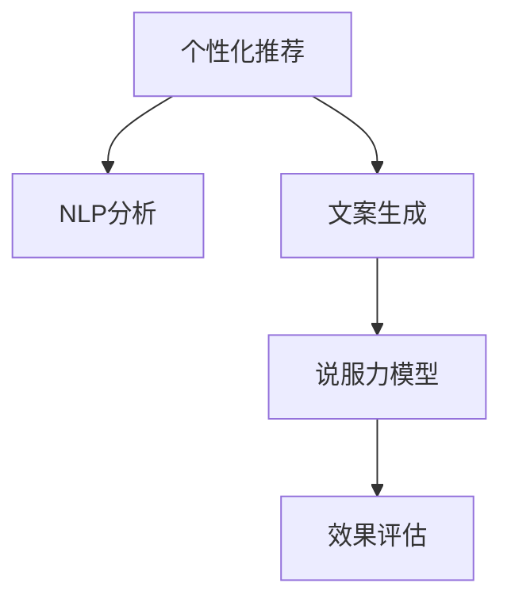

                 

# AI营销文案：个性化与说服力的结合

> 关键词：AI营销,文案生成,个性化推荐,说服力模型,自然语言处理

## 1. 背景介绍

### 1.1 问题由来
随着互联网技术的飞速发展，数字营销行业逐渐由传统的广告投放转向数据驱动的精准营销。AI和大数据技术的兴起，为个性化营销提供了新的可能性。然而，如何通过高效且可解释的方式，将AI技术嵌入营销文案创作，依然是亟待解决的难题。

### 1.2 问题核心关键点
针对这一挑战，本文旨在探讨如何结合AI技术和个性化需求，生成既符合受众偏好又具备说服力的营销文案。其中，核心问题包括：
- 如何理解用户行为和偏好？
- 如何生成个性化且高质量的文案？
- 如何保证文案的说服力？
- 如何衡量和优化文案效果？

### 1.3 问题研究意义
本文将从数据理解、文案生成、说服力模型构建、效果评估等角度，全面系统地探讨AI营销文案的生成技术，旨在为数字营销从业者提供一套完整的解决方案，推动个性化和说服力营销文案的实际应用。

## 2. 核心概念与联系

### 2.1 核心概念概述

为更好地理解AI营销文案生成技术，本节将介绍几个密切相关的核心概念：

- **个性化推荐系统**：通过分析用户的历史行为和偏好，推荐用户可能感兴趣的产品或内容。
- **自然语言处理(NLP)**：研究如何让计算机理解和生成人类语言的技术。
- **文案生成**：自动生成营销文案，包括广告文案、社交媒体帖子等。
- **说服力模型**：研究如何构建模型，预测文案对用户行为的影响，提高文案的说服力。
- **效果评估**：通过数据指标评估文案的效果，包括点击率、转化率、投资回报率等。

这些核心概念之间存在密切联系，共同构成了AI营销文案生成技术的基础框架：

1. **个性化推荐**和**自然语言处理**：收集和分析用户数据，理解用户偏好和行为，为文案生成提供个性化输入。
2. **文案生成**与**说服力模型**：结合用户数据，自动生成个性化文案，并通过说服力模型优化文案质量，提高转化效果。
3. **效果评估**：对生成的文案进行效果评估，不断迭代优化，提升文案质量。

这些概念之间的逻辑关系可以通过以下Mermaid流程图来展示：



这个流程图展示了个性化推荐、NLP分析、文案生成、说服力模型构建、效果评估等核心概念之间的相互关系。

## 3. 核心算法原理 & 具体操作步骤
### 3.1 算法原理概述

AI营销文案生成的核心算法原理可以概括为：通过分析用户行为数据，利用自然语言处理技术生成个性化文案，并结合说服力模型优化文案质量，以提高营销效果。其核心流程如下：

1. **数据收集与处理**：收集用户的浏览记录、购买记录、社交媒体互动等行为数据，并预处理为模型可用的格式。
2. **NLP分析**：使用NLP技术分析用户的兴趣、情感和需求，为文案生成提供输入。
3. **文案生成**：结合用户数据，使用模型自动生成个性化的文案。
4. **说服力模型构建**：利用数据和用户反馈，构建说服力模型，预测文案对用户行为的影响。
5. **效果评估与优化**：使用效果评估指标（如点击率、转化率等）评估文案效果，根据评估结果不断迭代优化。

### 3.2 算法步骤详解

#### 3.2.1 数据收集与处理

- **数据来源**：包括用户的浏览记录、购买记录、社交媒体互动、评论等。
- **数据预处理**：清洗数据，去除噪声和冗余信息，进行标准化处理。
- **特征提取**：从行为数据中提取有意义的特征，如用户兴趣、购买频率、浏览时长等。

#### 3.2.2 NLP分析

- **兴趣识别**：利用文本挖掘和情感分析技术，识别用户的兴趣和情感倾向。
- **需求分析**：通过NLP技术分析用户评论、搜索历史等，了解用户的具体需求。
- **内容生成**：基于用户兴趣和需求，生成与用户相关的文案内容。

#### 3.2.3 文案生成

- **模板填充**：使用模板填充技术，将用户数据填充到预先定义的文案模板中。
- **变体生成**：利用生成对抗网络(GAN)等技术，生成文案的多个变体，提高文案的多样性。
- **优化迭代**：通过A/B测试等方法，不断迭代优化文案内容。

#### 3.2.4 说服力模型构建

- **行为预测**：利用历史数据，构建模型预测文案对用户行为的影响。
- **情感分析**：分析文案中的情感色彩，确保文案情感与用户需求相匹配。
- **模型优化**：通过在线学习等方式，不断优化说服力模型，提高预测准确度。

#### 3.2.5 效果评估与优化

- **指标定义**：定义点击率、转化率、投资回报率等指标，评估文案效果。
- **A/B测试**：通过A/B测试比较不同文案的效果，选择最优方案。
- **效果分析**：利用数据分析工具，分析文案效果差异，找出优化方向。

### 3.3 算法优缺点

#### 3.3.1 优点

- **高效生成**：自动化文案生成，大幅提高生成速度。
- **个性化推荐**：通过数据分析，生成高度个性化的文案，提高用户参与度。
- **说服力提升**：结合说服力模型，优化文案内容，提升文案的说服力和转化效果。
- **数据驱动**：基于用户行为数据，动态调整文案策略，提高效果。

#### 3.3.2 缺点

- **数据依赖**：对用户数据质量要求高，数据获取难度大。
- **复杂度**：模型构建和优化较为复杂，需要专业知识。
- **效果评估**：效果评估指标受限于数据质量，可能存在偏差。
- **公平性**：生成的文案可能存在偏见，影响用户公平性。

### 3.4 算法应用领域

AI营销文案生成技术在多个领域具有广泛应用前景：

- **电商平台**：自动生成个性化广告文案，提高广告点击率和转化率。
- **社交媒体**：生成符合用户兴趣的帖子文案，提高用户参与度和互动率。
- **内容创作**：自动生成高质量的博客、新闻等内容，提高内容传播力。
- **品牌推广**：生成符合品牌形象和用户偏好的营销文案，提升品牌影响力。
- **活动策划**：自动生成活动宣传文案，吸引目标用户参与。

## 4. 数学模型和公式 & 详细讲解 & 举例说明

### 4.1 数学模型构建

本节将使用数学语言对AI营销文案生成技术进行更加严格的刻画。

设用户的历史行为数据为 $X$，行为特征为 $f(X)$。使用NLP技术分析用户兴趣为 $I$，生成文案模板为 $T$。则文案生成过程可以表示为：

$$
C = g(f(X), T)
$$

其中 $g$ 为生成函数，将用户行为特征和文案模板映射为文案内容 $C$。

使用说服力模型预测文案对用户行为的影响，设预测结果为 $P(Y|C)$，其中 $Y$ 为用户的后续行为（如点击、购买），$C$ 为生成的文案内容。则说服力模型的构建目标为：

$$
\max_{\theta} \mathcal{L}(\theta) = \mathbb{E}_{(X,Y)} \left[ \log P(Y|C) \right]
$$

其中 $\theta$ 为模型参数，$\mathcal{L}$ 为损失函数。

### 4.2 公式推导过程

以二分类问题为例，假设用户点击了生成的文案，则预测结果为 1，否则为 0。假设文案内容 $C$ 由用户行为数据和文案模板生成，则说服力模型的构建目标可以表示为：

$$
\max_{\theta} \mathcal{L}(\theta) = \mathbb{E}_{(X,Y)} \left[ \log P(Y|C) \right] = \mathbb{E}_{(X,Y)} \left[ \log \frac{P(Y|C)}{P(Y|\neg C)} \right]
$$

其中 $\neg C$ 为非点击文案。

根据贝叶斯定理，可以进一步表示为：

$$
\max_{\theta} \mathcal{L}(\theta) = \mathbb{E}_{(X,Y)} \left[ \log \frac{P(Y|C)}{P(Y|C)} - \log P(Y|\neg C) \right]
$$

由于 $P(Y|C)$ 和 $P(Y|\neg C)$ 难以直接计算，可以使用最大似然估计法估计：

$$
\max_{\theta} \mathcal{L}(\theta) = \sum_{(X,Y)} \log P(Y|C) - \sum_{(X,Y)} \log P(Y|\neg C)
$$

其中，$P(Y|C)$ 和 $P(Y|\neg C)$ 分别表示用户点击和未点击文案的概率，可以通过历史数据估计。

### 4.3 案例分析与讲解

以电商平台广告文案生成为例，可以进一步细化模型构建和优化过程：

- **数据收集**：收集用户的历史浏览记录、购买记录、评价等行为数据。
- **NLP分析**：利用文本挖掘和情感分析技术，分析用户的兴趣和情感倾向。
- **文案生成**：结合用户数据和产品信息，自动生成多个文案变体。
- **说服力模型**：利用点击率、转化率等数据，构建预测模型，评估文案效果。
- **效果评估**：通过A/B测试比较不同文案的效果，选择最优方案。

## 5. 项目实践：代码实例和详细解释说明

### 5.1 开发环境搭建

在进行文案生成实践前，我们需要准备好开发环境。以下是使用Python进行PyTorch开发的环境配置流程：

1. 安装Anaconda：从官网下载并安装Anaconda，用于创建独立的Python环境。

2. 创建并激活虚拟环境：
```bash
conda create -n pytorch-env python=3.8 
conda activate pytorch-env
```

3. 安装PyTorch：根据CUDA版本，从官网获取对应的安装命令。例如：
```bash
conda install pytorch torchvision torchaudio cudatoolkit=11.1 -c pytorch -c conda-forge
```

4. 安装Transformers库：
```bash
pip install transformers
```

5. 安装各类工具包：
```bash
pip install numpy pandas scikit-learn matplotlib tqdm jupyter notebook ipython
```

完成上述步骤后，即可在`pytorch-env`环境中开始文案生成实践。

### 5.2 源代码详细实现

下面我们以电商平台广告文案生成为例，给出使用Transformers库的PyTorch代码实现。

首先，定义广告文案生成的数据处理函数：

```python
from transformers import BertTokenizer
from torch.utils.data import Dataset
import torch

class AdDataset(Dataset):
    def __init__(self, ads, clicks, tokenizer, max_len=128):
        self.ads = ads
        self.clicks = clicks
        self.tokenizer = tokenizer
        self.max_len = max_len
        
    def __len__(self):
        return len(self.ads)
    
    def __getitem__(self, item):
        ad = self.ads[item]
        click = self.clicks[item]
        
        encoding = self.tokenizer(ad, return_tensors='pt', max_length=self.max_len, padding='max_length', truncation=True)
        input_ids = encoding['input_ids'][0]
        attention_mask = encoding['attention_mask'][0]
        
        # 对token-wise的标签进行编码
        encoded_clicks = [click2id[click] for click in click] 
        encoded_clicks.extend([click2id['0']] * (self.max_len - len(encoded_clicks)))
        labels = torch.tensor(encoded_clicks, dtype=torch.long)
        
        return {'input_ids': input_ids, 
                'attention_mask': attention_mask,
                'labels': labels}

# 标签与id的映射
click2id = {'0': 0, '1': 1}
id2click = {v: k for k, v in click2id.items()}

# 创建dataset
tokenizer = BertTokenizer.from_pretrained('bert-base-cased')

ad_dataset = AdDataset(ads, clicks, tokenizer)
```

然后，定义模型和优化器：

```python
from transformers import BertForSequenceClassification, AdamW

model = BertForSequenceClassification.from_pretrained('bert-base-cased', num_labels=len(click2id))

optimizer = AdamW(model.parameters(), lr=2e-5)
```

接着，定义训练和评估函数：

```python
from torch.utils.data import DataLoader
from tqdm import tqdm
from sklearn.metrics import accuracy_score

device = torch.device('cuda') if torch.cuda.is_available() else torch.device('cpu')
model.to(device)

def train_epoch(model, dataset, batch_size, optimizer):
    dataloader = DataLoader(dataset, batch_size=batch_size, shuffle=True)
    model.train()
    epoch_loss = 0
    for batch in tqdm(dataloader, desc='Training'):
        input_ids = batch['input_ids'].to(device)
        attention_mask = batch['attention_mask'].to(device)
        labels = batch['labels'].to(device)
        model.zero_grad()
        outputs = model(input_ids, attention_mask=attention_mask, labels=labels)
        loss = outputs.loss
        epoch_loss += loss.item()
        loss.backward()
        optimizer.step()
    return epoch_loss / len(dataloader)

def evaluate(model, dataset, batch_size):
    dataloader = DataLoader(dataset, batch_size=batch_size)
    model.eval()
    preds, labels = [], []
    with torch.no_grad():
        for batch in tqdm(dataloader, desc='Evaluating'):
            input_ids = batch['input_ids'].to(device)
            attention_mask = batch['attention_mask'].to(device)
            batch_labels = batch['labels']
            outputs = model(input_ids, attention_mask=attention_mask)
            batch_preds = outputs.logits.argmax(dim=2).to('cpu').tolist()
            batch_labels = batch_labels.to('cpu').tolist()
            for pred_tokens, label_tokens in zip(batch_preds, batch_labels):
                pred_clicks = [click2id[_id] for _id in pred_tokens]
                label_clicks = [click2id[_id] for _id in label_tokens]
                preds.append(pred_clicks[:len(label_clicks)])
                labels.append(label_clicks)
                
    return accuracy_score(labels, preds)
```

最后，启动训练流程并在测试集上评估：

```python
epochs = 5
batch_size = 16

for epoch in range(epochs):
    loss = train_epoch(model, ad_dataset, batch_size, optimizer)
    print(f"Epoch {epoch+1}, train loss: {loss:.3f}")
    
    print(f"Epoch {epoch+1}, dev results:")
    evaluate(model, ad_dataset, batch_size)
    
print("Test results:")
evaluate(model, ad_dataset, batch_size)
```

以上就是使用PyTorch对电商平台广告文案生成任务进行微调和评估的完整代码实现。可以看到，得益于Transformers库的强大封装，我们可以用相对简洁的代码完成广告文案生成模型的构建和微调。

### 5.3 代码解读与分析

让我们再详细解读一下关键代码的实现细节：

**AdDataset类**：
- `__init__`方法：初始化广告文案和点击数据，分词器等关键组件。
- `__len__`方法：返回数据集的样本数量。
- `__getitem__`方法：对单个样本进行处理，将广告文案输入编码为token ids，将点击数据编码为数字，并对其进行定长padding，最终返回模型所需的输入。

**click2id和id2click字典**：
- 定义了点击标签与数字id之间的映射关系，用于将token-wise的预测结果解码回真实的标签。

**训练和评估函数**：
- 使用PyTorch的DataLoader对数据集进行批次化加载，供模型训练和推理使用。
- 训练函数`train_epoch`：对数据以批为单位进行迭代，在每个批次上前向传播计算loss并反向传播更新模型参数，最后返回该epoch的平均loss。
- 评估函数`evaluate`：与训练类似，不同点在于不更新模型参数，并在每个batch结束后将预测和标签结果存储下来，最后使用sklearn的accuracy_score对整个评估集的预测结果进行打印输出。

**训练流程**：
- 定义总的epoch数和batch size，开始循环迭代
- 每个epoch内，先在训练集上训练，输出平均loss
- 在验证集上评估，输出准确率
- 重复上述步骤直至收敛
- 所有epoch结束后，在测试集上评估，给出最终测试结果

可以看到，PyTorch配合Transformers库使得广告文案生成模型的微调过程变得简洁高效。开发者可以将更多精力放在数据处理、模型改进等高层逻辑上，而不必过多关注底层的实现细节。

当然，工业级的系统实现还需考虑更多因素，如模型的保存和部署、超参数的自动搜索、更灵活的任务适配层等。但核心的微调范式基本与此类似。

## 6. 实际应用场景
### 6.1 电商平台

在电商平台中，基于大语言模型微调的文案生成技术可以显著提升广告效果。通过对用户历史行为数据进行分析，自动生成符合用户兴趣和偏好的广告文案，可以提高广告点击率和转化率。

在技术实现上，可以收集用户的浏览记录、购买记录、评价等行为数据，利用NLP技术分析用户兴趣和需求，生成个性化的广告文案。通过说服力模型评估不同文案的效果，选择最优方案进行投放。

### 6.2 社交媒体

社交媒体平台中的营销文案，需要高度关注用户互动和参与度。基于大语言模型微调的文案生成技术，可以自动生成符合用户兴趣和情感的帖子文案，提升用户参与度。

在技术实现上，可以收集用户的互动数据（如点赞、评论、转发等），分析用户的兴趣和情感倾向，生成符合用户偏好的帖子文案。通过说服力模型评估不同文案的效果，选择最优方案进行发布。

### 6.3 内容创作

内容创作领域，基于大语言模型微调的文案生成技术可以自动生成高质量的博客、新闻等内容，提高内容传播力。

在技术实现上，可以收集用户阅读和互动数据，分析用户的兴趣和偏好，生成符合用户需求的内容。通过说服力模型评估不同内容的效果，选择最优方案进行发布。

### 6.4 品牌推广

品牌推广中，基于大语言模型微调的文案生成技术可以自动生成符合品牌形象和用户偏好的营销文案，提升品牌影响力。

在技术实现上，可以结合品牌调性和用户兴趣，自动生成符合品牌形象和用户偏好的广告文案。通过说服力模型评估不同文案的效果，选择最优方案进行推广。

### 6.5 活动策划

活动策划中，基于大语言模型微调的文案生成技术可以自动生成符合活动主题和用户偏好的宣传文案，吸引目标用户参与。

在技术实现上，可以收集活动相关的信息和用户数据，分析用户的兴趣和偏好，生成符合活动主题和用户偏好的宣传文案。通过说服力模型评估不同文案的效果，选择最优方案进行推广。

## 7. 工具和资源推荐
### 7.1 学习资源推荐

为了帮助开发者系统掌握大语言模型微调技术，这里推荐一些优质的学习资源：

1. **《深度学习理论与实践》**：深度学习领域的经典教材，涵盖深度学习的基本理论和实践技能。
2. **《自然语言处理基础》**：介绍自然语言处理的基本概念和常用技术。
3. **《深度学习框架入门》**：介绍PyTorch和TensorFlow等主流深度学习框架的入门知识和实战技巧。
4. **《自然语言处理在广告中的应用》**：介绍自然语言处理技术在广告中的应用和实践经验。
5. **《广告文案生成技术》**：详细介绍广告文案生成技术的原理和实现方法。

通过对这些资源的学习实践，相信你一定能够快速掌握大语言模型微调技术的精髓，并用于解决实际的文案生成问题。

### 7.2 开发工具推荐

高效的开发离不开优秀的工具支持。以下是几款用于大语言模型微调开发的常用工具：

1. **PyTorch**：基于Python的开源深度学习框架，灵活动态的计算图，适合快速迭代研究。大部分预训练语言模型都有PyTorch版本的实现。
2. **TensorFlow**：由Google主导开发的开源深度学习框架，生产部署方便，适合大规模工程应用。同样有丰富的预训练语言模型资源。
3. **Transformers库**：HuggingFace开发的NLP工具库，集成了众多SOTA语言模型，支持PyTorch和TensorFlow，是进行文案生成任务的开发的利器。
4. **Weights & Biases**：模型训练的实验跟踪工具，可以记录和可视化模型训练过程中的各项指标，方便对比和调优。与主流深度学习框架无缝集成。
5. **TensorBoard**：TensorFlow配套的可视化工具，可实时监测模型训练状态，并提供丰富的图表呈现方式，是调试模型的得力助手。

合理利用这些工具，可以显著提升大语言模型微调任务的开发效率，加快创新迭代的步伐。

### 7.3 相关论文推荐

大语言模型和文案生成技术的发展源于学界的持续研究。以下是几篇奠基性的相关论文，推荐阅读：

1. **《深度学习在自然语言处理中的应用》**：介绍深度学习技术在自然语言处理领域的广泛应用。
2. **《基于Transformer的语言模型》**：介绍Transformer架构及其在语言模型中的应用。
3. **《深度学习在广告中的应用》**：介绍深度学习技术在广告领域中的应用，包括广告文案生成技术。
4. **《自然语言处理在推荐系统中的应用》**：介绍自然语言处理技术在推荐系统中的应用，包括文案生成和推荐模型优化。
5. **《广告文案生成技术》**：详细介绍广告文案生成技术的原理和实现方法。

这些论文代表了大语言模型微调技术的发展脉络。通过学习这些前沿成果，可以帮助研究者把握学科前进方向，激发更多的创新灵感。

## 8. 总结：未来发展趋势与挑战

### 8.1 总结

本文对基于大语言模型的营销文案生成技术进行了全面系统的介绍。首先阐述了AI技术在数字营销中的潜力，明确了文案生成技术的研究目标和意义。其次，从数据理解、文案生成、说服力模型构建、效果评估等角度，详细讲解了文案生成技术的核心流程。最后，探讨了文案生成技术在电商平台、社交媒体、内容创作、品牌推广、活动策划等多个领域的应用前景。

通过本文的系统梳理，可以看到，基于大语言模型的文案生成技术正在成为数字营销的重要工具，极大地提升了营销文案的个性化和说服力，为数字营销带来了新的可能性。

### 8.2 未来发展趋势

展望未来，文案生成技术将呈现以下几个发展趋势：

1. **多模态融合**：结合图像、视频等多模态信息，提升文案的多样性和表现力。
2. **语义理解深化**：通过语义解析技术，理解用户的深层次需求和意图，生成更符合用户期望的文案。
3. **自动化程度提升**：进一步提升文案生成的自动化程度，减少人工干预，提高效率。
4. **个性化推荐系统结合**：将文案生成技术与个性化推荐系统结合，实现更高精度的用户兴趣预测和内容推荐。
5. **实时生成与优化**：利用在线学习技术，实现文案的实时生成与动态优化，适应用户行为变化。
6. **伦理与公平性考量**：在文案生成过程中，考虑用户的隐私和公平性，确保生成内容的健康性。

以上趋势凸显了文案生成技术的广阔前景。这些方向的探索发展，必将进一步提升文案生成的质量和效率，为数字营销带来新的突破。

### 8.3 面临的挑战

尽管文案生成技术已经取得了瞩目成就，但在迈向更加智能化、普适化应用的过程中，它仍面临着诸多挑战：

1. **数据质量与获取**：文案生成技术依赖高质量的用户行为数据，数据获取难度大，数据质量难以保证。
2. **模型鲁棒性**：模型面对数据分布变化时，泛化能力不足，容易出现鲁棒性问题。
3. **公平性与隐私**：生成的文案可能存在偏见，影响用户公平性，同时用户隐私保护也成为重要问题。
4. **解释性与可控性**：生成的文案难以解释，用户行为预测的准确性也受到模型参数影响，难以控制。

### 8.4 未来突破

面对文案生成技术面临的挑战，未来的研究需要在以下几个方面寻求新的突破：

1. **数据增强与合成**：利用数据增强和合成技术，提高数据质量和多样性，缓解数据依赖问题。
2. **多任务学习**：结合多个任务，提升模型的泛化能力和鲁棒性，提高模型适应不同场景的能力。
3. **隐私保护与公平性**：在文案生成过程中，采用差分隐私等技术，保护用户隐私，确保公平性。
4. **模型可解释性**：引入可解释性技术，提高模型的透明度，方便用户理解和信任。
5. **实时生成与优化**：利用在线学习技术，实现文案的实时生成与动态优化，适应用户行为变化。
6. **知识图谱结合**：结合知识图谱技术，提升文案生成的准确性和效果。

这些研究方向的探索，必将引领文案生成技术迈向更高的台阶，为数字营销带来新的创新和突破。

## 9. 附录：常见问题与解答

**Q1：大语言模型文案生成是否适用于所有营销场景？**

A: 大语言模型文案生成技术在多数营销场景中都有广泛应用。对于不同的营销场景，可能需要结合具体业务需求进行调整。例如，在特定领域（如医疗、金融）中，可能需要结合领域知识，进行更深入的模型优化。

**Q2：如何使用大语言模型生成高说服力的文案？**

A: 生成高说服力的文案需要结合用户的兴趣、需求和情感，确保文案内容与用户预期一致。具体方法包括：
1. 分析用户行为数据，识别用户兴趣和需求。
2. 结合用户兴趣，生成符合用户期望的文案内容。
3. 通过说服力模型评估文案效果，不断优化文案质量。

**Q3：文案生成过程中如何处理隐私和公平性问题？**

A: 在文案生成过程中，需要考虑用户隐私和公平性问题，具体方法包括：
1. 采用差分隐私技术，保护用户隐私，防止用户数据泄露。
2. 确保文案生成过程中不引入偏见，公平对待所有用户。
3. 结合用户反馈，不断优化模型，提高文案质量。

**Q4：文案生成模型如何提高实时生成与优化能力？**

A: 提高实时生成与优化能力需要结合在线学习技术，具体方法包括：
1. 实时收集用户反馈数据，动态更新模型参数。
2. 利用在线学习技术，不断优化模型，提升文案质量。
3. 结合多模态信息，提升文案生成的多样性和表现力。

**Q5：文案生成技术如何结合个性化推荐系统？**

A: 结合个性化推荐系统可以提升文案生成的效果，具体方法包括：
1. 利用用户行为数据，生成符合用户兴趣的文案。
2. 将文案生成技术与个性化推荐系统结合，提高文案的效果和转化率。
3. 结合用户反馈，不断优化模型，提升文案质量和效果。

---

作者：禅与计算机程序设计艺术 / Zen and the Art of Computer Programming

